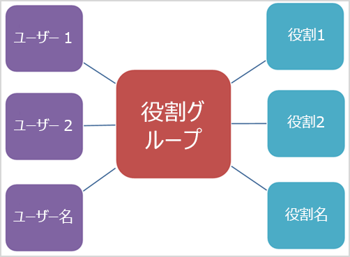
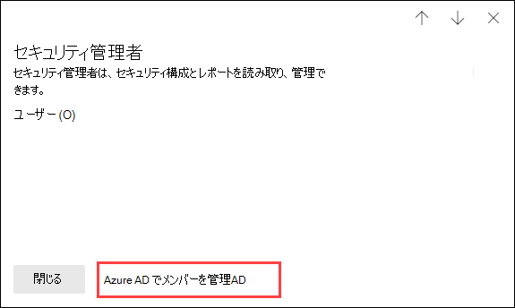

# Microsoft 365 Defender ポータルのアクセス許可

[!INCLUDE [Microsoft 365 Defender rebranding](../includes/microsoft-defender-for-office.md)]

**適用対象**
- [Exchange Online Protection](exchange-online-protection-overview.md)
- [Microsoft Defender for Office 365 プラン 1 およびプラン 2](defender-for-office-365.md)
- [Microsoft 365 Defender](../defender/microsoft-365-defender.md)

すべての Microsoft 365 サービスに関するセキュリティのシナリオを管理する必要があります。 また、組織内の適切なユーザーに適切な管理者権限を付与する柔軟性も必要です。

Microsoft 365 Defender ポータルは <https://security.microsoft.com> からアクセスできます。これは、Microsoft 365 でセキュリティ タスクを実行するユーザーのアクセス許可の直接的な管理をサポートします。 Microsoft 365 Defender ポータルを使用してアクセス許可を管理することで、セキュリティに関連するすべてのタスクについて、アクセス許可を一元的に管理できます。

Microsoft 365 Defender ポータルでアクセス許可を管理するには、**[アクセス許可と役割]** または <https://security.microsoft.com/securitypermissions> に移動します。 Microsoft 365 Defender ポータルで、**グローバル管理者** または **組織管理** 役割グループのメンバーである必要があります。 具体的には、**"役割の管理"** 役割を使用すると、ユーザーは Microsoft 365 Defender ポータルで役割グループの表示、作成、および変更をすることができます。また、この役割は既定で **"組織管理"** 役割グループにのみ割り当てられています。

> [!NOTE]
> Microsoft 365 コンプライアンス センターのアクセス許可については、「[Microsoft 365 コンプライアンス センターのアクセス許可](../../compliance/microsoft-365-compliance-center-permissions.md)」を参照してください。

## メンバー、役割、役割グループの関係

Microsoft 365 Defender ポータルのアクセス許可は、役割ベースのアクセス制御 (RBAC) の権限モデルに基づきます。 RBAC は、Microsoft 365 のほとんどのサービスで使用されているのと同じアクセス許可モデルです。そのため、これらのサービスのアクセス許可構造に慣れている場合、Microsoft 365 Defender ポータルでのアクセス許可の付与が非常によく似ていることに気づくでしょう。

**役割** は、一連のタスクを実行するアクセス許可を付与します。

**役割グループ** は、ユーザーが Microsoft 365 Defender ポータルで仕事を行えるようにする一連の役割です。

Microsoft 365 Defender ポータル> には、割り当てる必要がある最も一般的なタスクと機能の既定の役割グループが含まれています。通常では、この既定の役割グループに (個人ユーザーまたはグループを) **メンバー** として追加することをお勧めします。

## Microsoft 365 Defender ポータルの役割と役割グループ

Microsoft 365 Defender ポータルの <https://security.microsoft.com/securitypermissions> の **[アクセス許可と役割]** ページでは、次の種類の役割と役割グループを使用できます。

- **Azure AD ロール**: 役割と割り当てられたユーザーを表示できますが、Microsoft 365 Defender ポータルで直接管理することはできません。 Azure AD ロールは、**すべての** Microsoft 365 サービスでアクセス許可を割り当てる中心的な役割です。

- **メールと共同作業の役割**: セキュリティ/コンプライアンス センターで使用できるのと同じ役割グループですが、Microsoft 365 Defender ポータルから直接管理できます。 ここで割り当てるアクセス許可は Microsoft 365 Defender ポータル、Microsoft 365 コンプライアンス センター、およびセキュリティ/コンプライアンス センターに固有のものであり、他の Microsoft 365 ワークロードで必要なすべてのアクセス許可をカバーするものではありません。

### Microsoft 365 Defender ポータルの Azure AD ロール

<https://security.microsoft.com> で Microsoft 365 Defender ポータルを開き、**［Email とコラボレーション ロール］** \> **［アクセス許可と役割］** \> **［Azure AD ロール］** \> **［役割］** (または直接 <https://security.microsoft.com/aadpermissions>) に移動すると、このセクションで説明されている Azure AD ロールが表示されます。

役割を選択すると、役割の説明とユーザーの割り当てを含む詳細ポップアップが表示されます。 ただし、それらの割り当てを管理するには、詳細ポップアップで **[Azure AD でメンバーを管理する]** をクリックする必要があります。

詳細については、「[Azure Active Directory で管理者ロールを表示して割り当てる](/azure/active-directory/users-groups-roles/directory-manage-roles-portal)」を参照してください。

|役割|内容|
|---|---|
|**全体管理者**|Microsoft 365 サービスのすべての管理機能にアクセスできます。 他の管理者ロールを割り当てることができるのは全体管理者だけです。 詳細については、「[グローバル管理者または会社の管理者](/azure/active-directory/roles/permissions-reference#global-administrator--company-administrator)」を参照してください。|
|**コンプライアンス データ管理者**|Microsoft 365 全体の組織のデータを追跡し、保護されていることを確認し、あらゆる問題を把握してリスクを軽減することができます。詳細については、「[コンプライアンス データ管理者](/azure/active-directory/roles/permissions-reference#compliance-data-administrator)」を参照してください。|
|**コンプライアンス管理者**|組織が規制要件を遵守し続けること、電子情報開示ケースを管理すること、および Microsoft 365 の場所、ID、アプリ全体のデータ ガバナンス ポリシーを維持することを支援できます。詳細については、「[コンプライアンス管理者](/azure/active-directory/roles/permissions-reference#compliance-administrator)」を参照してください。|
|**セキュリティ オペレーター**|このロールを持つユーザーは、Microsoft 365 のユーザー、デバイス、コンテンツに対するアクティブな脅威を表示、調査、および対処します。 詳細については、「[セキュリティ オペレーター](/azure/active-directory/roles/permissions-reference#security-operator)」を参照してください。|
|**セキュリティ閲覧者**|Microsoft 365 のユーザー、デバイス、コンテンツに対するアクティブな脅威を表示と調査ができますが、セキュリティ オペレーターとは異なり、アクションを実行するアクセス許可はありません。詳細については、「[セキュリティ 閲覧者](/azure/active-directory/roles/permissions-reference#security-reader)」を参照してください。|
|**セキュリティ管理者**|セキュリティ ポリシーを管理し、Microsoft 365 製品全体のセキュリティ分析とレポートを確認し、脅威の情勢を十分に把握し続けることで、組織の全体的なセキュリティを制御できます。詳細については、「[セキュリティ 管理者](/azure/active-directory/roles/permissions-reference#security-administrator)」を参照してください。|
|**グローバル閲覧者**|読み取り専用バージョンの **グローバル閲覧者** のロール。 Microsoft 365 のすべての設定と管理情報を表示します。 詳細については、「[グローバル閲覧者](/azure/active-directory/roles/permissions-reference#global-reader)」を参照してください。|
|**攻撃のシミュレーションの管理者**|[攻撃シミュレーション](attack-simulation-training.md)の作成、シミュレーションの開始/スケジューリング、シミュレーション結果のレビューのすべての側面を作成および管理します。詳細については、「[攻撃シミュレーション管理者](/azure/active-directory/roles/permissions-reference#attack-simulation-administrator)」を参照してください。|
|**攻撃のペイロードの作成者**|攻撃のペイロードを作成しますが、実際に起動することやスケジュールすることはしません。 詳細については、「[攻撃のペイロードの作成者](/azure/active-directory/roles/permissions-reference#attack-payload-author)」を参照してください。|

### Microsoft 365 Defender ポータルのメールと共同作業の役割

<https://security.microsoft.com> で Microsoft 365 Defender ポータルを開き、**[メールと共同作業の役割]** \> **[アクセス許可と役割]** \> **[メールと共同作業の役割]** \> **[役割]** (または直接 <https://security.microsoft.com/emailandcollabpermissions>) に移動すると、セキュリティ/コンプライアンス センターで使用できるのと同じ役割グループが表示されます。

これらの役割グループの詳細については、「[セキュリティ/コンプライアンス センターの権限](permissions-in-the-security-and-compliance-center.md)」を参照してください。

#### Microsoft 365 Defender ポータルのメールと共同作業の役割メンバーシップを変更する

1. <https://security.microsoft.com> の Microsoft 365 Defender ポータルで、 **［メールと共同作業の役割］** \> **[アクセス許可と役割]** \> **[メールと共同作業の役割]** \> **[役割]** に移動します。**［アクセス許可］** ページに直接移動するには、<https://security.microsoft.com/emailandcollabpermissions> を使用します。

2. **[アクセス許可]** ページが開いたら、変更したい役割グループをリストから選択します。 **[名前]** 列ヘッダーをクリックしてリストを名前で並べ替えるか、**[検索]** ![[検索アイコン]](../../media/m365-cc-sc-search-icon.png) をクリックします。 これで役割グループを検索できます。

3. 役割グループの詳細ポップアップが表示されたら、**[メンバー]** セクションで **[編集]** をクリックします。

4. **[メンバーの選択の編集]** ページが開いたら、次のいずれかの手順を実行します。
   - 役割グループのメンバーが存在しない場合、**[メンバーの選択]** をクリックします。
   - 役割グループのメンバーが存在する場合、**[編集]** をクリックします。

5. **[メンバーの選択]** ポップアップが表示されたら、次のいずれかの手順を実行します。

   - **[追加]** をクリックします。 ユーザーの一覧が表示されたら、1 人以上のユーザーを選択します。 または、**[検索]** ![[検索アイコン]](../../media/m365-cc-sc-search-icon.png) をクリックします。 ユーザーを探して選択するためです。

     追加するユーザーを選択したら、**[追加]** をクリックします。

   - **[削除]** をクリックします。 存在するメンバーを 1 人以上選択します。 または、**[検索]** ![[検索アイコン]](../../media/m365-cc-sc-search-icon.png) をクリックします。 メンバーを見つけて選択するためです。

     削除するユーザーを選択したら、**[削除]** をクリックします。

6. **[メンバーの選択]** ポップアップに戻り、**[完了]** をクリックします。

7. **[メンバーの選択の編集]** ページに戻り、**[保存]** をクリックします。

8. 役割グループの詳細ポップアップに戻り、**[完了]** をクリックします。
