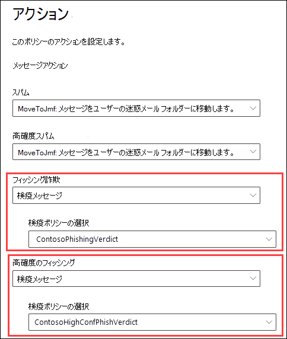
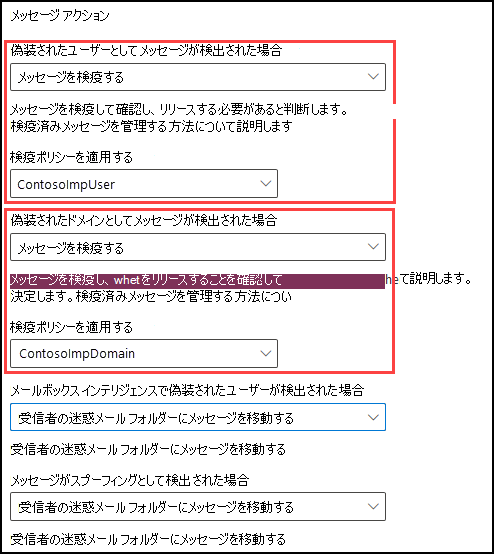
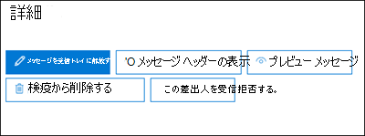
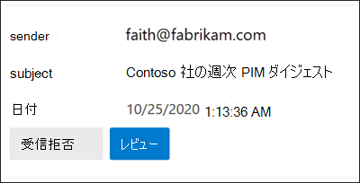
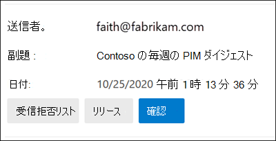

# <a name="quarantine-policies"></a>検疫ポリシー

Exchange Online Protection (EOP _) および_ Office 365 用 Microsoft Defender の検疫ポリシー (以前は検疫タグ) を使用すると、管理者はメッセージが検疫された理由に基づいて、検疫されたメッセージに対してユーザーが実行できる操作を制御できます。

従来、ユーザーは、メッセージが検疫された理由に基づいて、検疫メッセージに対する対話のレベルを許可または拒否されています。 たとえば、ユーザーはスパム対策フィルターによって検疫されたメッセージをスパムまたはバルクとして表示および解放できますが、高信頼のフィッシングやマルウェアとして検疫されたメッセージを表示または解放できます。

サポート [されている保護機能](#step-2-assign-a-quarantine-policy-to-supported-features)の場合、検疫ポリシーは、検疫および検疫通知で、ユーザーが自分のメッセージ (受信者であるメッセージ) に対して実行できる操作を _指定します_。 [検疫通知](use-spam-notifications-to-release-and-report-quarantined-messages.md) は、エンド ユーザーのスパム通知に代わるものです。 これらの通知は検疫ポリシーによって制御され、サポートされている保護機能 (スパム対策ポリシーとフィッシング対策ポリシーの評決) に関する検疫済みメッセージに関する情報が含まれます。

履歴ユーザー機能を適用する既定の検疫ポリシーは、メッセージを検疫するサポートされている保護機能のアクションに自動的に割り当てられます。 または、カスタム検疫ポリシーを作成し、それらをサポートされている保護機能に割り当て、ユーザーが検疫されたメッセージの種類に対して特定のアクションを実行する許可または防止を行うことができます。

個々の検疫ポリシーのアクセス許可は、次の事前設定されたアクセス許可グループに組み合わされます。

- アクセスなし
- 制限付きアクセス
- フル アクセス

事前設定されたアクセス許可グループに含まれる個々の検疫ポリシーのアクセス許可について、次の表で説明します。

<br>

****

|アクセス許可|アクセスなし|制限付きアクセス|フル アクセス|
|---|:---:|:---:|:---:|
|**送信者をブロック** する (_PermissionToBlockSender_)||||
|**Delete** (_PermissionToDelete_)||||
|**プレビュー** (_PermissionToPreview_)||||
|**受信者に検疫からのメッセージの解放を許可** する (_PermissionToRelease_)||||
|**受信者がメッセージを検疫から解放** する要求を許可する (_PermissionToRequestRelease_)||||
|

既定の検疫ポリシー、関連付けられたアクセス許可グループ、および検疫通知が有効になっているかどうかについては、次の表で説明します。

<br>

|既定の検疫ポリシー|使用されるアクセス許可グループ|検疫通知が有効になっていますか?|
|---|---|---|
|AdminOnlyAccessPolicy|アクセスなし|いいえ|
|DefaultFullAccessPolicy|フル アクセス|いいえ|
|NotificationEnabledPolicy<sup>\*</sup>|フル アクセス|はい|

事前設定されたアクセス許可グループの既定のアクセス許可が気に入らない場合、または検疫通知を有効にする場合は、カスタム検疫ポリシーを作成して使用します。 各アクセス許可の動作の詳細については、この記事の後半の「 [検疫ポリシーのアクセス許可の詳細](#quarantine-policy-permission-details) 」セクションを参照してください。

Microsoft 365 Defender ポータルまたは PowerShell で検疫ポリシーを作成および割り当てる (Exchange Online メールボックスを持つ Microsoft 365 組織の場合は Exchange Online Exchange Online PowerShell、EOP 組織ではスタンドアロンの EOP PowerShell を使用せずにExchange Onlineメールボックス)。

> [!NOTE]
> 検疫済みメッセージの有効期限が切れるまでの期間は、スパム対策ポリシーでこの日数の検疫にスパムを **保持 (**_QuarantineRetentionPeriod_) によって制御されます。 詳細については、「[EOP でのスパム対策ポリシーの構成](configure-your-spam-filter-policies.md)」を参照してください。
>
> サポートされている保護機能に割り当てられている検疫ポリシーを変更すると、変更が変更後に検疫されるメッセージに影響します。 その保護機能によって以前に検疫されたメッセージは、新しい検疫ポリシーの割り当ての設定の影響を受け取る必要があります。

## <a name="full-access-permissions-and-quarantine-notifications"></a>フル アクセスのアクセス許可と検疫通知

<sup>\*</sup> NotificationEnabledPolicy という名前の検疫ポリシーが、すべての環境に存在するとは言い得ない。 組織が次の両方の要件を満たしている場合は、NotificationEnabledPolicy 検疫ポリシーが適用されます。

- 検疫ポリシー機能を有効にする前に組織が存在していた (2021 年 7 月下旬/8 月上旬)。
- 1 つ以上のスパム対策[ポリシー (既定](configure-your-spam-filter-policies.md)のスパム対策ポリシーまたはカスタムスパム対策ポリシー) を使用し、[エンドユーザーのスパム通知を有効にする] 設定がオンになっています。

前述したように、検疫ポリシーの検疫通知は、スパム対策ポリシーで有効または無効にするために使用したエンドユーザーのスパム通知に置き換えます。 DefaultFullAccessPolicy という名前の組み込みの検疫ポリシーは、検疫されたメッセージの履歴アクセス許可を複製しますが、検疫ポリシーでは検疫通知は有効にされません。 また、組み込みのポリシーを変更できないので、DefaultFullAccessPolicy で検疫通知を有効にできない。

DefaultFullAccessPolicy のアクセス許可を提供しますが、検疫通知が有効になっている状態で、必要な組織 (エンドユーザーのスパム通知が有効になっている組織) に対して、DefaultFullAccessPolicy の代わりに NotificationEnabledPolicy という名前のポリシーを作成しました。

スパム対策ポリシーでエンドユーザーのスパム通知を有効にしたことがない新しい組織や古い組織の場合、NotificationEnabledPolicy という名前の検疫ポリシーは使用できません。 検疫通知を有効にする方法は、検疫通知が有効になっているカスタム検疫ポリシーを作成して使用する方法です。

## <a name="what-do-you-need-to-know-before-you-begin"></a>はじめに把握しておくべき情報

- <https://security.microsoft.com> で Microsoft 365 Defender ポータルを開きます。 [検疫ポリシー] ページに直接 **移動するには、** を使用します <https://security.microsoft.com/quarantinePolicies>。

- Exchange Online PowerShell へ接続するには、「[Exchange Online PowerShell に接続する](/powershell/exchange/connect-to-exchange-online-powershell)」を参照してください。 スタンドアロンの EOP PowerShell に接続するには、「[Exchange Online Protection PowerShell への接続](/powershell/exchange/connect-to-exchange-online-protection-powershell)」を参照してください。

- 検疫ポリシーを表示、作成、変更、または削除するには、Microsoft 365 Defender ポータルの組織の管理、セキュリティ管理者、または検疫管理者の役割のメンバーである必要があります。 詳細については、「[Microsoft 365 Defender ポータルのアクセス許可](permissions-microsoft-365-security-center.md)」を参照してください。

## <a name="step-1-create-quarantine-policies-in-the-microsoft-365-defender-portal"></a>手順 1: セキュリティ ポータルで検疫ポリシーをMicrosoft 365 Defenderする

1. このポータル [Microsoft 365 Defender、[](https://security.microsoft.com) \>  \>  \>ルール] セクションの&ルール脅威ポリシー&ポリシーをメールで送信する」**に移動** します。

2. [検疫ポリシー **] ページで** 、[カスタム ポリシーの追加]  **カスタム ポリシーを追加します**。

3. 新 **しいポリシー ウィザード** が開きます。 [ポリシー名 **] ページで** 、[ポリシー名] ボックスに簡単な一意の **名前を入力** します。 今後の手順では、名前で検疫ポリシーを識別して選択する必要があります。 完了したら、**[次へ]** をクリックします。

4. [受信者メッセージ **アクセス] ページ** で、次のいずれかの値を選択します。
   - **制限付き** アクセス: このアクセス許可グループに含まれる個々のアクセス許可については、この記事の前で説明します。
   - **特定のアクセス権 (Advanced) を設定** する: この値を使用して、カスタムアクセス許可を指定します。 表示される次の設定を構成します。
     - **[リリース アクションの基本設定を選択**]: 次のいずれかの値を選択します。
       - 空白: これは既定値です。
       - **受信者が検疫からメッセージを解放するを許可する**
       - **受信者が検疫からメッセージを解放する要求を許可する**
     - **検疫済みメッセージに対して** 受信者が実行できる追加のアクションを選択する:次の値の一部、すべて、またはなしを選択します。
       - **Delete**
       - **プレビュー**
       - **差出人をブロックする**

   これらのアクセス許可と検疫済みメッセージおよび検疫通知への影響については、この記事の後半の「検疫ポリシー [のアクセス許可の](#quarantine-policy-permission-details) 詳細」セクションで説明します。

   完了したら、**[次へ]** をクリックします。

5. [エンド **ユーザーのスパム通知] ページで**、[有効にする] を選択して検疫通知 (以前はエンド ユーザースパム通知と呼ばれる) を有効にします。 完了したら、**[次へ]** をクリックします。

   > [!NOTE]
   > 前に説明したように、組み込みのポリシー (AdminOnlyAccessPolicy または DefaultFullAccessPolicy) には検疫済みの通知が有効になっつい、ポリシーを変更できない。

6. [ポリシーの **確認] ページ** で、設定を確認します。 各セクションで **[編集]** を選択して、そのセクション内の設定を変更することができます。 または、**[戻る]** をクリックするか、ウィザードで特定のページを選択します。

   完了したら、**[送信]** をクリックします。

7. 表示された [確認]ページで、**[完了]** をクリックします。

これで、手順 2 の説明に従って検疫ポリシーを検疫機能に割り当 [てる準備ができました](#step-2-assign-a-quarantine-policy-to-supported-features) 。

### <a name="create-quarantine-policies-in-powershell"></a>PowerShell で検疫ポリシーを作成する

PowerShell を使用して検疫ポリシーを作成する場合は、Exchange Online PowerShell または Exchange Online Protection PowerShell に接続し、**New-QuarantinePolicy コマンドレットを使用** します。

> [!NOTE]
> _ESNEnabled_ `$true`パラメーターと値を使用しない場合、検疫通知はオフになります。

#### <a name="use-the-enduserquarantinepermissionsvalue-parameter"></a>EndUserQuarantinePermissionsValue パラメーターを使用する

_EndUserQuarantinePermissionsValue_ パラメーターを使用して検疫ポリシーを作成するには、次の構文を使用します。

```powershell
New-QuarantinePolicy -Name "<UniqueName>" -EndUserQuarantinePermissionsValue <0 to 236> [-EsnEnabled $true]
```

_EndUserQuarantinePermissionsValue_ パラメーターは、バイナリ値から変換される 10 進値を使用します。 バイナリ値は、特定の順序で使用可能なエンド ユーザー検疫のアクセス許可に対応します。 アクセス許可ごとに、値 1 は True、値 0 は False に等しくなります。

個々のアクセス許可ごとに必要な順序と値を次の表に示します。

<br>

****

|アクセス許可|10 進値|バイナリ値|
|---|:---:|:---:|
|PermissionToViewHeader<sup>\*</sup>|128|10000000|
|PermissionToDownload<sup>\*\*</sup>|64|01000000|
|PermissionToAllowSender<sup>\*\*</sup>|32|00100000|
|PermissionToBlockSender|16|00010000|
|PermissionToRequestRelease<sup>\*\*\*</sup>|8 |00001000|
|PermissionToRelease<sup>\*\*\*</sup>|4|00000100|
|PermissionToPreview|2|00000010|
|PermissionToDelete|1|00000001|
|

<sup>\*</sup>値 0 では、検疫済みメッセージの詳細で [メッセージ ヘッダーの表示] ボタンは非表示にされません (ボタンは常に使用できます)。

<sup>\*\*</sup> この設定は使用されません (値 0 または 1 は何もしません)。

<sup>\*\*\*</sup> 両方の値を 1 に設定しない。 1 を 1 に、もう一方を 0 に設定するか、両方を 0 に設定します。

制限付きアクセス許可の場合、必要な値は次のとおりです。

<br>

****

|アクセス許可|制限付きアクセス|
|---|:--:|
|PermissionToViewHeader|0|
|PermissionToDownload|0|
|PermissionToAllowSender|0|
|PermissionToBlockSender|1|
|PermissionToRequestRelease|1|
|PermissionToRelease|0|
|PermissionToPreview|1|
|PermissionToDelete|1|
|バイナリ値|00011011|
|使用する 10 進値|27|
|

この例では、前の表で説明したように、制限付きアクセス許可を割り当てる検疫通知を有効にした LimitedAccess という名前の新しい検疫ポリシーを作成します。

```powershell
New-QuarantinePolicy -Name LimitedAccess -EndUserQuarantinePermissionsValue 27 -EsnEnabled $true
```

カスタムアクセス許可の場合は、前の表を使用して、必要なアクセス許可に対応するバイナリ値を取得します。 バイナリ値を 10 進値に変換し、 _EndUserQuarantinePermissionsValue_ パラメーターに 10 進値を使用します。 パラメーター値にバイナリ値を使用しない。

構文とパラメーターの詳細については、「 [New-QuarantinePolicy」を参照してください](/powershell/module/exchange/new-quarantinepolicy)。

## <a name="step-2-assign-a-quarantine-policy-to-supported-features"></a>手順 2: 検疫ポリシーをサポートされている機能に割り当てる

電子 _メール メッセージを_ 検疫するサポートされている保護機能では、検疫ポリシーを使用可能な検疫アクションに割り当てできます。 メッセージを検疫する機能と検疫ポリシーの可用性については、次の表で説明します。

<br>

****

|機能|検疫ポリシーがサポートされていますか?|使用される既定の検疫ポリシー|
|---|:---:|---|
|[スパム対策ポリシー](configure-your-spam-filter-policies.md): <ul><li>**スパム** (_SpamAction_)</li><li>**高信頼スパム** (_HighConfidenceSpamAction_)</li><li>**フィッシング** (_PhishSpamAction_)</li><li>**高信頼フィッシング** (_HighConfidencePhishAction_)</li><li>**Bulk** (_BulkSpamAction_)</li></ul>|はい|<ul><li>DefaultFullAccessPolicy<sup>\*</sup> (フル アクセス)</li><li>DefaultFullAccessPolicy<sup>\*</sup> (フル アクセス)</li><li>DefaultFullAccessPolicy<sup>\*</sup> (フル アクセス)</li><li>AdminOnlyAccessPolicy (アクセスなし)</li><li>DefaultFullAccessPolicy<sup>\*</sup> (フル アクセス)</li></ul>|
|フィッシング詐欺対策ポリシー: <ul><li>[スプーフィング インテリジェンス保護](set-up-anti-phishing-policies.md#spoof-settings) (_AuthenticationFailAction_)</li><li>[Defender for Office 365](set-up-anti-phishing-policies.md#impersonation-settings-in-anti-phishing-policies-in-microsoft-defender-for-office-365):<ul><li>**偽装ユーザーとしてメッセージが検出された場合** (_TargetedUserProtectionAction_)</li><li>**偽装ドメインとしてメッセージが検出された場合** (_TargetedDomainProtectionAction_)</li><li>**メールボックス インテリジェンスがユーザーを検出して偽装した** 場合 (_MailboxIntelligenceProtectionAction_)</li></ul></li></ul>|はい|<ul><li>DefaultFullAccessPolicy<sup>\*</sup> (フル アクセス)</li><li>偽装保護:<ul><li>DefaultFullAccessPolicy<sup>\*</sup> (フル アクセス)</li><li>DefaultFullAccessPolicy<sup>\*</sup> (フル アクセス)</li><li>DefaultFullAccessPolicy<sup>\*</sup> (フル アクセス)</li></ul></li></ul>|
|[マルウェア対策ポリシー](configure-anti-malware-policies.md): 検出されたメッセージはすべて常に検疫されます。|はい|AdminOnlyAccessPolicy (アクセスなし)|
|[セーフ添付ファイルの保護](safe-attachments.md): <ul><li>[添付ファイル] ポリシーによってマルウェアとして検疫された添付ファイルセーフメール メッセージ (_Enable_ and _Action_)</li><li>[添付ファイル] を使用してマルウェア[セーフ検疫SharePoint、OneDrive、およびMicrosoft Teams](mdo-for-spo-odb-and-teams.md)</li></ul>|<ul><li>はい</li><li>いいえ</li></ul>|<ul><li>AdminOnlyAccessPolicy (アクセスなし)</li><li>該当なし</li></ul>|
|[アクションを含む](/exchange/security-and-compliance/mail-flow-rules/mail-flow-rules)メール フロー ルール (トランスポート ルールとも呼ばれる): メッセージをホストされた検疫 (検疫) **に配信**_します_。|いいえ|該当なし|
|

<sup>\*</sup> この [記事で前述したように](#full-access-permissions-and-quarantine-notifications)、組織は DefaultFullAccessPolicy の代わりに NotificationEnabledPolicy を使用する場合があります。 これら 2 つの検疫ポリシーの唯一の違いは、NotificationEnabledPolicy で検疫通知がオンにされ、DefaultFullAccessPolicy でオフになっている点です。

既定の検疫ポリシー、事前設定されたアクセス許可グループ、およびアクセス許可については[](#quarantine-policies)、この記事の冒頭および後[で説明します](#preset-permissions-groups)。

> [!NOTE]
> 既定の検疫ポリシーによって提供される (または提供されていない) 既定のエンド ユーザーのアクセス許可と検疫通知に満足している場合は、何もする必要はありません。 ユーザー検疫済みメッセージのエンド ユーザー機能 (使用可能なボタン) を追加または削除する場合、または検疫通知を有効にして検疫通知で同じ機能を追加または削除する場合は、検疫アクションに別の検疫ポリシーを割り当てできます。

## <a name="assign-quarantine-policies-in-supported-policies-in-the-microsoft-365-defender-portal"></a>セキュリティ ポータルでサポートされているポリシーで検疫ポリシーを割りMicrosoft 365 Defenderする

### <a name="anti-spam-policies"></a>スパム対策ポリシー

1. [メール Microsoft 365 Defender [] ポータル](https://security.microsoft.com)の [メール &  \>  \>  \>ポリシー] &[ポリシー] セクションの [脅威ポリシースパム対策] **に移動** します。

   または、[ **Ant-spam** ポリシー] ページに直接移動するには、 を使用します <https://security.microsoft.com/antispam>。

2. [スパム **対策ポリシー] ページで** 、次のいずれかの手順を実行します。
   - 既存の受信スパム対策 **ポリシーを** 検索して選択します。
   - 新しい受信 **スパム対策** ポリシーを作成します。

3. 次のいずれかの手順を実行します。
   - **既存の編集**: ポリシーの名前をクリックしてポリシーを選択します。 ポリシーの詳細フライアウトで、[アクション] セクションに移動 **し** 、[アクションの編集] **をクリックします**。
   - **新しいポリシーを** 作成する: 新しいポリシー ウィザードで、[アクション] ページ **に移動** します。

4. [アクション **] ページ** で、[検疫メッセージ] アクションを持つすべての評決には、対応する検疫ポリシーを選択する [検疫ポリシーの選択] ボックスも表示されます。

   **注**: 新しいポリシーを作成すると、空の **[** 検疫ポリシーの選択] の値は、その評決の既定の検疫ポリシーが使用されます。 後でポリシーを編集すると、前の表で説明したように、空白の値が実際の既定の検疫ポリシー名に置き換えられる。

   

スパム対策ポリシーを作成および変更する手順の詳細については、「EOP でのスパム対策ポリシーの構成」 [を参照してください](configure-your-spam-filter-policies.md)。

#### <a name="anti-spam-policies-in-powershell"></a>PowerShell のスパム対策ポリシー

スパム対策ポリシーで検疫ポリシーを割り当てる場合は、Exchange Online PowerShell または Exchange Online Protection PowerShell に接続し、次の構文を使用します。

```powershell
<New-HostedContentFilterPolicy -Name "<Unique name>" | Set-HostedContentFilterPolicy -Identity "<Policy name>"> [-SpamAction Quarantine] [-SpamQuarantineTag <QuarantineTagName>] [-HighConfidenceSpamAction Quarantine] [-HighConfidenceSpamQuarantineTag <QuarantineTagName>] [-PhishSpamAction Quarantine] [-PhishQuarantineTag <QuarantineTagName>] [-HighConfidencePhishQuarantineTag <QuarantineTagName>] [-BulkSpamAction Quarantine] [-BulkQuarantineTag <QuarantineTagName>] ...
```

**注**:

- _PhishSpamAction_ パラメーターと _HighConfidencePhishAction_ パラメーターの既定値は[検疫] なので、PowerShell で新しいスパム フィルター ポリシーを作成するときにこれらのパラメーターを使用する必要はありません。 新しいスパム対策ポリシーまたは既存のスパム対策ポリシーの _SpamAction_、 _HighConfidenceSpamAction_、 _および BulkSpamAction_ パラメーターの場合、検疫ポリシーは値が [検疫] の場合にのみ有効です。

  既存のスパム対策ポリシーで重要なパラメーター値を確認するには、次のコマンドを実行します。

  ```powershell
  Get-HostedContentFilterPolicy | Format-List Name,*SpamAction,HighConfidencePhishAction,*QuarantineTag
  ```

  Standard と Strict の既定のアクション値と推奨されるアクション値については、「 [EOP スパム対策ポリシー設定」を参照してください](recommended-settings-for-eop-and-office365.md#eop-anti-spam-policy-settings)。

- 新しいスパム対策ポリシーを作成する場合、対応する検疫ポリシー パラメーターのないスパム フィルターの評決は、その評[](#step-2-assign-a-quarantine-policy-to-supported-features)決の既定の検疫ポリシーが使用されるという意味です。

  既定の検疫ポリシーをカスタム検疫ポリシーに置き換える必要があるのは、その特定のスパム フィルターの評決に対する検疫済みメッセージの既定のエンド ユーザー機能を変更する場合のみです。

- PowerShell の新しいスパム対策ポリシーには、 **New-HostedContentFilterPolicy** コマンドレットを使用するスパム フィルター ポリシー (設定) と **、New-HostedContentFilterRule** コマンドレットを使用する排他的スパム フィルター ルール (受信者フィルター) が必要です。 手順については、「 [Use PowerShell を使用してスパム対策ポリシーを作成する」を参照してください](configure-your-spam-filter-policies.md#use-powershell-to-create-anti-spam-policies)。

この例では、次の設定を使用して、Research Department という名前の新しいスパム フィルター ポリシーを作成します。

- すべてのスパム フィルターの評決に対するアクションが [検疫] に設定されます。
- アクセス許可なしを割り当てる NoAccess  という名前のカスタム検疫ポリシーは、既定でアクセス許可なしをまだ割り当てない既定の検疫ポリシーに置き換わります。

```powershell
New-HostedContentFilterPolicy -Name "Research Department" -SpamAction Quarantine -SpamQuarantineTag NoAccess -HighConfidenceSpamAction Quarantine -HighConfidenceSpamQuarantineTag NoAction -PhishSpamAction Quarantine -PhishQuarantineTag NoAction -BulkSpamAction Quarantine -BulkQuarantineTag NoAccess
```

構文とパラメーターの詳細については、「[New-HostedContentFilterPolicy](/powershell/module/exchange/new-hostedcontentfilterpolicy)」を参照してください。

この例では、Human Resources という名前の既存のスパム フィルター ポリシーを変更します。 スパム検疫の評決のアクションは [検疫] に設定され、NoAccess という名前のカスタム検疫ポリシーが割り当てられます。

```powershell
Set-HostedContentFilterPolicy -Identity "Human Resources" -SpamAction Quarantine -SpamQuarantineTag NoAccess
```

構文とパラメーターの詳細については、「[Set-HostedContentFilterPolicy](/powershell/module/exchange/set-hostedcontentfilterpolicy)」を参照してください。

### <a name="anti-phishing-policies"></a>フィッシング対策ポリシー

スプーフィング インテリジェンスは、EOP と Defender で使用Office 365。 ユーザー偽装保護、ドメイン偽装保護、およびメールボックス インテリジェンスは、Defender で使用できるのは、Office 365。 詳細については、「[Microsoft 365 でのフィッシング詐欺対策ポリシー](set-up-anti-phishing-policies.md)」を参照してください。

1. このポータル [Microsoft 365 Defender、[](https://security.microsoft.com) \>  \>  \>ポリシー] セクション&[&フィッシング対策] ルールの [メール グループ ポリシー] **に移動** します。

   または、[ **Ant-spam** ポリシー] ページに直接移動するには、 を使用します <https://security.microsoft.com/antiphishing>。

2. [フィッシング **対策] ページで** 、次のいずれかの手順を実行します。
   - 既存のフィッシング対策ポリシーを検索して選択します。
   - 新しいフィッシング対策ポリシーを作成します。

3. 次のいずれかの手順を実行します。
   - **既存の編集**: ポリシーの名前をクリックしてポリシーを選択します。 ポリシーの詳細フライアウトで、[保護の設定] セクションに **移動** し、[保護設定の編集 **] をクリックします**。
   - **新しいポリシーを** 作成する: 新しいポリシー ウィザードで、[アクション] ページ **に移動** します。

4. [保護の **設定] ページ** で、次の設定がオンになっていて、必要に応じて構成されていることを確認します。
   - **ユーザーの保護を有効にする**: ユーザーを指定します。
   - **保護が有効なドメイン**: [所有 **する** ドメインを含める] または  [カスタム ドメインを含める] を選択し、ドメインを指定します。
   - **メールボックス インテリジェンスを有効にする**
   - **偽装保護のインテリジェンスを有効にする**
   - **スプーフィング インテリジェンスを有効にする**

5. 次のいずれかの手順を実行します。
   - **既存の編集**: ポリシーの詳細フライアウトで、[アクション] セクションに移動し、[アクションの編集] **をクリックします**。
   - **新しいポリシーを** 作成する: 新しいポリシー ウィザードで、[アクション] ページ **に移動** します。

6. [アクション **] ページ** で、[メッセージの検疫] アクションを持つすべての評決には、対応する検疫ポリシーを選択する [検疫ポリシーの適用] ボックスも表示されます。

   **注**: 新しいポリシーを作成すると、[検疫ポリシーの適用] の値が空白の場合、そのアクションの既定の検疫ポリシーが使用されます。 後でポリシーを編集すると、前の表で説明したように、空白の値が実際の既定の検疫ポリシー名に置き換えられる。

   

フィッシング対策ポリシーを作成および変更する手順の詳細については、次のトピックを参照してください。

- [EOP でのスパム対策ポリシーの構成](configure-anti-phishing-policies-eop.md)
- [Microsoft Defender でフィッシング対策ポリシーを構成Office 365](configure-mdo-anti-phishing-policies.md)

#### <a name="anti-phishing-policies-in-powershell"></a>PowerShell のフィッシング対策ポリシー

フィッシング対策ポリシーで検疫ポリシーを割り当てる場合は、Exchange Online PowerShell または Exchange Online Protection PowerShell に接続し、次の構文を使用します。

```powershell
<New-AntiPhishPolicy -Name "<Unique name>" | Set-AntiPhishPolicy -Identity "<Policy name>"> [-EnableSpoofIntelligence $true] [-AuthenticationFailAction Quarantine] [-SpoofQuarantineTag <QuarantineTagName>] [-EnableMailboxIntelligence $true] [-EnableMailboxIntelligenceProtection $true] [-MailboxIntelligenceProtectionAction Quarantine] [-MailboxIntelligenceQuarantineTag <QuarantineTagName>] [-EnableOrganizationDomainsProtection $true] [-EnableTargetedDomainsProtection $true] [-TargetedDomainProtectionAction Quarantine] [-TargetedDomainQuarantineTag <QuarantineTagName>] [-EnableTargetedUserProtection $true] [-TargetedUserProtectionAction Quarantine] [-TargetedUserQuarantineTag <QuarantineTagName>] ...
```

**注意**:

- 特定 _の保護\*_ 機能を有効にするには、Enable パラメーターが必要です。 _EnableMailboxIntelligence_ パラメーターと _EnableSpoofIntelligence_ パラメーターの既定値は $true なので、PowerShell で新しいフィッシング対策ポリシーを作成するときにこれらのパラメーターを使用する必要はありません。 その他 _のすべての Enable\*_ パラメーターには、対応するアクション パラメーター$true _\*_ 検疫ポリシーを割り当てる値を設定するために、値が設定されている必要があります。 _*\Action パラメーターに既定値の検疫_ はありません。

  既存のフィッシング対策ポリシーで重要なパラメーター値を確認するには、次のコマンドを実行します。

  ```powershell
  Get-AntiPhishPolicy | Format-List Name,Enable*Intelligence,Enable*Protection,*Action,*QuarantineTag
  ```

  Standard と Strict の既定のアクション値と推奨されるアクション値については、「[Microsoft Defender for Office 365](recommended-settings-for-eop-and-office365.md#impersonation-settings-in-anti-phishing-policies-in-microsoft-defender-for-office-365)」の「フィッシング対策ポリシーの [EOP](recommended-settings-for-eop-and-office365.md#eop-anti-phishing-policy-settings) フィッシング対策ポリシー設定と偽装設定」を参照してください。

- フィッシング対策ポリシーを作成する場合、対応する検疫ポリシー パラメーターのないフィッシング対策アクションは、その評決の既定[](#step-2-assign-a-quarantine-policy-to-supported-features)の検疫ポリシーが使用されるという意味です。

  既定の検疫ポリシーをカスタム検疫ポリシーに置き換える必要があるのは、その特定の評決に対する検疫済みメッセージの既定のエンド ユーザー機能を変更する場合のみです。

- PowerShell の新しいフィッシング対策ポリシーには、 **New-AntiPhishPolicy** コマンドレットを使用するフィッシング対策ポリシー (設定) と、 **New-AntiPhishRule** コマンドレットを使用する排他的なフィッシング対策ルール (受信者フィルター) が必要です。 手順については、次のトピックを参照してください。
  - [PowerShell を使用して EOP でフィッシング対策ポリシーを構成する](configure-anti-phishing-policies-eop.md#use-exchange-online-powershell-to-configure-anti-phishing-policies)
  - [PowerShell Exchange Onlineを使用してフィッシング対策ポリシーを構成する](configure-mdo-anti-phishing-policies.md#use-exchange-online-powershell-to-configure-anti-phishing-policies)

この例では、次の設定を使用して、Research Department という名前の新しいフィッシング対策ポリシーを作成します。

- すべてのスパム フィルターの評決に対するアクションが [検疫] に設定されます。
- アクセス許可なしを割り当てる NoAccess  という名前のカスタム検疫ポリシーは、既定でアクセス許可なしをまだ割り当てない既定の検疫ポリシーに置き換わります。

```powershell
New-AntiPhishPolicy -Name "Research Department" -AuthenticationFailAction Quarantine -SpoofQuarantineTag NoAccess -EnableMailboxIntelligenceProtection $true -MailboxIntelligenceProtectionAction Quarantine -MailboxIntelligenceQuarantineTag NoAccess -EnableOrganizationDomainsProtection $true -EnableTargetedDomainsProtection $true -TargetedDomainProtectionAction Quarantine -TargetedDomainQuarantineTag NoAccess -EnableTargetedUserProtection $true -TargetedUserProtectionAction Quarantine -TargetedUserQuarantineTag NoAccess
```

構文とパラメーターの詳細については、「 [New-AntiPhishPolicy」を参照してください](/powershell/module/exchange/new-antiphishpolicy)。

この例では、Human Resources という名前の既存のフィッシング対策ポリシーを変更します。 ユーザー偽装とドメイン偽装によって検出されたメッセージのアクションは [検疫] に設定され、NoAccess という名前のカスタム検疫ポリシーが割り当てられます。

```powershell
Set-AntiPhishPolicy -Identity "Human Resources" -EnableTargetedDomainsProtection $true -TargetedDomainProtectionAction Quarantine -TargetedDomainQuarantineTag NoAccess -EnableTargetedUserProtection $true -TargetedUserProtectionAction Quarantine -TargetedUserQuarantineTag NoAccess
```

構文とパラメーターの詳細については、「 [Set-AntiPhishPolicy」を参照してください](/powershell/module/exchange/set-antiphishpolicy)。

### <a name="anti-malware-policies"></a>マルウェア対策ポリシー

1. [セキュリティ Microsoft 365 Defender [] ポータル](https://security.microsoft.com) \>  \>  \>で、[ポリシー] セクション&ルール&マルウェア対策ポリシーをメールで送信する」**に移動** します。

   または、[マルウェア対策] ページに直接移動するには、 **を** 使用します <https://security.microsoft.com/antimalwarev2>。

2. [マルウェア対策 **] ページで** 、次のいずれかの手順を実行します。
   - 既存のマルウェア対策ポリシーを検索して選択します。
   - 新しいマルウェア対策ポリシーを作成します。

3. 次のいずれかの手順を実行します。
   - **既存の編集**: ポリシーの名前をクリックしてポリシーを選択します。 ポリシーの詳細フライアウトで、[保護の設定] セクションに **移動** し、[保護設定の編集 **] をクリックします**。
   - **新しいポリシーを** 作成する: 新しいポリシー ウィザードで、[アクション] ページ **に移動** します。

4. [保護の **設定] ページ** で、[検疫ポリシー] ボックスで検疫 **ポリシーを選択** します。

   **注**: 新しいポリシーを作成する場合、空白の **検疫** ポリシー値は、使用される既定の検疫ポリシーを示します。 後でポリシーを編集すると、前の表で説明したように、空白の値は実際の既定の検疫ポリシー名に置き換えられる。

#### <a name="anti-malware-policies-in-powershell"></a>PowerShell のマルウェア対策ポリシー

マルウェア対策ポリシーで検疫ポリシーを割り当てる場合は、Exchange Online PowerShell または Exchange Online Protection PowerShell に接続し、次の構文を使用します。

```powershell
<New-AntiMalwarePolicy -Name "<Unique name>" | Set-AntiMalwarePolicy -Identity "<Policy name>"> [-QuarantineTag <QuarantineTagName>]
```

**注**:

- 新しいマルウェア対策ポリシーを作成するときに、QuarantineTag パラメーターを使用せずに新しいマルウェア対策ポリシーを作成すると、マルウェア検出の既定の検疫ポリシーが使用されます (AdminOnlyAccessPolicy)。

  マルウェアとして検疫されたメッセージの既定のエンド ユーザー機能を変更する場合にのみ、既定の検疫ポリシーをカスタム検疫ポリシーに置き換える必要があります。

  既存のフィッシング対策ポリシーで重要なパラメーター値を確認するには、次のコマンドを実行します。

  ```powershell
  Get-MalwareFilterPolicy | Format-Table Name,QuarantineTag
  ```

- PowerShell の新しいマルウェア対策ポリシーには、 **New-MalwareFilterPolicy** コマンドレットを使用するマルウェア フィルター ポリシー (設定) と、 **New-MalwareFilterRule** コマンドレットを使用する排他的マルウェア フィルター ルール (受信者フィルター) が必要です。 手順については、「[Use Exchange Online PowerShell またはスタンドアロン EOP PowerShell を使用してマルウェア対策ポリシーを構成する」を参照してください](configure-anti-malware-policies.md#use-exchange-online-powershell-or-standalone-eop-powershell-to-configure-anti-malware-policies)。

この例では、検疫済みメッセージにアクセス許可を割り当てない NoAccess という名前のカスタム検疫ポリシーを使用する、Research Department という名前のマルウェア フィルター ポリシーを作成します。

```powershell
New-MalwareFilterPolicy -Name "Research Department" -QuarantineTag NoAccess
```

構文とパラメーターの詳細については、「[New-MalwareFilterPolicy](/powershell/module/exchange/new-malwarefilterpolicy)」を参照してください。

この例では、検疫済みメッセージにアクセス許可なしを割り当てる NoAccess という名前のカスタム検疫ポリシーを割り当て、Human Resources という名前の既存のマルウェア フィルター ポリシーを変更します。

```powershell
New-MalwareFilterPolicy -Identity "Human Resources" -QuarantineTag NoAccess
```

構文とパラメーターの詳細については、「[Set-MalwareFilterPolicy](/powershell/module/exchange/set-malwarefilterpolicy)」を参照してください。

### <a name="safe-attachments-policies-in-defender-for-office-365"></a>セーフの Defender の添付ファイル ポリシー Office 365

1. このポータル [Microsoft 365 Defender、[](https://security.microsoft.com) \>  \>  \>ポリシー] セクション&の [&の脅威ポリシーセーフメール] **に移動** します。

   または、[添付ファイル] ページに直接移動 **セーフを** 使用します<https://security.microsoft.com/safeattachmentv2>。

2. [添付 **ファイルセーフ] ページ** で、次のいずれかの手順を実行します。
   - 既存の添付ファイル ポリシーを検索セーフ選択します。
   - 新しい添付ファイルポリシーセーフ作成します。

3. 次のいずれかの手順を実行します。
   - **既存の編集**: ポリシーの名前をクリックしてポリシーを選択します。 ポリシーの詳細のフライアウトで、[設定] セクションに移動設定、[設定 **の** 編集] **をクリックします**。
   - **[新規の** 作成]: 新しいポリシー ウィザードで、[新しいポリシー] ページ **に設定** します。

4. [ページの **設定**、次の手順を実行します。
   1. **セーフ添付ファイルの不明なマルウェアの応答**: [ブロック]、**[置換**]、または [動的配信 **] を選択します**。
   2. [検疫ポリシー] ボックスで検疫 **ポリシーを選択** します。

   **注**: 新しいポリシーを作成すると、空白の **検疫** ポリシー値は、既定の検疫ポリシーが使用されます。 後でポリシーを編集すると、前の表で説明したように、空白の値は実際の既定の検疫ポリシー名に置き換えられる。

添付ファイル ポリシーを作成および変更するセーフ手順については、「Microsoft Defender for セーフ 添付ファイル ポリシーをセットアップする」[を参照Office 365](set-up-safe-attachments-policies.md)。

#### <a name="safe-attachments-policies-in-powershell"></a>セーフの添付ファイル ポリシー

セーフ 添付ファイル ポリシーで検疫ポリシーを割り当てる場合は、Exchange Online PowerShell または Exchange Online Protection PowerShell に接続し、次の構文を使用します。

```powershell
<New-SafeAttachmentPolicy -Name "<Unique name>" | Set-SafeAttachmentPolicy -Identity "<Policy name>"> -Enable $true -Action <Block | Replace | DynamicDelivery> [-QuarantineTag <QuarantineTagName>]
```

**注**:

- _Action パラメーターの_ 値 Block、Replace、または DynamicDelivery を指定すると、検疫されたメッセージが発生する可能性があります (値 Allow はメッセージを検疫しません)。 Action パラメーターの _値は、Enable_ パラメーターの`$true`値が .

- QuarantineTag パラメーターを使用せずにセーフ添付ファイル ポリシーを新しく作成すると、電子メール内の セーフ 添付ファイル検出の既定の検疫ポリシーが使用されます (AdminOnlyAccessPolicy)。

  既定の検疫ポリシーをカスタム検疫ポリシーに置き換える必要があるのは、添付ファイル ポリシーによって検疫される電子メール メッセージの既定のエンド ユーザー機能を変更するセーフです。

  重要なパラメーター値を確認するには、次のコマンドを実行します。

  ```powershell
  Get-SafeAttachmentPolicy | Format-List Name,Enable,Action,QuarantineTag
  ```

- PowerShell の新セーフ 添付ファイル ポリシーには、**New-SafeAttachmentPolicy** コマンドレットを使用する安全な添付ファイル ポリシー (設定) と、**New-SafeAttachmentRule** コマンドレットを使用する排他的な安全な添付ファイル ルール (受信者フィルター) が必要です。 手順については、「[Use Exchange Online PowerShell またはスタンドアロン EOP PowerShell](set-up-safe-attachments-policies.md#use-exchange-online-powershell-or-standalone-eop-powershell-to-configure-safe-attachments-policies) を使用して添付ファイルポリシーセーフ構成する」を参照してください。

この例では、検出されたメッセージをブロックし、検疫されたメッセージにアクセス許可を割り当てない NoAccess という名前のカスタム検疫ポリシーを使用する、Research Department という名前の安全な添付ファイル ポリシーを作成します。

```powershell
New-SafeAttachmentPolicy -Name "Research Department" -Enable $true -Action Block -QuarantineTag NoAccess
```

構文とパラメーターの詳細については、「[New-MalwareFilterPolicy](/powershell/module/exchange/new-malwarefilterpolicy)」を参照してください。

この例では、アクセス許可を割り当てない NoAccess という名前のカスタム検疫ポリシーを割り当て、Human Resources という名前の既存の安全な添付ファイル ポリシー **を** 変更します。

```powershell
Set-SafeAttachmentPolicy -Identity "Human Resources" -QuarantineTag NoAccess
```

構文とパラメーターの詳細については、「[Set-MalwareFilterPolicy](/powershell/module/exchange/set-malwarefilterpolicy)」を参照してください。

## <a name="configure-global-quarantine-notification-settings-in-the-microsoft-365-defender-portal"></a>ポータルでグローバル検疫通知の設定をMicrosoft 365 Defenderする

検疫ポリシーのグローバル設定を使用すると、検疫ポリシーで検疫通知が有効になっている場合に検疫メッセージの受信者に送信される検疫通知をカスタマイズできます。 これらの通知の詳細については、「検疫通知」 [を参照してください](use-spam-notifications-to-release-and-report-quarantined-messages.md)。

1. このポータルMicrosoft 365 Defender、[ \>  \>  \>ルール] セクションの [&ルールの&ポリシーをメールで送信する] に **移動** します。

2. [検疫ポリシー **] ページで、[** グローバル設定] **を選択します**。

3. 開く **検疫通知設定の** フライアウトで、次の設定の一部またはすべてを構成します。

   - **表示名**: 検疫通知で使用される送信者の表示名をカスタマイズします。

     追加した言語ごとに、2 番目の言語ボックス ([X] をクリックしない) で言語を選択し、[表示名] ボックスに必要なテキスト値 **を入力** します。

     次のスクリーンショットは、検疫通知のカスタマイズされた表示名を示しています。

     

   - **免責** 事項: 検疫通知の下部にカスタム免責事項を追加します。 ローカライズされたテキスト、 **組織からの免責事項:** は常に最初に含まれていて、その後に指定したテキストが含まれます。

     追加した言語ごとに、2 番目の言語ボックス ([X] をクリックしない) で言語を選択し、[免責事項] ボックスに必要なテキスト値 **を入力** します。

     次のスクリーンショットは、検疫通知でカスタマイズされた免責事項を示しています。

     

   - **[言語の選択**]: 検疫通知は、受信者の言語設定に基づいて既にローカライズされています。 表示名と免責事項の値には、異なる **言語でカスタマイズ** されたテキスト **を指定** できます。

     最初の言語ボックスから少なくとも 1 つの言語を選択し、[追加] を **クリックします**。 複数の言語を選択するには、[追加] をクリック **します** 。 セクションの言語ボックスには、選択した言語すべてが表示されます。

     ![検疫ポリシーのグローバル検疫通知設定の [2 番目の言語] ボックスで選択した言語。](../../media/quarantine-tags-esn-customization-selected-languages.png)

   - **会社のロゴを使用** する: 検疫通知の上部で使用される既定の Microsoft ロゴを置き換える場合は、このオプションを選択します。 これを行う前に、「カスタム ロゴをアップロードするには、組織[](../../admin/setup/customize-your-organization-theme.md)Microsoft 365テーマをカスタマイズする」の指示に従う必要があります。

     次のスクリーンショットは、検疫通知のカスタム ロゴを示しています。

     

   - **[エンド ユーザーのスパム通知を 1 日ごとに送信する]:** 検疫通知の頻度を選択します。

## <a name="view-quarantine-policies-in-the-microsoft-365-defender-portal"></a>Microsoft 365 Defender ポータルで検疫ポリシーを表示する

1. このポータルMicrosoft 365 Defender、[ \>  \>  \>ルール] セクションの [&ルールの&ポリシーをメールで送信する] に **移動** します。

2. [**検疫ポリシー] ページ** には、[名前] と [最終更新日] のポリシー **の一覧が表示** されます。

3. 組み込みまたはカスタム検疫ポリシーの設定を表示するには、名前をクリックして、一覧から検疫ポリシーを選択します。

4. グローバル設定を表示するには、[グローバル設定] **をクリックします。**

### <a name="view-quarantine-policies-in-powershell"></a>PowerShell で検疫ポリシーを表示する

PowerShell を使用して検疫ポリシーを表示する場合は、次の手順を実行します。

- すべての組み込みポリシーまたはカスタム ポリシーの概要リストを表示するには、次のコマンドを実行します。

  ```powershell
  Get-QuarantinePolicy | Format-Table Name
  ```

- 組み込みまたは \<QuarantinePolicyName\> カスタム検疫ポリシーの設定を表示するには、検疫ポリシーの名前に置き換え、次のコマンドを実行します。

  ```powershell
  Get-QuarantinePolicy -Identity "<QuarantinePolicyName>"
  ```

- 検疫通知のグローバル設定を表示するには、次のコマンドを実行します。

  ```powershell
  Get-QuarantinePolicy -QuarantinePolicyType GlobalQuarantinePolicy
  ```

構文とパラメーターの詳細については、「[Get-HostedContentFilterPolicy](/powershell/module/exchange/get-hostedcontentfilterpolicy)」を参照してください。

## <a name="modify-quarantine-policies-in-the-microsoft-365-defender-portal"></a>Microsoft 365 Defender ポータルで検疫ポリシーを変更する

AdminOnlyAccessPolicy または DefaultFullAccessPolicy という名前の組み込みの検疫ポリシーを変更できない。 NotificationEnabledPolicy [という名前](#full-access-permissions-and-quarantine-notifications)の組み込みポリシー (持っている場合) とカスタム検疫ポリシーを変更できます。

1. このポータルMicrosoft 365 Defender、[ \>  \>  \>ルール] セクションの [&ルールの&ポリシーをメールで送信する] に **移動** します。

2. [検疫 **ポリシー] ページで** 、名前をクリックしてポリシーを選択します。

3. ポリシーを選択した後、[ポリシーの編集]  **表示されるポリシー** アイコンを編集します。

4. 開 **くポリシーの** 編集ウィザードは、この記事の「Microsoft 365 Defender ポータルの検疫ポリシーの作成」で説明したように、新 [しいポリシー ウィザードと](#step-1-create-quarantine-policies-in-the-microsoft-365-defender-portal)事実上同じです。

   主な違いは、既存のポリシーの名前を変更できない点です。

5. ポリシーの変更が完了したら、[概要] ページに移動し、[送信] をクリック **します**。

### <a name="modify-quarantine-policies-in-powershell"></a>PowerShell で検疫ポリシーを変更する

PowerShell \<QuarantinePolicyName\> を使用してカスタム検疫ポリシーを変更する場合は、検疫ポリシーの名前に置き換え、次の構文を使用します。

```powershell
Set-QuarantinePolicy -Identity "<QuarantinePolicyName>" [Settings]
```

使用可能な設定は、この記事で前述した検疫ポリシーの作成に関する説明と同じです。

構文とパラメーターの詳細については、「 [Set-QuarantinePolicy」を参照してください](/powershell/module/exchange/set-quarantinepolicy)。

## <a name="remove-quarantine-policies-in-the-microsoft-365-defender-portal"></a>ポータルで検疫ポリシーをMicrosoft 365 Defenderする

**注**:

- AdminOnlyAccessPolicy または DefaultFullAccessPolicy という名前の組み込みの検疫ポリシーを削除できない。 NotificationEnabledPolicy [という名前](#full-access-permissions-and-quarantine-notifications)の組み込みポリシー (持っている場合) とカスタム検疫ポリシーを削除できます。
- 検疫ポリシーを削除する前に、検疫ポリシーが使用されていないか確認してください。 たとえば、PowerShell で次のコマンドを実行します。

  ```powershell
  Write-Output -InputObject "Anti-spam policies","----------------------";Get-HostedContentFilterPolicy | Format-List Name,*QuarantineTag; Write-Output -InputObject "Anti-phishing policies","----------------------";Get-AntiPhishPolicy | Format-List Name,*QuarantineTag; Write-Output -InputObject "Anti-malware policies","----------------------";Get-MalwareFilterPolicy | Format-List Name,QuarantineTag; Write-Output -InputObject "Safe Attachments policies","---------------------------";Get-SafeAttachmentPolicy | Format-List Name,QuarantineTag
  ```

  検疫ポリシーが使用されている場合は、割 [り当てられた検疫ポリシー](#step-2-assign-a-quarantine-policy-to-supported-features) を削除する前に置き換える必要があります。

1. このポータルMicrosoft 365 Defender、[ \>  \>  \>ルール] セクションの [&ルールの&ポリシーをメールで送信する] に **移動** します。

2. [検疫 **ポリシー] ページ** で、名前をクリックして削除するカスタム検疫ポリシーを選択します。

3. ポリシーを選択した後、[ポリシーの削除]  **表示されるポリシー** アイコンを削除します。

4. 表示 **される確認ダイアログで** [ポリシーの削除] をクリックします。

### <a name="remove-quarantine-policies-in-powershell"></a>PowerShell で検疫ポリシーを削除する

PowerShell \<QuarantinePolicyName\> を使用してカスタム検疫ポリシーを削除する場合は、検疫ポリシーの名前に置き換え、次のコマンドを実行します。

```powershell
Remove-QuarantinePolicy -Identity "<QuarantinePolicyName>"
```

構文とパラメーターの詳細については、「 [Remove-QuarantinePolicy」を参照してください](/powershell/module/exchange/remove-quarantinepolicy)。

## <a name="system-alerts-for-quarantine-release-requests"></a>検疫リリース要求のシステム通知

既定では、検疫済みメッセージの解放を要求した **ユーザー** という既定のアラート ポリシーは、自動的に通知通知を生成し、ユーザーが検疫済みメッセージのリリースを要求するたびに、次の役割グループのメンバーに通知メッセージを送信します。

- 検疫管理者
- セキュリティ管理者
- 組織の管理 (グローバル管理者)

管理者は、電子メール通知の受信者をカスタマイズしたり、カスタムアラート ポリシーを作成して、その他のオプションを設定できます。

アラート ポリシーの詳細については、「[Alert policies in Microsoft 365 (Microsoft 365 でのアラート ポリシー)](../../compliance/alert-policies.md)」を参照してください。

## <a name="quarantine-policy-permission-details"></a>検疫ポリシーのアクセス許可の詳細

以下のセクションでは、検疫済みメッセージの詳細および検疫通知における事前設定されたアクセス許可グループと個々のアクセス許可の影響について説明します。

### <a name="preset-permissions-groups"></a>事前設定されたアクセス許可グループ

事前設定されたアクセス許可グループに含まれる個々のアクセス許可は、この記事の冒頭の表に示されています。

#### <a name="no-access"></a>アクセスなし

検疫ポリシーがアクセス許可なし (管理者のみアクセス) を割り当てると、ユーザーは検疫されたメッセージを表示することはできません。

- **検疫済みメッセージの詳細**: エンド ユーザー ビューにメッセージは表示されません。
- **検疫通知**: これらのメッセージに対する通知は送信されません。

#### <a name="limited-access"></a>制限付きアクセス

検疫ポリシーで制限付きアクセス許可 **が割り** 当てられている場合、ユーザーは次の機能を利用できます。

- **検疫済みメッセージの詳細**: 次のボタンを使用できます。
  - **リリースの要求**
  - **メッセージ ヘッダーを表示する**
  - **メッセージのプレビュー**
  - **検疫から削除**
  - **差出人をブロックする**

  

- **検疫通知**: 次のボタンを使用できます。
  - **差出人をブロックする**
  - **リリースの要求**
  - **確認**

  

#### <a name="full-access"></a>フル アクセス

検疫ポリシーで [フル アクセス] **アクセス許可 (** すべての使用可能なアクセス許可) が割り当て済みである場合、ユーザーは次の機能を利用できます。

- **検疫済みメッセージの詳細**: 次のボタンを使用できます。
  - **リリース メッセージ**
  - **メッセージ ヘッダーを表示する**
  - **メッセージのプレビュー**
  - **検疫から削除**
  - **差出人をブロックする**

  

- **検疫通知**: 次のボタンを使用できます。
  - **差出人をブロックする**
  - **Release**
  - **確認**

  

### <a name="individual-permissions"></a>個々のアクセス許可

#### <a name="block-sender-permission"></a>送信者のアクセス許可をブロックする

[ **送信者のブロック]** アクセス許可 (_PermissionToBlockSender_) はボタンへのアクセスを制御し、検疫済みメッセージ送信者をブロックされた送信者リストに簡単に追加できます。

- **検疫済みメッセージの詳細**:
  - **[送信者のアクセス許可** をブロックする] を有効にする: **[送信者のブロック** ] ボタンを使用できます。
  - **[送信者のアクセス許可** を無効にする]: [ **送信者のブロック** ] ボタンは使用できません。

- **検疫通知**:
  - **[送信者のアクセス許可** をブロックする] を有効にする: **[送信者のブロック** ] ボタンを使用できます。
  - **[送信者のアクセス許可** を無効にする]: [ **送信者のブロック** ] ボタンは使用できません。

[送信者のブロック] リストの詳細については、「他の[](https://support.microsoft.com/office/274ae301-5db2-4aad-be21-25413cede077#__toc304379667)ユーザーからのメッセージをブロックする」および「[Use Exchange Online PowerShell](configure-junk-email-settings-on-exo-mailboxes.md#use-exchange-online-powershell-to-configure-the-safelist-collection-on-a-mailbox) を使用してメールボックスのセーフリスト コレクションを構成する」を参照してください。

#### <a name="delete-permission"></a>削除のアクセス許可

削除 **アクセス許可** (_PermissionToDelete_) は、ユーザーが検疫からメッセージ (ユーザーが受信者であるメッセージ) を削除する機能を制御します。

- **検疫済みメッセージの詳細**:
  - **アクセス許可** の削除が有効: [ **検疫から削除] ボタン** を使用できます。
  - **削除** のアクセス許可が無効: [ **検疫から削除] ボタン** は使用できません。

- **検疫通知**: 無効です。

#### <a name="preview-permission"></a>プレビューのアクセス許可

[ **プレビュー]** アクセス許可 (_PermissionToPreview_) は、ユーザーが検疫でメッセージをプレビューする機能を制御します。

- **検疫済みメッセージの詳細**:
  - **プレビュー** のアクセス許可が有効: **[メッセージのプレビュー] ボタン** を使用できます。
  - **プレビュー** のアクセス許可が無効: **[メッセージのプレビュー]** ボタンは使用できません。

- **検疫通知**: 無効です。

#### <a name="allow-recipients-to-release-a-message-from-quarantine-permission"></a>受信者が検疫のアクセス許可からメッセージを解放するを許可する

[ **受信者に検疫** からのメッセージの解放を許可する] アクセス許可 (_PermissionToRelease_) は、ユーザーが管理者の承認なしに検疫済みメッセージを直接解放する機能を制御します。

- **検疫済みメッセージの詳細**:
  - アクセス許可が有効: **[メッセージの解放] ボタン** を使用できます。
  - アクセス許可が無効: **[メッセージの解放]** ボタンは使用できません。

- **検疫通知**:
  - アクセス許可が有効: **[リリース]** ボタンを使用できます。
  - アクセス許可が無効: **[リリース]** ボタンは使用できません。

#### <a name="allow-recipients-to-request-a-message-to-be-released-from-quarantine-permission"></a>受信者が検疫アクセス許可からメッセージを解放する要求を許可する

[**受信者に** 検疫からのメッセージの解放を要求する] アクセス許可 (_PermissionToRequestRelease_) は、ユーザーが検疫済みメッセージのリリースを要求する機能を制御します。 メッセージは、管理者が要求を承認した後にのみ解放されます。

- **検疫済みメッセージの詳細**:
  - アクセス許可が有効: **[要求] リリース ボタン** を使用できます。
  - アクセス許可が無効: **[要求] リリース** ボタンは使用できません。

- **検疫通知**:
  - アクセス許可が有効: **[要求] リリース ボタン** を使用できます。
  - アクセス許可が無効: **[要求] リリース** ボタンは使用できません。
