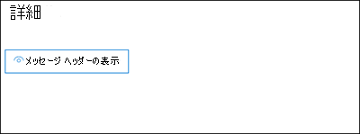

# <a name="quarantine-tags"></a><span data-ttu-id="3dbbe-103">検疫タグ</span><span class="sxs-lookup"><span data-stu-id="3dbbe-103">Quarantine tags</span></span>

> [!NOTE]
> <span data-ttu-id="3dbbe-104">この記事で説明されている機能は現在プレビュー段階であり、すべてのユーザーが利用できるわけではありません。変更される可能性があります。</span><span class="sxs-lookup"><span data-stu-id="3dbbe-104">The features that are described in this article are currently in Preview, aren't available to everyone, and are subject to change.</span></span>

<span data-ttu-id="3dbbe-105">Exchange Online Protection (EOP) の検疫タグは、検疫済みメッセージの受信方法に基づいて、ユーザーが検疫済みメッセージに対して実行できる操作を制御することを許可します。</span><span class="sxs-lookup"><span data-stu-id="3dbbe-105">Quarantine tags in Exchange Online Protection (EOP) allow admins to control what users are able to do to their quarantined messages based on how the message arrived in quarantine.</span></span>

<span data-ttu-id="3dbbe-106">EOP は、従来、 [検疫](find-and-release-quarantined-messages-as-a-user.md) のメッセージと [エンドユーザーのスパム通知](use-spam-notifications-to-release-and-report-quarantined-messages.md)の特定のレベルの対話を許可または禁止しています。</span><span class="sxs-lookup"><span data-stu-id="3dbbe-106">EOP has traditionally allowed or prevented certain levels of interactivity for messages in [quarantine](find-and-release-quarantined-messages-as-a-user.md) and in [end-user spam notifications](use-spam-notifications-to-release-and-report-quarantined-messages.md).</span></span> <span data-ttu-id="3dbbe-107">たとえば、エンドユーザーはスパム対策フィルターによって検疫されたメッセージをスパムや一括で表示したり、解放したりすることはできますが、信頼性の高いフィッシングとして検疫されたメッセージを表示または解放することはできません。</span><span class="sxs-lookup"><span data-stu-id="3dbbe-107">For example, end-users can view and release messages that were quarantined by anti-spam filtering as spam or bulk, but they can't view or release messages that were quarantined as high confidence phishing.</span></span>

<span data-ttu-id="3dbbe-108">[サポートされている保護機能](#step-2-assign-a-quarantine-tag-to-supported-features)については、検疫タグでは、エンドユーザーのスパム通知メッセージで許可されるユーザーと、検疫内の検疫済みメッセージ (ユーザーが受信者であるメッセージ) を指定します。</span><span class="sxs-lookup"><span data-stu-id="3dbbe-108">For [supported protection features](#step-2-assign-a-quarantine-tag-to-supported-features), quarantine tags specify what users are allowed to do in end-user spam notification messages and in their quarantined messages in quarantine (messages where the user is a recipient).</span></span> <span data-ttu-id="3dbbe-109">検疫済みメッセージに対してエンドユーザーの履歴機能を強制するために、既定の検疫タグが自動的に割り当てられます。</span><span class="sxs-lookup"><span data-stu-id="3dbbe-109">Default quarantine tags are automatically assigned to enforce the historical capabilities for end-users on quarantined messages.</span></span> <span data-ttu-id="3dbbe-110">または、隔離されたメッセージに対してエンドユーザーが特定の操作を実行することを許可または禁止する、カスタムの検疫タグを作成して割り当てることができます。</span><span class="sxs-lookup"><span data-stu-id="3dbbe-110">Or, you can create and assign custom quarantine tags to allow or prevent end-users from performing specific actions on quarantined messages.</span></span>

<span data-ttu-id="3dbbe-111">個々のアクセス許可は、次の事前設定されたアクセス許可グループに統合されます。</span><span class="sxs-lookup"><span data-stu-id="3dbbe-111">The individual permissions are combined into the following preset permission groups:</span></span>

- <span data-ttu-id="3dbbe-112">アクセスなし</span><span class="sxs-lookup"><span data-stu-id="3dbbe-112">No access</span></span>
- <span data-ttu-id="3dbbe-113">制限付きアクセス</span><span class="sxs-lookup"><span data-stu-id="3dbbe-113">Limited access</span></span>
- <span data-ttu-id="3dbbe-114">フルアクセス</span><span class="sxs-lookup"><span data-stu-id="3dbbe-114">Full access</span></span>

<span data-ttu-id="3dbbe-115">次の表では、使用可能な個々のアクセス許可と、事前設定されたアクセス許可グループに含まれているかどうかについて説明します。</span><span class="sxs-lookup"><span data-stu-id="3dbbe-115">The available individual permissions and what's included or not included in the preset permission groups are described in the following table:</span></span>

|<span data-ttu-id="3dbbe-116">アクセス許可</span><span class="sxs-lookup"><span data-stu-id="3dbbe-116">Permission</span></span>|<span data-ttu-id="3dbbe-117">アクセスなし</span><span class="sxs-lookup"><span data-stu-id="3dbbe-117">No access</span></span>|<span data-ttu-id="3dbbe-118">制限付きアクセス</span><span class="sxs-lookup"><span data-stu-id="3dbbe-118">Limited access</span></span>|<span data-ttu-id="3dbbe-119">フルアクセス</span><span class="sxs-lookup"><span data-stu-id="3dbbe-119">Full access</span></span>|
|---|:---:|:---:|:---:|
|<span data-ttu-id="3dbbe-120">**送信者を許可する** (_permissiontoallowsender_)</span><span class="sxs-lookup"><span data-stu-id="3dbbe-120">**Allow sender** (_PermissionToAllowSender_)</span></span>||||
|<span data-ttu-id="3dbbe-122">**受信拒否** (_permissiontoblocksender_)</span><span class="sxs-lookup"><span data-stu-id="3dbbe-122">**Block sender** (_PermissionToBlockSender_)</span></span>||||
|<span data-ttu-id="3dbbe-125">**削除** (_PermissionToDelete_)</span><span class="sxs-lookup"><span data-stu-id="3dbbe-125">**Delete** (_PermissionToDelete_)</span></span>||||
|<span data-ttu-id="3dbbe-128">**プレビュー** (_permissiontopreview_)</span><span class="sxs-lookup"><span data-stu-id="3dbbe-128">**Preview** (_PermissionToPreview_)</span></span>||||
|<span data-ttu-id="3dbbe-131">**受信者が検疫からメッセージを解放することを許可する** (_PermissionToRelease_)</span><span class="sxs-lookup"><span data-stu-id="3dbbe-131">**Allow recipients to release a message from quarantine** (_PermissionToRelease_)</span></span>||||
|<span data-ttu-id="3dbbe-133">**受信者が検疫から解放されるメッセージを要求できるように** する (_PermissionToRequestRelease_)</span><span class="sxs-lookup"><span data-stu-id="3dbbe-133">**Allow recipients to request a message to be released from quarantine** (_PermissionToRequestRelease_)</span></span>||||
|

<span data-ttu-id="3dbbe-135">事前設定されたアクセス許可グループの既定のアクセス許可が気に入らない場合は、カスタムの検疫タグを作成または変更するときにカスタムアクセス許可を使用できます。</span><span class="sxs-lookup"><span data-stu-id="3dbbe-135">If you don't like the default permissions in the preset permission groups, you can use custom permissions when you create or modify custom quarantine tags.</span></span> <span data-ttu-id="3dbbe-136">各アクセス許可の詳細については、この記事の後半の「 [検疫タグのアクセス許可の詳細](#quarantine-tag-permission-details) 」を参照してください。</span><span class="sxs-lookup"><span data-stu-id="3dbbe-136">For more information about what each permission does, see the [Quarantine tag permission details](#quarantine-tag-permission-details) section later in this article.</span></span>

<span data-ttu-id="3dbbe-137">検疫タグは、セキュリティ & コンプライアンスセンターまたは PowerShell (Microsoft 365 組織の exchange online PowerShell で exchange online メールボックスを使用しない EOP 組織では、exchange online のメールボックスを使用せずに、スタンドアロンの EOP PowerShell で作成および割り当てを行います。</span><span class="sxs-lookup"><span data-stu-id="3dbbe-137">You create and assign quarantine tags in the Security & Compliance Center or in PowerShell (Exchange Online PowerShell for Microsoft 365 organizations with Exchange Online Mailboxes; standalone EOP PowerShell in EOP organizations without Exchange Online mailboxes).</span></span>

## <a name="what-do-you-need-to-know-before-you-begin"></a><span data-ttu-id="3dbbe-138">はじめに把握しておくべき情報</span><span class="sxs-lookup"><span data-stu-id="3dbbe-138">What do you need to know before you begin?</span></span>

- <span data-ttu-id="3dbbe-139"><https://protection.office.com/> でセキュリティ/コンプライアンス センターを開きます。</span><span class="sxs-lookup"><span data-stu-id="3dbbe-139">You open the Security & Compliance Center at <https://protection.office.com/>.</span></span> <span data-ttu-id="3dbbe-140">[ **タグの検疫** ] ページに直接移動するには、を開き <https://protection.office.com/quarantineTags> ます。</span><span class="sxs-lookup"><span data-stu-id="3dbbe-140">To go directly to the **Quarantine tags** page, open <https://protection.office.com/quarantineTags>.</span></span>

- <span data-ttu-id="3dbbe-141">Exchange Online PowerShell へ接続するには、「[Exchange Online PowerShell に接続する](https://docs.microsoft.com/powershell/exchange/connect-to-exchange-online-powershell)」を参照してください。</span><span class="sxs-lookup"><span data-stu-id="3dbbe-141">To connect to Exchange Online PowerShell, see [Connect to Exchange Online PowerShell](https://docs.microsoft.com/powershell/exchange/connect-to-exchange-online-powershell).</span></span> <span data-ttu-id="3dbbe-142">スタンドアロンの EOP PowerShell に接続するには、「[Exchange Online Protection PowerShell への接続](https://docs.microsoft.com/powershell/exchange/connect-to-exchange-online-protection-powershell)」を参照してください。</span><span class="sxs-lookup"><span data-stu-id="3dbbe-142">To connect to standalone EOP PowerShell, see [Connect to Exchange Online Protection PowerShell](https://docs.microsoft.com/powershell/exchange/connect-to-exchange-online-protection-powershell).</span></span>

- <span data-ttu-id="3dbbe-143">検疫タグを表示、作成、変更、または削除するには、次のいずれかの役割グループのメンバーである必要があります。</span><span class="sxs-lookup"><span data-stu-id="3dbbe-143">To view, create, modify, or remove quarantine tags, you need to be a member of one of the following role groups:</span></span>
  - <span data-ttu-id="3dbbe-144">**組織の管理** または [セキュリティ/コンプライアンス センター](permissions-in-the-security-and-compliance-center.md)の **セキュリティ管理者**。</span><span class="sxs-lookup"><span data-stu-id="3dbbe-144">**Organization Management** or **Security Administrator** in the [Security & Compliance Center](permissions-in-the-security-and-compliance-center.md).</span></span>
  - <span data-ttu-id="3dbbe-145">**組織の管理** または [Exchange Online](https://docs.microsoft.com/Exchange/permissions-exo/permissions-exo#role-groups) の **検疫管理**。</span><span class="sxs-lookup"><span data-stu-id="3dbbe-145">**Organization Management** or **Hygiene Management** in [Exchange Online](https://docs.microsoft.com/Exchange/permissions-exo/permissions-exo#role-groups).</span></span>

## <a name="step-1-create-quarantine-tags-in-the-security--compliance-center"></a><span data-ttu-id="3dbbe-146">手順 1: セキュリティ & コンプライアンスセンターで検疫タグを作成する</span><span class="sxs-lookup"><span data-stu-id="3dbbe-146">Step 1: Create quarantine tags in the Security & Compliance Center</span></span>

1. <span data-ttu-id="3dbbe-147">セキュリティ & コンプライアンスセンターで、[ **脅威管理** \> **ポリシー** ] に移動し、[ **タグの検疫**] を選択します。</span><span class="sxs-lookup"><span data-stu-id="3dbbe-147">In the Security & Compliance Center, go to **Threat management** \> **Policy** and then select **Quarantine tags**.</span></span>

2. <span data-ttu-id="3dbbe-148">[ **タグの検疫** ] ページで、[ **カスタムタグの追加**] を選択します。</span><span class="sxs-lookup"><span data-stu-id="3dbbe-148">On the **Quarantine tags** page, select **Add custom tag**.</span></span>

3. <span data-ttu-id="3dbbe-149">[ **新しいタグ** ] ウィザードが開きます。</span><span class="sxs-lookup"><span data-stu-id="3dbbe-149">The **New tag** wizard opens.</span></span> <span data-ttu-id="3dbbe-150">[ **タグ名** ] ページで、[ **タグ名** ] フィールドに簡単な一意の名前を入力します。</span><span class="sxs-lookup"><span data-stu-id="3dbbe-150">On the **Tag name** page, enter a brief but unique name in the **Tag name** field.</span></span> <span data-ttu-id="3dbbe-151">次の手順で、タグを識別して、名前で選択する必要があります。</span><span class="sxs-lookup"><span data-stu-id="3dbbe-151">You'll need to identify and select the tag by name in upcoming steps.</span></span> <span data-ttu-id="3dbbe-152">完了したら、**[次へ]** をクリックします。</span><span class="sxs-lookup"><span data-stu-id="3dbbe-152">When you're finished, click **Next**.</span></span>

4. <span data-ttu-id="3dbbe-153">[ **受信者メッセージアクセス** ] ページで、次のいずれかの値を選択します。</span><span class="sxs-lookup"><span data-stu-id="3dbbe-153">On the **Recipient message access** page, select one of the following values:</span></span>
   - <span data-ttu-id="3dbbe-154">**アクセスなし**</span><span class="sxs-lookup"><span data-stu-id="3dbbe-154">**No access**</span></span>
   - <span data-ttu-id="3dbbe-155">**制限付きアクセス**</span><span class="sxs-lookup"><span data-stu-id="3dbbe-155">**Limited access**</span></span>
   - <span data-ttu-id="3dbbe-156">**フルアクセス**</span><span class="sxs-lookup"><span data-stu-id="3dbbe-156">**Full access**</span></span>

   <span data-ttu-id="3dbbe-157">これらのアクセス許可グループに含まれる個々のアクセス許可については、この記事の前半で説明します。</span><span class="sxs-lookup"><span data-stu-id="3dbbe-157">The individual permissions that are included in these permission groups are described earlier in this article.</span></span>

   <span data-ttu-id="3dbbe-158">カスタムアクセス許可を指定するには、[特定のアクセス権を **設定 (詳細)** ] を選択し、次の設定を構成します。</span><span class="sxs-lookup"><span data-stu-id="3dbbe-158">To specify custom permissions, select **Set specific access (Advanced)** and configure the following settings:</span></span>

     - <span data-ttu-id="3dbbe-159">**[リリースアクションの設定] を選択** します。次のいずれかの値を選択します。</span><span class="sxs-lookup"><span data-stu-id="3dbbe-159">**Select release action preference**: Select one of the following values:</span></span>
       - <span data-ttu-id="3dbbe-160">[**解放アクションなし**: これは既定値です。</span><span class="sxs-lookup"><span data-stu-id="3dbbe-160">**No release action**: This is the default value.</span></span>
       - <span data-ttu-id="3dbbe-161">**受信者が検疫からメッセージを解放することを許可する**</span><span class="sxs-lookup"><span data-stu-id="3dbbe-161">**Allow recipients to release a message from quarantine**</span></span>
       - <span data-ttu-id="3dbbe-162">**受信者が検疫から解放されるメッセージを要求できるようにする**</span><span class="sxs-lookup"><span data-stu-id="3dbbe-162">**Allow recipients to request a message to be released from quarantine**</span></span>

     - <span data-ttu-id="3dbbe-163">**受信者が検疫済みメッセージに対して実行できる追加のアクションを選択** します。以下のいずれかの値を選択します。</span><span class="sxs-lookup"><span data-stu-id="3dbbe-163">**Select additional actions recipients can take on quarantined messages**: Select some, all, or none of the following values:</span></span>
       - <span data-ttu-id="3dbbe-164">**Delete**</span><span class="sxs-lookup"><span data-stu-id="3dbbe-164">**Delete**</span></span>
       - <span data-ttu-id="3dbbe-165">**プレビュー**</span><span class="sxs-lookup"><span data-stu-id="3dbbe-165">**Preview**</span></span>
       - <span data-ttu-id="3dbbe-166">**送信者を許可する**</span><span class="sxs-lookup"><span data-stu-id="3dbbe-166">**Allow sender**</span></span>
       - <span data-ttu-id="3dbbe-167">**受信拒否**</span><span class="sxs-lookup"><span data-stu-id="3dbbe-167">**Block sender**</span></span>

   <span data-ttu-id="3dbbe-168">これらのアクセス許可と、エンドユーザーのスパム通知に対するこれらのアクセス許可とその影響については、この記事の後半の「 [検疫タグのアクセス許可の詳細](#quarantine-tag-permission-details) 」を参照してください。</span><span class="sxs-lookup"><span data-stu-id="3dbbe-168">These permissions and their effect on quarantined messages and in end-user spam notifications are described in the [Quarantine tag permission details](#quarantine-tag-permission-details) section later in this article.</span></span>

   <span data-ttu-id="3dbbe-169">完了したら、**[次へ]** をクリックします。</span><span class="sxs-lookup"><span data-stu-id="3dbbe-169">When you're finished, click **Next**.</span></span>

5. <span data-ttu-id="3dbbe-170">表示される **要約** ページで、設定を確認します。</span><span class="sxs-lookup"><span data-stu-id="3dbbe-170">On the **Summary** page that appears, review your settings.</span></span> <span data-ttu-id="3dbbe-171">各設定で [ **編集** ] をクリックして、変更を行うことができます。</span><span class="sxs-lookup"><span data-stu-id="3dbbe-171">You can click **Edit** on each setting to modify it.</span></span>

   <span data-ttu-id="3dbbe-172">完了したら、[ **送信**] をクリックします。</span><span class="sxs-lookup"><span data-stu-id="3dbbe-172">When you're finished, click **Submit**.</span></span>

6. <span data-ttu-id="3dbbe-173">表示される確認ページで [ **完了** ] をクリックします。</span><span class="sxs-lookup"><span data-stu-id="3dbbe-173">Click **Done** on the confirmation page that appears.</span></span>

<span data-ttu-id="3dbbe-174">これで、[ [ステップ 2](#step-2-assign-a-quarantine-tag-to-supported-features) ] セクションに記載されているように、検疫タグを検疫機能に割り当てる準備ができました。</span><span class="sxs-lookup"><span data-stu-id="3dbbe-174">Now you are ready to assign the quarantine tag to a quarantine feature as described in the [Step 2](#step-2-assign-a-quarantine-tag-to-supported-features) section.</span></span>

### <a name="create-quarantine-tags-in-powershell"></a><span data-ttu-id="3dbbe-175">PowerShell で検疫タグを作成する</span><span class="sxs-lookup"><span data-stu-id="3dbbe-175">Create quarantine tags in PowerShell</span></span>

<span data-ttu-id="3dbbe-176">PowerShell を使用して検疫タグを作成する場合は、Exchange Online PowerShell または Exchange Online Protection PowerShell に接続して、 **QuarantineTag** コマンドレットを使用します。</span><span class="sxs-lookup"><span data-stu-id="3dbbe-176">If you'd rather use PowerShell to create quarantine tags, connect to Exchange Online PowerShell or Exchange Online Protection PowerShell and use the **New-QuarantineTag** cmdlet.</span></span> <span data-ttu-id="3dbbe-177">次の2種類の方法から選択できます。</span><span class="sxs-lookup"><span data-stu-id="3dbbe-177">You have two different methods to choose from:</span></span>

- <span data-ttu-id="3dbbe-178">_EndUserQuarantinePermissionsValue_ パラメーターを使用します。</span><span class="sxs-lookup"><span data-stu-id="3dbbe-178">Use the _EndUserQuarantinePermissionsValue_ parameter.</span></span>
- <span data-ttu-id="3dbbe-179">_EndUserQuarantinePermissions_ パラメーターを使用します。</span><span class="sxs-lookup"><span data-stu-id="3dbbe-179">Use the _EndUserQuarantinePermissions_ parameter.</span></span>

<span data-ttu-id="3dbbe-180">これらのメソッドについては、以下のセクションで説明します。</span><span class="sxs-lookup"><span data-stu-id="3dbbe-180">These methods are described in the following sections.</span></span>

#### <a name="use-the-enduserquarantinepermissionsvalue-parameter"></a><span data-ttu-id="3dbbe-181">EndUserQuarantinePermissionsValue パラメーターを使用する</span><span class="sxs-lookup"><span data-stu-id="3dbbe-181">Use the EndUserQuarantinePermissionsValue parameter</span></span>

<span data-ttu-id="3dbbe-182">_EndUserQuarantinePermissionsValue_ パラメーターを使用して検疫タグを作成するには、次の構文を使用します。</span><span class="sxs-lookup"><span data-stu-id="3dbbe-182">To create a quarantine tag using the _EndUserQuarantinePermissionsValue_ parameter, use the following syntax:</span></span>

```powershell
New-QuarantineTag -Name "<UniqueName>" -EndUserQuarantinePermissionsValue <0 to 236>
```

<span data-ttu-id="3dbbe-183">_EndUserQuarantinePermissionsValue_ パラメーターは、バイナリ値から変換された10進数の値を使用します。</span><span class="sxs-lookup"><span data-stu-id="3dbbe-183">The _EndUserQuarantinePermissionsValue_ parameter uses a decimal value that's converted from a binary value.</span></span> <span data-ttu-id="3dbbe-184">Binary 値は、指定された順序で使用可能なエンドユーザーの検疫アクセス許可に対応します。</span><span class="sxs-lookup"><span data-stu-id="3dbbe-184">The binary value corresponds to the available end-user quarantine permissions in a specific order.</span></span> <span data-ttu-id="3dbbe-185">各アクセス許可について、値1は True になり、値0は False に等しくなります。</span><span class="sxs-lookup"><span data-stu-id="3dbbe-185">For each permission, the value 1 equals True and the value 0 equals False.</span></span>

<span data-ttu-id="3dbbe-186">次の表では、事前設定されたアクセス許可グループの各アクセス許可に必要な順序と値について説明します。</span><span class="sxs-lookup"><span data-stu-id="3dbbe-186">The required order and values for each individual permission in preset permission groups are described in the following table:</span></span>

****

|<span data-ttu-id="3dbbe-187">アクセス許可</span><span class="sxs-lookup"><span data-stu-id="3dbbe-187">Permission</span></span>|<span data-ttu-id="3dbbe-188">アクセスなし</span><span class="sxs-lookup"><span data-stu-id="3dbbe-188">No access</span></span>|<span data-ttu-id="3dbbe-189">制限付きアクセス</span><span class="sxs-lookup"><span data-stu-id="3dbbe-189">Limited access</span></span>|<span data-ttu-id="3dbbe-190">フルアクセス</span><span class="sxs-lookup"><span data-stu-id="3dbbe-190">Full access</span></span>|
|---|:---:|:---:|:---:|
|<span data-ttu-id="3dbbe-191">PermissionToAllowSender</span><span class="sxs-lookup"><span data-stu-id="3dbbe-191">PermissionToAllowSender</span></span>|<span data-ttu-id="3dbbe-192">.0</span><span class="sxs-lookup"><span data-stu-id="3dbbe-192">0</span></span>|<span data-ttu-id="3dbbe-193">.0</span><span class="sxs-lookup"><span data-stu-id="3dbbe-193">0</span></span>|<span data-ttu-id="3dbbe-194">1-d</span><span class="sxs-lookup"><span data-stu-id="3dbbe-194">1</span></span>|
|<span data-ttu-id="3dbbe-195">PermissionToBlockSender</span><span class="sxs-lookup"><span data-stu-id="3dbbe-195">PermissionToBlockSender</span></span>|<span data-ttu-id="3dbbe-196">.0</span><span class="sxs-lookup"><span data-stu-id="3dbbe-196">0</span></span>|<span data-ttu-id="3dbbe-197">1-d</span><span class="sxs-lookup"><span data-stu-id="3dbbe-197">1</span></span>|<span data-ttu-id="3dbbe-198">1-d</span><span class="sxs-lookup"><span data-stu-id="3dbbe-198">1</span></span>|
|<span data-ttu-id="3dbbe-199">PermissionToDelete</span><span class="sxs-lookup"><span data-stu-id="3dbbe-199">PermissionToDelete</span></span>|<span data-ttu-id="3dbbe-200">.0</span><span class="sxs-lookup"><span data-stu-id="3dbbe-200">0</span></span>|<span data-ttu-id="3dbbe-201">1-d</span><span class="sxs-lookup"><span data-stu-id="3dbbe-201">1</span></span>|<span data-ttu-id="3dbbe-202">1-d</span><span class="sxs-lookup"><span data-stu-id="3dbbe-202">1</span></span>|
|<span data-ttu-id="3dbbe-203">PermissionToDownload<sup>\*</sup></span><span class="sxs-lookup"><span data-stu-id="3dbbe-203">PermissionToDownload<sup>\*</sup></span></span>|<span data-ttu-id="3dbbe-204">.0</span><span class="sxs-lookup"><span data-stu-id="3dbbe-204">0</span></span>|<span data-ttu-id="3dbbe-205">.0</span><span class="sxs-lookup"><span data-stu-id="3dbbe-205">0</span></span>|<span data-ttu-id="3dbbe-206">.0</span><span class="sxs-lookup"><span data-stu-id="3dbbe-206">0</span></span>|
|<span data-ttu-id="3dbbe-207">PermissionToPreview</span><span class="sxs-lookup"><span data-stu-id="3dbbe-207">PermissionToPreview</span></span>|<span data-ttu-id="3dbbe-208">.0</span><span class="sxs-lookup"><span data-stu-id="3dbbe-208">0</span></span>|<span data-ttu-id="3dbbe-209">1-d</span><span class="sxs-lookup"><span data-stu-id="3dbbe-209">1</span></span>|<span data-ttu-id="3dbbe-210">1-d</span><span class="sxs-lookup"><span data-stu-id="3dbbe-210">1</span></span>|
|<span data-ttu-id="3dbbe-211">PermissionToRelease<sup>\*\*</sup></span><span class="sxs-lookup"><span data-stu-id="3dbbe-211">PermissionToRelease<sup>\*\*</sup></span></span>|<span data-ttu-id="3dbbe-212">.0</span><span class="sxs-lookup"><span data-stu-id="3dbbe-212">0</span></span>|<span data-ttu-id="3dbbe-213">.0</span><span class="sxs-lookup"><span data-stu-id="3dbbe-213">0</span></span>|<span data-ttu-id="3dbbe-214">1-d</span><span class="sxs-lookup"><span data-stu-id="3dbbe-214">1</span></span>|
|<span data-ttu-id="3dbbe-215">PermissionToRequestRelease<sup>\*\*</sup></span><span class="sxs-lookup"><span data-stu-id="3dbbe-215">PermissionToRequestRelease<sup>\*\*</sup></span></span>|<span data-ttu-id="3dbbe-216">.0</span><span class="sxs-lookup"><span data-stu-id="3dbbe-216">0</span></span>|<span data-ttu-id="3dbbe-217">1-d</span><span class="sxs-lookup"><span data-stu-id="3dbbe-217">1</span></span>|<span data-ttu-id="3dbbe-218">.0</span><span class="sxs-lookup"><span data-stu-id="3dbbe-218">0</span></span>|
|<span data-ttu-id="3dbbe-219">PermissionToViewHeader<sup>\*</sup></span><span class="sxs-lookup"><span data-stu-id="3dbbe-219">PermissionToViewHeader<sup>\*</sup></span></span>|<span data-ttu-id="3dbbe-220">.0</span><span class="sxs-lookup"><span data-stu-id="3dbbe-220">0</span></span>|<span data-ttu-id="3dbbe-221">.0</span><span class="sxs-lookup"><span data-stu-id="3dbbe-221">0</span></span>|<span data-ttu-id="3dbbe-222">.0</span><span class="sxs-lookup"><span data-stu-id="3dbbe-222">0</span></span>|
|<span data-ttu-id="3dbbe-223">バイナリ値</span><span class="sxs-lookup"><span data-stu-id="3dbbe-223">Binary value</span></span>|<span data-ttu-id="3dbbe-224">00000000</span><span class="sxs-lookup"><span data-stu-id="3dbbe-224">00000000</span></span>|<span data-ttu-id="3dbbe-225">01101010</span><span class="sxs-lookup"><span data-stu-id="3dbbe-225">01101010</span></span>|<span data-ttu-id="3dbbe-226">11101100</span><span class="sxs-lookup"><span data-stu-id="3dbbe-226">11101100</span></span>|
|<span data-ttu-id="3dbbe-227">使用する10進値</span><span class="sxs-lookup"><span data-stu-id="3dbbe-227">Decimal value to use</span></span>|<span data-ttu-id="3dbbe-228">.0</span><span class="sxs-lookup"><span data-stu-id="3dbbe-228">0</span></span>|<span data-ttu-id="3dbbe-229">106</span><span class="sxs-lookup"><span data-stu-id="3dbbe-229">106</span></span>|<span data-ttu-id="3dbbe-230">236</span><span class="sxs-lookup"><span data-stu-id="3dbbe-230">236</span></span>|

<span data-ttu-id="3dbbe-231"><sup>\*</sup> 現時点では、この値は常に0です。</span><span class="sxs-lookup"><span data-stu-id="3dbbe-231"><sup>\*</sup> Currently, this value is always 0.</span></span> <span data-ttu-id="3dbbe-232">PermissionToViewHeader の場合、値0を指定すると、検疫済みメッセージの詳細に [ **メッセージヘッダーの表示** ] ボタンが表示されません (ボタンは常に使用可能)。</span><span class="sxs-lookup"><span data-stu-id="3dbbe-232">For PermissionToViewHeader, the value 0 doesn't hide the **View message header** button in the details of the quarantined message (the button is always available).</span></span>

<span data-ttu-id="3dbbe-233"><sup>\*\*</sup> 両方の値を1に設定しないでください。</span><span class="sxs-lookup"><span data-stu-id="3dbbe-233"><sup>\*\*</sup> Don't set both of these values to 1.</span></span> <span data-ttu-id="3dbbe-234">1を1に設定し、もう一方を0に設定するか、または両方を0に設定します。</span><span class="sxs-lookup"><span data-stu-id="3dbbe-234">Set one to 1 and the other to 0, or set both to 0.</span></span>

<span data-ttu-id="3dbbe-235">この例では、前の表で説明されているアクセス許可を割り当てずに、新しい検疫タグ名 NoAccess を作成します。</span><span class="sxs-lookup"><span data-stu-id="3dbbe-235">This example creates a new quarantine tag name NoAccess that assigns the No access permissions as described in the previous table.</span></span>

```powershell
New-QuarantineTag -Name NoAccess -EndUserQuarantinePermissionsValue 0
```

<span data-ttu-id="3dbbe-236">制限付きアクセスのアクセス許可の場合は、値106を使用します。</span><span class="sxs-lookup"><span data-stu-id="3dbbe-236">For Limited access permissions, use the value 106.</span></span> <span data-ttu-id="3dbbe-237">フルアクセスのアクセス許可については、値236を使用します。</span><span class="sxs-lookup"><span data-stu-id="3dbbe-237">For Full access permissions, use the value 236.</span></span>

<span data-ttu-id="3dbbe-238">カスタムアクセス許可の場合、前の表を使用して、必要なアクセス許可に対応するバイナリ値を取得します。</span><span class="sxs-lookup"><span data-stu-id="3dbbe-238">For custom permissions, use the previous table to get the binary value that corresponds to the permissions you want.</span></span> <span data-ttu-id="3dbbe-239">Binary 値を10進値に変換し、 _EndUserQuarantinePermissionsValue_ パラメーターに10進数の値を使用します。</span><span class="sxs-lookup"><span data-stu-id="3dbbe-239">Convert the binary value to a decimal value and use the decimal value for the _EndUserQuarantinePermissionsValue_ parameter.</span></span>

<span data-ttu-id="3dbbe-240">構文およびパラメーターの詳細については、「 [QuarantineTag](https://docs.microsoft.com/powershell/module/exchange/new-quarantinetag)」を参照してください。</span><span class="sxs-lookup"><span data-stu-id="3dbbe-240">For detailed syntax and parameter information, see [New-QuarantineTag](https://docs.microsoft.com/powershell/module/exchange/new-quarantinetag).</span></span>

#### <a name="use-the-enduserquarantinepermissions-parameter"></a><span data-ttu-id="3dbbe-241">EndUserQuarantinePermissions パラメーターを使用する</span><span class="sxs-lookup"><span data-stu-id="3dbbe-241">Use the EndUserQuarantinePermissions parameter</span></span>

<span data-ttu-id="3dbbe-242">_EndUserQuarantinePermissionsValue_ パラメーターを使用して検疫タグを作成するには、次の手順を実行します。</span><span class="sxs-lookup"><span data-stu-id="3dbbe-242">To create a quarantine tag using the _EndUserQuarantinePermissionsValue_ parameter, do the following steps:</span></span>

<span data-ttu-id="3dbbe-243">A.</span><span class="sxs-lookup"><span data-stu-id="3dbbe-243">A.</span></span> <span data-ttu-id="3dbbe-244">**QuarantinePermissions** コマンドレットを使用して、変数に検疫アクセス許可オブジェクトを格納します。</span><span class="sxs-lookup"><span data-stu-id="3dbbe-244">Store a quarantine permissions object in a variable using the **New-QuarantinePermissions** cmdlet.</span></span>
<br/>
<span data-ttu-id="3dbbe-245">B.</span><span class="sxs-lookup"><span data-stu-id="3dbbe-245">B.</span></span> <span data-ttu-id="3dbbe-246">変数は、 **QuarantineTag** コマンドの _EndUserQuarantinePermissions_ 値として使用します。</span><span class="sxs-lookup"><span data-stu-id="3dbbe-246">Use the variable as the _EndUserQuarantinePermissions_ value in the **New-QuarantineTag** command.</span></span>

##### <a name="step-a-store-a-quarantine-permissions-object-in-a-variable"></a><span data-ttu-id="3dbbe-247">手順 A: 検疫アクセス許可オブジェクトを変数に格納する</span><span class="sxs-lookup"><span data-stu-id="3dbbe-247">Step A: Store a quarantine permissions object in a variable</span></span>

<span data-ttu-id="3dbbe-248">次の構文を使用してください。</span><span class="sxs-lookup"><span data-stu-id="3dbbe-248">Use the following syntax:</span></span>

```powershell
$<VariableName> = New-QuarantinePermissions [-PermissionToAllowSender <$true | $False>] [-PermissionToBlockSender <$true | $False>] [-PermissionToDelete <$true | $False>] [-PermissionToPreview <$true | $False>] [-PermissionToRelease <$true | $False>] [-PermissionToRequestRelease <$true | $False>]
```

<span data-ttu-id="3dbbe-249">使用されていないパラメーターの既定値は `$false` であるため、値をに設定するパラメーターのみを使用する必要があり `$true` ます。</span><span class="sxs-lookup"><span data-stu-id="3dbbe-249">The default value for any unused parameters is `$false`, so you only need to use the parameters where you want to set value to `$true`.</span></span>

<span data-ttu-id="3dbbe-250">次の例は、事前設定されたアクセス許可グループに対応する permission オブジェクトを作成する方法を示しています。</span><span class="sxs-lookup"><span data-stu-id="3dbbe-250">The following examples show how to create permission objects that correspond to the preset permissions groups:</span></span>

- <span data-ttu-id="3dbbe-251">**アクセス不可**:</span><span class="sxs-lookup"><span data-stu-id="3dbbe-251">**No access**:</span></span>

  ```powershell
  $NoAccess = New-QuarantinePermissions
  ```

- <span data-ttu-id="3dbbe-252">**限定的なアクセス**:</span><span class="sxs-lookup"><span data-stu-id="3dbbe-252">**Limited access**:</span></span>

  ```powershell
  $LimitedAccess = New-QuarantinePermissions -PermissionToBlockSender $true -PermissionToDelete $true -PermissionToPreview $true -PermissionToRequestRelease $true
  ```

- <span data-ttu-id="3dbbe-253">**フルアクセス**:</span><span class="sxs-lookup"><span data-stu-id="3dbbe-253">**Full access**:</span></span>

  ```powershell
  $FullAccess = New-QuarantinePermissions -PermissionToAllowSender $true -PermissionToBlockSender $true -PermissionToDelete $true -PermissionToPreview $true -PermissionToRelease $true
  ```

<span data-ttu-id="3dbbe-254">設定した値を表示するには、変数名をコマンドとして実行します (たとえば、コマンドを実行し `$NoAccess` ます)。</span><span class="sxs-lookup"><span data-stu-id="3dbbe-254">To see the values that you've set, run the variable name as a command (for example, run the command `$NoAccess`).</span></span>

<span data-ttu-id="3dbbe-255">カスタム権限の場合、 _PermissionToRelease_ パラメーターと _PermissionToRequestRelease_ パラメーターの両方をに設定しないで `$true` ください。</span><span class="sxs-lookup"><span data-stu-id="3dbbe-255">For custom permissions, don't set both the _PermissionToRelease_ and _PermissionToRequestRelease_ parameters to `$true`.</span></span> <span data-ttu-id="3dbbe-256">をに設定 `$true` してそのままにするか、のままにし `$false` `$false` ます。</span><span class="sxs-lookup"><span data-stu-id="3dbbe-256">Set one to `$true` and leave the other as `$false`, or leave both as `$false`.</span></span>

<span data-ttu-id="3dbbe-257">また、 **QuarantinePermissions** コマンドレットを使用して、以前に作成した後で使用する前に、既存のアクセス許可オブジェクト変数を変更することもできます。</span><span class="sxs-lookup"><span data-stu-id="3dbbe-257">You can also modify an existing permissions object variable after you create but before you use it by using the **Set-QuarantinePermissions** cmdlet.</span></span>

<span data-ttu-id="3dbbe-258">構文およびパラメーターの詳細については、「 [QuarantinePermissions](https://docs.microsoft.com/powershell/module/exchange/new-quarantinepermissions) 」および「 [QuarantinePermissions](https://docs.microsoft.com/powershell/module/exchange/set-quarantinepermissions)」を参照してください。</span><span class="sxs-lookup"><span data-stu-id="3dbbe-258">For detailed syntax and parameter information, see [New-QuarantinePermissions](https://docs.microsoft.com/powershell/module/exchange/new-quarantinepermissions) and [Set-QuarantinePermissions](https://docs.microsoft.com/powershell/module/exchange/set-quarantinepermissions).</span></span>

##### <a name="step-b-use-the-variable-in-the-new-quarantinetag-command"></a><span data-ttu-id="3dbbe-259">手順 B: New-QuarantineTag コマンドで変数を使用する</span><span class="sxs-lookup"><span data-stu-id="3dbbe-259">Step B: Use the variable in the New-QuarantineTag command</span></span>

<span data-ttu-id="3dbbe-260">アクセス許可オブジェクトを作成して変数に格納した後、次の **QuarantineTag** コマンドで _EndUserQuarantinePermission_ パラメーターの値として変数を使用します。</span><span class="sxs-lookup"><span data-stu-id="3dbbe-260">After you've created and stored the permissions object in a variable, use the variable for the _EndUserQuarantinePermission_ parameter value in the following **New-QuarantineTag** command:</span></span>

```powershell
New-QuarantineTag -Name "<UniqueName>" -EndUserQuarantinePermissions $<VariableName>
```

<span data-ttu-id="3dbbe-261">この例では、 `$LimitedAccess` 前の手順で説明して作成したアクセス許可オブジェクトを使用して、LimitedAccess という名前の新しい quarantine タグを作成します。</span><span class="sxs-lookup"><span data-stu-id="3dbbe-261">This example creates a new quarantine tag named LimitedAccess using the `$LimitedAccess` permissions object that was described and created in the previous step.</span></span>

```powershell
New-QuarantineTag -Name LimitedAccess -EndUserQuarantinePermissions $LimitedAccess
```

<span data-ttu-id="3dbbe-262">構文およびパラメーターの詳細については、「 [QuarantineTag](https://docs.microsoft.com/powershell/module/exchange/new-quarantinetag)」を参照してください。</span><span class="sxs-lookup"><span data-stu-id="3dbbe-262">For detailed syntax and parameter information, see [New-QuarantineTag](https://docs.microsoft.com/powershell/module/exchange/new-quarantinetag).</span></span>

## <a name="step-2-assign-a-quarantine-tag-to-supported-features"></a><span data-ttu-id="3dbbe-263">手順 2: サポートされている機能に検疫タグを割り当てる</span><span class="sxs-lookup"><span data-stu-id="3dbbe-263">Step 2: Assign a quarantine tag to supported features</span></span>

<span data-ttu-id="3dbbe-264">メッセージまたはファイルを検疫する、 _サポートされ_ ている保護機能 (自動または構成可能なアクションとして) では、検疫タグを利用可能な検疫アクションに割り当てることができます。</span><span class="sxs-lookup"><span data-stu-id="3dbbe-264">In _supported_ protection features that quarantine messages or files (automatically or as a configurable action), you can assign a quarantine tag to the available quarantine actions.</span></span> <span data-ttu-id="3dbbe-265">次の表では、メッセージを検疫し、検疫タグを使用できるようにする機能について説明します。</span><span class="sxs-lookup"><span data-stu-id="3dbbe-265">Features that quarantine messages and the availability of quarantine tags are described in the following table:</span></span>

****

|<span data-ttu-id="3dbbe-266">機能</span><span class="sxs-lookup"><span data-stu-id="3dbbe-266">Feature</span></span>|<span data-ttu-id="3dbbe-267">検疫タグはサポートされていますか?</span><span class="sxs-lookup"><span data-stu-id="3dbbe-267">Quarantine tags supported?</span></span>|<span data-ttu-id="3dbbe-268">使用される既定の検疫タグ</span><span class="sxs-lookup"><span data-stu-id="3dbbe-268">Default quarantine tags used</span></span>|
|---|:---:|---|
|<span data-ttu-id="3dbbe-269">[スパム対策ポリシー](configure-your-spam-filter-policies.md):</span><span class="sxs-lookup"><span data-stu-id="3dbbe-269">[Anti-spam policies](configure-your-spam-filter-policies.md):</span></span> <ul><li><span data-ttu-id="3dbbe-270">**スパム** (_SpamAction_)</span><span class="sxs-lookup"><span data-stu-id="3dbbe-270">**Spam** (_SpamAction_)</span></span></li><li><span data-ttu-id="3dbbe-271">**信頼度の高いスパム** (_HighConfidenceSpamAction_)</span><span class="sxs-lookup"><span data-stu-id="3dbbe-271">**High confidence spam** (_HighConfidenceSpamAction_)</span></span></li><li><span data-ttu-id="3dbbe-272">**フィッシング電子メール** (_PhishSpamAction_)</span><span class="sxs-lookup"><span data-stu-id="3dbbe-272">**Phishing email** (_PhishSpamAction_)</span></span></li><li><span data-ttu-id="3dbbe-273">**高信頼フィッシング電子メール** (_HighConfidencePhishAction_)</span><span class="sxs-lookup"><span data-stu-id="3dbbe-273">**High confidence phishing email** (_HighConfidencePhishAction_)</span></span></li><li><span data-ttu-id="3dbbe-274">**バルクメール** (_BulkSpamAction_)</span><span class="sxs-lookup"><span data-stu-id="3dbbe-274">**Bulk email** (_BulkSpamAction_)</span></span></li></ul>|<span data-ttu-id="3dbbe-275">はい</span><span class="sxs-lookup"><span data-stu-id="3dbbe-275">Yes</span></span>|<ul><li><span data-ttu-id="3dbbe-276">DefaultSpamTag (フルアクセス)</span><span class="sxs-lookup"><span data-stu-id="3dbbe-276">DefaultSpamTag (Full access)</span></span></li><li><span data-ttu-id="3dbbe-277">DefaultHighConfSpamTag (フルアクセス)</span><span class="sxs-lookup"><span data-stu-id="3dbbe-277">DefaultHighConfSpamTag (Full access)</span></span></li><li><span data-ttu-id="3dbbe-278">DefaultPhishTag (フルアクセス)</span><span class="sxs-lookup"><span data-stu-id="3dbbe-278">DefaultPhishTag (Full access)</span></span></li><li><span data-ttu-id="3dbbe-279">DefaultHighConfPhishTag (アクセス不可)</span><span class="sxs-lookup"><span data-stu-id="3dbbe-279">DefaultHighConfPhishTag (No access)</span></span></li><li><span data-ttu-id="3dbbe-280">DefaultBulkTag (フルアクセス)</span><span class="sxs-lookup"><span data-stu-id="3dbbe-280">DefaultBulkTag (Full access)</span></span></li></ul>
|<span data-ttu-id="3dbbe-281">フィッシング対策ポリシー:</span><span class="sxs-lookup"><span data-stu-id="3dbbe-281">Anti-phishing policies:</span></span> <ul><li><span data-ttu-id="3dbbe-282">[スプーフィングインテリジェンス保護](set-up-anti-phishing-policies.md#spoof-settings) (_authenticationfailaction_)</span><span class="sxs-lookup"><span data-stu-id="3dbbe-282">[Spoof intelligence protection](set-up-anti-phishing-policies.md#spoof-settings) (_AuthenticationFailAction_)</span></span></li><li><span data-ttu-id="3dbbe-283">[偽装保護](set-up-anti-phishing-policies.md#impersonation-settings-in-anti-phishing-policies-in-microsoft-defender-for-office-365):<sup>\*</sup></span><span class="sxs-lookup"><span data-stu-id="3dbbe-283">[Impersonation protection](set-up-anti-phishing-policies.md#impersonation-settings-in-anti-phishing-policies-in-microsoft-defender-for-office-365):<sup>\*</sup></span></span> <ul><li><span data-ttu-id="3dbbe-284">**偽装ユーザーによって電子メールが送信される場合** (_targeteduserprotectionaction_)</span><span class="sxs-lookup"><span data-stu-id="3dbbe-284">**If email is sent by an impersonated user** (_TargetedUserProtectionAction_)</span></span></li><li><span data-ttu-id="3dbbe-285">**偽装ドメインによって電子メールが送信される場合** (_targeteddomainprotectionaction_)</span><span class="sxs-lookup"><span data-stu-id="3dbbe-285">**If email is sent by an impersonated domain** (_TargetedDomainProtectionAction_)</span></span></li><li><span data-ttu-id="3dbbe-286">**メールボックスインテリジェンス** \>**偽装ユーザーによって電子メールが送信される場合**(_MailboxIntelligenceProtectionAction_)</span><span class="sxs-lookup"><span data-stu-id="3dbbe-286">**Mailbox intelligence** \> **If email is sent by an impersonated user** (_MailboxIntelligenceProtectionAction_)</span></span></li></ul></li></ul></ul>|<span data-ttu-id="3dbbe-287">いいえ</span><span class="sxs-lookup"><span data-stu-id="3dbbe-287">No</span></span>|<span data-ttu-id="3dbbe-288">該当なし</span><span class="sxs-lookup"><span data-stu-id="3dbbe-288">n/a</span></span>|
|<span data-ttu-id="3dbbe-289">[マルウェア対策ポリシー](configure-anti-malware-policies.md): 検出されたすべてのメッセージが常に検疫されます。</span><span class="sxs-lookup"><span data-stu-id="3dbbe-289">[Anti-malware policies](configure-anti-malware-policies.md): All detected messages are always quarantined.</span></span>|<span data-ttu-id="3dbbe-290">いいえ</span><span class="sxs-lookup"><span data-stu-id="3dbbe-290">No</span></span>|<span data-ttu-id="3dbbe-291">該当なし</span><span class="sxs-lookup"><span data-stu-id="3dbbe-291">n/a</span></span>|
|[<span data-ttu-id="3dbbe-292">SharePoint、OneDrive、Microsoft Teams 用の ATP</span><span class="sxs-lookup"><span data-stu-id="3dbbe-292">ATP for SharePoint, OneDrive, and Microsoft Teams</span></span>](atp-for-spo-odb-and-teams.md)|<span data-ttu-id="3dbbe-293">いいえ</span><span class="sxs-lookup"><span data-stu-id="3dbbe-293">No</span></span>|<span data-ttu-id="3dbbe-294">該当なし</span><span class="sxs-lookup"><span data-stu-id="3dbbe-294">n/a</span></span>|
|<span data-ttu-id="3dbbe-295">アクションを使用した [メールフロールール](https://docs.microsoft.com/exchange/security-and-compliance/mail-flow-rules/mail-flow-rules)(トランスポートルールとも呼ばれる): ホストされた検疫 (_検疫_)**にメッセージを配信** します。</span><span class="sxs-lookup"><span data-stu-id="3dbbe-295">[Mail flow rules](https://docs.microsoft.com/exchange/security-and-compliance/mail-flow-rules/mail-flow-rules) (also known as transport rules) with the action: **Deliver the message to the hosted quarantine** (_Quarantine_).</span></span>|<span data-ttu-id="3dbbe-296">いいえ</span><span class="sxs-lookup"><span data-stu-id="3dbbe-296">No</span></span>|<span data-ttu-id="3dbbe-297">該当なし</span><span class="sxs-lookup"><span data-stu-id="3dbbe-297">n/a</span></span>|
|

<span data-ttu-id="3dbbe-298"><sup>\*</sup> 偽装保護の設定は、Microsoft Defender for Office 365 のフィッシング対策ポリシーでのみ使用できます。</span><span class="sxs-lookup"><span data-stu-id="3dbbe-298"><sup>\*</sup> Impersonation protection settings are available only in anti-phishing policies in Microsoft Defender for Office 365.</span></span>

<span data-ttu-id="3dbbe-299">既定の検疫タグで提供されるエンドユーザーのアクセス許可に満足している場合は、何もする必要はありません。</span><span class="sxs-lookup"><span data-stu-id="3dbbe-299">If you're happy with the end-user permissions that are provided by the default quarantine tags, you don't need to do anything.</span></span> <span data-ttu-id="3dbbe-300">エンドユーザーのスパム通知または検疫されたメッセージの詳細でエンドユーザー機能 (利用可能なボタン) をカスタマイズする場合は、カスタム検疫タグを割り当てることができます。</span><span class="sxs-lookup"><span data-stu-id="3dbbe-300">If you want to customize the end-user capabilities (available buttons) in end-user spam notifications or in quarantined message details, you can assign a custom quarantine tag.</span></span>

### <a name="assign-quarantine-tags-in-anti-spam-policies-in-the-security--compliance-center"></a><span data-ttu-id="3dbbe-301">セキュリティ & コンプライアンスセンターのスパム対策ポリシーで検疫タグを割り当てる</span><span class="sxs-lookup"><span data-stu-id="3dbbe-301">Assign quarantine tags in anti-spam policies in the Security & Compliance Center</span></span>

<span data-ttu-id="3dbbe-302">スパム対策ポリシーを作成および変更する詳細な手順については、「 [CONFIGURE EOP」の「スパム対策ポリシーを構成](configure-your-spam-filter-policies.md)する」を参照してください。</span><span class="sxs-lookup"><span data-stu-id="3dbbe-302">Full instructions for creating and modifying anti-spam policies are described in [Configure anti-spam policies in EOP](configure-your-spam-filter-policies.md).</span></span>

1. <span data-ttu-id="3dbbe-303">[セキュリティ & コンプライアンスセンター] で、[ **脅威管理** \> **ポリシー** ] に移動し \> てから、[ **スパム対策**] を選択します。</span><span class="sxs-lookup"><span data-stu-id="3dbbe-303">In the Security & Compliance Center, go to **Threat management** \> **Policy** \> and then select **Anti-spam**.</span></span> <span data-ttu-id="3dbbe-304">または、を開き <https://protection.office.com/antispam> ます。</span><span class="sxs-lookup"><span data-stu-id="3dbbe-304">Or, open <https://protection.office.com/antispam>.</span></span>

2. <span data-ttu-id="3dbbe-305">編集する既存のスパム対策ポリシーを検索して選択するか、新しいスパム対策ポリシーを作成します。</span><span class="sxs-lookup"><span data-stu-id="3dbbe-305">Find and select an existing anti-spam policy to edit, or create a new anti-spam policy.</span></span>

3. <span data-ttu-id="3dbbe-306">ポリシーの詳細ポップアップで、[ **スパムと一括アクション** ] セクションを展開します。</span><span class="sxs-lookup"><span data-stu-id="3dbbe-306">In the policy details flyout, expand the **Spam and bulk actions** section.</span></span>
  
4. <span data-ttu-id="3dbbe-307">[利用可能なスパムフィルター処理] verdict のアクションに対して [ **検疫メッセージ** ] を選択した場合、[ **検疫ポリシータグを適用** します] ボックスを使用して、その verdict の検疫タグを選択できます。</span><span class="sxs-lookup"><span data-stu-id="3dbbe-307">If you've selected **Quarantine message** for the action of an available spam filtering verdict, the **Apply quarantine policy tag** box is available for you to select the quarantine tag for that verdict.</span></span>

   <span data-ttu-id="3dbbe-308">**注**: 新しいポリシーを作成すると、スパムフィルター verdict の空の検疫タグ値は、その verdict が使用されている既定の quarantine タグを示します。</span><span class="sxs-lookup"><span data-stu-id="3dbbe-308">**Note**: When you create a new policy, a blank quarantine tag value for a spam filtering verdict indicates the default quarantine tag for that verdict is used.</span></span> <span data-ttu-id="3dbbe-309">後でポリシーを編集すると、空の値は、前の表で説明したように、実際の既定の検査タグ名に置き換えられます。</span><span class="sxs-lookup"><span data-stu-id="3dbbe-309">When you later edit the policy, the blank values are replaced by the actual default quarantine tag names as described in the previous table.</span></span>
  
   

5. <span data-ttu-id="3dbbe-311">完了したら、**[保存]** をクリックします。</span><span class="sxs-lookup"><span data-stu-id="3dbbe-311">When you're finished, click **Save**.</span></span>

#### <a name="assign-quarantine-tags-in-anti-spam-policies-in-powershell"></a><span data-ttu-id="3dbbe-312">PowerShell でスパム対策ポリシーの検疫タグを割り当てる</span><span class="sxs-lookup"><span data-stu-id="3dbbe-312">Assign quarantine tags in anti-spam policies in PowerShell</span></span>

<span data-ttu-id="3dbbe-313">PowerShell を使用してスパム対策ポリシーで検疫タグを割り当てる場合は、Exchange Online PowerShell または Exchange Online Protection PowerShell に接続し、次の構文を使用します。</span><span class="sxs-lookup"><span data-stu-id="3dbbe-313">If you'd rather use PowerShell to assign quarantine tags in anti-spam policies, connect to Exchange Online PowerShell or Exchange Online Protection PowerShell and use the following syntax:</span></span>

```powershell
<New-HostedContentFilterPolicy -Name "<Unique name>" | Set-HostedContentFilterPolicy -Identity "<Policy name>">  [-SpamAction Quarantine] [-SpamQuarantineTag <QuarantineTagName>] [-HighConfidenceSpamAction Quarantine] [-HighConfidenceSpamQuarantineTag <QuarantineTagName>] [-PhishSpamAction Quarantine] [-PhishQuarantineTag <QuarantineTagName>] [-HighConfidencePhishQuarantineTag <QuarantineTagName>] [-BulkSpamAction Quarantine] [-BulkQuarantineTag <QuarantineTagName>] ...
```

<span data-ttu-id="3dbbe-314">**注**:</span><span class="sxs-lookup"><span data-stu-id="3dbbe-314">**Notes**:</span></span>

- <span data-ttu-id="3dbbe-315">_HighConfidencePhishAction_ パラメーターの既定値は Quarantine なので、新しいスパム対策ポリシーで信頼度の高いフィッシングを検出するための検疫アクションを設定する必要はありません。</span><span class="sxs-lookup"><span data-stu-id="3dbbe-315">The default value for the _HighConfidencePhishAction_ parameter is Quarantine, so you don't need to set the Quarantine action for high confidence phishing detections in new anti-spam policies.</span></span> <span data-ttu-id="3dbbe-316">新規または既存のスパム対策ポリシーで、他のすべてのスパムフィルター verdicts の場合、検疫タグは、アクションの値が Quarantine の場合にのみ有効です。</span><span class="sxs-lookup"><span data-stu-id="3dbbe-316">For all other spam filtering verdicts in new or existing anti-spam policies, the quarantine tag is only effective if the action value is Quarantine.</span></span> <span data-ttu-id="3dbbe-317">既存のスパム対策ポリシーのアクション値を確認するには、次のコマンドを実行します。</span><span class="sxs-lookup"><span data-stu-id="3dbbe-317">To see the action values in existing anti-spam policies, run the following command:</span></span>

  ```powershell
  Get-HostedContentFilterPolicy | Format-Table Name,*SpamAction,HighConfidencePhishAction
  ```

  <span data-ttu-id="3dbbe-318">標準および厳密の既定のアクション値および推奨されるアクション値の詳細については、「 [EOP spam policy settings](recommended-settings-for-eop-and-office365-atp.md#eop-anti-spam-policy-settings)」を参照してください。</span><span class="sxs-lookup"><span data-stu-id="3dbbe-318">For information about the default action values and the recommended action values for Standard and Strict, see [EOP anti-spam policy settings](recommended-settings-for-eop-and-office365-atp.md#eop-anti-spam-policy-settings).</span></span>

- <span data-ttu-id="3dbbe-319">スパムフィルター verdict に対応する quarantine タグパラメーターがない場合は、その verdict の [既定の quarantine タグ](#step-2-assign-a-quarantine-tag-to-supported-features) が使用されます。</span><span class="sxs-lookup"><span data-stu-id="3dbbe-319">A spam filtering verdict without a corresponding quarantine tag parameter means the [default quarantine tag](#step-2-assign-a-quarantine-tag-to-supported-features) for that verdict is used.</span></span>

  <span data-ttu-id="3dbbe-320">検疫されたメッセージに対する既定のエンドユーザーの機能を変更する場合は、既定の検疫タグをカスタム検疫タグに置き換えるだけで済みます。</span><span class="sxs-lookup"><span data-stu-id="3dbbe-320">You only need to replace a default quarantine tag with a custom quarantine tag if you want to change the default end-user capabilities on quarantined messages.</span></span>

- <span data-ttu-id="3dbbe-321">PowerShell の新しいスパム対策ポリシーには、 **set-hostedcontentfilterpolicy** コマンドレットを使用したスパムフィルターポリシー (設定) と、 **disable-hostedcontentfilterrule** コマンドレットを使用する新しいスパムフィルタールール (受信者フィルター) が必要です。</span><span class="sxs-lookup"><span data-stu-id="3dbbe-321">A new anti-spam policy in PowerShell requires a spam filter policy (settings) using the **New-HostedContentFilterPolicy** cmdlet and a new spam filter rule (recipient filters) using the **New-HostedContentFilterRule** cmdlet.</span></span> <span data-ttu-id="3dbbe-322">手順については、「 [PowerShell を使用してスパム対策ポリシーを作成する](configure-your-spam-filter-policies.md#use-powershell-to-create-anti-spam-policies)」を参照してください。</span><span class="sxs-lookup"><span data-stu-id="3dbbe-322">For instructions, see [Use PowerShell to create anti-spam policies](configure-your-spam-filter-policies.md#use-powershell-to-create-anti-spam-policies).</span></span>

<span data-ttu-id="3dbbe-323">この例では、Research Department という名前の新しいスパムフィルターポリシーを次の設定で作成します。</span><span class="sxs-lookup"><span data-stu-id="3dbbe-323">This example creates a new spam filter policy named Research Department with the following settings:</span></span>

- <span data-ttu-id="3dbbe-324">すべてのスパムフィルタリング verdicts のアクションは、検疫に設定されます。</span><span class="sxs-lookup"><span data-stu-id="3dbbe-324">The action for all spam filtering verdicts is set to Quarantine.</span></span>
- <span data-ttu-id="3dbbe-325">**アクセス許可が** 割り当てられていない NoAccess という名前のカスタム検疫タグは、既定では、**アクセス許可が** 割り当てられていない既定の検疫タグに置き換わります。</span><span class="sxs-lookup"><span data-stu-id="3dbbe-325">The custom quarantine tag named NoAccess that assigns **No access** permissions replaces any default quarantine tags that don't already assign **No access** permissions by default.</span></span>

```powershell
New-HostedContentFilterPolicy -Name Research Department -SpamAction Quarantine -SpamQuarantineTag NoAccess -HighConfidenceSpamAction Quarantine -HighConfidenceSpamQuarantineTag NoAction -PhishSpamAction Quarantine -PhishQuarantineTag NoAction -BulkSpamAction Quarantine -BulkQuarantineTag NoAccess
```

<span data-ttu-id="3dbbe-326">構文とパラメーターの詳細については、「[New-HostedContentFilterPolicy](https://docs.microsoft.com/powershell/module/exchange/new-hostedcontentfilterpolicy)」を参照してください。</span><span class="sxs-lookup"><span data-stu-id="3dbbe-326">For detailed syntax and parameter information, see [New-HostedContentFilterPolicy](https://docs.microsoft.com/powershell/module/exchange/new-hostedcontentfilterpolicy).</span></span>

<span data-ttu-id="3dbbe-327">この例では、人的リソースという名前の既存のスパムフィルターポリシーを変更します。</span><span class="sxs-lookup"><span data-stu-id="3dbbe-327">This example modifies the existing spam filter policy named Human Resources.</span></span> <span data-ttu-id="3dbbe-328">スパム検疫 verdict のアクションは検疫に設定され、NoAccess という名前のカスタム検疫タグが割り当てられます。</span><span class="sxs-lookup"><span data-stu-id="3dbbe-328">The action for the spam quarantine verdict is set to Quarantine, and the custom quarantine tag named NoAccess is assigned.</span></span>

```powershell
Set-HostedContentFilterPolicy -Identity "Human Resources" -SpamAction Quarantine -SpamQuarantineTag NoAccess
```

<span data-ttu-id="3dbbe-329">構文とパラメーターの詳細については、「[Set-HostedContentFilterPolicy](https://docs.microsoft.com/powershell/module/exchange/set-hostedcontentfilterpolicy)」を参照してください。</span><span class="sxs-lookup"><span data-stu-id="3dbbe-329">For detailed syntax and parameter information, see [Set-HostedContentFilterPolicy](https://docs.microsoft.com/powershell/module/exchange/set-hostedcontentfilterpolicy).</span></span>

## <a name="configure-global-quarantine-notification-settings-in-the-security--compliance-center"></a><span data-ttu-id="3dbbe-330">セキュリティ & コンプライアンスセンターでのグローバル検疫通知設定の構成</span><span class="sxs-lookup"><span data-stu-id="3dbbe-330">Configure global quarantine notification settings in the Security & Compliance Center</span></span>

<span data-ttu-id="3dbbe-331">検疫タグのグローバル設定を使用すると、検疫されたメッセージの受信者に送信されるエンドユーザーのスパム通知をカスタマイズできます。</span><span class="sxs-lookup"><span data-stu-id="3dbbe-331">The global settings for quarantine tags allow you to customize the end-user spam notifications that are sent to recipients of messages that were quarantined.</span></span> <span data-ttu-id="3dbbe-332">これらの通知の詳細については、「 [エンドユーザーのスパム通知](use-spam-notifications-to-release-and-report-quarantined-messages.md)」を参照してください。</span><span class="sxs-lookup"><span data-stu-id="3dbbe-332">For more information about these notifications, see [End-user spam notifications](use-spam-notifications-to-release-and-report-quarantined-messages.md).</span></span>

1. <span data-ttu-id="3dbbe-333">セキュリティ & コンプライアンスセンターで、[ **脅威管理** \> **ポリシー** ] に移動し、[ **タグの検疫**] を選択します。</span><span class="sxs-lookup"><span data-stu-id="3dbbe-333">In the Security & Compliance Center, go to **Threat management** \> **Policy** and then select **Quarantine tags**.</span></span>

2. <span data-ttu-id="3dbbe-334">[ **タグの検疫** ] ページで、[ **グローバル設定**] を選択します。</span><span class="sxs-lookup"><span data-stu-id="3dbbe-334">On the **Quarantine tags** page, select **Global settings**.</span></span>

3. <span data-ttu-id="3dbbe-335">[ **検疫通知の設定** ] ポップアップが表示されたら、次の設定の一部または全部を構成します。</span><span class="sxs-lookup"><span data-stu-id="3dbbe-335">In the **Quarantine notification settings** flyout that opens, configure some or all of the following settings:</span></span>

   - <span data-ttu-id="3dbbe-336">**会社のロゴを使用** する: エンドユーザーのスパム通知の上位で使用されている既定の Microsoft ロゴを置き換えるには、このオプションを選択します。</span><span class="sxs-lookup"><span data-stu-id="3dbbe-336">**Use my company logo**: Select this option to replace the default Microsoft logo that's use at the top of end-user spam notifications.</span></span> <span data-ttu-id="3dbbe-337">この手順を実行する前に、「 [Microsoft 365 テーマをカスタマイズ](https://docs.microsoft.com/microsoft-365/admin/setup/customize-your-organization-theme) する」の「カスタムロゴをアップロードするには」の手順に従ってください。</span><span class="sxs-lookup"><span data-stu-id="3dbbe-337">Before you do this, you need to follow the instructions in [Customize the Microsoft 365 theme for your organization](https://docs.microsoft.com/microsoft-365/admin/setup/customize-your-organization-theme) to upload your custom logo.</span></span>

     <span data-ttu-id="3dbbe-338">次のスクリーンショットは、エンドユーザーのスパム通知のカスタムロゴを示しています。</span><span class="sxs-lookup"><span data-stu-id="3dbbe-338">The following screenshot shows a custom logo in an end-user spam notification:</span></span>

     

   - <span data-ttu-id="3dbbe-340">**言語の選択**: エンドユーザーのスパム通知は、受信者の言語設定に基づいて既にローカライズされています。</span><span class="sxs-lookup"><span data-stu-id="3dbbe-340">**Choose language**: End-user spam notifications are already localized based on the recipient's language settings.</span></span> <span data-ttu-id="3dbbe-341">[ **表示名** ] と [ **免責事項** ] の値に対して、カスタマイズしたテキストをさまざまな言語で指定できます。</span><span class="sxs-lookup"><span data-stu-id="3dbbe-341">You can specify customized text in different languages for the **Display name** and **Disclaimer** values.</span></span>

     <span data-ttu-id="3dbbe-342">[最初の言語] ボックスから少なくとも1つの言語を選択し、[ **追加**] をクリックします。</span><span class="sxs-lookup"><span data-stu-id="3dbbe-342">Select at least one language from the first language box and then click **Add**.</span></span> <span data-ttu-id="3dbbe-343">複数の言語を選択するには、1つずつ [ **追加** ] をクリックします。</span><span class="sxs-lookup"><span data-stu-id="3dbbe-343">You can select multiple languages by clicking **Add** after each one.</span></span> <span data-ttu-id="3dbbe-344">セクションの言語ボックスに、選択したすべての言語が表示されます。</span><span class="sxs-lookup"><span data-stu-id="3dbbe-344">A section language box shows all of the languages that you've selected:</span></span>

     ![検疫タグのグローバル検疫通知設定の [2 番目の言語] ボックスで選択されている言語](../../media/quarantine-tags-esn-customization-selected-languages.png)

   - <span data-ttu-id="3dbbe-346">[**表示名**: エンドユーザーのスパム通知で使用される送信者の表示名をカスタマイズします。</span><span class="sxs-lookup"><span data-stu-id="3dbbe-346">**Display name**: Customize the sender's display name that's used in end-user spam notifications.</span></span>

     <span data-ttu-id="3dbbe-347">追加した言語ごとに、[2 番目の言語] ボックス ([X] をクリックしない) で言語を選択し、[ **表示名** ] ボックスに必要なテキスト値を入力します。</span><span class="sxs-lookup"><span data-stu-id="3dbbe-347">For each language that you've added, select the language in the second language box (don't click on the X) and enter the text value you want in the **Display name** box.</span></span>

     <span data-ttu-id="3dbbe-348">次のスクリーンショットは、エンドユーザーのスパム通知のカスタマイズされた表示名を示しています。</span><span class="sxs-lookup"><span data-stu-id="3dbbe-348">The following screenshot shows the customized display name in an end-user spam notification:</span></span>

     

   - <span data-ttu-id="3dbbe-350">**免責** 事項: エンドユーザーのスパム通知の下にカスタムの免責事項を追加します。</span><span class="sxs-lookup"><span data-stu-id="3dbbe-350">**Disclaimer**: Add a custom disclaimer to the bottom of end-user spam notifications.</span></span> <span data-ttu-id="3dbbe-351">ローカライズされたテキスト、 **組織からの免責事項** は常に最初に含まれ、その後に指定するテキストが続きます。</span><span class="sxs-lookup"><span data-stu-id="3dbbe-351">The localized text, **A disclaimer from your organization:** is always included first, followed by the text you specify.</span></span>

     <span data-ttu-id="3dbbe-352">追加した言語ごとに、[2 番目の言語] ボックス ([X] をクリックしないでください) の言語を選択し、[ **免責事項** ] ボックスに必要なテキスト値を入力します。</span><span class="sxs-lookup"><span data-stu-id="3dbbe-352">For each language that you've added, select the language in the second language box  (don't click the X) and enter the text value you want in the **Disclaimer** box.</span></span>

     <span data-ttu-id="3dbbe-353">次のスクリーンショットは、エンドユーザーのスパム通知のカスタマイズされた免責事項を示しています。</span><span class="sxs-lookup"><span data-stu-id="3dbbe-353">The following screenshot shows the customized disclaimer in an end-user spam notification:</span></span>

     

## <a name="view-quarantine-tags-in-the-security--compliance-center"></a><span data-ttu-id="3dbbe-355">セキュリティ & コンプライアンスセンターの検疫タグを表示する</span><span class="sxs-lookup"><span data-stu-id="3dbbe-355">View quarantine tags in the Security & Compliance Center</span></span>

1. <span data-ttu-id="3dbbe-356">セキュリティ & コンプライアンスセンターで、[ **脅威管理** \> **ポリシー** ] に移動し、[ **タグの検疫**] を選択します。</span><span class="sxs-lookup"><span data-stu-id="3dbbe-356">In the Security & Compliance Center, go to **Threat management** \> **Policy** and then select **Quarantine tags**.</span></span>

- <span data-ttu-id="3dbbe-357">組み込みまたはカスタムの検疫タグの設定を表示するには、リストから [quarantine] タグを選択します (チェックボックスをオンにしないでください)。</span><span class="sxs-lookup"><span data-stu-id="3dbbe-357">To view the settings of built-in or custom quarantine tags, select the quarantine tag from the list (don't select the check box).</span></span>

- <span data-ttu-id="3dbbe-358">グローバル設定を表示するには、[**グローバル設定**] を選択します。</span><span class="sxs-lookup"><span data-stu-id="3dbbe-358">To view the global settings, select **Global settings**</span></span>

### <a name="view-quarantine-tags-in-powershell"></a><span data-ttu-id="3dbbe-359">PowerShell で検疫タグを表示する</span><span class="sxs-lookup"><span data-stu-id="3dbbe-359">View quarantine tags in PowerShell</span></span>

<span data-ttu-id="3dbbe-360">PowerShell を使用して検疫タグを表示する場合は、次のいずれかの手順を実行します。</span><span class="sxs-lookup"><span data-stu-id="3dbbe-360">If you'd rather use PowerShell to view quarantine tags, do any of the following steps:</span></span>

- <span data-ttu-id="3dbbe-361">すべての組み込みまたはカスタムタグの要約リストを表示するには、次のコマンドを実行します。</span><span class="sxs-lookup"><span data-stu-id="3dbbe-361">To view a summary list of all built-in or custom tags, run the following command:</span></span>

  ```powershell
  Get-QuarantineTag | Format-Table Name
  ```

- <span data-ttu-id="3dbbe-362">組み込みまたはカスタムの検疫タグの設定を表示するには、を \<TagName\> quarantine タグの名前に置き換えて、次のコマンドを実行します。</span><span class="sxs-lookup"><span data-stu-id="3dbbe-362">To view the settings of built-in or custom quarantine tags, replace \<TagName\> with the name of the quarantine tag, and run the following command:</span></span>

  ```powershell
  Get-QuarantineTag -Identity "<TagName>"
  ```

- <span data-ttu-id="3dbbe-363">グローバル設定を表示するには、次のコマンドを実行します。</span><span class="sxs-lookup"><span data-stu-id="3dbbe-363">To view the global settings, run the following command:</span></span>

  ```powershell
  Get-QuarantineTag -QuarantineTagType GlobalQuarantineTag
  ```

<span data-ttu-id="3dbbe-364">構文とパラメーターの詳細については、「[Get-HostedContentFilterPolicy](https://docs.microsoft.com/powershell/module/exchange/get-hostedcontentfilterpolicy)」を参照してください。</span><span class="sxs-lookup"><span data-stu-id="3dbbe-364">For detailed syntax and parameter information, see [Get-HostedContentFilterPolicy](https://docs.microsoft.com/powershell/module/exchange/get-hostedcontentfilterpolicy).</span></span>

## <a name="remove-quarantine-tags-in-the-security--compliance-center"></a><span data-ttu-id="3dbbe-365">セキュリティ & コンプライアンスセンターで検疫タグを削除する</span><span class="sxs-lookup"><span data-stu-id="3dbbe-365">Remove quarantine tags in the Security & Compliance Center</span></span>

<span data-ttu-id="3dbbe-366">**注**:</span><span class="sxs-lookup"><span data-stu-id="3dbbe-366">**Notes**:</span></span>

- <span data-ttu-id="3dbbe-367">組み込みの検疫タグを削除することはできません。</span><span class="sxs-lookup"><span data-stu-id="3dbbe-367">You can't remove built-in quarantine tags.</span></span>

- <span data-ttu-id="3dbbe-368">カスタム検疫タグを削除する前に、そのタグが使用されていないことを確認してください。</span><span class="sxs-lookup"><span data-stu-id="3dbbe-368">Before you remove a custom quarantine tag, verify that it's not being used.</span></span> <span data-ttu-id="3dbbe-369">たとえば、PowerShell で次のコマンドを実行します。</span><span class="sxs-lookup"><span data-stu-id="3dbbe-369">For example, run the following command in PowerShell:</span></span>

  ```powershell
  Get-HostedContentFilterPolicy | Format-List Name,*QuarantineTag
  ```

  <span data-ttu-id="3dbbe-370">検疫タグが使用されている場合は、削除する前に、 [割り当てられている検疫タグを置き換え](#step-2-assign-a-quarantine-tag-to-supported-features) ます。</span><span class="sxs-lookup"><span data-stu-id="3dbbe-370">If the quarantine tag is being used, [replace the assigned quarantine tag](#step-2-assign-a-quarantine-tag-to-supported-features) before you remove it.</span></span>

1. <span data-ttu-id="3dbbe-371">セキュリティ & コンプライアンスセンターで、[ **脅威管理** \> **ポリシー** ] に移動し、[ **タグの検疫**] を選択します。</span><span class="sxs-lookup"><span data-stu-id="3dbbe-371">In the Security & Compliance Center, go to **Threat management** \> **Policy** and then select **Quarantine tags**.</span></span>

2. <span data-ttu-id="3dbbe-372">[ **タグの検疫** ] ページで、削除するカスタム検疫タグを選択し、[ **削除タグ**] をクリックします。</span><span class="sxs-lookup"><span data-stu-id="3dbbe-372">On the **Quarantine tags** page, select the custom quarantine tag that you want to remove, and the click **Delete tag**.</span></span>

3. <span data-ttu-id="3dbbe-373">表示される確認ダイアログで、[ **タグの削除** ] をクリックします。</span><span class="sxs-lookup"><span data-stu-id="3dbbe-373">Click **Remove tag** in the confirmation dialog that appears.</span></span>

### <a name="remove-quarantine-tags-in-powershell"></a><span data-ttu-id="3dbbe-374">PowerShell で検疫タグを削除する</span><span class="sxs-lookup"><span data-stu-id="3dbbe-374">Remove quarantine tags in PowerShell</span></span>

<span data-ttu-id="3dbbe-375">PowerShell を使用してカスタム検疫タグを削除する場合は、を \<TagName\> quarantine タグの名前に置き換えて、次のコマンドを実行します。</span><span class="sxs-lookup"><span data-stu-id="3dbbe-375">If you'd rather use PowerShell to remove a custom quarantine tag, replace \<TagName\> with the name of the quarantine tag, and run the following command:</span></span>

```powershell
Remove-QuarantineTag -Identity "<TagName>"
```

<span data-ttu-id="3dbbe-376">構文およびパラメーターの詳細については、「 [QuarantineTag](https://docs.microsoft.com/powershell/module/exchange/remove-quarantinetag)」を参照してください。</span><span class="sxs-lookup"><span data-stu-id="3dbbe-376">For detailed syntax and parameter information, see [Remove-QuarantineTag](https://docs.microsoft.com/powershell/module/exchange/remove-quarantinetag).</span></span>

## <a name="quarantine-tag-permission-details"></a><span data-ttu-id="3dbbe-377">検疫タグのアクセス許可の詳細</span><span class="sxs-lookup"><span data-stu-id="3dbbe-377">Quarantine tag permission details</span></span>

<span data-ttu-id="3dbbe-378">次のセクションでは、事前設定されたメッセージとエンドユーザーのスパム通知の詳細に対する、事前設定されたアクセス許可グループと個々のアクセス許可の影響について説明します。</span><span class="sxs-lookup"><span data-stu-id="3dbbe-378">The following sections describe the effects of preset permission groups and individual permissions in the details of quarantined messages and in end-user spam notifications.</span></span>

### <a name="preset-permissions-groups"></a><span data-ttu-id="3dbbe-379">事前設定のアクセス許可グループ</span><span class="sxs-lookup"><span data-stu-id="3dbbe-379">Preset permissions groups</span></span>

<span data-ttu-id="3dbbe-380">事前設定されたアクセス許可グループに含まれる個々のアクセス許可を、この記事の冒頭の表に示します。</span><span class="sxs-lookup"><span data-stu-id="3dbbe-380">The individual permissions that are included in preset permission groups are listed in the table at the beginning of this article.</span></span>

#### <a name="no-access"></a><span data-ttu-id="3dbbe-381">アクセスなし</span><span class="sxs-lookup"><span data-stu-id="3dbbe-381">No access</span></span>

<span data-ttu-id="3dbbe-382">検疫タグが **アクセス許可なし** (アクセス許可なし) に割り当てられている場合でも、ユーザーには依然としていくつかの基準機能があります。</span><span class="sxs-lookup"><span data-stu-id="3dbbe-382">If the quarantine tag assigns the **No access** permissions (no permissions), users still get some baseline capabilities:</span></span>

- <span data-ttu-id="3dbbe-383">**検疫済みメッセージの詳細**: [ **メッセージヘッダーの表示** ] ボタンは常に使用可能です。</span><span class="sxs-lookup"><span data-stu-id="3dbbe-383">**Quarantined message details**: The **View message header** button is always available.</span></span>

  

- <span data-ttu-id="3dbbe-385">**エンドユーザーのスパム通知**: 検疫中にユーザーにメッセージを表示する [ **確認** ] ボタンを常に使用できます。</span><span class="sxs-lookup"><span data-stu-id="3dbbe-385">**End-user spam notifications**: The **Review** button that takes the user to the message in quarantine is always available.</span></span>

  

#### <a name="limited-access"></a><span data-ttu-id="3dbbe-387">制限付きアクセス</span><span class="sxs-lookup"><span data-stu-id="3dbbe-387">Limited access</span></span>

<span data-ttu-id="3dbbe-388">検疫タグに **制限付きアクセス** のアクセス許可が割り当てられている場合、ユーザーは次の機能を利用できます。</span><span class="sxs-lookup"><span data-stu-id="3dbbe-388">If the quarantine tag assigns the **Limited access** permissions, users get the following capabilities:</span></span>

- <span data-ttu-id="3dbbe-389">**検疫済みメッセージの詳細**: 次のボタンを使用できます。</span><span class="sxs-lookup"><span data-stu-id="3dbbe-389">**Quarantined message details**: The following buttons are available:</span></span>
  - <span data-ttu-id="3dbbe-390">**リリースの依頼**</span><span class="sxs-lookup"><span data-stu-id="3dbbe-390">**Request release**</span></span>
  - <span data-ttu-id="3dbbe-391">**メッセージヘッダーを表示する**</span><span class="sxs-lookup"><span data-stu-id="3dbbe-391">**View message header**</span></span>
  - <span data-ttu-id="3dbbe-392">**プレビューメッセージ**</span><span class="sxs-lookup"><span data-stu-id="3dbbe-392">**Preview message**</span></span>
  - <span data-ttu-id="3dbbe-393">**受信拒否**</span><span class="sxs-lookup"><span data-stu-id="3dbbe-393">**Block sender**</span></span>
  - <span data-ttu-id="3dbbe-394">**検疫から削除する**</span><span class="sxs-lookup"><span data-stu-id="3dbbe-394">**Remove from quarantine**</span></span>

  

- <span data-ttu-id="3dbbe-396">**エンドユーザーのスパム通知**: 次のボタンが使用できます。</span><span class="sxs-lookup"><span data-stu-id="3dbbe-396">**End-user spam notifications**: The following buttons are available:</span></span>
  - <span data-ttu-id="3dbbe-397">**受信拒否**</span><span class="sxs-lookup"><span data-stu-id="3dbbe-397">**Block sender**</span></span>
  - <span data-ttu-id="3dbbe-398">**確認**</span><span class="sxs-lookup"><span data-stu-id="3dbbe-398">**Review**</span></span>

  

#### <a name="full-access"></a><span data-ttu-id="3dbbe-400">フルアクセス</span><span class="sxs-lookup"><span data-stu-id="3dbbe-400">Full access</span></span>

<span data-ttu-id="3dbbe-401">検疫タグによって **フルアクセス** のアクセス許可 (利用可能なすべてのアクセス許可) が割り当てられている場合、ユーザーは次の機能を利用できます。</span><span class="sxs-lookup"><span data-stu-id="3dbbe-401">If the quarantine tag assigns the **Full access** permissions (all available permissions), users get the following capabilities:</span></span>

- <span data-ttu-id="3dbbe-402">**検疫済みメッセージの詳細**: 次のボタンを使用できます。</span><span class="sxs-lookup"><span data-stu-id="3dbbe-402">**Quarantined message details**: The following buttons are available:</span></span>
  - <span data-ttu-id="3dbbe-403">**メッセージを解放する**</span><span class="sxs-lookup"><span data-stu-id="3dbbe-403">**Release message**</span></span>
  - <span data-ttu-id="3dbbe-404">**メッセージヘッダーを表示する**</span><span class="sxs-lookup"><span data-stu-id="3dbbe-404">**View message header**</span></span>
  - <span data-ttu-id="3dbbe-405">**プレビューメッセージ**</span><span class="sxs-lookup"><span data-stu-id="3dbbe-405">**Preview message**</span></span>
  - <span data-ttu-id="3dbbe-406">**受信拒否**</span><span class="sxs-lookup"><span data-stu-id="3dbbe-406">**Block sender**</span></span>
  - <span data-ttu-id="3dbbe-407">**送信者を許可する**</span><span class="sxs-lookup"><span data-stu-id="3dbbe-407">**Allow sender**</span></span>
  - <span data-ttu-id="3dbbe-408">**検疫から削除する**</span><span class="sxs-lookup"><span data-stu-id="3dbbe-408">**Remove from quarantine**</span></span>

  

- <span data-ttu-id="3dbbe-410">**エンドユーザーのスパム通知**: 次のボタンが使用できます。</span><span class="sxs-lookup"><span data-stu-id="3dbbe-410">**End-user spam notifications**: The following buttons are available:</span></span>
  - <span data-ttu-id="3dbbe-411">**受信拒否**</span><span class="sxs-lookup"><span data-stu-id="3dbbe-411">**Block sender**</span></span>
  - <span data-ttu-id="3dbbe-412">**Release**</span><span class="sxs-lookup"><span data-stu-id="3dbbe-412">**Release**</span></span>
  - <span data-ttu-id="3dbbe-413">**確認**</span><span class="sxs-lookup"><span data-stu-id="3dbbe-413">**Review**</span></span>

  

### <a name="individual-permissions"></a><span data-ttu-id="3dbbe-415">個別のアクセス許可</span><span class="sxs-lookup"><span data-stu-id="3dbbe-415">Individual permissions</span></span>

> [!NOTE]
> <span data-ttu-id="3dbbe-416">ユーザーが [ [アクセス不可](#no-access) ] セクションに表示されているボタンを常に取得することを覚えておいてください。</span><span class="sxs-lookup"><span data-stu-id="3dbbe-416">Remember, users always get the buttons described in the [No access](#no-access) section.</span></span> <span data-ttu-id="3dbbe-417">これらのボタンは、個々のアクセス許可の説明には含まれません。</span><span class="sxs-lookup"><span data-stu-id="3dbbe-417">These buttons are not included in the individual permission descriptions.</span></span>

#### <a name="allow-sender-permission"></a><span data-ttu-id="3dbbe-418">送信者のアクセス許可を許可する</span><span class="sxs-lookup"><span data-stu-id="3dbbe-418">Allow sender permission</span></span>

<span data-ttu-id="3dbbe-419">**送信者** のアクセス許可 (_Permissiontoallowsender_) はボタンへのアクセスを制御します。これにより、ユーザーは検疫済みメッセージ送信者を安全な差出人のリストに簡単に追加できます。</span><span class="sxs-lookup"><span data-stu-id="3dbbe-419">The **Allow sender** permission (_PermissionToAllowSender_) controls access to the button that allows users to conveniently add the quarantined message sender to their Safe Senders list.</span></span>

- <span data-ttu-id="3dbbe-420">**検疫済みメッセージの詳細**:</span><span class="sxs-lookup"><span data-stu-id="3dbbe-420">**Quarantined message details**:</span></span>
  - <span data-ttu-id="3dbbe-421">[送信者アクセス許可を有効に **する**]: [**送信者を許可** する] ボタンを使用できます。</span><span class="sxs-lookup"><span data-stu-id="3dbbe-421">**Allow sender** permission enabled: The **Allow sender** button is available.</span></span>
  - <span data-ttu-id="3dbbe-422">[**送信者** のアクセス許可を無効にする]: [**送信者を許可** する] ボタンは使用できません。</span><span class="sxs-lookup"><span data-stu-id="3dbbe-422">**Allow sender** permission disabled: The **Allow sender** button is not available.</span></span>

- <span data-ttu-id="3dbbe-423">**エンドユーザーのスパム通知**: 効果なし。</span><span class="sxs-lookup"><span data-stu-id="3dbbe-423">**End-user spam notifications**: No effect.</span></span>

<span data-ttu-id="3dbbe-424">差出人セーフリストの詳細については、「 [信頼された送信者からのブロックを禁止](https://support.microsoft.com/office/274ae301-5db2-4aad-be21-25413cede077#__toc304379666) する」と「 [Exchange Online PowerShell を使用してメールボックスのセーフリストコレクションを構成する](configure-junk-email-settings-on-exo-mailboxes.md#use-exchange-online-powershell-to-configure-the-safelist-collection-on-a-mailbox)」を参照してください。</span><span class="sxs-lookup"><span data-stu-id="3dbbe-424">For more information about the Safe Senders list, see [Prevent trusted senders from being blocked](https://support.microsoft.com/office/274ae301-5db2-4aad-be21-25413cede077#__toc304379666) and [Use Exchange Online PowerShell to configure the safelist collection on a mailbox](configure-junk-email-settings-on-exo-mailboxes.md#use-exchange-online-powershell-to-configure-the-safelist-collection-on-a-mailbox).</span></span>

#### <a name="block-sender-permission"></a><span data-ttu-id="3dbbe-425">送信者のアクセス許可をブロックする</span><span class="sxs-lookup"><span data-stu-id="3dbbe-425">Block sender permission</span></span>

<span data-ttu-id="3dbbe-426">**送信者のブロック** アクセス許可 (_Permissiontoblocksender_) は、ユーザーが検疫済みメッセージ送信者を受信拒否リストに簡単に追加できるようにするボタンへのアクセスを制御します。</span><span class="sxs-lookup"><span data-stu-id="3dbbe-426">The **Block sender** permission (_PermissionToBlockSender_) controls access to the button that allows users to conveniently add the quarantined message sender to their Blocked Senders list.</span></span>

- <span data-ttu-id="3dbbe-427">**検疫済みメッセージの詳細**:</span><span class="sxs-lookup"><span data-stu-id="3dbbe-427">**Quarantined message details**:</span></span>
  - <span data-ttu-id="3dbbe-428">[**送信者のブロック**] アクセス許可を有効にする: [送信者を **ブロック** する] ボタンを使用できます。</span><span class="sxs-lookup"><span data-stu-id="3dbbe-428">**Block sender** permission enabled: The **Block sender** button is available.</span></span>
  - <span data-ttu-id="3dbbe-429">[**送信者のブロック**] アクセス許可を無効にする: [送信者を **ブロック** する] ボタンは使用できません。</span><span class="sxs-lookup"><span data-stu-id="3dbbe-429">**Block sender** permission disabled: The **Block sender** button is not available.</span></span>

- <span data-ttu-id="3dbbe-430">**エンドユーザーのスパム通知**:</span><span class="sxs-lookup"><span data-stu-id="3dbbe-430">**End-user spam notifications**:</span></span>
  - <span data-ttu-id="3dbbe-431">[**送信者のブロック**] アクセス許可を無効にする: [送信者を **ブロック** する] ボタンは使用できません。</span><span class="sxs-lookup"><span data-stu-id="3dbbe-431">**Block sender** permission disabled: The **Block sender** button is not available.</span></span>
  - <span data-ttu-id="3dbbe-432">[**送信者のブロック**] アクセス許可を有効にする: [送信者を **ブロック** する] ボタンを使用できます。</span><span class="sxs-lookup"><span data-stu-id="3dbbe-432">**Block sender** permission enabled: The **Block sender** button is available.</span></span>

<span data-ttu-id="3dbbe-433">受信拒否リストの詳細については、「 [ユーザーからのメッセージをブロック](https://support.microsoft.com/office/274ae301-5db2-4aad-be21-25413cede077#__toc304379667) する」と「 [Exchange Online の PowerShell を使用してメールボックスのセーフリストコレクションを構成する](configure-junk-email-settings-on-exo-mailboxes.md#use-exchange-online-powershell-to-configure-the-safelist-collection-on-a-mailbox)」を参照してください。</span><span class="sxs-lookup"><span data-stu-id="3dbbe-433">For more information about the Blocked Senders list, see [Block messages from someone](https://support.microsoft.com/office/274ae301-5db2-4aad-be21-25413cede077#__toc304379667) and [Use Exchange Online PowerShell to configure the safelist collection on a mailbox](configure-junk-email-settings-on-exo-mailboxes.md#use-exchange-online-powershell-to-configure-the-safelist-collection-on-a-mailbox).</span></span>

#### <a name="delete-permission"></a><span data-ttu-id="3dbbe-434">削除のアクセス許可</span><span class="sxs-lookup"><span data-stu-id="3dbbe-434">Delete permission</span></span>

<span data-ttu-id="3dbbe-435">**Delete** アクセス許可 (_PermissionToDelete_) は、検疫からユーザーが自分のメッセージ (ユーザーが受信者であるメッセージ) を削除する機能を制御します。</span><span class="sxs-lookup"><span data-stu-id="3dbbe-435">The **Delete** permission (_PermissionToDelete_) controls the ability to of users to delete their messages (messages where the user is a recipient) from quarantine.</span></span>

- <span data-ttu-id="3dbbe-436">**検疫済みメッセージの詳細**:</span><span class="sxs-lookup"><span data-stu-id="3dbbe-436">**Quarantined message details**:</span></span>
  - <span data-ttu-id="3dbbe-437">[**削除**] アクセス許可が有効: [**検疫から削除**] ボタンを使用できます。</span><span class="sxs-lookup"><span data-stu-id="3dbbe-437">**Delete** permission enabled: The **Remove from quarantine** button is available.</span></span>
  - <span data-ttu-id="3dbbe-438">**削除** 権限が無効: [ **検疫から削除** ] ボタンは使用できません。</span><span class="sxs-lookup"><span data-stu-id="3dbbe-438">**Delete** permission disabled: The **Remove from quarantine** button is not available.</span></span>

- <span data-ttu-id="3dbbe-439">**エンドユーザーのスパム通知**: 効果なし。</span><span class="sxs-lookup"><span data-stu-id="3dbbe-439">**End-user spam notifications**: No effect.</span></span>

#### <a name="preview-permission"></a><span data-ttu-id="3dbbe-440">プレビューのアクセス許可</span><span class="sxs-lookup"><span data-stu-id="3dbbe-440">Preview permission</span></span>

<span data-ttu-id="3dbbe-441">**プレビュー** アクセス許可 (_permissiontopreview_) は、ユーザーが検疫でメッセージをプレビューできるかどうかを制御します。</span><span class="sxs-lookup"><span data-stu-id="3dbbe-441">The **Preview** permission (_PermissionToPreview_) controls the ability to of users to preview their messages in quarantine.</span></span>

- <span data-ttu-id="3dbbe-442">**検疫済みメッセージの詳細**:</span><span class="sxs-lookup"><span data-stu-id="3dbbe-442">**Quarantined message details**:</span></span>
  - <span data-ttu-id="3dbbe-443">**プレビュー** 権限が有効: [ **メッセージのプレビュー** ] ボタンを使用できます。</span><span class="sxs-lookup"><span data-stu-id="3dbbe-443">**Preview** permission enabled: The **Preview message** button is available.</span></span>
  - <span data-ttu-id="3dbbe-444">**プレビュー** アクセス許可が無効: [ **メッセージのプレビュー** ] ボタンは使用できません。</span><span class="sxs-lookup"><span data-stu-id="3dbbe-444">**Preview** permission disabled: The **Preview message** button is not available.</span></span>

- <span data-ttu-id="3dbbe-445">**エンドユーザーのスパム通知**: 効果なし。</span><span class="sxs-lookup"><span data-stu-id="3dbbe-445">**End-user spam notifications**: No effect.</span></span>

#### <a name="allow-recipients-to-release-a-message-from-quarantine-permission"></a><span data-ttu-id="3dbbe-446">受信者に検疫アクセス許可からメッセージを解放することを許可する</span><span class="sxs-lookup"><span data-stu-id="3dbbe-446">Allow recipients to release a message from quarantine permission</span></span>

<span data-ttu-id="3dbbe-447">[ **受信者に検疫のメッセージを解放することを許可する** ] (_PermissionToRelease_) は、ユーザーが、管理者の承認なしに、検疫済みメッセージを直接解放する機能を制御します。</span><span class="sxs-lookup"><span data-stu-id="3dbbe-447">The **Allow recipients to release a message from quarantine** permission (_PermissionToRelease_) controls the ability of users to release their quarantined messages directly and without the approval of an admin.</span></span>

- <span data-ttu-id="3dbbe-448">**検疫済みメッセージの詳細**:</span><span class="sxs-lookup"><span data-stu-id="3dbbe-448">**Quarantined message details**:</span></span>
  - <span data-ttu-id="3dbbe-449">アクセス許可: [ **メッセージの解放** ] ボタンを使用できます。</span><span class="sxs-lookup"><span data-stu-id="3dbbe-449">Permission enabled: The **Release message** button is available.</span></span>
  - <span data-ttu-id="3dbbe-450">アクセス許可が無効: [ **メッセージの解放** ] ボタンは使用できません。</span><span class="sxs-lookup"><span data-stu-id="3dbbe-450">Permission disabled: The **Release message** button is not available.</span></span>
  
- <span data-ttu-id="3dbbe-451">**エンドユーザーのスパム通知**:</span><span class="sxs-lookup"><span data-stu-id="3dbbe-451">**End-user spam notifications**:</span></span>
  - <span data-ttu-id="3dbbe-452">アクセス許可: [ **リリース** ] ボタンを使用できます。</span><span class="sxs-lookup"><span data-stu-id="3dbbe-452">Permission enabled: The **Release** button is available.</span></span>
  - <span data-ttu-id="3dbbe-453">アクセス許可が無効: **リリース** ボタンは使用できません。</span><span class="sxs-lookup"><span data-stu-id="3dbbe-453">Permission disabled: The **Release** button is not available.</span></span>

#### <a name="allow-recipients-to-request-a-message-to-be-released-from-quarantine-permission"></a><span data-ttu-id="3dbbe-454">受信者が、検疫アクセス許可から解放されるメッセージを要求できるようにする</span><span class="sxs-lookup"><span data-stu-id="3dbbe-454">Allow recipients to request a message to be released from quarantine permission</span></span>

<span data-ttu-id="3dbbe-455">[受信者に検疫 (quarantine)] アクセス許可 (_PermissionToRequestRelease_)**からメッセージを解放するよう要求する** ことで、ユーザーが検疫済みメッセージのリリースを _要求_ する機能を制御します。</span><span class="sxs-lookup"><span data-stu-id="3dbbe-455">The **Allow recipients to request a message to be released from quarantine** permission (_PermissionToRequestRelease_) controls the ability of users to _request_ the release of their quarantined messages.</span></span> <span data-ttu-id="3dbbe-456">このメッセージは、管理者が要求を承認した後にのみ解放されます。</span><span class="sxs-lookup"><span data-stu-id="3dbbe-456">The message is only released after an admin approves the request.</span></span>

- <span data-ttu-id="3dbbe-457">**検疫済みメッセージの詳細**:</span><span class="sxs-lookup"><span data-stu-id="3dbbe-457">**Quarantined message details**:</span></span>
  - <span data-ttu-id="3dbbe-458">アクセス許可: [ **リリースの要求** ] ボタンを使用できます。</span><span class="sxs-lookup"><span data-stu-id="3dbbe-458">Permission enabled: The **Request release** button is available.</span></span>
  - <span data-ttu-id="3dbbe-459">アクセス許可が無効: [ **要求のリリース** ] ボタンは使用できません。</span><span class="sxs-lookup"><span data-stu-id="3dbbe-459">Permission disabled: The **Request release** button is not available.</span></span>

- <span data-ttu-id="3dbbe-460">**エンドユーザーのスパム通知**: [ **リリース** ] ボタンは使用できません。</span><span class="sxs-lookup"><span data-stu-id="3dbbe-460">**End-user spam notifications**: The **Release** button is not available.</span></span>
