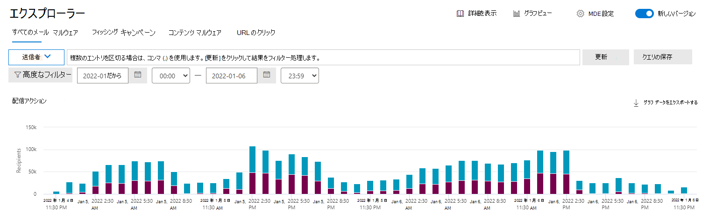
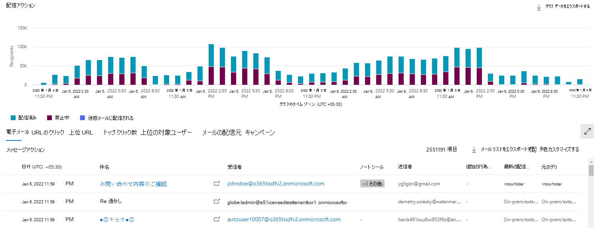
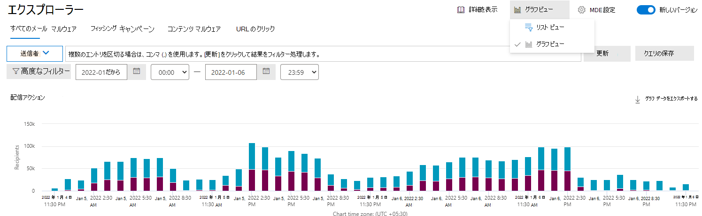

# エクスプローラーとリアルタイム検出

[!INCLUDE [MDO Trial banner](../includes/mdo-trial-banner.md)]

**適用対象**
- [Microsoft Defender for Office 365 プラン 1 およびプラン 2](defender-for-office-365.md)
- [Microsoft 365 Defender](../defender/microsoft-365-defender.md)

この記事の内容:

- [エクスプローラーとリアルタイム検出の違い](#differences-between-explorer-and-real-time-detections)
- [エクスプローラーとリアルタイム検出のエクスペリエンスを更新しました](#updated-experience-for-explorer-and-real-time-detections)
- [必要なライセンスとアクセス許可](#required-licenses-and-permissions)

> [!NOTE]
> これは、**エクスプローラー (脅威エクスプローラーとも呼ばれます)**、**電子メール セキュリティ**、**エクスプローラーとリアルタイム検出の基本** (ツール間の違い、操作に必要なアクセス許可など) の **3 つの記事シリーズ** の一部です。 このシリーズの他の 2 つの記事は、[エクスプローラーでの脅威の検出とエクスプローラーでの](threat-hunting-in-threat-explorer.md)[電子メール セキュリティです](email-security-in-microsoft-defender.md)。

この記事では、エクスプローラーとリアルタイム検出レポートの違い、エクスプローラーの更新されたエクスペリエンス、古いエクスペリエンスと新しいエクスペリエンスを切り替えることができるリアルタイム検出、および必要なライセンスとアクセス許可について説明します。

組織に [Microsoft Defender for Office 365](defender-for-office-365.md)があり、[アクセス許可](#required-licenses-and-permissions)がある場合は、**エクスプローラー** (**脅威エクスプローラー** とも呼ばれます) または **リアルタイム検出** を使用して、脅威を検出して修復できます。

Microsoft 365 Defender ポータルの <https://security.microsoft.com>[**電子メール & コラボレーション**] に移動し、[**エクスプローラー]** _または_ [**リアルタイム検出**] を選択します。 ページに直接移動するには、 <https://security.microsoft.com/threatexplorer> または <https://security.microsoft.com/realtimereports>.

これらのツールで以下のことができます。

- Microsoft 365セキュリティ機能によって検出されたマルウェアを確認します。
- フィッシング URL を表示し、判定データをクリックします。
- エクスプローラーのビューから自動調査と応答プロセスを開始します。
- 悪意のあるメールなどを調査します。

詳細については、「 [エクスプローラーを使用した電子メール セキュリティ](email-security-in-microsoft-defender.md)」を参照してください。

## エクスプローラーとリアルタイム検出の違い

- *リアルタイム検出* は、Defender for Office 365 プラン 1 で使用できるレポート ツールです。 *脅威エクスプローラー* は、Defender for Office 365 プラン 2 で使用できる脅威の検出と修復ツールです。
- リアルタイム検出レポートを使用すると、検出をリアルタイムで表示できます。 脅威エクスプローラーでもこれを行いますが、攻撃キャンペーンの強調表示など、特定の攻撃の詳細が提供され、セキュリティ運用チームに脅威を修復する機能 ( [自動調査と応答の調査](automated-investigation-response-office.md)のトリガーを含む) が提供されます。
- *すべての電子メール* ビューは脅威エクスプローラーで使用できますが、リアルタイム検出レポートには含まれません。
- 脅威エクスプローラーには、豊富なフィルター処理機能と修復アクションが含まれています。 詳細については、「[Microsoft Defender for Office 365 サービスの説明: Defender for Office 365 プラン間の機能の可用性](/office365/servicedescriptions/office-365-advanced-threat-protection-service-description#feature-availability-across-advanced-threat-protection-atp-plans)」を参照してください。

## エクスプローラーとリアルタイム検出のエクスペリエンスを更新しました

脅威エクスプローラーとリアルタイム検出のエクスペリエンスが更新され、最新のアクセシビリティ標準に合わせて調整され、ワークフローが最適化されます。 しばらくの間、古いエクスペリエンスと新しいエクスペリエンスを切り替えることができます。  

> [!NOTE]
> 切り替えはアカウントにのみ影響し、テナント内の他のユーザーには影響しません。 

脅威エクスプローラーとリアルタイム検出は、次のビューに分かれています。

- *すべてのメール*: Defender for Office 365 によって分析されたすべてのメールを表示し、良好なメールと悪意のあるメールの両方が含まれています。 この機能は脅威エクスプローラーにのみ存在し、リアルタイム検出では使用できません。 既定では、データを 2 日間表示するように設定されています。最大 30 日間拡張できます。 これは、脅威エクスプローラーの既定のビューでもあります。  

- *[マルウェア] ビュー*: マルウェアの脅威が特定された電子メールを表示します。 これはリアルタイム検出の既定のビューであり、2 日間 (30 日間に拡張できます) のデータを表示します。  

- *[フィッシング] ビュー*: フィッシングの脅威が特定された電子メールを表示します。

- *コンテンツ マルウェア ビュー*: OneDrive、SharePoint、またはTeamsで共有されているファイルで識別された悪意のある検出を表示します。 

これらのエクスペリエンス内の一般的なコンポーネントを次に示します。

- フィルター

    - さまざまなフィルターを使用して、電子メールまたはファイルの属性に基づいてデータを表示できます。  

    - 既定では、時間フィルターはレコードに適用され、2 日間適用されます。  

    - 複数のフィルターを適用する場合、それらは 'AND' モードで適用され、高度なフィルターを使用して 'OR' モードに変更できます。  

    - コンマを使用して、同じフィルターに複数の値を追加できます。  

    > [!div class="mx-imgBorder"]
    > 

- グラフ

    - グラフは、フィルターに基づくデータの視覚的な集計ビューを提供します。 異なるフィルターを使用して、異なるディメンションでデータを表示できます。  

    > [!NOTE]
    > リスト ビューにエントリが表示されている場合でも、グラフ ビューに結果が表示されない場合があります。 これは、フィルターによってデータが生成されない場合に発生します。 たとえば、フィルター マルウェア ファミリを適用したが、基になるデータに悪意のあるメールがない場合、このシナリオで使用できるデータがないというメッセージが表示される場合があります。  

    > [!div class="mx-imgBorder"]
    > 

- 結果グリッド  

    - 結果グリッドには、適用したフィルターに基づいて電子メールの結果が表示されます。  

    - テナントの構成セットに基づいて、データは UTC またはローカルタイム ゾーンで表示され、最初の列で使用可能なタイムゾーン情報が表示されます。  

    - リスト ビューから個々の電子メール エンティティ ページに移動するには、[ **新しいウィンドウで開く** ] アイコンをクリックします。 

    - 列をカスタマイズして、ビューを最適化するために列を追加または削除することもできます。

    > [!Note]
    > 結果セットを最大化するには、 *グラフ ビュー* と *リスト ビュー* を切り替えることができます。  

    > [!div class="mx-imgBorder"]
    > 

- 詳細なポップアップ  

    - ハイパーリンクをクリックすると、電子メールの概要パネル (件名列のエントリ)、受信者、または IP ポップアップにアクセスできます。  

    - 電子メールの概要パネルは、従来の電子メール ポップアップを置き換え、電子メール エンティティ パネルにアクセスするためのパスも提供します。  

    - IP、受信者、URL などの個々のエンティティ ポップアップは同じ情報を反映しますが、1 つのタブベースのビューに表示され、要件に基づいて異なるセクションを展開および折りたたみできます。  

    - URL などのポップアップの場合は、[ **すべてのメールの表示** ] または [ **すべてのクリックの表示] をクリック** して、その URL を含むメール/クリックの完全なセットを表示したり、結果セットをエクスポートしたりできます。  

- アクション

    - 脅威エクスプローラーから、メールの削除などの修復アクション *を* トリガーできます。 修復、修復の制限、および修復の追跡の詳細については、「 [悪意のあるメールを修復する](remediate-malicious-email-delivered-office-365.md)」を参照してください。  

- エクスポート

    - **[グラフ データのエクスポート]** をクリックすると、グラフの詳細をエクスポートできます。 同様に、[ **電子メール リストのエクスポート** ] をクリックして電子メールの詳細をエクスポートします。

    - 電子メール リストには、最大 200,000 件のレコードをエクスポートできます。 ただし、システムのパフォーマンスを向上させ、ダウンロード時間を短縮するには、さまざまな電子メール フィルターを使用する必要があります。

    > [!div class="mx-imgBorder"]
    > 

これらの機能に加えて、 *トップ URL*、 *トップ クリック*、 *上位ターゲット ユーザー*、 *メール配信元* などの更新されたエクスペリエンスも取得します。 *トップ URL、**トップ クリック*、および *上位ターゲット ユーザー* は、エクスプローラー内で適用したフィルターに基づいて、さらにフィルター処理できます。 

## 必要なライセンスとアクセス許可

エクスプローラーまたはリアルタイム検出のいずれかを使用するには[、Microsoft Defender for Office 365](defender-for-office-365.md)が必要です。

- エクスプローラーは、Defender for Office 365 プラン 2 にのみ含まれます。
- リアルタイム検出レポートは、Defender for Office 365 プラン 1 に含まれています。

Security Operations チームは、Defender for Office 365で保護する必要があるすべてのユーザーにライセンスを割り当てる必要があります。また、エクスプローラーとリアルタイムの検出には、ライセンスを持つユーザーの検出データが表示されます。

エクスプローラー *または* リアルタイム検出を表示して使用するには、次のアクセス許可が必要です。

- Defender for Office 365:
  - 組織管理
  - セキュリティ管理者 (Azure Active Directory管理センターで割り当てることができます (<https://aad.portal.azure.com>)
  - セキュリティ閲覧者
- Exchange Online:
  - 組織の管理
  - 表示専用組織の管理
  - "View-Only Recipients/表示専用受信者"
  - コンプライアンス管理

ロールとアクセス許可の詳細については、次の記事を参照してください。

- [Microsoft 365 Defender ポータルのアクセス許可](permissions-microsoft-365-security-center.md)
- [Exchange Online のアクセス許可](/e/exchange/permissions-exo/permissions-exo)

## 詳細

- [脅威エクスプローラーは、電子メール エンティティ ページで電子メールの詳細を収集します](mdo-email-entity-page.md)
- [配信された悪意のあるメールの検索と調査](investigate-malicious-email-that-was-delivered.md)
- [SharePoint Online、OneDrive、Microsoft Teamsで検出された悪意のあるファイルを表示する](mdo-for-spo-odb-and-teams.md)
- [脅威保護の状態レポート](view-email-security-reports.md#threat-protection-status-report)
- [Microsoft Threat Protection での自動調査および対応](automated-investigation-response-office.md)
