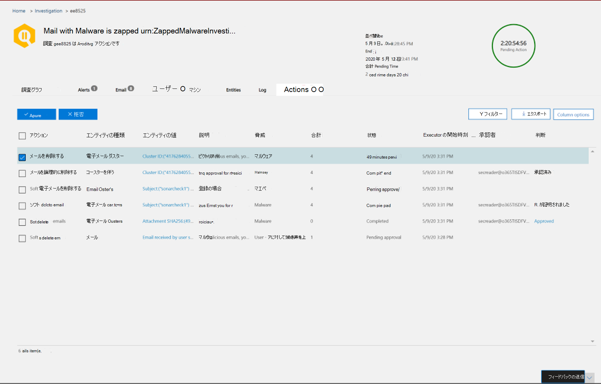

# メールで配信される悪意のある電子メールを修復Office 365

[!INCLUDE [Microsoft 365 Defender rebranding](../includes/microsoft-defender-for-office.md)]

**適用対象**
- [Microsoft Defender for Office 365 プラン 2](defender-for-office-365.md)

修復とは、脅威に対して所定のアクションを実行する方法を意味します。 組織に送信される悪意のある電子メールは、システム、ゼロ時間自動削除 (ZAP)、または受信トレイへの移動、迷惑メールへの移動、削除済みアイテムへの移動、削除済みアイテムへの移動、削除の一時削除などの修復アクションを通じてセキュリティ チームによってクリーンアップできます。  Microsoft Defender for Office 365プラン 2/E5 を使用すると、セキュリティ チームは手動および自動化された調査を通じて、電子メールやコラボレーション機能の脅威を修復できます。

> [!NOTE]
> 悪意のある電子メールを修復するには、セキュリティ チームに割り当 *てられた検索と削除の役割* が必要です。 役割の割り当ては[、ポータルのアクセス許可Microsoft 365 Defenderされます](permissions-microsoft-365-security-center.md)。

## 開始する前に知る必要がある情報

管理者は、電子メールに対して必要なアクションを実行できますが、承認されたアクションを取得するには、Microsoft 365 Defender ポータルの電子メール **&** コラボレーションアクセス許可で検索と削除の役割が割り当てられている必要があります。  [検索 *と削除] 役割が* 役割グループの 1 つに追加されていないと、アクションを実行することはできません。

## 手動および自動修復

*手動検索は* 、セキュリティ チームがエクスプローラーの検索機能とフィルター機能を使用して脅威を手動で識別するときに発生します。 手動の電子メール修復は、修復する必要がある一連の電子メールを識別した後、任意の電子メール ビュー *(マルウェア*、フィッシング、またはすべての電子 *メール)* を介してトリガーできます。

> [!div class="mx-imgBorder"]
> 

セキュリティ チームは、エクスプローラーを使用していくつかの方法で電子メールを選択できます。

- [電子メールを手で選択する]: さまざまなビューでフィルターを使用します。 修復するメールを最大 100 件選択します。

- クエリの選択: 上部の [すべて選択] ボタンを使用してクエリ **全体を選択** します。 アクション センターのメール送信の詳細にも、同じクエリが表示されます。

- 除外を含むクエリの選択: セキュリティ操作チームは、クエリ全体を選択し、クエリから特定の電子メールを手動で除外して、電子メールを修復する場合があります。 これを行うには、管理者は [すべて選択] チェック ボックスを使用し、下にスクロールして電子メールを手動で除外できます。 クエリには最大 1,000 件のメールを保持できます。 除外の最大数は 100 です。

エクスプローラーで電子メールを選択したら、直接アクションを実行するか、メールをキューに入れてアクションを実行して修復を開始できます。

- 直接承認: 受信トレイへの移動、迷惑メールへの移動、削除済みアイテムへの移動、ソフト削除、またはハード削除のようなアクションが、適切なアクセス許可を持つセキュリティ担当者によって選択され、修復の次の手順が実行された場合、修復プロセスは選択されたアクションの実行を開始します。  一時的なフライアウトは、進行中の修復を示します。

- 2 段階の承認: 適切なアクセス許可を持ってない管理者や、アクションの実行を待つ必要がある管理者は、「修復に追加」アクションを実行できます。 この場合、対象の電子メールが修復コンテナーに追加されます。 修復が実行される前に承認が必要です。

**自動調査および応答アクションは** 、アラートまたはエクスプローラーのセキュリティ運用チームによってトリガーされます。 これには、セキュリティ運用チームによって承認される必要がある推奨修復アクションが含まれる場合があります。 これらのアクションは、自動調査 **の [アクション** ] タブに含まれます。

> [!div class="mx-imgBorder"]
> 

エクスプローラーで作成されたすべての修復 (直接承認または 2 段階承認) と、自動調査による承認されたアクションがアクション センターに表示されます。 [レビュー アクション センター]の左側のナビゲーション パネルから \> **アクセスします**。

> [!div class="mx-imgBorder"]
> 

アクション センターには、過去 30 日間のすべての修復アクションが表示されます。 エクスプローラーで実行されるアクションは、修復の作成時にセキュリティ操作チームが指定した名前で一覧表示されます。 自動調査で実行されるアクションには、調査をトリガーした関連するアラートで始まるタイトルがあります 。"Zap email cluster..." など。

修復アイテムを開き、その名前、作成日、説明、脅威の重大度、状態など、修復アイテムの詳細を表示します。 また、次の 2 つのタブも表示されます。

- **[メールの** 送信] タブ: 修復する脅威エクスプローラーまたは自動調査を通じて送信されたメールの数を表示します。 これらの電子メールは、操作可能または操作不可の場合があります。

  > [!div class="mx-imgBorder"]
  > 

  - **操作可能**: 次のクラウド メールボックスの場所にあるメールは、操作および移動できます。
    - 受信トレイ
    - 迷惑メール
    - フォルダーの削除
    - 削除済みフォルダー

      > [!NOTE]
      > 現在、メールボックスにアクセスできるユーザーだけが、削除済みフォルダーからアイテムを回復できます。

  - **操作不可**: 次の場所にあるメールは、修復アクションで処理または移動できません。
    - Quarantine
    - ハード削除されたフォルダー
    - オンプレミス/外部
    - 失敗/削除

  疑わしいメッセージは、修復可能または修復不可として分類されます。 ほとんどの場合、修復可能なメッセージと修復可能でないメッセージの組み合わせは、送信されたメッセージの合計と等しくなります。 しかし、まれに、これは当てはめではない可能性があります。 これは、システムの遅延、タイムアウト、または期限切れのメッセージが発生する可能性があります。 メッセージの有効期限は、組織のエクスプローラーの保持期間に基づいて行います。

  組織のエクスプローラーの保持期間後に古いメッセージを修復しない限り、番号の不整合が発生した場合は、アイテムの修復を再試行してください。 システムの遅延の場合、修復の更新は通常、数時間以内に更新されます。

  エクスプローラーでのメールの組織の保持期間が 30 日で、29 ~ 30 日後のメールを修復する場合、メール送信数が必ずしも追加されない場合があります。 電子メールが既に保持期間から移行し始めた可能性があります。

  修復がしばらくの間"進行中" 状態でスタックしている場合は、システムの遅延が原因である可能性があります。 修復には数時間かかる場合があります。 システムの遅延により、修復の開始時点で一部の電子メールがクエリに含まれていない可能性があります。メール送信数にバリエーションが表示される場合があります。 このような場合は、修復を再試行してください。

  > [!NOTE]
  > 最適な結果を得る場合は、50,000 以下のバッチで修復を行う必要があります。

  修復中は、修復可能な電子メールだけが処理されます。 クラウド メールボックスに保存されないので、修復可能でない電子メールは、Office 365システムによって修復できません。

  管理者は必要に応じて検疫内の電子メールに対してアクションを実行できますが、手動で削除されていない場合、それらのメールは検疫から期限切れになります。 悪意のあるコンテンツが理由で検疫されたメールにはユーザーがアクセスできないので、セキュリティ担当者は検疫内の脅威を取り除くために何も操作する必要はありません。 メールがオンプレミスまたは外部の場合、ユーザーに連絡して疑わしいメールに対処できます。 または、管理者は、削除に個別の電子メール サーバー/セキュリティ ツールを使用できます。 これらの電子メールは、エクスプローラーで配信場所 *= on-prem 外部* フィルターを適用することによって識別できます。 失敗または削除されたメール、またはユーザーがアクセスできない電子メールの場合、これらのメールはメールボックスに届かなからないので、軽減するメールは一切送信されません。

  次の図は、アクション センターでの申請の外観を示しています。 修復には複数の申請を含めできます。 1 つの自動調査によって複数のアクションが承認されると、各電子メールまたは電子メール クラスターアクションは、別の申請と同じ修復に表示されます。

  > [!div class="mx-imgBorder"]
  > 

  メール送信アイテムを選択すると、その修復の詳細 (自動調査によって修復がトリガーされる場合や、クエリを選択してエクスプローラーで修復がトリガーされる場合) や修復の開始時間と終了時間が表示されます。 また、修復のために送信されたメッセージの一覧も表示されます。 メッセージがエクスプローラーの保持期間外に移動すると、メッセージは一覧から消えます。 一覧には、修復可能な個々のメッセージも表示されます。

- **アクション ログ**: このタブには、承認された日付、アクション、状態、およびカウントを承認した管理者など、修復されたメッセージが表示されます。

  状態は次の場合があります。

  - **開始**: 修復がトリガーされます。
    - **Queued**: 修復は、メールの軽減のためにキューに入れられます。
    - **進行中:** 軽減策が進行中です。
    - **[完了**] : 修復可能なすべての電子メールの軽減策が正常に完了したか、いくつかのエラーが発生しました。
    - **失敗:** 修復が成功しなかった。

  修復可能な電子メールのみを処理できるので、各電子メールのクリーンアップは成功または失敗として表示されます。 修復可能なメールの総数から、成功した軽減策と失敗した軽減策が報告されます。

  - **成功**: 修復可能な電子メールに対する目的のアクションが達成されました。 たとえば、管理者がメールボックスからメールを削除する場合、管理者はメールをソフト削除するアクションを実行します。 アクションが実行された後に修復可能な電子メールが元のフォルダーに見つからない場合、状態は正常に表示されます。

  - **失敗**: 修復可能な電子メールに対する目的のアクションが失敗しました。 たとえば、管理者がメールボックスからメールを削除する場合、管理者はメールをソフト削除するアクションを実行します。 アクションが実行された後もメールボックスに修復可能な電子メールが見つかった場合、状態は失敗したと表示されます。
  
  - **既に宛先**: 目的のアクションは、電子メールまたは電子メールが宛先の場所に既に存在していた場合に既に実行されています。 たとえば、電子メールは、1 日目にエクスプローラーを通じて管理者によって削除されました。 次に、同様のメールが 2 日目に表示され、管理者がソフト削除します。これらのメールを選択すると、管理者は既に削除済みのメールを 1 日目から選択します。 これらの電子メールは再び処理され、宛先の場所に存在していたので、それらの電子メールに対して何も実行されていないので、"既に宛先にある" と表示されます。

  - **New**: アクション *ログに [* 既に移動先] 列が追加されました。 この機能は、脅威エクスプローラーの最新の配信場所を使用して、メールが既に修復済みである場合に通知します。 *既に宛先に* 設定されている場合、セキュリティ チームは、まだ対処する必要があるメッセージの総数を理解するのに役立ちます。
                
アクションは、脅威エクスプローラーの受信トレイ、迷惑メール、削除済み、および Soft Deleted フォルダー内のメッセージにのみ実行できます。 新しい列の動作の例を次に示します。 受信 *トレイに存在する* メッセージに対してソフト削除アクションが実行され、ポリシーに従ってメッセージが処理されます。 次にソフト削除が実行された場合、このメッセージは再びアドレス指定する必要が生じなく、列 '既に宛先' の下に表示されます。

アクション ログ内の任意のアイテムを選択して、修復の詳細を表示します。 詳細に「成功」または「メールボックスに見つかりません」と表示される場合、そのアイテムは既にメールボックスから削除されています。 修復中にシステム エラーが発生する場合があります。 このような場合は、修復アクションを再試行してください。

電子メールの大規模なバッチを修復する場合は、メール送信を介して修復のために送信されたメッセージと、アクション ログを介して修復されたメッセージをエクスポートします。 エクスポート制限が 100,000 レコードに増加しました。

修復は、脅威を軽減し、疑わしいメールに対処し、組織を安全に保つのに役立ちます。
