# セーフMicrosoft Defender for Office 365

[!INCLUDE [Microsoft 365 Defender rebranding](../includes/microsoft-defender-for-office.md)]

**適用対象**
- [Microsoft Defender for Office 365 プラン 1 およびプラン 2](defender-for-office-365.md)
- [Microsoft 365 Defender](../defender/microsoft-365-defender.md)

> [!IMPORTANT]
> この記事は、[Microsoft Defender for Office 365](defender-for-office-365.md) をご利用の法人のお客様を対象としています。 Outlook.com、Microsoft 365 Family、または Microsoft 365 Personal を使用している場合に、Outlook の Safelinks に関する情報を探している場合は[、「Advanced Outlook.com](https://support.microsoft.com/office/882d2243-eab9-4545-a58a-b36fee4a46e2)セキュリティ」を参照してください。

セーフ[リンクは、メール](defender-for-office-365.md)フロー内の受信電子メール メッセージの URL のスキャンと書き換え、および電子メール メッセージなどの URL とリンクのクリック時の検証を提供する Defender for Office 365 の機能です。 セーフリンク のスキャンは、受信メール メッセージ(EOP) の通常のスパム対策およびマルウェア対策保護に加えてExchange Online Protection発生します。 安全なリンクのスキャンは、フィッシングやその他の攻撃で使用される悪意のあるリンクから組織を保護できます。

安全なリンクの保護機能は以下の場所で利用できます。

- **メール メッセージ**: メール メッセージ内のリンクに対する安全なリンク保護は、安全なリンク ポリシーで制御されます。 既定のリンク ポリシーセーフないので、電子メール メッセージで セーフ リンクの保護を取得するには、1 つ以上の セーフ **リンク ポリシーを作成する必要があります**。 手順については、「Microsoft Defender for セーフのリンク ポリシーをセットアップする[」を参照Office 365。](set-up-safe-links-policies.md)

  電子メール メッセージのリンク保護セーフ詳細については、この記事の「セーフのリンク[設定](#safe-links-settings-for-email-messages)」セクションを参照してください。
  
  > [!NOTE]
  > セーフメールが有効なパブリック フォルダーでは、リンクは機能しません。

- **Microsoft Teams**: Teams の会話、グループ チャット、またはチャネルからのリンクに対する安全なリンク保護も、安全なリンク ポリシーで制御されます。 既定の セーフ リンク ポリシーはないので、Teams で セーフ リンクの保護を取得するには、1 つ以上の セーフ **リンク ポリシーを作成する必要があります**。

  詳細については、セーフのリンク保護Teams後の「セーフのリンク[Microsoft Teams設定」](#safe-links-settings-for-microsoft-teams)を参照してください。

- **Office 365 アプリ**: Office 365 アプリの安全なリンク保護は、サポートされたデスクトップ、モバイル、および Web アプリで利用できます。 リンク **ポリシー** セーフ外Office 365グローバル設定で、アプリのリンク保護セーフ構成します。  手順については、「Microsoft Defender for セーフリンクのグローバル設定を構成する」[を参照Office 365。](configure-global-settings-for-safe-links.md)

  Office 365 アプリ向けの安全なリンクの保護は、Microsoft Defender for Office 365 のライセンスを付与された組織内のすべてのユーザーに適用され、そのユーザーがアクティブな安全なリンク ポリシーに含まれているかどうかは関係ありません。

  セーフ アプリの セーフ リンク保護の詳細Office 365、この記事の後半の「セーフ リンクの設定Office 365」セクションを参照してください。

この記事では、リンク設定の次の種類のセーフ説明します。

- **設定リンク** セーフ : これらの設定は、特定のポリシーに含まれるユーザーにのみ適用され、ポリシー間で設定が異なる場合があります。 これには、以下の設定が含まれます。

  - [セーフ電子メール メッセージのリンク設定](#safe-links-settings-for-email-messages)
  - [セーフリンクの設定Microsoft Teams](#safe-links-settings-for-microsoft-teams)
  - [リンク ポリシーの 「次の URL を書き換セーフしない」](#do-not-rewrite-the-following-urls-lists-in-safe-links-policies)

- **グローバル セーフ リンクの設定**: これらの設定は、リンク ポリシーではなく、グローバルセーフ構成されます。 これには、以下の設定が含まれます。

  - [セーフアプリのリンクOffice 365設定](#safe-links-settings-for-office-365-apps)
  - [[リンク] の [次の URL をブロックする] セーフします。](#block-the-following-urls-list-for-safe-links)

次の表では、Office 365 の Defender を含む Microsoft 365 および Office 365 組織の セーフ リンクのシナリオについて説明します (つまり、ライセンスの不足は、この例では決して問題ではありません)。

 

****

|シナリオ|結果|
|---|---|
|Jean はマーケティング部門のメンバーです。 セーフセーフ リンクのグローバル設定では、Office 365 アプリのリンク保護が有効にされ、マーケティング部門のメンバーに適用される セーフ リンク ポリシーが存在します。 Jean は、PowerPointメッセージでプレゼンテーションを開き、プレゼンテーション内の URL をクリックします。|Jean は、リンクによってセーフされています。 
 Jean はリンク ポリシーセーフ含まれており、セーフアプリのリンクOffice 365保護が有効です。 
 Office 365 アプリの セーフ Links 保護の要件の詳細については、この記事の後半の「セーフ リンク設定 for [Office 365 apps」](#safe-links-settings-for-office-365-apps)セクションを参照してください。|
|Chris の組織Microsoft 365 E5リンク ポリシーセーフ構成されていません。 Chris は、最終的にクリックする悪意のある Web サイトへの URL を含む外部送信者からメールを受信します。|Chris は、リンクによってセーフされません。 
 管理者は、受信電子メール メッセージで セーフリンク保護を取得するために、セーフリンク ポリシーを 1 つ以上作成する必要があります。 Chris をポリシーの条件に含め、リンクの保護セーフ必要があります。|
|Pat の組織では、管理者は セーフ リンク ポリシーを作成したが、セーフアプリの Office 365保護が有効になっている。 Pat は Word ドキュメントを開き、ファイル内の URL をクリックします。|Pat はリンクによってセーフされません。 
 セーフ Office 365 アプリのリンク保護はグローバルに有効になりますが、Pat はアクティブな セーフ リンク ポリシーには含まれていないので、保護を適用できます。|
|Lee の組織では、リンクのグローバル設定の [次の URL をブロックする] セーフ `https://tailspintoys.com` されます。  Lee セーフを含むリンク ポリシーが既に存在します。 Lee は URL を含む電子メール メッセージを受信します `https://tailspintoys.com/aboutus/trythispage` 。 Lee が URL をクリックします。|Lee の URL が自動的にブロックされる場合があります。リスト内の URL エントリと、使用するメール クライアント Lee によって異なります。 詳細については、この記事の[後半](#block-the-following-urls-list-for-safe-links)の「リンク」セクションの「セーフ URL をブロックする」を参照してください。|
|Jamie と Julia は両方とも、contoso.com。 一昔前に、管理者は Jamie と Julia の両方にセーフリンク ポリシーを構成していました。 Jamie は、電子メールに悪意のある URL が含まれていることを知らずに、電子メールを Julia に送信します。|Julia は、内部受信者セーフメッセージに適用セーフリンク ポリシーが構成されている場合は、セーフ リンクによって保護されます。 詳細については、この記事の[「セーフのリンク設定](#safe-links-settings-for-email-messages)」セクションを参照してください。|
|

## セーフ電子メール メッセージのリンク設定

安全なリンクは、受信メールをスキャンして、悪意のあるハイパーリンクを検出します。 スキャンされた URL は、Microsoft 標準 URL プレフィックスを使用して書き `https://nam01.safelinks.protection.outlook.com` 換えされます。 リンクを書き換えた後、潜在的な悪意のあるコンテンツがないか分析します。

[セーフリンクが URL を書き換えた後、メッセージが手動で転送または返信された場合でも、URL は書き換えたままです (内部受信者と外部受信者の両方)。 転送メッセージまたは返信先メッセージに追加された追加のリンクは書き換えされません。 ただし、受信トレイ ルールまたは SMTP 転送による自動転送の場合、その受信者が セーフ リンクによって保護されている場合や、以前の通信で URL が既に書き換え済みである場合を含め、最終的な受信者を対象としたメッセージに URL は書き換えされません。 書き換え URL は HTML メールにのみ適用され、URL の書き換えによってリッチ テキストとプレーン テキストの URL が読み取り不能になりますが、配信前にこれらの URL はスキャンされます。 URL を含むリッチ テキストメールとプレーン テキスト メールは、デスクトップ バージョン 16.0.12513 以降の Outlook のクリック時に セーフ Links へのクライアント側 API 呼び出しによってもチェックされます。

電子メール メッセージにセーフリンク ポリシーの設定については、次の一覧で説明します。

- **メッセージ内の不明な潜在的に** 悪意のある URL のアクションを選択します:電子メール セーフのリンク スキャンを有効または無効にします。 推奨される値は **On です**。 この設定を有効にすると、次の操作が実行されます。

  - セーフリンク のスキャンは、Outlook (C2R) で有効Windows。
  - URL は書き換え、ユーザーはメッセージ内の URL をクリックセーフリンク保護を介してルーティングされます。
  - クリックすると、既知の悪意のある URL の一覧と [次の URL をブロックする] リストに対して [URL がチェックされます](#block-the-following-urls-list-for-safe-links)。
  - 有効な評価を持つ URL は、バックグラウンドで非同期的に無効になります。

- **ファイルを指** す疑わしいリンクやリンクのリアルタイム URL スキャンを適用する: ダウンロード可能なコンテンツを指す電子メール メッセージ内のリンクを含む、リンクのリアルタイム スキャンを有効にする。 推奨される値は有効です。
  - **メッセージを配信する前に URL のスキャンが完了するのを待ちます**。
    - 有効: URL を含むメッセージは、スキャンが完了するまで保持されます。 メッセージは、URL が安全と確認された後にのみ配信されます。 これは推奨される値です。
    - 無効: URL スキャンを完了できない場合は、メッセージを配信します。

- **[セーフ** 組織内で送信された電子メール メッセージへのリンクの適用: 同じ組織内の内部送信者と内部受信者の間で送信されるメッセージに対する セーフ Exchange Online リンクのスキャンを有効または無効にします。 推奨される値は有効です。

- **ユーザーのクリックを追跡** しない : 電子メール メッセージでクリックされた URL セーフリンククリック データの保存を有効または無効にします。 推奨値は、この設定を選択しないままにすることをお勧めします (ユーザーのクリックを追跡する場合)。

  内部送信者と内部受信者の間で送信される電子メール メッセージ内のリンクの URL クリック追跡は、現在サポートされていません。

- **ユーザーに元の URL** へのクリックを許可しない : 警告ページから元の URL へのクリックをユーザーに許可またはブロックします。 推奨値が有効です。

- **通知ページと警告ページに組織** のブランド化を表示する: このオプションは、警告ページに組織のブランド化を表示します。 ブランド化は、既定の Microsoft 警告ページが攻撃者によって頻繁に使用されるので、ユーザーが正当な警告を識別するのに役立ちます。 カスタマイズされたブランド化の詳細については、「組織のカスタム Microsoft 365[テーマをカスタマイズする」を参照してください](../../admin/setup/customize-your-organization-theme.md)。

- **次の URL を書き換えない**: URL は変更しない。 スキャンを必要としない安全な URL のカスタム リストを保持します。 リストは、リンク ポリシーごとにセーフされます。 [次の URLを書き換えない] リストの詳細については、この記事の[「セーフ Links](#do-not-rewrite-the-following-urls-lists-in-safe-links-policies)ポリシー」セクションの「次の URL を書き換えない」を参照してください。

  [リンク] ポリシーの Standard および Strict ポリシー設定の推奨値の詳細については、「セーフ セーフリンク ポリシー設定」を[参照してください](recommended-settings-for-eop-and-office365.md#safe-links-policy-settings)。

 - **URL を書き換えないで、SafeLinks API** を介してチェックを行う: この設定が有効になっている場合、URL の折り返しは行なされません。 セーフリンクは、URL クリック時に API を介して排他的に呼び出され、それをサポートOutlookクライアントによって呼び出されます。 推奨値は無効です。
  
- **受信者フィルター**: ポリシーが適用されるユーザーを決定する受信者の条件と例外を指定する必要があります。 条件や例外には次のプロパティを使用できます。
  - **受信者が次の場合**
  - **受信者ドメインは、**
  - **受信者が次のメンバーの場合**

  各条件や例外は 1 回しか使用できませんが、条件や例外には複数の値を含めることができます。 同じ条件や例外に複数の値がある場合、OR ロジック (たとえば、_\<recipient1\>_ または _\<recipient2\>_) が適用されます。 a別の条件や例外がある場合は AND ロジック (たとえば、_\<recipient1\>_ かつ _\<member of group 1\>_) が適用されます。

- **優先度**: 複数のポリシーを作成する場合は、適用する順序を指定できます。 2つのポリシーが同じ優先順位を持つことはできません。最初のポリシーが適用されると、ポリシーの処理は停止します。

  優先順位と複数のポリシーを評価し適用する方法の詳細については、「[メール保護の優先順位](how-policies-and-protections-are-combined.md)」を参照してください。
  
### 電子メール セーフリンクの動作方法

電子メール メッセージ内の URL に対するリンクセーフの仕組みについて、大まかに説明します。

1. メッセージが受信者のメールボックスに配信される前に、すべての電子メールは EOP を通過します。ここで、インターネット プロトコル (IP) およびエンベロープ フィルター、署名ベースのマルウェア保護、スパム対策およびマルウェア対策フィルター。

2. ユーザーは自分のメールボックスでメッセージを開き、メッセージ内の URL をクリックします。

3. セーフリンクは、Web サイトを開く前に URL をすぐに確認します。

   - URL が [次の URL をブロックする] リストに **含** まれている場合は、ブロックされた [URL 警告が開](#blocked-url-warning) きます。

   - URL が悪意のあると判断された Web サイトを参照している場合は、悪意のある Web サイトの警告ページ (または別の警告ページ) が開きます。

   - URL がダウンロード可能なファイルを指し示し、[ファイルをポイントする疑わしいリンクとリンクのリアルタイム **URL** スキャンを適用する] 設定が、ユーザーに適用されるポリシーで有効になっている場合、ダウンロード可能なファイルがチェックされます。

   - URL が安全と判断された場合、Web サイトが開きます。

## セーフリンクの設定Microsoft Teams

リンク ポリシーで、セーフのリンク保護を有効またはMicrosoft Teams無効セーフします。 具体的には、[不明な URL または潜在的に悪意のある URL に対してアクションを選択する **] Microsoft Teams** します。 推奨される値は **On です**。

電子メール メッセージ内のリンクセーフ適用されるリンク ポリシーの次の設定は、メール メッセージ内のリンクにも適用Teams。

- **ファイルを指す疑わしいリンクやリンクに対してリアルタイムの URL スキャンを適用する**
- **ユーザーのクリックを追跡しない**
- **ユーザーに元の URL へのクリックを許可しない**

これらの設定については、「電子メール メッセージの[リンクセーフ」で説明しました](#safe-links-settings-for-email-messages)。

Microsoft Teams の セーフ リンク保護を有効にすると、保護されたユーザーがリンクをクリックすると、Teams の URL が既知の悪意のあるリンクの一覧に対してチェックされます (クリック時の保護)。 URL は書き換え用ではありません。 リンクが悪意のあると判明した場合、ユーザーには次のエクスペリエンスがあります。

- Teams 会話、グループ チャット、またはチャネルからリンクがクリックされた場合、次のスクリーンショットに示すように警告ページが既定の Web ブラウザーに表示されます。
- ピン留めされたタブからリンクがクリックされた場合、警告ページは、そのタブ内Teamsインターフェイスに表示されます。Web ブラウザーでリンクを開くオプションは、セキュリティ上の理由から無効になっています。
- ポリシーの [ユーザーによる元の URL へのクリックを許可しない] 設定の構成方法に応じて、ユーザーは元の **URL** (スクリーンショットの [続行] (推奨しない **)** をクリックするか、または許可されません。 ユーザーが元の URL をクリックできない場合は、[ユーザーが元の **URL** をクリックすることを許可しない] 設定を有効にすることをお勧めします。

Teams 保護が有効になっている セーフ リンク ポリシーにリンクを送信したユーザーが含まれていない場合、ユーザーはコンピューターまたはデバイス上の元の URL を自由にクリックできます。

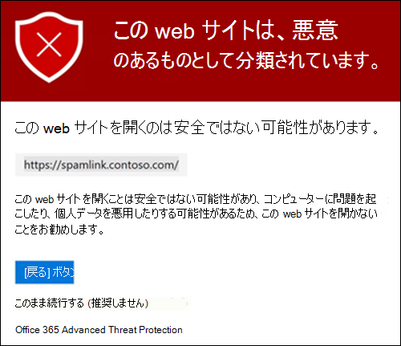

警告ページの **[戻る** ] ボタンをクリックすると、ユーザーは元のコンテキストまたは URL の場所に戻ります。 ただし、元のリンクを再度クリックすると、セーフリンクが再スキャンされますので、警告ページが再表示されます。

### セーフリンクの動作Teams

大まかには、次に示すのは、セーフリンクの保護が URL に対してどのように機能Microsoft Teams。

1. ユーザーがアプリのTeamsします。

2. Microsoft 365は、ユーザーの組織に microsoft Defender for Office 365 が含まれており、ユーザーがアクティブな セーフ リンク ポリシーに含まれていて、Microsoft Teams の保護が有効になっているか確認します。

3. URL は、チャット、グループ チャット、チャネル、およびタブ内のユーザーのクリック時に検証されます。

## セーフアプリのリンクOffice 365設定

セーフOffice 365 アプリのリンク保護は、電子メール メッセージ内のリンクではなく Office ドキュメント内のリンクをチェックします (ただし、ドキュメントを開いた後、添付された Office ドキュメント内のリンクを電子メール メッセージでチェックできます)。

セーフアプリのリンク保護Office 365クライアント要件は次のとおりです。

- Microsoft 365 AppsまたはMicrosoft 365 Business Premium。
  - 現在のバージョンの Word、Excel、PowerPoint、Windows Web ブラウザーで使用できます。
  - Office iOS または Android デバイス上のアプリを選択します。
  - VisioのWindows。
  - OneNoteブラウザーで使用します。

- Office 365は、モダン認証を使用するように構成されています。 詳細については[、「Office 2013、Office 2016、および Office 2019](../../enterprise/modern-auth-for-office-2013-and-2016.md)クライアント アプリの最新の認証のしくみ」を参照してください。

- ユーザーは、自分の仕事または学校のアカウントを使用してサインインします。 詳細については、「サインインしてサインイン[する」を参照Office。](https://support.microsoft.com/office/b9582171-fd1f-4284-9846-bdd72bb28426)

リンクポリシーセーフではなく、Office 365 リンクのグローバル設定でセーフリンク保護セーフ構成します。 この保護は、アクティブな セーフ Links ポリシーにユーザーが含まれているかどうかに関係なく、Office 365 の Defender のライセンスを取得している組織内のすべてのユーザーに適用されます。

[リンク] セーフは、アプリで使用できるOffice 365示します。

- **Office 365アプリケーション**: サポートされているアプリでセーフリンクスキャンを有効またはOffice 365します。 既定値と推奨値は On **です**。

- **ユーザーが [セーフ** リンク] をクリックした場合は追跡しない : デスクトップ バージョンの Word、Excel、PowerPoint、および Visio でクリックされた URL の セーフ リンク クリック データの保存を有効または無効にします。 推奨される値は **Off** です。つまり、ユーザーのクリックが追跡されます。

- ユーザーが元の **URL** への安全なリンクをクリックさせない : ユーザーが警告 ページをクリックして、デスクトップ バージョンの Word、Excel、PowerPoint、および Visio の元の URL をクリックVisio。 既定値と推奨値は On **です**。

アプリのリンクのセーフ設定を構成するには、「Office 365アプリのリンク保護セーフ[構成する」をOffice 365してください](configure-global-settings-for-safe-links.md#configure-safe-links-protection-for-office-365-apps-in-the-microsoft-365-defender-portal)。

Standard および Strict ポリシー設定の推奨値の詳細については、「グローバル設定 for セーフ[リンク」を参照してください](recommended-settings-for-eop-and-office365.md#global-settings-for-safe-links)。

### アプリセーフリンクの動作Office 365方法

大まかには、アプリ内の URL にセーフリンク保護がどのように機能Office 365します。 サポートされているアプリOffice 365前のセクションで説明します。

1. ユーザーは、組織で自分の仕事または学校のアカウントを使用してサインインし、Microsoft 365 AppsまたはMicrosoft 365 Business Premium。

2. ユーザーが開き、サポートされているドキュメント内OfficeリンクをクリックOffice アプリ。

3. セーフリンクは、ターゲット Web サイトを開く前に URL をすぐに確認します。

   - [リンクのスキャン] ([次の URL をブロックする] セーフ)をスキップする URL がリストに含まれている場合は、ブロックされた URL 警告[ページが開](#blocked-url-warning)きます。

   - URL が悪意のあると判断された Web サイトを参照している場合は、悪意のある Web サイトの警告ページ (または別の警告ページ) が開きます。

   - URL がダウンロード可能なファイルを指し示し、ユーザーに適用される セーフ Links ポリシーがダウンロード可能なコンテンツへのリンクをスキャンするように構成されている場合 (ファイルを指す疑わしいリンクやリンクに対してリアルタイム **URL** スキャンを適用する) 場合、ダウンロード可能なファイルがチェックされます。

   - URL が安全であると見なされた場合、ユーザーは Web サイトにアクセスされます。

   - [リンクセーフスキャンを完了できない場合は、セーフの保護はトリガーされない。 デスクトップ Officeでは、ユーザーが移動先の Web サイトに進む前に警告が表示されます。

> [!NOTE]
> 各セッションの開始時に、ユーザーが [リンク] を有効にセーフ数秒かかるOfficeがあります。

## [リンク] の [次の URL をブロックする] セーフします。

[**次の URL をブロックする**] ボックスの一覧では、次の場所にある [リンクセーフスキャンによって常にブロックされるリンクを定義します。

- 電子メール メッセージ
- ドキュメントと Mac Office 365アプリWindowsドキュメント。
- iOS Office Android 用のドキュメント。

アクティブなリンク ポリシーのユーザーセーフサポートされているアプリのブロックされたリンクをクリックすると、[ブロックされた URL の警告][ページに移動](#blocked-url-warning)します。

[リンク] のグローバル設定で URL の一覧をセーフします。 手順については [、「Configure the Configure the following URL」リストを参照してください](configure-global-settings-for-safe-links.md#configure-the-block-the-following-urls-list-in-the-microsoft-365-defender-portal)。

**注**:

- あらゆる場所でブロックされている URL の本当に汎用的なリストについては、「Manage [the Tenant Allow/Block List」を参照してください](tenant-allow-block-list.md)。
- [次の URL を **ブロックする] リストの制限** 。
  - エントリの最大数は 500 です。
  - エントリの最大長は 128 文字です。
  - すべてのエントリは、10,000 文字を超えることはできません。
- URL の末尾にスラッシュ ( ) を `/` 含めない。 たとえば、 を `https://www.contoso.com` 使用します `https://www.contoso.com/` 。
- ドメイン専用 URL (たとえば、または) は、ドメインを含む `contoso.com` `tailspintoys.com` すべての URL をブロックします。
- 完全なドメインをブロックせずにサブドメインをブロックできます。 たとえば、サブドメインを含む URL をブロックしますが、完全なドメインを含む `toys.contoso.com*` URL はブロックしない `contoso.com` 。
- URL エントリごとに最大 3 つのワイルドカード ( `*` ) を含めできます。

### "次の URL をブロックする" リストのエントリ構文

入力できる値とその結果の例を次の表に示します。

 

****

|値|結果|
|---|---|
|`contoso.com` 
 または 
 `*contoso.com*`|ドメイン、サブドメイン、およびパスをブロックします。 たとえば `https://www.contoso.com` `https://sub.contoso.com` 、、、 `https://contoso.com/abc` およびブロックされます。|
|`https://contoso.com/a`|ブロック `https://contoso.com/a` ですが、追加のサブパスはブロックしない `https://contoso.com/a/b` 。|
|`https://contoso.com/a*`|ブロック `https://contoso.com/a` や追加のサブパス `https://contoso.com/a/b` (.|
|`https://toys.contoso.com*`|サブドメイン (この例では) をブロックしますが、他のドメイン URL (など) へのクリック `toys` を `https://contoso.com` 許可 `https://home.contoso.com` します。|
|

## リンク ポリシーの 「次の URL を書き換セーフしない」

> [!NOTE]
> 組織で [リンク] セーフ使用している場合は、サード パーティのフィッシング テストでサポートされている唯一の方法は、次の **URL** リストを書き換えない方法です。

各 セーフ リンク ポリシーには、リンクスキャンによって書き換えされない URL を指定するために使用できる次の URL リストを書き換セーフ含まれます。 つまり、ポリシーに含まれるユーザーは、ポリシーに含まれているユーザーが、リンクによってブロックされる指定された URL にアクセスセーフします。 リンク ポリシーごとに異なるリストセーフ構成できます。 ポリシー処理は、最初の (優先度が最も高い) ポリシーがユーザーに適用された後に停止します。 そのため、1 つの **み次** の URL リストを書き換えないと、複数のアクティブ なリンク ポリシーに含まれるユーザーセーフ適用されます。

新規または既存の セーフ リンク ポリシーのリストにエントリを追加するには、「Create[セーフ Links ポリシー](set-up-safe-links-policies.md#use-the-microsoft-365-defender-portal-to-create-safe-links-policies) 」または「セーフ リンク ポリシーを変更する」[を参照してください](set-up-safe-links-policies.md#use-the-microsoft-365-defender-portal-to-modify-safe-links-policies)。

**注**:

- 次のクライアントは、[リンク] ポリシーの [次の **URL** を書き換えセーフしません。 ポリシーに含まれるユーザーは、次のクライアントでのリンク スキャンの結果に基づいて URL へのアクセスをブロックセーフできます。
  - Microsoft Teams
  - Office Web アプリ

  すべての場所で許可されている URL の本当に汎用的なリストについては [、「Manage the Tenant Allow/Block List」を参照してください](tenant-allow-block-list.md)。

- ユーザー エクスペリエンスを向上させるために、一般的に使用される内部 URL をリストに追加する方法を検討してください。 たとえば、Skype for Business や SharePoint などのオンプレミス サービスがある場合は、それらの URL を追加してスキャンから除外できます。
- 既に **[セーフ** リンク] ポリシーで次の URL エントリを書き換えない場合は、リストを確認し、必要に応じてワイルドカードを追加してください。 たとえば、リストには次のようなエントリが含まれるので、後で次のような `https://contoso.com/a` サブパスを含めることにしました `https://contoso.com/a/b` 。 新しいエントリを追加する代わりに、既存のエントリにワイルドカードを追加して、 `https://contoso.com/a/*` になります。
- URL エントリごとに最大 3 つのワイルドカード ( `*` ) を含めできます。 ワイルドカードには、プレフィックスまたはサブドメインが明示的に含まれます。 たとえば、指定したドメイン内のサブドメインとパスをユーザーがアクセスできるので、エントリは同 `contoso.com` `*.contoso.com/*` `*.contoso.com/*` じではありません。
- URL で HTTP から HTTPS への自動リダイレクト (302 リダイレクトなど) を使用し、同じ URL の HTTP エントリと HTTPS エントリの両方をリストに入力すると、2 番目の URL エントリが最初の URL エントリに置き換わる可能性があります。 `http://www.contoso.com` `https://www.contoso.com` この動作は、HTTP バージョンと HTTPS バージョンの URL が完全に分離されている場合は発生しません。

### "次の URL を書き換えない" リストのエントリ構文

入力できる値とその結果の例を次の表に示します。

 

****

|値|結果|
|---|---|
|`contoso.com`|サブドメインまたは `https://contoso.com` パスへのアクセスを許可しますが、アクセスを許可しない。|
|`*.contoso.com/*`|ドメイン、サブドメイン、およびパス (たとえば、) へのアクセス `https://www.contoso.com` `https://www.contoso.com` `https://maps.contoso.com` を許可します `https://www.contoso.com/a` 。 
 このエントリは、潜在的に詐欺的なサイトを許可しないので、本来よりも `*contoso.com*` 優れた方法 `https://www.falsecontoso.com` です。 `https://www.false.contoso.completelyfalse.com`|
|`https://contoso.com/a`|サブパスへの `https://contoso.com/a` アクセスを許可しますが、サブパスは許可しない `https://contoso.com/a/b`|
|`https://contoso.com/a/*`|次のようなアクセス `https://contoso.com/a` とサブパスを許可します `https://contoso.com/a/b`|
|

## [リンク] からのセーフページ

このセクションには、URL をクリックするときにリンク保護を実行セーフさまざまな警告ページの例を示します。

いくつかの警告ページが更新された点に注意してください。 更新されたページがまだ表示されていない場合は、すぐに表示されます。 更新されたページには、新しい配色、詳細、および指定された警告と推奨事項にもかかわらずサイトに進む機能が含まれます。

### 進行中の通知をスキャンする

クリックした URL は、[リンク] でセーフされます。 リンクを再度試す前に、しばらく待つ必要がある場合があります。

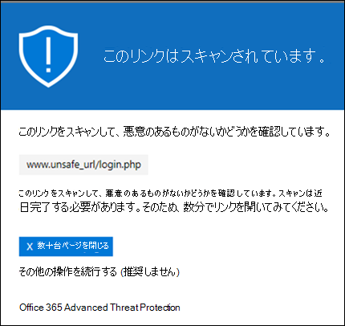

元の通知ページは次のように表示されます。

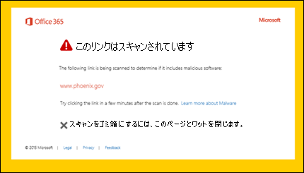

### 疑わしいメッセージの警告

クリックされた URL は、他の疑わしいメッセージに似た電子メール メッセージに含まれます。 サイトに進む前に、電子メール メッセージをもう一度確認することをお勧めします。

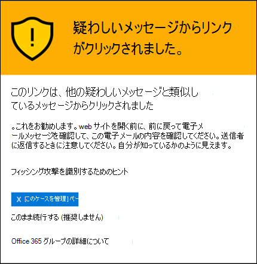

### フィッシングの試行の警告

クリックされた URL は、フィッシング攻撃として識別された電子メール メッセージに含めでした。 その結果、電子メール メッセージ内のすべての URL がブロックされます。 サイトに進むのはやめすることをお勧めします。

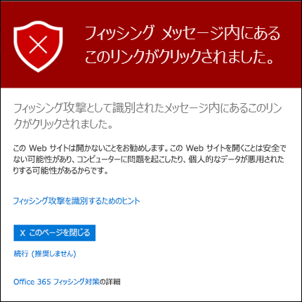

### 悪意のある Web サイトの警告

クリックされた URL は、悪意のあるサイトをポイントします。 サイトに進むのはやめすることをお勧めします。

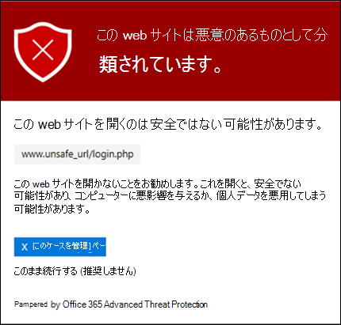

元の警告ページは次のように表示されます。

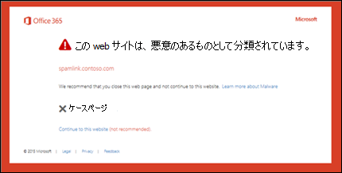

### ブロックされた URL の警告

クリックされた URL は、組織内の管理者によって手動でブロックされています ([リンク] のグローバル設定の [次の URL をブロックセーフします)。  リンクは手動でブロックセーフリンクによってスキャンされません。

管理者が特定の URL を手動でブロックする理由は複数あります。 サイトをブロックしない場合は、管理者に問い合わせください。

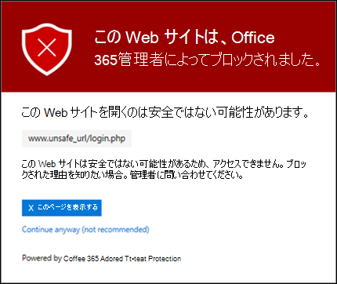

元の警告ページは次のように表示されます。

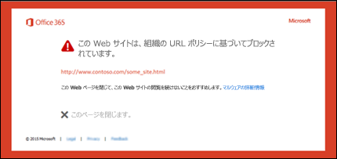

### エラー警告

何らかのエラーが発生し、URL を開くことができません。

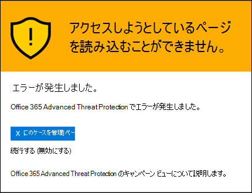

元の警告ページは次のように表示されます。

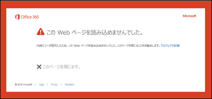
