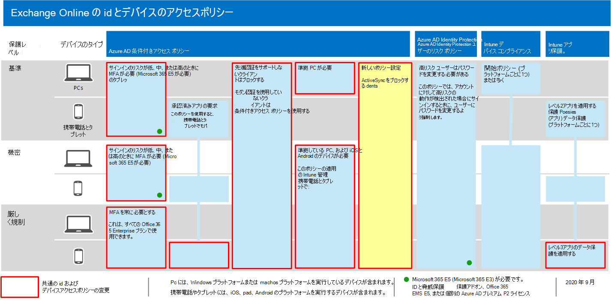
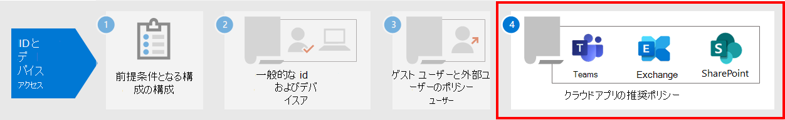

# <a name="policy-recommendations-for-securing-email"></a>電子メールをセキュリティで保護するためのポリシーの推奨事項

**適用対象**
- [Exchange Online Protection](exchange-online-protection-overview.md)
- [Microsoft Defender for Office 365 プラン 1 およびプラン 2](defender-for-office-365.md)

この記事では、最新の認証と条件付きアクセスをサポートする組織の電子メール および電子メール クライアントを保護するために、推奨される ID およびデバイス アクセス ポリシーを実装する方法について説明します。 このガイダンスは、共通 [ID](identity-access-policies.md) とデバイス アクセス ポリシーに基いて作成され、さらにいくつかの推奨事項も含まれています。

これらの推奨事項は、ニーズの粒度に基づいて適用できる 3 つの異なるセキュリティ層と保護に基づいて行います。ベースライン、機密性の高い、高度に **規制されています**。 これらのセキュリティ層と、以下の推奨事項で参照されている推奨されるクライアントのオペレーティング システムの詳細については、[推奨されるセキュリティ ポリシーと構成の概要](microsoft-365-policies-configurations.md)に関するページを参照してください。

これらの推奨事項では、ユーザーがモバイル デバイス上の iOS および Android のOutlookなど、最新の電子メール クライアントを使用する必要があります。 Outlook iOS と Android 用のアプリは、アプリの最適な機能をサポートOffice 365。 これらのモバイル Outlookアプリは、モバイルの使用をサポートし、他の Microsoft クラウド セキュリティ機能と共に動作するセキュリティ機能も備えた設計されています。 詳細については[、「iOS と Android Outlookに関するよく寄せられる質問」を参照してください](/exchange/clients-and-mobile-in-exchange-online/outlook-for-ios-and-android/outlook-for-ios-and-android-faq)。

## <a name="update-common-policies-to-include-email"></a>電子メールを含める一般的なポリシーを更新する

電子メールを保護するために、次の図は、共通の ID およびデバイス アクセス ポリシーから更新するポリシーを示しています。

[](https://github.com/MicrosoftDocs/microsoft-365-docs/raw/public/microsoft-365/media/microsoft-365-policies-configurations/identity-access-ruleset-mail.png)

ActiveSync クライアントをブロックする新しいポリシー Exchange Onlineに注意してください。 これにより、モバイルでのOutlookされます。

ポリシーの設定時Exchange OnlineポリシーのOutlookをポリシーのスコープに含める場合は、ActiveSync クライアントをブロックする新しいポリシーを作成する必要があります。 次の表に示すポリシーを確認し、推奨される追加を行うか、既に含まれているか確認します。 各ポリシーは、共通 ID およびデバイス アクセス ポリシーの関連する [構成手順にリンクします](identity-access-policies.md)。

|保護レベル|ポリシー|詳細情報|
|---|---|---|
|**Baseline**|[サインイン リスクが中程度または高の場合に MFA *を* 要求 *する*](identity-access-policies.md#require-mfa-based-on-sign-in-risk)|クラウド Exchange Online割り当てにアプリを含める|
||[先進認証をサポートしないクライアントはブロックする](identity-access-policies.md#block-clients-that-dont-support-multi-factor)|クラウド Exchange Online割り当てにアプリを含める|
||[APP データ保護ポリシーの適用](identity-access-policies.md#apply-app-data-protection-policies)|アプリのOutlookに含まれている必要があります。 各プラットフォームのポリシーを必ず更新してください (iOS、Android、Windows)|
||[承認済みアプリと APP 保護を要求する](identity-access-policies.md#require-approved-apps-and-app-protection)|クラウド Exchange Onlineリストにアプリを含める|
||[準拠 PC が必要](identity-access-policies.md#require-compliant-pcs-but-not-compliant-phones-and-tablets)|クラウド Exchange Onlineリストにアプリを含める|
||[ActiveSync クライアントのブロック](#block-activesync-clients)|この新しいポリシーを追加する|
|**機密**|[サインイン リスクが低い、中程度、または高い場合に MFA *を* 要求 *する*](identity-access-policies.md#require-mfa-based-on-sign-in-risk)|クラウド Exchange Online割り当てにアプリを含める|
||[準拠している PC とモバイル *デバイスを* 要求する](identity-access-policies.md#require-compliant-pcs-and-mobile-devices)|クラウド Exchange Onlineリストにアプリを含める|
|**厳しく規制**|[*常に* MFA を要求する](identity-access-policies.md#require-mfa-based-on-sign-in-risk)|クラウド Exchange Online割り当てにアプリを含める|
|

## <a name="block-activesync-clients"></a>ActiveSync クライアントのブロック

このポリシーにより、ActiveSync クライアントは他の条件付きアクセス ポリシーをバイパスしません。 ポリシー構成は ActiveSync クライアントにのみ適用されます。 [アプリ保護ポリシーを **[要求する] を選択すると、ActiveSync](/azure/active-directory/conditional-access/concept-conditional-access-grant#require-app-protection-policy)** クライアントがブロックされます。 このポリシーの作成の詳細については、「条件付きアクセスを使用したクラウド アプリ アクセスのアプリ保護ポリシーを要求 [する」を参照してください](/azure/active-directory/conditional-access/app-protection-based-conditional-access)。

- シナリオ[1: Office 365](/azure/active-directory/conditional-access/app-protection-based-conditional-access#scenario-1-office-365-apps-require-approved-apps-with-app-protection-policies)アプリでは、基本認証を利用する Exchange ActiveSync クライアントが Exchange Online に接続することを防ぐ、アプリ保護ポリシーを持つ承認済みアプリが必要です。「手順 2: ActiveSync (EAS)を使用して Exchange Online 用の Azure AD 条件付きアクセス ポリシーを構成する」に従います。

また、認証ポリシーを使用して基本[](/exchange/clients-and-mobile-in-exchange-online/disable-basic-authentication-in-exchange-online)認証を無効にし、すべてのクライアント アクセス要求で最新の認証を使用できます。

## <a name="limit-access-to-exchange-online-from-outlook-on-the-web"></a>ユーザーからのアクセスをExchange Online制限Outlook on the web

ユーザーが umnanaged デバイス上のユーザーから添付ファイルをダウンロードOutlook on the web制限できます。 これらのデバイス上のユーザーは、デバイスにファイルを漏洩して保存することなく、Office Online を使用してこれらのファイルを表示および編集できます。 ユーザーが管理されていないデバイスで添付ファイルを見るのをブロックすることもできます。

それらのステップは次のとおりです。

1. [Connect PowerShell セッションExchange Onlineにアクセスします](/powershell/exchange/exchange-online/connect-to-exchange-online-powershell/connect-to-exchange-online-powershell)。
2. OWA メールボックス ポリシーをまだ持ってない場合は [、New-OwaMailboxPolicy](/powershell/module/exchange/new-owamailboxpolicy) コマンドレットを使用して作成します。
3. 添付ファイルの表示を許可するが、ダウンロードを許可する場合は、次のコマンドを使用します。

   ```powershell
   Set-OwaMailboxPolicy -Identity Default -ConditionalAccessPolicy ReadOnly
   ```

4. 添付ファイルをブロックする場合は、次のコマンドを使用します。

   ```powershell
   Set-OwaMailboxPolicy -Identity Default -ConditionalAccessPolicy ReadOnlyPlusAttachmentsBlocked
   ```

5. Azure portal で、次の設定を使用して新しい条件付きアクセス ポリシーを作成します。

   **割り当て** \>**ユーザーとグループ**: 含めるおよび除外する適切なユーザーとグループを選択します。

   **割り当て** \>**クラウド アプリまたはアクション** \>**クラウド アプリ** \>**Include** \>**アプリの選択**: [アプリの **選択Office 365 Exchange Online**

   **アクセス制御** \>**セッション**: [アプリ **の適用制限を使用する] を選択します。**

## <a name="require-that-ios-and-android-devices-must-use-outlook"></a>iOS デバイスと Android デバイスでデバイスを使用する必要Outlook

iOS および Android デバイスのユーザーが、Outlook for iOS および Android を使用して仕事または学校のコンテンツにのみアクセスするには、それらの潜在的なユーザーを対象とする条件付きアクセス ポリシーが必要です。

このポリシーを構成する手順については、「iOS および Android 用のメッセージング グループOutlookを使用して管理する[」を参照してください](/mem/intune/apps/app-configuration-policies-outlook#apply-conditional-access)。

## <a name="set-up-message-encryption"></a>メッセージの暗号化を設定する

Azure Information Protection のOffice 365 Message Encryption機能を活用する新しい OME (OME) 機能を使用すると、組織は保護された電子メールを任意のデバイスの誰とでも簡単に共有できます。 ユーザーは、Microsoft 365.com、Gmail、その Outlook他のメール サービスを使用して、他の組織や非顧客と保護されたメッセージを送受信できます。

詳細については、「新しい機能をセットアップ[する」をOffice 365 Message Encryptionしてください](../../compliance/set-up-new-message-encryption-capabilities.md)。

## <a name="next-steps"></a>次の手順



次の条件付きアクセス ポリシーを構成します。

- [Microsoft Teams](teams-access-policies.md)
- [SharePoint](sharepoint-file-access-policies.md)
