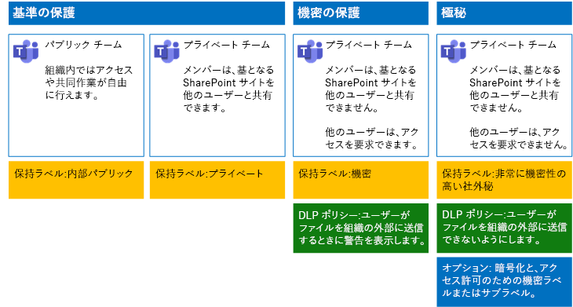

# Microsoft Teams のファイルを保護する

この記事では、ファイルを保護するために、Microsoft Teams のチームとその基礎となる SharePoint サイトを、セキュリティとコラボレーションのしやすさのバランスを取りながら構成するための推奨事項を示します。 この記事では、4 種類の構成を定義しています。最初の構成は組織内の公開サイトで、最も開放的な共有ポリシーが与えられます。 追加の構成はいずれも、保護において意味のある強化となりますが、Teams 内に保存されているファイルにアクセスし、共同作業を行う能力がチーム メンバーの一部の関係者に限定されます。 推奨事項を出発点として利用し、組織のニーズに合わせて構成を調整してください。

この記事の構成は、3 つの保護層 (データ、ID、デバイス) に関する Microsoft の推奨事項に沿っています。

- 基準の保護

- 機密の保護

- 非常に機密性の高い社外秘の保護

以上の層と各層に推奨される機能については、次の情報源をご覧ください。

- [Office 365 の ID とデバイス保護](https://docs.microsoft.com/office365/enterprise/microsoft-cloud-it-architecture-resources#identity-and-device-protection-for-office-365)

- [Office 365 のファイル保護ソリューション](https://docs.microsoft.com/office365/enterprise/microsoft-cloud-it-architecture-resources#file-protection-solutions-in-office-365)

## 機能の概要

セキュリティで保護されたチームの推奨事項は、Microsoft 365 のさまざまな機能に基づいています。 次の図は、推奨されている構成を示してます。

次の点が示されています。

- ベースライン保護には、パブリック チームとプライベート チームが含まれます。 パブリック チームは、組織内のだれでも検出およびアクセスできます。 プライベート チームは、チームのメンバーのみが検出とアクセスを行うことができます。 これらの構成はいずれも、ファイルがチーム グループ外に保存されている基礎となる SharePoint サイトを共有することができます。

- 機密および高機密の保護のチームはプライベート チームで、基礎となるサイトへのアクセスの共有および要求は制限されています。

- [保持ラベル](../../compliance/labels.md)は、基礎となる SharePoint サイト内のファイルを分類する方法を提供します。 基礎となる SharePoint サイトはそれぞれ、ドキュメント ライブラリのファイルに既定の保持ラベルを自動的に付けるように構成されています。 4 つのチーム構成に合わせて、このサンプルのラベルは「内部パブリック」、「プライベート」、「機密」、「非常に機密性の高い社外秘」になっています。 ユーザーは個々のファイルのラベルを変更できますが、この構成ですべてのファイルに既定のラベルが確実に与えられます。

- [データ損失防止](../../compliance/data-loss-prevention-policies.md) (DLP) ポリシーは、機密および高機密の保持ラベル向けに構成されており、これらのタイプのファイルをユーザーが組織外に送信しようとすると警告を表示したり、その処理を防止したりします。

- シナリオの必要に応じて、[機密ラベル](../../compliance/sensitivity-labels.md)を使用して、暗号化やアクセス許可によって機密性の高いファイルを保護することができます。 Azure Information Protection のお客様は、Microsoft 365 コンプライアンス センターで、Azure Information Protection ラベルを使用することができ、追加の構成や高度な構成を行うように選択すると、ラベルは Azure portal と同期されます。 Azure Information Protection ラベルと Office 365 機密ラベルは、互いに完全な互換性があります。 そのため、たとえば、Azure Information Protection でラベル付けされたコンテンツがある場合、そのコンテンツの分類やラベル付けをやり直す必要はありません。 このレベルの保護がすべてのお客様に求められているわけではありません。

## SharePoint と OneDrive の組織全体の設定

SharePoint と OneDrive には、すべてのサイトとユーザーに影響を与える組織全体の設定が含まれています。 このような設定の一部はサイト レベルで調整し、さらに限定的にすることもできます (限定性を下げることはできません)。 このセクションでは、セキュリティと共同作業に影響を与えるテナント全体の設定について説明します。

### 共有

このソリューションでは、次の組織全体設定を推奨しています。

- 匿名の共有を含む、あらゆるアカウント タイプとのあらゆる共有を許可する既定の共有ポリシーを維持します。

- 必要に応じて、匿名リンクの有効期間を設定します。

- 既定のリンクの種類を「内部」に変更します。これにより、組織外で意図せずデータが漏洩する事態を避けることができます。

外部共有を許可することは直観に反することに思われるかもしれませんが、この手法では、メールでファイルを送信する方法に比べ、ファイル共有に対する管理が強化されます。 SharePoint と Outlook の連動により、安全な方法でファイルに共同作業を行うことができます。

- 既定では、Outlook は、電子メールでファイルを送信する代わりに、ファイルへのリンクを共有します。

- SharePoint と OneDrive を使用すると、組織の内部と外部の共同作成者にファイルへのリンクを簡単に共有できます。

また、外部共有を管理することもできます。たとえば、以下の事柄が可能です。

- 匿名ゲスト リンクを無効にします。

- サイトへのユーザー アクセスを取り消す。

- 特定のサイトまたはドメインにアクセスできるユーザーを確認する。

- 匿名の共有リンクに期限を設定する (テナント設定)。

- 組織外で共有できるユーザーを制限する (テナント設定)。

### データ損失防止 (DLP) を外部共有と併用します。

外部共有を許可しない場合、ビジネスで必要なユーザーは、代替のツールと手段を使用することになります。Microsoft は、機密ファイルおよび高機密ファイルを保護するために DLP ポリシーと外部共有を組み合わせることをお勧めします。

### デバイス アクセスの設定

SharePoint と OneDrive のデバイス アクセスの設定では、アクセスを参照のみ (ファイルのダウンロード不可) に限定するか、アクセスをブロックするかを指定できます。 詳細については、「[非管理対象デバイスからのアクセスを制御する](https://docs.microsoft.com/sharepoint/control-access-from-unmanaged-devices)」を参照してください。

Azure Active Directory で推奨される条件付きアクセス ポリシーで、デバイス アクセスの設定を使用するには、「[SharePoint サイトおよびファイルをセキュリティで保護するためのポリシーの推奨事項](https://docs.microsoft.com/microsoft-365/enterprise/sharepoint-file-access-policies)」を参照してください。

設定を見て、OneDrive サイトの既定の設定を変更するかどうか決定してください。 現在のところ、共有とデバイス アクセスの設定は SharePoint 管理センターから複製されており、両方の環境に適用されます。

## チームおよび SharePoint サイトの構成

次の表は、この記事で先に説明した、各チームとその基礎となる SharePoint サイトの構成をまとめたものです。 この構成を出発点として利用し、組織のニーズに合わせてサイトの種類と構成を調整してください。 すべての組織があらゆる種類のチームを必要とするわけではありません。 ごく一部の組織だけが高機密保護のチームを必要とします。

||||||
|:-----|:-----|:-----|:-----|:-----|
||**ベースライン保護 1**|**基準の保護 #2**|**機密の保護**|**非常に機密性の高い社外秘**|
|説明|組織内でアクセスや共同作業が自由に行えるパブリック チーム。|グループ外で基礎となる SharePoint サイトを共有できるプライベート チーム。|基礎となる SharePoint サイトの共有がサイトのメンバーに限定されるプライベート チーム。 組織外にファイルを送信しようとすると、DLP はユーザーに警告します。|ファイルとともに送信されるファイルの暗号化およびアクセス許可用に機密ラベルが付いているプライベート チーム。 DLP は、組織の外にファイルを送信しようとする行為を禁止します。|
|チーム サイトはプライベートかパブリックか|パブリック|プライベート|プライベート|プライベート|
|誰にアクセス権が与えられるか|B2B のユーザーを含む組織の全員。|サイトのメンバーのみ。 他のユーザーは、アクセス権を要求できます。|チームのメンバーのみ。 他のユーザーは、チーム所有者によって承認されている基礎となるサイトへのアクセスを要求できます。|メンバーのみ。 他のユーザーは基礎となるサイトへのアクセスを要求することはできません。|
|サイト レベルの共有制御|すべてのユーザーと共有できます。既定の設定です。|すべてのユーザーと共有できます。既定の設定です。|メンバーはサイトへのアクセスを共有できません。   メンバー以外の人はサイトへのアクセスを要求できますが、要求はチームのグループ所有者に対して行う必要があります。|メンバーはサイトへのアクセスを共有できません。   メンバー以外の人はサイトまたはそのコンテンツへのアクセスを要求できません。|
|サイトレベルのデバイス アクセス制御|付加的な制御はありません。|付加的な制御はありません。|ユーザーは、非準拠デバイスまたはドメインに参加していないデバイスにファイルをダウンロードできません。他のすべてのデバイスからは参照専用のアクセスが許可されます。|非準拠デバイスまたはドメインに参加していないデバイスへのファイルのダウンロードをブロックします。|
|保持ラベル|内部パブリック|プライベート|機密|非常に機密性の高い社外秘|
|DLP ポリシー|||機密ラベルが付けられたファイルを組織の外に送信しようとするとユーザーに警告が表示されます。   クレジット カード番号や他の個人データなど、機密データの種類の外部共有をブロックするには、これらのデータの種類 (自分で構成したカスタム データの種類を含む) に追加の DLP ポリシーを構成できます。|ユーザーが高機密のラベルが付けられているファイルを組織の外部に送信できないようにします。ファイルの共有相手など、理由を提供することよって、ユーザーはこの設定を上書きできます。|
|機密ラベル||||機密ラベルを使用して、ファイルの暗号化とファイルへのアクセス許可の付与を行います。 ファイルが基礎となる SharePoint サイトから流出した場合も、こうした保護は維持されます。|

このソリューションの 4 種類のチームを展開する手順については、「[ファイルの 3 層の保護用にチームを展開する](deploy-teams-three-tiers.md)」を参照してください。

## Office 365 保持ラベル

機密データが存在する環境には、保持ラベルの使用が推奨されます。 保持ラベルの構成と発行が完了した後、次のことを行えるようになります。

- チームの基礎となる SharePoint サイトのドキュメント ライブラリに既定のラベルを適用することにより、チームの **[ファイル]** セクション内のすべてのドキュメントに既定のラベルを適用することができます。

- コンテンツが特定の条件に一致するときには、ラベルを自動的に適用できます。

- 保持ラベルに基づいた DLP ポリシーを適用できます。

- 組織のユーザーが Outlook on the web、Outlook​​ 2010 以降、OneDrive、SharePoint​​、Office 365 グループ内のコンテンツにラベルを手動で適用できます。 多くの場合、ユーザーは自分が操作するコンテンツの種類を最もよく知っているので、コンテンツを分類して適切な DLP ポリシーを適用できます。

図に示されているように、このソリューションでは次の保持ラベルを作成します。

- 非常に機密性の高い社外秘

- 機密

- プライベート

- 内部パブリック

これらのラベルは、図で推奨されているサイトと、この記事で前述したグラフにマップされます。このソリューションでは、機密および高機密というラベルの付いたファイルの漏洩を防ぐために DLP ポリシーを構成することをお勧めします。

このソリューションで保持ラベルと DLP ポリシーを構成する手順については、「[保持ラベルと DLP を使用してチーム内のファイルを保護する](deploy-teams-retention-DLP.md)」を参照してください。

## 機密ラベル

セキュリティ シナリオで保証される場合には、機密ラベルを使用して、ファイルが移動する場所に関係なく、保護を適用することができます。 Microsoft 365 コンプライアンス センターの機密ラベルと Azure Information Protection ラベルは同じです。 このソリューションでは、機密ラベルまたはサブラベルを使用して、最高レベルのセキュリティでの保護が必要なファイルを暗号化して、それらのファイルに対するアクセス許可を付与することをお勧めします。

詳細については、「[機密ラベルの概要](../../compliance/sensitivity-labels.md)」をご覧ください。

このソリューションで機密ラベルを構成する手順については、「[機密ラベルを使用してチーム内のファイルを保護する](deploy-teams-sensitivity-labels.md)」を参照してください。

## 関連項目

[クラウド導入およびハイブリッド ソリューション](https://docs.microsoft.com/office365/enterprise/cloud-adoption-and-hybrid-solutions)
