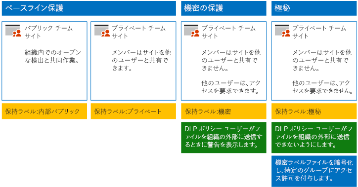

# SharePoint Online サイトとファイルをセキュリティで保護する

この記事では、SharePoint Online チーム サイトとファイルの保護を、セキュリティとコラボレーションのしやすさのバランスを取りながら構成するための推奨事項を示します。この記事では、4 つの異なる構成を定義します。最初は、最もオープンな共有ポリシーを使用した、組織内のパブリック サイトです。それ以外の各構成は、保護のセットアップには有効な手段ですが、リソースへのアクセスやリソース上でのコラボレーションは、関連したユーザーのセットに限定されます。これらの推奨事項を開始点として使用し、組織のニーズを満たすように構成を調整してください。

この記事で示されている構成は、データ、ID、デバイスを保護するための 3 つの層に関する Microsoft の推奨事項と調和しています。

- 基準の保護

- 機密の保護

- 非常に機密性の高い社外秘の保護

以上の層と各層に推奨される機能については、次の情報源をご覧ください。

- [Office 365 の ID とデバイス保護](https://docs.microsoft.com/office365/enterprise/microsoft-cloud-it-architecture-resources#identity-and-device-protection-for-office-365)

- [Office 365 のファイル保護ソリューション](https://docs.microsoft.com/office365/enterprise/microsoft-cloud-it-architecture-resources#file-protection-solutions-in-office-365)

## 機能の概要

SharePoint Online チーム サイトの推奨事項は、Microsoft 365 のさまざまな機能に基づいています。 次の図は、4 つの SharePoint Online チーム サイトについて推奨されている構成を示しています。

次の点が示されています。

- ベースライン保護には、SharePoint Online チーム サイト用の 2 つのオプション、つまりパブリック サイトとプライベート サイトが含まれます。パブリック サイトは、組織内のだれもが検出およびアクセスできます。プライベート サイトは、サイトのメンバーのみが検出とアクセスを行うことができます。どちらのサイト構成においても、グルーブの外部との共有を行うことができます。

- 機密および高機密保護のためのサイトは、アクセスを特定のグループのメンバーのみに限定しているプライベート サイトになります。

- [保持ラベル](../../compliance/labels.md)は、サイト内のファイルを分類する方法を提供します。 SharePoint Online チーム サイトはそれぞれ、ドキュメント ライブラリのファイルにサイトの既定の保持ラベルを自動的に付けるように構成されています。 4 つのサイト構成に合わせ、このサンプルのラベルは「内部公開」、「プライベート」、「機密」、「機密性の高い社外秘」になっています。 ユーザーはラベルを変更できますが、この構成ですべてのファイルに既定のラベルが確実に与えられます。

- [データ損失防止](../../compliance/data-loss-prevention-policies.md) (DLP) ポリシーは、機密および高機密の保持ラベル向けに構成されており、これらのタイプのファイルをユーザーが組織外に送信しようとすると警告を表示したり、その処理を防止したりします。

- シナリオの必要に応じて、[機密ラベル](../../compliance/sensitivity-labels.md)を使用して、暗号化やアクセス許可によって機密性の高いファイルを保護することができます。 Azure Information Protection のお客様は、Microsoft 365 コンプライアンス センターで、Azure Information Protection ラベルを使用することができ、追加の構成や高度な構成を行うように選択すると、ラベルは Azure portal と同期されます。 Azure Information Protection ラベルと Office 365 機密ラベルは、互いに完全な互換性があります。 そのため、たとえば、Azure Information Protection でラベル付けされたコンテンツがある場合、そのコンテンツの分類やラベル付けをやり直す必要はありません。 このレベルの保護がすべてのお客様に求められているわけではありません。

## SharePoint Online と OneDrive for Business に関するテナント全体の設定

SharePoint Online と OneDrive for Business には、すべてのサイトとユーザーに影響を及ぼすテナント全体の設定が含まれています。これらの設定の中には、サイト レベルにおいてより制限の強いもの (ただし、既定以下にはできません) に調整できるものもあります。このセクションでは、セキュリティとコラボレーションに影響を与えるテナント全体の設定について取り上げます。

### 共有

このソリューションでは、次のテナント全体設定を推奨しています。

- 匿名の共有を含む、あらゆるアカウント タイプとのあらゆる共有を許可する既定の共有ポリシーを維持します。

- 必要に応じて、匿名リンクの有効期間を設定します。

- 既定のリンクの種類を「内部」に変更します。これにより、組織外で意図せずデータが漏洩する事態を避けることができます。

外部共有を許可することは直感に反しているように思えるかもしれませんが、これは電子メールでファイルを送信するよりもファイル共有をより制御できます。SharePoint Online と Outlook は連携して、セキュリティで保護されたファイルのコラボレーションを提供します。

- 既定では、Outlook は、電子メールでファイルを送信する代わりに、ファイルへのリンクを共有します。

- SharePoint Online と OneDrive for Business を使用すると、組織の内部と外部の共同作成者にファイルへのリンクを簡単に共有できます。

また、外部共有を管理することもできます。たとえば、以下の事柄が可能です。

- 匿名ゲスト リンクを無効にします。

- サイトへのユーザー アクセスを取り消す。

- 特定のサイトまたはドメインにアクセスできるユーザーを確認する。

- 匿名の共有リンクに期限を設定する (テナント設定)。

- 組織外で共有できるユーザーを制限する (テナント設定)。

### データ損失防止 (DLP) を外部共有と併用します。

外部共有を許可しない場合、ビジネスで必要なユーザーは、代替のツールと手段を使用することになります。Microsoft は、機密ファイルおよび高機密ファイルを保護するために DLP ポリシーと外部共有を組み合わせることをお勧めします。

### デバイス アクセスの設定

SharePoint Online と OneDrive for Business のデバイス アクセスの設定では、アクセスを参照のみ (ファイルのダウンロード不可) に限定するか、アクセスをブロックするかを指定できます。 詳細については、「[非管理対象デバイスからのアクセスを制御する](https://docs.microsoft.com/sharepoint/control-access-from-unmanaged-devices)」を参照してください。

Azure Active Directory で推奨される条件付きアクセス ポリシーで、デバイス アクセスの設定を使用するには、「[SharePoint サイトおよびファイルをセキュリティで保護するためのポリシーの推奨事項](https://docs.microsoft.com/microsoft-365/enterprise/sharepoint-file-access-policies)」を参照してください。

### OneDrive for Business

これらの設定を確認し、OneDrive for Business サイトの既定の設定を変更するかどうかを判断してください。現在、共有とデバイス アクセスの設定は SharePoint Online 管理センターの設定からコピーされており、両方の環境に適用されます。

## SharePoint チーム サイトの構成

次の表に、この記事で前述した各チーム サイトの構成をまとめます。これらの構成を開始点の推奨事項として使用し、組織のニーズに合うようサイトの種類と構成を調整します。すべての組織がすべてのサイトの種類を必要とするわけではありません。高機密保護が必要となる組織はごくわずかです。

||||||
|:-----|:-----|:-----|:-----|:-----|
||**ベースライン保護 1**|**基準の保護 #2**|**機密の保護**|**非常に機密性の高い社外秘**|
|説明|組織内ではアクセスや共同作業が自由。|グループ外で共有が許可されている、プライベート サイトとグループ。|共有がメンバーのみに許可されているプライベート サイト。組織の外にファイルを送信しようとすると、DLP はユーザーに警告を出します。|プライベート サイトおよび機密ラベルを使用したアクセス許可とファイルの暗号化。 DLP は、組織の外にファイルを送信しようとする行為を禁止します。|
|チーム サイトはプライベートかパブリックか|パブリック|プライベート|プライベート|プライベート|
|誰にアクセス権が与えられるか|B2B のユーザーとゲスト ユーザーを含む、組織の全員。|サイトのメンバーのみ。他のユーザーは、アクセス権を要求できます。|サイトのメンバーのみ。他のユーザーは、アクセス権を要求できます。|メンバーのみ。他のユーザーは、アクセス権を要求できません。|
|サイト レベルの共有制御|すべてのユーザーと共有できます。既定の設定です。|すべてのユーザーと共有できます。既定の設定です。|メンバーはサイトへのアクセスを共有できません。   メンバー以外の人はサイトへのアクセスを要求できますが、要求はサイトの管理者に対して行う必要があります。|メンバーはサイトへのアクセスを共有できません。   メンバー以外の人はサイトまたはコンテンツへのアクセスを要求できません。|
|サイトレベルのデバイス アクセス制御|付加的な制御はありません。|付加的な制御はありません。|ユーザーは、非準拠デバイスまたはドメインに参加していないデバイスにファイルをダウンロードできません。他のすべてのデバイスからは参照専用のアクセスが許可されます。|非準拠デバイスまたはドメインに参加していないデバイスへのファイルのダウンロードをブロックします。|
|保持ラベル|内部パブリック|プライベート|機密|非常に機密性の高い社外秘|
|DLP ポリシー|||機密ラベルが付けられたファイルを組織の外に送信しようとするとユーザーに警告が表示されます。   クレジット カード番号や他の個人データなど、機密データの種類の外部共有をブロックするには、これらのデータの種類 (自分で構成したカスタム データの種類を含む) に追加の DLP ポリシーを構成できます。|ユーザーが高機密のラベルが付けられているファイルを組織の外部に送信できないようにします。ファイルの共有相手など、理由を提供することよって、ユーザーはこの設定を上書きできます。|
|機密ラベル||||機密ラベルを使用して、ファイルの暗号化とファイルへのアクセス許可の付与を自動化します。 ファイルが流出した場合も、暗号化やアクセス許可はファイルで維持されます。   Office 365 は、機密ラベルを使用して暗号化されたファイルを読み取ることができません。 さらに、DLP ポリシーが機能するのはメタデータ (ラベルを含む) に対してのみで、これらのファイルのコンテンツ (ファイル内のクレジット カード番号など) に対しては機能しません。|

このソリューションで異なる 4 種類の SharePoint Online チーム サイトを展開する手順については、「[3 つの層による保護用のサイトを展開する](../../compliance/deploy-sharepoint-online-sites-for-three-tiers-of-protection.md)」を参照してください。

## Office 365 保持ラベル

機密データと高機密データがある環境では、保持ラベルを使用することを推奨します。 保持ラベルの構成と発行が完了した後、次のことを行えるようになります。

- SharePoint Online チーム サイトのドキュメント ライブラリに既定のラベルを適用することにより、それらのライブラリ内のすべてのドキュメントに既定のラベルを適用することができます。

- コンテンツが特定の条件に一致するときには、ラベルを自動的に適用できます。

- 保持ラベルに基づいた DLP ポリシーを適用できます。

- 組織内のユーザーは、Outlook on the web、Outlook 2010 以降、OneDrive for Business、SharePoint Online、Office 365 グループのコンテンツに手動でラベルを適用できます。ユーザーは自分が操作するコンテンツの種類を最もよく知っているので、コンテンツを分類して適切な DLP ポリシーを適用できます。

図に示されているように、このソリューションでは次の保持ラベルを作成します。

- 非常に機密性の高い社外秘

- 機密

- プライベート

- 内部パブリック

これらのラベルは、図で推奨されているサイトと、この記事で前述したグラフにマップされます。このソリューションでは、機密および高機密というラベルの付いたファイルの漏洩を防ぐために DLP ポリシーを構成することをお勧めします。

このソリューションで保持ラベルと DLP ポリシーを構成する手順については、「[保持ラベルと DLP による SharePoint Online ファイルの保護](../../compliance/protect-sharepoint-online-files-with-office-365-labels-and-dlp.md)」を参照してください。

## 機密ラベル

セキュリティ シナリオで保証される場合には、機密ラベルを使用して、ファイルが移動する場所に関係なく、保護を適用することができます。 Microsoft 365 コンプライアンス センターの機密ラベルと Azure Information Protection ラベルは同じです。 このソリューションでは、最も高度なセキュリティで保護する必要があるファイルに対しては、機密ラベルまたは「高機密」機密ラベルのサブラベルを使用して暗号化を行い、アクセス許可を付与することをお勧めしています。

組織が[ SharePoint および OneDrive の Office ファイルに対する機密ラベルを有効にしていない場合 (パブリック プレビュー)](/microsoft-365/compliance/sensitivity-labels-sharepoint-onedrive-files): Office 365 に保存するファイルに機密ラベルの暗号化を適用すると、サービスはこれらのファイルのコンテンツを処理できないことに注意してください。 共同編集、電子情報開示、検索、Delve、その他の共同作業機能は機能しません。 DLP ポリシーが操作できるのはメタデータ (保持ラベルを含む) のみで、それらのファイルのコンテンツ (ファイル内のクレジットカード番号など) を操作することはできません。

詳細については、「[機密ラベルの概要](../../compliance/sensitivity-labels.md)」をご覧ください。

### 外部ユーザーに対するアクセス許可の追加

機密ラベルで保護されているファイルへのアクセス権を外部ユーザーに付与するには 2 つの方法があります。 どちらの場合も、外部ユーザーには Azure AD アカウントが必要です。 外部ユーザーが Azure AD を使用する組織のメンバーではない場合、サインアップ ページ ([https://aka.ms/aip-signup](https://aka.ms/aip-signup)) を使用して個人で Azure AD アカウントを取得できます。

- 外部ユーザーを、ラベルの保護の構成に使用する Azure AD グループに追加します。

  最初に、ご使用のディレクトリでアカウントを B2B ユーザーとして追加する必要があります。[Azure Rights Management によるグループ メンバーシップのキャッシュ](https://docs.microsoft.com/information-protection/plan-design/prepare) には、数時間かかることがあります。この方法を使用すると、ラベルで保護された既存のファイルすべてに、アクセス許可が付与されます (ユーザーが Azure AD グループに追加される前に保護されていたファイルも含む)。

- 外部ユーザーを、ラベル保護に直接追加します。

  組織 (例: Fabrikam.com) のすべてのユーザー、Azure AD グループ (例: 組織内の財務グループ)、個々のユーザーを追加できます。たとえば、ラベルの保護に、規制機関の外部ユーザーを追加できます。この方法を使用すると、外部エンティティが保護に追加された後にラベルを使用して保護されたファイルにのみ、アクセス許可が付与されます。

### 機密ラベルを展開して使用する

このソリューションで機密ラベルを構成する手順については、「[機密ラベルを使用して SharePoint Online ファイルを保護する](../../compliance/protect-sharepoint-online-files-with-sensitivity-label.md)」を参照してください。

## 次の手順

これを「[開発/テスト環境の SharePoint Online サイトをセキュリティで保護する](secure-sharepoint-online-sites-in-a-dev-test-environment.md)」で概念実証として構築します。

## 関連項目

[選挙運動、非営利組織、およびその他のアジャイル組織のための Microsoft Security ガイダンス](microsoft-security-guidance-for-political-campaigns-nonprofits-and-other-agile-o.md)

[クラウド導入およびハイブリッド ソリューション](https://docs.microsoft.com/office365/enterprise/cloud-adoption-and-hybrid-solutions)
