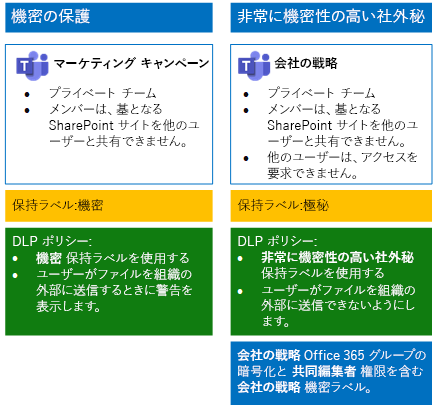
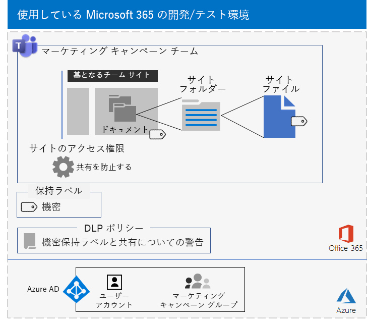
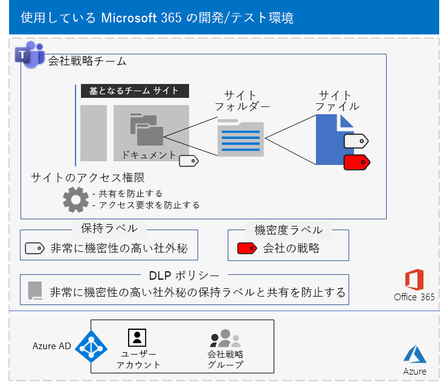

# <a name="secure-teams-for-files-in-a-devtest-environment"></a><span data-ttu-id="76498-103">開発/テスト環境のファイルのために Teams の安全を強化する</span><span class="sxs-lookup"><span data-stu-id="76498-103">Secure Teams for files in a dev/test environment</span></span>

<span data-ttu-id="76498-104">この記事では、「[Microsoft Teams のファイルを保護する](secure-files-in-teams.md)」ソリューションとして、機密チームや高機密チームが含まれる開発/テスト環境を作成するための詳しい手順を説明します。</span><span class="sxs-lookup"><span data-stu-id="76498-104">This article provides step-by-step instructions to create a dev/test environment that includes the sensitive and highly confidential teams for the [Secure files in Microsoft Teams](secure-files-in-teams.md) solution.</span></span>
  

  
<span data-ttu-id="76498-106">こうしたチームを運用環境に展開する前に、この開発/テスト環境を使用して、特定のニーズに合わせて設定を検証し、微調整します。</span><span class="sxs-lookup"><span data-stu-id="76498-106">Use this dev/test environment to experiment and fine-tune settings for your specific needs before deploying these types of teams in production.</span></span>
  
## <a name="phase-1-build-out-your-microsoft-365-enterprise-test-environment"></a><span data-ttu-id="76498-107">フェーズ 1: Microsoft 365 Enterprise のテスト環境を構築する</span><span class="sxs-lookup"><span data-stu-id="76498-107">Phase 1: Build out your Microsoft 365 Enterprise test environment</span></span>

<span data-ttu-id="76498-108">最小要件で機密チームと高機密チームを簡易な方法でテストする場合は、「[軽量な基本構成](https://docs.microsoft.com/microsoft-365/enterprise/lightweight-base-configuration-microsoft-365-enterprise)」の手順に従ってください。</span><span class="sxs-lookup"><span data-stu-id="76498-108">If you just want to test sensitive and highly confidential teams in a lightweight way with the minimum requirements, follow the instructions in [Lightweight base configuration](https://docs.microsoft.com/microsoft-365/enterprise/lightweight-base-configuration-microsoft-365-enterprise).</span></span>

<span data-ttu-id="76498-109">シミュレーションのエンタープライズで機密チームと高機密チームをテストするには、「[パスワード ハッシュの同期](https://docs.microsoft.com/microsoft-365/enterprise/password-hash-sync-m365-ent-test-environment)」の手順に従ってください。</span><span class="sxs-lookup"><span data-stu-id="76498-109">If you want to test sensitive and highly confidential teams in a simulated enterprise, follow the instructions in [Password hash synchronization](https://docs.microsoft.com/microsoft-365/enterprise/password-hash-sync-m365-ent-test-environment).</span></span>

>[!Note]
><span data-ttu-id="76498-110">機密チームと高機密チームのテストには、シミュレーションのエンタープライズ テスト環境は必要ありません。シミュレーションのエンタープライズ テスト環境には、インターネットに接続されたシミュレーションのイントラネット、Active Directory Domain Services (AD DS) フォレスト用のディレクトリ同期が含まれています。</span><span class="sxs-lookup"><span data-stu-id="76498-110">Testing sensitive and highly confidential teams does not require the simulated enterprise test environment, which includes a simulated intranet connected to the Internet and directory synchronization for an Active Directory Domain Services (AD DS) forest.</span></span> <span data-ttu-id="76498-111">この指示は、一般的な組織と類似した環境で機密チームと高機密チームをテストしてお試しいただけるようオプションとしてここで提供しています。</span><span class="sxs-lookup"><span data-stu-id="76498-111">It is provided here as an option so that you can test sensitive and highly confidential teams and experiment with it in an environment that represents a typical organization.</span></span>
>
    
## <a name="phase-2-create-and-configure-your-azure-active-directory-ad-groups-and-users"></a><span data-ttu-id="76498-112">フェーズ 2: Azure Active Directory (AD) グループとユーザーを作成して構成する</span><span class="sxs-lookup"><span data-stu-id="76498-112">Phase 2: Create and configure your Azure Active Directory (AD) groups and users</span></span>

<span data-ttu-id="76498-113">このフェーズでは、架空の組織用の Azure AD のグループとユーザーを作成して構成します。</span><span class="sxs-lookup"><span data-stu-id="76498-113">In this phase, you create and configure the Azure AD groups and users for your fictional organization.</span></span>
  
<span data-ttu-id="76498-114">最初に、Azure portal で一般的な組織のグループを 2 つ作成します。</span><span class="sxs-lookup"><span data-stu-id="76498-114">First, create two groups for a typical organization with the Azure portal.</span></span>
  
1. <span data-ttu-id="76498-115">ブラウザーで新しいタブを開き、Azure portal ([https://portal.azure.com](https://portal.azure.com)) に移動します。</span><span class="sxs-lookup"><span data-stu-id="76498-115">Create a separate tab in your browser, and then go to the Azure portal at [https://portal.azure.com](https://portal.azure.com).</span></span> <span data-ttu-id="76498-116">必要に応じて、Microsoft 365 E5 の試用版または有料サブスクリプション用の全体管理者アカウントの資格情報でサインインします。</span><span class="sxs-lookup"><span data-stu-id="76498-116">If needed, sign in with the credentials of the global administrator account for your Microsoft 365 E5 trial or paid subscription.</span></span>
    
2. <span data-ttu-id="76498-117">Azure Portal で **[Azure Active Directory] > [グループ]** の順にクリックします。</span><span class="sxs-lookup"><span data-stu-id="76498-117">In the Azure portal, click **Azure Active Directory > Groups**.</span></span>
    
3. <span data-ttu-id="76498-118">**[グループ] - [すべてのグループ]** ブレードで、**[+ 新しいグループ]** をクリックします。</span><span class="sxs-lookup"><span data-stu-id="76498-118">On the **Groups - All groups** blade, click **+ New group**.</span></span>
    
4. <span data-ttu-id="76498-119">**[グループ]** ブレードでの手順:</span><span class="sxs-lookup"><span data-stu-id="76498-119">On the **Group** blade:</span></span>
    
  - <span data-ttu-id="76498-120">**[グループの種類]** で **[セキュリティ]** を選択します。</span><span class="sxs-lookup"><span data-stu-id="76498-120">Select **Security** in **Group type**.</span></span>
    
  - <span data-ttu-id="76498-121">**[名前]** に「**C スイート**」と入力します。</span><span class="sxs-lookup"><span data-stu-id="76498-121">Type **C-Suite** in **Name**.</span></span>
    
  - <span data-ttu-id="76498-122">**[メンバーシップの種類]** で **[割り当て済み]** を選択します。</span><span class="sxs-lookup"><span data-stu-id="76498-122">Select **Assigned** in **Membership type**.</span></span>
      
5. <span data-ttu-id="76498-123">**[作成]** をクリックして、 **[グループ]** ブレードを閉じます。</span><span class="sxs-lookup"><span data-stu-id="76498-123">Click **Create**, and then close the **Group** blade.</span></span>
    
6.    <span data-ttu-id="76498-124">「**Marketing staff (マーケティング スタッフ)**」という名前の新しいグループに対して、ステップ 3 から 5 を繰り返します。</span><span class="sxs-lookup"><span data-stu-id="76498-124">Repeat steps 3-5 for a new group named **Marketing staff**.</span></span>
    
<span data-ttu-id="76498-125">次に、グループのメンバーが、Microsoft 365 と EMS のサブスクリプションのライセンスを自動的に割り当てられるように、自動ライセンスを構成します。</span><span class="sxs-lookup"><span data-stu-id="76498-125">Next, you configure automatic licensing so that members of your groups are automatically assigned licenses for your Microsoft 365 and EMS subscriptions.</span></span>
  
1. <span data-ttu-id="76498-126">Azure Portal で **[Azure Active Directory] > [ライセンス] > [すべての製品]** の順にクリックします。</span><span class="sxs-lookup"><span data-stu-id="76498-126">In the Azure portal, click **Azure Active Directory > Licenses > All products**.</span></span>
    
2. <span data-ttu-id="76498-127">一覧で、「**Microsoft 365 Enterprise E5**」を選択し、**[割り当て]** をクリックします。</span><span class="sxs-lookup"><span data-stu-id="76498-127">In the list, select **Microsoft 365 Enterprise E5**, and then click **Assign**.</span></span>
    
3. <span data-ttu-id="76498-128">**[ライセンスの割り当て]** ブレードで、 **[ユーザーとグループ]** をクリックします。</span><span class="sxs-lookup"><span data-stu-id="76498-128">In the **Assign license** blade, click **Users and groups**.</span></span>
    
4. <span data-ttu-id="76498-129">グループの一覧で、以下を選択します。</span><span class="sxs-lookup"><span data-stu-id="76498-129">In the list of groups, select the following:</span></span>
    
  - <span data-ttu-id="76498-130">C-Suite (C スイート)</span><span class="sxs-lookup"><span data-stu-id="76498-130">C-Suite</span></span>
    
  - <span data-ttu-id="76498-131">Marketing staff (マーケティング スタッフ)</span><span class="sxs-lookup"><span data-stu-id="76498-131">Marketing staff</span></span>
    
5. <span data-ttu-id="76498-132">**[選択]** をクリックし、 **[割り当て]** をクリックします。</span><span class="sxs-lookup"><span data-stu-id="76498-132">Click **Select**, and then click **Assign**.</span></span>
    
6. <span data-ttu-id="76498-133">ブラウザーの [Azure Portal] タブを閉じます。</span><span class="sxs-lookup"><span data-stu-id="76498-133">Close the Azure portal tab in your browser.</span></span>
    
<span data-ttu-id="76498-134">次に、[Graph 用 Azure Active Directory PowerShell モジュールに接続](https://docs.microsoft.com/office365/enterprise/powershell/connect-to-office-365-powershell#connect-with-the-azure-active-directory-powershell-for-graph-module)します。</span><span class="sxs-lookup"><span data-stu-id="76498-134">Next, you [Connect with the Azure Active Directory PowerShell for Graph module ](https://docs.microsoft.com/office365/enterprise/powershell/connect-to-office-365-powershell#connect-with-the-azure-active-directory-powershell-for-graph-module).</span></span>
  
<span data-ttu-id="76498-135">組織名、場所、および共通のパスワードを入力し、PowerShell コマンド プロンプトまたは Integrated Script Environment (ISE) からこれらのコマンドを実行し、ユーザー アカウントを作成し、それぞれのグループに追加します。</span><span class="sxs-lookup"><span data-stu-id="76498-135">Fill in your organization name, your location, and a common password, and then run these commands from the PowerShell command prompt or Integrated Script Environment (ISE) to create user accounts and add them to their groups:</span></span>
  
```powershell
$orgName="<organization name, such as contoso for the contoso.onmicrosoft.com trial subscription domain name>"
$location="<the ISO ALPHA2 country code, such as US for the United States>"
$commonPassword="<common password for all the new accounts>"

$PasswordProfile=New-Object -TypeName Microsoft.Open.AzureAD.Model.PasswordProfile
$PasswordProfile.Password=$commonPassword

$groupName="C-Suite"
$userNames=@("CEO","CFO","CIO") 
$groupID=(Get-AzureADGroup | Where { $_.DisplayName -eq $groupName }).ObjectID
ForEach ($element in $userNames){ 
New-AzureADUser -DisplayName $element -PasswordProfile $PasswordProfile -UserPrincipalName ($element + "@" + $orgName + ".onmicrosoft.com") -AccountEnabled $true -MailNickName $element -UsageLocation $location 
Add-AzureADGroupMember -RefObjectId (Get-AzureADUser | Where { $_.DisplayName -eq $element }).ObjectID -ObjectId $groupID
}
$groupName="Marketing staff"
$userNames=@("Marketing1", "Marketing2") 
$groupID=(Get-AzureADGroup | Where { $_.DisplayName -eq $groupName }).ObjectID
ForEach ($element in $userNames){ 
New-AzureADUser -DisplayName $element -PasswordProfile $PasswordProfile -UserPrincipalName ($element + "@" + $orgName + ".onmicrosoft.com") -AccountEnabled $true -MailNickName $element -UsageLocation $location 
Add-AzureADGroupMember -RefObjectId (Get-AzureADUser | Where { $_.DisplayName -eq $element }).ObjectID -ObjectId $groupID
}
```

> [!NOTE]
> <span data-ttu-id="76498-136">ここで共通のパスワードを使用することで、自動化と、開発/テスト環境の構成を容易にします。</span><span class="sxs-lookup"><span data-stu-id="76498-136">The use of a common password here is for automation and ease of configuration for a dev/test environment.</span></span> <span data-ttu-id="76498-137">運用環境のサブスクリプションは避けるように強くお勧めします。</span><span class="sxs-lookup"><span data-stu-id="76498-137">Obviously, this is highly discouraged for production subscriptions.</span></span> 
  
<span data-ttu-id="76498-138">次の手順を使用して、グループ ベースのライセンスが正しく機能していることを確認します。</span><span class="sxs-lookup"><span data-stu-id="76498-138">Use these steps to verify that group-based licensing is working correctly.</span></span>
  
1. <span data-ttu-id="76498-139">ブラウザーの **[Microsoft Office Home]** タブで、 **[管理者]** タイルをクリックします。</span><span class="sxs-lookup"><span data-stu-id="76498-139">From the **Microsoft Office Home** tab of your browser, click the **Admin** tile.</span></span>
    
2. <span data-ttu-id="76498-140">ブラウザーの新しい **[Microsoft 365 管理センター]** タブで、**[ユーザー]** をクリックします。</span><span class="sxs-lookup"><span data-stu-id="76498-140">From the new **Microsoft 365 admin center** tab of your browser, click **Users**.</span></span>
    
3. <span data-ttu-id="76498-141">ユーザーの一覧で、**[CEO]** をクリックします。</span><span class="sxs-lookup"><span data-stu-id="76498-141">In the list of users, click **CEO**.</span></span>
    
4. <span data-ttu-id="76498-142">**CEO** ユーザー アカウントのプロパティが一覧表示されているウィンドウで、**Microsoft 365 Enterprise E5** のライセンスが割り当てられている (**製品ライセンス**内) ことを確認します。</span><span class="sxs-lookup"><span data-stu-id="76498-142">In the pane that lists the properties of the **CEO** user account, verify that it has been assigned the **Microsoft 365 Enterprise E5** license (in **Product licenses**).</span></span>
    
## <a name="phase-3-create-retention-labels"></a><span data-ttu-id="76498-143">フェーズ 3: 保持ラベルを作成する</span><span class="sxs-lookup"><span data-stu-id="76498-143">Phase 3: Create retention labels</span></span>

<span data-ttu-id="76498-144">このフェーズでは、基となる SharePoint サイトのドキュメント フォルダーに対してさまざまなセキュリティ レベルの保持ラベルを作成します。</span><span class="sxs-lookup"><span data-stu-id="76498-144">In this phase, you create the retention labels for the different levels of security for underlying SharePoint site documents folders.</span></span>

1. <span data-ttu-id="76498-145">全体管理者アカウントで、[Microsoft 365 コンプライアンス ポータル](https://compliance.microsoft.com)にサインインします。</span><span class="sxs-lookup"><span data-stu-id="76498-145">Sign in to the [Microsoft 365 compliance portal](https://compliance.microsoft.com) with your global admin account.</span></span>
    
2. <span data-ttu-id="76498-146">ブラウザーの **[ホーム - Microsoft 365 コンプライアンス]** タブで、**[分類] > [ラベル]** をクリックします。</span><span class="sxs-lookup"><span data-stu-id="76498-146">From the **Home - Microsoft 365 compliance** tab of your browser, click **Classifications > Labels**.</span></span>
    
3. <span data-ttu-id="76498-147">**[保持ラベル] > [ラベルの作成]** をクリックします。</span><span class="sxs-lookup"><span data-stu-id="76498-147">Click **Retention labels > Create a label**.</span></span>
    
4. <span data-ttu-id="76498-148">**[ラベルに名前をつける]** ウィンドウで、**[ラベルに名前をつける]** のところに「**機密**」と入力してから、**[次へ]** をクリックします。</span><span class="sxs-lookup"><span data-stu-id="76498-148">On the **Name your label** pane, type **Sensitive** in **Name your label**, and then click **Next**.</span></span>

5. <span data-ttu-id="76498-149">**[ファイル計画記述子]** ウィンドウで **[次へ]** をクリックします。</span><span class="sxs-lookup"><span data-stu-id="76498-149">On the **File plan descriptors** pane, click **Next**.</span></span>
    
6. <span data-ttu-id="76498-150">**[ラベルの設定]** ウィンドウで、必要に応じて **[保持]** を **[オン]** にして **[次へ]** をクリックします。</span><span class="sxs-lookup"><span data-stu-id="76498-150">On the **Label settings** pane, if needed, set **Retention** to **On**, and then click **Next**.</span></span>
    
7. <span data-ttu-id="76498-151">**[設定の確認]** ウィンドウで、**[ラベルを作成する]** をクリックします。</span><span class="sxs-lookup"><span data-stu-id="76498-151">On the **Review your settings** pane, click **Create the label**.</span></span>
    
8. <span data-ttu-id="76498-152">ステップ 3 から 7 を繰り返して、「**高機密**」という名前の追加の保持ラベルを作成します。</span><span class="sxs-lookup"><span data-stu-id="76498-152">Repeat steps 3-7 for an additional retention label named **Highly Confidential**.</span></span>
    
9. <span data-ttu-id="76498-153">**[ホーム]、[ラベル]** ウィンドウで、**[Publish labels]\(ラベルの発行\)** をクリックします。</span><span class="sxs-lookup"><span data-stu-id="76498-153">From the **Home > Labels** pane, click **Publish labels**.</span></span>
    
10. <span data-ttu-id="76498-154">**[発行するラベルを選択]** ウィンドウで、 **[発行するラベルを選択]** をクリックします。</span><span class="sxs-lookup"><span data-stu-id="76498-154">On the **Choose labels to publish** pane, click **Choose labels to publish**.</span></span>
    
11. <span data-ttu-id="76498-155">**[Choose labels]\(ラベルの選択\)** ウィンドウで、**[追加]** をクリックして 4 つのラベルをすべて選択します。</span><span class="sxs-lookup"><span data-stu-id="76498-155">On the **Choose labels** pane, click **Add** and select all four labels.</span></span>
    
12. <span data-ttu-id="76498-156">[ **完了**] をクリックします。</span><span class="sxs-lookup"><span data-stu-id="76498-156">Click **Done**.</span></span>
    
13. <span data-ttu-id="76498-157">**[発行するラベルを選択]** ウィンドウで、 **[次へ]** をクリックします。</span><span class="sxs-lookup"><span data-stu-id="76498-157">On the **Choose labels to publish** pane, click **Next**.</span></span>
    
14. <span data-ttu-id="76498-158">**[場所の選択]** ウィンドウで、 **[次へ]** をクリックします。</span><span class="sxs-lookup"><span data-stu-id="76498-158">On the **Choose locations** pane, click **Next**.</span></span>
    
15. <span data-ttu-id="76498-159">**[ポリシーに名前をつける]** ウィンドウで、 **[名前]** に「 **サンプル組織**」と入力してから、 **[次へ]** をクリックします。</span><span class="sxs-lookup"><span data-stu-id="76498-159">On the **Name your policy** pane, type **Example organization** in **Name**, and then click **Next**.</span></span>
    
16. <span data-ttu-id="76498-160">**[設定の確認]** ウィンドウで、 **[ラベルの発行]** をクリックしてから **[閉じる]** をクリックします。</span><span class="sxs-lookup"><span data-stu-id="76498-160">On the **Review your settings** pane, click **Publish labels**, and then click **Close**.</span></span>
    
## <a name="phase-4-create-your-teams"></a><span data-ttu-id="76498-161">フェーズ 4: チームを作成する</span><span class="sxs-lookup"><span data-stu-id="76498-161">Phase 4: Create your teams</span></span>

<span data-ttu-id="76498-162">このフェーズでは、サンプル組織の機密チームと高機密チームを作成し、構成します。</span><span class="sxs-lookup"><span data-stu-id="76498-162">In this phase, you create and configure sensitive and highly confidential teams for your example organization.</span></span>

### <a name="sensitive-team-for-marketing-campaigns"></a><span data-ttu-id="76498-163">マーケティング キャンペーン向けの機密チーム</span><span class="sxs-lookup"><span data-stu-id="76498-163">Sensitive team for marketing campaigns</span></span>

<span data-ttu-id="76498-164">進行中のマーケティング キャンペーンで共同作業を行えるように、マーケティング グループのメンバーを対象とした機密レベルのチームを作成するには、次のようにします。</span><span class="sxs-lookup"><span data-stu-id="76498-164">To create a sensitive-level team for members of the marketing group to collaborate on ongoing marketing campaigns:</span></span>

1. <span data-ttu-id="76498-165">「**マーケティング キャンペーン**」という名前の[プライベート チームを新規作成](https://support.office.com/article/174adf5f-846b-4780-b765-de1a0a737e2b)します。</span><span class="sxs-lookup"><span data-stu-id="76498-165">[Create a new private team](https://support.office.com/article/174adf5f-846b-4780-b765-de1a0a737e2b) with the name **Marketing Campaigns**.</span></span>
2. <span data-ttu-id="76498-166">「**マーケティング キャンペーン**」チームを開きます。</span><span class="sxs-lookup"><span data-stu-id="76498-166">Open the **Marketing Campaigns** team.</span></span>
3.    <span data-ttu-id="76498-167">チームのツール バーで、**[ファイル]** をクリックします。</span><span class="sxs-lookup"><span data-stu-id="76498-167">In the tool bar for the team, click **Files**.</span></span>
4.    <span data-ttu-id="76498-168">省略記号をクリックし、**[SharePoint で開く]** をクリックします。</span><span class="sxs-lookup"><span data-stu-id="76498-168">Click the ellipsis, and then click **Open in SharePoint**.</span></span>
5.    <span data-ttu-id="76498-169">基となる SharePoint サイトのツール バーで、設定アイコンをクリックしてから、**[サイトの権限]** をクリックします。</span><span class="sxs-lookup"><span data-stu-id="76498-169">In the tool bar of the underlying SharePoint site, click the settings icon, and then click **Site permissions**.</span></span>
6.    <span data-ttu-id="76498-170">**[サイトの権限]** ウィンドウで、**[共有の設定]** の **[共有設定を変更します]** をクリックします。</span><span class="sxs-lookup"><span data-stu-id="76498-170">In the **Site permissions** pane, under **Sharing Settings**, click **Change sharing settings**.</span></span>
7.    <span data-ttu-id="76498-171">**[共有アクセス許可]** で、**[サイト所有者のみが、ファイル、フォルダー、およびサイトを共有できます]** を選択して、**[保存]** をクリックします。</span><span class="sxs-lookup"><span data-stu-id="76498-171">Under **Sharing permissions**, choose **Only site owners can share files, folders, and the site**, and then click **Save**.</span></span>

<span data-ttu-id="76498-172">次に、基となるマーケティング キャンペーン SharePoint サイトのドキュメント フォルダーを [機密] ラベル用に構成します。</span><span class="sxs-lookup"><span data-stu-id="76498-172">Next, configure the documents folder of the underlying Marketing Campaigns SharePoint site for the Sensitive label.</span></span>

1.    <span data-ttu-id="76498-173">ブラウザーの **[マーケティング キャンペーン - ホーム]** タブで、**[ドキュメント]** をクリックします。</span><span class="sxs-lookup"><span data-stu-id="76498-173">In the **Marketing Campaigns-Home** tab of your browser, click **Documents**.</span></span>
2.    <span data-ttu-id="76498-174">設定アイコンをクリックし、**[ライブラリの設定]** をクリックします。</span><span class="sxs-lookup"><span data-stu-id="76498-174">Click the settings icon, and then click **Library settings**.</span></span>
3.    <span data-ttu-id="76498-175">**[権限と管理]** をクリックして、 **[このライブラリ内の項目にラベルを適用]** をクリックします。</span><span class="sxs-lookup"><span data-stu-id="76498-175">Under **Permissions and Management**, click **Apply label to items in this library**.</span></span>
4.    <span data-ttu-id="76498-176">**[設定 - ラベルの適用]** で **[機密]** をクリックし、 **[保存]** をクリックします。</span><span class="sxs-lookup"><span data-stu-id="76498-176">In **Settings-Apply Label**, select **Sensitive**, and then click **Save**.</span></span> 

<span data-ttu-id="76498-177">次に、機密ラベルのある、基となる SharePoint サイト上のドキュメントを共有しようとしているユーザーに通知を行うデータ損失防止 (DLP) ポリシーを構成します。このサイトには、組織外部のマーケティング キャンペーン サイトが含まれます。</span><span class="sxs-lookup"><span data-stu-id="76498-177">Next, configure a data loss prevention (DLP) policy that notifies users when they share a document on the underlying SharePoint site with the Sensitive label, which includes the Marketing Campaigns site, outside the organization.</span></span>

1. <span data-ttu-id="76498-178">全体管理者アカウントで、[Microsoft 365 コンプライアンス ポータル](https://compliance.microsoft.com/)にサインインします。</span><span class="sxs-lookup"><span data-stu-id="76498-178">Sign in to the [Microsoft 365 compliance portal](https://compliance.microsoft.com/) with your global admin account.</span></span>
    
2. <span data-ttu-id="76498-179">ブラウザーの新しい **[Microsoft 365 コンプライアンス]** タブで、**[ポリシー] > [データ損失防止]** をクリックします。</span><span class="sxs-lookup"><span data-stu-id="76498-179">On the new **Microsoft 365 compliance** tab in your browser, click **Policies > Data loss prevention**.</span></span>
    
3. <span data-ttu-id="76498-180">**[ホーム] > [データ損失防止]** ウィンドウで、**[ポリシーの作成]** をクリックします。</span><span class="sxs-lookup"><span data-stu-id="76498-180">In the **Home > Data loss prevention** pane, click **Create a policy**.</span></span>
    
4. <span data-ttu-id="76498-181">**[テンプレートを使って開始するか、カスタム ポリシーを作成する]** ウィンドウで、 **[カスタム]** をクリックしてから、 **[次へ]** をクリックします。</span><span class="sxs-lookup"><span data-stu-id="76498-181">In the **Start with a template or create a custom policy** pane, click **Custom**, and then click **Next**.</span></span>
    
5. <span data-ttu-id="76498-182">**[ポリシーに名前をつける]** ウィンドウで、**[名前]** に「**機密ラベル SharePoint サイト**」と入力してから、**[次へ]** をクリックします。</span><span class="sxs-lookup"><span data-stu-id="76498-182">In the **Name your policy** pane, type **Sensitive label SharePoint sites** in **Name**, and then click **Next**.</span></span>
    
6. <span data-ttu-id="76498-183">**[場所の選択]** ウィンドウで、 **[自分で特定の場所を選択する]** をクリックしてから、 **[次へ]** をクリックします。</span><span class="sxs-lookup"><span data-stu-id="76498-183">In the **Choose locations** pane, click **Let me choose specific locations**, and then click **Next**.</span></span>
    
7. <span data-ttu-id="76498-184">場所の一覧で、**[Exchange メール]**、**[OneDrive アカウント]**、および **[Teams のチャットとチャネルのメッセージ]** の場所を無効にして、**[次へ]** をクリックします。</span><span class="sxs-lookup"><span data-stu-id="76498-184">In the list of locations, disable the **Exchange email**, **OneDrive accounts**, and **Teams chat and channel messages** locations, and then click **Next**.</span></span>
    
8. <span data-ttu-id="76498-185">**[保護するコンテンツの種類をカスタマイズする]** ウィンドウで、**[編集]** をクリックします。</span><span class="sxs-lookup"><span data-stu-id="76498-185">In the **Customize the type of content you want to protect** pane, click **Edit**.</span></span>
    
9. <span data-ttu-id="76498-186">**[保護するコンテンツの種類を選ぶ]** ウィンドウのドロップダウン ボックスで **[追加]** をクリックしてから、**[保持ラベル]** をクリックします。</span><span class="sxs-lookup"><span data-stu-id="76498-186">In the **Choose the types of content to protect** pane, click **Add** in the drop-down box, and then click **Retention labels**.</span></span>
    
10. <span data-ttu-id="76498-187">**[保持ラベル]** ウィンドウで、**[追加]** をクリックして **[機密]** ラベルを選択し、**[追加]** をクリックしてから **[完了]** をクリックします。</span><span class="sxs-lookup"><span data-stu-id="76498-187">In the **Retention labels** pane, click **Add**, select the **Sensitive** label, click **Add**, and then click **Done**.</span></span>
    
11. <span data-ttu-id="76498-188">**[保護するコンテンツの種類を選択する]** ウィンドウで、 **[保存]** をクリックします。</span><span class="sxs-lookup"><span data-stu-id="76498-188">In the **Choose the types of content to protect** pane, click **Save**.</span></span>
    
12. <span data-ttu-id="76498-189">**保護するコンテンツの種類をカスタマイズする** ウィンドウで、**[次へ]** をクリックします。</span><span class="sxs-lookup"><span data-stu-id="76498-189">In the **Customize the type of content you want to protect** pane, click **Next**.</span></span>

13. <span data-ttu-id="76498-190">**機密性の高い情報が検出された場合に実行する操作** ウィンドウで、**ヒントと電子メールをカスタマイズする** をクリックします。</span><span class="sxs-lookup"><span data-stu-id="76498-190">In the **What do you want to do if we detect sensitive info?** pane, click **Customize the tip and email**.</span></span>
    
14. <span data-ttu-id="76498-191">**ポリシー ヒントと電子メール通知のカスタマイズ** ウィンドウで、**ポリシー ヒントのテキストをカスタマイズする** をクリックします。</span><span class="sxs-lookup"><span data-stu-id="76498-191">In the **Customize policy tips and email notifications** pane, click **Customize the policy tip text**.</span></span>
    
15. <span data-ttu-id="76498-192">次の内容をテキスト ボックスに入力するか、貼り付けます。</span><span class="sxs-lookup"><span data-stu-id="76498-192">In the text box, type or paste in the following:</span></span>
    
  - <span data-ttu-id="76498-p104">組織外のユーザーと共有するには、ファイルをダウンロードしてから開きます。[ファイル]、[文書の保護]、[パスワードを使用して暗号化] の順にクリックし、強力なパスワードを指定します。別の電子メールまたはその他の通信手段でパスワードを送信します。</span><span class="sxs-lookup"><span data-stu-id="76498-p104">To share with a user outside the organization, download the file and then open it. Click File, then Protect Document, and then Encrypt with Password, and then specify a strong password. Send the password in a separate email or other means of communication.</span></span>
    
16. <span data-ttu-id="76498-196">**[OK]** をクリックします。</span><span class="sxs-lookup"><span data-stu-id="76498-196">Click **OK**.</span></span>
    
17. <span data-ttu-id="76498-197">**[機密性の高い情報が検出された場合に実行する操作]** ウィンドウで、**[次へ]** をクリックします。</span><span class="sxs-lookup"><span data-stu-id="76498-197">In the **What do you want to do if we detect sensitive info?** pane, click **Next**.</span></span>
    
18. <span data-ttu-id="76498-198">**[ポリシーを有効にしますか、または最初にテストしますか?]** ウィンドウで、 **[すぐ有効にします]** をクリックし、 **[次へ]** をクリックします。</span><span class="sxs-lookup"><span data-stu-id="76498-198">In the **Do you want to turn on the policy or test things out first?** pane, click **Yes, turn it on right away**, and then click **Next**.</span></span>
    
19. <span data-ttu-id="76498-199">**[設定の確認]** ウィンドウで、**[作成]** をクリックして、**[閉じる]** をクリックします。</span><span class="sxs-lookup"><span data-stu-id="76498-199">In the **Review your settings** pane, click **Create**, and then click **Close**.</span></span>

<span data-ttu-id="76498-200">「マーケティング キャンペーン」チームの最終的な構成をここに示します。</span><span class="sxs-lookup"><span data-stu-id="76498-200">Here is the resulting configuration for the Marketing Campaigns team.</span></span>


  
### <a name="company-strategy-team-site"></a><span data-ttu-id="76498-202">会社戦略チーム サイト</span><span class="sxs-lookup"><span data-stu-id="76498-202">Company strategy team site</span></span>

<span data-ttu-id="76498-203">会社戦略に基づいて共同作業を行うために、上級リーダーシップ チームのメンバーを対象にした高機密チームを作成するには、次のようにします。</span><span class="sxs-lookup"><span data-stu-id="76498-203">To create a highly confidential-level team for members of the senior leadership team to collaborate on company strategy:</span></span>

1. <span data-ttu-id="76498-204">「**会社戦略**」という名前の[プライベート チームを新規作成](https://support.office.com/article/174adf5f-846b-4780-b765-de1a0a737e2b)します。</span><span class="sxs-lookup"><span data-stu-id="76498-204">[Create a new private team](https://support.office.com/article/174adf5f-846b-4780-b765-de1a0a737e2b) with the name **Company Strategy**.</span></span>
2. <span data-ttu-id="76498-205">「**会社戦略**」チームを開きます。</span><span class="sxs-lookup"><span data-stu-id="76498-205">Open the **Company Strategy** team.</span></span>
3.    <span data-ttu-id="76498-206">チームのツール バーで、**[ファイル]** をクリックします。</span><span class="sxs-lookup"><span data-stu-id="76498-206">In the tool bar for the team, click **Files**.</span></span>
4.    <span data-ttu-id="76498-207">省略記号をクリックし、**[SharePoint で開く]** をクリックします。</span><span class="sxs-lookup"><span data-stu-id="76498-207">Click the ellipsis, and then click **Open in SharePoint**.</span></span>
5.    <span data-ttu-id="76498-208">基となる SharePoint サイトのツール バーで、設定アイコンをクリックしてから、**[サイトの権限]** をクリックします。</span><span class="sxs-lookup"><span data-stu-id="76498-208">In the tool bar of the underlying SharePoint site, click the settings icon, and then click **Site permissions**.</span></span>
6.    <span data-ttu-id="76498-209">[**サイトの権限**] ウィンドウで、[**共有の設定**] の [**共有設定を変更します**] をクリックします。</span><span class="sxs-lookup"><span data-stu-id="76498-209">In the **Site permissions** pane, under **Sharing Settings**, click **Change sharing settings**.</span></span>
7.    <span data-ttu-id="76498-210">[**共有アクセス許可**] で、[**ファイル、フォルダー、およびサイトを共有できるのはサイトの所有者だけです**] を選択します。</span><span class="sxs-lookup"><span data-stu-id="76498-210">Under **Sharing permissions**, choose **Only site owners can share files, folders, and the site**.</span></span>
8.    <span data-ttu-id="76498-211">[**アクセス要求の許可**] をオフにし、[**保存**] をクリックします。</span><span class="sxs-lookup"><span data-stu-id="76498-211">Turn off **Allow access requests**, and then click **Save**.</span></span>

<span data-ttu-id="76498-212">次に、基となる会社戦略 SharePoint サイトのドキュメント フォルダーを [高機密] ラベル用に構成します。</span><span class="sxs-lookup"><span data-stu-id="76498-212">Next, configure the documents folder of the underlying Company Strategy SharePoint site for the Highly Confidential label.</span></span>

1.    <span data-ttu-id="76498-213">ブラウザーの **[会社戦略 - ホーム]** タブで、**[ドキュメント]** をクリックします。</span><span class="sxs-lookup"><span data-stu-id="76498-213">In the **Company Strategy-Home** tab of your browser, click **Documents**.</span></span>
2.    <span data-ttu-id="76498-214">設定アイコンをクリックし、**[ライブラリの設定]** をクリックします。</span><span class="sxs-lookup"><span data-stu-id="76498-214">Click the settings icon, and then click **Library settings**.</span></span>
3.    <span data-ttu-id="76498-215">**[権限と管理]** をクリックして、 **[このライブラリ内の項目にラベルを適用]** をクリックします。</span><span class="sxs-lookup"><span data-stu-id="76498-215">Under **Permissions and Management**, click **Apply label to items in this library**.</span></span>
4.    <span data-ttu-id="76498-216">**[設定 - ラベルの適用]** で **[高機密]** をクリックし、 **[保存]** をクリックします。</span><span class="sxs-lookup"><span data-stu-id="76498-216">In **Settings-Apply Label**, select **Highly Confidential**, and then click **Save**.</span></span> 

<span data-ttu-id="76498-217">次に、高機密ラベルのある、基となる SharePoint サイト上のドキュメントをユーザーが共有するのをブロックする DLP ポリシーを構成します。このサイトには、組織外部の会社戦略サイトが含まれます。</span><span class="sxs-lookup"><span data-stu-id="76498-217">Next, configure a DLP policy that blocks users when they share a document on an underlying SharePoint site with the Highly Confidential label, which includes the Company Strategy site, outside the organization.</span></span>
  
1. <span data-ttu-id="76498-218">全体管理者で、[Microsoft 365 コンプライアンス ポータル](https://compliance.microsoft.com/)にサインインします。</span><span class="sxs-lookup"><span data-stu-id="76498-218">Sign in to the [Microsoft 365 compliance portal](https://compliance.microsoft.com/) with your global admin.</span></span>
    
2. <span data-ttu-id="76498-219">ブラウザーの新しい **[Microsoft 365 コンプライアンス]** タブで、**[ポリシー] > [データ損失防止]** をクリックします。</span><span class="sxs-lookup"><span data-stu-id="76498-219">On the new **Microsoft 365 compliance** tab in your browser, click **Policies > Data loss prevention**.</span></span>
    
3. <span data-ttu-id="76498-220">**[ホーム] > [データ損失防止]** ウィンドウで、**[ポリシーの作成]** をクリックします。</span><span class="sxs-lookup"><span data-stu-id="76498-220">In the **Home > Data loss prevention** pane, click **Create a policy**.</span></span>
    
4. <span data-ttu-id="76498-221">**[テンプレートを使って開始するか、カスタム ポリシーを作成する]** ウィンドウで、 **[カスタム]** をクリックしてから、 **[次へ]** をクリックします。</span><span class="sxs-lookup"><span data-stu-id="76498-221">In the **Start with a template or create a custom policy** pane, click **Custom**, and then click **Next**.</span></span>
    
5. <span data-ttu-id="76498-222">**[ポリシーに名前をつける]** ウィンドウで、**[名前]** に「**高機密ラベル SharePoint サイト**」と入力してから、**[次へ]** をクリックします。</span><span class="sxs-lookup"><span data-stu-id="76498-222">In the **Name your policy** pane, type **Highly Confidential label SharePoint sites** in **Name**, and then click **Next**.</span></span>
    
6. <span data-ttu-id="76498-223">**[場所の選択]** ウィンドウで、 **[自分で特定の場所を選択する]** をクリックしてから、 **[次へ]** をクリックします。</span><span class="sxs-lookup"><span data-stu-id="76498-223">In the **Choose locations** pane, click **Let me choose specific locations**, and then click **Next**.</span></span>
    
7. <span data-ttu-id="76498-224">場所の一覧で、**[Exchange メール]**、**[OneDrive アカウント]**、および **[Teams のチャットとチャネルのメッセージ]** の場所を無効にして、**[次へ]** をクリックします。</span><span class="sxs-lookup"><span data-stu-id="76498-224">In the list of locations, disable the **Exchange email**, **OneDrive accounts**, and **Teams chat and channel messages** locations, and then click **Next**.</span></span>
    
8. <span data-ttu-id="76498-225">**[保護するコンテンツの種類をカスタマイズする]** ウィンドウで、**[編集]** をクリックします。</span><span class="sxs-lookup"><span data-stu-id="76498-225">In the **Customize the type of content you want to protect** pane, click **Edit**.</span></span>
    
9. <span data-ttu-id="76498-226">**[保護するコンテンツの種類を選ぶ]** ウィンドウのドロップダウン ボックスで **[追加]** をクリックしてから、**[保持ラベル]** をクリックします。</span><span class="sxs-lookup"><span data-stu-id="76498-226">In the **Choose the types of content to protect** pane, click **Add** in the drop-down box, and then click **Retention labels**.</span></span>
    
10. <span data-ttu-id="76498-227">**[保持ラベル]** ウィンドウで、**[追加]** をクリックして **[高機密]** ラベルを選択し、**[追加]** をクリックしてから **[完了]** をクリックします。</span><span class="sxs-lookup"><span data-stu-id="76498-227">In the **Retention labels** pane, click **Add**, select the **Highly Confidential** label, click **Add**, and then click **Done**.</span></span>
    
11. <span data-ttu-id="76498-228">**[保護するコンテンツの種類を選択する]** ウィンドウで、 **[保存]** をクリックします。</span><span class="sxs-lookup"><span data-stu-id="76498-228">In the **Choose the types of content to protect** pane, click **Save**.</span></span>
    
12. <span data-ttu-id="76498-229">**保護するコンテンツの種類をカスタマイズする** ウィンドウで、**[次へ]** をクリックします。</span><span class="sxs-lookup"><span data-stu-id="76498-229">In the **Customize the type of content you want to protect** pane, click **Next**.</span></span>

13. <span data-ttu-id="76498-230">**機密性の高い情報が検出された場合に実行する操作** ウィンドウで、**ヒントと電子メールをカスタマイズする** をクリックします。</span><span class="sxs-lookup"><span data-stu-id="76498-230">In the **What do you want to do if we detect sensitive info?** pane, click **Customize the tip and email**.</span></span>
    
14. <span data-ttu-id="76498-231">**ポリシー ヒントと電子メール通知のカスタマイズ** ウィンドウで、**ポリシー ヒントのテキストをカスタマイズする** をクリックします。</span><span class="sxs-lookup"><span data-stu-id="76498-231">In the **Customize policy tips and email notifications** pane, click **Customize the policy tip text**.</span></span>
    
15. <span data-ttu-id="76498-232">次の内容をテキスト ボックスに入力するか、貼り付けます。</span><span class="sxs-lookup"><span data-stu-id="76498-232">In the text box, type or paste in the following:</span></span>
    
  - <span data-ttu-id="76498-p105">組織外のユーザーと共有するには、ファイルをダウンロードしてから開きます。[ファイル]、[文書の保護]、[パスワードを使用して暗号化] の順にクリックし、強力なパスワードを指定します。別の電子メールまたはその他の通信手段でパスワードを送信します。</span><span class="sxs-lookup"><span data-stu-id="76498-p105">To share with a user outside the organization, download the file and then open it. Click File, then Protect Document, and then Encrypt with Password, and then specify a strong password. Send the password in a separate email or other means of communication.</span></span>
    
16. <span data-ttu-id="76498-236">**[OK]** をクリックします。</span><span class="sxs-lookup"><span data-stu-id="76498-236">Click **OK**.</span></span>
    
17. <span data-ttu-id="76498-237">**[ポリシーを有効にしますか、または最初にテストしますか?]** ウィンドウで、 **[すぐ有効にします]** をクリックし、 **[次へ]** をクリックします。</span><span class="sxs-lookup"><span data-stu-id="76498-237">In the **Do you want to turn on the policy or test things out first?** pane, click **Yes, turn it on right away**, and then click **Next**.</span></span>

18. <span data-ttu-id="76498-238">**[ポリシーを有効にしますか、または最初にテストしますか?]** ウィンドウで、 **[すぐ有効にします]** をクリックし、 **[次へ]** をクリックします。</span><span class="sxs-lookup"><span data-stu-id="76498-238">In the **Do you want to turn on the policy or test things out first?** pane, click **Yes, turn it on right away**, and then click **Next**.</span></span>
    
19. <span data-ttu-id="76498-239">**[設定の確認]** ウィンドウで、**[作成]** をクリックして、**[閉じる]** をクリックします。</span><span class="sxs-lookup"><span data-stu-id="76498-239">In the **Review your settings** pane, click **Create**, and then click **Close**.</span></span>

<span data-ttu-id="76498-240">[こちらの手順](https://docs.microsoft.com/microsoft-365/compliance/encryption-sensitivity-labels)を使用して、秘密度ラベルを次の設定で構成します。</span><span class="sxs-lookup"><span data-stu-id="76498-240">Use [these instructions](https://docs.microsoft.com/microsoft-365/compliance/encryption-sensitivity-labels) to configure a sensitivity label with the following settings:</span></span>

- <span data-ttu-id="76498-241">ラベルの名前は「会社戦略」です</span><span class="sxs-lookup"><span data-stu-id="76498-241">The name of the label is Company Strategy</span></span>
- <span data-ttu-id="76498-242">暗号化が有効になっています</span><span class="sxs-lookup"><span data-stu-id="76498-242">Encryption is enabled</span></span>
- <span data-ttu-id="76498-243">会社戦略グループには、共同編集のアクセス許可があります</span><span class="sxs-lookup"><span data-stu-id="76498-243">The Company Strategy group has Co-Author permissions</span></span>

<span data-ttu-id="76498-244">作成したら、新しいラベルを発行します。</span><span class="sxs-lookup"><span data-stu-id="76498-244">After creating, publish the new label.</span></span> <span data-ttu-id="76498-245">会社戦略グループのメンバーとしてサインインすると、Word、Excel、PowerPoint のホーム ツール バーの [秘密度] オプションに新しいラベルが表示されています。</span><span class="sxs-lookup"><span data-stu-id="76498-245">If you sign in as a member of the Company Strategy group, you will see the new label in the Sensitivity option in the Home toolbar of Word, Excel, and PowerPoint.</span></span> <span data-ttu-id="76498-246">ラベルをファイルに割り当てるには、[秘密度] オプションから会社戦略ラベルを選択します。</span><span class="sxs-lookup"><span data-stu-id="76498-246">Select the Company Strategy label from the Sensitivity option to assign the label to a file.</span></span>

<span data-ttu-id="76498-247">会社戦略チームの最終的な構成をここに示します。</span><span class="sxs-lookup"><span data-stu-id="76498-247">Here is the resulting configuration for the Company Strategy team.</span></span>

 

<span data-ttu-id="76498-249">基となる会社戦略 SharePoint サイトの [ドキュメント] セクションにあるファイルには、高機密保持ラベルが割り当てられ、構成されている DLP ポリシーが適用されます。</span><span class="sxs-lookup"><span data-stu-id="76498-249">Files in the documents section of the underlying Company Strategy SharePoint site are assigned the Highly confidential retention label and are subject to the configured DLP policy.</span></span> <span data-ttu-id="76498-250">ファイルには、会社戦略の秘密度ラベルを割り当てることもできます。</span><span class="sxs-lookup"><span data-stu-id="76498-250">Files can also have the Company Strategy sensitivity label assigned.</span></span>    
  
## <a name="next-step"></a><span data-ttu-id="76498-251">次の手順</span><span class="sxs-lookup"><span data-stu-id="76498-251">Next step</span></span>

<span data-ttu-id="76498-252">本番展開の準備が整ったら、「[Microsoft Teams のファイルを保護する](secure-files-in-teams.md)」を参照して、詳細情報と、展開を順を追って説明した記事へのリンクをご確認ください。</span><span class="sxs-lookup"><span data-stu-id="76498-252">When you are ready for production deployment, see [Secure files in Microsoft Teams](secure-files-in-teams.md) for detailed information and links to step-by-step deployment articles.</span></span>
  
## <a name="see-also"></a><span data-ttu-id="76498-253">関連項目</span><span class="sxs-lookup"><span data-stu-id="76498-253">See Also</span></span>

[<span data-ttu-id="76498-254">クラウド導入およびハイブリッド ソリューション</span><span class="sxs-lookup"><span data-stu-id="76498-254">Cloud adoption and hybrid solutions</span></span>](https://docs.microsoft.com/office365/enterprise/cloud-adoption-and-hybrid-solutions)
