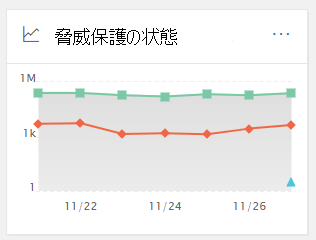
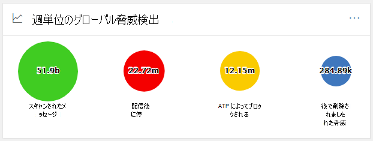
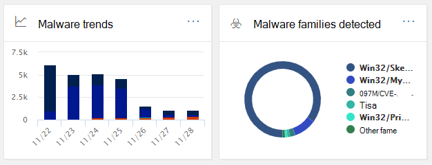
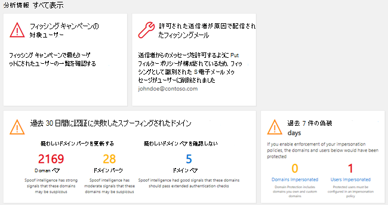

# セキュリティ 管理コンプライアンス センター&ダッシュボード

[!INCLUDE [Microsoft 365 Defender rebranding](../includes/microsoft-defender-for-office.md)]

## 基本的な機能とセキュリティ ダッシュボードを開く方法

[セキュリティ & コンプライアンス センター] を使用すると、組織 <https://protection.office.com> はデータ保護とコンプライアンスを管理できます。 必要なアクセス許可を持っている場合、セキュリティ ダッシュボードを使用すると、脅威保護の状態を確認し、セキュリティアラートを表示して操作できます。

ビデオを見て概要を確認し、この記事を読んで詳細を確認してください。

> [!VIDEO https://www.microsoft.com/videoplayer/embed/RE1VV3o]

組織のサブスクリプションに含まれる内容に応じて、セキュリティ ダッシュボードには、次のセクションで説明するように、脅威管理の概要、脅威保護の状態、グローバル週間脅威検出、マルウェアなど、いくつかのウィジェットが含まれます。

セキュリティ 管理コンプライアンス センターでセキュリティ ダッシュボード&するには、[脅威管理ダッシュボード] に **移動** \> **します**。 セキュリティ ダッシュボードに直接移動するには、 を使用します <https://protection.office.com/searchandinvestigation/dashboard> 。

> [!NOTE]
> セキュリティ ダッシュボードを表示するには、グローバル管理者、セキュリティ管理者、またはセキュリティ リーダーである必要があります。 一部のウィジェットでは、表示に追加のアクセス許可が必要です。 詳細については、「セキュリティ とコンプライアンス センターのアクセス許可 [」&参照](permissions-in-the-security-and-compliance-center.md)してください。

## 脅威管理の概要

脅威管理の概要ウィジェットは、組織が過去 7 日間の脅威から保護された方法を一目で示します。

脅威管理の概要に表示される情報は、サブスクリプションに含まれる内容によって異なります。 次の表に、ユーザーおよびユーザーに含まれる情報Office 365 E3示Office 365 E5。

 

****

|Office 365 E3|Office 365 E5|
|---|---|
|マルウェア メッセージがブロックされている フィッシング メッセージがブロックされる ユーザーによって報告されたメッセージ    |マルウェア メッセージがブロックされている フィッシング メッセージがブロックされる ユーザーによって報告されたメッセージ ゼロデイマルウェアがブロックされる 高度なフィッシング メッセージが検出されました ブロックされた悪意のある URL|
|

脅威管理の概要ウィジェットを表示またはアクセスするには、レポートの Defender を表示するためのアクセス許可Office 365があります。 詳細については、「レポートの Defender を表示するために必要なアクセス許可[Office 365」を参照してください](view-reports-for-mdo.md#what-permissions-are-needed-to-view-the-defender-for-office-365-reports)。

## 脅威保護の状態

脅威保護の状態ウィジェットは、フィッシングとマルウェアの傾向と詳細なビューで脅威保護の有効性を示します。

詳細は、Microsoft Defender のMicrosoft 365のMicrosoft 365  (EOP) Exchange Online Protectionが含まれるかどうか[によって異Office 365。](defender-for-office-365.md)

 

****

|サブスクリプションに含まれる場合。.|これらの詳細が表示されます|
|---|---|
|EOP ではなく Microsoft Defender for Office 365|EOP によって検出およびブロックされた悪意のある電子メール。
 「Threat [Protection Status report (EOP)」を参照してください](view-email-security-reports.md#threat-protection-status-report)。|
|Microsoft Defender for Office 365|悪意のあるコンテンツと悪意のある電子メールが EOP と Defender によって検出およびブロックOffice 365 
 マルウェア対策エンジン、ゼロ時間自動削除、および Office 365 機能[(セーフ](safe-links.md)リンク[、セーフ 添付](safe-attachments.md)ファイル、および Office 365 の Defender でのフィッシング対策を含む) によってブロックされた悪意のあるコンテンツを含む一意の電子メール メッセージの集計[数](set-up-anti-phishing-policies.md#exclusive-settings-in-anti-phishing-policies-in-microsoft-defender-for-office-365)。 
 「 [脅威保護の状態レポート」を参照してください](view-reports-for-mdo.md#threat-protection-status-report)。|
|

脅威保護状態ウィジェットを表示またはアクセスするには、レポートの Defender を表示するためのアクセス許可Office 365があります。 詳細については、「レポートの Defender を表示するために必要なアクセス許可[Office 365してください。](view-reports-for-mdo.md#what-permissions-are-needed-to-view-the-defender-for-office-365-reports)

## グローバル週次脅威検出

グローバル週間脅威検出ウィジェットは、過去 7 日間に電子メール メッセージで検出された脅威の数を示します。

メトリックは、次の表で説明するように計算されます。

 

****

|測定基準|計算方法|
|---|---|
|スキャンされたメッセージ|スキャンされた電子メール メッセージの数に受信者の数を掛けた数|
|脅威の停止|マルウェアが含まれていると識別された電子メール メッセージの数に受信者の数を掛けた数|
|Defender によって[ブロックOffice 365](defender-for-office-365.md)|Defender によってブロックされた電子メール メッセージの数Office 365受信者の数を乗算します。|
|配信後に削除|0 時間自動削除 [によって削除](zero-hour-auto-purge.md) されたメッセージの数に受信者の数を掛けた数|
|

## マルウェア

マルウェア ウィジェットには、過去 7 日間のマルウェアの傾向とマルウェア ファミリの種類に関する詳細が表示されます。

## 分析情報

インサイト重要な問題だけでなく、検討すべき推奨事項やアクションも含まれます。

たとえば、一部のユーザーが迷惑メール オプションを無効にしたため、フィッシングメール メッセージが配信されている場合があります。 分析情報の動作の詳細については、「Security &コンプライアンス センター」 [を参照してください](reports-and-insights-in-security-and-compliance.md)。

## 脅威の調査および対応

組織のサブスクリプションに Microsoft [Defender for Office 365プラン 2](office-365-ti.md)が含まれる場合、セキュリティ ダッシュボードには高度な脅威調査と対応ツールを含むセクションがあります。 これらのツールには、 [自動調査および応答機能が含まれます](automated-investigation-response-office.md)。 侵害されたユーザー アカウントに迅速に対処するなどのシナリオでは、自動調査と対応 [が役立ちます](address-compromised-users-quickly.md)。

詳細については、「自動調査と応答[(AIR)](office-365-air.md)の使用を開始する」を参照Office 365。

## 傾向

セキュリティ ダッシュボードの下部に [傾向] セクションがあります。組織のメール フローの傾向を要約します。 レポートは、スパム、マルウェア、フィッシング詐欺、および優れたメールとして分類された電子メールに関する情報を提供します。 タイルをクリックすると、レポートの詳細情報が表示されます。

![[傾向] セクションでは、組織の電子メール フローの傾向を要約します。](../../media/trends.png)

また、組織のサブスクリプションに defender [for Office 365 Plan 2](office-365-ti.md)が含まれる場合は、セキュリティ チームが優先度の高いセキュリティ アラートを表示してアクションを実行できる[最近の脅威管理アラート] レポートもこのセクションに表示されます。

送信電子メール ウィジェットと受信メール ウィジェットを表示またはアクセスするには、レポートの Defender を表示するためのアクセス許可Office 365があります。 詳細については、「レポートの Defender を表示するために必要なアクセス許可[Office 365」を参照してください](view-reports-for-mdo.md#what-permissions-are-needed-to-view-the-defender-for-office-365-reports)。

最近の脅威管理アラート ウィジェットを表示またはアクセスするには、アラートを表示するためのアクセス許可が必要です。 詳細については、「アラートを表示するために [必要な RBAC アクセス許可」を参照してください](../../compliance/alert-policies.md#rbac-permissions-required-to-view-alerts)。

## 関連記事

[セキュリティとコンプライアンス センターで電子メールのセキュリティ レポートを表示する](view-email-security-reports.md)

[Microsoft Defender for microsoft Defender for Office 365](view-reports-for-mdo.md)

[Defender for Office 365](defender-for-office-365.md)

[Office 365脅威の調査と対応](office-365-ti.md)
