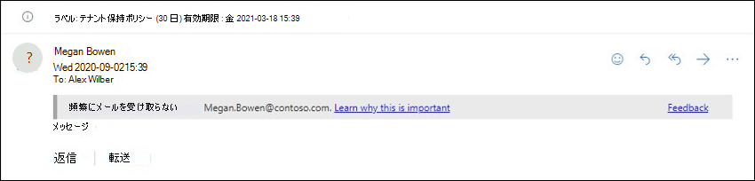
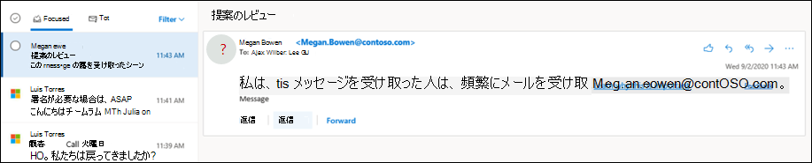

# アプリ内のフィッシング対策Microsoft 365

[!INCLUDE [Microsoft 365 Defender rebranding](../includes/microsoft-defender-for-office.md)]

**適用対象**
- [Exchange Online Protection](exchange-online-protection-overview.md)
- [Microsoft Defender for Office 365 プラン 1 およびプラン 2](defender-for-office-365.md)
- [Microsoft 365 Defender](../defender/microsoft-365-defender.md)

フィッシング対策の保護設定を構成するポリシーは、Exchange Online メールボックスを持つ Microsoft 365 組織、Exchange Online メールボックスのないスタンドアロン Exchange Online Protection (EOP) 組織、および Microsoft Defender で使用できます。Office 365組織。

組織の Microsoft Defender のOffice 365は次のとおりです。

- Microsoft 365 Enterprise E5、Microsoft 365 Education A5 など
- [Microsoft 365 Enterprise](https://www.microsoft.com/microsoft-365/enterprise/home)
- [Microsoft 365 Business](https://www.microsoft.com/microsoft-365/business)
- [Microsoft Defender for Office 365アドオンとして使用する](https://products.office.com/exchange/advance-threat-protection)

EOP のフィッシング対策ポリシーと Defender for Office 365 のフィッシング対策ポリシーの大きな違いについては、次の表で説明します。

 

****

|機能|EOP のフィッシング対策ポリシー|Defender for Office 365|
|---|:---:|:---:|
|既定のポリシーを自動的に作成する|||
|カスタム ポリシーの作成|||
|一般的なポリシー設定\*|||
|スプーフィング設定|||
|最初の連絡先安全性のヒント|||
|偽装設定|||
|高度なフィッシングのしきい値|||
|

\* 既定のポリシーでは、ポリシー名と説明は読み取り専用です (説明は空白です)、ポリシーが適用されるユーザーを指定することはできません (既定のポリシーはすべての受信者に適用されます)。

フィッシング対策ポリシーを構成するには、次の記事を参照してください。

- [EOP でのスパム対策ポリシーの構成](configure-anti-phishing-policies-eop.md)
- [Microsoft Defender でフィッシング対策ポリシーを構成Office 365](configure-mdo-anti-phishing-policies.md)

この記事の残りの部分では、EOP と Defender for Office 365 のフィッシング対策ポリシーで使用できる設定について説明します。

## 一般的なポリシー設定

次のポリシー設定は、EOP および Defender のフィッシング対策ポリシーで使用Office 365。

- **名前**: 既定のフィッシング対策ポリシーの名前を変更できない。 カスタムフィッシング対策ポリシーを作成した後、ポリシーの名前を変更するには、Microsoft 365 Defenderできます。

- **説明** 既定のフィッシング対策ポリシーには説明を追加できますが、作成するカスタム ポリシーの説明を追加および変更できます。

- **ユーザー、グループ、およびドメイン**: フィッシング対策ポリシーが適用される内部受信者を識別します。 この値はカスタム ポリシーで必須であり、既定のポリシーでは使用できません (既定のポリシーはすべての受信者に適用されます)。

  各条件や例外は 1 回しか使用できませんが、条件や例外には複数の値を含めることができます。 同じ条件や例外に複数の値がある場合、OR ロジック (たとえば、_\<recipient1\>_ または _\<recipient2\>_) が適用されます。 a別の条件や例外がある場合は AND ロジック (たとえば、_\<recipient1\>_ かつ _\<member of group 1\>_) が適用されます。

  - **ユーザー**: 組織内の 1 つ以上のメールボックス、メール ユーザー、またはメール連絡先。
  - **グループ**: 組織内の 1 つ以上のグループ。
  - **ドメイン**: ドメイン内で構成されている 1 つ以上のMicrosoft 365。

  - **これらのユーザー、グループ、およびドメインを除外する**: ポリシーの例外。 設定と動作は、次の条件とまったく同じになります。
    - **ユーザー**
    - **グループ**
    - **ドメイン**

  > [!NOTE]
  > ユーザー、グループ、およびドメインの設定では、ポリシーが適用されるメッセージ受信者を識別するために、カスタムフィッシング対策ポリシーで少なくとも1 つの選択が<u>必要です</u>。 Office 365 の Defender のフィッシング対策ポリシーには、この記事で後述する偽装保護を受ける送信者の電子メール アドレスまたは送信者<u></u>ドメインを個別に指定できる偽装設定があります。

## スプーフィング設定

スプーフィングは、電子メール メッセージの From アドレス (電子メール クライアントに表示される送信者アドレス) が電子メール ソースのドメインと一致しない場合です。 スプーフィングの詳細については、「スプーフィング対策の保護」を参照[Microsoft 365。](anti-spoofing-protection.md)

EOP および Defender のフィッシング対策ポリシーでは、次のスプーフィング設定を使用Office 365。

- **スプーフィング インテリジェンスを有効** にする: スプーフィング インテリジェンスのオンとオフを切り替えます。 オンのままにすることをお勧めします。

  スプーフィング インテリジェンスが有効になっている場合、スプーフィング インテリジェンスのインサイトには、スプーフィング インテリジェンスによって自動的に検出され、許可またはブロックされたスプーフィング送信者が表示されます。 スプーフィング インテリジェンスの評決を手動で上書きして、検出されたスプーフィングされた送信者をインサイト内から許可またはブロックできます。 ただし、その場合、スプーフィングされた送信者はスプーフィング インテリジェンスの分析情報から消え、テナント許可/ブロック一覧の [スプーフィング] タブにのみ表示されます。 テナント許可/ブロック一覧で、スプーフィングされた送信者の許可エントリまたはブロックエントリを手動で作成することもできます。 詳細については、次の資料を参照してください。

  - [EOP でのスプーフィング インテリジェンスの分析情報](learn-about-spoof-intelligence.md)
  - [EOP でテナントの許可/ブロックリストを管理する](tenant-allow-block-list.md)

  > [!NOTE]
  >
  > - スプーフィング対策保護は、既定のフィッシング対策ポリシーと、作成した新しいカスタムフィッシング対策ポリシーで既定で有効になっています。
  > - MX レコードが Microsoft 365 をポイントしない場合は、スプーフィング防止保護を無効にする必要があります。代わりに、コネクタの拡張フィルターを有効にします。 手順については、「拡張フィルタリング[for Connectors in Exchange Online」 を参照してください](/Exchange/mail-flow-best-practices/use-connectors-to-configure-mail-flow/enhanced-filtering-for-connectors)。
  > - スプーフィング対策保護を無効にすると、複合認証チェックからの _暗黙的_ なスプーフィング [保護だけが無効](email-validation-and-authentication.md#composite-authentication) にされます。 送信者が明示的な [DMARC](use-dmarc-to-validate-email.md)に失敗した場合、ポリシーが検疫または拒否に設定されている場所を確認しても、メッセージは検疫または拒否されます。

- **認証されていない送信者通知**: これらの通知は、スプーフィング インテリジェンスが有効になっている場合にのみ使用できます。 次のセクションの情報を参照してください。
- **アクション**: ブロックされたスプーフィングされた送信者からのメッセージ (スプーフィング インテリジェンスによって自動的にブロックされる、またはテナント許可/ブロックリストで手動でブロックされる) の場合は、メッセージに対して実行するアクションを指定することもできます。
  - **受信者の迷惑メール フォルダーにメッセージを移動する**: これが既定値です。 メッセージはメールボックスに配信され、迷惑メール フォルダーに移動されます。 詳細については、「迷惑メールの[設定を構成する」を参照Exchange OnlineのメールボックスMicrosoft 365。](configure-junk-email-settings-on-exo-mailboxes.md)
  - **メッセージを検疫する**: メッセージを目的の受信者ではなく検疫に送信します。 検疫の詳細については、以下の記事を参照してください。
    - [[検疫] Microsoft 365](quarantine-email-messages.md)
    - [検疫済みメッセージとファイルを管理者として管理Microsoft 365](manage-quarantined-messages-and-files.md)
    - [検疫済みメッセージをユーザーとして検索して解放Microsoft 365](find-and-release-quarantined-messages-as-a-user.md)

    [メッセージの **検疫] を選択した** 場合は、スプーフィング インテリジェンス保護によって検疫されたメッセージに適用される検疫ポリシーを選択することもできます。 検疫ポリシーは、検疫されたメッセージに対してユーザーが実行できる操作と、ユーザーが検疫通知を受け取るかどうかを定義します。 詳細については、「[検疫ポリシー](quarantine-policies.md)」を参照してください。

### 認証されていない送信者

認証されていない送信者通知は、前のセクションで説明したように、EOP および Defender for Office 365 のフィッシング対策ポリシーで使用できるスプーフィング設定の一部です。 スプーフィング インテリジェンスが有効になっている場合にのみ、次の設定を使用できます。

- スプーフィングの認証されていない送信者に対して **(?)** を表示する : メッセージが SPF チェックまたは DKIM チェックに合格しない場合、メッセージがDMARC または複合認証に合格しない 場合、この通知は差出人の写真に疑問符を追加します。 この設定をオフにすると、送信者の写真に疑問符は追加されません。

- **"via"** タグを表示する: この通知は、差出人アドレス (メール クライアントに表示されるメッセージ送信者) のドメインが DKIM 署名または **MAIL FROM** アドレスのドメインと異なる場合、差出人ボックスに via タグ <u>(chris@contoso.com</u>経由で fabrikam.com) を追加します。 これらのアドレスの詳細については、「電子メール [メッセージ標準の概要」を参照してください](how-office-365-validates-the-from-address.md#an-overview-of-email-message-standards)。

疑問符またはタグ経由で特定の送信者からのメッセージに追加されるのを防ぐには、次のオプションがあります。

- スプーフィングインテリジェンスインサイトまたはテナント許可/ブロック一覧で手動でスプーフィングされた送信者[を許可します](tenant-allow-block-list.md)。 スプーフィングされた送信者を許可すると、認証されていない送信者の識別が無効になっているときに、送信者からのメッセージに via タグが表示されません。
- [送信者ドメインの電子](email-validation-and-authentication.md#configure-email-authentication-for-domains-you-own) メール認証を構成します。
  - 送信者の写真の疑問符では、SPF または DKIM が最も重要です。
  - via タグの場合は、DKIM 署名のドメインまたは **MAIL FROM** アドレスが From アドレスのドメインと一致 (またはサブドメイン) を確認します。

詳細については、「Outlook.com および Outlook で疑わしいメッセージを[識別する」を参照Outlook on the web](https://support.microsoft.com/office/3d44102b-6ce3-4f7c-a359-b623bec82206)

## 最初の連絡先安全性のヒント

[**最初の連絡先を表示安全性のヒント** 設定は、組織の EOP と Defender で使用できますOffice 365スプーフィング インテリジェンスや偽装保護の設定には依存しない。 この安全性のヒントは、次のシナリオで受信者に表示されます。

- 送信者からメッセージを初めて受け取る場合
- 多くの場合、送信者からメッセージを取得しません。

この機能は、潜在的な偽装攻撃に対するセキュリティ保護の層を追加します。そのため、有効にすることをお勧めします。

最初の連絡先 安全性のヒント は **、X-MS-Exchange-EnableFirstContactSafetyTip** という名前のヘッダーを [メッセージに有効にする] という名前のヘッダーを追加するメール フロー ルール(トランスポート ルールとも呼ばれる) を作成する必要性を置き換えます (ただし、この機能は引き続き使用できます)。

> [!NOTE]
> メッセージに複数の受信者がある場合、ヒントが表示されるかどうか、および多数決モデルに基づく受信者。 大多数の受信者が送信者からメッセージを受信したことがない、または受信しない場合、影響を受けた受信者は、このメッセージを受け取った一部のユーザーを受け取ります **。ヒント。** この動作が受信者間の通信習慣を明かしている場合は、最初の連絡先 安全性のヒント を有効にし、代わりにメール フロー ルールを引き続き使用する必要があります。

## Microsoft Defender のフィッシング対策ポリシーの排他的な設定を使用Office 365

このセクションでは、Defender for Office 365 のフィッシング対策ポリシーでのみ使用できるポリシー設定についてOffice 365。

> [!NOTE]
> Defender for Office 365の既定のフィッシング対策ポリシーは、すべての受信者にスプーフィング保護とメールボックス インテリジェンスを提供します。 ただし、既定のポリシーでは、[他の](#impersonation-settings-in-anti-phishing-policies-in-microsoft-defender-for-office-365)利用可能な偽装保護機能と高度な設定が構成または有効になっていません。 すべての保護機能を有効にするには、既定のフィッシング対策ポリシーを変更するか、追加のフィッシング対策ポリシーを作成します。

### Microsoft Defender のフィッシング対策ポリシーの偽装Office 365

偽装とは、メッセージ内の送信者または送信者の電子メール ドメインが実際の送信者またはドメインに似ている場合です。

- ドメイン contoso.com のなりすまし例は óntoso.com です。
- ユーザー偽装とは、ユーザーの表示名と電子メール アドレスの組み合わせです。 たとえば、Valeria Barrios (vbarrios@contoso.com) は Valeria Barrios として偽装されますが、電子メール アドレスは完全に異なります。

> [!NOTE]
> 偽装保護では、類似するドメインが見えます。 たとえば、ドメインが contoso.com の場合は、偽装の試みとして異なるトップ レベル ドメイン (.com、.biz など) がチェックされますが、多少似ているドメインもチェックします。 たとえば、contosososo.com または contoabcdef.com が偽装の試みと見な contoso.com。

なりすましされたドメインは、受信者を欺くことを目的とする場合を除いて、正規のドメイン（登録済みドメイン、構成済みの電子メール認証レコードなど）と見なされる場合があります。

次の偽装設定は、Defender のフィッシング対策ポリシーでのみ使用Office 365。

- **ユーザーが保護を有効** にする : 指定した内部または外部の電子メール アドレスがメッセージ送信者として偽装 **されるのを防ぐ**。 たとえば、会社のバイスプレジデントから社内情報の送信を求める電子メール メッセージを受け取ります。 やってみませんか? 多くの人が何も考えずに返信を送るでしょう。

  保護されたユーザーを使用して、偽装から保護するために内部および外部の送信者の電子メール アドレスを追加できます。 このユーザー偽装から保護される送信者の一覧は、ポリシーが適用される受信者の一覧とは異なります (既定のポリシーのすべての受信者、および [共通ポリシー設定] セクションの [ユーザー、グループ、ドメイン] 設定で構成されている特定の受信者)。 

  > [!NOTE]
  >
  > - 各フィッシング対策ポリシーでは、最大 350 人の保護されたユーザー (送信者の電子メール アドレス) を指定できます。 複数のポリシーで同じ保護されたユーザーを指定できない。 したがって、受信者に適用されるポリシーの数に関係なく、個々の受信者の保護されたユーザー (送信者の電子メール アドレス) の最大数は 350 です。 ポリシーの優先度と、最初のポリシーの適用後にポリシー処理が停止する方法の詳細については、「電子メール保護の順序と優先順位」 [を参照してください](how-policies-and-protections-are-combined.md)。
  > - 送信者と受信者が以前に電子メールで通信した場合、ユーザー偽装保護は機能しません。 送信者と受信者がメールで通信したことがない場合、メッセージは偽装の試みとして識別されます。

  既定では、ユーザーの偽装保護用に送信者の電子メール アドレス **が構成されていません**。 したがって、既定では、送信者の電子メール アドレスは、既定のポリシーまたはカスタム ポリシーの偽装保護によってカバーされません。

  内部または外部の電子メール アドレスを **ユーザー** に追加してリストを保護すると、それらの送信者からのメッセージは偽装保護チェックの対象になります。 ポリシーが適用される受信者 (既定のポリシーのすべての受信者)にメッセージが送信された場合、メッセージは偽装のチェックを受け取ります。**カスタム ポリシー内のユーザー、グループ**、およびドメインの受信者)。 送信者の電子メール アドレスで偽装が検出された場合、ユーザーの偽装保護アクションがメッセージに適用されます (メッセージの処理、偽装ユーザーの安全に関するヒントの表示など)。

- **保護するドメインを有効** にする : 指定したドメインがメッセージ送信者のドメインで偽装されるの **を防ぐ**。 たとえば、所有しているすべてのドメイン[(受](/exchange/mail-flow-best-practices/manage-accepted-domains/manage-accepted-domains)け入れドメイン) や特定のカスタム ドメイン (所有しているドメインまたはパートナー ドメイン) などです。 偽装から保護される送信者ドメインのこのリストは、ポリシーが適用される受信者の一覧とは異なります (既定のポリシーのすべての受信者、および [共通ポリシー設定] セクションの [ユーザー  、グループ、ドメイン] 設定で構成されている特定の受信者)。 

  > [!NOTE]
  > すべてのフィッシング対策ポリシーで定義できる保護されたドメインの最大数は 50 です。

  既定では、[保護するドメインを有効にする] で偽装保護用に送信者 **ドメインが構成されていません**。 したがって、既定では、既定のポリシーまたはカスタム ポリシーでは、偽装保護の対象となる送信者ドメインはありません。

  ドメインを [保護するドメインを有効にする] リストに追加すると、それらのドメインの送信者からのメッセージは偽装保護チェックの対象です。 ポリシーが適用される受信者 (既定のポリシーのすべての受信者)にメッセージが送信された場合、メッセージは偽装のチェックを受け取ります。**カスタム ポリシー内のユーザー、グループ**、およびドメインの受信者)。 送信者のドメインで偽装が検出された場合、ドメインの偽装保護アクションがメッセージに適用されます (メッセージの処理、偽装ユーザーの安全に関するヒントの表示など)。

- **アクション**: ポリシー内の保護されたユーザーと保護されたドメインに対する偽装の試行を含む受信メッセージに対して実行するアクションを選択します。 保護されたユーザーの偽装と保護されたドメインの偽装に対して、さまざまなアクションを指定できます。
  - **アクションを適用しない**
  - **メッセージを他の電子メール アドレス** にリダイレクトする: メッセージを、目的の受信者ではなく、指定した受信者に送信します。
  - **受信者の迷惑メール フォルダーに** メッセージを移動する: メッセージはメールボックスに配信され、迷惑メール フォルダーに移動されます。 詳細については、「迷惑メールの[設定を構成する」を参照Exchange OnlineのメールボックスMicrosoft 365。](configure-junk-email-settings-on-exo-mailboxes.md)
  - **メッセージを検疫する**: メッセージを目的の受信者ではなく検疫に送信します。 検疫の詳細については、以下の記事を参照してください。
    - [[検疫] Microsoft 365](quarantine-email-messages.md)
    - [検疫済みメッセージとファイルを管理者として管理Microsoft 365](manage-quarantined-messages-and-files.md)
    - [検疫済みメッセージをユーザーとして検索して解放Microsoft 365](find-and-release-quarantined-messages-as-a-user.md)

    [メッセージの **検疫]** を選択した場合は、ユーザー偽装またはドメイン偽装保護によって検疫されるメッセージに適用される検疫ポリシーを選択することもできます。 検疫ポリシーは、検疫されたメッセージに対してユーザーが実行できる操作を定義します。 詳細については、「[検疫ポリシー](quarantine-policies.md)」を参照してください。

  - **メッセージを配信し、他** のアドレスを Bcc 行に追加する : メッセージを目的の受信者に配信し、指定した受信者にメッセージをサイレント配信します。
  - **配信前にメッセージを削除する**: メッセージ全体 (すべての添付ファイルを含む) をサイレントモードで削除します。

- **偽装の安全に関するヒント**: 偽装チェックに失敗したメッセージが表示される次の偽装安全ヒントを有効またはオフにします。
  - **偽装ユーザーのヒントを表示** する : From アドレスには、ユーザーを保護 **するための有効なユーザーが含** まれる。 ユーザーが保護 **を有効にして構成** されている場合にのみ使用できます。
  - **偽装ドメインのヒントを表示** する : From アドレスには、ドメインを保護するための **Enable ドメインが含** まれる。 [保護するドメイン **を有効にする] がオン** になって構成されている場合にのみ使用できます。
  - 異常な文字のヒントを表示する **:** 差出人アドレスには、送信者を保護するユーザーを有効にするまたは送信者ドメインを保護するドメインを有効にするに異常な文字セット (たとえば、数学記号とテキスト、大文字と小文字の組み合わせ) が含まれています。  [ユーザーの保護 **を有効にする] または**[保護するドメインを有効 **にする**] がオンになって構成されている場合にのみ使用できます。

- **メールボックス インテリジェンスを有効** にする: 頻繁に連絡先を使用してユーザーの電子メール パターンを決定する人工知能 (AI) を有効または無効にします。 この設定は、AI がメッセージと正当な送信者と偽装された送信者を区別するのに役立ちます。

  たとえば、ガブリエラ Laureano (glaureano@contoso.com) は会社の CEO なので、ポリシーの設定を保護するためにユーザーを有効にするで保護された送信者として追加します。 ただし、このポリシーが適用される受信者の中には、ガブリエラ・ラウレアーノ (glaureano@fabrikam.com) という名前のベンダーと定期的に通信する glaureano@fabrikam.com。 これらの受信者は glaureano@fabrikam.com との通信履歴を持つため、メールボックス インテリジェンスは glaureano@fabrikam.com からのメッセージをそれらの受信者の偽装 glaureano@contoso.com として識別しません。

  メールボックス インテリジェンスによって学習された頻繁な連絡先 (およびその不足) を使用して、偽装攻撃からユーザーを保護するには、[メールボックス インテリジェンスを有効にする] をオンにした後、[インテリジェンス偽装保護を有効にする] をオンにします。

- **インテリジェンス偽装保護を有効** にする: この設定を有効にして、メールボックス インテリジェンス結果からの偽装検出のメッセージに対して実行するアクションを指定します。
  - **アクションを適用** しない : この値は、メールボックス インテリジェンスをオンにしたが[インテリジェンス偽装保護を有効にする] をオフにした場合と同じ結果 **になります**。
  - **メッセージを他の電子メール アドレスにリダイレクトする**
  - **受信者の迷惑メール フォルダーにメッセージを移動する**
  - **メッセージを検疫する**: このアクションを選択した場合は、メールボックス インテリジェンス保護によって検疫されるメッセージに適用される検疫ポリシーを選択することもできます。 検疫ポリシーは、検疫されたメッセージに対してユーザーが実行できる操作と、ユーザーが検疫通知を受け取るかどうかを定義します。 詳細については、「[検疫ポリシー](quarantine-policies.md)」を参照してください。
  - **メッセージを配信し、他のアドレスを Bcc 行に追加する**
  - **配信前にメッセージを削除する**

- **信頼できる送信者とドメインを追加する**: 偽装保護設定の例外。 指定された送信者および送信者ドメインからのメッセージは、ポリシーによって偽装ベースの攻撃として分類されません。 つまり、保護された送信者、保護されたドメイン、またはメールボックス インテリジェンス保護のアクションは、これらの信頼できる送信者または送信者ドメインには適用されません。 これらのリストの最大制限は 1024 エントリです。

### Microsoft Defender のフィッシング対策ポリシーの高度なフィッシングOffice 365

次の高度なフィッシングのしきい値は、Defender のフィッシング対策ポリシーでのみOffice 365。 これらのしきい値は、機械学習モデルをメッセージに適用してフィッシングの評決を決定する際の感度を制御します。

- **1 - Standard**: これが既定値です。 メッセージに対して実行されるアクションの重大度は、メッセージがフィッシング (低、中、高、または非常に高い信頼) であるという信頼度によって異なります。 たとえば、信頼度が非常に高いフィッシング詐欺として識別されるメッセージは最も重大なアクションを適用しますが、信頼度の低いフィッシングとして識別されるメッセージは、より厳しいアクションが適用されません。
- **2 - アグレッ** シブ : 高い信頼度を持つフィッシングと識別されたメッセージは、非常に高い信頼性で識別された場合と同様に処理されます。
- **3 - より** 積極的: 中程度または高い信頼度を持つフィッシングとして識別されるメッセージは、非常に高い信頼度で識別された場合と同様に処理されます。
- **4 - 最** も攻撃的: 信頼度が低い、中程度、または高い信頼性を持つフィッシングとして識別されるメッセージは、非常に高い信頼度で識別された場合と同様に処理されます。

この設定を増やすと、誤検知 (良いメッセージが正しいとマークされている) の可能性が高くなっています。 推奨設定の詳細については[、「Microsoft Defender](recommended-settings-for-eop-and-office365.md#anti-phishing-policy-settings-in-microsoft-defender-for-office-365)のフィッシング対策ポリシー」を参照Office 365してください。
