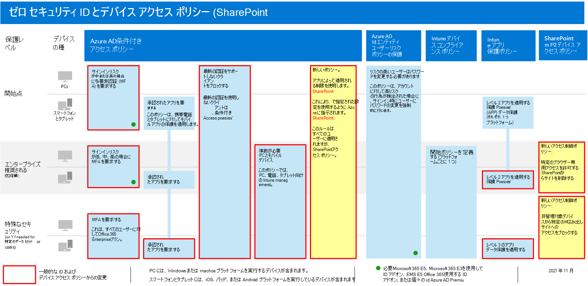
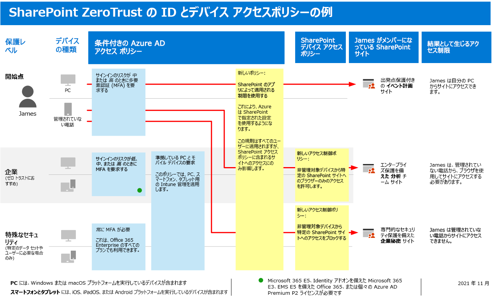

# SharePoint サイトおよびファイルをセキュリティで保護するためのポリシーの推奨事項Policy recommendations for securing SharePoint sites and files

**適用対象****Applies to**
- [Exchange Online ProtectionExchange Online Protection](exchange-online-protection-overview.md)
- [Microsoft Defender for Office 365 プラン 1 およびプラン 2Microsoft Defender for Office 365 plan 1 and plan 2](defender-for-office-365.md)
- SharePoint OnlineSharePoint Online 

この記事では、SharePoint と OneDrive for Business を保護するために推奨される ID ポリシーとデバイス アクセス ポリシーを実装する方法について説明します。This article describes how to implement the recommended identity and device-access policies to protect SharePoint and OneDrive for Business. このガイダンスは、共通の [ID ポリシーとデバイス アクセス ポリシーを基にしています](identity-access-policies.md)。This guidance builds on the [common identity and device access policies](identity-access-policies.md).

これらの推奨事項は、ニーズの粒度に基づいて適用できる SharePoint ファイルのセキュリティと保護の 3 つの層に基づいて行います。ベースライン、機密性の高い、高度に規制 **されています**。These recommendations are based on three different tiers of security and protection for SharePoint files that can be applied based on the granularity of your needs: **baseline**, **sensitive**, and **highly regulated**. これらのセキュリティ層と、これらの推奨事項で参照される推奨クライアント オペレーティング システムの詳細については、「概要」 [を参照してください](microsoft-365-policies-configurations.md)。You can learn more about these security tiers, and the recommended client operating systems, referenced by these recommendations in [the overview](microsoft-365-policies-configurations.md).

このガイダンスの実装に加えて、機密性の高い規制が厳しいコンテンツに対して適切なアクセス許可を設定するなど、適切な保護を備えて SharePoint サイトを構成してください。In addition to implementing this guidance, be sure to configure SharePoint sites with the right amount of protection, including setting appropriate permissions for sensitive and highly-regulated content.

## SharePoint と OneDrive for Business を含む一般的なポリシーを更新するUpdating common policies to include SharePoint and OneDrive for Business

SharePoint と OneDrive のファイルを保護するために、次の図は、共通の ID およびデバイス アクセス ポリシーから更新するポリシーを示しています。To protect files in SharePoint and OneDrive, the following diagram illustrates which policies to update from the the common identity and device access policies.

共通ポリシーの作成時に SharePoint を含める場合は、新しいポリシーのみを作成する必要があります。If you included SharePoint when you created the common policies, you only need to create the new policies. 条件付きアクセス ポリシーの場合、SharePoint には OneDrive が含まれます。For Conditional Access policies, SharePoint includes OneDrive.

新しいポリシーでは、指定した SharePoint サイトに特定のアクセス要件を適用することで、機密性の高い高度に規制されたコンテンツのデバイス保護を実装します。The new policies implement device protection for sensitive and highly-regulated content by applying specific access requirements to SharePoint sites that you specify.

次の表に、SharePoint のレビューと更新、または新しい作成を行う必要があるポリシーを示します。The following table lists the policies you either need to review and update or create new for SharePoint. 共通ポリシーは、「共通 ID とデバイス アクセス ポリシー」の記事に関連付けられた構成 [手順にリンク](identity-access-policies.md) します。The common policies link to the associated configuration instructions in the [Common identity and device access policies](identity-access-policies.md) article.

|保護レベルProtection level|ポリシーPolicies|詳細情報More information|
|---|---|---|
|**Baseline****Baseline**|[サインイン リスクが中程度または高の場合に MFA *を* 要求 *する*Require MFA when sign-in risk is *medium* or *high*](identity-access-policies.md#require-mfa-based-on-sign-in-risk)|クラウド アプリの割り当てに SharePoint を含める。Include SharePoint in the assignment of cloud apps.|
||[先進認証をサポートしないクライアントはブロックするBlock clients that don't support modern authentication](identity-access-policies.md#block-clients-that-dont-support-multi-factor)|クラウド アプリの割り当てに SharePoint を含める。Include SharePoint in the assignment of cloud apps.|
||[APP データ保護ポリシーの適用Apply APP data protection policies](identity-access-policies.md#apply-app-data-protection-policies)|すべての推奨アプリがアプリの一覧に含まれているか確認してください。Be sure all recommended apps are included in the list of apps. 各プラットフォーム (iOS、Android、Windows) のポリシーを必ず更新してください。Be sure to update the policy for each platform (iOS, Android, Windows).|
||[準拠 PC が必要Require compliant PCs](identity-access-policies.md#require-compliant-pcs-but-not-compliant-phones-and-tablets)|クラウド アプリの一覧に SharePoint を含める。Include SharePoint in list of cloud apps.|
||[SharePoint でアプリに適用される制限を使用するUse app enforced restrictions in SharePoint](#use-app-enforced-restrictions-in-sharepoint)|この新しいポリシーを追加します。Add this new policy. これにより、Azure Active Directory (Azure AD) に、SharePoint で指定された設定を使用するように指示されます。This tells Azure Active Directory (Azure AD) to use the settings specified in SharePoint. このポリシーはすべてのユーザーに適用されますが、SharePoint アクセス ポリシーに含まれるサイトへのアクセスにのみ影響します。This policy applies to all users, but only affects access to sites included in SharePoint access policies.|
|**機密****Sensitive**|[サインイン リスクが低い、中程度、または高い場合に MFA *を* 要求 *する*Require MFA when sign-in risk is *low*, *medium* or *high*](identity-access-policies.md#require-mfa-based-on-sign-in-risk)|クラウド アプリの割り当てに SharePoint を含める。Include SharePoint in the assignments of cloud apps.|
||[準拠している PC とモバイル *デバイスを* 要求するRequire compliant PCs *and* mobile devices](identity-access-policies.md#require-compliant-pcs-and-mobile-devices)|クラウド アプリの一覧に SharePoint を含める。Include SharePoint in the list of cloud apps.|
||[SharePoint アクセス制御ポリシー](#sharepoint-access-control-policies): 管理されていないデバイスから特定の SharePoint サイトへのブラウザー専用アクセスを許可します。[SharePoint access control policy](#sharepoint-access-control-policies): Allow browser-only access to specific SharePoint sites from unmanaged devices.|これにより、ファイルの編集とダウンロードが防止されます。This prevents edit and download of files. PowerShell を使用してサイトを指定します。Use PowerShell to specify sites.|
|**厳しく規制****Highly regulated**|[*常に* MFA を要求する*Always* require MFA](identity-access-policies.md#require-mfa-based-on-sign-in-risk)|クラウド アプリの割り当てに SharePoint を含める。Include SharePoint in the assignment of cloud apps.|
||[SharePoint アクセス制御ポリシー](#use-app-enforced-restrictions-in-sharepoint): 管理されていないデバイスからの特定の SharePoint サイトへのアクセスをブロックします。[SharePoint access control policy](#use-app-enforced-restrictions-in-sharepoint): Block access to specific SharePoint sites from unmanaged devices.|PowerShell を使用してサイトを指定します。Use PowerShell to specify sites.|
|

## SharePoint でのアプリによる制限の使用Use app-enforced restrictions in SharePoint

SharePoint でアクセス制御を実装する場合は、Azure AD でこの条件付きアクセス ポリシーを作成して、SharePoint で構成したポリシーを適用するように Azure AD に伝える必要があります。If you implement access controls in SharePoint, you must create this Conditional Access policy in Azure AD to tell Azure AD to enforce the policies you configure in SharePoint. このポリシーはすべてのユーザーに適用されますが、SharePoint でアクセス制御を作成するときに PowerShell を使用して指定したサイトへのアクセスにのみ影響します。This policy applies to all users, but only affects access to the sites you specify using PowerShell when you create the access controls in SharePoint.

このポリシーを構成するには、「管理されていないデバイスからのアクセスを制御する」の「特定の SharePoint サイト コレクションまたは OneDrive アカウントへのアクセスをブロックまたは制限する」 [を参照してください](/sharepoint/control-access-from-unmanaged-devices)。To configure this policy see "Block or limit access to specific SharePoint site collections or OneDrive accounts" in [Control access from unmanaged devices](/sharepoint/control-access-from-unmanaged-devices).

## SharePoint アクセス制御ポリシーSharePoint access control policies

Microsoft では、デバイス アクセス制御を使用して、機密性の高い規制の高いコンテンツを使用して SharePoint サイト内のコンテンツを保護することを推奨します。Microsoft recommends you protect content in SharePoint sites with sensitive and highly-regulated content with device access controls. これを行うには、保護のレベルと保護を適用するサイトを指定するポリシーを作成します。You do this by creating a policy that specifies the level of protection and the sites to apply the protection to.

- 機密性の高いサイト: ブラウザー専用のアクセスを許可します。Sensitive sites: Allow browser-only access. これにより、ユーザーはファイルを編集およびダウンロードできます。This prevents users from editing and downloading files.
- 高度に規制されたサイト: 管理されていないデバイスからのアクセスをブロックします。Highly regulated sites: Block access from unmanaged devices.

「管理されていないデバイスからのアクセスを制御する」の「特定の SharePoint サイト コレクションまたは OneDrive アカウントへのアクセスをブロックまたは [制限する」を参照してください](/sharepoint/control-access-from-unmanaged-devices)。See "Block or limit access to specific SharePoint site collections or OneDrive accounts" in [Control access from unmanaged devices](/sharepoint/control-access-from-unmanaged-devices).

## これらのポリシーの動作How these policies work together

SharePoint サイトのアクセス許可は、通常、サイトへのアクセスに対するビジネス上の必要性に基づいて行なう必要があります。It's important to understand that SharePoint site permissions are typically based on business need for access to sites. これらのアクセス許可は、サイトの所有者によって管理され、非常に動的な場合があります。These permissions are managed by site owners and can be highly dynamic. SharePoint デバイス アクセス ポリシーを使用すると、ベースライン保護、機密性の高い保護、または厳しく規制された保護に関連付けられた Azure AD グループにユーザーが割り当てられているかどうかに関係なく、これらのサイトを保護できます。Using SharePoint device access policies ensures protection to these sites, regardless of whether users are assigned to an Azure AD group associated with baseline, sensitive, or highly regulated protection.

次の図は、SharePoint デバイス アクセス ポリシーがユーザーのサイトへのアクセスを保護する方法の例を示しています。The following illustration provides an example of how SharePoint device access policies protect access to sites for a user.

[このイメージのより大きなバージョンを表示するSee a larger version of this image](https://github.com/MicrosoftDocs/microsoft-365-docs/raw/public/microsoft-365/media/microsoft-365-policies-configurations/SharePoint-rules-scenario.png)

James には基準となる条件付きアクセス ポリシーが割り当て済みですが、機密性の高い保護または高度に規制された保護を備え、SharePoint サイトにアクセスできます。James has baseline Conditional Access policies assigned, but he can be given access to SharePoint sites with sensitive or highly-regulated protection.

- James が自分の PC を使用するメンバーである機密性の高い、または規制の厳しいサイトにアクセスした場合、自分の PC が準拠している限り、アクセスが許可されます。If James accesses a sensitive or highly-regulated site he is a member of using his PC, his access is granted as long as his PC is compliant.
- James が管理されていない電話を使用するメンバーである機密性の高いサイトにアクセスした場合、このサイト用に構成されたデバイス アクセス ポリシーにより、機密性の高いサイトへのブラウザー専用アクセスを受け取る必要があります。If James accesses a sensitive site he is a member of using his unmanaged phone, which is allowed for baseline users, he will receive browser-only access to the sensitive site due to the device access policy configured for this site.
- James が管理されていない電話を使用するメンバーである規制の厳しいサイトにアクセスすると、このサイト用に構成されたアクセス ポリシーが原因でブロックされます。If James accesses a highly regulated site he is a member of using his unmanaged phone, he will be blocked due to the access policy configured for this site. このサイトにアクセスできるのは、管理および準拠している PC を使用する場合のみです。He can only access this site using his managed and compliant PC.

## 次の手順Next step

次の条件付きアクセス ポリシーを構成します。Configure Conditional Access policies for:

- [Microsoft TeamsMicrosoft Teams](teams-access-policies.md)
- [Exchange OnlineExchange Online](secure-email-recommended-policies.md)