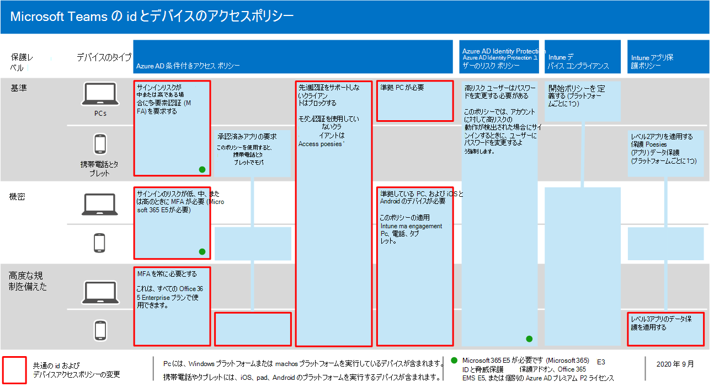
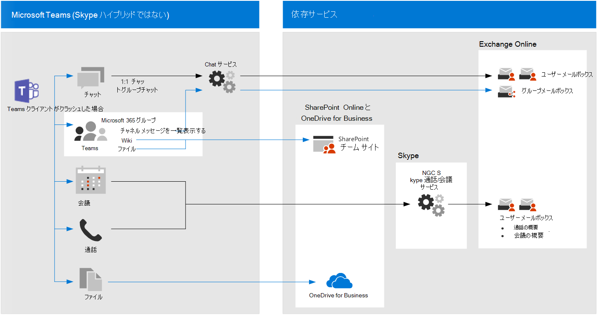

# チャット、グループ、ファイルTeamsセキュリティ保護に関するポリシーの推奨事項

この記事では、推奨される ID ポリシーとデバイス アクセス ポリシーを実装して、Microsoft Teams チャット、グループ、およびファイルや予定表などのコンテンツを保護する方法について説明します。 このガイダンスは、一般的な[ID](identity-access-policies.md)とデバイス アクセス ポリシーに基Teamsです。 このTeams他の製品と統合される場合は、「セキュリティ保護に関するポリシー SharePoint、電子メールのセキュリティ保護に関するポリシーの推奨事項」も[参照してください](secure-email-recommended-policies.md)。

これらの推奨事項は、ニーズの細分性に基づいて適用できる Teams のセキュリティと保護の 3 つの層に基づいて行います。ベースライン、機密性の高い、高度に規制されています。 これらのセキュリティ層と、これらの推奨事項で参照される推奨ポリシーの詳細については、「Identity and [device access configurations」を参照してください](microsoft-365-policies-configurations.md)。

組織外のユーザーをTeams、特定の認証の状況をカバーするために、この記事では、展開に固有の推奨事項について説明します。 完全なセキュリティ エクスペリエンスを提供するには、このガイダンスに従う必要があります。

## 他の依存サービスのTeamsの開始方法

依存サービスを有効にして、サービスを開始する必要Microsoft Teams。 これらのサービスはすべて "単なる動作" になります。 ただし、次のサービス関連の要素を管理するために準備する必要があります。

- Microsoft 365 グループ
- SharePoint チーム サイト
- OneDrive for Business
- Exchange メールボックス
- ビデオと Planner プランのストリーミング (これらのサービスが有効な場合)

## 一般的なポリシーを更新してポリシーを含Teams

チャット、グループ、およびコンテンツを保護するために、Teamsの ID ポリシーとデバイス アクセス ポリシーから更新するポリシーを次の図に示します。 更新するポリシーごとに、クラウド アプリの割りTeamsサービスと依存サービスが含まれているか確認します。

これらのサービスは、クラウド アプリの割り当てに含める依存サービスTeams。

- Microsoft Teams
- SharePoint および OneDrive for Business
- Exchange Online
- Skype for Business Online
- Microsoft Stream (会議の記録)
- Microsoft Planner (Planner タスクと計画データ)

次の表に、再訪する必要があるポリシーと、共通 ID およびデバイスアクセス ポリシー内の各ポリシーへのリンクを示します。これは、すべての Office アプリケーションに対してより広いポリシーが設定されています。

|保護レベル|ポリシー|実装に関するTeams情報|
|---|---|---|
|**Baseline**|[サインイン リスクが中程度または高の場合に MFA *を* 要求 *する*](identity-access-policies.md#require-mfa-based-on-sign-in-risk)|アプリのTeamsにサービスと依存サービスが含まれているか確認してください。 Teamsゲスト アクセスルールと外部アクセス ルールも考慮する必要がある場合は、この記事の後半でこれらのルールの詳細について説明します。|
||[先進認証をサポートしないクライアントはブロックする](identity-access-policies.md#block-clients-that-dont-support-multi-factor)|クラウド Teams割り当てには、サービスと依存サービスを含める。|
||[高リスク ユーザーはパスワードを変更する必要がある](identity-access-policies.md#high-risk-users-must-change-password)|アカウントTeamsリスクの高いアクティビティが検出された場合、サインイン時にユーザーにパスワードの変更を強制的に行います。 アプリのTeamsにサービスと依存サービスが含まれているか確認してください。|
||[APP データ保護ポリシーの適用](identity-access-policies.md#apply-app-data-protection-policies)|アプリのTeamsにサービスと依存サービスが含まれているか確認してください。 各プラットフォームのポリシーを更新します (iOS、Android、Windows)。|
||[デバイス コンプライアンス ポリシーの定義](identity-access-policies.md#define-device-compliance-policies)|このポリシー Teamsサービスと依存サービスを含める。|
||[準拠 PC が必要](identity-access-policies.md#require-compliant-pcs-but-not-compliant-phones-and-tablets)|このポリシー Teamsサービスと依存サービスを含める。|
|**機密**|[サインイン リスクが低い、中程度、または高い場合に MFA *を* 要求 *する*](identity-access-policies.md#require-mfa-based-on-sign-in-risk)|Teamsゲスト アクセスルールと外部アクセス ルールも考慮する必要がある場合は、この記事の後半でこれらのルールの詳細について説明します。 このポリシー Teamsサービスと依存サービスを含める。|
||[準拠している PC とモバイル *デバイスを* 要求する](identity-access-policies.md#require-compliant-pcs-and-mobile-devices)|このポリシー Teamsサービスと依存サービスを含める。|
|**厳しく規制**|[*常に* MFA を要求する](identity-access-policies.md#require-mfa-based-on-sign-in-risk)|ユーザー ID に関係なく、MFA は組織で使用されます。 このポリシー Teamsサービスと依存サービスを含める。 |
|

## Teamsサービスアーキテクチャ

参考までに、次の図は、ユーザーがTeamsを示しています。 詳細と図については、「it アーキテクト向けMicrosoft Teamsの生産性サービス[と関連Microsoft 365を参照してください](../../solutions/productivity-illustrations.md)。

[このイメージのより大きなバージョンを表示する](https://github.com/MicrosoftDocs/microsoft-365-docs/raw/public/microsoft-365/media/microsoft-365-policies-configurations/identity-access-logical-architecture-teams.png)

## ユーザーのゲストおよび外部アクセスTeams

Microsoft Teamsアクセスの種類を定義します。

- ゲスト **アクセス** は、チームのメンバーとして追加できるゲストまたは外部ユーザーに対して Azure AD B2B アカウントを使用し、チームの通信とリソースへのすべてのアクセス許可を持っています。

- **外部アクセス** は、Azure アカウント B2B アカウントを持ADユーザー用です。 外部アクセスには、招待と通話、チャット、会議への参加を含めできますが、チーム メンバーシップとチームのリソースへのアクセスは含めではありません。

条件付きアクセス ポリシーは、対応する Azure Teams B2B アカウントが存在ADゲスト アクセスにのみ適用されます。

<!--
In Azure AD, guest and external users are the same. The user type for both of these is Guest. Guest users are B2B users. Microsoft Teams differentiates between guest users and external users in the app. While it's important to understand how each of these are treated in Teams, both types of users are B2B users in Azure AD and the recommended policies for B2B users apply to both.

-->

Azure AD B2B アカウントを持つゲストユーザーと外部ユーザーのアクセスを許可する推奨ポリシーについては、「ゲストアカウントと外部 [B2B](identity-access-policies-guest-access.md)アカウントアクセスを許可するポリシー」を参照してください。

### Teams でのゲスト アクセス

管理者は、ビジネスや組織の内部に所属するユーザーのポリシーに加えて、ビジネスや組織の外部のユーザーが Teams リソースにアクセスしたり、グループの会話、チャット、会議などについて内部のユーザーとやり取りしたりするためのゲスト アクセスをユーザー単位で許可できます。

ゲスト アクセスとそれを実装する方法の詳細については、「ゲスト アクセスのTeams[を参照してください](/microsoftteams/guest-access)。

### 外部アクセス (Teams

外部アクセスはゲスト アクセスと混同される場合があります。そのため、これら 2 つの内部以外のアクセス メカニズムが異なる種類のアクセスである点を明確にすることが重要です。

外部アクセスは、外部ドメインTeamsユーザーが会議を検索、呼び出し、チャット、および会議のセットアップを行う方法Teams。 Teams管理者は、組織レベルで外部アクセスを構成します。 詳細については、「外部アクセスを[管理する」を参照Microsoft Teams。](/microsoftteams/manage-external-access)

外部アクセス ユーザーは、ゲスト アクセスを介して追加された個人よりもアクセスと機能が少ない。 たとえば、外部アクセス ユーザーは内部ユーザーとチャットできますが、Teams、ファイル、その他のリソースにはアクセスできません。

外部アクセスでは、Azure AD B2B ユーザー アカウントは使用されないので、条件付きアクセス ポリシーは使用できません。

## Teams ポリシー

上記の一般的なポリシーの外部には、Teams機能を管理するために構成できるポリシーと構成する必要があるTeamsがあります。

### Teamsチャネル ポリシー

Teamsチャネルは Microsoft Teams でよく使用される 2 つの要素であり、チームとチャネルを使用するときにユーザーが実行できる操作とできない操作を制御するポリシーがあります。 グローバル チームを作成することもできますが、組織のユーザー数が 5,000 人以下の場合は、組織のニーズに合った、特定の目的で小規模なチームとチャネルを持つ方が役立つ可能性があります。

既定のポリシーを変更するか、カスタム ポリシーを作成する方法をお勧めします。ポリシーの管理の詳細については、「Microsoft Teams で teams ポリシーを管理する」[を参照してください](/microsoftteams/teams-policies)。

### メッセージング ポリシー

メッセージング (チャット) は、既定のグローバル ポリシーまたはカスタム ポリシーを使用して管理することもできます。これにより、ユーザーは組織に適した方法で相互に通信できます。 この情報は、「メッセージング ポリシーの[管理」](/microsoftteams/messaging-policies-in-teams)で確認Teams。

### ミーティング ポリシー

会議に関Teamsポリシーを計画して実装しない場合、この問題に関するTeamsはありません。 会議は、Teamsの重要なコンポーネントであり、ユーザーは一度に多くのユーザーと正式に会って提示し、会議に関連するコンテンツを共有できます。 会議に関する組織に適切なポリシーを設定する必要があります。

詳細については、「会議ポリシーの[管理」を参照Teams。](/microsoftteams/meeting-policies-in-teams)

### アプリのアクセス許可ポリシー

Teamsチャネルや個人用チャットなど、さまざまな場所でアプリを使用することもできます。 どのアプリを追加して使用できるのか、どこで使用できるのかというポリシーを持つことは、セキュリティで保護されたコンテンツ豊富な環境を維持するために不可欠です。

アプリのアクセス許可ポリシーの詳細については、「アプリのアクセス許可ポリシーを管理する」を参照[Microsoft Teams。](/microsoftteams/teams-app-permission-policies)

## 次の手順

次の条件付きアクセス ポリシーを構成します。

- [Exchange Online](secure-email-recommended-policies.md)
- [SharePoint](sharepoint-file-access-policies.md)