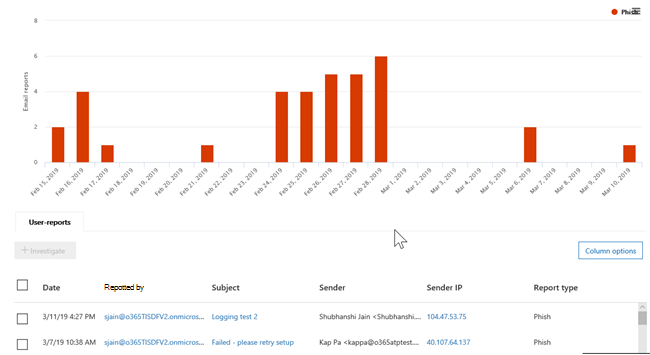

# 脅威エクスプローラーのビューとリアルタイム検出

[!INCLUDE [Microsoft 365 Defender rebranding](../includes/microsoft-defender-for-office.md)]

**適用対象**
- [Microsoft Defender for Office 365 プラン 1 およびプラン 2](defender-for-office-365.md)
- [Microsoft 365 Defender](../defender/microsoft-365-defender.md)

[Threat Explorer](threat-explorer.md) (およびリアルタイム検出レポート) は、セキュリティ運用チームが Microsoft 365 Defender ポータルの脅威を調査して対応するのに役立つ、リアルタイムに近い強力なツールです。 エクスプローラー (およびリアルタイム検出レポート) には、Office 365 の電子メールやファイルのマルウェアやフィッシングの疑いについての情報、および組織に対するその他のセキュリティ上の脅威やリスクが表示されます。

- Microsoft Defender for [Office 365](defender-for-office-365.md)プラン 2, you have Explorer.
- Microsoft Defender for Office 365プラン 1 の場合は、リアルタイムの検出があります。

エクスプローラー (またはリアルタイム検出レポート) を初めて開いた場合、既定のビューには過去 7 日間のメール マルウェア検出が表示されます。 このレポートには、セーフ リンクで検出された悪意のある URL や、セーフ[添付](safe-links.md)ファイルによって検出された悪意のあるファイルなど、Microsoft Office 365 Defender による検出セーフ[表示することもできます](safe-attachments.md)。 このレポートは、過去 30 日間のデータを表示Office 365できます。 試用版サブスクリプションには、過去 7 日間のデータだけが含まれます。

****

|サブスクリプション|ユーティリティ|データの日数|
|---|---|---|
|Microsoft Defender for Office 365 P1 試用版|リアルタイムの検出|7 |
|Microsoft Defender for Office 365 P1 有料|リアルタイムの検出|30|
|Microsoft Defender for Office 365 P1 有料テスト Defender for Office 365 P2 試用版|脅威エクスプローラー|7 |
|Microsoft Defender for Office 365 P2 試用版|脅威エクスプローラー|7 |
|Microsoft Defender for Office 365 P2 paid|脅威エクスプローラー|30|
|

> [!NOTE]
> 間もなく、試用版テナントのエクスプローラー (およびリアルタイム検出) のデータ保持と検索の制限を 7 日から 30 日間に延長します。 この変更は、ロードマップ 項目 No. 70544 の一部として追跡され、現在ロールアウト段階にあります。

表示する情報 **を** 変更するには、[表示] メニューを使用します。 ツールヒントは、使用するビューを決定するのに役立ちます。

![[脅威エクスプローラーの表示] メニュー。](../../media/all-email.png)

ビューを選択したら、フィルターを適用してクエリを設定して、さらに分析を実行できます。 以下のセクションでは、エクスプローラーで使用できるさまざまなビュー (またはリアルタイム検出) の概要を示します。

## メール >マルウェア

このレポートを表示するには、エクスプローラー (またはリアルタイムの検出) で、[電子メール マルウェアの表示 **]** \> **を** \> **選択します**。 このビューには、マルウェアが含まれていると識別された電子メール メッセージに関する情報が表示されます。

[送信者 **] を** クリックして、表示オプションの一覧を開きます。 この一覧を使用して、送信者、受信者、送信者ドメイン、件名、検出テクノロジ、保護状態などによってデータを表示します。

たとえば、検出された電子メール メッセージに対して実行されたアクションを確認するには、一覧で [ **保護の状態** ] を選択します。 オプションを選択し、[更新] ボタンをクリックして、そのフィルターをレポートに適用します。

![脅威エクスプローラーの [脅威保護の状態] オプション。](../../media/ThreatExplorerProtectionStatusOptions.png)

グラフの下に、特定のメッセージの詳細を表示します。 リストでアイテムを選択すると、フライアウト ウィンドウが開き、選択したアイテムの詳細を確認できます。

## メール >フィッシング

このレポートを表示するには、エクスプローラー (またはリアルタイムの検出) で、[メール フィッシング **の表示]** \> **を** \> **選択します**。 このビューには、フィッシング詐欺の試みとして識別された電子メール メッセージが表示されます。

[送信者 **] を** クリックして、表示オプションの一覧を開きます。 この一覧を使用して、送信者、受信者、送信者ドメイン、送信者 IP、URL ドメイン、クリックの評決などによってデータを表示します。

たとえば、フィッシング詐欺の試みとして識別された URL をクリックしたユーザーが実行したアクションを確認するには、リストで [Click **verdict]** を選択し、1 つ以上のオプションを選択し、[更新] ボタンをクリックします。

![[フィッシング] レポートの [評決オプション] をクリックします。](../../media/click-verdict.png)

グラフの下に、特定のメッセージ、URL クリック、URL、メール配信元の詳細を表示します。

リスト内のアイテム (検出された URL など) を選択すると、フライアウト ウィンドウが開き、選択したアイテムの詳細を確認できます。

## メール>提出

このレポートを表示するには、エクスプローラー (またはリアルタイムの検出) で、[電子メール送信の表示 **]** \>  \> **を選択します**。 このビューには、ユーザーが迷惑メール、迷惑メール、フィッシングメールとして報告したメールが表示されます。

[送信者 **] を** クリックして、表示オプションの一覧を開きます。 この一覧を使用して、送信者、受信者、レポートの種類 (電子メールが迷惑メール、迷惑メール、フィッシングではないというユーザーの判断) などによって情報を表示します。

たとえば、フィッシング詐欺の試みとして報告された電子メール メッセージに関する情報を表示するには、[送信者レポートの種類] をクリックし、[フィッシング] を選択し、[更新] ボタン \> をクリックします。 

![[レポートの種類] フィルターで選択されているフィッシング。](../../media/ThreatExplorerEmailUserReportedPhishSelected.png)

グラフの下に、件名、送信者の IP アドレス、迷惑メール、迷惑メール、フィッシングなど、メッセージを報告したユーザーなど、特定の電子メール メッセージの詳細を表示します。

リスト内のアイテムを選択して、追加の詳細を表示します。

## メール > すべてのメール

このレポートを表示するには、エクスプローラーで[メールのすべて表示 \> **]** \> **を選択します**。 このビューには、フィッシングやマルウェアによる悪意のあると識別されたメールや、悪意のあるメール以外のすべてのメール (通常のメール、スパム、バルク メール) など、電子メールアクティビティのオールアップ ビューが表示されます。

> [!NOTE]
> [表示するデータが多すぎます **]** というエラーが表示された場合は、フィルターを追加し、必要に応じて表示する日付範囲を絞り込みます。

フィルターを適用するには、[送信者] **を** 選択し、一覧でアイテムを選択し、[更新] ボタンをクリックします。 この例では、検出テクノロジ **を** フィルターとして使用しました (使用可能なオプションは複数あります)。 送信者、送信者のドメイン、受信者、件名、添付ファイル名、マルウェア ファミリ、保護状態 (Office 365 の脅威保護機能とポリシーによって実行されるアクション)、検出テクノロジ (マルウェアの検出方法)などによって情報を表示します。

グラフの下には、件名、受信者、送信者、状態など、特定の電子メール メッセージの詳細が表示されます。

## コンテンツ >マルウェア

このレポートを表示するには、エクスプローラー (またはリアルタイムの検出) で、[コンテンツ マルウェアの表示 **]** \> **を** \> **選択します**。 このビューには[、Microsoft Defender](mdo-for-spo-odb-and-teams.md)によって、オンライン、Office 365、OneDrive for Business、およびSharePointの悪意のあるファイルがMicrosoft Teams。

マルウェア ファミリ、検出テクノロジ (マルウェアの検出方法)、ワークロード (OneDrive、SharePoint、またはTeams)。

グラフの下には、添付ファイルのファイル名、ワークロード、ファイル サイズ、ファイルを最後に変更したユーザーなど、特定のファイルの詳細が表示されます。

## クリックからフィルターへの機能

エクスプローラー (およびリアルタイム検出) を使用すると、クリックでフィルターを適用できます。 凡例内のアイテムをクリックすると、そのアイテムがレポートのフィルターになります。 たとえば、エクスプローラーでマルウェア ビューを見ているとします。

![[脅威管理エクスプローラー] に \> 移動します。](../../media/cab32fa2-66f1-4ad5-bc1d-2bac4dbeb48c.png)

このグラフ **で [ATP の削除]** をクリックすると、次のようなビューが表示されます。

このビューでは、添付ファイルによって削除されたファイルのデータをセーフ[しています](safe-attachments.md)。 グラフの下には、添付ファイルが添付ファイルで検出された特定の電子メール メッセージに関する詳細セーフ表示されます。

1 つ以上のアイテムを選択すると、[アクション] メニューがアクティブ化され、選択したアイテムに対して選択できる複数の選択肢があります。

![アイテムを選択すると、[操作] メニューがアクティブ化されます。](../../media/95f127a4-1b2a-4a76-88b9-096e3ba27d1b.png)

クリックでフィルター処理して特定の詳細に移動する機能によって、脅威の調査に多くの時間を節約できます。

## クエリとフィルター

エクスプローラー (リアルタイム検出レポートと同様に) には、いくつかの強力なフィルターとクエリ機能が備え付け、上位の対象ユーザー、トップ マルウェア ファミリ、検出テクノロジなど、詳細を掘り下ろします。 レポートの種類ごとに、さまざまな方法でデータを表示および探索できます。

> [!IMPORTANT]
> Explorer のクエリ バー (またはリアルタイムの検出) では、アスタリスクや疑問符などのワイルドカード文字を使用しません。 [件名] フィールドで電子メール メッセージを検索すると、エクスプローラー (またはリアルタイム検出) は部分的な照合を実行し、ワイルドカード検索と同様の結果を生成します。
