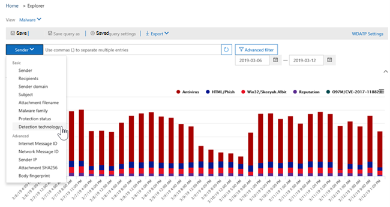

# 脅威エクスプローラーのビューとリアルタイムの検出Views in Threat Explorer and real-time detections

[!INCLUDE [Microsoft 365 Defender rebranding](../includes/microsoft-defender-for-office.md)]

**適用対象****Applies to**
- [Microsoft Defender for Office 365 プラン 1 およびプラン 2Microsoft Defender for Office 365 plan 1 and plan 2](office-365-atp.md)
- [Microsoft 365 DefenderMicrosoft 365 Defender](../mtp/microsoft-threat-protection.md)

[脅威エクスプローラー](threat-explorer.md) (およびリアルタイム検出レポート) は、セキュリティ運用チームがセキュリティ & コンプライアンス センターの脅威を調査して対応するのに役立つ、ほぼリアルタイムの強力なツールです。[Threat Explorer](threat-explorer.md) (and the real-time detections report) is a powerful, near real-time tool to help Security Operations teams investigate and respond to threats in the Security & Compliance Center. エクスプローラー (およびリアルタイム検出レポート) には、Office 365 のメールやファイル内のマルウェアとフィッシングの疑いがある情報、および組織に対するその他のセキュリティの脅威とリスクが表示されます。Explorer (and the real-time detections report) displays information about suspected malware and phish in email and files in Office 365, as well as other security threats and risks to your organization.

- [Microsoft Defender for Office 365](office-365-atp.md)プラン 2 をお持ちのお客様は、エクスプローラーをご利用ください。If you have [Microsoft Defender for Office 365](office-365-atp.md) Plan 2, then you have Explorer.
- Microsoft Defender for Office 365 プラン 1 を使用している場合は、リアルタイムで検出されます。If you have Microsoft Defender for Office 365 Plan 1, then you have real-time detections.

エクスプローラー (またはリアルタイム検出レポート) を初めて開いた場合、既定のビューには過去 7 日間のメール マルウェア検出が表示されます。When you first open Explorer (or the real-time detections report), the default view shows email malware detections for the past 7 days. このレポートでは、安全なリンクによって検出された悪意のある URL や、安全な添付ファイルによって検出された悪意のあるファイルなど、Office 365 の検出に関する Microsoft Defender を[表示](atp-safe-attachments.md)することもできます。This report can also show Microsoft Defender for Office 365 detections, such as malicious URLs detected by [Safe Links](atp-safe-links.md), and malicious files detected by [Safe Attachments](atp-safe-attachments.md). このレポートは、過去 30 日間のデータを表示するために変更できます (Microsoft Defender Office 365 P2 有料サブスクリプションを使用)。This report can be modified to show data for the past 30 days (with a Microsoft Defender for Office 365 P2 paid subscription). 試用版サブスクリプションには、過去 7 日間のデータだけが含まれます。Trial subscriptions will include data for the past seven days only.

****

|サブスクリプションSubscription|ユーティリティUtility|データの日数Days of Data|
|---|---|---|
|Microsoft Defender for Office 365 P1 試用版Microsoft Defender for Office 365 P1 trial|リアルタイムの検出Real-time detections|7 7|
|Microsoft Defender for Office 365 P1 (有料)Microsoft Defender for Office 365 P1 paid|リアルタイムの検出Real-time detections|3030|
|Microsoft Defender for Office 365 P1 有料テスト Defender for Office 365 P2 試用版Microsoft Defender for Office 365 P1 paid testing Defender for Office 365 P2 trial|脅威エクスプローラーThreat Explorer|7 7|
|Microsoft Defender for Office 365 P2 試用版Microsoft Defender for Office 365 P2 trial|脅威エクスプローラーThreat Explorer|7 7|
|Microsoft Defender for Office 365 P2 (有料)Microsoft Defender for Office 365 P2 paid|脅威エクスプローラーThreat Explorer|3030|
|

表示される情報 **を変更** するには、[表示] メニューを使用します。Use the **View** menu to change what information is displayed. ツールヒントは、使用するビューを決定するのに役立ちます。Tooltips help you determine which view to use.

![脅威エクスプローラーの [表示] メニュー](../../media/ThreatExplorerViewMenu.png)

ビューを選択したら、フィルターを適用し、クエリを設定して詳細な分析を実行できます。Once you have selected a view, you can apply filters and set up queries to conduct further analysis. 以下のセクションでは、エクスプローラーで使用できるさまざまなビュー (またはリアルタイムの検出) の概要について説明します。The following sections provide a brief overview of the various views available in Explorer (or real-time detections).

## 電子メール>マルウェアEmail > Malware

このレポートを表示するには、エクスプローラー (またはリアルタイムの検出) で、[ **メール** マルウェアの表示] \> **を選択** \> **します**。To view this report, in Explorer (or real-time detections), choose **View** \> **Email** \> **Malware**. このビューには、マルウェアが含まれていると識別された電子メール メッセージに関する情報が表示されます。This view shows information about email messages that were identified as containing malware.

[ **送信者] を** クリックして、表示オプションの一覧を開きます。Click **Sender** to open your list of viewing options. この一覧を使用して、送信者、受信者、送信者ドメイン、件名、検出テクノロジ、保護状態などによってデータを表示します。Use this list to view data by sender, recipients, sender domain, subject, detection technology, protection status, and more.

たとえば、検出された電子メール メッセージに対して実行されたアクションを確認するには、一覧で **[保護の状態** ] を選択します。For example, to see what actions were taken on detected email messages, choose **Protection status** in the list. オプションを選択し、[最新の情報に更新] ボタンをクリックして、そのフィルターをレポートに適用します。Select an option, and then click the Refresh button to apply that filter to your report.

グラフの下に、特定のメッセージの詳細を表示します。Below the chart, view more details about specific messages. 一覧で項目を選択すると、選択した項目の詳細を確認できるフライアウト ウィンドウが開きます。When you select an item in the list, a fly-out pane opens, where you can learn more about the item you selected.

## メール>フィッシングEmail > Phish

このレポートを表示するには、エクスプローラー (またはリアルタイムの検出) で、[ **メール** フィッシングの表示] \> **を** \> **選択します**。To view this report, in Explorer (or real-time detections), choose **View** \> **Email** \> **Phish**. このビューには、フィッシングの試行として識別された電子メール メッセージが表示されます。This view shows email messages identified as phishing attempts.

[ **送信者] を** クリックして、表示オプションの一覧を開きます。Click **Sender** to open your list of viewing options. この一覧を使用して、送信者、受信者、送信者ドメイン、送信者 IP、URL ドメイン、クリックの確認などによってデータを表示します。Use this list to view data by sender, recipients, sender domain, sender IP, URL domain, click verdict, and more.

たとえば、フィッシングの試行として識別された URL をユーザーがクリックした場合に実行されたアクションを確認するには、一覧で [クリックの確認] を選択し、1 つ以上のオプションを選択して、[最新の情報に更新] ボタンをクリックします。For example, to see what actions were taken when people clicked on URLs that were identified as phishing attempts, choose **Click verdict** in the list, select one or more options, and then click the Refresh button.

![フィッシング レポートの [確認オプション] をクリックする](../../media/ThreatExplorerEmailPhishClickVerdictOptions.png)

グラフの下に、特定のメッセージ、URL のクリック、URL、メールの配信元に関する詳細が表示されます。Below the chart, view more details about specific messages, URL clicks, URLs, and email origin.

検出された URL など、リスト内の項目を選択すると、選択した項目の詳細を確認できるフライアウト ウィンドウが開きます。When you select an item in the list, such as a URL that was detected, a fly-out pane opens, where you can learn more about the item you selected.

## メール>提出Email > Submissions

このレポートを表示するには、エクスプローラー (またはリアルタイムの検出) で、[メール送信の表示] \>  \> **を選択します**。To view this report, in Explorer (or real-time detections), choose **View** \> **Email** \> **Submissions**. このビューには、ユーザーが迷惑メール、迷惑メール、フィッシングメールとして報告したメールが表示されます。This view shows email that users have reported as junk, not junk, or phishing email.

[ **送信者] を** クリックして、表示オプションの一覧を開きます。Click **Sender** to open your list of viewing options. この一覧を使用して、送信者、受信者、レポートの種類 (メールが迷惑メール、迷惑メール、フィッシングメールではないというユーザーの判断) 別に情報を表示できます。Use this list to view information by sender, recipients, report type (the user's determination that the email was junk, not junk, or phish), and more.

たとえば、フィッシング詐欺として報告されたメール メッセージに関する情報を表示するには、[**送信者** レポートの種類] をクリックし、[フィッシング] を選択して、[更新] ボタンを \> クリックします。 For example, to view information about email messages that were reported as phishing attempts, click **Sender** \> **Report type**, select **Phish**, and then click the Refresh button.

![[レポートの種類] フィルターで選択されたフィッシング](../../media/ThreatExplorerEmailUserReportedPhishSelected.png)

グラフの下に、件名、送信者の IP アドレス、迷惑メール、迷惑メールではないメッセージ、フィッシングなどのメッセージを報告したユーザーなど、特定の電子メール メッセージに関する詳細が表示されます。Below the chart, view more details about specific email messages, such as subject line, the sender's IP address, the user that reported the message as junk, not junk, or phish, and more.

リスト内の項目を選択して、追加の詳細を表示します。Select an item in the list to view additional details.

## メール >すべてのメールEmail > All email

このレポートを表示するには、エクスプローラーで[メールすべて表示 \> **]** \> **を選択します**。To view this report, in Explorer, choose **View** \> **Email** \> **All mail**. このビューには、フィッシングやマルウェアによる悪意のあるメールと識別されたメールや、悪意のあるメール以外のすべてのメール (通常のメール、スパム、バルク メール) など、メール アクティビティの全ビューが表示されます。This views shows an all-up view of email activity, including email identified as malicious due to phishing or malware, as well all non-malicious mail (normal email, spam, and bulk mail).

> [!NOTE]
> 表示するデータが多すぎるというエラーが発生した場合は、フィルターを追加し、必要に応じて表示する日付範囲を絞り込みます。If you get an error that reads **Too much data to display**, add a filter and, if necessary, narrow the date range you're viewing.

フィルターを適用するには、[ **送信者**] を選択し、一覧からアイテムを選択して、[更新] ボタンをクリックします。To apply a filter, choose **Sender**, select an item in the list, and then click the Refresh button. この例では、検出テクノロジ **を** フィルターとして使用しました (使用可能なオプションは複数あります)。In our example, we used **Detection technology** as a filter (there are several options available). 送信者、送信者のドメイン、受信者、件名、添付ファイル名、マルウェア ファミリ、保護の状態 (Office 365 の脅威保護機能とポリシーによって実行されるアクション)、検出テクノロジ (マルウェアの検出方法)、その他別に情報を表示します。View information by sender, sender's domain, recipients, subject, attachment filename, malware family, protection status (actions taken by your threat protection features and policies in Office 365), detection technology (how the malware was detected), and more.

グラフの下に、件名、受信者、送信者、状態など、特定の電子メール メッセージの詳細が表示されます。Below the chart, view more details about specific email messages, such as subject line, recipient, sender, status, and so on.

## コンテンツ >マルウェアContent > Malware

このレポートを表示するには、エクスプローラー (またはリアルタイムの検出) で、[コンテンツ **マルウェアの** 表示] \> **を選択** \> **します**。To view this report, in Explorer (or real-time detections), choose **View** \> **Content** \> **Malware**. このビューには [、SharePoint Online、OneDrive for Business、Microsoft Teams で Office 365](atp-for-spo-odb-and-teams.md)の Microsoft Defender によって悪意のあるファイルとして識別されたファイルが表示されます。This view shows files that were identified as malicious by [Microsoft Defender for Office 365 in SharePoint Online, OneDrive for Business, and Microsoft Teams](atp-for-spo-odb-and-teams.md).

マルウェア ファミリ、検出テクノロジ (マルウェアの検出方法)、ワークロード (OneDrive、SharePoint、または Teams) で情報を表示します。View information by malware family, detection technology (how the malware was detected), and workload (OneDrive, SharePoint, or Teams).

グラフの下に、添付ファイルのファイル名、ワークロード、ファイル サイズ、ファイルを最後に変更したユーザーなど、特定のファイルに関する詳細が表示されます。Below the chart, view more details about specific files, such as attachment filename, workload, file size, who last modified the file, and more.

## クリックしてフィルター処理を行う機能Click-to-filter capabilities

エクスプローラー (およびリアルタイムの検出) を使用すると、クリックでフィルターを適用できます。With Explorer (and real-time detections), you can apply a filter in a click. 凡例内の項目をクリックすると、その項目がレポートのフィルターになります。Click an item in the legend, and that item becomes a filter for the report. たとえば、エクスプローラーの [マルウェア] ビューを見ているとします。For example, suppose we are looking at the Malware view in Explorer:

このグラフ **で ATP 分析** をクリックすると、次のようなビューが表示されます。Clicking **ATP Detonation** in this chart results in a view like this:

このビューでは、安全な添付ファイルによって分析されたファイルのデータ [を確認しています](atp-safe-attachments.md)。In this view, we are now looking at data for files that were detonated by [Safe Attachments](atp-safe-attachments.md). グラフの下に、安全な添付ファイルで検出された添付ファイルを含む特定の電子メール メッセージに関する詳細が表示されます。Below the chart, we can see details about specific email messages that had attachments that were detected by Safe Attachments.

1 つ以上の項目を選択すると、[操作] メニューがアクティブ化され、選択した項目に対して選択できる複数の選択肢が表示されます。Selecting one or more items activates the **Actions** menu, which offers several choices from which to choose for the selected item(s).

![項目を選択すると 、[操作] メニューがアクティブ化されます。](../../media/95f127a4-1b2a-4a76-88b9-096e3ba27d1b.png)

クリックでフィルター処理し、特定の詳細に移動する機能によって、脅威の調査に多くの時間を節約できます。The ability to filter in a click and navigate to specific details can save you a lot of time in investigating threats.

## クエリとフィルターQueries and filters

エクスプローラー (リアルタイム検出レポートと同様に) には、いくつかの強力なフィルター機能とクエリ機能があります。この機能を使用すると、上位の対象ユーザー、上位マルウェア ファミリ、検出テクノロジなど、詳細を確認できます。Explorer (as well as the real-time detections report) has several powerful filters and querying capabilities that enable you to drill into details, such as top targeted users, top malware families, detection technology and more. レポートの種類ごとに、データを表示および探索するさまざまな方法が用意されています。Each kind of report offers a variety of ways to view and explore data.

> [!IMPORTANT]
> エクスプローラーのクエリ バーでは、アスタリスクや疑問符などのワイルドカード文字を使用しません (またはリアルタイム検出)。Do not use wildcard characters, such as an asterisk or a question mark, in the query bar for Explorer (or real-time detections). 電子メール メッセージの **[件名** ] フィールドを検索すると、エクスプローラー (またはリアルタイムの検出) は部分的な一致を実行し、ワイルドカード検索のような結果を生成します。When you search on the **Subject field** for email messages, Explorer (or real-time detections) will perform partial matching and yield results similar to a wildcard search.
