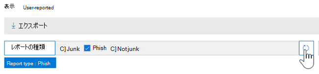

# 脅威エクスプローラーとリアルタイムの検出のビュー

[!INCLUDE [Microsoft 365 Defender rebranding](../includes/microsoft-defender-for-office.md)]

**適用対象**
- [Microsoft Defender for Office 365 プラン 1 およびプラン 2](defender-for-office-365.md)
- [Microsoft 365 Defender](../defender/microsoft-365-defender.md)

:::image type="content" source="../../media/explorer.png" alt-text="[脅威エクスプローラー] ページ" lightbox="../../media/explorer.png":::

[脅威エクスプローラー](threat-explorer.md) (およびリアルタイム検出レポート) は、セキュリティ運用チームがMicrosoft 365 Defender ポータルで脅威を調査して対応するのに役立つ強力でほぼリアルタイムのツールです。 エクスプローラー (およびリアルタイム検出レポート) には、Office 365内の電子メールやファイル内のマルウェアやフィッシングの疑いについての情報のほか、組織に対するその他のセキュリティ上の脅威やリスクが表示されます。

- プラン 2 [をMicrosoft Defender for Office 365](defender-for-office-365.md)している場合は、エクスプローラーを使用します。
- プラン 1 Microsoft Defender for Office 365がある場合は、リアルタイムの検出が行われます。

エクスプローラー (またはリアルタイム検出レポート) を初めて開いたとき、既定のビューには過去 7 日間のメール マルウェア検出が表示されます。 このレポートには、[安全なリンク](safe-links.md)によって検出された悪意のある URL や[添付ファイル保護](safe-attachments.md)によって検出された悪意のあるファイルなど、Microsoft Defender for Office 365 の検出結果も表示されます。 このレポートは、過去 30 日間のデータを表示するように変更できます (Microsoft Defender for Office 365 P2 有料サブスクリプションを使用した場合)。 試用版サブスクリプションには、過去 7 日間のデータのみが表示されます。

|サブスクリプション|ユーティリティ|データの日数|
|---|---|---|
|Microsoft Defender for Office 365 P1 試用版|リアルタイムの検出|7 |
|支払Microsoft Defender for Office 365 P1|リアルタイムの検出|30|
|P1 有料テストDefender for Office 365 P2 試用版をMicrosoft Defender for Office 365する|脅威エクスプローラー|7 |
|Microsoft Defender for Office 365 P2 試用版|脅威エクスプローラー|7 |
|支払Microsoft Defender for Office 365 P2|脅威エクスプローラー|30|

> [!NOTE]
> まもなく、試用版テナントのエクスプローラー (およびリアルタイム検出) データの保有期間と検索の制限を 7 日から 30 日に延長します。 この変更はロードマップ項目番号 70544 の一部として追跡されており、現在ロールアウト段階にあります。

**[表示]** メニューを使用して、表示される情報を変更します。 ツールヒントは、使用するビューを決定するのに役立ちます。

:::image type="content" source="../../media/all-email.png" alt-text="[脅威エクスプローラービュー] メニュー" lightbox="../../media/all-email.png":::

ビューを選択したら、フィルターを適用し、クエリを設定して、追加の分析を行うことができます。 以降のセクションでは、エクスプローラーで使用できるさまざまなビュー (またはリアルタイム検出) の概要について簡単に説明します。

## 電子メール > マルウェア

このレポートを表示するには、エクスプローラー (またはリアルタイム検出) で [**電子メール** \> **マルウェア** の **表示**\>] を選択します。 このビューには、マルウェアが含まれていると識別された電子メール メッセージに関する情報が表示されます。

:::image type="content" source="../../media/detection-technology.png" alt-text="マルウェアとして識別された電子メールに関するデータを表示する" lightbox="../../media/detection-technology.png":::

[ **送信者]** をクリックして、表示オプションの一覧を開きます。 この一覧を使用して、送信者、受信者、送信者ドメイン、件名、検出テクノロジ、保護状態などのデータを表示します。

たとえば、検出された電子メール メッセージに対して実行されたアクションを確認するには、一覧で [ **保護の状態** ] を選択します。 オプションを選択し、[更新] ボタンをクリックして、そのフィルターをレポートに適用します。

:::image type="content" source="../../media/ThreatExplorerProtectionStatusOptions.png" alt-text="脅威エクスプローラーの [脅威の保護の状態] オプション" lightbox="../../media/ThreatExplorerProtectionStatusOptions.png":::

グラフの下に、特定のメッセージの詳細を表示します。 一覧で項目を選択すると、ポップアップ ウィンドウが開き、選択したアイテムの詳細を確認できます。

:::image type="content" source="../../media/ThreatExplorerMalwareItemSelectedFlyout.png" alt-text="ポップアップが開かれた脅威エクスプローラー" lightbox="../../media/ThreatExplorerMalwareItemSelectedFlyout.png":::

## メール > フィッシング

このレポートを表示するには、エクスプローラー (またはリアルタイム検出) で [**電子メール** \> フィッシングの **表示**\>] を選択 **します**。 このビューには、フィッシングの試行として識別された電子メール メッセージが表示されます。

:::image type="content" source="../../media/phish.png" alt-text="フィッシング詐欺の試行として識別された電子メールに関するデータを表示する" lightbox="../../media/phish.png":::

[ **送信者]** をクリックして、表示オプションの一覧を開きます。 この一覧を使用して、送信者、受信者、送信者ドメイン、送信者 IP、URL ドメイン別にデータを表示し、判定をクリックします。

たとえば、ユーザーがフィッシング詐欺の試行として識別された URL をクリックしたときに実行されたアクションを確認するには、一覧で **[Click verdict** ] を選択し、1 つ以上のオプションを選択して、[更新] ボタンをクリックします。

:::image type="content" source="../../media/click-verdict.png" alt-text="フィッシング レポートのクリック判定オプション" lightbox="../../media/click-verdict.png":::

グラフの下には、特定のメッセージ、URL のクリック、URL、メール配信元の詳細が表示されます。

:::image type="content" source="../../media/ThreatExplorerEmailPhishURLs.png" alt-text="電子メール メッセージでフィッシングとして検出された URL" lightbox="../../media/ThreatExplorerEmailPhishURLs.png":::

検出された URL など、リスト内の項目を選択すると、ポップアップ ウィンドウが開き、選択したアイテムの詳細を確認できます。

:::image type="content" source="../../media/ThreatExplorerEmailPhishURLDetails.png" alt-text="検出された URL に関する詳細" lightbox="../../media/ThreatExplorerEmailPhishURLDetails.png":::

## 電子メール >申請

このレポートを表示するには、エクスプローラー (またはリアルタイム検出) で [**電子メール**\>送信の **表示**\>] を選択 **します**。 このビューには、迷惑メールやフィッシングメールではなく、ユーザーが迷惑メールとして報告したメールが表示されます。

:::image type="content" source="../../media/ThreatExplorerEmailUserReportedViewOptions.png" alt-text="ユーザーによって報告された電子メール メッセージ" lightbox="../../media/ThreatExplorerEmailUserReportedViewOptions.png":::

[ **送信者]** をクリックして、表示オプションの一覧を開きます。 この一覧を使用して、送信者、受信者、レポートの種類 (迷惑メール、迷惑メール、フィッシングではないというユーザーの判断) などの情報を表示します。

たとえば、フィッシング詐欺の試行として報告された電子メール メッセージに関する情報を表示するには、[ **送信者** \> **レポートの種類**] をクリックし、[ **フィッシング**] を選択して、[更新] ボタンをクリックします。

グラフの下には、件名行、送信者の IP アドレス、迷惑メールではなく迷惑メール、フィッシングとしてメッセージを報告したユーザーなど、特定の電子メール メッセージの詳細が表示されます。

:::image type="content" source="../../media/ThreatExplorerEmailPhishUserReportedPhishDetails.png" alt-text="フィッシング詐欺の試行として報告されたメッセージ" lightbox="../../media/ThreatExplorerEmailPhishUserReportedPhishDetails.png":::

追加の詳細を表示するには、一覧で項目を選択します。

## メール > すべてのメール

このレポートを表示するには、エクスプローラーで [**すべてのメールメール**\>の **表示**\>] を選択 **します**。 このビューには、フィッシングやマルウェアが原因で悪意があると識別されたメールや、悪意のないメール (通常のメール、スパム、バルク メール) をすべて含む、電子メール アクティビティの概要が表示されます。

> [!NOTE]
> **表示するデータが多すぎる** というエラーが発生した場合は、フィルターを追加し、必要に応じて表示する日付範囲を絞り込みます。

フィルターを適用するには、[ **送信者**] を選択し、一覧で項目を選択して、[更新] ボタンをクリックします。 この例では、 **検出テクノロジ** をフィルターとして使用しました (使用可能なオプションがいくつかあります)。 送信者、送信者のドメイン、受信者、件名、添付ファイル名、マルウェア ファミリ、保護状態 (Office 365の脅威保護機能とポリシーによって実行されたアクション)、検出テクノロジ (マルウェアの検出方法) などの情報を表示します。

:::image type="content" source="../../media/0c032eb3-6021-4174-9f06-ff8f30c245ca.png" alt-text="検出テクノロジによって検出された電子メールに関するデータを表示する" lightbox="../../media/0c032eb3-6021-4174-9f06-ff8f30c245ca.png":::

グラフの下には、件名、受信者、送信者、状態など、特定の電子メール メッセージの詳細が表示されます。

## コンテンツ > マルウェア

このレポートを表示するには、エクスプローラー (またはリアルタイム検出) で [**コンテンツ** \> **マルウェア** の **表示**\>] を選択します。 このビューには、[SharePoint Online、OneDrive for Business、Microsoft TeamsのMicrosoft Defender for Office 365](mdo-for-spo-odb-and-teams.md)によって悪意のあるファイルとして識別されたファイルが表示されます。

マルウェア ファミリ、検出テクノロジ (マルウェアが検出された方法)、ワークロード (OneDrive、SharePoint、またはTeams) で情報を表示します。

:::image type="content" source="../../media/malware-family.png" alt-text="検出されたマルウェアに関するデータの表示" lightbox="../../media/malware-family.png":::

グラフの下には、添付ファイルのファイル名、ワークロード、ファイル サイズ、ファイルを最後に変更したユーザーなど、特定のファイルの詳細が表示されます。

## クリックしてフィルター処理する機能

エクスプローラー (およびリアルタイム検出) を使用すると、クリックでフィルターを適用できます。 凡例内のアイテムをクリックすると、そのアイテムがレポートのフィルターになります。 たとえば、エクスプローラーの [マルウェア] ビューを見ているとします。

:::image type="content" source="../../media/cab32fa2-66f1-4ad5-bc1d-2bac4dbeb48c.png" alt-text="セキュリティ & コンプライアンス ポータルの [エクスプローラー] ページ" lightbox="../../media/cab32fa2-66f1-4ad5-bc1d-2bac4dbeb48c.png":::

このグラフで **ATP デトネーション** をクリックすると、次のようなビューが表示されます。

:::image type="content" source="../../media/7241d7dd-27bc-467d-9db8-6e806c49df14.png" alt-text="デトネーションの結果のみを表示するようにフィルター処理されたエクスプローラー Defender for Office 365" lightbox="../../media/7241d7dd-27bc-467d-9db8-6e806c49df14.png":::

このビューでは、[添付ファイルのセーフ](safe-attachments.md)によってデトネーションされたファイルのデータを見ています。 グラフの下には、セーフ添付ファイルによって検出された添付ファイルを含む特定の電子メール メッセージの詳細が表示されます。

:::image type="content" source="../../media/c91fb05c-d1d4-4085-acc6-f7008a415c2a.png" alt-text="検出された添付ファイルを含む電子メール メッセージに関する具体的な詳細" lightbox="../../media/c91fb05c-d1d4-4085-acc6-f7008a415c2a.png":::

1 つ以上の項目を選択すると **、[アクション]** メニューがアクティブ化され、選択した項目に対して選択できる選択肢がいくつか用意されています。

:::image type="content" source="../../media/95f127a4-1b2a-4a76-88b9-096e3ba27d1b.png" alt-text="[アクション] メニューをアクティブにする項目を選択するプロセス" lightbox="../../media/95f127a4-1b2a-4a76-88b9-096e3ba27d1b.png":::

クリックでフィルター処理し、特定の詳細に移動する機能により、脅威の調査に多くの時間を節約できます。

## クエリとフィルター

エクスプローラー (リアルタイム検出レポートと同様) には、強力なフィルターとクエリ機能がいくつか用意されており、ターゲットユーザーの上位、マルウェアの上位ファミリ、検出テクノロジなど、詳細を掘り下げます。 レポートの種類ごとに、データを表示および探索するためのさまざまな方法が用意されています。

> [!IMPORTANT]
> エクスプローラー (またはリアルタイム検出) のクエリ バーで、アスタリスクや疑問符などのワイルドカード文字を使用しないでください。 **[件名] フィールド** で電子メール メッセージを検索すると、エクスプローラー (またはリアルタイム検出) で部分一致が実行され、ワイルドカード検索と同様の結果が得られます。
