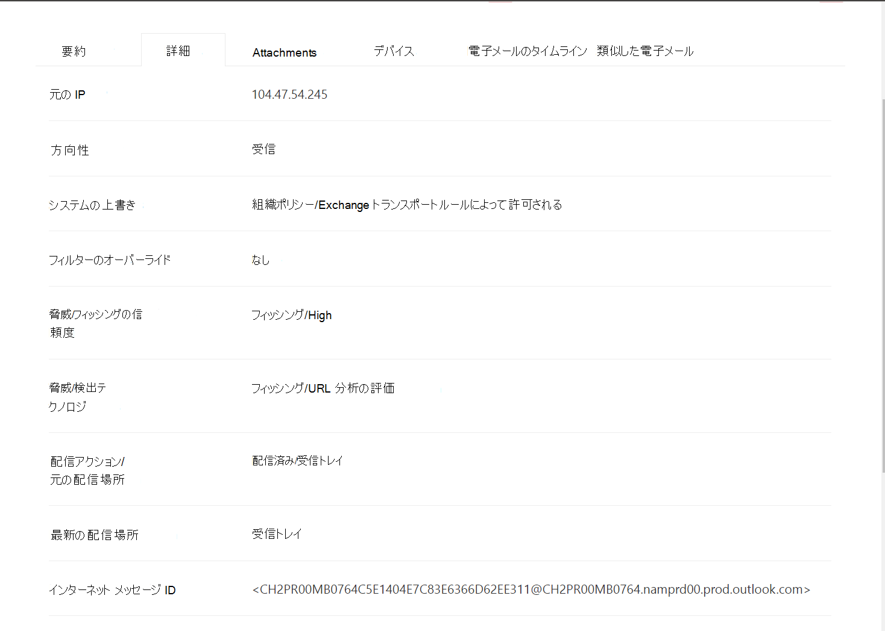

# 脅威エクスプローラーとリアルタイム検出

組織が [Microsoft Defender For Office 365](office-365-atp.md)を所有していて、 [必要なアクセス許可](#required-licenses-and-permissions)を持っている場合は、 **Explorer** または **リアルタイムの検出** (以前の *リアルタイムのレポート* - [新機能を参照してください](#new-features-in-threat-explorer-and-real-time-detections)) があります。 [セキュリティ & コンプライアンスセンター] で、[ **脅威の管理** ] に移動してから、[ **エクスプローラー** ] _または_ [ **リアルタイムの検出** ] を選択します。

|Microsoft Defender for Office 365 プラン2については、以下を参照してください。|Microsoft Defender for Office 365 プラン1を使用すると、次のように表示されることがあります。|
|---|---|
|||
|

エクスプローラー (リアルタイム検出) を使用すると、強力なレポートが得られます。これにより、セキュリティ運用チームは脅威を調査して効果的かつ効率的に対処することができます。 このレポートは次のようになります。

![[脅威管理エクスプローラー] に移動します。 \>](../../media/cab32fa2-66f1-4ad5-bc1d-2bac4dbeb48c.png)

このレポートでは、次のことができます。

- [Microsoft 365 セキュリティ機能によって検出されたマルウェアを参照](#see-malware-detected-in-email-by-technology)
- [フィッシング Url に関するデータを表示し、[verdict] をクリックします。](#view-data-about-phishing-urls-and-click-verdict)
- [エクスプローラーのビューから自動化された調査と応答プロセスを開始](#start-automated-investigation-and-response) する (Defender for Office 365 プラン2のみ)
- ...[悪意のある電子メールの調査など](#more-ways-to-use-explorer-or-real-time-detections)

## 脅威エクスプローラーおよびリアルタイム検出の機能が向上しました。

### 脅威エクスプローラーのタグ

> [!NOTE]
> ユーザータグ機能はプレビューでは、すべてのユーザーが利用できるわけではなく、変更される可能性があります。 リリーススケジュールの詳細については、Microsoft 365 ロードマップをご覧ください。

ユーザータグとは、Office 365 の Microsoft Defender で特定のユーザーグループの識別子です。 タグの詳細については、「 [ユーザータグ](user-tags.md)」を参照してください。

脅威エクスプローラーでは、次のような場合に、ユーザータグに関する情報を確認できます。

#### メールグリッドビュー

[電子メール] グリッドに表示される [タグ] 列には、送信者または受信者のメールボックスに適用されているすべてのタグが含まれています。 既定では、優先度のアカウントなどのシステムタグが最初に表示されます。

> [!div class="mx-imgBorder"]
> 

#### フィルター処理

これで、優先度の高いアカウント、または特定のユーザータグシナリオにわたってタグが表示されるようになりました。また、この環境の一部として特定のタグを含む結果を除外することもできます。 このような他の複数のフィルターを組み合わせて使用することで、調査の範囲を絞ることができます。

[ のフィルター](../../media/tags-filter-normal.png#lightbox)

> [!div class="mx-imgBorder"]
> 

#### 電子メール詳細ポップアップ
送信者と受信者の個々のタグを表示するには、件名をクリックします。 メッセージ詳細のポップアップを開きます。 [概要] タブでは、送信者と受信者のタグが電子メールに指定されている場合は個別に表示されます。
送信者と受信者の個々のタグに関する情報は、エクスポートされた CSV にも拡張されており、これらの詳細を2つの別個の列に表示できます。

> [!div class="mx-imgBorder"]
> 

タグ情報は、URL クリックのポップアップにも表示されます。 URL クリックのポップアップを表示するには、フィッシングまたは [すべての電子メール] ビューに移動し、[url] または [URL] をクリックする必要があります。個々の URL ポップアップをクリックすると、その URL のクリックに関する詳細が表示され、そのクリックに関連付けられたタグが作成されます。

> [!div class="mx-imgBorder"]
> 

## 脅威の探し方の向上 (近日予定)

### 電子メールの脅威情報の更新

メールレコードのデータの正確性と一貫性を向上させるために、プラットフォームとデータ品質の向上に重点を置いています。 これらの更新のセットには、配信前および配布後の情報 (ZAP プロセスの一部として実行されるアクションの例) が、スパム verdict、エンティティレベルの脅威 (悪意のある URL など)、および最新の配信場所と共に1つのレコードに統合されています。

これらの更新プログラムを適用すると、メッセージに対して実行されたさまざまな配信後イベントに関係なく、各メッセージに対して1つのエントリが表示されます。 アクションには、ZAP、手動による修復 (管理者のアクションを意味する)、動的配信などが含まれます。

マルウェアとフィッシングの脅威を示すだけでなく、電子メールに関連付けられているスパム verdict を表示できるようになりました。 電子メール内では、電子メールに関連付けられているすべての脅威と対応する検出テクノロジが表示されます。 各電子メールには、0、1、または複数の脅威を含めることができます。 現在の脅威が、電子メールのポップアップの [詳細] セクションに表示されます。 さらに、複数の脅威 (マルウェアとフィッシングの両方を持つ電子メールなど) については、検出技術フィールドは Threat-Detection マッピングを提供します。つまり、どの検出技術が脅威の識別につながったかを示します。

検出テクノロジのセットは、新しい検出方法、スパム検出テクノロジ、およびあらゆる種類の電子メールビュー (マルウェア、フィッシング、すべての電子メール) にわたって更新されました。結果をフィルター処理するには、同じ一貫性のある検出テクノロジを使用してください。

> [!NOTE]
> Verdict 分析は、必ずしもエンティティに関連付けられているとは限りません。 例として、電子メールがフィッシングまたはスパムとして分類される場合がありますが、フィッシング/スパム verdict がスタンプされている Url はありません。 これは、フィルターによって、verdict を割り当てる前に、電子メールのコンテンツやその他の詳細を評価するからです。

#### Url での脅威

[電子メール] ポップアップ-> Details] タブでは、URL に関する特定の脅威を表示できるようになりました (URL がマルウェア、フィッシング、スパム、または None になる可能性があります)。

> [!div class="mx-imgBorder"]
> 

### タイムラインビューが更新されました (予定あり)

> [!div class="mx-imgBorder"]
> 

すべての配信イベントと配信後イベントを識別するだけでなく、タイムラインビューには、その時点で識別された、これらのイベントのサブセットがある脅威に関する情報も表示されます。 また、その操作の結果と共に、追加のアクション (ZAP、手動による修復など) に関する情報も提供します。 [タイムライン] ビューには、元の配信に関する情報と、その後、電子メールに対して実行された配信後イベントが含まれます。

- ソース: イベントのソースに基づいて、管理/システム/ユーザーになることができます。
- イベント: これには、元の配信、手動による修復、ZAP、送信、動的配信などの最上位レベルのイベントが含まれます。
- アクション: ZAP または管理操作 (たとえば、ソフト削除) の一部として実行された特定のアクションについて説明します。
- 脅威: その時点で特定された脅威 (マルウェア、フィッシング、スパム) について説明します。
- 結果/詳細: アクションの結果に関する詳細情報を、ZAP/管理アクションの一部として実行されたかどうかについて説明します。

### 元の配信場所と最新の配信場所

今日では、電子メールのグリッドとメールのポップアップに、配信場所を公開しています。 今後は、配信場所フィールドの名前が元の配信場所に変更されます。 さらに、最新の配信場所と呼ばれる別のフィールドも導入しています。

元の配信場所には、最初にメールが配信された場所に関する詳細情報が提供されます。 最新の配信場所には、ZAP または [ **削除済みアイテムに移動する** などの管理者アクションのようなシステムアクションの後にメールが追加される場所が含まれます。 最新の配信場所は、メッセージの最後の既知の場所の配信後、またはシステムまたは管理アクションを管理者に通知することを目的としています。 設計上、電子メールにはエンドユーザー関連のアクションは含まれません。 たとえば、ユーザーがメッセージを削除したり、メッセージをアーカイブ/pst に移動したりした場合、メッセージ "配信" の場所は更新されません。 ただし、システムアクションによって場所が更新された場合 (たとえば、電子メールの検疫の移動中に ZAP が発生した場合)、最新の配信場所が検疫として表示されます。

> [!div class="mx-imgBorder"]
> 

> [!NOTE]
> 配信場所と配信アクションが値として ' Unknown ' を表示する場合があります。
>
> - 配信場所が配信され、配信場所が不明として表示される場合があります。 これはメッセージが配信されたときに、受信トレイルールによって、受信トレイまたは迷惑メールフォルダーではなく、既定のフォルダー (下書き、アーカイブなど) にメッセージが移動されたときに発生します。
>
> - 管理者/システムアクション (ZAP、管理アクションなど) が試行されても、メッセージが見つからない場合、最新の配信場所が不明になることがあります。 通常、このアクションは、ユーザーがメッセージを移動または削除した後に発生します。 そのような場合は、タイムラインビューの [結果/詳細] 列を確認します。 メッセージ: ユーザーによって移動または削除されたメッセージを探します。

> [!div class="mx-imgBorder"]
> 

### 追加のアクション

追加のアクションは、電子メールの配信を投稿した後のアクションによって構成されます。また、ZAP、手動による修復 (管理者によって実行されたアクションなど)、動的配信、および再処理 (メールが遡及的に有効として検出された場合) を含むことができます。

> [!NOTE]
>
> - この変更の一環として、配信アクションフィルターに現在表示されていた削除済みの ZAP 値が消えることがあります。 追加のアクションを通じて、ZAP によるすべての電子メールを検索する方法が用意されています。
>
> - 検出テクノロジとその他のアクションについては、新しいフィールドと値が追加されています (特に ZAP シナリオの場合)。 既存の保存済みのクエリと追跡されたクエリを評価して、新しい値で動作することを確認します。

> [!div class="mx-imgBorder"]
> 

### システムの上書き

システムのオーバーライドは、システムによって提供される配信場所 (フィルター処理スタックによって識別された脅威やその他の検出に基づいて) をオーバーライドすることによって、メッセージの目的の配信場所に例外を持たせる方法です。 ポリシーによって提案されたとおりにメッセージを配信するには、テナントポリシーまたはユーザーポリシーを使用してシステムのオーバーライドを設定できます。 上書きは、構成のギャップ (たとえば、ユーザーが設定した非常に幅広い安全な送信者ポリシー) によって、悪意のあるメッセージの不要な配信を識別するのに役立ちます。 オーバーライドする値は次のとおりです。

- ユーザーポリシーによって許可: これは、ユーザーがメールボックスレベルでポリシーを作成してドメインまたは送信者を許可する場合です。
- ユーザーポリシーによってブロック: これは、ユーザーがメールボックスレベルでポリシーを作成してドメインまたは送信者をブロックする場合です。
- 組織のポリシーによって許可: 組織のセキュリティチームがポリシーまたは Exchange メールフロールール (トランスポートルールとも呼ばれます) を設定して、組織内のユーザーに送信者とドメインを許可する場合。 これは、一連のユーザーまたは組織全体に対して行うことができます。
- 組織のポリシーによってブロックされます。これは、組織のセキュリティチームが、組織内のユーザーに対して送信者、ドメイン、メッセージの言語、または送信元の Ip アドレスをブロックするポリシーまたはメールフロールールを設定する場合です。 これは、一連のユーザーまたは組織全体に対しても可能です。
- 組織のポリシーによってブロックされているファイル拡張子: これは、ファイルの種類の拡張子がマルウェア対策ポリシー設定を使用して組織のセキュリティチームによってブロックされる場合です。 これらの値は、調査に役立つように、メールの詳細に表示されるようになりました。 Secops teams では、リッチフィルター処理機能を使用して、ブロックするファイル拡張子に対してフィルターを適用することもできます。

> [!div class="mx-imgBorder"]
> 

### URL とクリックの動作に関する機能強化

URL と URL をクリックすると、次のような機能が強化されました。

- Url のポップアップセクションのクリックセクション内に、完全にクリックされた URL (URL の一部であるすべてのクエリパラメーターを含む) を表示します。 現在、URL ドメインとパスがタイトルバーに表示されています。 この情報を拡張して、完全な URL を表示しています。

- Url フィルター (url、url ドメイン、URL ドメイン、パス) にわたる修正: URL を含むメッセージを検索し、[verdict] をクリックして更新を行いました。 その一環として、プロトコルに依存しない検索のサポートが有効になっています (つまり、http を使用せずに URL を直接検索できます)。 既定では、URL 検索は明示的に指定されていない限り、http にマップされます。 以下に例を示します。

  1. `http://`"Url"、"URL ドメイン"、および "url のドメインとパス" の各フィルターフィールドで、プレフィックスの有無にかかわらず検索します。 この動作は一貫しており、同じ結果を表示する必要があります。

  1. `https://`"URL" でプレフィックスを検索します。 指定しない場合、 `http://` プレフィックスが想定されます。

  1. `/` "URL パス"、"URL ドメイン"、"URL のドメインとパス" の各フィールドは無視されます。 `/` "URL" フィールドの最後は無視されます。

### フィッシングの信頼度

フィッシング信頼度は、電子メールがフィッシングとして分類された信頼度を識別するのに役に立ちます。 2つの値は、High と Normal です。 初期段階では、このフィルターは、脅威エクスプローラーのフィッシングビューでのみ使用できます。

### ZAP URL 信号

通常、電子メールがフィッシングと識別され、配信後に削除された ZAP フィッシング Alert シナリオに使用されます。 これは、通知をエクスプローラーで対応する結果に接続するために使用されます。 通知の IOCs の1つです。

探しているプロセスの改善の一環として、脅威エクスプローラーとリアルタイム検出にいくつかの更新プログラムを適用しました。 これらの機能が向上しており、探し方がより一貫しています。 これらの変更について、以下に説明します。

- [タイムゾーンの向上](#timezone-improvements)
- [更新プロセスでの更新](#update-in-the-refresh-process)
- [フィルターに追加するグラフのドリルダウン](#chart-drilldown-to-add-to-filters)
- [製品情報の更新](#in-product-information-updates)

### ユーザータグによるフィルター

システムまたはカスタムユーザータグを使用して並べ替えとフィルター処理を行うことで、脅威の範囲をすばやく把握できるようになりました。 詳細については、「 [ユーザータグ](user-tags.md) 」を参照してください。

> [!IMPORTANT]
> ユーザータグによるフィルター処理と並べ替えは、現在、パブリックプレビュー表示されています。
> 商用リリース前に大幅に変更されている可能性があります。 Microsoft は、提供された情報に関して、明示的または黙示的な保証を行いません。

![Explorer の [Tags] 列](../../media/threat-explorer-tags.png)

### タイムゾーンの向上

ポータル内の電子メールレコードのタイムゾーン、およびエクスポートされたデータのタイムゾーンが表示されます。 タイムゾーンは、電子メールグリッド、詳細ポップアップ、電子メールのタイムライン、類似の電子メールなどのエクスペリエンス間で表示されるので、結果セットのタイムゾーンはユーザーに対してクリアされます。

> [!div class="mx-imgBorder"]
> 

### 更新プロセスでの更新

自動更新 (日付の変更、ページの更新)、手動更新 (他のフィルターの場合) との混同に関するフィードバックをお寄せください。 同様に、フィルターを削除すると自動更新になるため、クエリを変更している間に異なるフィルターを変更すると、検索に一貫性がないことがあります。 この問題を解決するには、手動のフィルターメカニズムに移行します。

経験の観点から見ると、ユーザーはさまざまなフィルター範囲 (フィルタセット、日付) を適用および削除し、[refresh] ボタンを押して、クエリの定義によって結果をフィルター処理できます。 [更新] ボタンも、画面上で明確に呼び出されるように更新されています。 また、この変更に関するツールヒントと製品内のドキュメントも更新しました。

> [!div class="mx-imgBorder"]
> ![[更新] をクリックして結果をフィルター処理する](../../media/ManualRefresh.png)

### フィルターに追加するグラフのドリルダウン

グラフの凡例値をクリックして、その値をフィルターとして追加できるようになります。 なお、上記で説明した変更の一部として結果をフィルター処理するには、[更新] ボタンをクリックする必要があります。

> [!div class="mx-imgBorder"]
> 

### 製品情報の更新

また、製品内の追加の詳細も表示する必要があります。 たとえば、グリッド内の検索結果の合計数 (下を参照) に加えて、ラベル、エラーメッセージ、および結果セットについての詳細情報を提供するために、ラベルを中心とした改良が行われました。

> [!div class="mx-imgBorder"]
> 

## 脅威エクスプローラーの拡張機能

### 上位の対象ユーザー

今日は、上位の対象ユーザーの一覧を電子メール用のマルウェアビュー ([上位のマルウェアファミリ] セクション内) に公開しています。 フィッシングおよびすべての電子メールビューでこのビューを拡張します。上位5つの対象ユーザーと、対応するビューの各ユーザーの試行回数 (たとえば、フィッシングビューの場合はフィッシング試行回数を表示できます) を表示することができます。
また、対象ユーザーの一覧を、各電子メールビューのオフライン分析の試行回数に合わせて、3000の制限までエクスポートすることができます。 それに加えて、[いいえ] を選択します。 試行回数 (たとえば、13回以下の場合) では、脅威エクスプローラーでフィルター処理されたビューが開き、電子メールとそのユーザーの脅威の詳細を確認できるようになります。

> [!div class="mx-imgBorder"]
> 

### Exchange トランスポートルール

データエンリッチメントの一部として、メッセージに適用されたさまざまなトランスポートルールを表示することもできます。 この情報は、電子メールのグリッドビュー内に表示されます (これを表示するには、グリッドの [列] オプションから [列のオプション] を選択します)、および電子メールの詳細ポップアップを表示します。
GUID だけでなく、メッセージに適用されたトランスポートルールの名前も表示できます。 また、トランスポートルールの名前を使用してメッセージを検索することもできます。 これは、「Contains」検索であり、部分的な検索を使用して検索することもできます。

#### 重要な注意事項:

ETR の検索と名前の可用性は、自分に割り当てられている特定の役割によって異なります。 ETR の名前と検索を表示するには、次の役割/アクセス許可のいずれかを持っている必要があります。  次の役割が割り当てられていない場合は、トランスポートルールの名前を表示することはできません。また、ETR 名を使用してメッセージを検索することもできます。 ただし、電子メールの詳細内に ETR ラベルと GUID 情報が表示されることがあります。 電子メールのグリッド、電子メールの flyouts、フィルター、エクスポートには影響しません。

- EXO Only-データ損失防止: すべて
- EXO Only-O365SupportViewConfig: All
- AAD または EXO-Security Admin: All
- AAD または EXO-Security Reader: All
- EXO Only-トランスポートルール: すべて
- EXO Only-View-Only 構成: すべて

次に示すように、電子メールグリッド、詳細ポップアップ、およびエクスポートされた CSV 内で、Etr に Name/GUID が表示されます。

> [!div class="mx-imgBorder"]
> 

### 受信コネクタ

コネクタは、Microsoft 365 または Office 365 組織からの電子メールの流れをカスタマイズし、任意のセキュリティ制限または制御を適用できるようにする命令の集合です。 脅威エクスプローラーで、メールに関連付けられているコネクタを表示したり、コネクタ名を使用してメールを検索したりすることができるようになります。
コネクタの検索は、部分的なキーワード検索でも同様に機能するという点で、' Contains ' です。
次に示すように、メインのグリッドビュー、詳細のポップアップ、およびエクスポートされた CSV の中で、名前/GUID 形式でコネクタを表示します。

> [!div class="mx-imgBorder"]
> 

## 脅威エクスプローラおよびリアルタイム検出の新機能

脅威エクスプローラーとリアルタイム検出に追加された3つの新機能:

- [メールヘッダーのプレビューとメール本文のダウンロード](#preview-email-header-and-download-email-body)
- [電子メールのタイムライン](#email-timeline)
- [URL のエクスポートクリックデータ](#export-url-click-data)

これらの新機能について、以下に説明します。

### メールヘッダーのプレビューとメール本文のダウンロード

電子メールヘッダーをプレビューして電子メール本文をダウンロードする機能は、脅威エクスプローラーで利用できる新機能です。 管理者は、ダウンロードしたヘッダーや電子メールメッセージを分析して脅威を調べることができます。 電子メールメッセージをダウンロードすると情報の公開が危険になる可能性があるため、このプロセスは、役割ベースのアクセス制御 (RBAC) によって制御されます。 新しい役割である [ *プレビュー* ] を別の役割グループ (セキュリティ操作やセキュリティ管理者など) に追加して、すべての電子メールメッセージビューでメールのダウンロードとヘッダーのプレビューを許可する必要があります。

しかし、エクスプローラー (およびリアルタイム検出) によって新しい新しいフィールドも追加され、電子メールメッセージがどこにいるかをより完全に把握することができます。 この変更の目的の一環として、セキュリティを確保したユーザーを探しやすくしていますが、最終的に問題の電子メールメッセージの場所がひとめでわかることになります。

実行方法 配信状態は、次の2つの列に分けられました。

- **配信アクション** -この電子メールの状態は何ですか。
- **配信場所** -この電子メールは、結果としてルーティングされましたか?

配信アクションは、既存のポリシーまたは検出のために電子メールに対して実行されたアクションです。 電子メールで実行可能なアクションは次のとおりです。

|届け|Junked|Blocked|換わり|
|---|---|---|---|
|電子メールがユーザーの受信トレイまたはフォルダーに配信され、ユーザーが直接アクセスできる。|電子メールは、ユーザーの迷惑メールフォルダーまたは削除されたフォルダーに送信され、ユーザーはそのフォルダー内のメールにアクセスできます。|検疫済み、失敗した、または削除されたメール。 ユーザーが完全にアクセスすることはできません。|悪意のある添付ファイルが存在するという悪意のある添付ファイルが .txt ファイルに置き換えられる電子メール。|

|届け|Junked|Blocked|換わり|
|---|---|---|---|
|電子メールがユーザーの受信トレイまたは別のフォルダーに配信され、ユーザーが直接アクセスできる。|電子メールは、ユーザーの迷惑メールフォルダーまたは削除されたフォルダーに送信され、ユーザーはそのフォルダー内の電子メールメッセージにアクセスできます。|検疫された、失敗した、または削除された電子メールメッセージで、ユーザーがアクセスできないメッセージ。|添付ファイルが悪意のある添付ファイルであることを示す、悪意のある添付ファイルが .txt ファイルに置き換えられた電子メールメッセージ。|
|

次に、ユーザーが表示できる機能と、それができないことを示します。

|エンドユーザーがアクセス可能|エンドユーザーがアクセスできない|
|---|---|
|届け|Blocked|
|Junked|換わり|

[配信場所] には、配信後に実行されるポリシーと検出の結果が表示されます。 配信アクションにリンクされています。 このフィールドは、問題のメールが検出されたときに実行される処理を把握するために追加されました。 配信場所の指定可能な値は次のとおりです。

- **受信トレイまたはフォルダー** : 電子メールは、受信トレイまたはフォルダー (メールルールに従って) にあります。
- **オンプレミスまたは外部** : メールボックスはクラウド上に存在していますが、オンプレミスになっています。
- **迷惑メールフォルダー** : メールはユーザーの [迷惑メール] フォルダーにあります。
- **削除済みアイテムフォルダー** : ユーザーの [削除済みアイテム] フォルダー内の電子メール。
- **検疫** : 検疫内の電子メールは、ユーザーのメールボックスには含まれません。
- **失敗** : メールがメールボックスに到達できませんでした。
- **削除** : メールフロー内の任意の場所に電子メールが失われます。

### 電子メールのタイムライン

**電子メールのタイムライン** は、管理者にとって、探しやすさを向上させるための別の新しいエクスプローラー機能です。 イベントを理解するためにさまざまな場所をチェックするのにかかる時間が短くなるため、ランダム化が減少します。 複数のイベントが電子メールで同時に発生するか、または同じ時刻に終了すると、これらのイベントがタイムラインビューに表示されます。 実際、メールへの配信の後に発生する一部のイベントは、[特殊な操作] 列に記録されます。 メールのタイムラインからの情報をメールの送信後の特別なアクションと組み合わせることにより、管理者は、ポリシーがどのように機能するか、メールが最後にルーティングされたか、場合によっては最終的な評価がどのようなものかを把握できるようになります。

悪意のある電子メールメッセージの調査の詳細については、「 [Office 365 で配信された悪意のある電子メールを調査および修復する](investigate-malicious-email-that-was-delivered.md)」を参照してください。

### URL のエクスポートクリックデータ

また、ネットワークメッセージ ID とそのクリック Verdict の両方を表示するために、URL クリックのレポートを Microsoft Excel にエクスポートできるようになりました。これにより、URL のクリック時のトラフィックが簡単になることを理解することができます。 そのしくみは次のとおりです。 Office 365 のクイック起動での脅威管理の開始で、次のチェーンをクリックします。

**エクスプローラー** \>**フィッシング** \> の表示 **クリック** \>**上位の url または url の先頭クリック** \>**任意のレコードをクリックして URL フライアウトを開く**

一覧の URL をクリックすると、フライアウトパネルに新しい [エクスポート] ボタンが表示されます。 このボタンを使用して、レポートを容易にするために、データを Excel スプレッドシートに移動します。

リアルタイムの検出レポートでは、次のように同じ場所にアクセスできます。

**エクスプローラー** \>**リアルタイムの検出** \>**フィッシング** \> の表示 **Url** \>**トップの url またはクリック** \>**任意のレコードをクリックして URL フライアウト** \> を開く[ **クリック] タブに移動します。**

> [!TIP]
> ネットワークメッセージ ID エクスプローラーまたは関連付けられたサードパーティ製のツールでネットワークメッセージ ID を使用して検索したときに、クリックしたを特定のメールにマップします。 ネットワークのメッセージ ID を検索すると、クリックの結果に関連付けられた特定の電子メールが管理者に付与されます。 エクスポートでは、ネットワークメッセージ ID の関連付けを識別することによって、より迅速かつ強力な分析を行うことができます。

> [!div class="mx-imgBorder"]
> ![エクスプローラーの [タブ] をクリックします。](../../media/tp_ExportClickResultAndNetworkID.png)

## テクノロジによる電子メールで検出されたマルウェアを参照

Microsoft 365 テクノロジを使用して、電子メールで検出されたマルウェアを確認するとします。 これを行うには、エクスプローラーの [ [電子メール > マルウェア](threat-explorer-views.md#email--malware) ] ビュー (またはリアルタイムの検出) を使用します。

1. セキュリティ & コンプライアンスセンター () で [https://protection.office.com](https://protection.office.com) 、[ **脅威管理**  >  **エクスプローラー** (または **リアルタイムの検出** )] を選択します。 (この例ではエクスプローラーを使用しています)。

2. [ **表示** ] メニューで、[ **電子メール**  >  **マルウェア** ] を選択します。

   > [!div class="mx-imgBorder"]
   > ![エクスプローラーの [表示] メニュー](../../media/ExplorerViewEmailMalwareMenu.png)

3. [ **送信者** ] をクリックし、[ **基本**  >  **検出テクノロジ** ] を選択します。

   これで、検出テクノロジがレポートのフィルターとして使用できるようになります。

   > [!div class="mx-imgBorder"]
   > 

4. オプションを選択し、[ **更新** ] ボタンをクリックしてそのフィルターを適用します。

   > [!div class="mx-imgBorder"]
   > 

レポートが更新され、選択した [テクノロジ] オプションを使用して、電子メールで検出された結果のマルウェアが表示されます。 ここから、さらに分析を行うことができます。

## フィッシング Url に関するデータを表示し、[verdict] をクリックします。

許可された Url の一覧を含む、電子メール内の Url によるフィッシングの試行、禁止、および上書きを確認するとします。 クリックされた Url を識別するには、 [安全なリンク](atp-safe-links.md) を構成する必要があります。 [安全なリンクを使用して verdicts] をクリックしたときに、 [安全なリンクポリシー](set-up-atp-safe-links-policies.md) が設定されていることを確認してください。

メッセージ内のフィッシング Url を確認し、フィッシングメッセージで Url をクリックするには、Explorer の [電子メール > フィッシング](threat-explorer-views.md#email--phish) ビュー (またはリアルタイムの検出) を使用します。

1. セキュリティ & コンプライアンスセンター () で [https://protection.office.com](https://protection.office.com) 、[ **脅威管理**  >  **エクスプローラー** (または **リアルタイムの検出** )] を選択します。 (この例ではエクスプローラーを使用しています)。

2. [ **表示** ] メニューの [ **電子メール** フィッシング] をクリックし  >  **Phish** ます。

   > [!div class="mx-imgBorder"]
   > ![フィッシングコンテキストでのエクスプローラーの [表示] メニュー](../../media/ExplorerViewEmailPhishMenu.png)

3. [ **送信者** ] をクリックし、[ **url** ] を選択して、  >  **[verdict] をクリック** します。

4. 1つまたは複数のオプション ([ **ブロック** されて **ブロック** する] など) を選択し、[ **更新** ] ボタンをクリックして、そのフィルターを適用するオプションと同じ行にあるものをクリックします。 (ブラウザーウィンドウを更新しないでください)。

   > [!div class="mx-imgBorder"]
   > ![Url および [verdicts] をクリックします。](../../media/ThreatExplorerEmailPhishClickVerdictOptions.png)

   レポートが更新され、[URL] タブにレポートの下に2つの異なる URL テーブルが表示されます。

   - **トップ url** は、フィルター処理されたメッセージに含まれる url と、各 url の電子メール配信アクション数を示します。 [フィッシング email] ビューには、通常、正当な Url が含まれています。 攻撃者は、適切な Url と正しくない Url をメッセージに混在させて配信を試みることができますが、ユーザーがクリックすると、悪意のあるリンクがより興味深いものになります。 Url の表は、電子メールの合計数によって並べ替えられます (ただし、ビューを簡略化するため、この列は非表示になっていることに注意してください)。

   - **トップクリック** は、クリックされた url をラップした安全なリンクです。 [合計] をクリックします (この列はビューを簡略化するためにも表示されません)。 列別の合計カウント [セーフリンク] は、クリックされた各 URL の [verdict count] を示します。 フィッシングの電子メール表示では、多くの場合、疑わしいまたは悪意のある Url になりますが、脅威ではないがフィッシングメッセージ内にある Url を含めることができます。 ラップされていないリンクの URL クリックは表示されません。

   2つの URL 表は、配信アクションと場所によって、フィッシング電子メールメッセージの上位の Url を示しています。また、ブロックされた (または警告によってアクセスされた) URL クリックが表示されるので、ユーザーがどのような潜在的なリンクを受信し、ユーザーが操作したかを把握できます。 ここから、さらに分析を行うことができます。 たとえば、グラフの下に、組織の環境でブロックされた電子メールメッセージ内の上位の Url が表示されます。

   > [!div class="mx-imgBorder"]
   > 

   URL を選択して、詳細情報を表示します。

   > [!NOTE]
   > URL のポップアップダイアログで、電子メールメッセージのフィルター処理が削除され、環境内の URL の公開が完全に表示されます。 これにより、関心のあるメールメッセージをエクスプローラーでフィルター処理し、潜在的な脅威である特定の Url を見つけ、URL フィルターをエクスプローラービュー自体に追加することなく、環境内の URL の公開について理解を深めることができます (URL の詳細ダイアログを使用)。

### さまざまなクリック verdicts の解釈

電子メールまたは URL flyouts 内でのトップクリックとフィルタリングエクスペリエンスの範囲内で、お探しのエクスペリエンスの一部として異なるクリック値が表示されます。 次に、クリック Verdicts に指定できる値とその解釈を示します。

- **None** : URL の verdict をキャプチャできませんでした。 ユーザーが URL をクリックした可能性があります。
- **許可** : ユーザーは URL への移動を許可されました。
- [ **ブロック** 済み: ユーザーが URL への移動をブロックされました。
- **保留中の verdict** : ユーザーに分析保留中ページが表示されました。
- **ブロック** されたオーバーライド: ユーザーは URL への移動をブロックされました。ただし、ユーザーはオーバーライドをブロックして、URL に移動します。
- **Pending verdict バイパス** : ユーザーが分析ページで表示されました。ただし、ユーザーはページをオーバーライドして URL に移動します。
- **エラー** : ユーザーにエラーページが表示されました。 これは、verdict のキャプチャでエラーが発生したことも意味します。
- **失敗** : verdict のキャプチャ中に不明な例外が発生しました。 ユーザーが URL をクリックした可能性があります。

## ユーザーが報告した電子メールメッセージを確認する

組織内のユーザーが、 [outlook 用のレポートメッセージアドインと web 上の outlook](enable-the-report-message-add-in.md)を使用して、迷惑メールではなく迷惑メールとして報告した電子メールメッセージを表示したいとします。 これを行うには、エクスプローラー (またはリアルタイムの検出) の [電子メール > 提出](threat-explorer-views.md#email--submissions) の表示] を使用します。

1. セキュリティ & コンプライアンスセンター () で [https://protection.office.com](https://protection.office.com) 、[ **脅威管理**  >  **エクスプローラー** (または **リアルタイムの検出** )] を選択します。 (この例ではエクスプローラーを使用しています)。

2. [ **表示** ] メニューの [ **電子メール** の送信] を選択し  >  **Submissions** ます。

   > [!div class="mx-imgBorder"]
   > ![エクスプローラーの電子メール用の [表示] メニュー](../../media/explorer-view-menu-email-user-reported.png)

3. [ **送信者** ] をクリックし、[ **基本** レポートの種類] を選択し  >  **Report type** ます。

4. オプション ( **フィッシング** など) を選択し、[ **更新** ] ボタンをクリックします。

   > [!div class="mx-imgBorder"]
   > 

レポートが更新され、組織内のユーザーがフィッシングとして報告した電子メールメッセージに関するデータが表示されます。 この情報を使用してさらに分析を行い、必要に応じて、 [Microsoft Defender For Office 365 のフィッシング対策ポリシー](configure-atp-anti-phishing-policies.md)を調整することができます。

## 自動調査と応答の開始

> [!NOTE]
> 自動調査および応答機能は、 **Microsoft Defender For office 365 プラン 2** および **office 365 E5** で利用できます。

(新)自動化された [調査と応答](automated-investigation-response-office.md) によって、セキュリティ運用チームの時間と労力を節約し、cyberattacks を調査および軽減することができます。 セキュリティプレイブックをトリガーできる通知を構成するだけでなく、エクスプローラーのビューから自動化された調査および応答プロセスを開始できます。

詳細については、「 [例: セキュリティ管理者がエクスプローラーから調査を開始する](automated-investigation-response-office.md#example-a-security-administrator-triggers-an-investigation-from-threat-explorer)」を参照してください。

## エクスプローラーを使用するその他の方法 (またはリアルタイムの検出)

この記事で説明されているシナリオに加えて、エクスプローラー (またはリアルタイムの検出) で利用できるレポートオプションが他にも多数あります。

- [配信された悪意のあるメールの検索と調査](investigate-malicious-email-that-was-delivered.md)
- [SharePoint Online、OneDrive、Microsoft Teams で検出された悪意のあるファイルを表示する](malicious-files-detected-in-spo-odb-or-teams.md)
- [脅威エクスプローラーのビューの概要 (およびリアルタイムの検出) を取得する](threat-explorer-views.md)
- [脅威保護の状態レポート](view-email-security-reports.md#threat-protection-status-report)
- [Microsoft Threat Protection での自動調査および対応](https://docs.microsoft.com/microsoft-365/security/mtp/mtp-autoir)

## 必要なライセンスとアクセス許可

エクスプローラーまたはリアルタイムの検出を取得するには、 [Microsoft Defender For Office 365](office-365-atp.md) が必要です。

- Explorer は、Office 365 プラン2の Defender に含まれています。
- リアルタイムの検出レポートは、Office 365 プラン1の Defender に含まれています。
- Office 365 の Defender で保護する必要があるすべてのユーザーにライセンスを割り当てることを計画します。 (エクスプローラーまたはリアルタイムの検出は、ライセンスが付与されたユーザーの検出データを示します)。

エクスプローラーまたはリアルタイム検出を表示して使用するには、セキュリティ管理者やセキュリティリーダーに付与されている権限など、適切なアクセス許可を持っている必要があります。

- セキュリティ &amp; /コンプライアンスセンターでは、次の役割のいずれかが割り当てられている必要があります。

  - 組織管理
  - セキュリティ管理者 (Azure Active Directory 管理センターで割り当て [https://aad.portal.azure.com](https://aad.portal.azure.com) 可能)
  - セキュリティ閲覧者

- Exchange Online の場合は、Exchange 管理センター ( [https://outlook.office365.com/ecp](https://outlook.office365.com/ecp) ) または PowerShell コマンドレット (「 [Exchange Online powershell](https://docs.microsoft.com/powershell/exchange/exchange-online-powershell)」を参照) のいずれかで、次のいずれかの役割が割り当てられている必要があります。

  - 組織の管理
  - 表示限定の組織管理
  - "View-Only Recipients/表示専用受信者" 役割
  - コンプライアンス管理

役割とアクセス許可の詳細については、以下のリソースを参照してください。

- [セキュリティ/コンプライアンスセンターのアクセス許可 &amp;](permissions-in-the-security-and-compliance-center.md)
- [Exchange Online の機能アクセス許可](https://docs.microsoft.com/exchange/permissions-exo/feature-permissions)

## 脅威エクスプローラーとリアルタイム検出の相違点

- **リアルタイムの検出** レポートは、Office 365 プラン1の defender で利用できますが、 **脅威エクスプローラー** は office 365 プラン2の defender で利用できます。
- **リアルタイムの検出** レポートを使用すると、検出がリアルタイムで表示されます。 **脅威エクスプローラー** も同様ですが、特定の攻撃に関する追加の詳細を表示することもできます。
- **すべての電子メール** ビューは、 **脅威エクスプローラー** で使用できます ( **リアルタイムの検出** レポートには含まれません)。
- 他のフィルター処理機能および使用可能なアクションは、 **脅威エクスプローラー** に含まれています。

詳細については、「 [Microsoft defender For office 365 Service Description: defender For office 365 プランの機能の可用性](https://docs.microsoft.com/office365/servicedescriptions/office-365-advanced-threat-protection-service-description#feature-availability-across-advanced-threat-protection-atp-plans)」を参照してください。
