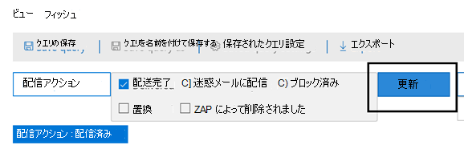

# 脅威エクスプローラーとリアルタイムの検出Threat Explorer and Real-time detections

組織が [Office 365](office-365-atp.md)用の Microsoft Defender を持ち、必要なアクセス許可を持っている場合は、エクスプローラーまたはリアルタイムの検出 (以前のリアルタイム レポート) に *アクセスできます*。 If your organization has [Microsoft Defender for Office 365](office-365-atp.md) and you have the [necessary permissions](#required-licenses-and-permissions), you have access to *Explorer* or *Real-time detections*, which were formerly *Real-time reports*. ([新機能を参照してください](#new-features-in-threat-explorer-and-real-time-detections)。セキュリティ/コンプライアンス センター&、脅威の管理に移動し、[**エクスプローラー**  ] または [リアルタイムの検出 **] を選択します**。([See what's new.](#new-features-in-threat-explorer-and-real-time-detections)) In the Security & Compliance Center, go to **Threat management**, and then select **Explorer** _or_ **Real-time detections**.

|Microsoft Defender for Office 365 プラン 2 では、次の情報が表示されます。With Microsoft Defender for Office 365 Plan 2, you see:|Microsoft Defender for Office 365 プラン 1 では、次の情報が表示されます。With Microsoft Defender for Office 365 Plan 1, you see:|
|---|---|
|||
|

エクスプローラーまたはリアルタイムの検出は、セキュリティ運用チームが脅威を効率的に調査して対応するのに役立ちます。Explorer or Real-time detections helps your security operations team investigate and respond to threats efficiently. レポートは次の図のようになります。The report resembles the following image:

このレポートでは、次の方法を実行できます。With this report, you can:

- [Microsoft 365 のセキュリティ機能によって検出されたマルウェアを確認するSee malware detected by Microsoft 365 security features](#see-malware-detected-in-email-by-technology)
- [フィッシング URL を表示し、確認データをクリックするView phishing URL and click verdict data](#view-phishing-url-and-click-verdict-data)
- [エクスプローラーのビューから](#start-automated-investigation-and-response) 自動調査と対応プロセスを開始する (Defender for Office 365 プラン 2 のみ)[Start an automated investigation and response process from a view in Explorer](#start-automated-investigation-and-response) (Defender for Office 365 Plan 2 only)
- [悪意のあるメールの調査などInvestigate malicious email, and more](#more-ways-to-use-explorer-and-real-time-detections)

## 脅威エクスプローラーとリアルタイム検出の機能強化Improvements to Threat Explorer and Real-time detections

### 脅威エクスプローラーのタグTags in Threat Explorer

> [!NOTE]
> ユーザー タグ機能はプレビュー *中* であり、すべてのユーザーが利用できるとは言え、変更される可能性があります。The user tags feature is in *Preview*, isn't available to everyone, and is subject to change. リリース スケジュールの詳細については、Microsoft 365 ロードマップを参照してください。For information about the release schedule, check out the Microsoft 365 roadmap.

ユーザー タグは、Microsoft Defender で 365 用の特定のユーザー Office識別します。User tags identify specific groups of users in Microsoft Defender for Office 365. ライセンスや構成など、タグの詳細については、「ユーザー タグ」 [を参照してください](user-tags.md)。For more information about tags, including licensing and configuration, see [User tags](user-tags.md).

脅威エクスプローラーでは、次のエクスペリエンスでユーザー タグに関する情報を確認できます。In Threat Explorer, you can see information about user tags in the following experiences.

#### メール グリッド ビューEmail grid view

電子 **メール** グリッドの [タグ] 列には、送信者または受信者のメールボックスに適用されたタグすべてが含まれます。The **Tags** column in the email grid contains all the tags that have been applied to the sender or recipient mailboxes. 既定では、優先度アカウントのようなシステム タグが最初に表示されます。By default, system tags like priority accounts are shown first.

> [!div class="mx-imgBorder"]
> 

#### フィルター処理Filtering

タグはフィルターとして使用できます。You can use tags as a filter. 優先順位の高いアカウントまたは特定のユーザー タグのシナリオをまたがってハントします。Hunt just across priority accounts or specific user tags scenarios. 特定のタグを持つ結果を除外することもできます。You can also exclude results that have certain tags. この機能を他のフィルターと組み合わせて調査範囲を絞り込む。Combine this functionality with other filters to narrow your scope of investigation.

> [!div class="mx-imgBorder"]
> 

#### 電子メール詳細のフライアウトEmail detail flyout
送信者と受信者の個々のタグを表示するには、件名を選択してメッセージの詳細のフライアウトを開きます。To view the individual tags for sender and recipient, select the subject to open the message details flyout. [概要 **] タブ** では、送信者タグと受信者タグが電子メール用に存在する場合は、個別に表示されます。On the **Summary** tab, the sender and recipient tags are shown separately, if they're present for an email.
送信者と受信者の個々のタグに関する情報は、エクスポートされた CSV データにも適用され、これらの詳細は 2 つの列に分いて表示されます。The information about individual tags for sender and recipient also extends to exported CSV data, where you can see these details in two separate columns.

> [!div class="mx-imgBorder"]
> 

タグ情報は、URL クリック のフライアウトにも表示されます。Tags information is also shown in the URL clicks flyout. 表示するには、[フィッシング] ビューまたは [すべてのメール] ビューに移動し **、[URL]** タブまたは **[URL クリック] タブに移動** します。個々の URL フライアウトを選択して、その URL のクリックに関する詳細 (そのクリックに関連付けられているタグを含む) を表示します。To view it, go to Phish or All Email view and then to the **URLs** or **URL Clicks** tab. Select an individual URL flyout to view additional details about clicks for that URL, including tags associated with that click.

> [!div class="mx-imgBorder"]
> 

## 脅威の検出エクスペリエンスの改善 (今後)Improvements to the threat hunting experience (upcoming)

### メールの脅威情報の更新Updated threat information for emails

電子メール レコードのデータ精度と一貫性を高めるプラットフォームとデータ品質の向上に重点を置いて取り組み、We've focused on platform and data-quality improvements to increase data accuracy and consistency for email records. ZAP プロセスの一部として電子メールで実行されるアクションなど、配信前および配信後の情報を 1 つのレコードに統合する機能が改善されました。Improvements include consolidation of pre-delivery and post-delivery information, such as actions executed on an email as part of the ZAP process, into a single record. スパムの特定、エンティティ レベルの脅威 (悪意のある URL など)、最新の配信場所などの詳細も含まれています。Additional details like spam verdict, entity-level threats (for example, which URL was malicious), and latest delivery locations are also included.

これらの更新後、メッセージに影響を与える配信後イベントに関係なく、メッセージごとに 1 つのエントリが表示されます。After these updates, you'll see a single entry for each message, regardless of the different post-delivery events that affect the message. アクションには、ZAP、手動による修復 (管理者の操作を意味する)、動的配信などがあります。Actions can include ZAP, manual remediation (which means admin action), dynamic delivery, and so on.

マルウェアとフィッシングの脅威の表示に加えて、メールに関連付けられているスパムの検出が表示されます。In addition to showing malware and phishing threats, you see the spam verdict associated with an email. メール内で、電子メールに関連付けられているすべての脅威と、対応する検出テクノロジを確認します。Within the email, see all the threats associated with the email along with the corresponding detection technologies. 電子メールには、0、1、または複数の脅威があります。An email can have zero, one, or multiple threats. メール のフライアウトの [詳細] セクションに **、現在の** 脅威が表示されます。You'll see the current threats in the **Details** section of the email flyout. 複数の脅威 (マルウェアやフィッシングなど) の検出技術フィールドには、脅威を特定した検出テクノロジである脅威検出マッピングが表示されます。For multiple threats (such as malware and phishing), the **Detection tech** field shows the threat-detection mapping, which is the detection technology that identified the threat.

一連の検出テクノロジには、新しい検出方法とスパム検出テクノロジが含まれています。The set of detection technologies now includes new detection methods, as well as spam-detection technologies. 同じ一連の検出テクノロジを使用して、さまざまな電子メール ビュー (マルウェア、フィッシング、すべての電子メール) で結果をフィルター処理できます。You can use the same set of detection technologies to filter the results across the different email views (Malware, Phish, All Email).

> [!NOTE]
> Verdict 分析は、必ずしもエンティティに関連付けられているとは限りません。Verdict analysis might not necessarily be tied to entities. たとえば、メールはフィッシングまたはスパムとして分類されますが、フィッシング/スパムの確認がスタンプされた URL はありません。As an example, an email might be classified as phish or spam, but there are no URLs that are stamped with a phish/spam verdict. これは、フィルターは、決まった内容を割り当てる前にメールのコンテンツなどの詳細も評価するからです。This is because the filters also evaluate content and other details for an email before assigning a verdict.

#### URL 内の脅威Threats in URLs

メール の [詳細] タブで、URL に対する特定の脅威を **確認** できます。脅威には、*マルウェア、\*\*フィッシング*、*スパム、* またはなしがあります。You can now see the specific threat for a URL on the email flyout **Details** tab. The threat can be *malware*, *phish*, *spam*, or *none*.)

> [!div class="mx-imgBorder"]
> 

### 更新されたタイムライン ビュー (今後)Updated timeline view (upcoming)

> [!div class="mx-imgBorder"]
> 

タイムライン ビューは、すべての配信イベントと配信後イベントを識別します。Timeline view identifies all delivery and post-delivery events. この情報には、これらのイベントのサブセットについて、その時点で特定された脅威に関する情報が含まれます。It includes information about the threat identified at that point of time for a subset of these events. タイムライン ビューには、実行された追加のアクション (ZAP や手動修復など) に関する情報と、そのアクションの結果も表示されます。Timeline view also provides information about any additional action taken (such as ZAP or manual remediation), along with the result of that action. タイムライン ビューの情報には、次が含まれます。Timeline view information includes:

- **ソース:** イベントのソース。**Source:** Source of the event. 管理者/システム/ユーザーの場合があります。It can be admin/system/user.
- **イベント:** 元の配信、手動修復、ZAP、提出、動的配信などのトップ レベルのイベントが含まれます。**Event:** Includes top-level events like original delivery, manual remediation, ZAP, submissions, and dynamic delivery.
- **アクション:** ZAP または管理者アクションの一部として実行された特定のアクション (削除済み (回復可能) など)。**Action:** The specific action that was taken either as part of ZAP or admin action (for example, soft delete).
- **脅威:** その時点で特定された脅威 (マルウェア、フィッシング、スパム) について説明します。**Threats:** Covers the threats (malware, phish, spam) identified at that point of time.
- **結果/詳細:** ZAP/管理者アクションの一部として実行されたかどうかなど、アクションの結果に関する詳細。**Result/Details:** More information about the result of the action, such as whether it was performed as part of ZAP/admin action.

### 元の配信場所と最新の配信場所Original and latest delivery location

現在、メール グリッドと電子メール のフライアウトに配信場所が表示されています。Currently, we surface delivery location in the email grid and email flyout. [ **配信場所]** フィールドの名前が変更されました \**_元の配信場所_* _.The **Delivery location** field is getting renamed \**_Original delivery location_* _. また、別のフィールドである最新の配信 _\*_場所を導入しています_\*_。And we're introducing another field, _*_Latest delivery location_*_.

_ *元の配信場所*\* は、メールが最初に配信された場所に関する詳細を提供します。_ *Original delivery location*\* will give more information about where an email was delivered initially. **最新の配信場所** には *、ZAP* のようなシステム操作や削除済みアイテムへの移動のような管理者アクションの後に電子メールが届いた *場所が表示されます*。**Latest delivery location** will state where an email landed after system actions like *ZAP* or admin actions like *Move to deleted items*. 最新の配信場所は、配信後のメッセージの最後の既知の場所、またはシステム/管理者の操作を管理者に伝えるのが目的です。Latest delivery location is intended to tell admins the message's last-known location post-delivery or any system/admin actions. 電子メールにエンド ユーザーの操作は含まれます。It doesn't include any end-user actions on the email. たとえば、ユーザーがメッセージを削除した場合や、メッセージをアーカイブ/pst に移動した場合、"配信" の場所は更新されません。For example, if a user deleted a message or moved the message to archive/pst, the message "delivery" location won't be updated. ただし、システム アクションによって場所が更新された場合 (たとえば、ZAP によってメールが検疫に移動した場合)、最新の配信場所は "検疫" と表示されます。But if a system action updated the location (for example, ZAP resulting in an email moving to quarantine), **Latest delivery location** would show as "quarantine."

> [!div class="mx-imgBorder"]
> 

> [!NOTE]
> 配信場所と配信アクションが "**不明**"と表示される場合があります。There are a few cases where **Delivery location** and **Delivery action** may show as "unknown":
>
> - メッセージが配信された場合、配信場所が"配信済み" として表示され、配信場所が "不明" と表示される場合がありますが、受信トレイ ルールによって、メッセージは受信トレイまたは迷惑メール フォルダーではなく、既定のフォルダー (下書きやアーカイブなど) に移動されます。You might see **Delivery location** as "delivered" and **Delivery location** as "unknown" if the message was delivered, but an Inbox rule moved the message to a default folder (such as Draft or Archive) instead of to the Inbox or Junk Email folder.
>
> - **管理者/システム** の操作 (ZAP など) が試行されたが、メッセージが見つからなかった場合、最新の配信場所は不明になる可能性があります。**Latest delivery location** can be unknown if an admin/system action (such as ZAP) was attempted, but the message wasn't found. 通常、アクションは、ユーザーがメッセージを移動または削除した後に実行されます。Typically, the action happens after the user  moved or deleted the message. このような場合は、タイムライン ビューの **[結果/詳細]** 列を確認します。In such cases, verify the **Result/Details** column in timeline view. 「ユーザーがメッセージを移動または削除しました」というステートメントを探します。Look for the statement "Message moved or deleted by the user."

> [!div class="mx-imgBorder"]
> 

### 追加のアクションAdditional actions

*メールの配信* 後に追加のアクションが適用された。*Additional actions* were applied after delivery of the email. *ZAP、* 手動修復 *(回復* 可能な削除などの管理者が実行したアクション)、動的配信、再処理 *(時間* 的に良好と検出されたメールの場合) を含む場合があります。They can include *ZAP*, *manual remediation* (action taken by an Admin such as soft delete), *dynamic delivery*, and *reprocessed* (for an email that was retroactively detected as good).

> [!NOTE]
> - 保留中の変更の一環として、配信アクション フィルターに現在表示されている "Removed by ZAP" 値は削除されます。As part of the pending changes, the "Removed by ZAP" value currently surfaced in the Delivery Action filter is going away. You'll have a way to search for all email with the ZAP attempt through **Additional actions**.You'll have a way to search for all email with the ZAP attempt through **Additional actions**.
>
> - 検出テクノロジと追加アクション (特に ZAP シナリオ用) の新しいフィールドと値があります。 There will be new fields and values for **Detection technologies** and **Additional actions** (especially for ZAP scenarios). 既存の保存されたクエリと追跡されたクエリを評価して、新しい値で動作する必要があります。You'll need to evaluate your existing saved queries and tracked queries to make sure they work with the new values.

> [!div class="mx-imgBorder"]

> 

### システム オーバーライドSystem overrides

*システム オーバーライドを使用* すると、メッセージの配信場所に対して例外を設定できます。*System overrides* enable you to make exceptions to the intended delivery location of a message. フィルタリング スタックによって識別される脅威および他の検出に基づいて、システムによって提供される配信場所を上書きします。You override the delivery location provided by the system, based on the threats and other detections identified by the filtering stack. システム オーバーライドは、テナントポリシーまたはユーザー ポリシーを使用して設定し、ポリシーによって提案されたメッセージを配信できます。System overrides can be set through tenant or user policy to deliver the message as suggested by the policy. 上書きでは、ユーザーが設定した過剰に広範な差出人セーフ リスト ポリシーなど、構成のギャップが原因で悪意のあるメッセージが意図せずに配信される可能性があります。Overrides can identify unintentional delivery of malicious messages due to configurations gaps, such as an overly broad Safe Sender policy set by a user. これらのオーバーライド値は次の場合があります。These override values can be:

- ユーザー ポリシーで許可: ユーザーがメールボックス レベルでポリシーを作成し、ドメインまたは送信者を許可します。Allowed by user policy: A user creates policies at the mailbox level to allows domains or senders.
- ユーザー ポリシーによってブロック: ユーザーがメール ボックス レベルでポリシーを作成し、ドメインまたは送信者をブロックします。Blocked by user policy: A user creates policies at the mail box level to block domains or senders.
- 組織ポリシーで許可: 組織のセキュリティ チームは、組織内のユーザーに対して送信者とドメインを許可するポリシーまたは Exchange メール フロー ルール (トランスポート ルールとも呼ばれる) を設定します。Allowed by org policy: The organization's security teams set policies or Exchange mail flow rules (also known as transport rules) to allow senders and domains for users in their organization. これは、一連のユーザーまたは組織全体に対して使用できます。This can be for a set of users or the entire organization.
- 組織ポリシーによってブロック: 組織のセキュリティ チームは、組織内のユーザーの送信者、ドメイン、メッセージ言語、またはソース IP をブロックするポリシーまたはメール フロー ルールを設定します。Blocked by org policy: The organization's security teams set policies or mail flow rules to block senders, domains, message languages, or source IPs for users in their organization. これは、一連のユーザーまたは組織全体に適用できます。This can be applied to a set of users or the entire organization.
- 組織ポリシーによってブロックされるファイル拡張子: 組織のセキュリティ チームは、マルウェア対策ポリシー設定を通じてファイル名の拡張子をブロックします。File extension blocked by org policy: An organization's security team blocks a file name extension through the anti-malware policy settings. これらの値は、調査に役立つメールの詳細に表示されます。These values will now be displayed in email details to help with investigations. Secops チームは、リッチ フィルタリング機能を使用して、ブロックされたファイル拡張子をフィルター処理することもできます。Secops teams can also use the rich-filtering capability to filter on blocked file extensions.

> [!div class="mx-imgBorder"]
> 

### URL とクリック エクスペリエンスの改善Improvements for the URL and clicks experience

改善点は次のとおりです。The improvements include:

- URL フライアウトの [クリック] セクションに、完全にクリックされた URL  (URL の一部であるクエリ パラメーターを含む) を表示します。Show the full clicked URL (including any query parameters that are part of the URL) in the **Clicks** section of the URL flyout. 現時点では、URL ドメインとパスはタイトル バーに表示されます。Currently, the URL domain and path appear in the title bar. この情報を拡張して、完全な URL を表示します。We're extending that information to show the full URL.

- URL フィルター全体の修正 (*URL* と *URL* ドメイン、URL ドメイン、パス): 更新は、URL/クリックの可否を含むメッセージの検索に影響します。Fixes across URL filters (*URL* versus *URL domain* versus *URL domain and path*): The updates affect searching for messages that contain a URL/click verdict. プロトコルに依存しない検索のサポートが有効になっているので、使用せずに URL を検索できます `http` 。We enabled support for protocol-agnostic searches, so you can search for a URL without using `http`. 既定では、別の値が明示的に指定されていない限り、URL 検索は http にマップされます。By default, the URL search maps to http, unless another value is explicitly specified. 例:For example:

   -  URL、URL ドメイン、および URL ドメインおよびパス フィルター フィールドで、プレフィックスの付いていなくても `http://` 検索します。   Search with and without the `http://` prefix in the **URL**, **URL Domain**, and **URL Domain and Path** filter fields. 検索は同じ結果を表示する必要があります。The searches should show the same results.

   -  URL でプレフィックス `https://` を検索 **します**。Search for the `https://` prefix in **URL**. 値を指定しない場合、プレフィックス `http://` が使用されます。When no value is specified, the `http://` prefix is assumed.

   - `/` は **、URL パス、URL** ドメイン **、URL** ドメイン、およびパス フィールドの先頭と末尾 **では無視** されます。`/` is ignored at the beginning and end of the **URL path**, **URL Domain**, **URL domain and path** fields. `/` URL フィールドの末尾 **は** 無視されます。`/` at the end of the **URL** field is ignored.

### フィッシングの信頼度Phish confidence level

フィッシングの信頼度は、メールが 「フィッシング」として分類された信頼度を特定するのに役立ちます。Phish confidence level helps identify the degree of confidence with which an email was categorized as "phish." 使用できる値は *、High* と *Normal の 2 つです*。The two possible values are *High* and *Normal*. 初期段階では、このフィルターは脅威エクスプローラーの [フィッシング] ビューでのみ使用できます。In the initial stages, this filter will be available only in the Phish view of Threat Explorer.

### ZAP URL シグナルZAP URL signal

ZAP URL シグナルは、通常、電子メールがフィッシングとして識別され、配信後に削除された ZAP フィッシングアラート シナリオで使用されます。The ZAP URL signal is typically used for ZAP Phish alert scenarios where an email was identified as Phish and removed after delivery. このシグナルは、アラートをエクスプローラーの対応する結果に接続します。This signal connects the alert with the corresponding results in Explorer. これは、アラートの IIC の 1 つです。It's one of the IOCs for the alert.

検出プロセスを改善するために、脅威エクスプローラーとリアルタイム検出を更新して、ハンティング エクスペリエンスの一貫性を高めていました。To improve the hunting process, we've updated Threat Explorer and Real-time detections to make the hunting experience more consistent. 変更点の概要を次に示します。The changes are outlined here:

- [タイムゾーンの改善Timezone improvements](#timezone-improvements)
- [更新プロセスでの更新Update in the refresh process](#update-in-the-refresh-process)
- [フィルターに追加するグラフのドリルダウンChart drilldown to add to filters](#chart-drilldown-to-add-to-filters)
- [製品情報の更新でIn product information updates](#in-product-information-updates)

### ユーザー タグでフィルター処理するFilter by user tags

システム タグまたはカスタム ユーザー タグで並べ替えとフィルター処理を行い、脅威の範囲をすばやく把握できます。You can now sort and filter on system or custom user tags to quickly grasp the scope of threats. 詳細については、「ユーザー タグ」 [を参照してください](user-tags.md)。To learn more, see [User tags](user-tags.md).

> [!IMPORTANT]
> ユーザー タグによるフィルター処理と並べ替えは、現在パブリック プレビュー中です。Filtering and sorting by user tags is currently in public preview. この機能は、商用リリース前に大幅に変更される可能性があります。This functionality may be substantially modified before it's commercially released. Microsoft は、その情報に関して明示または黙示を問わず、いかなる保証も行いません。Microsoft makes no warranties, express or implied, with respect to the information provided about it.

![エクスプローラーの [タグ] 列](../../media/threat-explorer-tags.png)

### タイムゾーンの改善Timezone improvements

ポータルとエクスポートされたデータのメール レコードのタイム ゾーンが表示されます。You'll see the time zone for the email records in the Portal as well as for Exported data. メール グリッド、詳細のフライアウト、メール タイムライン、類似のメールなど、複数のエクスペリエンスで表示されます。そのため、結果セットのタイム ゾーンは明確です。It will be visible across experiences like Email Grid, Details flyout, Email Timeline, and Similar Emails, so the time zone for the result set is clear.

> [!div class="mx-imgBorder"]
> 

### 更新プロセスでの更新Update in the refresh process

一部のユーザーは、自動更新 (たとえば、日付を変更するとすぐにページが更新されます)、および手動更新 (その他のフィルターの場合) との混乱についてコメントしています。Some users have commented about confusion with automatic refresh (for example, as soon as you change the date, the page refreshes) and manual refresh (for other filters). 同様に、フィルターを削除すると自動更新が行います。Similarly, removing filters leads to automatic refresh. クエリの変更中にフィルターを変更すると、一貫性のない検索エクスペリエンスが発生する可能性があります。Changing filters while modifying the query can cause inconsistent search experiences. これらの問題を解決するために、手動フィルターメカニズムに移行します。To resolve these issues, we're moving to a manual-filtering mechanism.

ユーザーは、エクスペリエンスの観点から、(フィルター セットと日付から) さまざまなフィルターの範囲を適用および削除し、更新ボタンを選択して、クエリを定義した後に結果をフィルター処理できます。From an experience standpoint, the user can apply and remove the different range of filters (from the filter set and date) and select the refresh button to filter the results after they've defined the query. [更新] ボタンも画面で強調されます。The refresh button is also now emphasized on the screen. 関連するヒントと製品内のドキュメントも更新されました。We've also updated the related tooltips and in-product documentation.

> [!div class="mx-imgBorder"]
> ![[更新] を選択して結果をフィルター処理する](../../media/ManualRefresh.png)

### フィルターに追加するグラフのドリルダウンChart drilldown to add to filters

凡例値をグラフに追加して、フィルターとして追加できます。You can now chart legend values to add them as filters. [更新] **ボタンを** 選択して結果をフィルター処理します。Select the **Refresh** button to filter the results.

> [!div class="mx-imgBorder"]
> 

### 製品内情報の更新In-product information updates

グリッド内の検索結果の総数など、製品内で追加の詳細が利用可能になります (下記を参照)。Additional details are now available within the product, such as the total number of search results within the grid (see below). ラベル、エラー メッセージ、ヒントが改善され、フィルター、検索エクスペリエンス、および結果セットに関する詳細な情報が提供されるようになりました。We've improved labels, error messages, and tooltips to provide more information about the filters, search experience, and result set.

> [!div class="mx-imgBorder"]
> 

## 脅威エクスプローラーの拡張機能Extended capabilities in Threat Explorer

### 上位の対象ユーザーTop targeted users

現在では、メールの [マルウェア] ビューの [上位マルウェア ファミリ] セクションで、上位の対象ユーザー **の一覧を公開** しています。Today we expose the list of the top targeted users in the Malware view for emails, in the **Top Malware Families** section. このビューは、[フィッシング] ビューと [すべてのメール] ビューでも拡張されます。We'll be extending this view in the Phish and All Email views as well. 上位 5 人の対象ユーザーと、対応するビューの各ユーザーの試行回数を確認できます。You'll be able to see the top-five targeted users, along with the number of attempts for each user for the corresponding view. たとえば、[フィッシング] ビューには、フィッシングの試行回数が表示されます。For example, for Phish view, you'll see the number of Phish attempts.

各電子メール ビューのオフライン分析の試行回数と共に、最大 3,000 の制限を持つ対象ユーザーの一覧をエクスポートできます。You'll be able to export the list of targeted users, up to a limit of 3,000, along with the number of attempts for offline analysis for each email view. さらに、試行回数を選択すると (次の図では 13 回など)、脅威エクスプローラーでフィルター処理されたビューが開くので、そのユーザーのメールと脅威の詳細を確認できます。In addition, selecting the number of attempts (for example, 13 attempts in the image below) will open a filtered view in Threat Explorer, so you can see more details across emails and threats for that user.

> [!div class="mx-imgBorder"]
> 

### Exchange トランスポート ルールExchange transport rules

データ エンリッチメントの一環として、メッセージに適用されたさまざまな Exchange トランスポート ルール (ETR) を表示できます。As part of data enrichment, you'll be able to see all the different Exchange transport rules (ETR) that were applied to a message. この情報は、[電子メール] グリッド ビューで利用できます。This information will be available in the Email grid view. 表示するには、グリッドで **[列] オプション** を選択し、列オプションから **Exchange トランスポート ルール** を追加します。To view it,  select **Column options** in the grid and then **Add Exchange Transport Rule** from the column options. また、メールの [詳細] **フライアウト** にも表示されます。It will also be visible on the **Details** flyout in the email.

メッセージに適用されたトランスポート ルールの GUID と名前の両方を表示できます。You'll be able to see both the GUID and the name of the transport rules that were applied to the message. トランスポート ルールの名前を使用してメッセージを検索できます。You'll be able to search for the messages by using the name of the transport rule. これは"含まれている" 検索です。つまり、部分的な検索も実行できます。This is a "Contains" search, which means you can do partial searches as well.

#### 重要な注意点:Important note:

ETR 検索と名前の可用性は、自分に割り当てられている特定の役割によって異なっています。ETR search and name availability depend on the specific role that's assigned to you. ETR 名と検索を表示するには、次のいずれかのロール/アクセス許可が必要です。You need to have one of the following roles/permissions to view the ETR names and search. これらの役割が割り当てられていない場合は、トランスポート ルールの名前を表示したり、ETR 名を使用してメッセージを検索したりできない。If you don't have any of these roles assigned to you, you can't see the names of the transport rules or search for messages by using ETR names. ただし、[電子メールの詳細] に ETR ラベルと GUID 情報が表示される場合があります。However, you could see the ETR label and GUID information in the Email Details. 電子メール グリッド、電子メール のフライアウト、フィルター、およびエクスポートのその他の記録表示エクスペリエンスは影響を受け取ります。Other record-viewing experiences in Email Grids, Email flyouts, Filters, and Export are not affected.

- EXO のみ - データ損失防止: すべてEXO Only - Data Loss Prevention: All
- EXO のみ - O365SupportViewConfig: AllEXO Only - O365SupportViewConfig: All
- Microsoft Azure Active Directory または EXO - セキュリティ管理者: すべてMicrosoft Azure Active Directory or EXO - Security Admin: All
- AAD または EXO - セキュリティ リーダー: すべてAAD or EXO - Security Reader: All
- EXO のみ - トランスポート ルール: すべてEXO Only - Transport Rules: All
- EXO のみ - View-Only構成: すべてEXO Only - View-Only Configuration: All

電子メール グリッド、詳細のフライアウト、エクスポートされた CSV では、以下に示すように、EET には名前/GUID が表示されます。Within the email grid, Details flyout, and Exported CSV, the ETRs are presented with a Name/GUID as shown below.

> [!div class="mx-imgBorder"]
> 

### 受信コネクタInbound connectors

コネクタは、Microsoft 365 または Office 365 組織との間で電子メールを流す方法をカスタマイズする手順のコレクションです。Connectors are a collection of instructions that customize how your email flows to and from your Microsoft 365 or Office 365 organization. この機能を使用すると、セキュリティの制限や制御を適用できます。They enable you to apply any security restrictions or controls. 脅威エクスプローラーで、メールに関連するコネクタを表示し、コネクタ名を使用してメールを検索できます。Within Threat Explorer, you can now view the connectors that are related to an email and search for emails by using connector names.

コネクタの検索は、実際には "含まれている" ので、部分的なキーワード検索も機能する必要があります。The search for connectors is "contains" in nature, which means partial keyword searches should work as well. メイン グリッド ビュー、詳細フライアウト、およびエクスポートされた CSV では、コネクタは次のように名前/GUID 形式で表示されます。Within the Main grid view, the Details flyout, and the Exported CSV, the connectors are shown in the Name/GUID format as shown here:

> [!div class="mx-imgBorder"]
> 

## 脅威エクスプローラーとリアルタイム検出の新機能New features in Threat Explorer and Real-time detections

脅威エクスプローラーとリアルタイム検出では、次の 3 つの新機能を使用できます。Three new features are available in Threat Explorer and Real-time detections:

- [メール ヘッダーのプレビューとメール本文のダウンロードPreview email header and download email body](#preview-email-header-and-download-email-body)
- [メールのタイムラインEmail timeline](#email-timeline)
- [URL クリック データのエクスポートExport URL click data](#export-url-click-data)

これらの新機能の概要を以下に示します。These new features are outlined below.

### メール ヘッダーのプレビューとメール本文のダウンロードPreview email header and download email body

これで、メール ヘッダーをプレビューし、脅威エクスプローラーでメール本文をダウンロードできます。管理者は、ダウンロードしたヘッダー/電子メール メッセージに脅威を分析できます。You can now preview an email header and download the email body in Threat Explorer Admins can analyze downloaded headers/email messages for threats. 電子メール メッセージをダウンロードすると情報が危険にさらされる可能性があるから、このプロセスは役割ベースのアクセス制御 (RBAC) によって制御されます。Because downloading email messages can risk exposure of information, this process is controlled by role-based access control (RBAC). すべての電子メールメッセージ ビューでメールとプレビュー ヘッダーをダウンロードする機能を付与するには、新しい役割 Preview を別の役割グループ (セキュリティ操作やセキュリティ管理者など) に追加する必要があります。A new role, *Preview*, must be added to another role group (such as Security Operations or Security Administrator) to grant the ability to download mails and preview headers in all-email messages view.

エクスプローラーとリアルタイムの検出では、電子メール メッセージの配信場所のより完全な画像を提供する新しいフィールドも取得します。Explorer and Real-time detections will also get new fields that provide a more complete picture of where your email messages land. これらの変更により、Security Ops のハンティングが容易になります。These changes  make hunting easier for Security Ops. しかし、主な結果は、問題のある電子メール メッセージの場所を一目で把握できるという結果です。But the main result is you can know the location of problem email messages at a glance.

これを行う方法How is this done? 配信状態は、次の 2 つの列に分かれました。Delivery status is now broken out into two columns:

- **配信アクション** - メールの状態。**Delivery action** - Status of the email.
- **配信場所** - 電子メールがルーティングされた場所。**Delivery location** - Where the email was routed.

*配信アクション* は、既存のポリシーまたは検出のために電子メールに対して実行されるアクションです。*Delivery action* is the action taken on an email due to existing policies or detections. 電子メールに対して実行できるアクションを次に示します。Here are the possible actions for an email:

|配信Delivered|JunkedJunked|BlockedBlocked|置き換えReplaced|
|---|---|---|---|
|メールはユーザーの受信トレイまたはフォルダーに配信され、ユーザーはアクセスできます。Email was delivered to the inbox or folder of a user, and the user can access it.|メールがユーザーの [迷惑メール] フォルダーまたは [削除済み] フォルダーに送信され、ユーザーがアクセスできます。Email was sent to the user's Junk  or Deleted folder, and the user can access it.|検疫された、失敗した、またはドロップされたメール。Emails that are quarantined, that failed, or were dropped. これらのメールにはユーザーがアクセスできません。These mails are inaccessible to the user.|電子メールには、悪意のある添付ファイルが .txt ファイルに置き換え、添付ファイルが悪意のある添付ファイルであるという状態でした。Email had malicious attachments replaced by .txt files that state the attachment was malicious.|

ユーザーが表示できる機能と表示できない機能を次に示します。Here is what the user can and can't see:

|エンド ユーザーがアクセス可能Accessible to end users|エンド ユーザーがアクセスできないInaccessible to end users|
|---|---|
|配信Delivered|BlockedBlocked|
|JunkedJunked|置き換えReplaced|

**配信場所** には、配信後に実行されるポリシーと検出の結果が表示されます。**Delivery location** shows the results of policies and detections that run post-delivery. これは、 \* 配信アクション _. に \*_リンク_\* されています。It's linked to \**_Delivery action_* _. 次の値を使用できます。These are the possible values:

- _Inboxまたはフォルダー\*: メールは受信トレイまたはフォルダー内にあります (メール ルールに従います)。_Inbox or folder\*: The email is in the inbox or a folder (according to your email rules).
- *オンプレミスまたは外部*: メールボックスはクラウド上に存在しませんが、オンプレミスです。*On-prem or external*: The mailbox doesn't exist on cloud but is on-premises.
- *迷惑メール* フォルダー : メールはユーザーの [迷惑メール] フォルダーにあります。*Junk folder*: The email is in a user's Junk folder.
- *削除済みアイテム フォルダー*: ユーザーの [削除済みアイテム] フォルダー内のメール。*Deleted items folder*: The email in a user's Deleted items folder.
- *検疫*: メールは検疫中であり、ユーザーのメールボックスには含めではありません。*Quarantine*: The email is in quarantine and not in a user's mailbox.
- *Failed*: 電子メールがメールボックスに到達できなかった。*Failed*: The email failed to reach the mailbox.
- *破棄*: メール フローのどこかでメールが失われました。*Dropped*: The email got lost somewhere in the mail flow.

### メールのタイムラインEmail timeline

電子 **メールのタイムライン** は、管理者の検索エクスペリエンスを向上させる新しいエクスプローラー機能です。The **Email timeline** is a new Explorer feature that improves the hunting experience for admins. イベントを理解するためにさまざまな場所を確認するために費やされる時間が削減されます。It cuts the time spent checking different locations to try to understand the event. 電子メールが届いた時点または近くで複数のイベントが発生すると、それらのイベントはタイムライン ビューに表示されます。When multiple events happen at or close to the same time an email arrives, those events are displayed in a timeline view. メールの配信後に発生する一部のイベントは、[特別な操作] **列にキャプチャ** されます。Some events that happen to your email post-delivery are captured in the **Special action** column. 管理者は、タイムラインの情報とメールの配信後に実行される特別なアクションを組み合わせて、ポリシーの動作、メールが最終的にルーティングされた場所、場合によっては最終的な評価の結果に関する洞察を得られます。Admins can combine  information from the timeline with the special action taken on the mail post-delivery to get insight into how their policies work, where the mail was finally routed, and, in some cases, what the final assessment was.

詳細については [、「365](investigate-malicious-email-that-was-delivered.md)で配信された悪意のあるメールの調査と修復Office参照してください。For more information, see [Investigate and remediate malicious email that was delivered in Office 365](investigate-malicious-email-that-was-delivered.md).

### URL クリック データのエクスポートExport URL click data

URL クリックのレポートを Microsoft Excel にエクスポートして、ネットワーク メッセージ **ID** を表示し **、[Verdict]** をクリックして URL クリックトラフィックの発信元を説明できます。You can now export reports for URL clicks to Microsoft Excel to view their **network message ID** and **click verdict**, which helps explain where your URL click traffic originated. 動作のしくみは次のとおりです。Office 365 クイック起動バーの脅威管理では、次のチェーンに従います。Here's how it works: In Threat Management on the Office 365 quick-launch bar, follow this chain:

**エクスプローラー** \>**フィッシングの表示** \>**クリック数** \>**上位 URL または** **URL トップ クリックは** \> 、任意のレコードを選択して URL フライアウトを開きます。**Explorer** \> **View Phish** \> **Clicks** \> **Top URLs** or **URL Top Clicks** \> select any record to open the URL flyout.

一覧で URL を選択すると、新しい [エクスポート] ボタンがフライアウト パネルに表示されます。When you select a URL in the list, you'll see a new **Export** button on the fly-out panel. レポートを簡単にするために、このボタンを使用して Excel スプレッドシートにデータを移動します。Use this button to move data to an Excel spreadsheet for easier reporting.

リアルタイム検出レポートで同じ場所に移動するには、次のパスに従います。Follow this path to get to the same location in the Real-time detections report:

**エクスプローラー** \>**リアルタイム検出** \>**フィッシングの表示** \>**URL** \>**トップ URL または** **[トップ クリック**] 任意のレコードを選択して URL フライアウトを開き、[ \> \> クリック] タブ **に移動** します。**Explorer** \> **Real-time detections** \> **View Phish** \> **URLs** \> **Top URLs** or **Top Clicks** \> Select any record to open the URL flyout \> navigate to the **Clicks** tab.

> [!TIP]
> ネットワーク メッセージ ID は、エクスプローラーまたは関連付けられているサード パーティ製ツールを使って ID を検索すると、クリックを特定のメールにマップします。The Network Message ID maps the click back to specific mails when you search on the ID through Explorer or associated third-party tools. このような検索では、クリック結果に関連付けられている電子メールが識別されます。Such searches identify the email associated with a click result. 関連付けされたネットワーク メッセージ ID を使用すると、より迅速かつ強力な分析が可能になります。Having the correlated Network Message ID makes for quicker and more powerful analysis.

> [!div class="mx-imgBorder"]
> ![エクスプローラーの [クリック] タブ](../../media/tp_ExportClickResultAndNetworkID.png)

## 電子メールで検出されたマルウェアをテクノロジ別に確認するSee malware detected in email by technology

メールで検出されたマルウェアを Microsoft 365 テクノロジで並べ替えたとします。Suppose you want to see malware detected in email sorted by Microsoft 365 technology. これを行うには、エクスプローラーの [[>]](threat-explorer-views.md#email--malware) ビュー (またはリアルタイムの検出) を使用します。To do this, use the [Email > Malware](threat-explorer-views.md#email--malware) view of Explorer (or Real-time detections).

1. セキュリティ センター コンプライアンス & () で、脅威 <https://protection.office.com> **管理** \> **エクスプローラー** (または **リアルタイムの検出) を選択します**。In the Security & Compliance Center (<https://protection.office.com>), choose **Threat management** \> **Explorer** (or **Real-time detections**). (この例では、Explorer を使用します)。(This example uses Explorer.)

2. [表示] **メニューで** 、[メール マルウェア] **を** \> **選択します**。In the **View** menu, choose **Email** \> **Malware**.

   > [!div class="mx-imgBorder"]
   > ![エクスプローラーの [表示] メニュー](../../media/ExplorerViewEmailMalwareMenu.png)

3. [ **送信者] を** クリックし、[基本検出 **テクノロジ** \> **] を選択します**。Click **Sender**, and then choose **Basic** \> **Detection technology**.

   これで、検出テクノロジがレポートのフィルターとして利用できます。Your detection technologies are now available as filters for the report.

   > [!div class="mx-imgBorder"]
   > 

4. オプションを選択します。Choose an option. 次に、[更新 **] ボタン** を選択して、そのフィルターを適用します。Then select the **Refresh** button to apply that filter.

   > [!div class="mx-imgBorder"]
   > 

レポートが更新され、選択したテクノロジ オプションを使用して、マルウェアが電子メールで検出した結果が表示されます。The report refreshes to show the results that malware detected in email, using the technology option you selected. ここから、詳細な分析を実行できます。From here, you can conduct further analysis.

## フィッシング URL を表示し、確認データをクリックするView phishing URL and click verdict data

許可、ブロック、上書きされた URL の一覧を含む、電子メール内の URL を介したフィッシング詐欺の試行を確認するとします。Suppose that you want to see phishing attempts through URLs in email, including a list of URLs that were allowed, blocked, and overridden. クリックされた URL を識別するには、安全なリンク [を構成する](atp-safe-links.md) 必要があります。To identify URLs that were clicked, [Safe Links](atp-safe-links.md) must be configured. クリック時の保護と、安全なリンクによるクリックの確認のログ記録に対して、安全なリンク ポリシーを設定してください。Make sure that you set up [Safe Links policies](set-up-atp-safe-links-policies.md) for time-of-click protection and logging of click verdicts by Safe Links.

メッセージ内のフィッシング URL を確認し、フィッシング メッセージ内の URL[  >  ](threat-explorer-views.md#email--phish)をクリックするには、エクスプローラーの [電子メール フィッシング] ビューまたはリアルタイム検出を使用します。To review phish URLs in messages and clicks on URLs in phish messages, use the [**Email** > **Phish**](threat-explorer-views.md#email--phish) view of Explorer or Real-time detections.

1. セキュリティ センター コンプライアンス & () で、脅威 <https://protection.office.com> **管理** \> **エクスプローラー** (または **リアルタイムの検出) を選択します**。In the Security & Compliance Center (<https://protection.office.com>), choose **Threat management** \> **Explorer** (or **Real-time detections**). (この例では、Explorer を使用します)。(This example uses Explorer.)

2. [表示] **メニューで** 、[メール フィッシング] **を** \> **選択します**。In the **View** menu, choose **Email** \> **Phish**.

   > [!div class="mx-imgBorder"]
   > ![フィッシング コンテキストでのエクスプローラーの [表示] メニュー](../../media/ExplorerViewEmailPhishMenu.png)

3. [ **送信者] を** クリックし **、[URL] を選択して** \> **[Click verdict] をクリックします**。Click **Sender**, and then choose **URLs** \> **Click verdict**.

4. ブロック、上書きブロックなどの 1 つ以上のオプションを選択し、そのフィルターを適用するオプションと同じ行の [更新] ボタンを選択します。 Select one or more options, such as **Blocked** and **Block overridden**, and then select the **Refresh** button on the same line as the options to apply that filter. (ブラウザー ウィンドウを更新しない)。(Don't refresh your browser window.)

   > [!div class="mx-imgBorder"]
   > 

   レポートが更新され、レポートの下の [URL] タブに次の 2 つの異なる URL テーブルが表示されます。The report refreshes to show two different URL tables on the URL tab under the report:

   - **上位 URL は** 、フィルター処理したメッセージ内の URL と、各 URL の電子メール配信アクションのカウントです。**Top URLs** are the URLs in the messages that you filtered down to and the email delivery action counts for each URL. フィッシング メール ビューでは、通常、この一覧には正当な URL が含まれる。In the Phish email view, this list typically contains legitimate URLs. 攻撃者は、メッセージ内に良い URL と悪い URL を組み合わせ、配信を試みているが、悪意のあるリンクをより興味深く見せている。Attackers include a mix of good and bad URLs in their messages to try to get them delivered, but they make the malicious links look more interesting. URL のテーブルは合計メール数で並べ替わりますが、この列は非表示でビューを簡略化します。The table of URLs is sorted by total email count, but this column is hidden to simplify the view.

   - **トップ クリックは** 、クリックされた安全なリンクでラップされた URL で、合計クリック数で並べ替えされています。**Top clicks** are the Safe Links-wrapped URLs that were clicked, sorted by total click count. ビューを簡略化するために、この列も表示されません。This column also isn't displayed, to simplify the view. 列別の総数は、クリックされた各 URL の 「安全なリンク」クリックの否認カウントを示します。Total counts by column indicate the Safe Links click verdict count for each clicked URL. フィッシング メール ビューでは、通常、これらは疑わしい URL または悪意のある URL です。In the Phish email view, these are usually suspicious or malicious URLs. ただし、ビューには、脅威ではないがフィッシング メッセージに含まれる URL が含まれる場合があります。But the view could include URLs that aren't threats but are in phish messages. ラップされていないリンクの URL クリックは、ここには表示されません。URL clicks on unwrapped links don't show up here.

   2 つの URL の表には、配信アクションと場所別のフィッシング メール メッセージの上位 URL が表示されます。The two URL tables show top URLs in phishing email messages by delivery action and location. 表には、警告にもかかわらずブロックまたはアクセスされた URL クリックが表示されます。そのため、ユーザーに対して表示された可能性のある不良リンクと、ユーザーがクリックした可能性のあるリンクを確認できます。The tables show URL clicks that were blocked or visited despite a warning, so you can see what potential bad links were presented to users and that the user's clicked. ここから、詳細な分析を実行できます。From here, you can conduct further analysis. たとえば、グラフの下には、組織の環境でブロックされた電子メール メッセージの上位 URL が表示されます。For example, below the chart you can see the top URLs in email messages that were blocked in your organization's environment.

   > [!div class="mx-imgBorder"]
   > 

   URL を選択して詳細な情報を表示します。Select a URL to view more detailed information.

   > [!NOTE]
   > [URL] フライアウト ダイアログ ボックスでは、環境内の URL の露出の完全なビューを表示するために、電子メール メッセージのフィルター処理が削除されます。In the URL flyout dialog box, the filtering on email messages is removed to show the full view of the URL's exposure in your environment. これにより、エクスプローラーで懸念している電子メール メッセージをフィルター処理し、潜在的な脅威である特定の URL を見つけ、エクスプローラー ビュー自体に URL フィルターを追加することなく、([URL の詳細] ダイアログ ボックスを使用して) 環境内の URL の露出に関する理解を深めます。This lets you filter for email messages you're concerned about in Explorer, find specific URLs that are potential threats, and then expand your understanding of the URL exposure in your environment (via the URL details dialog box) without having to add URL filters to the Explorer view itself.

### クリックの Verdicts の解釈Interpretation of click verdicts

メールまたは URL のフライアウト、トップ クリック、およびフィルター処理エクスペリエンス内には、異なるクリックの確認値が表示されます。Within the Email or URL flyouts, Top Clicks as well as within our filtering experiences, you'll see different click verdict values:

- **なし:** URL の条件を取得できません。**None:** Unable to capture the verdict for the URL. ユーザーが URL をクリックした可能性があります。The user might have clicked through the URL.
- **許可:** ユーザーは URL への移動を許可されました。**Allowed:** The user was allowed to navigate to the URL.
- **ブロック:** ユーザーが URL への移動をブロックされました。**Blocked:** The user was blocked from navigating to the URL.
- **保留中の否決:** ユーザーに、デトレーション保留中のページが表示されました。**Pending verdict:** The user was presented with the detonation-pending page.
- **ブロックされた上書き:** ユーザーが URL に直接移動できません。**Blocked overridden:** The user was blocked from navigating directly to the URL. ただし、ユーザーはブロックをオーバーロードして URL に移動します。But the user overrode the block to navigate to the URL.
- **保留中の否決はバイパスされます。** ユーザーにデトレーション ページが表示されました。**Pending verdict bypassed:** The user was presented with the detonation page. ただし、ユーザーはメッセージをオーバーロードして URL にアクセスします。But the user overrode the message to access the URL.
- **エラー:** ユーザーにエラー ページが表示された場合、または、エラーが発生して、そのエラーが検出されました。**Error:** The user was presented with the error page, or an error occurred in capturing the verdict.
- **エラー:** Verdict のキャプチャ中に不明な例外が発生しました。**Failure:** An unknown exception occurred while capturing the verdict. ユーザーが URL をクリックした可能性があります。The user might have clicked through the URL.

## ユーザーによって報告された電子メール メッセージを確認するReview email messages reported by users

組織内のユーザーが迷惑メール、迷惑メールではない、またはフィッシングとして報告した電子メール メッセージを、レポート メッセージアドインまたは Report [Phishing](enable-the-report-phish-add-in.md)アドインを介して表示するとします。 Suppose that you want to see email messages that users in your organization reported as *Junk*, *Not Junk*, or *Phishing* through the [Report Message add-in](enable-the-report-message-add-in.md) or the [Report Phishing add-in](enable-the-report-phish-add-in.md). それらを表示するには、エクスプローラーの [[**メール**  >  **の送信]**](threat-explorer-views.md#email--submissions)ビュー (またはリアルタイムの検出) を使います。To see them, use the [**Email** > **Submissions**](threat-explorer-views.md#email--submissions) view of Explorer (or Real-time detections).

1. セキュリティ センター コンプライアンス & () で、脅威 <https://protection.office.com> **管理** \> **エクスプローラー** (または **リアルタイムの検出) を選択します**。In the Security & Compliance Center (<https://protection.office.com>), choose **Threat management** \> **Explorer** (or **Real-time detections**). (この例では、Explorer を使用します)。(This example uses Explorer.)

2. [表示] **メニューで** 、[メールの送信 **]** \> **を選択します**。In the **View** menu, choose **Email** \> **Submissions**.

   > [!div class="mx-imgBorder"]
   > ![メールのエクスプローラーの [表示] メニュー](../../media/explorer-view-menu-email-user-reported.png)

3. [送信者 **] を** クリックし、[基本レポート **の** \> **種類] を選択します**。Click **Sender**, and then choose **Basic** \> **Report type**.

4. フィッシングなどのオプションを選択 **し、[** 更新] ボタン **を選択** します。Select an option, such as **Phish**, and then select the **Refresh** button.

   > [!div class="mx-imgBorder"]
   > 

レポートが更新され、組織内のユーザーがフィッシング詐欺の試みとして報告した電子メール メッセージに関するデータが表示されます。The report refreshes to show data about email messages that people in your organization reported as a phishing attempt. この情報を使用して詳細な分析を行い、必要に応じて、Microsoft Defender でフィッシング対策ポリシーを Office [365](configure-atp-anti-phishing-policies.md)に合わせて調整できます。You can use this information to conduct further analysis, and, if necessary, adjust your [anti-phishing policies in Microsoft Defender for Office 365](configure-atp-anti-phishing-policies.md).

## 自動調査と対応を開始するStart automated investigation and response

> [!NOTE]
> 自動調査および対応機能は *、Microsoft Defender で Office 365 プラン 2* および Office *365 E5 で利用できます*。Automated investigation and response capabilities are available in *Microsoft Defender for Office 365 Plan 2* and *Office 365 E5*.

[自動調査と対応により](automated-investigation-response-office.md) 、セキュリティ運用チームがサイバー攻撃の調査と軽減に費やした時間と労力を節約できます。[Automated investigation and response](automated-investigation-response-office.md) can save your security operations team time and effort spent investigating and mitigating cyberattacks. セキュリティ プレイブックをトリガーできるアラートの構成に加えて、エクスプローラーのビューから自動調査および対応プロセスを開始できます。In addition to configuring alerts that can trigger a security playbook, you can start an automated investigation and response process from a view in Explorer. 詳細については、「例: セキュリティ管理者がエクスプローラーから [調査をトリガーする」を参照してください](automated-investigation-response-office.md#example-a-security-administrator-triggers-an-investigation-from-threat-explorer)。For details, see [Example: A security administrator triggers an investigation from Explorer](automated-investigation-response-office.md#example-a-security-administrator-triggers-an-investigation-from-threat-explorer).

## エクスプローラーとリアルタイムの検出を使用するその他の方法More ways to use Explorer and Real-time detections

この記事で説明するシナリオに加えて、エクスプローラー (またはリアルタイムの検出) で使用できるレポート オプションも多数用意されています。In addition to the scenarios outlined in this article, you have many more reporting options available with Explorer (or Real-time detections). 次の記事をご覧ください。See the following articles:

- [配信された悪意のあるメールの検索と調査Find and investigate malicious email that was delivered](investigate-malicious-email-that-was-delivered.md)
- [SharePoint Online、OneDrive、Microsoft Teams で検出された悪意のあるファイルを表示するView malicious files detected in SharePoint Online, OneDrive, and Microsoft Teams](malicious-files-detected-in-spo-odb-or-teams.md)
- [脅威エクスプローラーのビューの概要 (およびリアルタイムの検出) を取得するGet an overview of the views in Threat Explorer (and Real-time detections)](threat-explorer-views.md)
- [脅威保護の状態レポートThreat protection status report](view-email-security-reports.md#threat-protection-status-report)
- [Microsoft Threat Protection での自動調査および対応Automated investigation and response in Microsoft Threat Protection](https://docs.microsoft.com/microsoft-365/security/mtp/mtp-autoir)

## 必要なライセンスとアクセス許可Required licenses and permissions

エクスプローラーまたは [リアルタイムの検出を使用するには、Office 365](office-365-atp.md) 用の Microsoft Defender が必要です。You must have [Microsoft Defender for Office 365](office-365-atp.md) to use Explorer or Real-time detections.

- エクスプローラーは Defender for Office 365 プラン 2 に含まれています。Explorer is included in Defender for Office 365 Plan 2.
- リアルタイム検出レポートは、Defender for Office 365 プラン 1 に含まれています。The Real-time detections report is included in Defender for Office 365 Plan 1.
- 365 用に Defender で保護する必要があるすべてのユーザーにライセンスを割り当Officeします。Plan to assign licenses for all users who should be protected by Defender for Office 365. エクスプローラーとリアルタイムの検出では、ライセンスを持つユーザーの検出データが表示されます。Explorer and Real-time detections show detection data for licensed users.

エクスプローラーまたはリアルタイムの検出を表示して使用するには、セキュリティ管理者やセキュリティ閲覧者に付与されているアクセス許可など、適切なアクセス許可が必要です。To view and use Explorer or Real-time detections, you must have appropriate permissions, such as those granted to a security administrator or security reader.

- セキュリティ/コンプライアンス センター&、次のいずれかの役割が割り当てられている必要があります。For the Security & Compliance Center, you must have one of the following roles assigned:

  - 組織管理Organization Management
  - セキュリティ管理者 (これは Azure Active Directory 管理センター ( ) で割り当てることができます <https://aad.portal.azure.com> 。Security Administrator (this can be assigned in the Azure Active Directory admin center (<https://aad.portal.azure.com>)
  - セキュリティ閲覧者Security Reader

- Exchange Online では、Exchange 管理センター ( ) または Exchange Online PowerShell で次のいずれかの役割が割り当 <https://admin.protection.outlook.com/ecp/> [てられている必要があります](https://docs.microsoft.com/powershell/exchange/exchange-online-powershell)。For Exchange Online, you must have one of the following roles assigned in either the Exchange admin center (<https://admin.protection.outlook.com/ecp/>) or [Exchange Online PowerShell](https://docs.microsoft.com/powershell/exchange/exchange-online-powershell):

  - 組織の管理Organization Management
  - 表示専用組織の管理View-Only Organization Management
  - "View-Only Recipients/表示専用受信者"View-Only Recipients
  - コンプライアンス管理Compliance Management

役割とアクセス許可の詳細については、次のリソースを参照してください。To learn more about roles and permissions, see the following resources:

- [セキュリティ/コンプライアンス センターのアクセス許可Permissions in the Security & Compliance Center](permissions-in-the-security-and-compliance-center.md)
- [Exchange Online の機能アクセス許可Feature permissions in Exchange Online](https://docs.microsoft.com/exchange/permissions-exo/feature-permissions)

## 脅威エクスプローラーとリアルタイム検出の違いDifferences between Threat Explorer and Real-time detections

- リアルタイム *検出レポートは、Defender で* Office 365 プラン 1 で利用できます。The *Real-time detections* report is available in Defender for Office 365 Plan 1. *脅威エクスプローラー* は、Defender for Office 365 プラン 2 で利用できます。*Threat Explorer* is available in Defender for Office 365 Plan 2.
- リアルタイム検出レポートを使用すると、リアルタイムで検出を表示できます。The Real-time detections report allows you to view detections in real time. 脅威エクスプローラーも同様に実行しますが、特定の攻撃に関する追加の詳細も提供します。Threat Explorer does this as well, but it also provides additional details for a given attack.
- [ *すべてのメール]* ビューは脅威エクスプローラーで使用できますが、リアルタイム検出レポートでは使用できません。An *All email* view is available in Threat Explorer but not in the Real-time detections report.
- 脅威エクスプローラーには、その他のフィルタリング機能と使用可能なアクションが含まれています。More filtering capabilities and available actions are included in Threat Explorer. 詳細については [、「Microsoft Defender for Office 365 サービスの説明: Office 365](https://docs.microsoft.com/office365/servicedescriptions/office-365-advanced-threat-protection-service-description#feature-availability-across-advanced-threat-protection-atp-plans)プランに対する Defender 全体での機能の可用性」をご覧ください。For more information, see [Microsoft Defender for Office 365 Service Description: Feature availability across Defender for Office 365 plans](https://docs.microsoft.com/office365/servicedescriptions/office-365-advanced-threat-protection-service-description#feature-availability-across-advanced-threat-protection-atp-plans).
