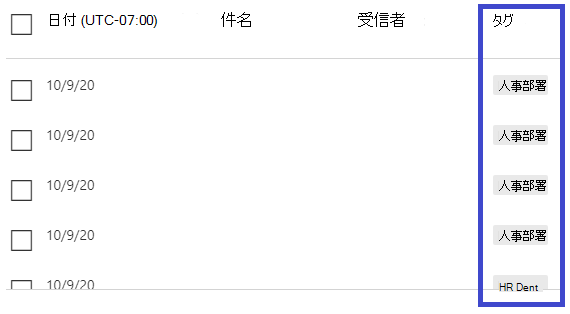

# 脅威エクスプローラーとリアルタイム検出Threat Explorer and Real-time detections

**適用対象****Applies to**
- [Microsoft Defender for Office 365 プラン 1 およびプラン 2Microsoft Defender for Office 365 plan 1 and plan 2](defender-for-office-365.md)
- [Microsoft 365 DefenderMicrosoft 365 Defender](../defender/microsoft-365-defender.md)

組織が microsoft [Defender for Office 365](defender-for-office-365.md)を持ち、必要 なアクセス許可を持っている場合は、エクスプローラーまたはリアルタイム検出 **(以前** のリアルタイム レポート *-* 新機能を参照してください)。 If your organization has [Microsoft Defender for Office 365](defender-for-office-365.md), and you have the [necessary permissions](#required-licenses-and-permissions), you have either **Explorer** or **Real-time detections** (formerly *Real-time reports* — [see what's new](#new-features-in-threat-explorer-and-real-time-detections)!). セキュリティ コンプライアンス センター&に移動し、[脅威の管理] に移動し、[**エクスプローラー**  ] または [リアルタイム検出 **] を選択します**。In the Security & Compliance Center, go to **Threat management**, and then choose **Explorer** _or_ **Real-time detections**.

 

****

|Microsoft Defender for Office 365プラン 2 では、次の情報が表示されます。With Microsoft Defender for Office 365 Plan 2, you see:|Microsoft Defender for Office 365プラン 1 では、次の情報が表示されます。With Microsoft Defender for Office 365 Plan 1, you see:|
|---|---|
|||
|

エクスプローラーまたはリアルタイム検出は、セキュリティ運用チームが脅威を効率的に調査して対応するのに役立ちます。Explorer or Real-time detections helps your security operations team investigate and respond to threats efficiently. レポートは次の図のようになります。The report resembles the following image:

![[脅威管理エクスプローラー] に \> 移動します。](../../media/cab32fa2-66f1-4ad5-bc1d-2bac4dbeb48c.png)

このレポートでは、次の機能を使用できます。With this report, you can:

- [セキュリティ機能によって検出されたマルウェアMicrosoft 365表示するSee malware detected by Microsoft 365 security features](#see-malware-detected-in-email-by-technology)
- [フィッシング URL を表示し、[評決データ] をクリックする](#view-phishing-url-and-click-verdict-data)[View phishing URL and click verdict data](#view-phishing-url-and-click-verdict-data)
- [エクスプローラーでビューから自動調査と](#start-automated-investigation-and-response)応答プロセスを開始する (Defender for Office 365プラン 2 のみ)[Start an automated investigation and response process from a view in Explorer](#start-automated-investigation-and-response) (Defender for Office 365 Plan 2 only)
- [悪意のあるメールの調査などInvestigate malicious email, and more](#more-ways-to-use-explorer-and-real-time-detections)

## 脅威ハンティング エクスペリエンスの改善Improvements to Threat Hunting Experience

### エクスプローラー/リアルタイム検出内の MDO アラートのアラート ID の概要 (プレビュー)Introduction of Alert ID for MDO alerts within Explorer/Real-time detections (Preview)

今日、アラートから脅威エクスプローラーに移動すると、エクスプローラー内でフィルター処理されたビューが開き、そのビューはアラート ポリシー ID (ポリシー ID はアラート ポリシーの一意の識別子) でフィルター処理されます。Today, if you navigate from an alert to Threat Explorer, it opens a filtered view within the Explorer, with the view filtered by Alert policy ID (policy ID being a unique identifier for an Alert policy).
脅威エクスプローラーとリアルタイム検出でアラート ID (以下のアラート ID の例を参照) を導入して、特定のアラートに関連するメッセージと電子メールの数を確認することで、この統合の関連性を高めます。We are making this integration more relevant by introducing the alert ID (see an example of alert ID below) in Threat Explorer and Real-time detections so that you see messages which are relevant to the specific alert, as well as a count of emails. また、メッセージがアラートの一部だったか、そのメッセージから特定のアラートに移動したのかも確認できます。You will also be able to see if a message was part of an alert, as well as navigate from that message to the specific alert.

アラート ID は、個々のアラートを表示するときに URL 内で使用できます。の例を示します `https://protection.office.com/viewalerts?id=372c9b5b-a6c3-5847-fa00-08d8abb04ef1` 。Alert ID is available within the URL when you are viewing an individual alert; an example being `https://protection.office.com/viewalerts?id=372c9b5b-a6c3-5847-fa00-08d8abb04ef1`.

> [!div class="mx-imgBorder"]
> 

> [!div class="mx-imgBorder"]
> 

### 試用版テナントのエクスプローラー (およびリアルタイム検出) のデータ保持と検索の制限を 7 日から 30 日間に延長する (プレビュー)Extending the Explorer (and Real-time detections) data retention and search limit for trial tenants from 7 to 30 days (Preview)

この変更の一環として、Office P1 および P2 試用版テナントの両方の Defender の脅威エクスプローラー/リアルタイム検出で、30 日間 (前の 7 日間から増加) のメール データを検索およびフィルター処理できます。As part of this change, you will be able to search for, and filter email data across 30 days (an increase from the previous 7 days) in Threat Explorer/Real-time detections for both Defender for Office P1 and P2 trial tenants.
これは、既に 30 日間のデータ保持および検索機能を備えた P1 および P2/E5 の両方の顧客の実稼働テナントには影響を与えかねない。This does not impact any production tenants for both P1 and P2/E5 customers, which already has the 30 day data retention and search capabilities.

### 脅威エクスプローラーのレコードのエクスポートの制限を更新しました (プレビュー)Updated limits for Export of records for Threat Explorer (Preview)

この更新プログラムの一環として、Threat Explorer からエクスポートできる電子メール レコードの行数が 9990 から 200,000 レコードに増加しました。As part of this update, the number of rows for Email records that can be exported from Threat Explorer is increased from 9990 to 200,000 records. 現在エクスポートできる列のセットは同じままですが、行数は現在の制限値から増加します。The set of columns that can be exported currently will remain the same, but the number of rows will increase from the current limit.

### 脅威エクスプローラーのタグTags in Threat Explorer

> [!NOTE]
> ユーザー タグ機能は [ *プレビュー] で*、すべてのユーザーが利用できるとは言え、変更される可能性があります。The user tags feature is in *Preview*, isn't available to everyone, and is subject to change. リリース スケジュールの詳細については、次のロードマップMicrosoft 365してください。For information about the release schedule, check out the Microsoft 365 roadmap.

ユーザー タグは、Microsoft Defender のユーザーの特定のグループを特定Office 365。User tags identify specific groups of users in Microsoft Defender for Office 365. ライセンスや構成などのタグの詳細については、「User tags」 [を参照してください](user-tags.md)。For more information about tags, including licensing and configuration, see [User tags](user-tags.md).

Threat Explorer では、次のエクスペリエンスでユーザー タグに関する情報を確認できます。In Threat Explorer, you can see information about user tags in the following experiences.

#### メール グリッド ビューEmail grid view

メール **グリッドの** [タグ] 列には、送信者または受信者のメールボックスに適用されたタグすべてが含まれます。The **Tags** column in the email grid contains all the tags that have been applied to the sender or recipient mailboxes. 既定では、優先アカウントのようなシステム タグが最初に表示されます。By default, system tags like priority accounts are shown first.

> [!div class="mx-imgBorder"]
> 

#### フィルター処理Filtering

タグはフィルターとして使用できます。You can use tags as a filter. 優先度の高いアカウントまたは特定のユーザー タグのシナリオ間でハントします。Hunt just across priority accounts or specific user tags scenarios. 特定のタグを持つ結果を除外することもできます。You can also exclude results that have certain tags. この機能を他のフィルターと組み合わせて、調査範囲を絞り込む。Combine this functionality with other filters to narrow your scope of investigation.

> [!div class="mx-imgBorder"]
> 

#### 電子メールの詳細の飛び出しEmail detail flyout

送信者と受信者の個々のタグを表示するには、件名を選択してメッセージの詳細のフライアウトを開きます。To view the individual tags for sender and recipient, select the subject to open the message details flyout. [概要 **] タブ** で、送信者と受信者のタグが電子メールに存在する場合は、個別に表示されます。On the **Summary** tab, the sender and recipient tags are shown separately, if they're present for an email.
送信者と受信者の個々のタグに関する情報は、エクスポートされた CSV データにも拡張され、これらの詳細は 2 つの個別の列で確認できます。The information about individual tags for sender and recipient also extends to exported CSV data, where you can see these details in two separate columns.

> [!div class="mx-imgBorder"]
> 

タグ情報は、URL クリック のフライアウトにも表示されます。Tags information is also shown in the URL clicks flyout. 表示するには、[フィッシング] または [すべてのメール] ビューに移動し **、[URL]** または [URL クリック] **タブに移動** します。個々の URL フライアウトを選択して、その URL のクリックに関する詳細 (そのクリックに関連付けられたタグを含む) を表示します。To view it, go to Phish or All Email view and then to the **URLs** or **URL Clicks** tab. Select an individual URL flyout to view additional details about clicks for that URL, including tags associated with that click.

### 更新されたタイムライン ビューUpdated Timeline View

> [!div class="mx-imgBorder"]
> 
>
[このビデオ](https://www.youtube.com/watch?v=UoVzN0lYbfY&list=PL3ZTgFEc7LystRja2GnDeUFqk44k7-KXf&index=4)を見て詳細をご確認ください。Learn more by watching [this video](https://www.youtube.com/watch?v=UoVzN0lYbfY&list=PL3ZTgFEc7LystRja2GnDeUFqk44k7-KXf&index=4).

## 脅威の検出エクスペリエンスの改善 (今後)Improvements to the threat hunting experience (upcoming)

### 電子メールの更新された脅威情報Updated threat information for emails

電子メール レコードのデータの精度と一貫性を高めるプラットフォームとデータ品質の向上に重点を置いて取り組み、We've focused on platform and data-quality improvements to increase data accuracy and consistency for email records. ZAP プロセスの一部として電子メールで実行されるアクションなど、配信前および配信後の情報を 1 つのレコードに統合する機能が強化されています。Improvements include consolidation of pre-delivery and post-delivery information, such as actions executed on an email as part of the ZAP process, into a single record. スパムの評決、エンティティ レベルの脅威 (悪意のある URL など)、最新の配信場所などの詳細も含まれています。Additional details like spam verdict, entity-level threats (for example, which URL was malicious), and latest delivery locations are also included.

これらの更新後、メッセージに影響を与える配信後のイベントに関係なく、メッセージごとに 1 つのエントリが表示されます。After these updates, you'll see a single entry for each message, regardless of the different post-delivery events that affect the message. アクションには、ZAP、手動修復 (管理者アクションを意味する)、動的配信などがあります。Actions can include ZAP, manual remediation (which means admin action), dynamic delivery, and so on.

マルウェアやフィッシングの脅威を表示する以外にも、メールに関連付けられたスパムの評決が表示されます。In addition to showing malware and phishing threats, you see the spam verdict associated with an email. 電子メール内で、対応する検出テクノロジと共に、電子メールに関連付けられているすべての脅威を確認します。Within the email, see all the threats associated with the email along with the corresponding detection technologies. 電子メールには、0、1、または複数の脅威を含む可能性があります。An email can have zero, one, or multiple threats. メール の飛び出しの [ **詳細** ] セクションに現在の脅威が表示されます。You'll see the current threats in the **Details** section of the email flyout. 複数の脅威 (マルウェアやフィッシングなど) の場合、[検出] 技術フィールドには、脅威を特定した検出テクノロジである脅威検出マッピングが表示されます。For multiple threats (such as malware and phishing), the **Detection tech** field shows the threat-detection mapping, which is the detection technology that identified the threat.

一連の検出テクノロジには、新しい検出方法とスパム検出テクノロジが含まれています。The set of detection technologies now includes new detection methods, as well as spam-detection technologies. 同じ一連の検出テクノロジを使用して、さまざまな電子メール ビュー (マルウェア、フィッシング、すべてのメール) で結果をフィルター処理できます。You can use the same set of detection technologies to filter the results across the different email views (Malware, Phish, All Email).

> [!NOTE]
> 評決分析は必ずしもエンティティに関連付けられているとは限りません。Verdict analysis might not necessarily be tied to entities. たとえば、電子メールはフィッシングまたはスパムとして分類されますが、フィッシング/スパムの評決でスタンプされた URL はありません。As an example, an email might be classified as phish or spam, but there are no URLs that are stamped with a phish/spam verdict. これは、フィルターが、評決を割り当てる前に、メールのコンテンツなどの詳細も評価する理由です。This is because the filters also evaluate content and other details for an email before assigning a verdict.

#### URL 内の脅威Threats in URLs

[メール の飛び出しの詳細] タブで、URL の特定の脅威を **確認** できます。脅威には、マルウェア *、フィッシング*、*スパム、* または *なしがあります*。 You can now see the specific threat for a URL on the email flyout **Details** tab. The threat can be *malware*, *phish*, *spam*, or *none*.)

> [!div class="mx-imgBorder"]
> 

### 更新されたタイムライン ビュー (今後)Updated timeline view (upcoming)

> [!div class="mx-imgBorder"]
> 

タイムライン ビューは、すべての配信イベントと配信後イベントを識別します。Timeline view identifies all delivery and post-delivery events. この情報には、これらのイベントのサブセットについて、その時点で特定された脅威に関する情報が含まれます。It includes information about the threat identified at that point of time for a subset of these events. タイムライン ビューでは、追加のアクション (ZAP や手動修復など) に関する情報も、そのアクションの結果と共に提供されます。Timeline view also provides information about any additional action taken (such as ZAP or manual remediation), along with the result of that action. タイムライン ビューの情報には、次の情報が含まれます。Timeline view information includes:

- **ソース:** イベントのソース。**Source:** Source of the event. 管理者/システム/ユーザーを指定できます。It can be admin/system/user.
- **イベント:** 元の配信、手動修復、ZAP、申請、動的配信などのトップ レベルのイベントが含まれます。**Event:** Includes top-level events like original delivery, manual remediation, ZAP, submissions, and dynamic delivery.
- **アクション:** ZAP または管理アクションの一部として実行された特定のアクション (たとえば、ソフト削除)。**Action:** The specific action that was taken either as part of ZAP or admin action (for example, soft delete).
- **脅威:** その時点で特定された脅威 (マルウェア、フィッシング、スパム) をカバーします。**Threats:** Covers the threats (malware, phish, spam) identified at that point of time.
- **結果/詳細:** ZAP/admin アクションの一部として実行されたかどうかなど、アクションの結果に関する詳細。**Result/Details:** More information about the result of the action, such as whether it was performed as part of ZAP/admin action.

### 元の配信場所と最新の配信場所Original and latest delivery location

現在、メール グリッドと電子メール のフライアウトで配信場所を表示しています。Currently, we surface delivery location in the email grid and email flyout. [**配信場所]** フィールドの名前が [元の配信場所 \**_] _に_*変更されています。また、別のフィールド _最新の\* 配信場所 _を導入しています_\*\*。The **Delivery location** field is getting renamed **_Original delivery location_*_. And we're introducing another field, _*_Latest delivery location_**.

**元の配信場所** では、メールが最初に配信された場所に関する詳細が表示されます。**Original delivery location** will give more information about where an email was delivered initially. **最新の配信場所** には *、ZAP* や削除済みアイテムへの移動のような管理アクションなど、システムアクションの後にメールが届 *いた場所が表示されます*。**Latest delivery location** will state where an email landed after system actions like *ZAP* or admin actions like *Move to deleted items*. 最新の配信場所は、メッセージの配信後の最後の既知の場所、またはシステム/管理者のアクションを管理者に伝える目的です。Latest delivery location is intended to tell admins the message's last-known location post-delivery or any system/admin actions. 電子メールにはエンド ユーザーのアクションは含めかねない。It doesn't include any end-user actions on the email. たとえば、ユーザーがメッセージを削除した場合、またはメッセージをアーカイブ/pst に移動した場合、メッセージ "配信" の場所は更新されません。For example, if a user deleted a message or moved the message to archive/pst, the message "delivery" location won't be updated. ただし、システム アクションによって場所が更新された場合 (たとえば、ZAP が検疫に移動する電子メールなど)、最新の配信場所は "検疫" として表示されます。But if a system action updated the location (for example, ZAP resulting in an email moving to quarantine), **Latest delivery location** would show as "quarantine."

> [!div class="mx-imgBorder"]
> 

> [!NOTE]
> 配信場所と配信アクションが"不明"と表示される場合があります。There are a few cases where **Delivery location** and **Delivery action** may show as "unknown":
>
> - メッセージ **が配信された** 場合、配信場所は"配信済み"、配信場所は "不明" と表示される場合がありますが、受信トレイ ルールはメッセージを受信トレイまたは迷惑メール フォルダーではなく既定のフォルダー (下書きやアーカイブなど) に移動します。You might see **Delivery location** as "delivered" and **Delivery location** as "unknown" if the message was delivered, but an Inbox rule moved the message to a default folder (such as Draft or Archive) instead of to the Inbox or Junk Email folder.
>
> - **管理者/システム** アクション (ZAP など) が試行されたが、メッセージが見つからなかった場合、最新の配信場所が不明になる可能性があります。**Latest delivery location** can be unknown if an admin/system action (such as ZAP) was attempted, but the message wasn't found. 通常、アクションは、ユーザーがメッセージを移動または削除した後に実行されます。Typically, the action happens after the user  moved or deleted the message. このような場合は、タイムライン ビューの **[結果/詳細]** 列を確認します。In such cases, verify the **Result/Details** column in timeline view. "ユーザーが移動または削除したメッセージ" というステートメントを探します。Look for the statement "Message moved or deleted by the user."

> [!div class="mx-imgBorder"]
> 

### その他のアクションAdditional actions

*電子メールの* 配信後に追加のアクションが適用された。*Additional actions* were applied after delivery of the email. *ZAP、* 手動修復 *(ソフト* 削除などの管理者が実行したアクション)、動的配信、および再処理 *(さかのぼ* って良好と検出された電子メールの場合) が含まれます。They can include *ZAP*, *manual remediation* (action taken by an Admin such as soft delete), *dynamic delivery*, and *reprocessed* (for an email that was retroactively detected as good).

> [!NOTE]
> 保留中の変更の一環として、[配信アクション] フィルターに現在表示されている "削除済み" の値は削除されます。As part of the pending changes, the "Removed by ZAP" value currently surfaced in the Delivery Action filter is going away. 追加アクションを通じて ZAP の試行ですべてのメールを **検索する方法があります**。You'll have a way to search for all email with the ZAP attempt through **Additional actions**.

> [!div class="mx-imgBorder"]
> 

### システムオーバーライドSystem overrides

*システムオーバーライドを使用* すると、メッセージの意図した配信場所に対して例外を作成できます。*System overrides* enable you to make exceptions to the intended delivery location of a message. システムによって提供される配信場所は、フィルター スタックによって識別される脅威や他の検出に基づいて上書きします。You override the delivery location provided by the system, based on the threats and other detections identified by the filtering stack. システムの上書きは、テナントまたはユーザー ポリシーを使用して設定して、ポリシーによって提案されているメッセージを配信できます。System overrides can be set through tenant or user policy to deliver the message as suggested by the policy. 上書きでは、ユーザーが設定した送信者ポリシーセットの範囲が広いなど、構成のギャップによる悪意のあるメッセージの意図しない配信セーフ識別できます。Overrides can identify unintentional delivery of malicious messages due to configurations gaps, such as an overly broad Safe Sender policy set by a user. これらのオーバーライド値には、次の値を指定できます。These override values can be:

- ユーザー ポリシーで許可: ユーザーがメールボックス レベルでポリシーを作成し、ドメインまたは送信者を許可します。Allowed by user policy: A user creates policies at the mailbox level to allows domains or senders.

- ユーザー ポリシーでブロック: ユーザーがメール ボックス レベルでポリシーを作成して、ドメインまたは送信者をブロックします。Blocked by user policy: A user creates policies at the mail box level to block domains or senders.

- 組織ポリシーで許可: 組織のセキュリティ チームは、組織内のユーザーに送信者とドメインを許可するポリシーまたは Exchange メール フロー ルール (トランスポート ルールとも呼ばれる) を設定します。Allowed by org policy: The organization's security teams set policies or Exchange mail flow rules (also known as transport rules) to allow senders and domains for users in their organization. これは、一連のユーザーまたは組織全体に対して使用できます。This can be for a set of users or the entire organization.

- 組織ポリシーでブロック: 組織のセキュリティ チームは、組織内のユーザーの送信者、ドメイン、メッセージ言語、または送信元 IP をブロックするポリシーまたはメール フロー ルールを設定します。Blocked by org policy: The organization's security teams set policies or mail flow rules to block senders, domains, message languages, or source IPs for users in their organization. これは、一連のユーザーまたは組織全体に適用できます。This can be applied to a set of users or the entire organization.

- 組織ポリシーによってブロックされるファイル拡張子: 組織のセキュリティ チームは、マルウェア対策ポリシー設定を通じてファイル名の拡張子をブロックします。File extension blocked by org policy: An organization's security team blocks a file name extension through the anti-malware policy settings. これらの値は、調査に役立つメールの詳細に表示されます。These values will now be displayed in email details to help with investigations. Secops チームは、リッチ フィルター機能を使用して、ブロックされたファイル拡張子をフィルター処理することもできます。Secops teams can also use the rich-filtering capability to filter on blocked file extensions.

> [!div class="mx-imgBorder"]
> 

### URL とクリックエクスペリエンスの改善Improvements for the URL and clicks experience

改善点は次のとおりです。The improvements include:

- URL フライアウトの [クリック] セクションに、クリックされた完全な URL  (URL の一部であるクエリ パラメーターを含む) を表示します。Show the full clicked URL (including any query parameters that are part of the URL) in the **Clicks** section of the URL flyout. 現在、URL ドメインとパスはタイトル バーに表示されます。Currently, the URL domain and path appear in the title bar. その情報を拡張して、完全な URL を表示します。We're extending that information to show the full URL.

- URL フィルター *(URL* とURL ドメインと URL ドメイン、パスの間の *修正):* 更新プログラムは、URL/クリックの評決を含むメッセージの検索に影響します。Fixes across URL filters (*URL* versus *URL domain* versus *URL domain and path*): The updates affect searching for messages that contain a URL/click verdict. プロトコルに依存しない検索のサポートが有効になっているので、使用せずに URL を検索できます `http` 。We enabled support for protocol-agnostic searches, so you can search for a URL without using `http`. 既定では、別の値が明示的に指定されていない限り、URL 検索は http にマップされます。By default, the URL search maps to http, unless another value is explicitly specified. 例:For example:
  - URL、URL ドメイン、URL ドメイン、および URL の [ドメイン] および [パス] フィルター フィールドで、プレフィックスの付きまたは指定 `http://` **なしで** 検索します。  Search with and without the `http://` prefix in the **URL**, **URL Domain**, and **URL Domain and Path** filter fields. 検索は同じ結果を表示する必要があります。The searches should show the same results.
  - URL でプレフィックス `https://` を検索 **します**。Search for the `https://` prefix in **URL**. 値を指定しない場合、プレフィックス `http://` が使用されます。When no value is specified, the `http://` prefix is assumed.
  - `/` URL パス **、URL** ドメイン **、URL** ドメイン、およびパス フィールドの先頭と末尾 **で無視** されます。`/` is ignored at the beginning and end of the **URL path**, **URL Domain**, **URL domain and path** fields. `/` URL フィールドの末尾 **は無視** されます。`/` at the end of the **URL** field is ignored.

### フィッシングの信頼レベルPhish confidence level

フィッシングの信頼度は、電子メールが "フィッシング" として分類された信頼度を識別するのに役立ちます。Phish confidence level helps identify the degree of confidence with which an email was categorized as "phish." 2 つの可能な値は *、High と Normal* *です*。The two possible values are *High* and *Normal*. 最初の段階では、このフィルターは、脅威エクスプローラーの [フィッシング] ビューでのみ使用できます。In the initial stages, this filter will be available only in the Phish view of Threat Explorer.

### ZAP URL シグナルZAP URL signal

ZAP URL シグナルは、通常、メールがフィッシングとして識別され、配信後に削除された ZAP フィッシング アラート シナリオで使用されます。The ZAP URL signal is typically used for ZAP Phish alert scenarios where an email was identified as Phish and removed after delivery. このシグナルは、アラートとエクスプローラーの対応する結果を接続します。This signal connects the alert with the corresponding results in Explorer. アラートの IOC の 1 つです。It's one of the IOCs for the alert.

狩猟プロセスを改善するために、脅威エクスプローラーとリアルタイム検出を更新して、狩猟のエクスペリエンスをより一貫性のあるものにしました。To improve the hunting process, we've updated Threat Explorer and Real-time detections to make the hunting experience more consistent. 変更の概要は次のとおりです。The changes are outlined here:

- [タイムゾーンの改善Timezone improvements](#timezone-improvements)
- [更新プロセスでの更新Update in the refresh process](#update-in-the-refresh-process)
- [フィルターに追加するグラフのドリルダウンChart drilldown to add to filters](#chart-drilldown-to-add-to-filters)
- [製品情報の更新でIn product information updates](#in-product-information-updates)

### ユーザー タグによるフィルターFilter by user tags

システムまたはカスタム のユーザー タグを並べ替え、フィルター処理して、脅威の範囲をすばやく把握できます。You can now sort and filter on system or custom user tags to quickly grasp the scope of threats. 詳細については、「ユーザー タグ [」を参照してください](user-tags.md)。To learn more, see [User tags](user-tags.md).

> [!IMPORTANT]
> ユーザー タグによるフィルター処理と並べ替えは、現在パブリック プレビューに表示されています。Filtering and sorting by user tags is currently in public preview. この機能は、商用リリース前に大幅に変更される可能性があります。This functionality may be substantially modified before it's commercially released. Microsoft は、明示または黙示を問わず、その情報に関して一切の保証を行いません。Microsoft makes no warranties, express or implied, with respect to the information provided about it.

> [!div class="mx-imgBorder"]
> ![エクスプローラーの [タグ] 列](../../media/threat-explorer-tags.png)

### タイムゾーンの改善Timezone improvements

ポータルの電子メール レコードのタイム ゾーンとエクスポートされたデータが表示されます。You'll see the time zone for the email records in the Portal as well as for Exported data. メール グリッド、詳細フライアウト、メール タイムライン、類似メールなど、エクスペリエンス全体で表示されます。結果セットのタイム ゾーンは明確です。It will be visible across experiences like Email Grid, Details flyout, Email Timeline, and Similar Emails, so the time zone for the result set is clear.

> [!div class="mx-imgBorder"]
> 

### 更新プロセスでの更新Update in the refresh process

一部のユーザーは、自動更新 (たとえば、日付を変更するとすぐにページが更新されます) と手動更新 (他のフィルターの場合) との混同についてコメントしています。Some users have commented about confusion with automatic refresh (for example, as soon as you change the date, the page refreshes) and manual refresh (for other filters). 同様に、フィルターを削除すると、自動更新が行います。Similarly, removing filters leads to automatic refresh. クエリの変更中にフィルターを変更すると、一貫性のない検索エクスペリエンスが発生する可能性があります。Changing filters while modifying the query can cause inconsistent search experiences. これらの問題を解決するために、手動フィルターメカニズムに移行します。To resolve these issues, we're moving to a manual-filtering mechanism.

ユーザーは、エクスペリエンスの観点から、(フィルター セットと日付から) さまざまな範囲のフィルターを適用および削除し、クエリを定義した後に結果をフィルター処理する更新ボタンを選択できます。From an experience standpoint, the user can apply and remove the different range of filters (from the filter set and date) and select the refresh button to filter the results after they've defined the query. 更新ボタンも画面で強調されます。The refresh button is also now emphasized on the screen. 関連するツールヒントと製品内ドキュメントも更新しました。We've also updated the related tooltips and in-product documentation.

> [!div class="mx-imgBorder"]
> ![[更新] を選択して結果をフィルター処理する](../../media/ManualRefresh.png)

### フィルターに追加するグラフのドリルダウンChart drilldown to add to filters

凡例の値をグラフに追加して、フィルターとして追加できます。You can now chart legend values to add them as filters. [更新] **ボタンを** 選択して結果をフィルター処理します。Select the **Refresh** button to filter the results.

> [!div class="mx-imgBorder"]
> 

### 製品内情報の更新In-product information updates

グリッド内の検索結果の総数など、製品内で追加の詳細が利用可能になります (以下を参照)。Additional details are now available within the product, such as the total number of search results within the grid (see below). フィルター、検索エクスペリエンス、および結果セットに関する詳細を提供するために、ラベル、エラー メッセージ、およびツールヒントが改善されました。We've improved labels, error messages, and tooltips to provide more information about the filters, search experience, and result set.

> [!div class="mx-imgBorder"]
> 

## Threat Explorer の拡張機能Extended capabilities in Threat Explorer

### 上位の対象ユーザーTop targeted users

今日、メールの [マルウェア] ビューの [トップ マルウェア ファミリ] セクションで、対象ユーザーの上位の一覧 **が公開** されています。Today we expose the list of the top targeted users in the Malware view for emails, in the **Top Malware Families** section. このビューは、[フィッシング] ビューと [すべてのメール] ビューでも拡張されます。We'll be extending this view in the Phish and All Email views as well. 上位 5 人の対象ユーザーと、対応するビューの各ユーザーの試行回数を確認できます。You'll be able to see the top-five targeted users, along with the number of attempts for each user for the corresponding view. たとえば、[フィッシング] ビューには、フィッシングの試行回数が表示されます。For example, for Phish view, you'll see the number of Phish attempts.

対象ユーザーのリストを最大 3,000 人までエクスポートし、各電子メール ビューのオフライン分析の試行回数をエクスポートできます。You'll be able to export the list of targeted users, up to a limit of 3,000, along with the number of attempts for offline analysis for each email view. さらに、試行回数 (下の図では 13 回など) を選択すると、Threat Explorer でフィルター処理されたビューが開き、そのユーザーのメールや脅威の詳細を確認できます。In addition, selecting the number of attempts (for example, 13 attempts in the image below) will open a filtered view in Threat Explorer, so you can see more details across emails and threats for that user.

> [!div class="mx-imgBorder"]
> 

### Exchangeトランスポート ルールExchange transport rules

データエンリッチメントの一環として、メッセージに適用Exchangeさまざまなトランスポート ルール (ETR) を表示できます。As part of data enrichment, you'll be able to see all the different Exchange transport rules (ETR) that were applied to a message. この情報は、[メール] グリッド ビューで使用できます。This information will be available in the Email grid view. 表示するには、グリッドで **[列のオプション**] を選択し、列 **Exchangeから**[トランスポート ルールの追加] を選択します。To view it,  select **Column options** in the grid and then **Add Exchange Transport Rule** from the column options. また、メールの [詳細] **フライ** アウトにも表示されます。It will also be visible on the **Details** flyout in the email.

GUID と、メッセージに適用されたトランスポート ルールの名前の両方を確認できます。You'll be able to see both the GUID and the name of the transport rules that were applied to the message. トランスポート ルールの名前を使用してメッセージを検索できます。You'll be able to search for the messages by using the name of the transport rule. これは"Contains" 検索で、部分的な検索も実行できます。This is a "Contains" search, which means you can do partial searches as well.

> [!IMPORTANT]
> ETR 検索と名前の可用性は、割り当てられている特定の役割によって異なっています。ETR search and name availability depend on the specific role that's assigned to you. ETR 名と検索を表示するには、次のいずれかの役割/アクセス許可が必要です。You need to have one of the following roles/permissions to view the ETR names and search. これらの役割が割り当てられていない場合は、トランスポート ルールの名前を表示したり、ETR 名を使用してメッセージを検索したりしません。If you don't have any of these roles assigned to you, you can't see the names of the transport rules or search for messages by using ETR names. ただし、[電子メールの詳細] に ETR ラベルと GUID 情報が表示される場合があります。However, you could see the ETR label and GUID information in the Email Details. メール グリッド、電子メール フライアウト、フィルター、およびエクスポートの他のレコード表示エクスペリエンスは影響を受け取ります。Other record-viewing experiences in Email Grids, Email flyouts, Filters, and Export are not affected.
>
> - EXO のみ - データ損失防止: すべてEXO Only - Data Loss Prevention: All
> - EXO のみ - O365SupportViewConfig: AllEXO Only - O365SupportViewConfig: All
> - Microsoft Azure Active Directoryまたは EXO - セキュリティ管理者: すべてMicrosoft Azure Active Directory or EXO - Security Admin: All
> - AAD または EXO - セキュリティ リーダー: AllAAD or EXO - Security Reader: All
> - EXO のみ - トランスポート ルール: AllEXO Only - Transport Rules: All
> - EXO のみ - View-Only構成: すべてEXO Only - View-Only Configuration: All
>
> 電子メール グリッド、詳細フライアウト、およびエクスポート CSV 内で、ETRs には、次に示すように名前/GUID が表示されます。Within the email grid, Details flyout, and Exported CSV, the ETRs are presented with a Name/GUID as shown below.
>
> > [!div class="mx-imgBorder"]
> > 

### 受信コネクタInbound connectors

コネクタは、電子メールが組織または組織との間でどのように流れるMicrosoft 365のOffice 365です。Connectors are a collection of instructions that customize how your email flows to and from your Microsoft 365 or Office 365 organization. この機能を使用すると、セキュリティ制限またはコントロールを適用できます。They enable you to apply any security restrictions or controls. Threat Explorer 内で、電子メールに関連するコネクタを表示し、コネクタ名を使用して電子メールを検索できます。Within Threat Explorer, you can now view the connectors that are related to an email and search for emails by using connector names.

コネクタの検索は、実際には "contains" で、部分的なキーワード検索も機能する必要があります。The search for connectors is "contains" in nature, which means partial keyword searches should work as well. メイン グリッド ビュー、詳細フライアウト、およびエクスポート CSV 内で、コネクタは次のように Name/GUID 形式で表示されます。Within the Main grid view, the Details flyout, and the Exported CSV, the connectors are shown in the Name/GUID format as shown here:

> [!div class="mx-imgBorder"]
> 

## 脅威エクスプローラーとリアルタイム検出の新機能New features in Threat Explorer and Real-time detections

- [偽装ユーザーとドメインに送信されたフィッシングメールを表示するView phishing emails sent to impersonated users and domains](#view-phishing-emails-sent-to-impersonated-users-and-domains)
- [メール ヘッダーのプレビューとメール本文のダウンロードPreview email header and download email body](#preview-email-header-and-download-email-body)
- [メールのタイムラインEmail timeline](#email-timeline)
- [URL クリック データのエクスポートExport URL click data](#export-url-click-data)

### 偽装ユーザーとドメインに送信されたフィッシングメールを表示するView phishing emails sent to impersonated users and domains

偽装ユーザーであるユーザーとドメインに対するフィッシング詐欺の試行を識別するには、保護するユーザーの一覧に追加 *する必要があります*。To identify phishing attempts against users and domains that are impersonated users must be added to the list of *Users to protect*. ドメインの場合、管理者は組織 *ドメインを有効* にするか、ドメイン名をドメインに追加して保護 *する必要があります*。For domains, admins must either enable *Organization domains*, or add a domain name to *Domains to protect*. 保護するドメインは、[偽装] セクションの [フィッシング対策ポリシー *]* ページ *に表示* されます。The domains to protect are found on the *Anti-Phishing policy page* in the *Impersonation* section.

フィッシング メッセージを確認し、偽装されたユーザーまたはドメインを検索するには、エクスプローラーの [メール > [フィッシング] ビューを](threat-explorer-views.md) 使用します。To review phish messages and search for impersonated users or domains, use the [Email > Phish view](threat-explorer-views.md) of Explorer.

この例では、Threat Explorer を使用します。This example uses Threat Explorer.

1. [セキュリティ [コンプライアンス センター& (](https://protection.office.com) ) で、[脅威の管理] >エクスプローラー (またはリアルタイムの検出) https://protection.office.com) を選択します。In the [Security & Compliance Center](https://protection.office.com) (https://protection.office.com), choose Threat management > Explorer (or Real-time detections).

2. [表示] メニューの [メールとフィッシング>選択します。In the View menu, choose Email > Phish.

   ここでは、偽装ドメイン **または偽装\*\*\*\*ユーザーを選択できます**。Here you can choose **impersonated domain** or **impersonated user**.

3. **[偽装** された **ドメイン] を** 選択し、テキスト ボックスに保護されたドメインを入力します。**EITHER** select **Impersonated domain**, and then type a protected domain in the textbox.

   たとえば、contoso、contoso.com、contoso.com.au など、保護された *ドメイン名を検索します*。For example, search for protected domain names like *contoso*, *contoso.com*, or *contoso.com.au*.

4. [メール] タブの [メール] タブの [件名] >を選択すると、[偽装ドメイン] や [検出された場所] など、その他の偽装情報が表示されます。Select the Subject of any message under the Email tab > Details tab to see additional impersonation information like Impersonated Domain / Detected location.

    **OR****OR**

    [ **偽装ユーザー] を** 選択し、保護されたユーザーの電子メール アドレスをテキスト ボックスに入力します。Select **Impersonated user** and type a protected user's email address in the textbox.

    > [!TIP]
    > **最適な結果を得** るためには、完全 *なメール アドレスを使用して* 保護されたユーザーを検索します。**For best results**, use *full email addresses* to search protected users. たとえば、ユーザーの偽装を調査する場合など、保護されたユーザーを検索すると、より迅速 *かつ* firstname.lastname@contoso.com 見つけ出されます。You will find your protected user quicker and more successfully if you search for *firstname.lastname@contoso.com*, for example, when investigating user impersonation. 保護されたドメインを検索すると、ルート ドメイン (たとえば、contoso.com) とドメイン名 *(contoso)* が取得されます。When searching for a protected domain the search will take the root domain (contoso.com, for example), and the domain name (*contoso*). ルート ドメイン を検索すると、contoso.com の偽装とドメイン *名 contoso の contoso.com* 両方が返 *されます*。Searching for the root domain *contoso.com* will return both impersonations of *contoso.com* and the domain name *contoso*.

5. [電子メール **] タブの**[**詳細]** タブの [任意のメッセージの件名] を選択して、ユーザーまたはドメインに関する追加の偽装情報と検出された場所  >  *を表示します*。Select the **Subject** of any message under **Email tab** > **Details tab** to see additional impersonation information about the user or domain, and the *Detected location*.

    :::image type="content" source="../../media/threat-ex-views-impersonated-user-image.png" alt-text="検出場所と検出された脅威 (ここでは、ユーザーのフィッシング偽装) を示す保護されたユーザーの脅威エクスプローラーの詳細ウィンドウ。":::

> [!NOTE]
> 手順 3 または 5 で、[検出テクノロジ]を選択し、[偽装ドメイン] または [偽装ユーザー] をそれぞれ選択すると、[メール] タブの [詳細] タブのユーザーまたはドメインに関する情報が表示され、[検出された場所] は[フィッシング対策ポリシー] ページに表示されるユーザーまたはドメインに関連するメッセージにのみ表示されます。   >    In step 3 or 5, if you choose **Detection Technology** and select **Impersonation domain** or **Impersonation user** respectively, the information in the **Email tab** > **Details tab** about the user or domain, and the *Detected location* will be shown only on the messages that are related to the user or domain listed on the *Anti-Phishing policy* page.

### メール ヘッダーのプレビューとメール本文のダウンロードPreview email header and download email body

これで、メール ヘッダーをプレビューし、脅威エクスプローラーで電子メール本文をダウンロードできます。You can now preview an email header and download the email body in Threat Explorer. 管理者は、ダウンロードしたヘッダー/電子メール メッセージの脅威を分析できます。Admins can analyze downloaded headers/email messages for threats. 電子メール メッセージをダウンロードすると情報が危険にさらされる可能性があるため、このプロセスは役割ベースのアクセス制御 (RBAC) によって制御されます。Because downloading email messages can risk exposure of information, this process is controlled by role-based access control (RBAC). すべての電子メール *メッセージ* ビューでメールをダウンロードする機能を付与するには、新しい役割である Preview を別の役割グループ (セキュリティ操作やセキュリティ管理者など) に追加する必要があります。A new role, *Preview*, must be added to another role group (such as Security Operations or Security Administrator) to grant the ability to download mails in all-email messages view. ただし、電子メール ヘッダーを表示しても、追加の役割は必要ありません (脅威エクスプローラーでメッセージを表示するために必要な役割以外)。However, viewing the email header does not require any additional role (other than what is required to view messages in Threat Explorer).

エクスプローラーとリアルタイム検出では、電子メール メッセージの着陸場所の詳細な画像を提供する新しいフィールドも取得します。Explorer and Real-time detections will also get new fields that provide a more complete picture of where your email messages land. これらの変更により、Security Ops のハンティングが容易になります。These changes  make hunting easier for Security Ops. しかし、主な結果は、問題のある電子メール メッセージの場所を一目で知ることができます。But the main result is you can know the location of problem email messages at a glance.

これはどのように行われますか?How is this done? 配信の状態は、次の 2 つの列に分かれました。Delivery status is now broken out into two columns:

- **配信アクション** - 電子メールの状態。**Delivery action** - Status of the email.
- **配信場所** - 電子メールがルーティングされた場所。**Delivery location** - Where the email was routed.

*配信アクション* は、既存のポリシーまたは検出のために電子メールで実行されるアクションです。*Delivery action* is the action taken on an email due to existing policies or detections. 電子メールに対して実行できる操作を次に示します。Here are the possible actions for an email:

 

****

|配信Delivered|迷惑メールJunked|BlockedBlocked|置換Replaced|
|---|---|---|---|
|メールはユーザーの受信トレイまたはフォルダーに配信され、ユーザーはメールにアクセスできます。Email was delivered to the inbox or folder of a user, and the user can access it.|電子メールはユーザーの迷惑メールまたは削除済みフォルダーに送信され、ユーザーはアクセスできます。Email was sent to the user's Junk  or Deleted folder, and the user can access it.|検疫されたメール、失敗したメール、または削除されたメール。Emails that are quarantined, that failed, or were dropped. これらのメールには、ユーザーがアクセスできません。These mails are inaccessible to the user.|電子メールには、悪意のある添付ファイル.txt悪意のあるファイルに置き換えがありました。Email had malicious attachments replaced by .txt files that state the attachment was malicious.|
|

ユーザーが表示できる機能と表示できない機能を次に示します。Here is what the user can and can't see:

 

****

|エンド ユーザーがアクセス可能Accessible to end users|エンド ユーザーにアクセスできないInaccessible to end users|
|---|---|
|配信Delivered|BlockedBlocked|
|迷惑メールJunked|置換Replaced|
|

**配信場所** は、配信後に実行されるポリシーと検出の結果を示します。**Delivery location** shows the results of policies and detections that run post-delivery. [配信] アクション **_にリンクされています_**。It's linked to **_Delivery action_**. 次の値を使用できます。These are the possible values:

- *受信トレイまたはフォルダー*: 電子メールは受信トレイまたはフォルダー内にあります (メール ルールに従います)。*Inbox or folder*: The email is in the inbox or a folder (according to your email rules).
- *オンプレミスまたは外部*: メールボックスはクラウド上に存在しませんが、オンプレミスです。*On-prem or external*: The mailbox doesn't exist on cloud but is on-premises.
- *迷惑メール* フォルダー: 電子メールはユーザーの迷惑メール フォルダーにあります。*Junk folder*: The email is in a user's Junk folder.
- *削除済みアイテム フォルダー*: ユーザーの [削除済みアイテム] フォルダー内の電子メール。*Deleted items folder*: The email in a user's Deleted items folder.
- *検疫*: 電子メールは検疫中であり、ユーザーのメールボックスには含めではありません。*Quarantine*: The email is in quarantine and not in a user's mailbox.
- *Failed*: 電子メールがメールボックスに届きに失敗しました。*Failed*: The email failed to reach the mailbox.
- *ドロップ*: メール フローのどこかでメールが失われました。*Dropped*: The email got lost somewhere in the mail flow.

### メールのタイムラインEmail timeline

メール **タイムラインは、** 管理者の検索エクスペリエンスを向上させる新しいエクスプローラー機能です。The **Email timeline** is a new Explorer feature that improves the hunting experience for admins. イベントの理解を試みるさまざまな場所のチェックに費やされる時間を削減します。It cuts the time spent checking different locations to try to understand the event. 電子メールが到着すると同時に複数のイベントが発生または近い場合、それらのイベントはタイムライン ビューに表示されます。When multiple events happen at or close to the same time an email arrives, those events are displayed in a timeline view. メールの配信後に発生する一部のイベントは、[特別なアクション] **列にキャプチャ** されます。Some events that happen to your email post-delivery are captured in the **Special action** column. 管理者は、タイムラインの情報と、配信後のメールに対して実行される特別なアクションを組み合わせて、ポリシーの動作、メールが最終的にルーティングされた場所、場合によっては最終的な評価の結果を把握できます。Admins can combine  information from the timeline with the special action taken on the mail post-delivery to get insight into how their policies work, where the mail was finally routed, and, in some cases, what the final assessment was.

詳細については、「ネットワークで配信された悪意のある電子メールを調査して修復[する」を参照](investigate-malicious-email-that-was-delivered.md)Office 365。For more information, see [Investigate and remediate malicious email that was delivered in Office 365](investigate-malicious-email-that-was-delivered.md).

### URL クリック データのエクスポートExport URL click data

URL クリックのレポートを Microsoft Excelにエクスポートして、ネットワーク メッセージ **ID** を表示し、[評決] をクリックし、URL クリック トラフィックの発生場所を説明できます。You can now export reports for URL clicks to Microsoft Excel to view their **network message ID** and **click verdict**, which helps explain where your URL click traffic originated. 動作方法は次のとおりです。 [クイック起動バーの脅威Office 365で、次のチェーンに従います。Here's how it works: In Threat Management on the Office 365 quick-launch bar, follow this chain:

**エクスプローラー** \>**フィッシングの表示** \>**クリック数** \>**トップ URL または** **URL トップ クリックは** \> 、任意のレコードを選択して URL フライアウトを開きます。**Explorer** \> **View Phish** \> **Clicks** \> **Top URLs** or **URL Top Clicks** \> select any record to open the URL flyout.

リストで URL を選択すると、フライアウト パネルに新しい **[** エクスポート] ボタンが表示されます。When you select a URL in the list, you'll see a new **Export** button on the fly-out panel. レポートを簡単にするために、このボタンを使用して、Excelスプレッドシートにデータを移動します。Use this button to move data to an Excel spreadsheet for easier reporting.

リアルタイム検出レポートで同じ場所に移動するには、次のパスに従います。Follow this path to get to the same location in the Real-time detections report:

**エクスプローラー** \>**リアルタイム検出** \>**フィッシングの表示** \>**URL** \>**[トップ URL]** **または [トップ クリック**] [任意のレコードを選択] をクリックして、[クリック] タブに移動して URL の飛び出 \> \> し **を開** きます。**Explorer** \> **Real-time detections** \> **View Phish** \> **URLs** \> **Top URLs** or **Top Clicks** \> Select any record to open the URL flyout \> navigate to the **Clicks** tab.

> [!TIP]
> ネットワーク メッセージ ID は、エクスプローラーまたは関連するサード パーティ製ツールを使用して ID を検索すると、クリックを特定のメールにマップします。The Network Message ID maps the click back to specific mails when you search on the ID through Explorer or associated third-party tools. このような検索では、クリック結果に関連付けられた電子メールが識別されます。Such searches identify the email associated with a click result. 関連付けされたネットワーク メッセージ ID を使用すると、より迅速かつ強力な分析が可能になります。Having the correlated Network Message ID makes for quicker and more powerful analysis.

> [!div class="mx-imgBorder"]
> ![エクスプローラーの [クリック] タブ](../../media/tp_ExportClickResultAndNetworkID.png)

## テクノロジによって電子メールで検出されたマルウェアを確認するSee malware detected in email by technology

電子メールで検出されたマルウェアが、電子メール テクノロジによって並べ替Microsoft 365します。Suppose you want to see malware detected in email sorted by Microsoft 365 technology. これを行うには、エクスプローラーの [[電子>マルウェア](threat-explorer-views.md#email--malware) ] ビュー (またはリアルタイム検出) を使用します。To do this, use the [Email > Malware](threat-explorer-views.md#email--malware) view of Explorer (or Real-time detections).

1. セキュリティ コンプライアンス センター ( &) で <https://protection.office.com> 、[脅威 **管理** \> **エクスプローラー** ] (または [ **リアルタイムの検出] ) を選択します**。In the Security & Compliance Center (<https://protection.office.com>), choose **Threat management** \> **Explorer** (or **Real-time detections**). (この例では、エクスプローラーを使用します)。(This example uses Explorer.)

2. [表示] **メニューの** [メール マルウェア] **を** \> **選択します**。In the **View** menu, choose **Email** \> **Malware**.

   > [!div class="mx-imgBorder"]
   > ![エクスプローラーの [表示] メニュー](../../media/ExplorerViewEmailMalwareMenu.png)

3. [送信者 **] を** クリックし、[基本検出 **テクノロジ]** \> **を選択します**。Click **Sender**, and then choose **Basic** \> **Detection technology**.

   検出テクノロジは、レポートのフィルターとして利用できます。Your detection technologies are now available as filters for the report.

   > [!div class="mx-imgBorder"]
   > 

4. オプションを選択します。Choose an option. 次に、[更新] **ボタンを** 選択して、そのフィルターを適用します。Then select the **Refresh** button to apply that filter.

   > [!div class="mx-imgBorder"]
   > 

レポートが更新され、選択したテクノロジ オプションを使用して、電子メールでマルウェアが検出された結果が表示されます。The report refreshes to show the results that malware detected in email, using the technology option you selected. ここから、さらに分析を実行できます。From here, you can conduct further analysis.

## フィッシング URL を表示し、[評決データ] をクリックするView phishing URL and click verdict data

許可、ブロック、およびオーバーライドされた URL の一覧を含む、メール内の URL を介したフィッシング詐欺の試行を確認するとします。Suppose that you want to see phishing attempts through URLs in email, including a list of URLs that were allowed, blocked, and overridden. クリックされた URL を識別するには、セーフ[リンクを](safe-links.md)構成する必要があります。To identify URLs that were clicked, [Safe Links](safe-links.md) must be configured. [リンク] でクリック[セーフの](set-up-safe-links-policies.md)保護とログ記録を行う場合は、必ずリンク ポリシーをセーフしてください。Make sure that you set up [Safe Links policies](set-up-safe-links-policies.md) for time-of-click protection and logging of click verdicts by Safe Links.

メッセージ内のフィッシング URL を確認し、フィッシング メッセージ内の URL[  >  ](threat-explorer-views.md#email--phish)をクリックするには、エクスプローラーまたはリアルタイム検出の [メール フィッシング] ビューを使用します。To review phish URLs in messages and clicks on URLs in phish messages, use the [**Email** > **Phish**](threat-explorer-views.md#email--phish) view of Explorer or Real-time detections.

1. セキュリティ コンプライアンス センター ( &) で <https://protection.office.com> 、[脅威 **管理** \> **エクスプローラー** ] (または [ **リアルタイムの検出] ) を選択します**。In the Security & Compliance Center (<https://protection.office.com>), choose **Threat management** \> **Explorer** (or **Real-time detections**). (この例では、エクスプローラーを使用します)。(This example uses Explorer.)

2. [表示] **メニューの** [メール フィッシング] **を** \> **選択します**。In the **View** menu, choose **Email** \> **Phish**.

   > [!div class="mx-imgBorder"]
   > ![フィッシング コンテキストでのエクスプローラーの [表示] メニュー](../../media/ExplorerViewEmailPhishMenu.png)

3. [送信者 **] を** クリックし **、[URL]** \> **[評決のクリック] を選択します**。Click **Sender**, and then choose **URLs** \> **Click verdict**.

4. [ブロック] や [上書きブロック]などの 1 つ以上のオプションを選択し、そのフィルターを適用するオプションと同じ行の [更新] ボタンを選択します。 Select one or more options, such as **Blocked** and **Block overridden**, and then select the **Refresh** button on the same line as the options to apply that filter. (ブラウザー ウィンドウを更新しない)。(Don't refresh your browser window.)

   > [!div class="mx-imgBorder"]
   > 

   レポートが更新され、レポートの下の [URL] タブに 2 つの異なる URL テーブルが表示されます。The report refreshes to show two different URL tables on the URL tab under the report:

   - **上位 URL は** 、フィルター処理したメッセージ内の URL であり、メール配信アクションは URL ごとにカウントされます。**Top URLs** are the URLs in the messages that you filtered down to and the email delivery action counts for each URL. [フィッシング メール] ビューでは、通常、この一覧には正当な URL が含まれる。In the Phish email view, this list typically contains legitimate URLs. 攻撃者は、メッセージに良い URL と悪い URL を組み合わせ、配信を試みているが、悪意のあるリンクをより面白く見せている。Attackers include a mix of good and bad URLs in their messages to try to get them delivered, but they make the malicious links look more interesting. URL のテーブルはメールの総数で並べ替えされますが、この列は非表示に設定され、ビューが簡略化されます。The table of URLs is sorted by total email count, but this column is hidden to simplify the view.

   - **トップ クリックは**、クリックセーフクリック数で並べ替えたリンクでラップされた URL の一覧です。**Top clicks** are the Safe Links-wrapped URLs that were clicked, sorted by total click count. ビューを簡略化するために、この列も表示されません。This column also isn't displayed, to simplify the view. 列別の合計カウントは、クリックセーフ URL の [リンク] クリックの評決カウントを示します。Total counts by column indicate the Safe Links click verdict count for each clicked URL. [フィッシング メール] ビューでは、通常、疑わしい URL または悪意のある URL です。In the Phish email view, these are usually suspicious or malicious URLs. ただし、このビューには、脅威ではないがフィッシング メッセージに含まれる URL が含まれる可能性があります。But the view could include URLs that aren't threats but are in phish messages. ラップされていないリンクの URL クリックはここに表示されません。URL clicks on unwrapped links don't show up here.

   2 つの URL テーブルには、配信アクションと場所別のフィッシングメール メッセージの上位 URL が表示されます。The two URL tables show top URLs in phishing email messages by delivery action and location. この表には、警告にもかかわらずブロックまたはアクセスされた URL クリックが表示されます。そのため、ユーザーに表示された潜在的な不良リンクと、ユーザーがクリックした可能性のあるリンクを確認できます。The tables show URL clicks that were blocked or visited despite a warning, so you can see what potential bad links were presented to users and that the user's clicked. ここから、さらに分析を実行できます。From here, you can conduct further analysis. たとえば、グラフの下には、組織の環境でブロックされた電子メール メッセージの上位 URL が表示されます。For example, below the chart you can see the top URLs in email messages that were blocked in your organization's environment.

   > [!div class="mx-imgBorder"]
   > 

   URL を選択して、詳細な情報を表示します。Select a URL to view more detailed information.

   > [!NOTE]
   > [URL の飛び出し] ダイアログ ボックスで、電子メール メッセージのフィルター処理が削除され、環境内での URL の露出の完全なビューが表示されます。In the URL flyout dialog box, the filtering on email messages is removed to show the full view of the URL's exposure in your environment. これにより、エクスプローラーで懸念される電子メール メッセージをフィルター処理し、潜在的な脅威である特定の URL を見つけ、エクスプローラー ビュー自体に URL フィルターを追加することなく、([URL の詳細] ダイアログ ボックスを使用して) 環境内の URL 露出に関する理解を広げます。This lets you filter for email messages you're concerned about in Explorer, find specific URLs that are potential threats, and then expand your understanding of the URL exposure in your environment (via the URL details dialog box) without having to add URL filters to the Explorer view itself.

### クリックの評決の解釈Interpretation of click verdicts

[メール] または [URL] フライアウト、トップ クリック数、およびフィルター 処理エクスペリエンス内では、さまざまなクリックの評決値が表示されます。Within the Email or URL flyouts, Top Clicks as well as within our filtering experiences, you'll see different click verdict values:

- **なし:** URL の評決をキャプチャできません。**None:** Unable to capture the verdict for the URL. ユーザーが URL をクリックした可能性があります。The user might have clicked through the URL.
- **許可:** ユーザーは URL への移動を許可されました。**Allowed:** The user was allowed to navigate to the URL.
- **ブロック:** ユーザーが URL への移動をブロックされました。**Blocked:** The user was blocked from navigating to the URL.
- **保留中の評決:** ユーザーに、削除保留中のページが表示されました。**Pending verdict:** The user was presented with the detonation-pending page.
- **ブロックされたオーバーライド:** ユーザーが URL への直接移動をブロックされました。**Blocked overridden:** The user was blocked from navigating directly to the URL. ただし、ユーザーはブロックをオーバーロードして URL に移動します。But the user overrode the block to navigate to the URL.
- **保留中の評決はバイパスされます。** ユーザーには、削除ページが表示されました。**Pending verdict bypassed:** The user was presented with the detonation page. ただし、ユーザーはメッセージをオーバーロードして URL にアクセスします。But the user overrode the message to access the URL.
- **エラー:** ユーザーにエラー ページが表示されたか、または評決のキャプチャでエラーが発生しました。**Error:** The user was presented with the error page, or an error occurred in capturing the verdict.
- **失敗:** 評決のキャプチャ中に不明な例外が発生しました。**Failure:** An unknown exception occurred while capturing the verdict. ユーザーが URL をクリックした可能性があります。The user might have clicked through the URL.

## ユーザーが報告した電子メール メッセージを確認するReview email messages reported by users

組織内のユーザーが迷惑メール 、迷惑メールではない、またはフィッシングとして報告した電子メール メッセージを、レポートメッセージ アドインまたはレポート フィッシング アドインを介して表示すると[します](enable-the-report-phish-add-in.md)。 Suppose that you want to see email messages that users in your organization reported as *Junk*, *Not Junk*, or *Phishing* through the [Report Message add-in](enable-the-report-message-add-in.md) or the [Report Phishing add-in](enable-the-report-phish-add-in.md). それらを表示するには、エクスプローラーの [**[電子**  >  **メール送信]**](threat-explorer-views.md#email--submissions)ビュー (またはリアルタイム検出) を使用します。To see them, use the [**Email** > **Submissions**](threat-explorer-views.md#email--submissions) view of Explorer (or Real-time detections).

1. セキュリティ コンプライアンス センター ( &) で <https://protection.office.com> 、[脅威 **管理** \> **エクスプローラー** ] (または [ **リアルタイムの検出] ) を選択します**。In the Security & Compliance Center (<https://protection.office.com>), choose **Threat management** \> **Explorer** (or **Real-time detections**). (この例では、エクスプローラーを使用します)。(This example uses Explorer.)

2. [表示] **メニューの** [メールの提出 **]** \> **を選択します**。In the **View** menu, choose **Email** \> **Submissions**.

   > [!div class="mx-imgBorder"]
   > ![電子メールのエクスプローラーの [表示] メニュー](../../media/explorer-view-menu-email-user-reported.png)

3. [送信者 **] を** クリックし、[基本レポート **の種類]** \> **を選択します**。Click **Sender**, and then choose **Basic** \> **Report type**.

4. フィッシングなどのオプションを選択 **し**、[更新] ボタン **を選択** します。Select an option, such as **Phish**, and then select the **Refresh** button.

   > [!div class="mx-imgBorder"]
   > 

レポートが更新され、組織内のユーザーがフィッシング詐欺の試みとして報告した電子メール メッセージに関するデータが表示されます。The report refreshes to show data about email messages that people in your organization reported as a phishing attempt. この情報を使用して、詳細な分析を行い、必要に応じて[Microsoft Defender](configure-atp-anti-phishing-policies.md)でフィッシング対策ポリシーを調整Office 365。You can use this information to conduct further analysis, and, if necessary, adjust your [anti-phishing policies in Microsoft Defender for Office 365](configure-atp-anti-phishing-policies.md).

## 自動調査と対応を開始するStart automated investigation and response

> [!NOTE]
> 自動調査と対応機能は *、Microsoft Defender* でプラン 2 および *E5* Office 365でOffice 365できます。Automated investigation and response capabilities are available in *Microsoft Defender for Office 365 Plan 2* and *Office 365 E5*.

[自動調査と対応により](automated-investigation-response-office.md) 、セキュリティ運用チームがサイバー攻撃の調査と軽減に費やした時間と労力を節約できます。[Automated investigation and response](automated-investigation-response-office.md) can save your security operations team time and effort spent investigating and mitigating cyberattacks. セキュリティ プレイブックをトリガーできるアラートの構成に加えて、エクスプローラーのビューから自動調査と応答プロセスを開始できます。In addition to configuring alerts that can trigger a security playbook, you can start an automated investigation and response process from a view in Explorer. 詳細については、「例 [: セキュリティ管理者がエクスプローラーから調査をトリガーする」を参照してください](automated-investigation-response-office.md#example-a-security-administrator-triggers-an-investigation-from-threat-explorer)。For details, see [Example: A security administrator triggers an investigation from Explorer](automated-investigation-response-office.md#example-a-security-administrator-triggers-an-investigation-from-threat-explorer).

## エクスプローラーとリアルタイム検出を使用するその他の方法More ways to use Explorer and Real-time detections

この記事で説明するシナリオに加えて、エクスプローラー (またはリアルタイム検出) で使用できるレポート オプションも多数用意されています。In addition to the scenarios outlined in this article, you have many more reporting options available with Explorer (or Real-time detections). 次の記事をご覧ください。See the following articles:

- [配信された悪意のあるメールの検索と調査Find and investigate malicious email that was delivered](investigate-malicious-email-that-was-delivered.md)
- [オンライン、オンライン、SharePoint、およびOneDriveで検出された悪意のあるMicrosoft TeamsView malicious files detected in SharePoint Online, OneDrive, and Microsoft Teams](./mdo-for-spo-odb-and-teams.md)
- [脅威エクスプローラー (およびリアルタイム検出) のビューの概要を取得するGet an overview of the views in Threat Explorer (and Real-time detections)](threat-explorer-views.md)
- [脅威保護の状態レポートThreat protection status report](view-email-security-reports.md#threat-protection-status-report)
- [Defender での自動調査Microsoft 365対応Automated investigation and response in Microsoft 365 Defender](../defender/m365d-autoir.md)

## 必要なライセンスとアクセス許可Required licenses and permissions

エクスプローラーまたは[リアルタイム検出を使用するにはOffice 365](defender-for-office-365.md) Microsoft Defender が必要です。You must have [Microsoft Defender for Office 365](defender-for-office-365.md) to use Explorer or Real-time detections.

- エクスプローラーは、Defender for Office 365プラン 2 に含まれています。Explorer is included in Defender for Office 365 Plan 2.
- リアルタイム検出レポートは、Defender for Office 365プラン 1 に含まれています。The Real-time detections report is included in Defender for Office 365 Plan 1.
- Defender によって保護される必要があるすべてのユーザーにライセンスを割り当てる計画をOffice 365。Plan to assign licenses for all users who should be protected by Defender for Office 365. エクスプローラーとリアルタイム検出では、ライセンスを取得したユーザーの検出データが表示されます。Explorer and Real-time detections show detection data for licensed users.

エクスプローラーまたはリアルタイム検出を表示および使用するには、セキュリティ管理者やセキュリティ リーダーに付与されたアクセス許可など、適切なアクセス許可が必要です。To view and use Explorer or Real-time detections, you must have appropriate permissions, such as those granted to a security administrator or security reader.

- セキュリティ コンプライアンス センター&、次のいずれかの役割が割り当てられている必要があります。For the Security & Compliance Center, you must have one of the following roles assigned:

  - 組織管理Organization Management
  - セキュリティ管理者 (この管理者は、管理者センター Azure Active Directory割り当てることができます ( <https://aad.portal.azure.com> )Security Administrator (this can be assigned in the Azure Active Directory admin center (<https://aad.portal.azure.com>)
  - セキュリティ閲覧者Security Reader

- たとえば、Exchange Online管理センター ( ) または PowerShell で割り当てられている次Exchange役割 <https://admin.protection.outlook.com/ecp/> [Exchange Onlineがあります](/powershell/exchange/exchange-online-powershell)。For Exchange Online, you must have one of the following roles assigned in either the Exchange admin center (<https://admin.protection.outlook.com/ecp/>) or [Exchange Online PowerShell](/powershell/exchange/exchange-online-powershell):

  - 組織の管理Organization Management
  - 表示専用組織の管理View-Only Organization Management
  - "View-Only Recipients/表示専用受信者"View-Only Recipients
  - コンプライアンス管理Compliance Management

役割とアクセス許可の詳細については、次のリソースを参照してください。To learn more about roles and permissions, see the following resources:

- [セキュリティ/コンプライアンス センターのアクセス許可Permissions in the Security & Compliance Center](permissions-in-the-security-and-compliance-center.md)
- [Exchange Online の機能アクセス許可Feature permissions in Exchange Online](/exchange/permissions-exo/feature-permissions)

## 脅威エクスプローラーとリアルタイム検出の違いDifferences between Threat Explorer and Real-time detections

- リアルタイム *検出レポートは、Defender* でプラン 1 のOffice 365できます。The *Real-time detections* report is available in Defender for Office 365 Plan 1. *脅威エクスプローラー* は、Defender for Office 365プラン 2 で利用できます。*Threat Explorer* is available in Defender for Office 365 Plan 2.
- リアルタイム検出レポートを使用すると、リアルタイムで検出を表示できます。The Real-time detections report allows you to view detections in real time. 脅威エクスプローラーも同様にこれを実行しますが、特定の攻撃に関する追加の詳細も提供します。Threat Explorer does this as well, but it also provides additional details for a given attack.
- すべての *電子メール ビュー* は脅威エクスプローラーで使用できますが、リアルタイム検出レポートでは使用できません。An *All email* view is available in Threat Explorer but not in the Real-time detections report.
- 脅威エクスプローラーには、より多くのフィルター機能と使用可能なアクションが含まれています。More filtering capabilities and available actions are included in Threat Explorer. 詳細については[、「Microsoft Defender for Office 365 サービスの説明:](/office365/servicedescriptions/office-365-advanced-threat-protection-service-description#feature-availability-across-advanced-threat-protection-atp-plans)Defender 全体の機能の可用性」を参照してください。Office 365してください。For more information, see [Microsoft Defender for Office 365 Service Description: Feature availability across Defender for Office 365 plans](/office365/servicedescriptions/office-365-advanced-threat-protection-service-description#feature-availability-across-advanced-threat-protection-atp-plans).

## その他の記事Other articles

[[電子メール エンティティ] ページでメールを調査する](mdo-email-entity-page.md)[Investigate emails with the Email Entity Page](mdo-email-entity-page.md)
