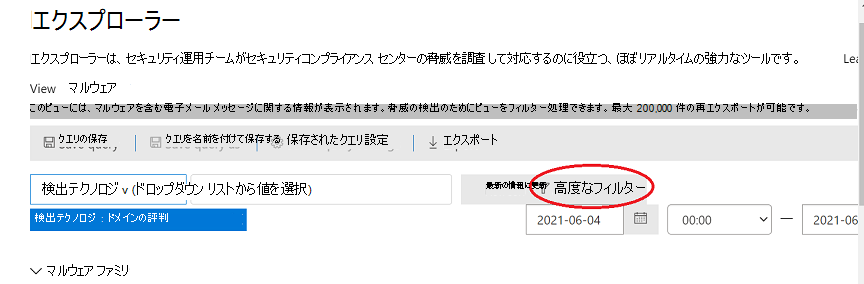
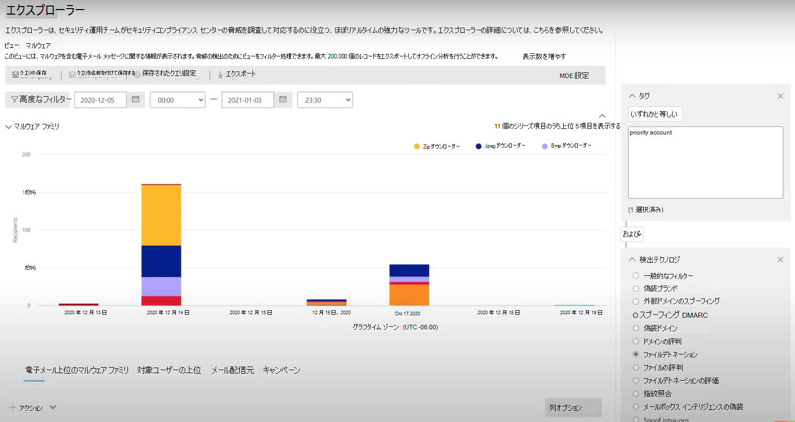
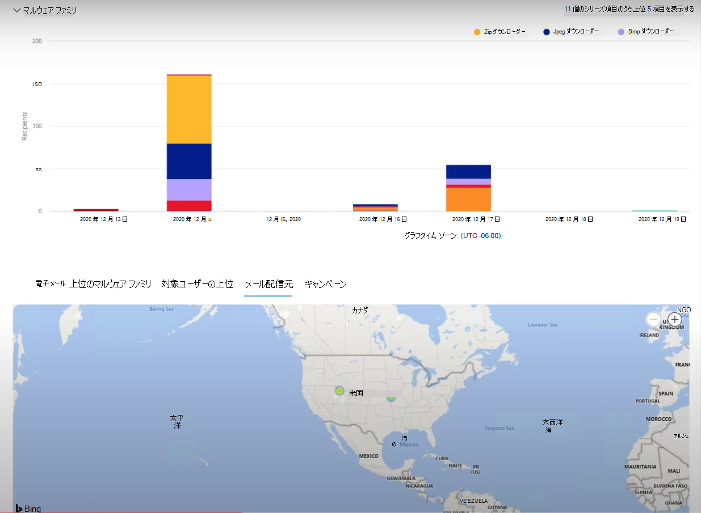
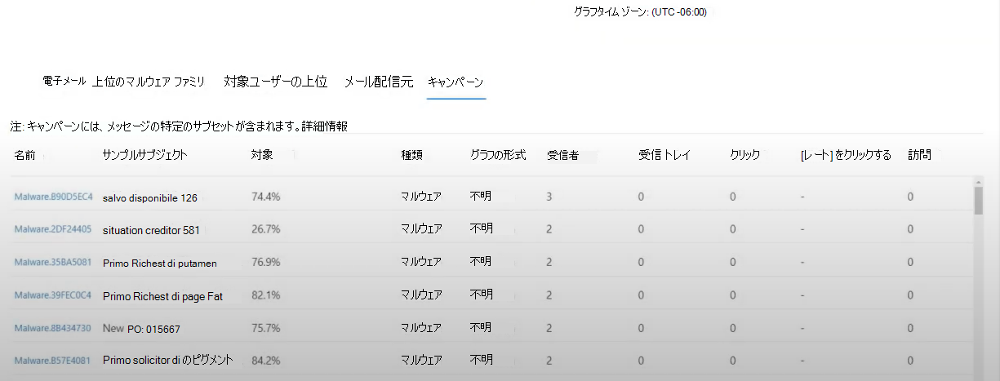
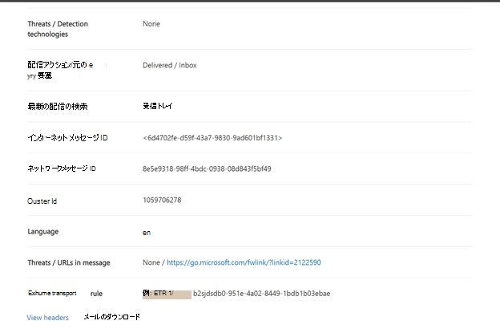

# Microsoft Defender for Microsoft Defender for Microsoft Defender for Threat Explorer での脅威Office 365

この記事の内容:

- [脅威エクスプローラーのウォークスルー](#threat-explorer-walk-through)
- [メールの調査](#email-investigation)
- [電子メールの修復](#email-remediation)
- [脅威の検出エクスペリエンスの改善](#improvements-to-threat-hunting-experience)

> [!NOTE]
> これは、Threat **Explorer (Explorer)** 、電子メール セキュリティ、**エクスプローラー** とリアルタイム検出の基本 (ツールの違い、操作に必要なアクセス許可など) に関する **3** 記事シリーズの一部です。 このシリーズの他の 2 つの記事は、 [脅威](email-security-in-microsoft-defender.md) エクスプローラーと脅威エクスプローラーとリアルタイム検出の基本を備えたメール [セキュリティです](real-time-detections.md)。

**適用対象**
- [Microsoft Defender for Office 365 プラン 1 およびプラン 2](defender-for-office-365.md)
- [Microsoft 365 Defender](../defender/microsoft-365-defender.md)

組織に[Microsoft Defender](defender-for-office-365.md)for Office 365権限がある場合は、エクスプローラーまたはリアルタイム検出を使用して脅威を検出および修復できます。 

[ポータル( Microsoft 365 Defender] で、[メール の編集] &に移動し、[エクスプローラー] または [リアルタイム検出] <https://security.microsoft.com> **を選択します**。   ページに直接移動するには、 <https://security.microsoft.com/threatexplorer><https://security.microsoft.com/realtimereports>

これらのツールで以下のことができます。

- セキュリティ機能によって検出されたマルウェアMicrosoft 365表示する
- フィッシング URL を表示し、[評決データ] をクリックする
- エクスプローラーでビューから自動調査と応答プロセスを開始する
- 悪意のあるメールの調査など

詳細については、「Threat [Explorer を使用したメール セキュリティ」を参照してください](email-security-in-microsoft-defender.md)。

## 脅威エクスプローラーのウォークスルー

Microsoft Defender for Office 365、プラン 1 とプラン 2 の 2 つのサブスクリプション プランがあります。 手動で操作された脅威の検出ツールは、両方のプラン、異なる名前、および異なる機能の両方に存在します。

Defender for Office 365プラン 1では、プラン 2 の脅威エクスプローラー *(エクスプローラー**とも呼* ばれる) ハンティング ツールのサブセットであるリアルタイム検出が使用されます。 この一連の記事では、ほとんどの例は完全な Threat Explorer を使用して作成されました。 管理者は、リアルタイム検出で手順をテストして、適用場所を確認する必要があります。

エクスプローラー **に移動すると**、既定では [マルウェア] ページに移動しますが、[表示]ドロップダウンを使用してオプションを理解します。 フィッシングを探している場合、または脅威キャンペーンを掘り下ろしている場合は、それらのビューを選択します。

> [!div class="mx-imgBorder"]
> ![[脅威エクスプローラー] の [表示] ドロップダウン。](../../media/view-drop-down.png)

セキュリティ操作 (Sec Ops) のユーザーが表示するデータを選択すると、スコープがユーザー申請のような狭いビューか、すべての電子メールのようなより広いビューかを選択すると、[送信者]ボタンを使用してさらにフィルター処理できます。  フィルター処理を完了するには、[更新] を選択してください。

> [!div class="mx-imgBorder"]
> ![脅威エクスプローラーの [送信者] ボタン。](../../media/sender-drop-down.png)

エクスプローラーまたはリアルタイム検出でのフォーカスの絞り込みは、レイヤー内で考え得る。 1 つ目は **View です**。 2 つ目は、フィルター処理された *フォーカスと見なされます*。 たとえば、次のような決定を記録することで、脅威を見つける手順を追跡できます。エクスプローラーで問題を見つけるには、受信者フィルター フォーカスを持つマルウェア ビューを **選択** しました。 これにより、手順の再トレースが容易になります。

> [!TIP]
> Sec Opsがタグを使用して、価値の高いターゲットと見なすアカウントにマークを付け、Tags フィルター フォーカスを持つフィッシング ビューなどの選択を行えます (使用する場合は日付範囲を含めます *)。* これにより、時間範囲 (特定のフィッシング攻撃が業界で多く発生している日付など) の間に、高価値のユーザー ターゲットに向けられたフィッシングの試みが表示されます。

絞り込みは、日付範囲コントロールを使用して日付範囲に対して行えます。 ここでは、検出テクノロジ フィルターフォーカス **を使用** して、[マルウェア] ビュー **にエクスプローラーを** 表示できます。 ただし、Sec Ops チーム **が** 深く掘り下げる高度なフィルター ボタンです。

> [!div class="mx-imgBorder"]
> 

[ **詳細設定]** フィルターをクリックすると、Sec Ops のハンターが自分でクエリを作成できるパネルが表示されます。表示する必要がある情報を含めるか除外することができます。 [エクスプローラー] ページのグラフとテーブルの両方に結果が反映されます。

> [!div class="mx-imgBorder"]
> 

[列の **オプション] ボタン** を使用して、最も役に立つテーブルの情報を取得します。

> [!div class="mx-imgBorder"]
> ![[列のオプション] ボタンが強調表示されます。](../../media/threat-explorer-column-options.png)

> [!div class="mx-imgBorder"]
> ![[列] で使用できるオプション。](../../media/column-options.png)

同じ mien で、表示オプションをテストしてください。 異なる対象ユーザーは、同じデータの異なるプレゼンテーションにうまく反応します。 一部の閲覧者の場合、**メール** 配信元マップでは、脅威の横にある [キャンペーンの表示] オプションよりも迅速に脅威が広がっている、または目立たないと表示される場合があります。 Sec Ops は、これらのディスプレイを利用して、セキュリティと保護の必要性を強調するポイントを作成したり、後で比較したりして、アクションの有効性を実証することができます。

> [!div class="mx-imgBorder"]
> 

> [!div class="mx-imgBorder"]
> 

### メールの調査

疑わしいメールが表示された場合は、名前をクリックして右側のフライアウトを展開します。 ここでは、Sec Ops に電子メール エンティティ ページを [表示できるバナーが](mdo-email-entity-page.md) 用意されています。

電子メール エンティティ ページは、[詳細] 、 [添付ファイル] 、[デバイス] の下にあるコンテンツをまとめて取得しますが、より整理されたデータが含まれています。  これには、DMARC 結果、コピー オプション付きメール ヘッダーのプレーン テキスト表示、安全に起訴された添付ファイルに関する評決情報、削除された起訴ファイル (連絡先の IP アドレス、ページまたはファイルのスクリーンショットを含む) が含まれます。 URL とその評決も、同様の詳細が報告された一覧に表示されます。

この段階に達すると、電子メール エンティティ ページは最終的な手順である修復に不可欠 *です*。

> [!div class="mx-imgBorder"]
> 

> [!TIP]
> 削除された添付ファイルの結果、含まれる URL の結果、安全なメール プレビューなど、リッチ メール エンティティ ページ ([分析] タブで以下に示す) の詳細については、こちらをクリック[してください](mdo-email-entity-page.md)。

> [!div class="mx-imgBorder"]
> ![電子メール エンティティ ページの [分析] タブ。](../../media/threat-explorer-analysis-tab.png)

### 電子メールの修復

Sec Ops のユーザーが電子メールが脅威と判断すると、次のエクスプローラーまたはリアルタイム検出手順は、脅威を処理して修復します。 これは、Threat Explorer に戻り、問題の電子メールのチェック ボックスをオンにして、[アクション] ボタンを使用することで **実行** できます。

> [!div class="mx-imgBorder"]
> ![脅威エクスプローラーの [アクション] ボタン。](../../media/threat-explorer-email-actions-button.png)

ここでは、アナリストは、メールをスパム、フィッシング、マルウェアとして報告したり、受信者に連絡したり、自動調査と応答 (または AIR) プレイブック (プラン 2 がある場合) のトリガーを含む詳細な調査などのアクションを実行できます。 または、メールをクリーンとして報告できます。

> [!div class="mx-imgBorder"]
> ![[アクション] ドロップダウン。](../../media/threat-explorer-email-actions-drop-down.png)

## 脅威の検出エクスペリエンスの改善

### アラート ID

アラートから脅威エクスプローラーに移動すると、 **警告 ID** によってビューが **フィルター処理されます**。 これは、リアルタイム検出にも適用されます。 特定のアラートに関連するメッセージ、および電子メールの合計 (カウント) が表示されます。 メッセージがアラートの一部だったか確認できるだけでなく、そのメッセージから関連するアラートに移動することもできます。

最後に、次に示すアラート ID が URL に含まれます。 `https://https://security.microsoft.com/viewalerts`

> [!div class="mx-imgBorder"]
> 

> [!div class="mx-imgBorder"]
> 

### 試用版テナントのエクスプローラー (およびリアルタイム検出) のデータ保持と検索制限の拡張

この変更の一環として、アナリストは脅威エクスプローラーで 30 日間 (7 日間から増加) のメール データを検索し、フィルター処理し、Office P1 と P2 の両方の試用版テナントの Defender のリアルタイム検出を実行できます。 これは、保持の既定値が既に 30 日である P1 と P2 E5 の両方の顧客の実稼働テナントには影響を与えかねない。

### 更新されたエクスポートの制限

Threat Explorer からエクスポートできるメール レコードの数は、現在 200,000 件 (9990 件) です。 エクスポートできる列のセットは変更されません。

### 脅威エクスプローラーのタグ

> [!NOTE]
> ユーザー タグ機能はプレビュー機能であり、すべてのユーザーが利用できない場合があります。 また、プレビューは変更される場合があります。 リリース スケジュールの詳細については、次のロードマップMicrosoft 365してください。

ユーザー タグは、Microsoft Defender のユーザーの特定のグループを特定Office 365。 ライセンスや構成などのタグの詳細については、「User tags」 [を参照してください](user-tags.md)。

Threat Explorer では、次のエクスペリエンスでユーザー タグに関する情報を確認できます。

#### メール グリッド ビュー

アナリストがメール グリッドの **[タグ] 列** を見ていると、送信者または受信者のメールボックスに適用されたタグが表示されます。 既定では、優先アカウントのような *システム タグが* 最初に表示されます。

> [!div class="mx-imgBorder"]
> 

#### フィルター処理

タグはフィルターとして使用できます。 優先度アカウント間でのみハントするか、特定のユーザー タグシナリオをこの方法で使用します。 特定のタグを持つ結果を除外することもできます。 タグを他のフィルターや日付範囲と組み合わせて調査範囲を絞り込む。

> [!div class="mx-imgBorder"]
> 

#### 電子メールの詳細の飛び出し

送信者と受信者の個々のタグを表示するには、電子メールを選択してメッセージの詳細フライアウトを開きます。 [概要 **] タブ** では、送信者と受信者のタグが個別に表示されます。 送信者と受信者の個々のタグに関する情報は、CSV データとしてエクスポートできます。

> [!div class="mx-imgBorder"]
> 

タグ情報は、URL クリック のフライアウトにも表示されます。 表示するには、[フィッシング] または [すべてのメール] ビューに移動し、[URL > **URL** **クリック] タブをクリック** します。個々の URL フライアウトを選択すると、その URL のクリックに関する詳細 (そのクリックに関連付けられたタグを含む) が表示されます。

### 更新されたタイムライン ビュー

> [!div class="mx-imgBorder"]
> 
>
[このビデオ](https://www.youtube.com/watch?v=UoVzN0lYbfY&list=PL3ZTgFEc7LystRja2GnDeUFqk44k7-KXf&index=4)を見て詳細をご確認ください。

## 拡張機能

### 上位の対象ユーザー

[上位マルウェア ファミリ] には、[ **マルウェア] セクションの上位の** 対象ユーザーが表示されます。 上位の対象ユーザーは、フィッシングビューとすべてのメール ビューを通じて拡張されます。 アナリストは、上位 5 人の対象ユーザーと、各ビューの各ユーザーの試行回数を確認できます。

セキュリティ操作では、ユーザーは、各電子メール ビューのオフライン分析のために、最大 3,000 の制限を対象ユーザーのリストと試行回数でエクスポートできます。 また、試行回数 (下の図では 13 回など) を選択すると、脅威エクスプローラーでフィルター処理されたビューが開き、そのユーザーのメールや脅威の詳細を確認できます。

> [!div class="mx-imgBorder"]
> 

### Exchangeトランスポート ルール

セキュリティ運用チームは、メッセージに適用Exchangeトランスポート ルール (またはメール フロー ルール) を [電子メール] グリッド ビューに表示できます。 グリッド **で [列のオプション**] を選択し、列Exchange **から [** トランスポート ルールの追加] を選択します。 [Exchangeルール] オプションは、メールの **[詳細**] フライアウトにも表示されます。

メッセージに適用されるトランスポート ルールの名前と GUID が表示されます。 アナリストは、トランスポート ルールの名前を使用してメッセージを検索できます。 これは CONTAINS 検索で、部分的な検索も実行できます。

> [!IMPORTANT]
> Exchangeルールの検索と名前の可用性は、割り当てられた特定の役割によって異なっています。 トランスポート ルール名と検索を表示するには、次のいずれかの役割またはアクセス許可が必要です。 ただし、以下の役割やアクセス許可がなくても、アナリストはメールの詳細にトランスポート ルールのラベルと GUID 情報を表示する場合があります。 メール グリッド、電子メール フライアウト、フィルター、およびエクスポートの他のレコード表示エクスペリエンスは影響を受け取ります。
>
> - Exchange Onlineのみ - データ損失防止: すべて
> - Exchange OnlineOnly - O365SupportViewConfig: All
> - Microsoft Azure Active DirectoryまたはExchange Online - セキュリティ管理者: すべて
> - Azure Active DirectoryまたはExchange Online - セキュリティ リーダー: All
> - Exchange OnlineOnly - トランスポート ルール: All
> - Exchange Onlineのみ - View-Only構成: すべて
>
> 電子メール グリッド、詳細フライアウト、およびエクスポート CSV 内で、ETRs には、次に示すように名前/GUID が表示されます。
>
> > [!div class="mx-imgBorder"]
> > 

### 受信コネクタ

コネクタは、電子メールが組織または組織との間でどのように流れるMicrosoft 365のOffice 365です。 この機能を使用すると、セキュリティ制限またはコントロールを適用できます。 Threat Explorer では、電子メールに関連するコネクタを表示し、コネクタ名を使用して電子メールを検索できます。

コネクタの検索は CONTAINS クエリで、部分的なキーワード検索が機能します。

> [!div class="mx-imgBorder"]
> 

## 必要なライセンスとアクセス許可

エクスプローラーまたは[リアルタイム検出を使用するにはOffice 365](defender-for-office-365.md) Microsoft Defender が必要です。

- エクスプローラーは、Defender for Office 365プラン 2 に含まれています。
- リアルタイム検出レポートは、Defender for Office 365プラン 1 に含まれています。
- Defender によって保護される必要があるすべてのユーザーにライセンスを割り当てる計画をOffice 365。 エクスプローラーとリアルタイム検出では、ライセンスを取得したユーザーの検出データが表示されます。

エクスプローラーまたはリアルタイム検出を表示および使用するには、次のアクセス許可が必要です。

- ポータルのMicrosoft 365 Defender:
  - 組織管理
  - セキュリティ管理者 (この管理者は、管理者センター Azure Active Directory割り当てることができます ( <https://aad.portal.azure.com> )
  - セキュリティ閲覧者
- 次Exchange Online:
  - 組織の管理
  - 表示専用組織の管理
  - "View-Only Recipients/表示専用受信者"
  - コンプライアンス管理

役割とアクセス許可の詳細については、次のリソースを参照してください。

- [Microsoft 365 Defender ポータルのアクセス許可](permissions-microsoft-365-security-center.md)
- [Exchange Online の機能アクセス許可](/exchange/permissions-exo/feature-permissions)
- [Exchange Online の PowerShell](/powershell/exchange/exchange-online-powershell)

## 詳細情報

- [配信された悪意のあるメールの検索と調査](investigate-malicious-email-that-was-delivered.md)
- [オンライン、オンライン、SharePoint、およびOneDriveで検出された悪意のあるMicrosoft Teams](mdo-for-spo-odb-and-teams.md)
- [脅威エクスプローラー (およびリアルタイム検出) のビューの概要を取得する](threat-explorer-views.md)
- [脅威保護の状態レポート](view-email-security-reports.md#threat-protection-status-report)
- [Microsoft Threat Protection での自動調査および対応](automated-investigation-response-office.md)
- [[電子メール エンティティ] ページでメールを調査する](mdo-email-entity-page.md)
