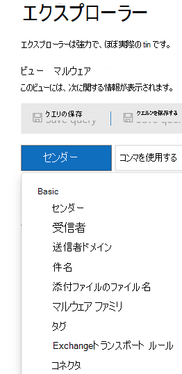
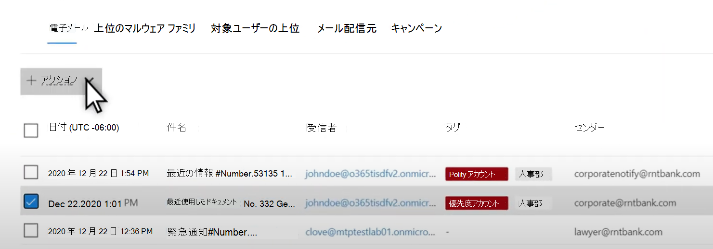
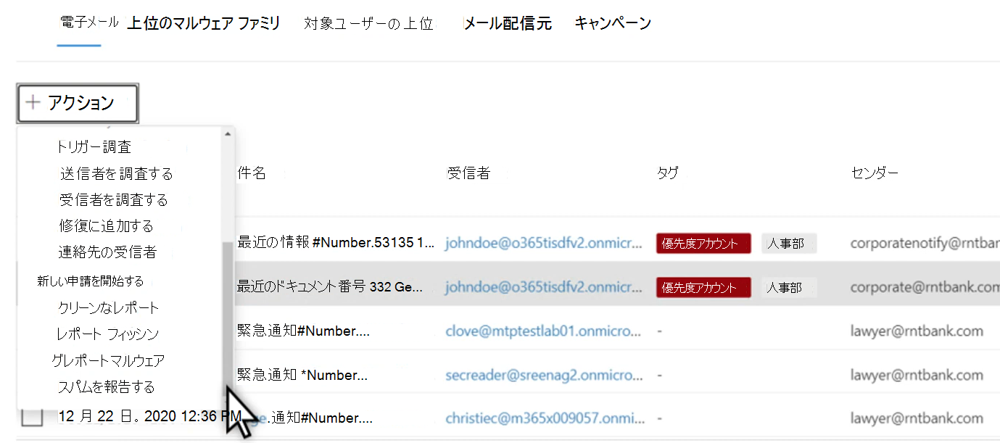

# Microsoft Defender for Microsoft Defender for Microsoft Defender for Threat Explorer での脅威Office 365Threat hunting in Threat Explorer for Microsoft Defender for Office 365

この記事の内容:In this article:

- [脅威エクスプローラーのウォークスルーThreat Explorer walk-through](#threat-explorer-walk-through)
- [メールの調査Email investigation](#email-investigation)
- [電子メールの修復Email remediation](#email-remediation)
- [脅威の検出エクスペリエンスの改善Improvements to threat hunting experience](#improvements-to-threat-hunting-experience)

> [!NOTE]
> これは、Threat **Explorer (Explorer)** 、電子メール セキュリティ、**エクスプローラー** とリアルタイム検出の基本 (ツールの違い、操作に必要なアクセス許可など) に関する **3** 記事シリーズの一部です。This is part of a **3-article series** on **Threat Explorer (Explorer)**, **email security**, and **Explorer and Real-time detections basics** (such as differences between the tools, and permissions needed to operate them). このシリーズの他の 2 つの記事は、 [脅威](email-security-in-microsoft-defender.md) エクスプローラーと脅威エクスプローラーとリアルタイム検出の基本を備えたメール [セキュリティです](real-time-detections.md)。The other two articles in this series are [Email security with Threat Explorer](email-security-in-microsoft-defender.md) and [Threat Explorer and Real-time detections basics](real-time-detections.md).

**適用対象****Applies to**
- [Microsoft Defender for Office 365 プラン 1 およびプラン 2Microsoft Defender for Office 365 plan 1 and plan 2](defender-for-office-365.md)
- [Microsoft 365 DefenderMicrosoft 365 Defender](../defender/microsoft-365-defender.md)

組織に[Microsoft Defender](defender-for-office-365.md)for Office 365権限がある場合は、エクスプローラーまたはリアルタイム検出を使用して脅威を検出および修復できます。 If your organization has [Microsoft Defender for Office 365](defender-for-office-365.md), and you have the [permissions](#required-licenses-and-permissions), you can use **Explorer** or **Real-time detections** to detect and remediate threats.

[ポータル( Microsoft 365 Defender] で、[メール の編集] &に移動し、[エクスプローラー] または [リアルタイム検出] <https://security.microsoft.com> **を選択します**。  In the Microsoft 365 Defender portal (<https://security.microsoft.com>), go to **Email & collaboration**, and then choose **Explorer** or **Real-time detections**. ページに直接移動するには、 <https://security.microsoft.com/threatexplorer><https://security.microsoft.com/realtimereports>To do directly to the page, use <https://security.microsoft.com/threatexplorer> or <https://security.microsoft.com/realtimereports>

これらのツールで以下のことができます。With these tools, you can:

- セキュリティ機能によって検出されたマルウェアMicrosoft 365表示するSee malware detected by Microsoft 365 security features
- フィッシング URL を表示し、[評決データ] をクリックするView phishing URL and click verdict data
- エクスプローラーでビューから自動調査と応答プロセスを開始するStart an automated investigation and response process from a view in Explorer
- 悪意のあるメールの調査などInvestigate malicious email, and more

詳細については、「Threat [Explorer を使用したメール セキュリティ」を参照してください](email-security-in-microsoft-defender.md)。For more information, see [Email security with Threat Explorer](email-security-in-microsoft-defender.md).

## 脅威エクスプローラーのウォークスルーThreat Explorer walk-through

Microsoft Defender for Office 365、プラン 1 とプラン 2 の 2 つのサブスクリプション プランがあります。In Microsoft Defender for Office 365, there are two subscription plans—Plan 1 and Plan 2. 手動で操作された脅威の検出ツールは、両方のプラン、異なる名前、および異なる機能の両方に存在します。Manually operated Threat hunting tools exist in both plans, under different names and with different capabilities.

Defender for Office 365プラン 1では、プラン 2 の脅威エクスプローラー *(エクスプローラー\*\*とも呼* ばれる) ハンティング ツールのサブセットであるリアルタイム検出が使用されます。Defender for Office 365 Plan 1 uses *Real-time detections*, which is a subset of the *Threat Explorer* (also called *Explorer*) hunting tool in Plan 2. この一連の記事では、ほとんどの例は完全な Threat Explorer を使用して作成されました。In this series of articles, most of the examples were created using the full Threat Explorer. 管理者は、リアルタイム検出で手順をテストして、適用場所を確認する必要があります。Admins should test any steps in Real-time detections to see where they apply.

エクスプローラー **に移動すると**、既定では [マルウェア] ページに移動しますが、[表示]ドロップダウンを使用してオプションを理解します。After you go to **Explorer**, by default, you'll arrive on the **Malware** page, but use the **View** drop down to get familiar with your options. フィッシングを探している場合、または脅威キャンペーンを掘り下ろしている場合は、それらのビューを選択します。If you're hunting Phish, or digging into a threat campaign, choose those views.

> [!div class="mx-imgBorder"]
> ![脅威エクスプローラーの [表示] ドロップダウン](../../media/view-drop-down.png)

セキュリティ操作 (Sec Ops) のユーザーが表示するデータを選択すると、スコープがユーザー申請のような狭いビューか、すべての電子メールのようなより広いビューかを選択すると、[送信者]ボタンを使用してさらにフィルター処理できます。 Once a security operations (Sec Ops) person selects the data they want to see, whether the scope is narrow view like user **Submissions**, or a wider view, like **All email**, they can use the **Sender** button to further filter. フィルター処理を完了するには、[更新] を選択してください。Remember to select Refresh to complete your filtering actions.

> [!div class="mx-imgBorder"]
> ![脅威エクスプローラーの [送信者] ボタン](../../media/sender-drop-down.png)

エクスプローラーまたはリアルタイム検出でのフォーカスの絞り込みは、レイヤー内で考え得る。Refining focus in Explorer or Real-time detection can be thought of in layers. 1 つ目は **View です**。The first is **View**. 2 つ目は、フィルター処理された *フォーカスと見なされます*。The second can be thought of as a *filtered focus*. たとえば、次のような決定を記録することで、脅威を見つける手順を追跡できます。エクスプローラーで問題を見つけるには、受信者フィルター フォーカスを持つマルウェア ビューを **選択** しました。For example, you can retrace the steps you took in finding a threat by recording your decisions like this: To find the issue in Explorer, **I chose the Malware View with a Recipient filter focus**. これにより、手順の再トレースが容易になります。This makes retracing your steps easier.

> [!TIP]
> Sec Opsがタグを使用して、価値の高いターゲットと見なすアカウントにマークを付け、Tags フィルター フォーカスを持つフィッシング ビューなどの選択を行えます (使用する場合は日付範囲を含めます *)。*If Sec Ops uses **Tags** to mark accounts they consider high valued targets, they can make selections like *Phish View with a Tags filter focus (include a date range if used)*. これにより、時間範囲 (特定のフィッシング攻撃が業界で多く発生している日付など) の間に、高価値のユーザー ターゲットに向けられたフィッシングの試みが表示されます。This will show them any phishing attempts directed at their high value user targets during a time-range (like dates when certain phishing attacks are happening a lot for their industry).

絞り込みは、日付範囲コントロールを使用して日付範囲に対して行えます。Refinements can be made on date ranges by using the date range controls. ここでは、検出テクノロジ フィルターフォーカス **を使用** して、[マルウェア] ビュー **にエクスプローラーを** 表示できます。Here you can see Explorer in **Malware** view, with a **Detection Technology** filter focus. ただし、Sec Ops チーム **が** 深く掘り下げる高度なフィルター ボタンです。But it's the **Advanced filter** button that lets Sec Ops teams dig deep.

> [!div class="mx-imgBorder"]
> 

[ **詳細設定]** フィルターをクリックすると、Sec Ops のハンターが自分でクエリを作成できるパネルが表示されます。表示する必要がある情報を含めるか除外することができます。Clicking the **Advanced filter** pops a panel that will let Sec Ops hunters build queries themselves, letting them include or exclude the information they need to see. [エクスプローラー] ページのグラフとテーブルの両方に結果が反映されます。Both the chart and table on the Explorer page will reflect their results.

> [!div class="mx-imgBorder"]
> 

[列の **オプション] ボタン** を使用して、最も役に立つテーブルの情報を取得します。Use the **Column options** button to get the kind of information on the table that would be most helpful:

> [!div class="mx-imgBorder"]
> ![[列のオプション] ボタンが強調表示されている](../../media/threat-explorer-column-options.png)

> [!div class="mx-imgBorder"]
> 

同じ mien で、表示オプションをテストしてください。In the same mien, make sure to test your display options. 異なる対象ユーザーは、同じデータの異なるプレゼンテーションにうまく反応します。Different audiences will react well to different presentations of the same data. 一部の閲覧者の場合、**メール** 配信元マップでは、脅威の横にある [キャンペーンの表示] オプションよりも迅速に脅威が広がっている、または目立たないと表示される場合があります。For some viewers, the **Email Origins** map can show that a threat is widespread or discreet more quickly than the **Campaign display** option right next to it. Sec Ops は、これらのディスプレイを利用して、セキュリティと保護の必要性を強調するポイントを作成したり、後で比較したりして、アクションの有効性を実証することができます。Sec Ops can make use of these displays to best make points that underscore the need for security and protection, or for later comparison, to demonstrate the effectiveness of their actions.

> [!div class="mx-imgBorder"]
> 

> [!div class="mx-imgBorder"]
> 

### メールの調査Email investigation

疑わしいメールが表示された場合は、名前をクリックして右側のフライアウトを展開します。When you see a suspicious email, click the name to expand the flyout on the right. ここでは、Sec Ops に電子メール エンティティ ページを [表示できるバナーが](mdo-email-entity-page.md) 用意されています。Here, the banner that lets Sec Ops see the [email entity page](mdo-email-entity-page.md) is available.

電子メール エンティティ ページは、[詳細] 、 [添付ファイル] 、[デバイス] の下にあるコンテンツをまとめて取得しますが、より整理されたデータが含まれています。 The email entity page pulls together contents that can be found under **Details**, **Attachments**, **Devices**, but includes more organized data. これには、DMARC 結果、コピー オプション付きメール ヘッダーのプレーン テキスト表示、安全に起訴された添付ファイルに関する評決情報、削除された起訴ファイル (連絡先の IP アドレス、ページまたはファイルのスクリーンショットを含む) が含まれます。This includes things like DMARC results, plain text display of the email header with a copy option, verdict information on attachments that were securely detonated, and files those detonations dropped (can include IP addresses that were contacted and screenshots of pages or files). URL とその評決も、同様の詳細が報告された一覧に表示されます。URLs and their verdicts are also listed with similar details reported.

この段階に達すると、電子メール エンティティ ページは最終的な手順である修復に不可欠 *です*。When you reach this stage, the email entity page will be critical to the final step—*remediation*.

> [!div class="mx-imgBorder"]
> ![[電子メール エンティティ] ページ](../../media/threat-explorer-email-entity-page.png)

> [!TIP]
> 削除された添付ファイルの結果、含まれる URL の結果、安全なメール プレビューなど、リッチ メール エンティティ ページ ([分析] タブで以下に示す) の詳細については、こちらをクリック[してください](mdo-email-entity-page.md)。To learn more about the rich email entity page (seen below on the **Analysis** tab), including the results of detonated Attachments, findings for included URLs, and safe Email preview, click [here](mdo-email-entity-page.md).

> [!div class="mx-imgBorder"]
> ![電子メール エンティティ ページの [分析] タブ](../../media/threat-explorer-analysis-tab.png)

### 電子メールの修復Email remediation

Sec Ops のユーザーが電子メールが脅威と判断すると、次のエクスプローラーまたはリアルタイム検出手順は、脅威を処理して修復します。Once a Sec Ops person determines that an email is a threat, the next Explorer or Real-time detection step is dealing with the threat and remediating it. これは、Threat Explorer に戻り、問題の電子メールのチェック ボックスをオンにして、[アクション] ボタンを使用することで **実行** できます。This can be done by returning to Threat Explorer, selecting the checkbox for the problem email, and using the **Actions** button.

> [!div class="mx-imgBorder"]
> ![脅威エクスプローラーの [アクション] ボタン](../../media/threat-explorer-email-actions-button.png)

ここでは、アナリストは、メールをスパム、フィッシング、マルウェアとして報告したり、受信者に連絡したり、自動調査と応答 (または AIR) プレイブック (プラン 2 がある場合) のトリガーを含む詳細な調査などのアクションを実行できます。Here, the analyst can take actions like reporting the mail as Spam, Phishing, or Malware, contacting recipients, or further investigations that can include triggering Automated Investigation and Response (or AIR) playbooks (if you have Plan 2). または、メールをクリーンとして報告できます。Or, the mail can also be reported as clean.

> [!div class="mx-imgBorder"]
> ![[アクション] ドロップダウン](../../media/threat-explorer-email-actions-drop-down.png)

## 脅威の検出エクスペリエンスの改善Improvements to threat hunting experience

### アラート IDAlert ID

アラートから脅威エクスプローラーに移動すると、 **警告 ID** によってビューが **フィルター処理されます**。When navigating from an alert into Threat Explorer, the **View** will be filtered by **Alert ID**. これは、リアルタイム検出にも適用されます。This also applies in Real-time detection. 特定のアラートに関連するメッセージ、および電子メールの合計 (カウント) が表示されます。Messages relevant to the specific alert, and an email total (a count) are shown. メッセージがアラートの一部だったか確認できるだけでなく、そのメッセージから関連するアラートに移動することもできます。You will be able to see if a message was part of an alert, as well as navigate from that message to the related alert.

最後に、次に示すアラート ID が URL に含まれます。 `https://https://security.microsoft.com/viewalerts`Finally, alert ID is included in the URL, for example: `https://https://security.microsoft.com/viewalerts`

> [!div class="mx-imgBorder"]
> 

> [!div class="mx-imgBorder"]
> 

### 試用版テナントのエクスプローラー (およびリアルタイム検出) のデータ保持と検索制限の拡張Extending Explorer (and Real-time detections) data retention and search limit for trial tenants

この変更の一環として、アナリストは脅威エクスプローラーで 30 日間 (7 日間から増加) のメール データを検索し、フィルター処理し、Office P1 と P2 の両方の試用版テナントの Defender のリアルタイム検出を実行できます。As part of this change, analysts will be able to search for, and filter email data across 30 days (increased from seven days) in Threat Explorer and Real-time detections for both Defender for Office P1 and P2 trial tenants. これは、保持の既定値が既に 30 日である P1 と P2 E5 の両方の顧客の実稼働テナントには影響を与えかねない。This doesn't impact any production tenants for both P1 and P2 E5 customers, where the retention default is already 30 days.

### 更新されたエクスポートの制限Updated Export limit

Threat Explorer からエクスポートできるメール レコードの数は、現在 200,000 件 (9990 件) です。The number of Emails records that can be exported from Threat Explorer is now 200,000 (was 9990). エクスポートできる列のセットは変更されません。The set of columns that can be exported is unchanged.

### 脅威エクスプローラーのタグTags in Threat Explorer

> [!NOTE]
> ユーザー タグ機能はプレビュー機能であり、すべてのユーザーが利用できない場合があります。The user tags feature is in Preview and may not be available to everyone. また、プレビューは変更される場合があります。Also, Previews are subject to change. リリース スケジュールの詳細については、次のロードマップMicrosoft 365してください。For information about the release schedule, check out the Microsoft 365 roadmap.

ユーザー タグは、Microsoft Defender のユーザーの特定のグループを特定Office 365。User tags identify specific groups of users in Microsoft Defender for Office 365. ライセンスや構成などのタグの詳細については、「User tags」 [を参照してください](user-tags.md)。For more information about tags, including licensing and configuration, see [User tags](user-tags.md).

Threat Explorer では、次のエクスペリエンスでユーザー タグに関する情報を確認できます。In Threat Explorer, you can see information about user tags in the following experiences.

#### メール グリッド ビューEmail grid view

アナリストがメール グリッドの **[タグ] 列** を見ていると、送信者または受信者のメールボックスに適用されたタグが表示されます。When analysts look at the **Tags** column the email grid, they are seeing all tags that have been applied to sender or recipient mailboxes. 既定では、優先アカウントのような *システム タグが* 最初に表示されます。By default, system tags like *priority accounts* are shown first.

> [!div class="mx-imgBorder"]
> 

#### フィルター処理Filtering

タグはフィルターとして使用できます。Tags can be used as filters. 優先度アカウント間でのみハントするか、特定のユーザー タグシナリオをこの方法で使用します。Hunt among priority accounts only, or use specific user tags scenarios this way. 特定のタグを持つ結果を除外することもできます。You can also exclude results that have certain tags. タグを他のフィルターや日付範囲と組み合わせて調査範囲を絞り込む。Combine Tags with other filters and date ranges to narrow your scope of investigation.

> [!div class="mx-imgBorder"]
> 

#### 電子メールの詳細の飛び出しEmail detail flyout

送信者と受信者の個々のタグを表示するには、電子メールを選択してメッセージの詳細フライアウトを開きます。To view the individual tags for sender and recipient, select an email to open the message details flyout. [概要 **] タブ** では、送信者と受信者のタグが個別に表示されます。On the **Summary** tab, the sender and recipient tags are shown separately. 送信者と受信者の個々のタグに関する情報は、CSV データとしてエクスポートできます。The information about individual tags for sender and recipient can be exported as CSV data.

> [!div class="mx-imgBorder"]
> 

タグ情報は、URL クリック のフライアウトにも表示されます。Tags information is also shown in the URL clicks flyout. 表示するには、[フィッシング] または [すべてのメール] ビューに移動し、[URL > **URL** **クリック] タブをクリック** します。個々の URL フライアウトを選択すると、その URL のクリックに関する詳細 (そのクリックに関連付けられたタグを含む) が表示されます。To see it, go to Phish or All Email view > **URLs** or **URL Clicks** tab. Select an individual URL flyout to see additional details about clicks for that URL, including any Tags associated with that click.

### 更新されたタイムライン ビューUpdated Timeline View

> [!div class="mx-imgBorder"]
> 
>
[このビデオ](https://www.youtube.com/watch?v=UoVzN0lYbfY&list=PL3ZTgFEc7LystRja2GnDeUFqk44k7-KXf&index=4)を見て詳細をご確認ください。Learn more by watching [this video](https://www.youtube.com/watch?v=UoVzN0lYbfY&list=PL3ZTgFEc7LystRja2GnDeUFqk44k7-KXf&index=4).

## 拡張機能Extended capabilities

### 上位の対象ユーザーTop targeted users

[上位マルウェア ファミリ] には、[ **マルウェア] セクションの上位の** 対象ユーザーが表示されます。Top Malware Families shows the **top targeted users** in the Malware section. 上位の対象ユーザーは、フィッシングビューとすべてのメール ビューを通じて拡張されます。Top targeted users will be extended through Phish and All Email views too. アナリストは、上位 5 人の対象ユーザーと、各ビューの各ユーザーの試行回数を確認できます。Analysts will be able to see the top-five targeted users, along with the number of attempts for each user in each view.

セキュリティ操作では、ユーザーは、各電子メール ビューのオフライン分析のために、最大 3,000 の制限を対象ユーザーのリストと試行回数でエクスポートできます。Security operations people be able to export the list of targeted users, up to a limit of 3,000, along with the number of attempts made, for offline analysis for each email view. また、試行回数 (下の図では 13 回など) を選択すると、脅威エクスプローラーでフィルター処理されたビューが開き、そのユーザーのメールや脅威の詳細を確認できます。Also, selecting the number of attempts (for example, 13 attempts in the image below) will open a filtered view in Threat Explorer, so you can see more details across emails, and threats for that user.

> [!div class="mx-imgBorder"]
> 

### Exchangeトランスポート ルールExchange transport rules

セキュリティ運用チームは、メッセージに適用Exchangeトランスポート ルール (またはメール フロー ルール) を [電子メール] グリッド ビューに表示できます。The security operations team will be able to see all the Exchange transport rules (or Mail flow rules) applied to a message, in the Email grid view. グリッド **で [列のオプション**] を選択し、列Exchange **から [** トランスポート ルールの追加] を選択します。Select **Column options** in the grid and then **Add Exchange Transport Rule** from the column options. [Exchangeルール] オプションは、メールの **[詳細**] フライアウトにも表示されます。The Exchange transport rules option is also visible on the **Details** flyout in the email.

メッセージに適用されるトランスポート ルールの名前と GUID が表示されます。Names and GUIDs of the transport rules applied to the message appear. アナリストは、トランスポート ルールの名前を使用してメッセージを検索できます。Analysts will be able to search for messages by using the name of the transport rule. これは CONTAINS 検索で、部分的な検索も実行できます。This is a CONTAINS search, which means you can do partial searches as well.

> [!IMPORTANT]
> Exchangeルールの検索と名前の可用性は、割り当てられた特定の役割によって異なっています。Exchange transport rule search and name availability depend on the specific role assigned to you. トランスポート ルール名と検索を表示するには、次のいずれかの役割またはアクセス許可が必要です。You need to have one of the following roles or permissions to view the transport rule names and search. ただし、以下の役割やアクセス許可がなくても、アナリストはメールの詳細にトランスポート ルールのラベルと GUID 情報を表示する場合があります。However, even without the roles or permissions below, an analyst may see the transport rule label and GUID information in the Email Details. メール グリッド、電子メール フライアウト、フィルター、およびエクスポートの他のレコード表示エクスペリエンスは影響を受け取ります。Other record-viewing experiences in Email Grids, Email flyouts, Filters, and Export are not affected.
>
> - Exchange Onlineのみ - データ損失防止: すべてExchange Online Only - Data Loss Prevention: All
> - Exchange OnlineOnly - O365SupportViewConfig: AllExchange Online Only - O365SupportViewConfig: All
> - Microsoft Azure Active DirectoryまたはExchange Online - セキュリティ管理者: すべてMicrosoft Azure Active Directory or Exchange Online - Security Admin: All
> - Azure Active DirectoryまたはExchange Online - セキュリティ リーダー: AllAzure Active Directory or Exchange Online - Security Reader: All
> - Exchange OnlineOnly - トランスポート ルール: AllExchange Online Only - Transport Rules: All
> - Exchange Onlineのみ - View-Only構成: すべてExchange Online Only - View-Only Configuration: All
>
> 電子メール グリッド、詳細フライアウト、およびエクスポート CSV 内で、ETRs には、次に示すように名前/GUID が表示されます。Within the email grid, Details flyout, and Exported CSV, the ETRs are presented with a Name/GUID as shown below.
>
> > [!div class="mx-imgBorder"]
> > 

### 受信コネクタInbound connectors

コネクタは、電子メールが組織または組織との間でどのように流れるMicrosoft 365のOffice 365です。Connectors are a collection of instructions that customize how your email flows to and from your Microsoft 365 or Office 365 organization. この機能を使用すると、セキュリティ制限またはコントロールを適用できます。They enable you to apply any security restrictions or controls. Threat Explorer では、電子メールに関連するコネクタを表示し、コネクタ名を使用して電子メールを検索できます。In Threat Explorer, you can view the connectors that are related to an email and search for emails using connector names.

コネクタの検索は CONTAINS クエリで、部分的なキーワード検索が機能します。The search for connectors is a CONTAINS query, which means partial keyword searches can work:

> [!div class="mx-imgBorder"]
> 

## 必要なライセンスとアクセス許可Required licenses and permissions

エクスプローラーまたは[リアルタイム検出を使用するにはOffice 365](defender-for-office-365.md) Microsoft Defender が必要です。You must have [Microsoft Defender for Office 365](defender-for-office-365.md) to use Explorer or Real-time detections.

- エクスプローラーは、Defender for Office 365プラン 2 に含まれています。Explorer is included in Defender for Office 365 Plan 2.
- リアルタイム検出レポートは、Defender for Office 365プラン 1 に含まれています。The Real-time detections report is included in Defender for Office 365 Plan 1.
- Defender によって保護される必要があるすべてのユーザーにライセンスを割り当てる計画をOffice 365。Plan to assign licenses for all users who should be protected by Defender for Office 365. エクスプローラーとリアルタイム検出では、ライセンスを取得したユーザーの検出データが表示されます。Explorer and Real-time detections show detection data for licensed users.

エクスプローラーまたはリアルタイム検出を表示および使用するには、次のアクセス許可が必要です。To view and use Explorer or Real-time detections, you must have the following permissions:

- ポータルのMicrosoft 365 Defender:For the Microsoft 365 Defender portal:
  - 組織管理Organization Management
  - セキュリティ管理者 (この管理者は、管理者センター Azure Active Directory割り当てることができます ( <https://aad.portal.azure.com> )Security Administrator (this can be assigned in the Azure Active Directory admin center (<https://aad.portal.azure.com>)
  - セキュリティ閲覧者Security Reader
- 次Exchange Online:For Exchange Online:
  - 組織の管理Organization Management
  - 表示専用組織の管理View-Only Organization Management
  - "View-Only Recipients/表示専用受信者"View-Only Recipients
  - コンプライアンス管理Compliance Management

役割とアクセス許可の詳細については、次のリソースを参照してください。To learn more about roles and permissions, see the following resources:

- [Microsoft 365 Defender ポータルのアクセス許可Permissions in the Microsoft 365 Defender portal](permissions-microsoft-365-security-center.md)
- [Exchange Online の機能アクセス許可Feature permissions in Exchange Online](/exchange/permissions-exo/feature-permissions)
- [Exchange Online の PowerShellExchange Online PowerShell](/powershell/exchange/exchange-online-powershell)

## 詳細More information

- [配信された悪意のあるメールの検索と調査Find and investigate malicious email that was delivered](investigate-malicious-email-that-was-delivered.md)
- [オンライン、オンライン、SharePoint、およびOneDriveで検出された悪意のあるMicrosoft TeamsView malicious files detected in SharePoint Online, OneDrive, and Microsoft Teams](mdo-for-spo-odb-and-teams.md)
- [脅威エクスプローラー (およびリアルタイム検出) のビューの概要を取得するGet an overview of the views in Threat Explorer (and Real-time detections)](threat-explorer-views.md)
- [脅威保護の状態レポートThreat protection status report](view-email-security-reports.md#threat-protection-status-report)
- [Microsoft Threat Protection での自動調査および対応Automated investigation and response in Microsoft Threat Protection](automated-investigation-response-office.md)
- [[電子メール エンティティ] ページでメールを調査する](mdo-email-entity-page.md)[Investigate emails with the Email Entity Page](mdo-email-entity-page.md)
