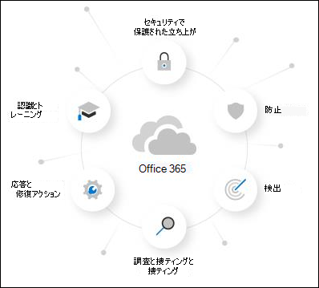
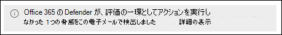

# Microsoft Defender for Office 365を試す

> [!NOTE]
> この記事で説明する機能はプレビュー版であり、一部の組織では使用できず、変更される可能性があります。

Microsoft 365 Defender ポータルの統合 **試用版** ポータルでは、Microsoft Defender for Office 365に対する以前の個別の試用版と評価エクスペリエンスの 1 つのエントリ ポイントが提供されます。 目的は、完全にコミットする前に、Defender for Office 365 プラン 2 の機能を 30 日間試してみることです。 ただし、Microsoft 365組織の性質に基づいて、評価エクスペリエンスには違いがあります。

- Microsoft 365メールボックスは既にありますが、現在、電子メール保護にサード パーティのサービスまたはデバイスを使用しています。 インターネットからのメールは、Microsoft 365組織に配信される前に保護サービスを経由します。 Microsoft 365保護は可能な限り低くなります (完全にオフになることはありません。マルウェア保護は常に適用されます)。

  

  これらの環境では、*監査* モードでのみDefender for Office 365を試すことができます。 メール フロー (MX レコード) を変更してDefender for Office 365を試す必要はありません。

- Microsoft 365組織が既にあります。 インターネットからのメールは直接Microsoft 365フローされますが、現在のサブスクリプションには[Exchange Online Protection (EOP)](exchange-online-protection-overview.md) または[プラン 1 Defender for Office 365](overview.md#microsoft-defender-for-office-365-plan-1-vs-plan-2-cheat-sheet)があります。

  

  これらの環境では、*監査* モードまたは *ブロック* モードでDefender for Office 365を試すことができます。

Microsoft 365 Defender ポータル<https://security.microsoft.com>のさまざまなDefender for Office 365機能の場所で試用版を開始するよう招待されます。 試用版を開始するための一元的な場所は、[ **試用版** ] ページの [ <https://security.microsoft.com/atpEvaluation>.

この記事の残りの部分では、監査モードのブロック モード、評価の構成方法、およびその他の詳細の違いについて説明します。

## Defender for Office 365の概要

Defender for Office 365は、組織が包括的な機能を提供することで、企業をセキュリティで保護するのに役立ちます。 詳細については、「[Microsoft Defender for Office 365](defender-for-office-365.md)」を参照してください。

Defender for Office 365の詳細については、この[対話型ガイド](https://aka.ms/MS365D.InteractiveGuide)を参照してください。

## ブロック モードまたは監査モードのポリシー

Defender for Office 365を評価すると、Microsoft 365の保護機能を制御するポリシーが存在します。

- **Exchange Online Protection (EOP)**: 新しいポリシーや特別なポリシーは作成されません。 既存の EOP ポリシーは、メッセージに対して動作できます (たとえば、迷惑メール フォルダーにメッセージを送信したり、検疫を行ったりします)。

  - [マルウェア対策ポリシー](anti-malware-protection.md)
  - [受信スパム対策保護](anti-spam-protection.md)
  - [フィッシング対策ポリシーでのスプーフィング対策保護](set-up-anti-phishing-policies.md#spoof-settings)

  これらの機能の既定のポリシーは常にオンであり、すべての受信者に適用され、常に最後に適用されます (カスタム ポリシーの後)。

- **Defender for Office 365**: Defender for Office 365専用のポリシーは、Defender for Office 365を評価するために作成されます。

  - [フィッシング対策ポリシーにおける、なりすまし保護](set-up-anti-phishing-policies.md#impersonation-settings-in-anti-phishing-policies-in-microsoft-defender-for-office-365)
  - [電子メール メッセージの添付ファイルをセーフする](safe-attachments.md)
  - [電子メール メッセージとMicrosoft Teamsのリンクをセーフする](safe-links.md)

  ただし、これらのポリシーの性質は、ブロック モードと監査モードでは異なります。

  - **監査モード**: 通常のポリシーが作成されますが、ポリシーは脅威を *検出* するためにのみ構成されます。 Defender for Office 365はレポート用に有害なメッセージを検出しますが、メッセージは処理されません (検出されたメッセージは検疫されません)。

  - **ブロック モード**: ポリシーは、 [事前設定されたセキュリティ ポリシー](preset-security-policies.md)の Standard テンプレートを使用して作成されます。 Defender for Office 365有害なメッセージを *検出* して *アクションを実行します* (検出されたメッセージは検疫されるなど)。

  既定の選択と推奨される選択は、組織内のすべてのユーザーに対してこれらのDefender for Office 365 ポリシーのスコープを設定することです。 ただし、セットアップ中またはセットアップ後に、ポリシーの割り当てを特定のユーザー、グループ、または電子メール ドメインに変更できます。

**注意**:

- セーフ リンクを使用すると、メール フロー内の URL が爆発します。 特定の URL がデトネーションされないようにするには、テナント許可/ブロック リストを使用します。 詳細については、「 [テナント許可/ブロック リストの管理」を参照してください](tenant-allow-block-list.md)。
- セーフ リンクは、メール メッセージ本文の URL リンクをラップしません。
- 評価ポリシーの設定については、この記事の後半の [「評価ポリシー設定](#evaluation-policy-settings) 」セクションで説明します。

## 監査モードで評価を設定する

1. [ **評価の開始]** をクリックします。

2. [ **保護を有効にする** ] ダイアログで、[ **いいえ]、[レポートのみ必要**] の順に選択し、[ **続行**] をクリックします。

3. [ **含めるユーザーの選択]** ダイアログで、次の設定を構成します。

   - **すべてのユーザー**: これが既定の推奨オプションです。
   - **ユーザーの選択**: このオプションを選択した場合は、評価が適用されるユーザーを選択する必要があります。
     - **ユーザー**: 組織内で指定された 1 つ以上のメールボックス、メール ユーザー、またはメール連絡先。
     - **グループ**: 組織内で指定された配布グループ、メール対応セキュリティ グループ、または Microsoft 365 グループ。
     - **ドメイン**: 組織内で指定された [承認済みドメイン](/exchange/mail-flow-best-practices/manage-accepted-domains/manage-accepted-domains)のすべての受信者。

     適正なボックスをクリックし、値の入力を開始し、結果で希望する値を選択します。 必要な回数だけこの処理を繰り返します。 既存の値を削除するには、削除をクリックします ![[削除] アイコン](../../media/m365-cc-sc-remove-selection-icon.png) 値の隣。

     ユーザーやグループには、ほとんどの識別子 (名前、表示名、エイリアス、メールアドレス、アカウント名など) を使用できますが、対応する表示名が結果に表示されます。ユーザーの場合、アスタリスク (\*) を単独で入力すると、使用可能なすべての値が表示されます。

   > [!NOTE]
   > これらの選択は、評価の設定が完了したら変更できます。

   完了したら、[ **続行**] をクリックします。

4. **[メール フローの理解に関するヘルプ**] ダイアログで、次のオプションを構成します。

   - **Microsoft とデータを共有** する: このオプションは既定で選択されていますが、必要に応じてチェック ボックスをオフにすることができます。

   - ドメインの MX レコードの検出に基づいて、次のいずれかのオプションが自動的に選択されます。

     - **サードパーティまたはオンプレミスのサービス プロバイダーを使用しています**。ドメインの MX レコードは、Microsoft 365以外の場所を指しています。 [ **次へ**] をクリックした後、この選択には次の追加設定が必要です。

       1. [ **サード パーティまたはオンプレミスの設定** ] ダイアログで、次の設定を構成します。

          - **サード パーティのサービス プロバイダーを選択** する: 次のいずれかの値を選択します。
            - **バラクーダ**
            - **IronPort**
            - **Mimecast**
            - **Proofpoint**
            - **ソフォス**
            - **Symantec**
            - **Trend Micro**
            - **その他**

          - **この評価を適用するコネクタ**: Microsoft 365へのメール フローに使用するコネクタを選択します。

            [コネクタの拡張フィルター処理](/exchange/mail-flow-best-practices/use-connectors-to-configure-mail-flow/enhanced-filtering-for-connectors) ( *スキップ リスト* とも呼ばれます) は、指定したコネクタで自動的に構成されます。

            サード パーティのサービスまたはデバイスが Microsoft 365 から配置されている場合、コネクタの強化されたフィルター処理によってインターネット メッセージのソースが正しく識別され、Microsoft フィルター スタックの精度が大幅に向上します (特に、ス[プーフィング インテリジェンス](anti-spoofing-protection.md)、[脅威エクスプローラー](threat-explorer.md)での違反後の機能、自動[調査&応答 (AIR)](automated-investigation-response-office.md))。

          - **メッセージが通過する各ゲートウェイ IP アドレスを一覧表示** する: この設定は、[**サード パーティのサービス プロバイダーの選択**] で **[その他]** を選択した場合にのみ使用できます。 サードパーティの保護サービスまたはデバイスがMicrosoft 365にメールを送信するために使用する IP アドレスのコンマ区切りリストを入力します。

          完了したら、**[次へ]** をクリックします。

       2. **[Exchangeメール フロー ルール**] ダイアログで、サード パーティの保護サービスまたはデバイスからの受信メッセージのスパム フィルター処理をスキップするExchange Onlineメール フロー ルール (トランスポート ルールとも呼ばれます) が必要かどうかを決定します。

          Exchange Onlineには、保護サービスからのすべての受信メールをバイパス (ほとんどの) Microsoft 365フィルター処理を許可する SCL=-1 メール フロー ルールが既にある可能性があります。 多くの保護サービスは、サービスを使用するMicrosoft 365顧客に対して、このスパム信頼レベル (SCL) メール フロー ルール方法を推奨しています。

          前の手順で説明したように、コネクタの拡張フィルター処理は、保護サービスからのメールの送信元として指定したコネクタで自動的に構成されます。

          保護サービスからの受信メールに対して SCL=-1 ルールを使用せずにコネクタの拡張フィルター処理をオンにすると、 [スプーフィング インテリジェンス](anti-spoofing-protection.md)などの EOP 保護機能の検出機能が大幅に向上し、新しく検出されたメッセージの配信 (迷惑メール フォルダーへの移動や検疫など) に影響を与える可能性があります。 この影響は EOP ポリシーに限定されます。前述のように、Defender for Office 365 ポリシーは監査モードで作成されます。

          SCL=-1 メール フロー ルールを作成したり、既存のルールを確認したりするには、ページの **[管理センターに移動**] ボタンExchangeクリックします。 詳細については、「[メール フロー ルールを使用して、Exchange Online内のメッセージでスパム信頼レベル (SCL) を設定](/exchange/security-and-compliance/mail-flow-rules/use-rules-to-set-scl)する」を参照してください。

          完了したら、 **[完了]** をクリックします。

     - **Microsoft Exchange Onlineのみを使用しています**。ドメインの MX レコードはMicrosoft 365をポイントします。 構成する必要は残っていないので、[ **完了]** をクリックします。

5. 評価が設定されると、進行状況ダイアログが表示されます。 セットアップが完了したら、[完了] をクリック **します**。

## ブロック モードで評価を設定する

1. [ **評価の開始]** をクリックします。

2. [ **保護を有効にする** ] ダイアログで、[はい] を選択し **、脅威をブロックして組織を保護** し、[ **続行**] をクリックします。

3. [ **含めるユーザーの選択]** ダイアログで、次の設定を構成します。

   - **すべてのユーザー**: これが既定の推奨オプションです。
   - **ユーザーの選択**: このオプションを選択した場合は、評価が適用されるユーザーを選択する必要があります。
     - **ユーザー**: 組織内で指定された 1 つ以上のメールボックス、メール ユーザー、またはメール連絡先。
     - **グループ**: 組織内で指定された配布グループ、メール対応セキュリティ グループ、または Microsoft 365 グループ。
     - **ドメイン**: 組織内で指定された [承認済みドメイン](/exchange/mail-flow-best-practices/manage-accepted-domains/manage-accepted-domains)のすべての受信者。

     適正なボックスをクリックし、値の入力を開始し、結果で希望する値を選択します。 必要な回数だけこの処理を繰り返します。 既存の値を削除するには、削除をクリックします ![[削除] アイコン](../../media/m365-cc-sc-remove-selection-icon.png) 値の隣。

     ユーザーやグループには、ほとんどの識別子 (名前、表示名、エイリアス、メールアドレス、アカウント名など) を使用できますが、対応する表示名が結果に表示されます。ユーザーの場合、アスタリスク (\*) を単独で入力すると、使用可能なすべての値が表示されます。

   > [!NOTE]
   > これらの選択は、評価の設定が完了したら変更できます。

   完了したら、[ **続行**] をクリックします。

4. 評価が設定されると、進行状況ダイアログが表示されます。 セットアップが完了したら、[完了] をクリック **します**。

## 監査モードでのレポート

- [脅威の保護状態レポート](view-email-security-reports.md#threat-protection-status-report)には、次のビューにDefender for Office 365による検出が表示されます。
  - [電子メール \> マルウェアとグラフの内訳を検出テクノロジ別に表示する](view-email-security-reports.md#view-data-by-email--malware-and-chart-breakdown-by-detection-technology)
  - [電子メール \> フィッシングとグラフの内訳でデータを検出テクノロジ別に表示する](view-email-security-reports.md#view-data-by-email--phish-and-chart-breakdown-by-detection-technology)

- [脅威エクスプローラーでは](threat-explorer.md)、Defender for Office 365評価によって検出されたメッセージに、エントリの詳細に次のバナーが表示されます。

  

<!--- This stuff is likely not applicable for V2 reporting --->

**Microsoft Defender for Office 365評価** ページには<https://security.microsoft.com/atpEvaluation>、評価のポリシーのレポートが統合されます。

- フィッシング対策ポリシーにおける、なりすまし保護
- 安全なリンク
- 安全な添付ファイル

既定では、グラフには過去 30 日間のデータが表示されますが、[予定表] アイコンをクリック  **30 日間、30 日** 未満の次の追加の値から選択します。

- 24 時間
- 7 日間
- 14 日
- カスタム日付範囲

[ダウンロード] アイコンをクリック  グラフ データを.csv ファイルに **ダウンロードしてダウンロード** します。

## 必要なアクセス許可

Defender for Microsoft 365 の評価を設定するために **Azure AD** で必要なアクセス許可については、次の一覧を参照してください。

- **評価の作成、変更、または削除:** セキュリティ管理者またはグローバル管理者。
- **評価ポリシーとレポートを表示する**: セキュリティ管理者またはセキュリティ 閲覧者。

Microsoft 365 Defender ポータルでのAzure ADアクセス許可の詳細については、Microsoft 365 Defender [ポータルのAzure AD ロールに関するページを](permissions-microsoft-365-security-center.md#azure-ad-roles-in-the-microsoft-365-defender-portal)参照してください。

## 評価ポリシーの設定

評価用に特別に作成されるDefender for Office 365の設定については、次の表で説明します。

**フィッシング対策評価ポリシーの設定**:

|設定|値|
|---|---|
|AdminDisplayName|評価ポリシー|
|AuthenticationFailAction|MoveToJmf|
|Enabled|True|
|EnableFirstContactSafetyTips|False|
|EnableMailboxIntelligence|True|
|EnableMailboxIntelligenceProtection|True|
|EnableOrganizationDomainsProtection|False|
|EnableSimilarDomainsSafetyTips|False|
|EnableSimilarUsersSafetyTips|False|
|EnableSpoofIntelligence|True|
|EnableSuspiciousSafetyTip|False|
|EnableTargetedDomainsProtection|False|
|EnableTargetedUserProtection|False|
|EnableUnauthenticatedSender|True|
|EnableUnusualCharactersSafetyTips|False|
|EnableViaTag|True|
|Guid|GUID 値|
|ImpersonationProtectionState|Manual|
|IsDefault|False|
|MailboxIntelligenceProtectionAction|NoAction|
|MailboxIntelligenceProtectionActionRecipients|{}|
|MailboxIntelligenceQuarantineTag|DefaultFullAccessPolicy|
|名前|評価ポリシー|
|PhishThresholdLevel|1|
|RecommendedPolicyType|評価|
|SpoofQuarantineTag|DefaultFullAccessPolicy|
|TargetedDomainActionRecipients|{}|
|TargetedDomainProtectionAction|NoAction|
|TargetedDomainQuarantineTag|DefaultFullAccessPolicy|
|TargetedUserActionRecipients|{}|
|TargetedUserProtectionAction|NoAction|
|TargetedUserQuarantineTag|DefaultFullAccessPolicy|
|||
|AntiPhishPolicyLevelDataList|空白|
|AntiSpoofEnforcementType|高|
|AuthenticationSafetyTipText|空白|
|AuthenticationSoftPassSafetyTipText|空白|
|EnableAuthenticationSafetyTip|False|
|EnableAuthenticationSoftPassSafetyTip|False|
|PolicyTag|空白|
|SimilarUsersSafetyTipsCustomText|空白|
|TreatSoftPassAsAuthenticated|True|
|UnusualCharactersSafetyTipsCustomText|空白|
|||
|ExcludedDomains|{}|
|ExcludedSenders|{}|
|TargetedDomainsToProtect|{}|
|TargetedUsersToProtect|{}|

**セーフ 添付ファイルの評価ポリシー設定**:

|設定|値|
|---|---|
|Action|許可|
|ActionOnError|True|
|AdminDisplayName|評価ポリシー|
|ConfidenceLevelThreshold|80|
|有効にする|True|
|EnableOrganizationBranding|False|
|Guid|GUID 値|
|IsBuiltInProtection|False|
|IsDefault|False|
|名前|評価ポリシー|
|OperationMode|Delay|
|QuarantineTag|AdminOnlyAccessPolicy|
|RecommendedPolicyType|評価|
|Redirect|False|
|RedirectAddress|{}|
|ScanTimeout|30|

**セーフ リンク評価ポリシーの設定**:

|設定|値|
|---|---|
|AdminDisplayName|評価ポリシー|
|AllowClickThrough|False|
|CustomNotificationText|空白|
|DeliverMessageAfterScan|True|
|DisableUrlRewrite|True|
|DoNotRewriteUrls|{}|
|EnableForInternalSenders|False|
|EnableOrganizationBranding|False|
|EnableSafeLinksForTeams|True|
|Guid|GUID 値|
|IsBuiltInProtection|False|
|IsDefault|False|
|IsEnabled|True|
|LocalizedNotificationTextList|{}|
|名前|"EvaluationPolicy"|
|RecommendedPolicyType|評価|
|ScanUrls|True|
|TrackClicks|True|
|||
|DoNotAllowClickThrough|空白|
|DoNotTrackUserClicks|False|
|EnableSafeLinksForEmail|True|
|EnableSafeLinksForOffice|True|
|ExcludedUrls|{}|
|WhiteListedUrls|空白|
