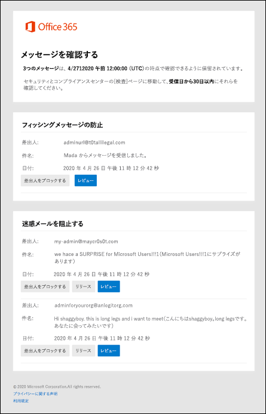

# ユーザーのスパム通知を使用して検疫済みメッセージを解放および報告する

[!INCLUDE [Microsoft 365 Defender rebranding](../includes/microsoft-defender-for-office.md)]

**適用対象**
- [Exchange Online Protection](exchange-online-protection-overview.md)
- [Microsoft Defender for Office 365 プラン 1 およびプラン 2](defender-for-office-365.md)
- [Microsoft 365 Defender](../defender/microsoft-365-defender.md)

Exchange Online のメールボックスを使用している Microsoft 365 組織または Exchange Online のメールボックスを使用していないスタンドアロンの Exchange Online Protection (EOP) 組織では、危険な可能性があるメッセージまたは不要なメッセージは検疫済みメッセージとして保留されます。 詳細については [、「EOP の検疫済みメッセージ」を参照してください](quarantine-email-messages.md)。

既定では、エンド ユーザーのスパム通知はスパム対策ポリシーで無効になっています。 管理者がエンドユーザーのスパム通知を有効にすると、受信者 (自動マッピングが有効な共有メールボックスを含む) は、スパム、バルク メール、または (2020 年 4 月現在) フィッシングとして検疫されたメッセージに関する定期的な通知を受信します。

共有メールボックスの場合、エンド ユーザーのスパム通知は、共有メールボックスに対する FullAccess アクセス許可が付与されたユーザーにのみサポートされます。 詳細については [、「EAC を使用して共有メールボックスの委任を編集する」を参照してください](/Exchange/collaboration-exo/shared-mailboxes#use-the-eac-to-edit-shared-mailbox-delegation)。

エンド ユーザースパム通知は、グループではサポートされていません。

> [!NOTE]
> 信頼度の高いフィッシング、マルウェア、またはメール フロー ルール (トランスポート ルールとも呼ばれる) によって検疫されたメッセージは、管理者だけが使用できます。 詳細については、「[EOP の管理者として検疫済みのメッセージやファイルを管理する](manage-quarantined-messages-and-files.md)」を参照してください。

エンド ユーザーのスパム通知には、検疫されたメッセージごとに次の情報が含まれます。

- **Sender**: 検疫済みメッセージの送信名と電子メール アドレス。
- **件名**: 検疫済みメッセージの件名テキスト。
- **日付**: メッセージが検疫された日付と時刻 (UTC)。
- **[送信者のブロック**] : このリンクをクリックして、メールボックスの [受信拒否] リストに送信者を追加します。 詳細については、「[メール送信者をブロックする](https://support.microsoft.com/office/b29fd867-cac9-40d8-aed1-659e06a706e4)」を参照してください。
- **リリース**: スパム (フィッシングではない) メッセージの場合は、[メール の検疫]ポータルに移動せずに、ここでメッセージをMicrosoft 365 Defenderできます。
- **レビュー**: このリンクをクリックすると、Microsoft 365 Defender ポータルの [検疫] に移動し、検疫済みメッセージの表示、リリース、削除、レポートを実行できます (メッセージが検疫された理由に応じて)。 詳細については、「EOP で検疫済みメッセージをユーザーとして検索して解放する [」を参照してください](find-and-release-quarantined-messages-as-a-user.md)。

> [!NOTE]
> 送信者がブロックされた場合でも、メールを送信できます。 この送信者からメールボックスに送信されたメッセージは、直ちに迷惑メール フォルダーに移動されます。 この送信者からの今後のメッセージは、迷惑メール フォルダーまたはエンドユーザー検疫に移動します。 これらのメッセージを quarantining ではなく、到着時に削除する場合は、メール フロー ルール [(トランスポート](/exchange/security-and-compliance/mail-flow-rules/mail-flow-rules) ルールとも呼ばれる) を使用して、到着時にメッセージを削除します。
