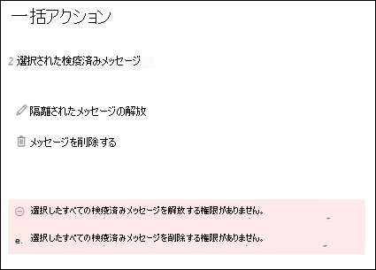

# <a name="view-and-release-quarantined-messages-from-shared-mailboxes"></a>共有メールボックスからの検疫済みメッセージの表示と解放

> [!NOTE]
> この記事で説明されている機能は現在プレビュー段階であり、すべてのユーザーが利用できるわけではありません。変更される可能性があります。

[EOP のユーザーとして検疫済みメッセージを検索して解放](find-and-release-quarantined-messages-as-a-user.md)する方法について説明されているように、ユーザーは検疫済みメッセージを管理できます。 しかし、 [Exchange Online の共有メール](https://docs.microsoft.com/exchange/collaboration-exo/shared-mailboxes)ボックスに記載されているように、ユーザーがメールボックスへのフルアクセス権を持っている共有メールボックスについてはどうでしょうか。

以前は、ユーザーが共有メールボックスに送信された検疫済みメッセージを管理する機能により、管理者が共有メールボックスに自動マッピングを有効にしておく必要がありました (管理者が別のメールボックスにユーザーアクセスを許可した場合、既定で有効になっています)。 ただし、ユーザーがアクセスできるメールボックスのサイズと数によっては、ユーザーがアクセスできる *すべて* のメールボックスを開こうとすると、パフォーマンスが低下する可能性があります。 このため、多くの管理者は、 [共有メールボックスの自動マッピングを削除](https://docs.microsoft.com/outlook/troubleshoot/profiles-and-accounts/remove-automapping-for-shared-mailbox)することを選択します。

これで、ユーザーが共有メールボックスに送信された検疫済みメッセージを管理するために自動マッピングが不要になりました。 機能するだけです。 共有メールボックスに送信された検疫済みメッセージにアクセスするには、次の2つの方法があります。

- 管理者がスパム対策ポリシーで [エンドユーザーのスパム通知を有効](https://docs.microsoft.com/microsoft-365/security/office-365-security/configure-your-spam-filter-policies) にしている場合、共有メールボックス内のエンドユーザーのスパム通知にアクセスできるユーザーは、通知の [ **確認** ] ボタンをクリックして、セキュリティ & コンプライアンスセンターの [検疫] に移動できます。 この方法では、ユーザーが共有メールボックスに送信された検疫済みメッセージのみを管理できることに注意してください。 ユーザーがこのコンテキストで自分の検疫メッセージを管理することはできません。

- ユーザーは、 [セキュリティ & コンプライアンスセンターで検疫に移動](find-and-release-quarantined-messages-as-a-user.md)できます。 既定では、ユーザーに送信されたメッセージのみが表示されます。 ただし、ユーザーは **並べ替えの結果** (既定では、[ **メッセージ ID] ボタン** ) を [ **受信者の電子メールアドレス**] に変更し、共有メールボックスの電子メールアドレスを入力してから、[ **更新** ] をクリックして、共有メールボックスに送信された検疫済みメッセージを表示することができます。

  

方法に関係なく、ユーザーは検疫済みメッセージの [ **受信者** ] 列を含めることによって混乱を避けることができます。 表示する列の最大数は7です。ユーザーは、[ **列の変更**] をクリックし、既存の列を削除 (たとえば、[ **ポリシーの種類**])、[ **受信者**] を選択して、[ **保存** ] または [ **既定値として保存**] をクリックする必要があります。

  ![[ポリシーの種類] 列を削除し、[受信者] 列を [検疫] に追加します。](../../media/quarantine-add-recipient-column.png)

## <a name="things-to-keep-in-mind"></a>留意すべき点

- 最初に検疫されたメッセージを操作するユーザーは、共有メールボックスを使用するすべてのユーザーに対してメッセージの運命を決定します。 たとえば、共有メールボックスに10人のユーザーがアクセスしていて、ユーザーが検疫メッセージを削除することを決定した場合、そのメッセージは10人のユーザー全員に対して削除されます。 同様に、ユーザーがメッセージを解放することを決定した場合は、共有メールボックスに解放され、共有メールボックスの他のすべてのユーザーがアクセスできるようになります。

- 現時点では、共有メールボックスに送信された複数の検疫済みメッセージをユーザーが選択すると、ユーザーが [**メッセージの解放**] をクリックするか、**バルクアクション** ポップアップで **メッセージを削除** すると、次のような誤ったエラーが返されます。

  > 選択したすべての検疫済みメッセージを解放する権限がありません。
  >
  > 選択したすべての検疫済みメッセージを削除する権限がありません。

  エラーに関係なく、アクションはメッセージに対して実行され、エラーは無視できます。

  

- 現時点では、共有メールボックスに送信された検疫済みメッセージの **詳細** ポップアップで [**送信者をブロック** する] ボタンを使用することはできません。

- [Exchange Online の PowerShell](https://docs.microsoft.com/powershell/exchange/connect-to-exchange-online-powershell)で共有メールボックスの検疫済みメッセージを管理するには、エンドユーザーは、メッセージを識別するために、_受信者アドレス_ パラメーターの値として [get-quarantinemessage](https://docs.microsoft.com/powershell/module/exchange/get-quarantinemessage)コマンドレットを使用して、共有メールボックスの電子メールアドレスを指定する必要があります。 例:

  ```powershell
  Get-QuarantinedMessage -RecipientAddress officeparty@contoso.com
  ```

  その後、エンドユーザーは、リストから検疫済みメッセージを選択して、操作を表示または実行することができます。

  この例では、共有メールボックスに送信されたすべての検疫済みメッセージを示してから、リスト内の最初のメッセージを検疫から解放します (リスト内の最初のメッセージは0、2番目は1のようになります)。

  ```powershell
  $SharedMessages = Get-QuarantinedMessage -RecipientAddress officeparty@contoso.com | select -ExpandProperty Identity
  $SharedMessages
  Release-QuarantinedMessage -Identity $SharedMessages[0]
  ```

  構文およびパラメーターの詳細については、以下のトピックを参照してください。

  - [Get-QuarantineMessage](https://docs.microsoft.com/powershell/module/exchange/get-quarantinemessage)
  - [QuarantineMessageHeader](https://docs.microsoft.com/powershell/module/exchange/get-quarantinemessageheader)
  - [プレビュー-Get-quarantinemessage](https://docs.microsoft.com/powershell/module/exchange/preview-quarantinemessage)
  - [Release-QuarantineMessage](https://docs.microsoft.com/powershell/module/exchange/release-quarantinemessage)
