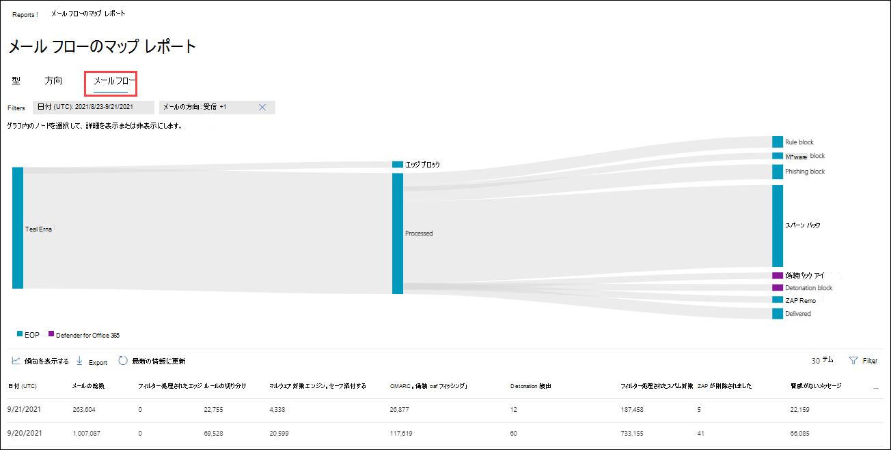

# 電子メール セキュリティ レポートを Microsoft 365 Defenderする

[!INCLUDE [Microsoft 365 Defender rebranding](../includes/microsoft-defender-for-office.md)]

**適用対象**
- [Exchange Online Protection](exchange-online-protection-overview.md)
- [Microsoft Defender for Office 365 プラン 1 およびプラン 2](defender-for-office-365.md)
- [Microsoft 365 Defender](../defender/microsoft-365-defender.md)

Microsoft 365 Defender ポータルでは、Microsoft 365 のスパム対策、マルウェア対策、暗号化機能などの電子メール セキュリティ機能が組織を保護している方法を確認できます。 <https://security.microsoft.com> 必要なアクセス許可 [がある場合は](#what-permissions-are-needed-to-view-these-reports)、この記事の説明に従って、これらのレポートを表示およびダウンロードできます。

> [!NOTE]
>
> [電子メール] コラボレーション レポート ページの一 **部のレポート&、Microsoft** Defender が必要です。Office 365。 これらのレポートの詳細については[、「View Defender for Office 365ポータル」をMicrosoft 365 Defenderしてください](view-reports-for-mdo.md)。
>
> メール フローに関連するレポートは、現在、Exchangeセンター (EAC) に表示されます。 これらのレポートの詳細については、「新しい管理センターのメール フロー レポート[Exchange参照してください](/exchange/monitoring/mail-flow-reports/mail-flow-reports)。

## 侵害されたユーザー レポート

> [!NOTE]
> このレポートは、メールボックスを使用Microsoft 365組織Exchange Online使用できます。 スタンドアロン 組織 (EOP) 組織ではExchange Online Protection使用できません。

[**侵害されたユーザー] レポート** には、過去 7 日以内に[疑わしい] または [制限付き] とマークされたユーザー アカウントの数が表示されます。 これらの状態のどちらかのアカウントは、問題が発生したり、侵害された場合もあります。 頻繁に使用すると、レポートを使用して、疑わしいアカウントや制限付きアカウントのスパイクや傾向を見つけるのに使用できます。 侵害されたユーザーの詳細については、「侵害されたメール アカウントへの [応答」を参照してください](responding-to-a-compromised-email-account.md)。

![[コラボレーション レポートのメール] ページの [&ユーザー] ウィジェット。](../../media/compromised-users-report-widget.png)

集計ビューには過去 90 日間のデータが表示され、詳細ビューには過去 30 日間のデータが表示されます。

ポータルでレポートを表示するにはMicrosoft 365 Defender[レポートの電子メール]  & \>  \> **グループ&に移動します**。 [コラボレーション **レポートのメール&] ページで**、[侵害されたユーザー] を探し、[詳細の表示]**をクリックします**。 レポートに直接移動するには、を開きます <https://security.microsoft.com/reports/CompromisedUsers> 。

[侵害された **ユーザー] ページ** で、指定した日付範囲の次の情報がグラフに表示されます。

- **制限**: 不審なパターンが多く、ユーザー アカウントが電子メールの送信を制限されています。
- **疑** わしい : ユーザー アカウントが不審なメールを送信し、電子メールの送信を制限される危険性があります。

グラフの下の詳細テーブルは、次の情報を示しています。

- **作成時間**
- **[ユーザー ID]**
- **操作**

[フィルター] をクリックし、表示されるフライアウトで次の値の 1 つ以上を選択すると、グラフと詳細テーブルの両方をフィルター処理できます。

- **日付 (UTC)**:**開始日と****終了日**。
- **アクティビティ**: **制限付き** または **疑わしい**

フィルターの構成が完了したら、[適用]、[**キャンセル**]、または [フィルターのクリア]**をクリックします**。

メイン レポート ページの [スケジュールの作成 ![ ] アイコン。](../../media/m365-cc-sc-create-icon.png) **[スケジュールの作成](#schedule-report)**、  **[[レポートの要求](#request-report)**] と [ ![ エクスポート] アイコン。](../../media/m365-cc-sc-download-icon.png) **[エクスポート](#export-report)** ボタンを使用できます。

![[侵害されたユーザー] レポートのレポート ビュー。](../../media/compromised-users-report-activity-view.png)

## Exchangeトランスポート ルール レポート

トランスポート **Exchangeレポートには**、組織内の受信メッセージと送信メッセージに対するメール フロー ルール (トランスポート ルールとも呼ばれる) の影響が表示されます。

ポータルでレポートを表示するにはMicrosoft 365 Defender[レポートの電子メール]  & \>  \> **グループ&に移動します**。 [コラボレーション **レポートのメール&] ページ** で、トランスポート **Exchangeを見** つけて、[詳細の表示]**をクリックします**。 レポートに直接移動するには、を開きます <https://security.microsoft.com/reports/ETRRuleReport> 。

![Exchangeグループレポート ページの [メール] &トランスポート ルール ウィジェットを作成します。](../../media/transport-rule-report-widget.png)

[トランスポート **Exchangeレポート] ページ** で、使用可能なグラフとデータについて、次のセクションで説明します。

### [方向] によるグラフの内訳

[方向によるグラフ **の内訳] を選択すると**、次のグラフを使用できます。

- **トランスポート ルールExchangeデータ** を表示する : メールフロー ルールの影響を受けた受信メッセージと送信メッセージの数。
- **データを DLP** Exchangeトランスポート ルールで表示する :データ損失防止 (DLP) メール フロー ルールの影響を受けた受信メッセージと送信メッセージの数。

次の情報は、グラフの下の詳細テーブルに示されています。

- **日付**
- **DLP ポリシー** (**DLP によるデータの表示Exchangeトランスポート ルールのみ**)
- **トランスポート ルール**
- **[件名]**
- **[送信者のアドレス]**
- **受信者の住所**
- **重大度**
- **Direction**

[フィルター] をクリックし、表示されるフライアウトで次の値の 1 つ以上を選択すると、グラフと詳細テーブルの両方をフィルター処理できます。

- **日付 (UTC)** **開始日と****終了日**。
- **方向**:**送信および****受信**。
- **重大度**:**重大度が高い、****中程度の重大度**、**および低重大度**

フィルターの構成が完了したら、[適用]、[**キャンセル**]、または [フィルターのクリア]**をクリックします**。

メイン レポート ページの [スケジュールの作成 ![ ] アイコン。](../../media/m365-cc-sc-create-icon.png) **[スケジュールの作成](#schedule-report)**、  **[[レポートの要求](#request-report)**] と [ ![ エクスポート] アイコン。](../../media/m365-cc-sc-download-icon.png) **[エクスポート](#export-report)** ボタンを使用できます。

### 重大度別のグラフの内訳

[重要度による **グラフの内訳] を選択した場合** は、次のグラフを使用できます。

- **トランスポート ルール別Exchange表示**: 重大度の高いメッセージ、中程度の重大度、および **低** 重大度メッセージの数。 重大度レベルは、ルールのアクションとして設定します **(重大度** レベルまたは _SetAuditSeverity_ でこのルールを監査します)。 詳細については、「メール フロー ルール[のアクション」を参照Exchange Online。](/Exchange/security-and-compliance/mail-flow-rules/mail-flow-rule-actions)

- **DLP メール フロー ルールExchange** 影響を受けた高重大度、中重大度、および低重大度メッセージの数。 

次の情報は、グラフの下の詳細テーブルに示されています。

- **日付**
- **DLP ポリシー** (**DLP によるデータの表示Exchangeトランスポート ルールのみ**)
- **トランスポート ルール**
- **件名**
- **[送信者のアドレス]**
- **受信者の住所**
- **重大度**
- **Direction**

[フィルター] をクリックし、表示されるフライアウトで次の値の 1 つ以上を選択すると、グラフと詳細テーブルの両方をフィルター処理できます。

- **日付 (UTC)** **開始日と****終了日**
- **方向**:**送信と****受信**
- **重大度**:**重大度が高い、****中程度の重大度**、**および低重大度**

フィルターの構成が完了したら、[適用]、[**キャンセル**]、または [フィルターのクリア]**をクリックします**。

メイン レポート ページの [スケジュールの作成 ![ ] アイコン。](../../media/m365-cc-sc-create-icon.png) **[スケジュールの作成](#schedule-report)**、  **[[レポートの要求](#request-report)**] と [ ![ エクスポート] アイコン。](../../media/m365-cc-sc-download-icon.png) **[エクスポート](#export-report)** ボタンを使用できます。

## 転送レポート

> [!NOTE]
> このレポートは EAC で利用できます。 詳細については、「新しい [EAC の自動転送メッセージ レポート」を参照してください](/exchange/monitoring/mail-flow-reports/mfr-auto-forwarded-messages-report)。

## メールフローの状態レポート

**Mailflow 状態** レポートは、受信および送信メール、スパム検出、マルウェア、"良い" と識別される電子メール、およびエッジで許可またはブロックされた電子メールに関する情報を示すスマート レポートです。 これは、エッジ保護情報を含む唯一のレポートであり、EOP (EOP) による評価のためにサービスに許可される前にブロックされる電子メールの量を示Exchange Online Protectionです。 メッセージが 5 人の受信者に送信された場合、メッセージは 1 つのメッセージではなく 5 つの異なるメッセージとしてカウントされます。

ポータルでレポートを表示するにはMicrosoft 365 Defender[レポートの電子メール]  & \>  \> **グループ&に移動します**。 [メール **の送信&] ページ** で、[ **メールフロー** の状態の概要] を探し、[詳細の表示] **をクリックします**。 レポートに直接移動するには、を開きます <https://security.microsoft.com/reports/mailflowStatusReport> 。

![[メール フロー] グループ作業レポート ページの [メールフロー&概要] ウィジェット。](../../media/mail-flow-status-report-widget.png)

### メールフロー状態レポートの種類ビュー

![[メールフローの状態] レポートにビューを入力します。](../../media/mail-flow-status-report-type-view.png)

[メール **フローの状態] レポート ページで** 、[種類] **タブ** が既定で選択されています。 グラフには、指定した日付範囲に関する次の情報が表示されます。

- **良いメール**
- **合計**
- **マルウェア**
- **フィッシング詐欺メール**
- **スパム**
- **エッジ保護**
- **ルール メッセージ**

グラフの下の詳細テーブルは、次の情報を示しています。

- **Direction**
- **Type**
- **24 時間**
- **3 日間**
- **7 日間**
- **15 日**
- **30 日間**

[フィルター] をクリックし、表示されるフライアウトで次の値の 1 つ以上を選択すると、グラフと詳細テーブルの両方をフィルター処理できます。

- **日付 (UTC)**:**開始日と****終了日**。
- **メールの方向**:**受信および****送信**。
- **種類**:
  - **良いメール**
  - **マルウェア**
  - **スパム**
  - **エッジ保護**
  - **ルール メッセージ**
  - **フィッシング詐欺メール**

フィルターの構成が完了したら、[適用]、[**キャンセル**]、または [フィルターのクリア]**をクリックします**。

メイン レポート ページに戻り、[詳細についてはカテゴリを選択する] をクリックすると、次の値から選択できます。

- **フィッシングメール**: この選択によって、脅威保護の [状態レポートが表示されます](view-email-security-reports.md#threat-protection-status-report)。
- **電子メール内のマルウェア**: この選択によって、脅威保護 [の状態レポートが表示されます](view-email-security-reports.md#threat-protection-status-report)。
- **スパム検出**: この選択により、スパム検出 [レポートに移動します](view-email-security-reports.md#spam-detections-report)。
- **エッジブロックスパム**: この選択により、スパム検出 [レポートに移動します](view-email-security-reports.md#spam-detections-report)。

メイン レポート ページの [スケジュールの作成 ![ ] アイコン。](../../media/m365-cc-sc-create-icon.png) **[スケジュールとエクスポート](#schedule-report)** アイコン  **[エクスポート](#export-report)** ボタンを使用できます。

### メールフロー状態レポートの方向ビュー

[方向] タブ **をクリック** すると、指定した日付範囲の次の情報がグラフに表示されます。

- **受信**
- **送信**

[フィルター] をクリックし、表示されるフライアウトで次の値の 1 つ以上を選択すると、グラフと詳細テーブルの両方をフィルター処理できます。

- **日付 (UTC)**:**開始日と****終了日**。
- **メールの方向**:**受信および****送信**。
- **種類**:
  - **良いメール**
  - **マルウェア**
  - **スパム**
  - **エッジ保護**
  - **ルール メッセージ**
  - **フィッシング詐欺メール**

フィルターの構成が完了したら、[適用]、[**キャンセル**]、または [フィルターのクリア]**をクリックします**。

メイン レポート ページに戻り、[詳細についてはカテゴリを選択する] をクリックすると、次の値から選択できます。

- **フィッシングメール**: この選択によって、脅威保護の [状態レポートが表示されます](view-email-security-reports.md#threat-protection-status-report)。
- **電子メール内のマルウェア**: この選択によって、脅威保護 [の状態レポートが表示されます](view-email-security-reports.md#threat-protection-status-report)。
- **スパム検出**: この選択により、スパム検出 [レポートに移動します](view-email-security-reports.md#spam-detections-report)。
- **エッジブロックスパム**: この選択により、スパム検出 [レポートに移動します](view-email-security-reports.md#spam-detections-report)。

メイン レポート ページの [スケジュールの作成 ![ ] アイコン。](../../media/m365-cc-sc-create-icon.png) **スケジュールとエクスポート** アイコン  **エクスポート** ボタンを使用できます。

### メールフロー状態レポートのメールフロー ビュー

[ **メールフロー] ビュー** には、Microsoft の電子メール脅威保護機能が組織内の受信メールと送信メールをフィルター処理する方法が表示されます。 このビューでは、水平方向のフロー図 (サンキー図と呼ばれる) を使用して、メールの総数の詳細と、エッジ保護、マルウェア対策、フィッシング対策、スパム対策、スプーフィング対策などの構成済みの脅威保護機能が、この数に与える影響について説明します。

集計ビューと詳細テーブル ビューでは、90 日間のフィルター処理が可能です。

図の情報は **、EOP** または **Defender** によって色分けされた、Office 365されています。

図は、次の水平バンドに編成されています。

- **合計メール バンド** : この値は常に最初に表示されます。
- **エッジ ブロックと****処理されたバンド**:
  - **エッジ ブロック**: エッジでフィルター処理され、エッジ保護として識別されるメッセージ。
  - **処理 :** フィルター 処理スタックによって処理されるメッセージ。
- 結果バンド:
  - **ルール ブロック**: メール フロー ルール (トランスポート ルールExchangeによって処理されるメッセージ。
  - **マルウェア ブロック**: さまざまなフィルターによってマルウェアとして識別されるメッセージ。\*
  - **フィッシング ブロック**: さまざまなフィルターによる処理中にフィッシングとして識別されるメッセージ。\*
  - **スパム ブロック**: さまざまなフィルターによる処理中にスパムとして識別されるメッセージ。\*
  - **偽装ブロック**: Defender でユーザー偽装またはドメイン偽装として検出されたメッセージがOffice 365。\*
  - **Detonation ブロック**: Defender for セーフ 添付ファイル ポリシーまたは セーフ リンク ポリシーによってファイルまたは URL の削除中に検出されたOffice 365。\*
  - **ZAP 削除**: ゼロ時間自動削除 (ZAP) によって削除されるメッセージ。\*
  - **配信**: 許可が原因でユーザーに配信されるメッセージ。\*

図の水平方向のバンドにカーソルを合わせると、関連するメッセージの数が表示されます。

\* この要素をクリックすると、図が展開され、詳細が表示されます。 展開されたノード内の各要素の説明については、「Detection [technologies」を参照してください](/office/office-365-management-api/office-365-management-activity-api-schema#detection-technologies)。

図の下の詳細テーブルは、次の情報を示しています。

- **日付**
- **メールの総数**
- **フィルター処理されたエッジ**
- **ルール メッセージ**
- **マルウェア対策エンジン、セーフ添付ファイル、フィルター処理されたルール**
- **DMARC 偽装、スプーフィング、フィッシング フィルター**
- **Detonation 検出**
- **フィルター処理されたスパム対策**
- **ZAP が削除されました**
- **脅威が検出されていないメッセージ**

詳細テーブルで行を選択すると、メール数の詳細が表示される詳細フライアウトに表示されます。

[フィルター] をクリックし、表示されるフライアウトで次の値の 1 つ以上を選択すると、グラフと詳細テーブルの両方をフィルター処理できます。

- **日付 (UTC)** **開始日と****終了日**。
- **方向**:**送信および****受信**。

フィルターの構成が完了したら、[適用]、[**キャンセル**]、または [フィルターのクリア]**をクリックします**。

メイン レポート ページに戻って、[傾向の表示] をクリックすると、表示される **メール** フローの傾向フライアウトに傾向グラフを表示できます。

メイン レポート ページの [エクスポート]  **[エクスポート** ] ボタンを使用できます。

## マルウェア検出レポート

> [!NOTE]
> このレポートは廃止されました。 脅威保護の状態レポートでも同 [じ情報を使用できます](#threat-protection-status-report)。

## メール遅延レポート

Defender **for Office 365** のメール待機時間レポートには、組織内で発生したメール配信と発Office 365に関する情報が含まれている。 詳細については、「メール遅延 [レポート」を参照してください](view-reports-for-mdo.md#mail-latency-report)。

## スパム検出レポート

> [!NOTE]
> このレポートは廃止されました。 脅威保護の状態レポートでも同 [じ情報を使用できます](#threat-protection-status-report)。

## スプーフィング検出レポート

ス **プーフィング検出レポート** には、スプーフィングによってブロックまたは許可されたメッセージに関する情報が表示されます。 スプーフィングの詳細については、「EOP でのスプーフィング防止 [保護」を参照してください](anti-spoofing-protection.md)。

レポートの集計ビューでは 45 日間のフィルター処理が可能ですが、詳細ビューでは 10 日間のフィルター \* 処理のみ可能です。

\* 最終的には、最大 90 日間のフィルター処理を使用できます。

ポータルでレポートを表示するにはMicrosoft 365 Defender[レポートの電子メール]  & \>  \> **グループ&に移動します**。 [メール **の共有&] ページで** 、[スプーフィングの検出] **を探** し、[詳細の表示] **をクリックします**。 レポートに直接移動するには、を開きます <https://security.microsoft.com/reports/SpoofMailReportV2> 。

![[メール] ページの [グループ&スプーフィングの検出] ウィジェット。](../../media/spoof-detections-widget.png)

グラフには、次の情報が表示されます。

- **Pass**
- **Fail/失敗**
- **SoftPass**
- **なし**
- **その他**

グラフの 1 日 (データ ポイント) にカーソルを合わせると、スプーフィングされたメッセージの検出数と理由を確認できます。

[フィルター] をクリックし、表示されるフライアウトで次の値の 1 つ以上を選択すると、グラフと詳細テーブルの両方をフィルター処理できます。

- **日付 (UTC)** **開始日と****終了日**
- **結果**:
  - **Pass**
  - **Fail/失敗**
  - **SoftPass**
  - **なし**
  - **その他**
- **スプーフィングの** 種類 :**内部と****外部**

![[メール レポートのスプーフィング] ページ (Microsoft 365 Defenderポータル)。](../../media/spoof-detections-report-page.png)

グラフの下の詳細テーブルは、次の情報を示しています。

- **日付**
- **スプーフィングされたユーザー**
- **インフラストラクチャの送信**
- **スプーフィングの種類**
- **結果**
- **結果コード**
- **SPF**
- **DKIM**
- **DMARC**
- **メッセージ数**

複合認証結果コードの詳細については、「スパム対策メッセージ ヘッダー」を参照[Microsoft 365。](anti-spam-message-headers.md)

メイン レポート ページの [スケジュールの作成 ![ ] アイコン。](../../media/m365-cc-sc-create-icon.png) **[スケジュールの作成](#schedule-report)**、  **[[レポートの要求](#request-report)**] と [ ![ エクスポート] アイコン。](../../media/m365-cc-sc-download-icon.png) **[エクスポート](#export-report)** ボタンを使用できます。

## 申請レポート

申請 **レポートには** 、管理者が分析のために Microsoft に報告したアイテムに関する情報が表示されます。 詳細については、「管理申請を [使用して疑わしいスパム、フィッシング、URL、](admin-submission.md)ファイルを Microsoft に提出する」を参照してください。

ポータルでレポートを表示するにはMicrosoft 365 Defender[レポートの電子メール]  & \>  \> **グループ&に移動します**。 [コラボレーション **レポートのメール&] ページで**、[申請] を探し、[詳細の表示]**をクリックします**。 レポートに直接移動するには、を開きます <https://security.microsoft.com/adminSubmissionReport> 。 ポータルで [管理者の申請に移動するには、[Microsoft 365 Defender提出](admin-submission.md)に移動 **] をクリックします**。 管理者は過去 30 日間レポートを表示できます。

![[メール と共同作業レポート] ページ&提出ウィジェット。](../../media/submissions-report-widget.png)

グラフには、次の情報が表示されます。

- **保留中**
- **Completed**

[フィルター] をクリックし、表示されるフライアウトで次の値の 1 つ以上を選択すると、グラフと詳細テーブルの両方をフィルター処理できます。

- **報告日**: **開始時刻** と **終了時刻**
- **申請の種類**:
  - **電子メール**
  - **URL**
  - **ファイル**
- **申請 ID**
- **ネットワーク メッセージ ID**
- **Sender**
- **名前**
- **提出者**
- **提出の理由**:
  - **迷惑メールではない**
  - **フィッシング**
  - **マルウェア**
  - **スパム**
- **再スキャンの状態**:
  - **保留中**
  - **Completed**

グラフの下の詳細テーブルは、同じ情報を示し、[グループ] または [グループのカスタマイズ] 列のオプションは、[電子メール と共同作業の申請] の [分析用に送信済み] タブと同 **&です** \> 。 詳細については [、「View admin submissions to Microsoft」を参照してください](admin-submission.md#view-admin-submissions-to-microsoft)。

メイン レポート ページで、[エクスポート] **[ボタン](#export-report)** を使用できます。

![ポータルの [申請] Microsoft 365 Defenderページ。](../../media/submissions-report-page.png)

## 脅威保護の状態レポート

脅威 **保護の状態レポート** は、EOP と Defender の両方Office 365。ただし、レポートには異なるデータが含まれる。 たとえば、EOP のお客様は、電子メールで検出されたマルウェアに関する情報を表示できますが[、SharePoint、OneDrive、](mdo-for-spo-odb-and-teams.md)および Microsoft Teams の セーフ 添付ファイルによって検出された悪意のあるファイルに関する情報は表示できません。

このレポートには、マルウェア対策エンジンによってブロックされたファイルや Web サイト アドレス (URL)、ゼロ時間自動削除[(ZAP)、セーフ](zero-hour-auto-purge.md)[リンク、セーフ](safe-links.md)[添付](safe-attachments.md)ファイル、フィッシング対策ポリシーの偽装保護機能などの Office 365 機能の Defender などの悪意のあるコンテンツを含む電子メール メッセージの数が提供されます。 この情報を使用して、傾向を特定したり、組織のポリシーで調整が必要かどうかを判断できます。

**注**: メッセージが 5 人の受信者に送信された場合、メッセージは 1 つのメッセージではなく 5 つの異なるメッセージとしてカウントされます。

ポータルでレポートを表示するにはMicrosoft 365 Defender[レポートの電子メール]  & \>  \> **グループ&に移動します**。 [電子 **メール &コラボレーション レポート]** ページで、[脅威保護の状態] **を探し** 、[詳細の表示] **をクリックします**。 レポートに直接移動するには、次のいずれかの URL を開きます。

- Defender for Office 365:<https://security.microsoft.com/reports/TPSAggregateReportATP>
- EOP: <https://security.microsoft.com/reports/TPSAggregateReport>

![[メール と共同作業レポート] ページの&状態ウィジェット。](../../media/threat-protection-status-report-widget.png)

既定では、グラフには過去 7 日間のデータが表示されます。 [脅威保護状態 **レポート]****ページで**[フィルター] をクリックすると、90 日間の日付範囲を選択できます (試用版サブスクリプションは 30 日間に制限される場合があります)。 詳細テーブルでは、30 日間のフィルター処理が可能です。

使用可能なビューについては、次のセクションで説明します。

### 概要でデータを表示する

[概要で **データを表示]** ビューでは、次の検出情報がグラフに表示されます。

- **電子メール マルウェア**
- **メールフィッシング**
- **メールスパム**
- **コンテンツ マルウェア**

グラフの下に詳細テーブルはありません。

[フィルター] を **クリックすると**、次のフィルターを使用できます。

- **日付 (UTC)** **開始日と****終了日**。
- **検出**:
  - **電子メール マルウェア**
  - **メールフィッシング**
  - **メールスパム**
  - **コンテンツ マルウェア**
- **保護:** **MDO** (Defender for Office 365)**と EOP** です。
- **Tag**: **All** または指定されたユーザー タグ (優先度アカウントを含む)。 ユーザー タグの詳細については、「ユーザー タグ」 [を参照してください](user-tags.md)。
- **方向**:
  - **All**
  - **受信**
  - **送信**
- **ドメイン**: **すべて** または [受け入れ可能なドメインです](/exchange/mail-flow-best-practices/manage-accepted-domains/manage-accepted-domains)。
- **ポリシーの種類**:
  - **All**
  - **マルウェア対策**
  - **添付ファイル保護**
  - **フィッシング対策**
  - **スパム対策**
  - **メール フロー ルール** (トランスポート ルール)
  - **Others**

フィルターの構成が完了したら、[適用]、[**キャンセル**]、または [フィルターのクリア]**をクリックします**。

### 検出テクノロジによってメール \> フィッシングとグラフの内訳でデータを表示する

[**メール フィッシングによるデータの表示 \> ] ビューと****[検出** テクノロジによるグラフの内訳] ビューでは、次の情報がグラフに表示されます。

- **URL 悪意のある評判**: Defender から生成された悪意のある URL レピュテーションOffice 365他のユーザーのMicrosoft 365 \* です。
- **高度なフィルター**: 機械学習に基づくフィッシングシグナル。
- **一般的なフィルター**: アナリスト ルールに基づくフィッシングシグナル。
- **組織内のスプーフィング**: 送信者が受信者ドメインをスプーフィングしようとしている。
- **スプーフィング外部ドメイン**: 送信者が他のドメインをスプーフィングしようとしている。
- **スプーフィング DMARC**: メッセージの DMARC 認証エラー。
- **偽装ブランド**: 送信者に基づく既知のブランドの偽装。
- **複合分析の検出**
- **ファイルの評価**
- **指紋の一致**
- **URL のデトレーション評価**\*
- **URL のデトナレーション**\*
- **偽装ユーザー**\*
- **偽装ドメイン** \* : 顧客が所有または定義するドメインの偽装。
- **メールボックス インテリジェンスの偽装**: 管理者によって定義されたユーザー、またはメールボックス インテリジェンスによって学習された \* ユーザーの偽装。
- **ファイルのデトレーション**\*
- **ファイルのデトレーション評価**\*
- **キャンペーン**\*

\*Defender for Office 365のみ

グラフの下の詳細テーブルでは、次の情報を使用できます。

- **日付**
- **件名**
- **送信者**
- **受信者**
- **検出テクノロジ**
- **配信状態**
- [**Sender IP (送信者の IP)**]
- **Tags**

[フィルター] を **クリックすると**、次のフィルターを使用できます。

- **日付 (UTC)** **開始日と****終了日**
- **検出**: グラフと同じ値。
- **保護:** **MDO** (Defender for Office 365)**または EOP**
- **方向**:
  - **All**
  - **受信**
  - **送信**
- **Tag**: **All** または指定されたユーザー タグ (優先度アカウントを含む)。 ユーザー タグの詳細については、「ユーザー タグ」 [を参照してください](user-tags.md)。
- **ドメイン**: **すべて** または [受け入れ可能なドメインです](/exchange/mail-flow-best-practices/manage-accepted-domains/manage-accepted-domains)。
- **ポリシーの種類**:
  - **All**
  - **マルウェア対策**
  - **添付ファイル保護**
  - **フィッシング対策**
  - **スパム対策**
  - **メール フロー ルール** (トランスポート ルール)
  - **Others**
- **ポリシー名 (詳細テーブル ビューのみ)**: **All または** 指定したポリシー。
- **受信者**

フィルターの構成が完了したら、[適用]、[**キャンセル**]、または [フィルターのクリア]**をクリックします**。

メイン レポート ページの [スケジュールの作成 ![ ] アイコン。](../../media/m365-cc-sc-create-icon.png) **[スケジュールの作成](#schedule-report)**、  **[[レポートの要求](#request-report)**] と [ ![ エクスポート] アイコン。](../../media/m365-cc-sc-download-icon.png) **[エクスポート](#export-report)** ボタンを使用できます。

### 検出テクノロジによってメール \> スパムとグラフの内訳でデータを表示する

[電子メール **スパムによる \> データの** 表示] **ビューと** [検出テクノロジによるグラフの内訳] ビューでは、次の情報がグラフに表示されます。

- **URL に悪意があるとする評価**
- **高度なフィルター**
- **一般的なフィルター**
- **複合分析の検出**
- **指紋の一致**
- **ドメインの評価**
- **バルク**
- **IP レピュテーション**

グラフの下の詳細テーブルでは、次の情報を使用できます。

- **日付**
- **件名**
- **送信者**
- **受信者**
- **検出テクノロジ**
- **配信状態**
- [**Sender IP (送信者の IP)**]
- **Tags**

[フィルター] を **クリックすると**、次のフィルターを使用できます。

- **日付 (UTC)** **開始日と****終了日**
- **検出**: グラフと同じ値。
- **方向**:
  - **All**
  - **受信**
  - **送信**
- **Tag**: **All** または指定されたユーザー タグ (優先度アカウントを含む)。 ユーザー タグの詳細については、「ユーザー タグ」 [を参照してください](user-tags.md)。
- **ドメイン**: **すべて** または [受け入れ可能なドメインです](/exchange/mail-flow-best-practices/manage-accepted-domains/manage-accepted-domains)。
- **ポリシーの種類**:
  - **All**
  - **マルウェア対策**
  - **添付ファイル保護**
  - **フィッシング対策**
  - **スパム対策**
  - **メール フロー ルール** (トランスポート ルール)
  - **Others**
- **ポリシー名 (詳細テーブル ビューのみ)**: **All または** 指定したポリシー。
- **受信者**

フィルターの構成が完了したら、[適用]、[**キャンセル**]、または [フィルターのクリア]**をクリックします**。

メイン レポート ページの [スケジュールの作成 ![ ] アイコン。](../../media/m365-cc-sc-create-icon.png) **[スケジュールの作成](#schedule-report)**、  **[[レポートの要求](#request-report)**] と [ ![ エクスポート] アイコン。](../../media/m365-cc-sc-download-icon.png) **[エクスポート](#export-report)** ボタンを使用できます。

### 検出テクノロジによってメール \> マルウェアとグラフの内訳でデータを表示する

[電子メール **マルウェアによる \> データの** 表示] ビューと **[検出** テクノロジによるグラフの内訳] ビューでは、次の情報がグラフに表示されます。

- **ファイルの削除** \* : 添付ファイルセーフ検出。
- **ファイルの削除評価**: すべての悪意のあるファイルレピュテーションが Defender によって生成され、Office 365 \* されます。
- **ファイルの評価**
- **マルウェア対策エンジン** \* : マルウェア対策エンジンからの検出。
- **マルウェア対策ポリシー ファイルの種類ブロック**: これらは、メッセージで識別された悪意のあるファイルの種類によってフィルター処理された電子メール メッセージです。
- **URL 悪意のある評判**\*
- **URL のデトナレーション**\*
- **URL のデトレーション評価**\*
- **キャンペーン**\*

グラフの下の詳細テーブルでは、次の情報を使用できます。

- **日付**
- **[件名]**
- **送信者**
- **受信者**
- **検出テクノロジ**
- **配信状態**
- [**Sender IP (送信者の IP)**]
- **Tags**

[フィルター] を **クリックすると**、次のフィルターを使用できます。

- **日付 (UTC)** **開始日と****終了日**
- **検出**: グラフと同じ値。
- **保護:** **MDO** (Defender for Office 365)**または EOP**
- **方向**:
  - **All**
  - **受信**
  - **送信**
- **Tag**: **All** または指定されたユーザー タグ (優先度アカウントを含む)。 ユーザー タグの詳細については、「ユーザー タグ」 [を参照してください](user-tags.md)。
- **ドメイン**: **すべて** または [受け入れ可能なドメインです](/exchange/mail-flow-best-practices/manage-accepted-domains/manage-accepted-domains)。
- **ポリシーの種類**:
  - **All**
  - **マルウェア対策**
  - **添付ファイル保護**
  - **フィッシング対策**
  - **スパム対策**
  - **メール フロー ルール** (トランスポート ルール)
  - **Others**
- **ポリシー名 (詳細テーブル ビューのみ)**: **All または** 指定したポリシー。
- **受信者**

フィルターの構成が完了したら、[適用]、[**キャンセル**]、または [フィルターのクリア]**をクリックします**。

メイン レポート ページの [スケジュールの作成 ![ ] アイコン。](../../media/m365-cc-sc-create-icon.png) **[スケジュールの作成](#schedule-report)**、  **[[レポートの要求](#request-report)**] と [ ![ エクスポート] アイコン。](../../media/m365-cc-sc-download-icon.png) **[エクスポート](#export-report)** ボタンを使用できます。

### ポリシーの種類別のグラフの内訳

[メール **\>** フィッシングによるデータの表示] **、[ \>** メール スパムによるデータの表示] ビュー、または[メール マルウェアによるデータの表示] ビューで、[ポリシーの種類別にグラフの内訳] を選択すると、グラフに次の情報が表示されます。 **\>**

- **マルウェア対策**
- **セーフ添付ファイル**\*
- **フィッシング対策**
- **スパム対策**
- **メール フロー ルール** (トランスポート ルールとも呼ばれる)
- **Others**

グラフの下の詳細テーブルでは、次の情報を使用できます。

- **日付**
- **件名**
- **送信者**
- **受信者**
- **検出テクノロジ**
- **配信状態**
- [**Sender IP (送信者の IP)**]
- **Tags**

[フィルター] を **クリックすると**、次のフィルターを使用できます。

- **日付 (UTC)** **開始日と****終了日**
- **検出**:
  - **URL 悪意のある評判**: Defender から生成された悪意のある URL レピュテーションOffice 365他のユーザーのMicrosoft 365 \* です。
  - **高度なフィルター**: 機械学習に基づくフィッシングシグナル。
  - **一般的なフィルター**: アナリスト ルールに基づくフィッシングシグナル。
  - **組織内のスプーフィング**: 送信者が受信者ドメインをスプーフィングしようとしている。
  - **スプーフィング外部ドメイン**: 送信者が他のドメインをスプーフィングしようとしている。
  - **スプーフィング DMARC**: メッセージの DMARC 認証エラー。
  - **偽装ブランド**: 送信者に基づく既知のブランドの偽装。
  - **複合分析の検出**
  - **ファイルの評価**
  - **指紋の一致**
  - **URL のデトレーション評価**\*
  - **URL のデトナレーション**\*
  - **偽装ユーザー**\*
  - **偽装ドメイン** \* : 顧客が所有または定義するドメインの偽装。
  - **メールボックス インテリジェンスの偽装**: 管理者によって定義されたユーザー、またはメールボックス インテリジェンスによって学習された \* ユーザーの偽装。
  - **ファイルのデトレーション**\*
  - **ファイルのデトレーション評価**\*
  - **キャンペーン**\*
- **保護:** **MDO** (Defender for Office 365)**または EOP**
- **方向**:
  - **All**
  - **受信**
  - **送信**
- **Tag**: **All** または指定されたユーザー タグ (優先度アカウントを含む)。 ユーザー タグの詳細については、「ユーザー タグ」 [を参照してください](user-tags.md)。
- **ドメイン**: **すべて** または [受け入れ可能なドメインです](/exchange/mail-flow-best-practices/manage-accepted-domains/manage-accepted-domains)。
- **ポリシーの種類**:
  - **All**
  - **マルウェア対策**
  - **添付ファイル保護**
  - **フィッシング対策**
  - **スパム対策**
  - **メール フロー ルール** (トランスポート ルール)
  - **Others**
- **ポリシー名 (詳細テーブル ビューのみ)**: **All または** 指定したポリシー。
- **受信者**

\*Defender for Office 365のみ

フィルターの構成が完了したら、[適用]、[**キャンセル**]、または [フィルターのクリア]**をクリックします**。

メイン レポート ページの [スケジュールの作成 ![ ] アイコン。](../../media/m365-cc-sc-create-icon.png) **[スケジュールの作成](#schedule-report)**、  **[[レポートの要求](#request-report)**] と [ ![ エクスポート] アイコン。](../../media/m365-cc-sc-download-icon.png) **[エクスポート](#export-report)** ボタンを使用できます。

### 配信状態別のグラフの内訳

[メール フィッシングによる **データ \>** の表示] 、[メール スパム **\>** によるデータの表示] ビュー、または [メール マルウェアによるデータの表示] ビューで、[配信状態別のグラフの内訳] を選択すると、グラフに次の情報が表示されます。 **\>**

- **ホストされたメールボックス: 受信トレイ**
- **ホストされたメールボックス: 迷惑メール**
- **ホストされたメールボックス: カスタム フォルダー**
- **ホストされたメールボックス: 削除済みアイテム**
- **Forwarded**
- **オンプレミス サーバー: 配信**
- **検疫**
- **配信に失敗しました**
- **ドロップ**

グラフの下の詳細テーブルでは、次の情報を使用できます。

- **日付**
- **件名**
- **送信者**
- **受信者**
- **検出テクノロジ**
- **配信状態**
- [**Sender IP (送信者の IP)**]
- **Tags**

[フィルター] を **クリックすると**、次のフィルターを使用できます。

- **日付 (UTC)** **開始日と****終了日**
- **検出**:
  - **URL 悪意のある評判**: Defender から生成された悪意のある URL レピュテーションOffice 365他のユーザーのMicrosoft 365 \* です。
  - **高度なフィルター**: 機械学習に基づくフィッシングシグナル。
  - **一般的なフィルター**: アナリスト ルールに基づくフィッシングシグナル。
  - **組織内のスプーフィング**: 送信者が受信者ドメインをスプーフィングしようとしている。
  - **スプーフィング外部ドメイン**: 送信者が他のドメインをスプーフィングしようとしている。
  - **スプーフィング DMARC**: メッセージの DMARC 認証エラー。
  - **偽装ブランド**: 送信者に基づく既知のブランドの偽装。
  - **複合分析の検出**
  - **ファイルの評価**
  - **指紋の一致**
  - **URL のデトレーション評価**\*
  - **URL のデトナレーション**\*
  - **偽装ユーザー**\*
  - **偽装ドメイン** \* : 顧客が所有または定義するドメインの偽装。
  - **メールボックス インテリジェンスの偽装**: 管理者によって定義されたユーザー、またはメールボックス インテリジェンスによって学習された \* ユーザーの偽装。
  - **ファイルのデトレーション**\*
  - **ファイルのデトレーション評価**\*
  - **キャンペーン**\*
- **保護:** **MDO** (Defender for Office 365)**または EOP**
- **方向**:
  - **All**
  - **受信**
  - **送信**
- **Tag**: **All** または指定されたユーザー タグ (優先度アカウントを含む)。 ユーザー タグの詳細については、「ユーザー タグ」 [を参照してください](user-tags.md)。
- **ドメイン**: **すべて** または [受け入れ可能なドメインです](/exchange/mail-flow-best-practices/manage-accepted-domains/manage-accepted-domains)。
- **ポリシーの種類**:
  - **All**
  - **マルウェア対策**
  - **添付ファイル保護**
  - **フィッシング対策**
  - **スパム対策**
  - **メール フロー ルール** (トランスポート ルール)
  - **Others**
- **ポリシー名 (詳細テーブル ビューのみ)**: **All または** 指定したポリシー。
- **受信者**

\*Defender for Office 365のみ

フィルターの構成が完了したら、[適用]、[**キャンセル**]、または [フィルターのクリア]**をクリックします**。

メイン レポート ページの [スケジュールの作成 ![ ] アイコン。](../../media/m365-cc-sc-create-icon.png) **[スケジュールの作成](#schedule-report)**、  **[[レポートの要求](#request-report)**] と [ ![ エクスポート] アイコン。](../../media/m365-cc-sc-download-icon.png) **[エクスポート](#export-report)** ボタンを使用できます。

### コンテンツ マルウェアによるデータの \> 表示

[コンテンツ **マルウェアによるデータ \> の** 表示] ビューでは、組織の Microsoft Defender のグラフに次のOffice 365示されています。

- **マルウェア対策エンジン**: SharePoint、OneDrive、Microsoft Teams で組み込みのウイルス検出によって検出された悪意のある [Microsoft 365。](virus-detection-in-spo.md)
- **ファイルの削除**: 添付ファイルによって検出された悪意のある [セーフ、SharePoint、OneDrive、](mdo-for-spo-odb-and-teams.md)およびMicrosoft Teams。

グラフの下の詳細テーブルでは、次の情報を使用できます。

- **日付 (UTC)** **開始日と****終了日**
- **Location**
- **検出テクノロジ**
- **マルウェア名**

[フィルター] を **クリックすると**、次のフィルターを使用できます。

- **日付 (UTC)** **開始日と****終了日**
- **検出**:**マルウェア対策エンジンまたは****ファイルの削除**

フィルターの構成が完了したら、[適用]、[**キャンセル**]、または [フィルターのクリア]**をクリックします**。

メイン レポート ページの [スケジュールの作成 ![ ] アイコン。](../../media/m365-cc-sc-create-icon.png) **[スケジュールの作成](#schedule-report)**、  **[[レポートの要求](#request-report)**] と [ ![ エクスポート] アイコン。](../../media/m365-cc-sc-download-icon.png) **[エクスポート](#export-report)** ボタンを使用できます。

### システムオーバーライドと理由によるグラフの内訳でデータを表示する

![脅威保護状態レポートの [理由] ビューによるメッセージの上書きとグラフの内訳。](../../media/threat-protection-status-report-system-override-view-breakdown-by-reason.png)

[システムオーバーライド **によるデータの表示]****ビューと**[理由別グラフの内訳] ビューでは、次のオーバーライド理由情報がグラフに表示されます。

- **オンプレミスのスキップ**
- **IP 許可**
- **Exchange トランスポート ルール**(メール フロー ルール)
- **組織で許可されている送信者**
- **組織で許可されているドメイン**
- **ZAP が有効になっていません**
- **ユーザーセーフ送信者**
- **ユーザー セーフ ドメイン**
- **フィッシング シミュレーション**: 詳細については、「ユーザーへのサード パーティフィッシング シミュレーションの配信の構成」および「SecOps メールボックスへのフィルター処理されていないメッセージの [構成」を参照してください](configure-advanced-delivery.md)。
- **サード パーティ製フィルター**

グラフの下の詳細テーブルでは、次の情報を使用できます。

- **日付**
- **件名**
- **送信者**
- **受信者**
- **システムオーバーライド**
- [**Sender IP (送信者の IP)**]
- **Tags**

[フィルター] を **クリックすると**、次のフィルターを使用できます。

- **日付 (UTC)** **開始日と****終了日**
- **理由**: グラフと同じ値。
- **配信場所**:**迷惑メール フォルダーが有効になっていないか****、または SecOps メールボックスです**。
- **方向**:
  - **All**
  - **受信**
  - **送信**
- **Tag**: **All** または指定されたユーザー タグ (優先度アカウントを含む)。 ユーザー タグの詳細については、「ユーザー タグ」 [を参照してください](user-tags.md)。
- **ドメイン**: **すべて** または [受け入れ可能なドメインです](/exchange/mail-flow-best-practices/manage-accepted-domains/manage-accepted-domains)。
- **ポリシーの種類**: **すべて**
- **ポリシー名 (詳細テーブル ビューのみ)**: **All**
- **受信者**

フィルターの構成が完了したら、[適用]、[**キャンセル**]、または [フィルターのクリア]**をクリックします**。

メイン レポート ページの [エクスポート]  **[[エクスポート](#export-report)** ] ボタンを使用できます。

### 配信場所別にシステムオーバーライドとグラフの内訳でデータを表示する

![脅威保護状態レポートの [メッセージの上書き] および [配信場所別グラフの内訳] ビュー。](../../media/threat-protection-status-report-system-override-view-breakdown-by-delivery-location.png)

[システムの **上書きによるデータ** の表示] **ビューと** [配信場所別のグラフの内訳] ビューでは、次のオーバーライド理由情報がグラフに表示されます。

- **迷惑メール フォルダーが有効になっていない**
- **SecOps メールボックス**: 詳細については、「ユーザーへのサード パーティフィッシング シミュレーションの配信の構成」および「SecOps メールボックスへのフィルター処理されていないメッセージの [構成」を参照してください](configure-advanced-delivery.md)。

グラフの下の詳細テーブルでは、次の情報を使用できます。

- **日付**
- **[件名]**
- **送信者**
- **受信者**
- **システムオーバーライド**
- [**Sender IP (送信者の IP)**]
- **Tags**

[フィルター] を **クリックすると**、次のフィルターを使用できます。

- **日付 (UTC)** **開始日と****終了日**
- **理由**
  - **オンプレミスのスキップ**
  - **IP 許可**
  - **Exchange トランスポート ルール**(メール フロー ルール)
  - **組織で許可されている送信者**
  - **組織で許可されているドメイン**
  - **ZAP が有効になっていません**
  - **ユーザーセーフ送信者**
  - **ユーザー セーフ ドメイン**
  - **フィッシング シミュレーション**: 詳細については、「ユーザーへのサード パーティフィッシング シミュレーションの配信の構成」および「SecOps メールボックスへのフィルター処理されていないメッセージの [構成」を参照してください](configure-advanced-delivery.md)。
  - **サード パーティ製フィルター**
- **配信場所**:**迷惑メール フォルダーが有効になっていないか****、または SecOps メールボックスです**。
- **方向**:
  - **All**
  - **受信**
  - **送信**
- **Tag**: **All** または指定されたユーザー タグ (優先度アカウントを含む)。 ユーザー タグの詳細については、「ユーザー タグ」 [を参照してください](user-tags.md)。
- **ドメイン**: **すべて** または [受け入れ可能なドメインです](/exchange/mail-flow-best-practices/manage-accepted-domains/manage-accepted-domains)。
- **ポリシーの種類**:
  - **All**
  - **マルウェア対策**
  - **セーフ添付ファイル**\*
  - **フィッシング対策**
  - **スパム対策**
  - **メール フロー ルール** (トランスポート ルール)
  - **Others**
- **ポリシー名 (詳細テーブル ビューのみ)**: **All**
- **受信者**

\*Defender for Office 365のみ

フィルターの構成が完了したら、[適用]、[**キャンセル**]、または [フィルターのクリア]**をクリックします**。

メイン レポート ページの [エクスポート]  **[[エクスポート](#export-report)** ] ボタンを使用できます。

## トップ マルウェア レポート

[ **トップ マルウェア]** レポートには、EOP のマルウェア対策保護によって検出されたさまざまな種類 [のマルウェアが表示されます](anti-malware-protection.md)。

ポータルでレポートを表示するにはMicrosoft 365 Defender[レポートの電子メール]  & \>  \> **グループ&に移動します**。 [電子メール **&コラボレーション レポート] ページで** 、[トップ マルウェア] を探 **し** 、[詳細の表示] **をクリックします**。 レポートに直接移動するには、を開きます <https://security.microsoft.com/reports/TopMalware> 。

![[メール] ページの [コラボレーション レポート] ページ&のトップ マルウェア ウィジェット。](../../media/top-malware-report-widget.png)

円グラフのくさびの上にマウス ポインターを置くと、マルウェアの種類の名前と、そのマルウェアが検出されたメッセージの数を確認できます。

[上位 **マルウェア レポート] ページ** で、より大きなバージョンの円グラフがレポート ページに表示されます。グラフの下の詳細テーブルは、次の情報を示しています。

- **トップ マルウェア**
- **Count**

[フィルター]**をクリック** すると、[開始日] と [終了日] で **日付範囲****を指定できます**。

メイン レポート ページの [スケジュールの作成 ![ ] アイコン。](../../media/m365-cc-sc-create-icon.png) **[スケジュールとエクスポート](#schedule-report)** アイコン  **[エクスポート](#export-report)** ボタンを使用できます。

## URL 保護レポート

**URL 保護レポートは、Microsoft** Defender でのみ使用できます。Office 365。 詳細については [、「URL 保護レポート」を参照してください](view-reports-for-mdo.md#url-protection-report)。

## ユーザーが報告したメッセージ レポート

> [!IMPORTANT]
> ユーザーが報告した **メッセージ レポート** が正しく動作するには、ユーザーの環境で監査ログを有効にするMicrosoft 365があります。 これは通常、監査ログの役割が管理者に割り当てられているユーザー Exchange Online。 詳細については、「監査ログの[検索を有効またはMicrosoft 365を有効またはオフにする」を参照してください](../../compliance/turn-audit-log-search-on-or-off.md)。

[**ユーザーレポート メッセージ]** レポートには、ユーザーが迷惑メール、フィッシング詐欺の試み、または良いメールとして報告した 電子メール メッセージに関する情報が、レポート メッセージ アドインまたはレポート フィッシング アドインを使用して表示 [されます](enable-the-report-phish-add-in.md)。

ポータルでレポートを表示するにはMicrosoft 365 Defender[レポートの電子メール]  & \>  \> **グループ&に移動します**。 [コラボレーション **レポートのメール&] ページで**、[ユーザーが報告したメッセージ] を探し、[詳細の表示]**をクリックします**。 レポートに直接移動するには、を開きます <https://security.microsoft.com/reports/userSubmissionReport> 。 ポータルで [管理者の申請に移動するには、[Microsoft 365 Defender提出](admin-submission.md)に移動 **] をクリックします**。

![ユーザーが報告したメッセージ ウィジェットは、[電子メール &] ページに表示されます。](../../media/user-reported-messages-widget.png)

[フィルター] をクリックし、表示されるフライアウトで次の値の 1 つ以上を選択すると、グラフと詳細テーブルの両方をフィルター処理できます。

- **報告日**: **開始時刻** と **終了時刻**
- [**レポート作成者**]
- **メールの件名**
- **メッセージの報告 ID**
- **ネットワーク メッセージ ID**
- **Sender**
- **報告された理由**
  - **迷惑メールではない**
  - **フィッシング**
  - **スパム**
- **フィッシングシミュレーション**:**はいまたは****いいえ**

フィルターの構成が完了したら、[適用]、[**キャンセル**]、または [フィルターのクリア]**をクリックします**。

エントリをグループ化するには、[グループ] を **クリック** し、ドロップダウン リストから次のいずれかの値を選択します。

- **なし**
- **理由**
- **Sender**
- [**レポート作成者**]
- **再スキャンの結果**
- **フィッシング シミュレーション**

グラフの下の詳細テーブルは、次の情報を示しています。

- **メールの件名**
- [**レポート作成者**]
- **報告日**
- **Sender**
- **報告された理由**
- **再スキャンの結果**
- **Tags**

分析のために Microsoft にメッセージを送信するには、表からメッセージ エントリを選択し、[分析のために **Microsoft** に送信] をクリックし、ドロップダウン リストから次のいずれかの値を選択します。

- **クリーンレポート**
- **フィッシングの報告**
- **マルウェアの報告**
- **[スパムを報告する**]
- **トリガー調査**(Defender for Office 365)

メイン レポート ページの [エクスポート]  **[[エクスポート](#export-report)** ] ボタンを使用できます。

## これらのレポートを表示するために必要なアクセス許可

この記事で説明するレポートを表示して使用するには、ポータルで次のいずれかの役割グループのメンバー Microsoft 365 Defenderがあります。

- **組織の管理**
- **セキュリティ管理者**
- **セキュリティ閲覧者**
- **グローバル閲覧者**

詳細については、「[Microsoft 365 Defender ポータルのアクセス許可](permissions-microsoft-365-security-center.md)」を参照してください。

**注**: Microsoft 365 管理センター の対応する Azure Active Directory ロールにユーザーを追加すると、Microsoft 365 Defender ポータルで必要なアクセス許可と、Microsoft 365 の他の機能に対するアクセス許可がユーザーに付与されます。 詳細については、「[管理者の役割について](../../admin/add-users/about-admin-roles.md)」を参照してください。

## レポートにデータが表示されない場合は、

レポートにデータが表示されない場合は、使用しているフィルターを確認し、ポリシーが正しく設定されていることを再確認します。 詳細については、「脅威から保護 [する」を参照してください](protect-against-threats.md)。

## レポートをスケジュールする

1. メイン レポート ページで、[スケジュールの作成]  **スケジュールを作成します**。
2. [スケジュール **されたレポートの作成] ウィザード** が開きます。 [スケジュールされた **レポートの名前] ページ** で、[名前] の値を確認 **またはカスタマイズし** 、[次へ] を **クリックします**。
3. [基本設定 **の設定] ページ** で、次の設定を構成します。
   - **頻度**: 次のいずれかの値を選択します。
     - **毎週** (既定)
     - **毎月**
   - **開始日**: レポートの生成が開始された場合。 既定値は今日です。
   - **有効期限 :** レポートの生成が終了した場合。 既定値は今日から 1 年です。

   完了したら、**[次へ]** をクリックします。

4. [受信者 **] ページで** 、レポートの受信者を選択します。 既定値はメール アドレスですが、他のユーザーを追加できます。

   完了したら、**[次へ]** をクリックします。

5. [確認 **] ページ** で、選択内容を確認します。 各セクションの **[戻る** ] ボタンまたは **[編集** ] リンクをクリックして変更を加えます。

   完了したら、**[送信]** をクリックします。

### 既存のスケジュールされたレポートの管理

既に作成したスケジュールされたレポートを管理するには、次の手順を実行します。

1. [レポート] ポータルMicrosoft 365 Defender[メール]を展開し、[& \> **の管理** \> **] を選択します**。

   [スケジュールの管理] ページ **に直接移動するには** 、 を使用します <https://security.microsoft.com/ManageSubscription> 。

2. [スケジュール **の管理] ページ** に、スケジュールされたレポートごとに次の情報が表示されます。
   - **開始日をスケジュールする**
   - **スケジュール名**
   - **レポートの種類**
   - **Frequency**
   - **最終送信**

   変更する既存のスケジュールされたレポートを検索します。

3. スケジュールされたレポートを選択した後、開く詳細フライアウトで次の操作を実行します。
   - **名前の** 編集 : このボタンをクリックし、表示されるフライアウトでレポートの名前を変更し、[保存] を **クリックします**。
   - **スケジュールの** 削除 : このボタンをクリックし、表示される警告を読み取り (以前のレポートはダウンロードできなくなりました)、[保存] を **クリックします**。
   - **[スケジュールの詳細** ] セクション: [ **基本設定の編集] をクリックして** 、次の設定を変更します。
     - **頻度**:**週単位****または月単位**
     - **開始日**
     - **有効期限**

     完了したら、**[保存]** をクリックします。

   - **[受信者]** セクション: [受信者 **の編集] をクリック** して、スケジュールされたレポートの受信者を追加または削除します。 完了したら、[保存] を **クリックします。**

   完了したら、**[閉じる]** をクリックします。

## 要求レポート

1. メイン レポート ページで、[レポートの要求]  **レポートを要求します**。
2. [ **オンデマンド レポートの作成] ウィザードが** 開きます。 [オンデマンド **レポートの名前] ページで**、[名前]の値を確認またはカスタマイズし、[次へ] を **クリックします**。
3. [基本設定 **の設定] ページ** で、次の設定を確認または構成します。
   - **開始日**: レポートの生成が開始された場合。 既定値は 1 か月前です。
   - **有効期限 :** レポートの生成が終了した場合。 既定値は今日です。

   完了したら、**[次へ]** をクリックします。

4. [受信者 **] ページで** 、レポートの受信者を選択します。 既定値はメール アドレスですが、他のユーザーを追加できます。

   完了したら、**[次へ]** をクリックします。

5. [確認 **] ページ** で、選択内容を確認します。 各セクションの **[戻る** ] ボタンまたは **[編集** ] リンクをクリックして変更を加えます。

   完了したら、**[送信]** をクリックします。

6. レポートが正常に作成されると、[新しいオンデマンド レポート作成]ページが表示され、[別のレポートの作成] または [完了]**をクリック****できます**。

   レポートは、次のセクションで説明するように **、[** ダウンロード用のレポート] ページでも使用できます。

### レポートのダウンロード

1. ポータルで、[Microsoft 365 Defender] に移動し、[電子メール] \> を展開 **し&[ダウンロードする** \> **レポート] を選択します**。

   [ダウンロード用のレポート] **ページに直接移動するには** 、 を使用します <https://security.microsoft.com/ReportsForDownload> 。

2. [ダウンロード用 **のレポート] ページ** に、使用可能なレポートごとに次の情報が表示されます。
   - **開始日**
   - **名前**
   - **レポートの種類**
   - **最終送信**
   - **Direction**

   ダウンロードするレポートを検索して選択します。

## レポートのエクスポート

1. メイン レポート ページで、[エクスポート] アイコン  **エクスポート** (そのリンクが使用可能な場合)。

メイン レポート ページをクリックすると、[条件のエクスポート] フライアウトが表示され、次の設定を構成できます。

- **エクスポートするビューを選択する**: 次のいずれかの値を選択します。
  - **概要**: データは過去 90 日間利用可能です。
  - **詳細**: データは過去 30 日間利用できます。
- **日付 (UTC)**:**開始日と****終了日**。

フィルターの構成が完了したら、[エクスポート] を **クリックします**。 開いたダイアログで、ファイルを開く、ファイルを保存する、または選択内容を記憶するを選択できます。

エクスポートされたファイル.csv、150,000 行に制限されます。 データに 150,000 行を超える行が含まれている場合、複数.csvが作成されます。

## 関連項目

[EOP でのスパム対策およびマルウェア対策保護](anti-spam-and-anti-malware-protection.md)

[スマート レポートと分析情報 (Microsoft 365 Defenderポータル)](reports-and-insights-in-security-and-compliance.md)

[メール フロー レポートをポータルでMicrosoft 365 Defenderする](view-mail-flow-reports.md)

[Defender for Office 365](view-reports-for-mdo.md)
