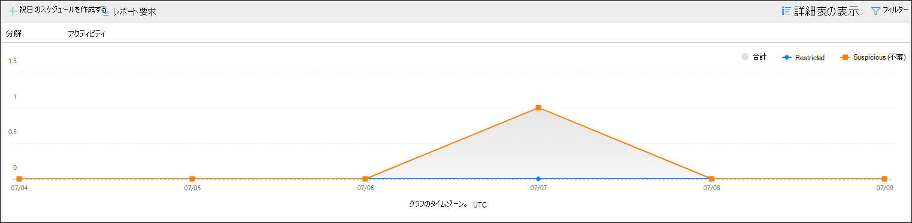
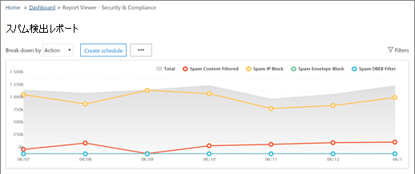

# セキュリティ/コンプライアンス センターで電子メールのセキュリティ レポートを表示するView email security reports in the Security & Compliance Center

[セキュリティ & コンプライアンスセンター](https://protection.office.com)では、Microsoft 365 のスパム対策、マルウェア対策、暗号化機能などの電子メールセキュリティ機能が組織を保護していることを確認するのに役立つさまざまなレポートが提供されています。A variety of reports are available in the [Security & Compliance Center](https://protection.office.com) to help you see how email security features, such as anti-spam, anti-malware, and encryption features in Microsoft 365 are protecting your organization. [必要なアクセス許可](#what-permissions-are-needed-to-view-these-reports)がある場合は、**レポート**ダッシュボードにアクセスすることによって、セキュリティ & コンプライアンスセンターでこれらのレポートを表示でき \> **Dashboard**ます。If you have the [necessary permissions](#what-permissions-are-needed-to-view-these-reports), you can view these reports in the Security & Compliance Center by going to **Reports** \> **Dashboard**. レポートダッシュボードに直接移動するには、を開き <https://protection.office.com/insightdashboard> ます。To go directly to the Reports dashboard, open <https://protection.office.com/insightdashboard>.

## 侵害されたユーザーレポートCompromised users report

> [!NOTE]
> このレポートは、Microsoft 365 組織の Exchange Online メールボックスを使用して利用できます。This report is available in Microsoft 365 organizations with Exchange Online mailboxes. これは、スタンドアロンの Exchange Online Protection (EOP) 組織では使用できません。It's not available in standalone Exchange Online Protection (EOP) organizations.

侵害された **ユーザー** のレポートには、過去7日間以内に **疑わしい** または **制限** されたユーザーアカウントの数が表示されます。The **Compromised users** report shows shows the number of user accounts that were marked as **Suspicious** or **Restricted** within the last 7 days. これらの状態のいずれかのアカウントは、問題が発生しているか、侵害されています。Accounts in either of these states are problematic or even compromised. よく使用されるので、レポートを使用して、不審なアカウントや制限付きのアカウントでスパイクや傾向を見つけることができます。With frequent use, you can use the report to spot spikes, and even trends, in suspicious or restricted accounts. 侵害されたユーザーの詳細については、「 [危害を受けた電子メールアカウントへの対応](responding-to-a-compromised-email-account.md)」を参照してください。For more information about compromised users, see [Responding to a compromised email account](responding-to-a-compromised-email-account.md).

集計ビューには過去90日間のデータが表示され、詳細ビューには過去30日間のデータが表示されます。The aggregate view shows data for the last 90 days and the detail view shows data for the last 30 days.

レポートを表示するには、 [セキュリティ & コンプライアンスセンター](https://protection.office.com)を開き、[ **レポート**] \> **ダッシュボード** に移動して、[侵害された **ユーザー**] を選択します。To view the report, open the [Security & Compliance Center](https://protection.office.com), go to **Reports** \> **Dashboard** and select **Compromised users**. レポートに直接移動するには、を開き <https://protection.office.com/reportv2?id=CompromisedUsers> ます。To go directly to the report, open <https://protection.office.com/reportv2?id=CompromisedUsers>.

[ **フィルター** ] をクリックして、次のいずれかまたは複数の値を選択することによって、グラフと詳細テーブルの両方をフィルターできます。You can filter both the chart and the details table by clicking **Filters** and selecting one or more of the following values:

- **開始日** と **終了日****Start date** and **End date**

- **疑わしい**: ユーザーアカウントは、不審な電子メールを送信しているため、電子メールの送信が制限される危険性があります。**Suspicious**: The user account has sent suspicious email and is at risk of being restricted from sending email.

- **制限**: 非常に疑わしいパターンがあるため、ユーザーアカウントが電子メールの送信を制限されています。**Restricted**: The user account has been restricted from sending email due to highly suspicious patterns.

[ **詳細テーブルの表示**] をクリックすると、次の詳細情報が表示されます。If you click **View details table**, you can see the following details:

- **作成時刻****Creation time**
- **[ユーザー ID]****User ID**
- **操作****Action**

レポートビューに戻るには、[ **レポートの表示**] をクリックします。To go back to the report view, click **View report**.

## 暗号化レポートEncryption report

**暗号化レポート**は、EOP (exchange online またはスタンドアロン EOP の exchange online メールボックスなしのメールボックスを使用したサブスクリプション) で利用できます。The **Encryption report** is available in EOP (subscriptions with mailboxes in Exchange Online or standalone EOP without Exchange Online mailboxes). 組織のセキュリティチームは、このレポートの情報を使用して、パターンを識別し、機密性の高い電子メールメッセージのポリシーを事前に適用または調整することができます。Your organization's security team can use information in this report to identify patterns and proactively apply or adjust policies for sensitive email messages. 例:For example:

- ユーザーによって大量の電子メールメッセージが暗号化されている場合、暗号化ポリシーを追加して、特定のユースケースの暗号化を自動化することができます。If you see a high number of email messages encrypted by users, you might want to add an encryption policy to automate encryption for certain use cases. 詳細については、「 [Microsoft 365 で電子メールメッセージを暗号化するためのメールフロールールを定義する](../../compliance/define-mail-flow-rules-to-encrypt-email.md)」を参照してください。For more information, see [Define mail flow rules to encrypt email messages in Microsoft 365](../../compliance/define-mail-flow-rules-to-encrypt-email.md).

- 使用可能な暗号化テンプレートが多数あり、それを使用しているものがない場合は、ユーザーが機能のトレーニングを必要としているかどうかを調べることができます。If you have a number of encryption templates available but no one is using them, you might explore whether users need feature training.

集計ビューでは、過去90日間のフィルターを使用でき、詳細ビューでは10日間のフィルター処理を実行できます。The aggregate view allows filtering for the last 90 days, while the detail view allows filtering for 10 days.

レポートを表示するには、 [セキュリティ & コンプライアンスセンター](https://protection.office.com)を開き、[ **レポート** \> **ダッシュボード** ] に移動して、[ **暗号化レポート**] を選択します。To view the report, open the [Security & Compliance Center](https://protection.office.com), go to **Reports** \> **Dashboard** and select **Encryption report**. レポートに直接移動するには、を開き <https://protection.office.com/reportv2?id=EncryptionReport> ます。To go directly to the report, open <https://protection.office.com/reportv2?id=EncryptionReport>.

暗号化の詳細については、「 [Microsoft 365 の電子メールの暗号化](../../compliance/email-encryption.md)」を参照してください。To learn more about encryption, see [Email encryption in Microsoft 365](../../compliance/email-encryption.md).

### 暗号化レポートのレポートビューReport view for the Encryption report

グラフでは、次のフィルターを使用できます。You can use the following filters on the chart:

- **データの表示: メッセージの暗号化レポート** と次の **方法で分割**します。暗号化方法: 次の暗号化方法を使用できます。**View data by: Message Encryption Report** and **Break down by: Encryption method**: The following encryption methods are available:

  - **ユーザーによる暗号化****Encryption by user**
  - **ポリシーによる暗号化****Encryption by policy**

  [ **フィルター**] をクリックすると、次のフィルターを使用してグラフを変更できます。If you click **Filters**, you can modify the chart with the following filters:

  - **開始日** と **終了日****Start date** and **End date**
  - 暗号化方法。Encryption method.
  - 暗号化テンプレート。Encryption template.

- **データの表示形式: メッセージの暗号化レポート** と **分解: 暗号化テンプレート**: 次の暗号化方法を使用できます。**View data by: Message Encryption Report** and **Break down by: Encryption template**: The following encryption methods are available:

  - **転送不可****Do not forward**
  - **暗号化のみ****Encrypt only**
  - **OME previous****OME previous**
  - **ユーザー設定****Custom**

  [ **フィルター**] をクリックすると、次のフィルターを使用してグラフを変更できます。If you click **Filters**, you can modify the chart with the following filters:

  - **開始日** と **終了日****Start date** and **End date**
  - 暗号化方法Encryption method
  - 暗号化テンプレートEncryption template

- **データの表示形式: 上位5受信者ドメイン**: このビューには、上位5受信者ドメインの送信されたメッセージ数が円グラフで表示されます。**View data by: Top 5 recipient domains**: This view shows a pie chart with sent message counts for the top 5 recipient domains.

  [ **フィルター**] をクリックすると、 **開始日** と **終了日**を選択できます。If you click **Filters**, you can select a **Start date** and **End date**.

### 暗号化レポートの詳細表ビューDetails table view for the Encryption report

[ **詳細テーブルの表示**] をクリックした場合、表示されている情報は、表示されていたグラフによって異なります。If you click **View details table**, the information that's shown depends on the chart you were looking at:

- **下に移動: 暗号化方法** または次のよう **に分割します。暗号化テンプレート**: 次の情報が表示されます。**Break down by: Encryption method** or **Break down by: Encryption template**: The following information is shown:

  - **Date****Date**
  - **[送信者のアドレス]****Sender address**
  - **暗号化テンプレート****Encryption template**
  - **暗号化方法****Encryption method**
  - **受信者のアドレス****Recipient address**
  - **[件名]****Subject**

- **データの表示方法: 上位5受信者ドメイン**:**View data by: Top 5 recipient domains**:

  - **Date****Date**
  - **受信者ドメイン****Recipient domain**
  - **メッセージ数****Message count**
  
詳細テーブルビューで [ **フィルター** ] をクリックすると、次のフィルターを使用して結果を変更できます。If you click **Filters** in a details table view, you can modify the results with the following filters:

- **開始日** と **終了日****Start date** and **End date**
- 暗号化方法Encryption method
- 暗号化テンプレートEncryption template

レポートビューに戻るには、[ **レポートの表示**] をクリックします。To go back to the report view, click **View report**.

## メールフロー状態レポートMailflow status report

**メールフロー status レポート**には、マルウェア、スパム、フィッシングおよびエッジブロックされたメッセージに関する情報が含まれています。The **Mailflow status report** contains information about malware, spam, phishing and edge blocked messages. 詳細については、「 [メールフロー status report](view-mail-flow-reports.md#mailflow-status-report)」を参照してください。For more details, see [Mailflow status report](view-mail-flow-reports.md#mailflow-status-report).

## 電子メールレポートでのマルウェアの検出Malware detections in email report

**電子メールのマルウェア検出**レポートには、受信および送信電子メールメッセージ (Exchange Online Protection または EOP によって検出されたマルウェア) でのマルウェアの検出に関する情報が表示されます。The **Malware detections in email** report shows information about malware detections in incoming and outgoing email messages (malware detected by Exchange Online Protection or EOP). EOP でのマルウェア保護の詳細については、「 [EOP のマルウェア対策保護](anti-malware-protection.md)」を参照してください。For more information about malware protection in EOP, see [Anti-malware protection in EOP](anti-malware-protection.md).

 集計ビューのフィルターでは90日間が許可されますが、詳細テーブルのフィルターでは10日間しか許可されません。The aggregate view filter allows for 90 days, while the details table filter only allows for 10 days.

レポートを表示するには、 [セキュリティ & コンプライアンスセンター](https://protection.office.com)を開き、[ **レポート** \> ] **ダッシュボード** に移動して、[ **電子メールでマルウェアの検出**] を選択します。To view the report, open the [Security & Compliance Center](https://protection.office.com), go to **Reports** \> **Dashboard** and select **Malware detections in email**. レポートに直接移動するには、を開き <https://protection.office.com/reportv2?id=MalwareDetections> ます。To go directly to the report, open <https://protection.office.com/reportv2?id=MalwareDetections>.

[ **フィルター** ] をクリックして、次のものを選択することによって、グラフと詳細テーブルの両方をフィルターできます。You can filter both the chart and the details table by clicking **Filters** and selecting:

- **開始日** と **終了日****Start date** and **End date**
- **受信****Inbound**
- **向き****Outbound**

[ **詳細テーブルの表示**] をクリックすると、次の詳細情報が表示されます。If you click **View details table**, you can see the following details:

- **Date****Date**
- **[送信者のアドレス]****Sender address**
- **受信者のアドレス****Recipient address**
- メッセージ**id**: メッセージヘッダーの**メッセージ id**ヘッダーフィールドで利用可能で、一意である必要があります。**Message ID**: Available in the **Message-ID** header field in the message header and should be unique. 値の例を次に示し `<08f1e0f6806a47b4ac103961109ae6ef@server.domain>` ます (角かっこに注意してください)。An example value is `<08f1e0f6806a47b4ac103961109ae6ef@server.domain>` (note the angle brackets).
- **[件名]****Subject**
- **Filename****Filename**
- **マルウェアの名前****Malware name**

レポートビューに戻るには、[ **レポートの表示**] をクリックします。To go back to the report view, click **View report**.

## 送信および受信した電子メールレポートSent and received email report

**送信および受信した電子メール**レポートには、マルウェア、スパム、メールフロールール (トランスポートルールとも呼ばれる) に関する情報と、電子メールがサービスに入った後の高度なマルウェアの検出に関する情報が含まれています。The **Sent and received email** report contains information about malware, spam, mail flow rules (also known as transport rules), and advanced malware detections after email enters the service. 詳細については、「 [送信および受信した電子メールレポート](view-mail-flow-reports.md#sent-and-received-email-report)」を参照してください。For more information, see [Sent and received email report](view-mail-flow-reports.md#sent-and-received-email-report).

## スパム検出レポートSpam detections report

**スパム検出**レポートには、EOP によってブロックされたスパム電子メールメッセージが表示されます。The **Spam detections** report shows spam email messages that were blocked by EOP. メッセージは、受信者ごとではなく個別にカウントされます。Messages are counted individually, not per recipient. たとえば、同じスパムメッセージが組織内の100の受信者に送信された場合は、1つのメッセージとして数えられます。For example, if the same spam message was sent to 100 recipients in your organization, it counts as one message.

集計ビューでは90日間のフィルター処理が可能で、詳細テーブルでは10日のフィルター処理が許可されています。The aggregate view allows for 90 days filtering, while the details table allows for 10 days filtering.

レポートを表示するには、[セキュリティ & コンプライアンスセンター](https://protection.office.com)を開き、[**レポート**] ダッシュボードに移動し \> **Dashboard**て、[**スパム検出**] を選択します。To view the report, open the [Security & Compliance Center](https://protection.office.com), go to **Reports** \> **Dashboard** and select **Spam detections**. レポートに直接移動するには、を開き <https://protection.office.com/reportv2?id=SpamDetections> ます。To go directly to the report, open <https://protection.office.com/reportv2?id=SpamDetections>.

スパム対策保護の詳細については、「 [EOP のスパム対策保護](anti-spam-protection.md)」を参照してください。For more information about anti-spam protection, see [Anti-spam protection in EOP](anti-spam-protection.md).

### スパム検出レポートのレポートビューReport view for the Spam detections report

次のグラフがレポートビューで利用できます。The following charts are available in the report view:

- **分割ダウン: アクション**: 次のイベントの種類が表示されます。**Break down by: Action**: The following event types are shown:

  - **スパムコンテンツのフィルター処理****Spam content filtered**
  - **スパム IP 禁止****Spam IP block**
  - **スパムの封筒ブロック****Spam envelope block**
  - **スパム dbeb フィルター**: ディレクトリベースのエッジブロック (dbeb)**Spam DBEB filter**: Directory based edge blocking (DBEB)

  グラフの1日 (データポイント) にカーソルを置くと、その日にブロックされたアイテムの数と、それらのアイテムがどのように分類されているかを確認できます。When you hover over a day (data point) in the chart, you can see how many items were blocked that day, as well as how those items are categorized.

  

- 次のよう**に分割します。方向**: 次の方向が表示されます。**Break down by:Direction**: The following directions are shown:

  - **受信****Inbound**
  - **向き****Outbound**

  

レポートビューで [ **フィルター** ] をクリックすると、次のフィルターを使用して結果を変更できます。If you click **Filters** in a report view, you can modify the results with the following filters:

- **開始日** と **終了日****Start date** and **End date**
- Direction 値Direction values
- イベントの種類の値Event type values

### スパム検出レポートの詳細表ビューDetails table view for the Spam detections report

いずれかのレポートビューで [ **詳細テーブルの表示** ] をクリックすると、次の情報が表示されます。If you click **View details table** in any report view, the following information is shown:

- **Date****Date**
- **[送信者のアドレス]****Sender address**
- **受信者のアドレス****Recipient address**
- **イベントの種類****Event type**
- **操作****Action**
- **[件名]****Subject**

詳細テーブルで [ **フィルター** ] をクリックすると、次のフィルターを使用して結果を変更できます。If you click **Filters** in a details table, you can modify the results with the following filters:

- **開始日** と **終了日****Start date** and **End date**
- Direction 値Direction values
- イベントの種類の値Event type values

レポートビューに戻るには、[ **レポートの表示**] をクリックします。To go back to the report view, click **View report**.

## スプーフィング検出レポートSpoof detections report

**スプーフィング検出**レポートには、検出されたスプーフィングメールメッセージの数と、それらのメッセージのうちどれが "good" (正当なビジネス上の理由で、メールのスプーフィングが行われたもの) であることが示されています。The **Spoof detections** report shows how many spoof mail messages were detected, and of those, which ones were considered "good" (spoof mail done for legitimate business reasons). スプーフィングの詳細については、「 [EOP でのスプーフィング対策保護](anti-spoofing-protection.md)」を参照してください。For more information about spoofing, see [Anti-spoofing protection in EOP](anti-spoofing-protection.md).

レポートの集計ビューでは90日間のフィルター処理が可能になりますが、詳細ビューでは10日間のフィルター処理しか許可されません。The aggregate view of the report allows for 90 days of filtering, while the detail view only allows for ten days of filtering.

レポートを表示するには、[セキュリティ & コンプライアンスセンター](https://protection.office.com)を開き、[**レポート**] ダッシュボードに移動し \> **Dashboard**て、[**スプーフィング検出**] を選択します。To view the report, open the [Security & Compliance Center](https://protection.office.com), go to **Reports** \> **Dashboard** and select **Spoof detections**. レポートに直接移動するには、を開き <https://protection.office.com/reportv2?id=SpoofMailReport> ます。To go directly to the report, open <https://protection.office.com/reportv2?id=SpoofMailReport>.

グラフの1日 (データポイント) にカーソルを置くと、受信したスプーフィングメールメッセージの数を確認できます。When you hover over a day (data point) in the chart, you can see how many spoof mail messages came through.

[ **フィルター** ] をクリックして、次のいずれかまたは複数の値を選択することによって、グラフと詳細テーブルの両方をフィルターできます。You can filter both the chart and the details table by clicking **Filters** and selecting one or more of the following values:

- **開始日** と **終了日****Start date** and **End date**

- **正常なメール****Good mail**

- **スパムとして検出された****Caught as spam**

[ **詳細テーブルの表示**] をクリックすると、次の詳細情報が表示されます。If you click **View details table**, you can see the following details:

- **Date****Date**
- **スプーフィングされた送信者****Spoofed sender**
- **True 送信者****True sender**
- [**Sender IP (送信者の IP)**]**Sender IP**
- **操作****Action**
- **メッセージ数****Message count**

レポートビューに戻るには、[ **レポートの表示**] をクリックします。To go back to the report view, click **View report**.

## 脅威保護の状態レポートThreat protection status report

**脅威保護の状態**レポートは、EOP と OFFICE 365 ATP の両方で使用できます。ただし、レポートには異なるデータが含まれています。The **Threat protection status** report is available in both EOP and Office 365 ATP; however, the reports contain different data. たとえば、EOP のお客様は、電子メールで検出されたマルウェアに関する情報を表示できますが、 [SharePoint Online、OneDrive、Microsoft Teams で検出された悪意のあるファイル](atp-for-spo-odb-and-teams.md)に関する情報は表示できません。For example, EOP customers can view information about malware detected in email, but not information about [malicious files detected in SharePoint Online, OneDrive, or Microsoft Teams](atp-for-spo-odb-and-teams.md).

このレポートでは、マルウェア対策エンジンによってブロックされたファイルや web サイトアドレス (Url)、 [ゼロ時間自動削除 (ZAP)](zero-hour-auto-purge.md)、Atp の [安全なリンク](atp-safe-links.md)、Atp の [安全な添付ファイル](atp-safe-attachments.md)、 [atp のフィッシング対策](set-up-anti-phishing-policies.md)など、さまざまなコンテンツを含む電子メールメッセージの数が提供されます。The report provides the count of email messages with malicious content, such as files or website addresses (URLs) that were blocked by the anti-malware engine, [zero-hour auto purge (ZAP)](zero-hour-auto-purge.md), and ATP features like [ATP Safe Links](atp-safe-links.md), [ATP Safe Attachments](atp-safe-attachments.md), and [ATP anti-phishing](set-up-anti-phishing-policies.md). この情報を使用して、傾向を特定したり、組織のポリシーを調整する必要があるかどうかを判断したりできます。You can use this information to identify trends or determine whether organization policies need adjustment. メッセージが5人の受信者に送信される場合は、メッセージを5つの異なるメッセージとしてカウントし、1つのメッセージではないことを理解しておくことが重要です。It's important to understand that if a message is sent to five recipients we count it as five different messages and not one message.

レポートを表示するには、[セキュリティ & コンプライアンスセンター](https://protection.office.com)を開き、[**レポート**] ダッシュボードに移動し \> **Dashboard**て、[**脅威保護の状態**] を選択します。To view the report, open the [Security & Compliance Center](https://protection.office.com), go to **Reports** \> **Dashboard** and select **Threat protection status**. レポートに直接移動するには、次のいずれかの Url を開きます。To go directly to the report, open one of the following URLs:

- Office 365 ATP: <https://protection.office.com/reportv2?id=ATPV2AggregateReport> 。Office 365 ATP: <https://protection.office.com/reportv2?id=ATPV2AggregateReport>.
- EOP <https://protection.office.com/reportv2?id=ATPAggregateLightReport>EOP: <https://protection.office.com/reportv2?id=ATPAggregateLightReport>

既定では、グラフに過去7日間のデータが表示されます。By default, the chart shows data for the past 7 days. [ **フィルター**] をクリックした場合は、90日の日付の範囲を選択できます (試用版のサブスクリプションは30日間に制限される場合があります)。If you click **Filters**, you can select a 90 day date range (trial subscriptions might be limited to 30 days). 詳細テーブルビューでは、30日間のフィルター処理を実行できます。The details table view allows filtering for 30 days.

### 脅威保護状態レポートのレポートビューReport view for the Threat protection status report

次のビューを利用できます。The following views are available:

- **データの表示: 概要**: 次の検出情報が表示されます。**View data by: Overview**: The following detection information is shown:

  - **メールマルウェア****Email malware**
  - **電子メールフィッシング****Email phish**
  - **コンテンツマルウェア****Content malware**

  

- **データの表示方法: コンテンツ \> マルウェア**1: 次の情報は、Office 365 ATP 組織で表示されます。**View data by: Content \> Malware**1: The following information is shown for Office 365 ATP organizations:

  - **マルウェア対策エンジン****Anti-malware engine**
  - **ファイル分析****File detonation**

  

- **下に移動: 検出テクノロジ** と **View data: Email \> フィッシング**: 次の情報が表示されます。**Break down by: Detection technology** and **View data by: Email \> Phish**: The following information is shown:

  - **ATP で生成された URL 評価**1**ATP-generated URL reputation**1
  - **高度なフィッシングフィルター****Advanced phish filter**
  - **スプーフィング防止: DMARC エラー****Anti-spoof: DMARC failure**
  - **スプーフィング対策: 組織内****Anti-spoof: Intra-org**
  - **スプーフィング防止: 外部ドメイン****Anti-spoof: external domain**
  - **ブランド偽装****Brand impersonation**
  - **ドメイン偽装**1**Domain impersonation**1
  - **EOP URL 評価****EOP URL reputation**
  - **一般的なフィッシングフィルター****General phish filter**
  - **Others****Others**
  - **フィッシング ZAP**2**Phish ZAP**2
  - **URL 分析**1**URL detonation**1
  - **ユーザー偽装**1**User impersonation**1

  

- **分割ダウン: 検出テクノロジ** と **データの表示者: 電子メール \> マルウェア**: 次の情報が表示されます。**Break down by: Detection technology** and **View data by: Email \> Malware**: The following information is shown:

  - **ATP で生成されたファイル評価**1**ATP-generated file reputation**1
  - **マルウェア対策エンジン**1**Anti-malware engine**1
  - **マルウェア対策ポリシーファイルの種類ブロック****Anti-malware policy file type block**
  - **ファイル分析**1**File detonation**1
  - **悪意のあるファイルの評価****Malicious file reputation**
  - **マルウェアの ZAP**2**Malware ZAP**2
  - **Others****Others**

  

- **分割ダウン: Policy type** and **view Data by: Email \> フィッシング** Or **view data by: email \> マル**: 次の情報が表示されます。**Break down by: Policy type** and **View data by: Email \> Phish** or **View data by: Email \> Malware**: The following information is shown:

  - **マルウェア対策****Anti-malware**
  - **安全な添付ファイル**1**Safe Attachment**1
  - **フィッシング****Anti-phish**
  - **スパム対策****Anti-spam**
  - **メールフロールール** (トランスポートルールとも呼ばれる)**Mail flow rule** (also known as a transport rule)
  - **Others****Others**

  

- **分割ダウン: 配信状態** および **表示データ: 電子メールの \> フィッシング** または **view by: email \> マルウェア**: 次の情報が表示されます。**Break down by: Delivery status** and **View data by: Email \> Phish** or **View data by: Email \> Malware**: The following information is shown:

  - **配信失敗****Delivery failed**
  - **落下****Dropped**
  - **転送****Forwarded**
  - **ホストされているメールボックス: カスタムフォルダー****Hosted mailbox: Custom folder**
  - **ホストされているメールボックス: 削除済みアイテム****Hosted mailbox: Deleted items**
  - **ホストされているメールボックス: 受信トレイ****Hosted mailbox: Inbox**
  - **ホストされているメールボックス: 迷惑****Hosted mailbox: Junk**
  - **オンプレミスサーバー: 配信済み****On-premises server: Delivered**
  - **検疫****Quarantine**

  

1 OFFICE 365 ATP のみ1 Office 365 ATP only

2 ゼロ時間自動削除 (ZAP) は、スタンドアロン EOP では使用できません (Exchange Online メールボックスでのみ動作します)。2 Zero-hour auto purge (ZAP) isn't available in standalone EOP (it only works in Exchange Online mailboxes).

[ **フィルター**] をクリックすると、次のフィルターを使用してレポートを変更できます。If you click **Filters**, you can modify the report with the following filters:

- **開始日** と **終了日****Start date** and **End date**
- 検出値Detection value
- **保護者** (OFFICE 365 ATP のみ): **ATP** または **EOP**。**Protected by** (Office 365 ATP only): **ATP** or **EOP**. このフィルター処理可能なプロパティは、 **「データの表示方法: コンテンツ \> マルウェア**」では使用できないことに注意してください。Note that this filterable property isn't available in **View data by: Content \> Malware**.

### 脅威保護状態レポートの詳細表ビューDetails table view for the Threat protection status report

[ **詳細テーブルの表示**] をクリックした場合、表示されている情報は、表示されていたグラフによって異なります。If you click **View details table**, the information that's shown depends on the chart you were looking at:

- **データの表示方法: コンテンツ \> マルウェア**:**View data by: Content \> Malware**:

  - **Date****Date**
  - **Location****Location**
  - **転送者****Directed by**
  - **マルウェアの名前****Malware name**

- **データの表示: 概要**: [ **表示の詳細] テーブル** ボタンは使用できません。**View data by: Overview**: No **View details table** button is available.

- その他のすべてのグラフ:All other charts:

  - **Date****Date**
  - **[件名]****Subject**
  - **送信者****Sender**
  - **受信者****Recipients**
  - **検出者****Detected by**
  - **配信状態****Delivery status**
  - **侵害のソース****Source of compromise**

[ **フィルター**] をクリックすると、次のフィルターを使用してレポートを変更できます。If you click **Filters**, you can modify the report with the following filters:

- **開始日** と **終了日****Start date** and **End date**
- 検出値Detection value
- **保護者** (OFFICE 365 ATP のみ): **ATP** または **EOP**。**Protected by** (Office 365 ATP only): **ATP** or **EOP**. このフィルター処理可能なプロパティは、 **「データの表示方法: コンテンツ \> マルウェア**」では使用できないことに注意してください。Note that this filterable property isn't available in **View data by: Content \> Malware**.

## 上位マルウェアレポートTop malware report

**上位マルウェア**レポートには、 [EOP でマルウェア対策保護](anti-malware-protection.md)によって検出されたさまざまな種類のマルウェアが表示されます。The **Top malware** report shows the various kinds of malware that was detected by [anti-malware protection in EOP](anti-malware-protection.md).

レポートを表示するには、 [セキュリティ & コンプライアンスセンター](https://protection.office.com)を開き、[ **レポート**] \> **ダッシュボード** に移動して [ **上位マルウェア**] を選択します。To view the report, open the [Security & Compliance Center](https://protection.office.com), go to **Reports** \> **Dashboard** and select **Top malware**. レポートに直接移動するには、を開き <https://protection.office.com/reportv2?id=TopMalware> ます。To go directly to the report, open <https://protection.office.com/reportv2?id=TopMalware>.

円グラフのくさび形の上にポインターを移動すると、マルウェアの種類の名前と、マルウェアを持っていることが検出されたメッセージの数を確認できます。When you hover over a wedge in the pie chart, you can see the name of a kind of malware and how many messages were detected as having that malware.

[ **詳細テーブルの表示**] をクリックすると、次の詳細情報が表示されます。If you click **View details table**, you can see the following details:

- **上位マルウェア****Top malware**
- **Count****Count**

レポートビューまたは詳細テーブルビューで [ **フィルター** ] をクリックすると、 **開始** 日と **終了日**を含む日付範囲を指定できます。If you click **Filters** in the report view or details table view, you can specify a date range with **Start date** and **End date**.

## URL の脅威保護レポートURL threat protection report

**URL 脅威保護レポート**は、Office 365 Advanced threat PROTECTION (ATP) で利用できます。The **URL threat protection report** is available in Office 365 Advanced Threat Protection (ATP). 詳細については、「 [URL の脅威保護レポート](view-reports-for-atp.md#url-threat-protection-report)」を参照してください。For more information, see [URL threat protection report](view-reports-for-atp.md#url-threat-protection-report).

## ユーザーによって報告されたメッセージレポートUser-reported messages report

ユーザーによって報告された **メッセージ** レポートには、ユーザーが [レポートメッセージアドイン](https://docs.microsoft.com/microsoft-365/security/office-365-security/enable-the-report-message-add-in)を使用して、迷惑メール、フィッシングの試行、または正常なメールとして報告した電子メールメッセージに関する情報が表示されます。The **User-reported messages** report shows information about email messages that users have reported as junk, phishing attempts, or good mail by using the [Report Message add-in](https://docs.microsoft.com/microsoft-365/security/office-365-security/enable-the-report-message-add-in).

組織に対して構成されたスパムポリシーの例外やメールフロールールなどの配信理由を含む、各メッセージの詳細を表示できます。Details are available for each message, including the delivery reason, such a spam policy exception or mail flow rule configured for your organization. 詳細を表示するには、[ユーザーレポート] リスト内のアイテムを選択し、[ **概要** ] タブと [ **詳細** ] タブで情報を表示します。To view details, select an item in the user-reports list, and then view the information on the **Summary** and **Details** tabs.

このレポートを表示するには、 [セキュリティ & コンプライアンスセンター](https://protection.office.com)で、次のいずれかの手順を実行します。To view this report, in the [Security & Compliance Center](https://protection.office.com), do one of the following:

- [**脅威管理**] ダッシュボードのユーザーによって報告されたメッセージに移動 \> **Dashboard** \> **User-reported messages**します。Go to **Threat management** \> **Dashboard** \> **User-reported messages**.

- [**脅威の管理**] に移動して \> **Review** \> **、ユーザーから報告**されたメッセージを確認します。Go to **Threat management** \> **Review** \> **User-reported messages**.

![セキュリティ & コンプライアンスセンターで、[脅威管理] [ \> ユーザーが報告するメッセージを確認する] を選択します。 \>](../../media/e372c57c-1414-4616-957b-bc933b8c8711.png)

> [!IMPORTANT]
> ユーザーによって報告されたメッセージレポートが正常に機能するためには、Office 365 環境の **監査ログを有効にする必要があり** ます。In order for the User-reported messages report to work correctly, **audit logging must be turned on** for your Office 365 environment. これは、通常、Exchange Online で監査ログの役割が割り当てられているユーザーによって行われます。This is typically done by someone who has the Audit Logs role assigned in Exchange Online. 詳細については、「 [Microsoft 365 監査ログ検索を有効または無効にする](https://docs.microsoft.com/microsoft-365/compliance/turn-audit-log-search-on-or-off)」を参照してください。For more information, see [Turn Microsoft 365 audit log search on or off](https://docs.microsoft.com/microsoft-365/compliance/turn-audit-log-search-on-or-off).

## これらのレポートを表示するには、どのようなアクセス許可が必要ですか。What permissions are needed to view these reports?

レポートを表示して使用するには、セキュリティ & コンプライアンスセンター **および** Exchange Online で、指定された役割グループのメンバーである必要があります。To view and use the reports, you need to be a member of the specified role group in the Security & Compliance Center **and** in Exchange Online.

- セキュリティ & コンプライアンスセンターでは、次のいずれかの役割グループのメンバーである必要があります。In the Security & Compliance Center, you need to be a member of one of the following role groups:

  -組織の管理-セキュリティ管理者 ( [Azure Active Directory 管理センター](https://aad.portal.azure.com) -セキュリティリーダでこれを実行することもできます)-Organization Management -Security Administrator (you can also do this in the [Azure Active Directory admin center](https://aad.portal.azure.com) -Security Reader

  詳細については、「[セキュリティ/コンプライアンス センターのアクセス許可](https://docs.microsoft.com/microsoft-365/security/office-365-security/permissions-in-the-security-and-compliance-center)」を参照してください。For more information, see [Permissions in the Security & Compliance Center](https://docs.microsoft.com/microsoft-365/security/office-365-security/permissions-in-the-security-and-compliance-center).

- Exchange Online では、次のいずれかの役割グループのメンバーである必要があります。In Exchange Online, you need to be a member of one of the following role groups:

  -組織の管理-表示のみの組織の管理-表示のみの受信者-コンプライアンス管理-Organization Management -View-only Organization Management -View-Only Recipients -Compliance Management

詳細については、「exchange online の [アクセス許可](https://docs.microsoft.com/Exchange/permissions-exo/permissions-exo) 」および「 [Manage Role Groups in exchange online](https://docs.microsoft.com/Exchange/permissions-exo/role-groups)」を参照してください。For more information, see [Permissions in Exchange Online](https://docs.microsoft.com/Exchange/permissions-exo/permissions-exo) and [Manage role groups in Exchange Online](https://docs.microsoft.com/Exchange/permissions-exo/role-groups).

## レポートでデータが表示されない場合はどうなりますか。What if the reports aren't showing data?

レポートにデータが表示されない場合は、ポリシーが正しく設定されているかどうかを再確認してください。If you are not seeing data in your reports, double-check that your policies are set up correctly. 詳細については、「 [脅威からの保護](protect-against-threats.md)」を参照してください。To learn more, see [Protect against threats](protect-against-threats.md).

## 関連項目Related topics

[EOP でのスパム対策とマルウェア対策の保護Anti-spam and anti-malware protection in EOP](anti-spam-and-anti-malware-protection.md)

[セキュリティ/コンプライアンス センターのスマート レポートと分析情報Smart reports and insights in the Security & Compliance Center](reports-and-insights-in-security-and-compliance.md)

[セキュリティ & コンプライアンスセンターでメールフローレポートを表示するView mail flow reports in the Security & Compliance Center](view-mail-flow-reports.md)

[Office 365 Advanced Threat Protection のレポートを表示するView reports for Office 365 Advanced Threat Protection](view-reports-for-atp.md)
