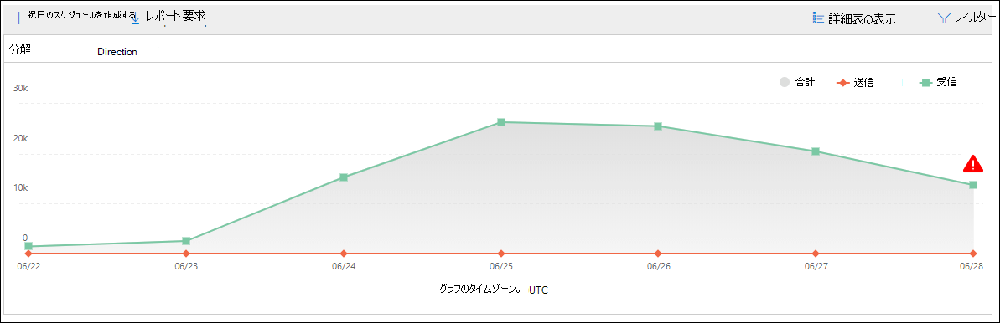
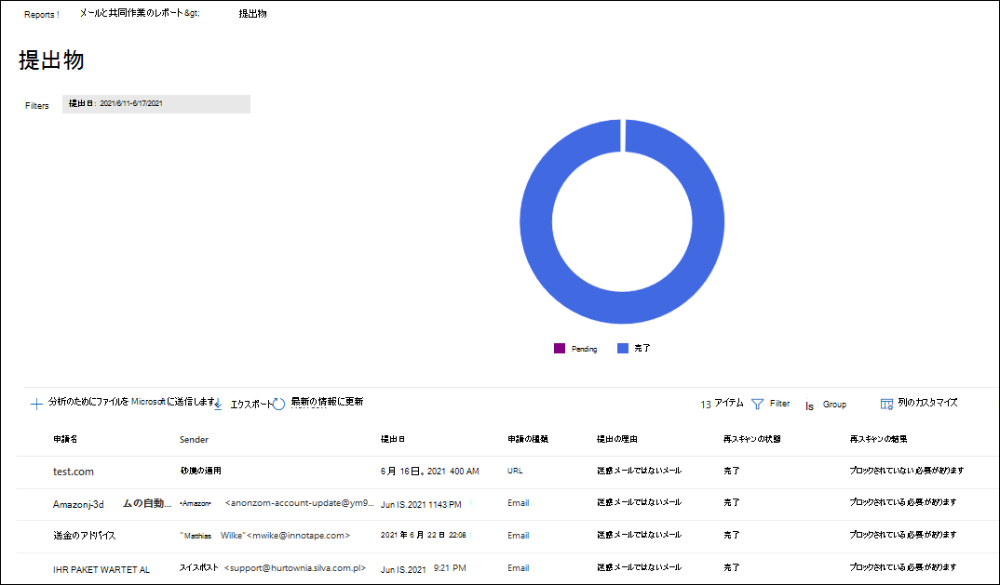
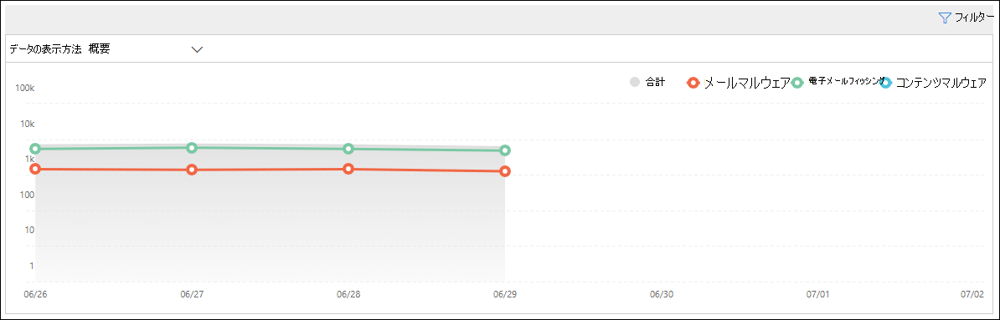
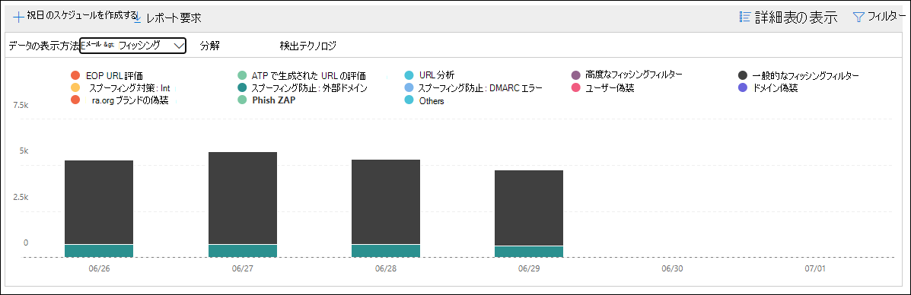
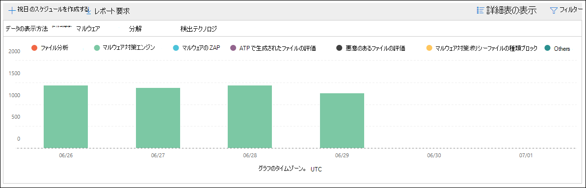
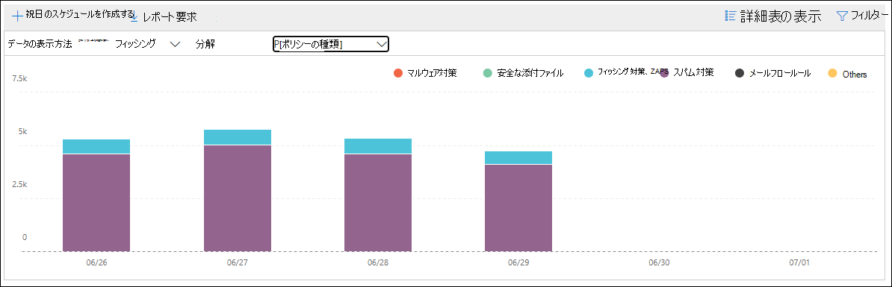
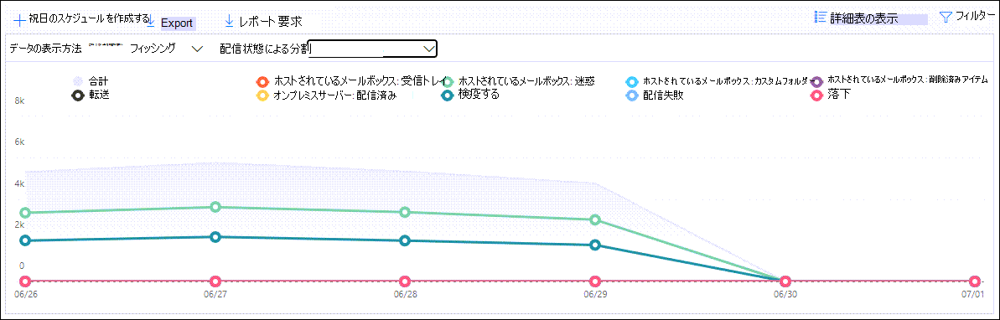
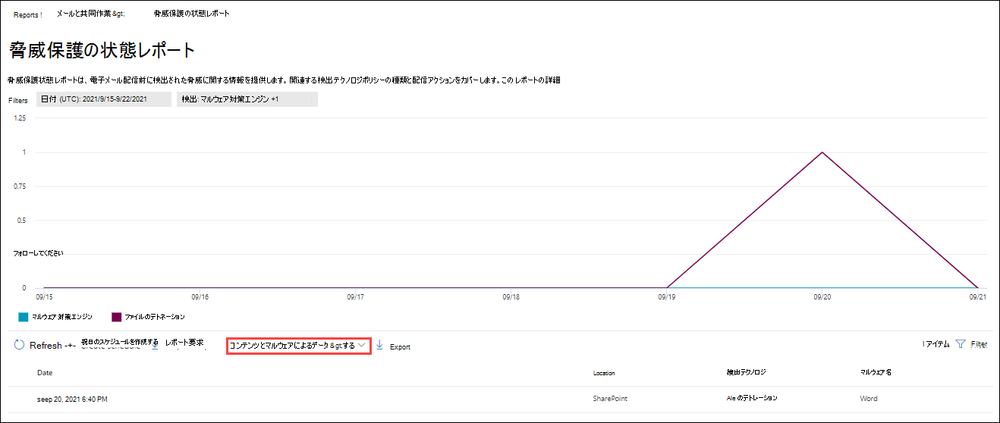
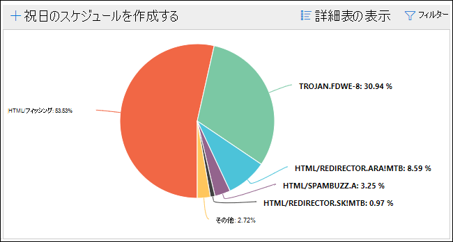
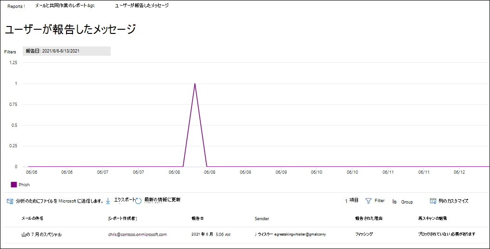

# 電子メール セキュリティ レポートを Microsoft 365 Defenderする

[!INCLUDE [Microsoft 365 Defender rebranding](../includes/microsoft-defender-for-office.md)]

**適用対象**
- [Exchange Online Protection](exchange-online-protection-overview.md)
- [Microsoft Defender for Office 365 プラン 1 およびプラン 2](defender-for-office-365.md)
- [Microsoft 365 Defender](../defender/microsoft-365-defender.md)

Microsoft 365 Defender ポータルでは、Microsoft 365 のスパム対策、マルウェア対策、暗号化機能などの電子メール セキュリティ機能が組織を保護している方法を確認できます。 <https://security.microsoft.com> 必要な [アクセス許可を](#what-permissions-are-needed-to-view-these-reports)持っている場合は、[レポートの電子メール] Microsoft 365 Defender コラボレーション レポートにアクセスして、Microsoft 365 Defender ポータルでこれらのレポート& \> **を** \> **表示&できます**。 [コラボレーション レポートの電子メール] **ページ&移動するには、** を開きます <https://security.microsoft.com/emailandcollabreport> 。

![[&] ポータルの [コラボレーション レポート] ページMicrosoft 365 Defenderメール](../../media/email-collaboration-reports.png)

> [!NOTE]
>
> [電子メール] コラボレーション レポート ページの一 **部のレポート&、Microsoft** Defender が必要です。Office 365。 これらのレポートの詳細については[、「View Defender for Office 365ポータル」をMicrosoft 365 Defenderしてください](view-reports-for-mdo.md)。
>
> メール フローに関連するレポートは、現在、Exchangeセンター (EAC) に表示されます。 これらのレポートの詳細については、「新しい管理センターのメール フロー レポート[Exchange参照してください](/exchange/monitoring/mail-flow-reports/mail-flow-reports)。

## 侵害されたユーザー レポート

> [!NOTE]
> このレポートは、メールボックスを使用Microsoft 365組織Exchange Online使用できます。 スタンドアロン 組織 (EOP) 組織ではExchange Online Protection使用できません。

[**侵害されたユーザー] レポート** には、過去 7 日以内に[疑わしい] または [制限付き] とマークされたユーザー アカウントの数が表示されます。 これらの状態のどちらかのアカウントは、問題が発生したり、侵害された場合もあります。 頻繁に使用すると、レポートを使用して、疑わしいアカウントや制限付きアカウントのスパイクや傾向を見つけるのに使用できます。 侵害されたユーザーの詳細については、「侵害されたメール アカウントへの [応答」を参照してください](responding-to-a-compromised-email-account.md)。

![[コラボレーション レポートの電子メール] ページの [侵害&ユーザー] ウィジェット](../../media/compromised-users-report-widget.png)

集計ビューには過去 90 日間のデータが表示され、詳細ビューには過去 30 日間のデータが表示されます。

ポータルでレポートを表示するにはMicrosoft 365 Defender[レポートの電子メール]  & \>  \> **グループ&に移動します**。 [コラボレーション **レポートのメール&] ページで**、[侵害されたユーザー] を探し、[詳細の表示]**をクリックします**。 レポートに直接移動するには、を開きます <https://security.microsoft.com/reports/CompromisedUsers> 。

[侵害された **ユーザー] ページ** で、指定した日付範囲の次の情報がグラフに表示されます。

- **制限**: 不審なパターンが多く、ユーザー アカウントが電子メールの送信を制限されています。
- **疑** わしい : ユーザー アカウントが不審なメールを送信し、電子メールの送信を制限される危険性があります。

グラフの下の詳細テーブルは、次の情報を示しています。

- **作成時間**
- **[ユーザー ID]**
- **操作**

[フィルター] をクリックし、表示されるフライアウトで次の値の 1 つ以上を選択すると、グラフと詳細テーブルの両方をフィルター処理できます。

- **日付 (UTC)**:**開始日と****終了日**。
- **アクティビティ**: **制限付き** または **疑わしい**

フィルターの構成が完了したら、[適用]、[**キャンセル**]、または [フィルターのクリア]**をクリックします**。

![[侵害されたユーザー] レポートのレポート ビュー](../../media/compromised-users-report-activity-view.png)

## Exchangeトランスポート ルール レポート

トランスポート **Exchangeレポートには**、組織内の受信メッセージと送信メッセージに対するメール フロー ルール (トランスポート ルールとも呼ばれる) の影響が表示されます。

ポータルでレポートを表示するにはMicrosoft 365 Defender[レポートの電子メール]  & \>  \> **グループ&に移動します**。 [コラボレーション **レポートのメール&] ページ** で、トランスポート **Exchangeを見** つけて、[詳細の表示]**をクリックします**。 レポートに直接移動するには、を開きます <https://security.microsoft.com/reports/ETRRuleReport> 。

[トランスポート **Exchangeレポート] ページ** で、使用可能なグラフとデータについて、次のセクションで説明します。

### [方向] によるグラフの内訳

[方向によるグラフ **の内訳] を選択すると**、次のグラフを使用できます。

- **トランスポート ルールExchangeデータ** を表示する : メールフロー ルールの影響を受けた受信メッセージと送信メッセージの数。
- **データを DLP** Exchangeトランスポート ルールで表示する :データ損失防止 (DLP) メール フロー ルールの影響を受けた受信メッセージと送信メッセージの数。

次の情報は、グラフの下の詳細テーブルに示されています。

- **日付**
- **DLP ポリシー** (**DLP によるデータの表示Exchangeトランスポート ルールのみ**)
- **トランスポート ルール**
- **件名**
- **[送信者のアドレス]**
- **受信者の住所**
- **重大度**
- **Direction**

[フィルター] をクリックし、表示されるフライアウトで次の値の 1 つ以上を選択すると、グラフと詳細テーブルの両方をフィルター処理できます。

- **日付 (UTC)** **開始日と****終了日**
- **方向**:**送信と****受信**
- **重大度**:**重大度が高い、****中程度の重大度**、**および低重大度**

フィルターの構成が完了したら、[適用]、[**キャンセル**]、または [フィルターのクリア]**をクリックします**。

### 重大度別のグラフの内訳

[重要度による **グラフの内訳] を選択した場合** は、次のグラフを使用できます。

- **トランスポート ルール別Exchange表示**: 重大度の高いメッセージ、中程度の重大度、および **低** 重大度メッセージの数。 重大度レベルは、ルールのアクションとして設定します **(重大度** レベルまたは _SetAuditSeverity_ でこのルールを監査します)。 詳細については、「メール フロー ルール[のアクション」を参照Exchange Online。](/Exchange/security-and-compliance/mail-flow-rules/mail-flow-rule-actions)

- **DLP メール フロー ルールExchange** 影響を受けた高重大度、中重大度、および低重大度メッセージの数。 

次の情報は、グラフの下の詳細テーブルに示されています。

- **日付**
- **DLP ポリシー** (**DLP によるデータの表示Exchangeトランスポート ルールのみ**)
- **トランスポート ルール**
- **件名**
- **[送信者のアドレス]**
- **受信者の住所**
- **重大度**
- **Direction**

[フィルター] をクリックし、表示されるフライアウトで次の値の 1 つ以上を選択すると、グラフと詳細テーブルの両方をフィルター処理できます。

- **日付 (UTC)** **開始日と****終了日**
- **方向**:**送信と****受信**
- **重大度**:**重大度が高い、****中程度の重大度**、**および低重大度**

フィルターの構成が完了したら、[適用]、[**キャンセル**]、または [フィルターのクリア]**をクリックします**。

## 転送レポート

> [!NOTE]
> 転送 **レポートは** EAC で利用できます。 詳細については、「新しい [EAC の自動転送メッセージ レポート」を参照してください](/exchange/monitoring/mail-flow-reports/mfr-auto-forwarded-messages-report)。

## メールフローの状態レポート

**Mailflow 状態** レポートは、受信および送信メール、スパム検出、マルウェア、"良い" と識別される電子メール、およびエッジで許可またはブロックされた電子メールに関する情報を示すスマート レポートです。 これは、エッジ保護情報を含む唯一のレポートであり、EOP (EOP) による評価のためにサービスに許可される前にブロックされる電子メールの量を示Exchange Online Protectionです。 メッセージが 5 人の受信者に送信された場合、メッセージは 1 つのメッセージではなく 5 つの異なるメッセージとしてカウントされます。

ポータルでレポートを表示するにはMicrosoft 365 Defender[レポートの電子メール]  & \>  \> **グループ&に移動します**。 [メール **の送信&] ページ** で、[ **メールフロー** の状態の概要] を探し、[詳細の表示] **をクリックします**。 レポートに直接移動するには、を開きます <https://security.microsoft.com/reports/mailflowStatusReport> 。

![[メール] グループ作業レポート ページの [メールフロー&概要] ウィジェット](../../media/mail-flow-status-report-widget.png)

### メールフロー状態レポートの種類ビュー

[メール **フローの状態] レポート ページで** 、[種類] **タブ** が既定で選択されています。 グラフには、指定した日付範囲に関する次の情報が表示されます。

- **良いメール**
- **合計**
- **マルウェア**
- **フィッシング詐欺メール**
- **[スパム]**
- **エッジ保護**
- **ルール メッセージ**

グラフの下の詳細テーブルは、次の情報を示しています。

- **Direction**
- **Type**
- **24 時間**
- **3 日間**
- **7 日間**
- **15 日**
- **30 日間**

[フィルター] をクリックし、表示されるフライアウトで次の値の 1 つ以上を選択すると、グラフと詳細テーブルの両方をフィルター処理できます。

- **日付 (UTC)**:**開始日と****終了日**
- **メールの方向**:
  - **受信**
  - **送信**
  - **組織内**: 同じテナント内で送信されるメッセージ。 たとえば、chris@contoso.com にメッセージを送信 michelle@contso.com。
- **種類**:
  - **良いメール**
  - **マルウェア**
  - **[スパム]**
  - **エッジ保護**
  - **ルール メッセージ**
  - **フィッシング詐欺メール**
- **ドメイン**: **すべて**

フィルターの構成が完了したら、[適用]、[**キャンセル**]、または [フィルターのクリア]**をクリックします**。

詳細については、[ **カテゴリの選択] をクリックすると**、次の値から選択できます。

- **フィッシングメール**: この選択によって、脅威保護の [状態レポートが表示されます](view-email-security-reports.md#threat-protection-status-report)。
- **電子メール内のマルウェア**: この選択によって、脅威保護 [の状態レポートが表示されます](view-email-security-reports.md#threat-protection-status-report)。
- **スパム検出**: この選択により、スパム検出 [レポートに移動します](view-email-security-reports.md#spam-detections-report)。
- **エッジブロックスパム**: この選択により、スパム検出 [レポートに移動します](view-email-security-reports.md#spam-detections-report)。

#### [種類] ビューからエクスポートする

詳細ビューでは、1 日のデータのみをエクスポートできます。 したがって、7 日間データをエクスポートする場合は、7 つの異なるエクスポート アクションを実行する必要があります。

エクスポートされたファイル.csv、150,000 行に制限されます。 その日のデータに 150,000 行を超える行が含まれている場合は、複数.csvファイルが作成されます。

### メールフロー状態レポートの方向ビュー

[方向] タブ **をクリック** すると、指定した日付範囲の次の情報がグラフに表示されます。

- **受信**
- **送信**
- **組織内**

グラフの下の詳細テーブルには、Type ビューの同じ情報 **が含** まれている。

[フィルター] をクリックすると、グラフと詳細テーブルの両方をフィルター **処理できます**。 [種類] ビューの同 **じフィルター** を使用できます。

[ **使用可能な選択と動作** の詳細については、カテゴリを選択する] は、[種類] ビューと **同** じです。

#### 方向ビューからエクスポートする

詳細ビューでは、1 日のデータのみをエクスポートできます。 したがって、7 日間データをエクスポートする場合は、7 つの異なるエクスポート アクションを実行する必要があります。

エクスポートされたファイル.csv、150,000 行に制限されます。 その日のデータに 150,000 行を超える行が含まれている場合は、複数.csvファイルが作成されます。

### メールフロー状態レポートのファネル ビュー

[ **ファネル** ] ビューには、Microsoft の電子メール脅威防止機能が組織内の受信メールと送信メールをフィルター処理する方法が表示されます。 電子メールの総数と、エッジ保護、マルウェア対策、フィッシング対策、スパム対策、スプーフィング対策などの構成済みの脅威保護機能が、この数に与える影響の詳細を示します。

集計ビューと詳細テーブル ビューでは、90 日間のフィルター処理が可能です。

[ファネル] タブ **をクリック** すると、指定した日付範囲の次のカテゴリに分類されたメッセージがグラフに表示されます。

- **メールの総数**: この値は常に最初に表示されます。 残りの値は、メッセージ数で降順に表示されます。
- **エッジ保護後のメール**
- **トランスポート ルールの後のメール** (メール フロー ルール)
- **マルウェア対策、ファイル評価、ファイルの種類ブロック後のメール**
  - **ファイル評価**: 他の Microsoft のお客様が添付ファイルを識別するためにフィルター処理されたメッセージ。
  - **ファイルの種類のブロック**: メッセージで識別された悪意のあるファイルの種類によってフィルター処理されたメッセージ。
- **フィッシング対策、URL 評価、ブランド偽装、スプーフィング対策の後のメール**
  - **URL レピュ** テーション : 他の Microsoft のお客様による URL の識別のためにフィルター処理されたメッセージ。
  - **ブランド偽装**: よく知られているブランド偽装送信者からのメッセージが原因でフィルター処理されたメッセージ。
  - **スプーフィング** 対策: 受信者が属するドメイン、またはメッセージ送信者が所有していないドメインをスプーフィングしようとするメッセージが原因でフィルター処理されたメッセージ。
- **スパム対策、バルク メール フィルター処理後のメール**
  - **バルク メール フィルター :** スパム対策ポリシーの一括不平レベル (BCL) しきい値に基づいてフィルター処理されたメッセージ。
- **ユーザーとドメインの偽装後のメール**
  - **ユーザー偽装**: Defender for Office 365 のフィッシング対策ポリシーの偽装保護設定で定義されているユーザー (メッセージ送信者) を偽装しようとしてフィルター処理されたメッセージ。
  - **ドメイン偽装**: Defender for Office 365 のフィッシング対策ポリシーの偽装保護設定で定義されているドメインを偽装しようとしてフィルター処理されたメッセージ。
- **ファイルと URL の削除後のメール**
  - **ファイルの削除**: 添付ファイル ポリシーでフィルターセーフメッセージ。
  - **URL の削除**: リンク ポリシーでフィルターセーフメッセージ。
- **配信後の保護後に良性として検出された電子メール (URL クリック時間保護)**

カテゴリは **、EOP** または Defender によって色分 **け** Office 365。 グラフのカテゴリをフィルター処理するには、グラフの凡例で **[EOP]** または **[Defender]** Office 365をクリックします (1 回クリックして削除し、もう 1 回クリックして戻します)。

グラフの下の詳細テーブルには、グラフと同じ情報が含まれているが、異なる (短い) 説明が含まれている。

- **メールの総数**
- **エッジ保護**
- **ルール メッセージ**
- **マルウェア対策、ファイル評価、ファイルの種類、ファイル ブロック**
- **フィッシング対策、URL 評価、ブランド偽装、スプーフィング対策**
- **スパム対策、バルク メール フィルター**
- **ユーザーとドメインの偽装**
- **ファイルと URL のデトレーション (ATP)**: Defender for Office 365
- **配信後の保護と ZAP (ATP)**: Defender for Office 365

詳細テーブルで行を選択すると、メール数の詳細がフライアウトに表示されます。

[フィルター] をクリックし、表示されるフライアウトで次の値の 1 つ以上を選択すると、グラフと詳細テーブルの両方をフィルター処理できます。

- **日付 (UTC)**:**開始日と****終了日**
- **メールの方向**:
  - **受信**
  - **送信**
  - **組織内**: 同じテナント内で送信されるメッセージ。 たとえば、chris@contoso.com にメッセージを送信 michelle@contso.com。

フィルターの構成が完了したら、[適用]、[**キャンセル**]、または [フィルターのクリア]**をクリックします**。

#### ファネル ビューからエクスポートする

[オプション] で **[エクスポート]** **をクリック** すると、次のいずれかの値を選択できます。

- **概要 (最大で過去 90 日間のデータを含む)**
- **詳細 (最大で過去 30 日間のデータを含む)**

[ **日付] で** 範囲を選択し、[適用] を **クリックします**。 現在のフィルターのデータは、特定のファイルに.csvされます。

エクスポートされたファイル.csv、150,000 行に制限されます。 データに 150,000 行を超える行が含まれている場合は、複数.csvファイルが作成されます。

### メールフローの状態レポートの技術ビュー

Tech **ビューは、** ファネル **ビューに** 似ています。構成済みの脅威保護機能の詳細を提供します。 グラフから、脅威保護の異なる段階でメッセージがどのように分類されるのか確認できます。

集計ビューと詳細テーブルでは、90 日間のフィルター処理が可能です。

[Tech view] **タブをクリック** すると、指定した日付範囲の次のカテゴリに分類されたメッセージがグラフに表示されます。

- **メールの総数**
- **エッジ許可** と **フィルター処理されたエッジ**
- **トランスポート ルールの許可** と **トランスポート ルールのフィルター** 処理 (メール フロー ルール)
- **マルウェアではない****、セーフ添付ファイルの検出、** \* **マルウェア対策エンジンの検出**
- **フィッシング** **、DMARC 障害、****偽装検出、ス** プーフィング \* **検出**、**およびフィッシングの検出を行う**
- **URL のデトレーションと URL の** デトレーション **検出による検出なし**\*
- **スパムとスパム****ではない**
- **悪意のあるメール以外の電子****メール、セーフリンクの検出** \* 、**および ZAP**

\*Defender for Office 365

グラフ内のカテゴリにカーソルを合わせると、そのカテゴリ内のメッセージの数が表示されます。

グラフの下の詳細テーブルには、次の情報が含まれます

- **日付 (UTC)**
- **メールの総数**
- **フィルター処理されたエッジ**
- **ルール メッセージ**: メール フロー ルール (トランスポート ルールとも呼ばれる) が原因でフィルター処理されたメッセージ。
- **マルウェア対策エンジン、セーフ添付ファイル** \* :
- **DMARC、 偽装** \* 、 ス **プーフィング**、**フィッシング フィルター**:
  - **DMARC**: DMARC 認証チェックに失敗したメッセージが原因でフィルター処理されたメッセージ。
- **URL のデトレーション検出**\*
- **フィルター処理されたスパム対策**
- **ZAP が削除されました**
- **リンクによるセーフ検出**\*

\*Defender for Office 365

詳細テーブルで行を選択すると、メール数の詳細がフライアウトに表示されます。

[フィルター] をクリックし、表示されるフライアウトで次の値の 1 つ以上を選択すると、グラフと詳細テーブルの両方をフィルター処理できます。

- **日付 (UTC)**:**開始日と****終了日**
- **メールの方向**:
  - **受信**
  - **送信**
  - **組織内**: 同じテナント内で送信されるメッセージ。 たとえば、chris@contoso.com にメッセージを送信 michelle@contso.com。

フィルターの構成が完了したら、[適用]、[**キャンセル**]、または [フィルターのクリア]**をクリックします**。

#### Tech ビューからのエクスポート

[エクスポート] **をクリックすると**、[ **オプション] で** 、次のいずれかの値を選択できます。

- **概要 (最大で過去 90 日間のデータを含む)**
- **詳細 (最大で過去 30 日間のデータを含む)**

[ **日付] で** 範囲を選択し、[適用] を **クリックします**。 現在のフィルターのデータは、特定のファイルに.csvされます。

エクスポートされたファイル.csv、150,000 行に制限されます。 データに 150,000 行を超える行が含まれている場合は、複数.csvファイルが作成されます。

## マルウェア検出レポート

[**マルウェア検出] レポート レポートには**、受信および送信電子メール メッセージ (マルウェアが受信または EOP によって検出Exchange Online Protection情報が表示されます。 EOP のマルウェア保護の詳細については、「EOP の [マルウェア対策保護」を参照してください](anti-malware-protection.md)。

集計ビュー フィルターでは 90 日間、詳細テーブル フィルターでは 10 日間のみ許可されます。

ポータルでレポートを表示するにはMicrosoft 365 Defender[レポートの電子メール]  & \>  \> **グループ&に移動します**。 [電子メール **の共有&] ページで** 、[ **電子メールで** 検出されたマルウェア] を探し、[詳細の表示] **をクリックします**。 レポートに直接移動するには、を開きます <https://security.microsoft.com/reports/MalwareDetections> 。

![[メール と共同作業レポート] ページの電子メール ウィジェット&検出](../../media/malware-detections-widget.png)

[マルウェア **検出] レポート ページで** 、指定した日付範囲に関する次の情報がグラフに表示されます。

- **送信**
- **受信**

グラフの下の詳細テーブルは、次の情報を示しています。

- **日付**
- **[送信者のアドレス]**
- **受信者の住所**
- **メッセージ ID**: メッセージ ヘッダーの **[Message-ID** ヘッダー] フィールドで使用できます。一意である必要があります。 値の例は `<08f1e0f6806a47b4ac103961109ae6ef@server.domain>` 次のようになります (角かっこに注意してください)。
- **件名**
- **Filename**
- **マルウェア名**

[フィルター] をクリックし、次のいずれかの値を選択すると、グラフと詳細テーブルの両方をフィルター処理できます。

- **日付 (UTC)** **開始日と****終了日**
- **方向**:**受信および****送信**

フィルターの構成が完了したら、[適用]、[**キャンセル**]、または [フィルターのクリア]**をクリックします**。

## メール遅延レポート

Defender **for Office 365** のメール待機時間レポートには、組織内で発生したメール配信と発Office 365に関する情報が含まれている。 詳細については、「メール遅延 [レポート」を参照してください](view-reports-for-mdo.md#mail-latency-report)。

## スパム検出レポート

> [!NOTE]
> スパム **検出レポートは最終的** に消え去る。 脅威保護の状態レポートでも同 [じ情報を使用できます](#threat-protection-status-report)。

## スプーフィング検出レポート

> [!NOTE]
> この記事で説明するように改善されたスプーフィング検出レポートはプレビューで、変更される可能性があります。また、すべての組織で利用できるとは限られません。 レポートの以前のバージョンでは、良いメール **だけが表示され** 、スパム **としてキャッチされます**。

ス **プーフィング検出レポート** には、スプーフィングによってブロックまたは許可されたメッセージに関する情報が表示されます。 スプーフィングの詳細については、「EOP でのスプーフィング防止 [保護」を参照してください](anti-spoofing-protection.md)。

レポートの集計ビューでは 45 日間のフィルター処理が可能ですが、詳細ビューでは 10 日間のフィルター \* 処理のみ可能です。

\* 最終的には、最大 90 日間のフィルター処理を使用できます。

ポータルでレポートを表示するにはMicrosoft 365 Defender[レポートの電子メール]  & \>  \> **グループ&に移動します**。 [メール **の共有&] ページで** 、[スプーフィングの検出] **を探** し、[詳細の表示] **をクリックします**。 レポートに直接移動するには、を開きます <https://security.microsoft.com/reports/SpoofMailReportV2> 。

![[メール と共同作業レポート] ページ&スプーフィング検出ウィジェット](../../media/spoof-detections-widget.png)

グラフには、次の情報が表示されます。

- **Pass**
- **Fail/失敗**
- **SoftPass**
- **なし**
- **その他**

グラフの 1 日 (データ ポイント) にカーソルを合わせると、スプーフィングされたメッセージの検出数と理由を確認できます。

[スプー **フィング** メール レポート] ページで、[フィルター] をクリックし、次の値の 1 つ以上を選択して、グラフと詳細テーブルの両方をフィルター処理できます。

- **日付 (UTC)** **開始日と****終了日**
- **結果**:
  - **Pass**
  - **Fail/失敗**
  - **SoftPass**
  - **なし**
  - **その他**
- **スプーフィングの** 種類 :**内部と****外部**

![[メール レポートのスプーフィング] ページ (Microsoft 365 Defender ポータル)](../../media/spoof-detections-report-page.png)

グラフの下の詳細テーブルは、次の情報を示しています。

- **日付**
- **スプーフィングされたユーザー**
- **インフラストラクチャの送信**
- **スプーフィングの種類**
- **結果**
- **結果コード**
- **SPF**
- **DKIM**
- **DMARC**
- **メッセージ数**

複合認証結果コードの詳細については、「スパム対策メッセージ ヘッダー」を参照[Microsoft 365。](anti-spam-message-headers.md)

## 申請レポート

申請 **レポートには** 、管理者が分析のために Microsoft に報告したアイテムに関する情報が表示されます。 詳細については、「管理申請を [使用して疑わしいスパム、フィッシング、URL、](admin-submission.md)ファイルを Microsoft に提出する」を参照してください。

ポータルでレポートを表示するにはMicrosoft 365 Defender[レポートの電子メール]  & \>  \> **グループ&に移動します**。 [コラボレーション **レポートのメール&] ページで**、[申請] を探し、[詳細の表示]**をクリックします**。 レポートに直接移動するには、を開きます <https://security.microsoft.com/adminSubmissionReport> 。 ポータルで [管理者の申請に移動するには、[Microsoft 365 Defender提出](admin-submission.md)に移動 **] をクリックします**。 管理者は過去 30 日間レポートを表示できます。 

![[コラボレーション レポートの電子メール] ページ&提出ウィジェット](../../media/submissions-report-widget.png)

グラフには、次の情報が表示されます。

- **Pending**
- **Completed**

[申請 **] ページ** で、[フィルター] をクリックし、次の値の1 つ以上を選択して、グラフと詳細テーブルの両方をフィルター処理できます。

- **報告日**: **開始時刻** と **終了時刻**
- **申請の種類**:
  - **電子メール**
  - **URL**
  - **ファイル**
- **申請 ID**
- **ネットワーク メッセージ ID**
- **Sender**
- **名前**
- **提出者**
- **提出の理由**:
  - **迷惑メールではない**
  - **フィッシング**
  - **マルウェア**
  - **[スパム]**
- **再スキャンの状態**:
  - **Pending**
  - **Completed**

グラフの下の詳細テーブルは、同じ情報を示し、[グループ] または [グループのカスタマイズ] 列のオプションは、[電子メール と共同作業の申請] の [分析用に送信済み] タブと同 **&です** \> 。 詳細については [、「View admin submissions to Microsoft」を参照してください](admin-submission.md#view-admin-submissions-to-microsoft)。

## 脅威保護の状態レポート

脅威 **保護の状態レポート** は、EOP と Defender の両方Office 365。ただし、レポートには異なるデータが含まれる。 たとえば、EOP のお客様は、電子メールで検出されたマルウェアに関する情報を表示できますが[、SharePoint、OneDrive、](mdo-for-spo-odb-and-teams.md)および Microsoft Teams の セーフ 添付ファイルによって検出された悪意のあるファイルに関する情報は表示できません。

このレポートには、マルウェア対策エンジンによってブロックされたファイルや Web サイト アドレス (URL)、ゼロ時間自動削除[(ZAP)、セーフ](zero-hour-auto-purge.md)[リンク、セーフ](safe-links.md)[添付](safe-attachments.md)ファイル、フィッシング対策ポリシーの偽装保護機能などの Office 365 機能の Defender などの悪意のあるコンテンツを含む電子メール メッセージの数が提供されます。 この情報を使用して、傾向を特定したり、組織のポリシーで調整が必要かどうかを判断できます。

**注**: メッセージが 5 人の受信者に送信された場合、メッセージは 1 つのメッセージではなく 5 つの異なるメッセージとしてカウントされます。

ポータルでレポートを表示するにはMicrosoft 365 Defender[レポートの電子メール]  & \>  \> **グループ&に移動します**。 [電子 **メール &コラボレーション レポート]** ページで、[脅威保護の状態] **を探し** 、[詳細の表示] **をクリックします**。 レポートに直接移動するには、次のいずれかの URL を開きます。

- Defender for Office 365:<https://security.microsoft.com/reports/TPSAggregateReportATP>
- EOP: <https://security.microsoft.com/reports/TPSAggregateReport>

![[メール] グループの [コラボレーション レポート] ページ&の脅威保護状態ウィジェット](../../media/threat-protection-status-report-widget.png)

既定では、グラフには過去 7 日間のデータが表示されます。 [脅威保護状態 **レポート]****ページで**[フィルター] をクリックすると、90 日間の日付範囲を選択できます (試用版サブスクリプションは 30 日間に制限される場合があります)。 詳細テーブルでは、30 日間のフィルター処理が可能です。

使用可能なビューについては、次のセクションで説明します。

### 概要でデータを表示する

[概要で **データを表示]** ビューでは、次の検出情報がグラフに表示されます。

- **電子メール マルウェア**
- **メールフィッシング**
- **コンテンツ マルウェア**

グラフの下に詳細テーブルはありません。

[フィルター] を **クリックすると**、次のフィルターを使用できます。

- **日付 (UTC)** **開始日と****終了日**
- **検出**: **電子メール マルウェア**、 **メールフィッシング**、 **またはコンテンツ マルウェア**
- **保護:** **MDO** (Defender for Office 365)**または EOP**
- **タグ**: 指定したユーザー タグが適用されているユーザーまたはグループ (優先度アカウントを含む) によって結果をフィルター処理します。 ユーザー タグの詳細については、「ユーザー タグ」 [を参照してください](user-tags.md)。
- **Direction**
- **ドメイン**
- **[ポリシーの種類]**

フィルターの構成が完了したら、[適用]、[**キャンセル**]、または [フィルターのクリア]**をクリックします**。

### 検出テクノロジによってメール \> フィッシングとグラフの内訳でデータを表示する

[**メール フィッシングによるデータの表示 \> ] ビューと****[検出** テクノロジによるグラフの内訳] ビューでは、次の情報がグラフに表示されます。

- **URL 悪意のある評判**: Defender から生成された悪意のある URL レピュテーションOffice 365他のユーザーのMicrosoft 365 \* です。
- **高度なフィルター**: 機械学習に基づくフィッシングシグナル。
- **一般的なフィルター**: アナリスト ルールに基づくフィッシングシグナル。
- **組織内のスプーフィング**: 送信者が受信者ドメインをスプーフィングしようとしている。
- **スプーフィング外部ドメイン**: 送信者が他のドメインをスプーフィングしようとしている。
- **スプーフィング DMARC**: メッセージの DMARC 認証エラー。
- **偽装ブランド**: 送信者に基づく既知のブランドの偽装。
- **複合分析の検出**
- **ファイルの評価**
- **指紋の一致**
- **URL のデトレーション評価**\*
- **URL のデトナレーション**\*
- **偽装ユーザー**\*
- **偽装ドメイン** \* : 顧客が所有または定義するドメインの偽装。
- **メールボックス インテリジェンスの偽装**: 管理者によって定義されたユーザー、またはメールボックス インテリジェンスによって学習された \* ユーザーの偽装。
- **ファイルのデトレーション**\*
- **キャンペーン**\*

グラフの下の詳細テーブルでは、次の情報を使用できます。

- **日付**
- **件名**
- **送信者**
- **受信者**
- **によって検出される**
- **配信状態**
- **侵害のソース**
- **Tags**

[フィルター] を **クリックすると**、次のフィルターを使用できます。

- **日付 (UTC)** **開始日と****終了日**
- **検出**
- **保護:** **MDO** (Defender for Office 365)**または EOP**
- **Direction**
- **タグ**: 指定したユーザー タグが適用されているユーザーまたはグループ (優先度アカウントを含む) によって結果をフィルター処理します。 ユーザー タグの詳細については、「ユーザー タグ」 [を参照してください](user-tags.md)。
- **ドメイン**
- **[ポリシーの種類]**
- **ポリシー名** (詳細テーブルのみ)
- **受信者**

フィルターの構成が完了したら、[適用]、[**キャンセル**]、または [フィルターのクリア]**をクリックします**。

### 検出テクノロジによってメール \> マルウェアとグラフの内訳でデータを表示する

[電子メール **マルウェアによる \> データの** 表示] ビューと **[検出** テクノロジによるグラフの内訳] ビューでは、次の情報がグラフに表示されます。

- **ファイルの削除** \* : 添付ファイルセーフ検出。
- **ファイルの削除評価**: すべての悪意のあるファイルレピュテーションが Defender によって生成され、Office 365 \* されます。
- **ファイルの評価**
- **マルウェア対策エンジン** \* : マルウェア対策エンジンからの検出。
- **マルウェア対策ポリシー ファイルの種類ブロック**: これらは、メッセージで識別された悪意のあるファイルの種類によってフィルター処理された電子メール メッセージです。
- **URL に悪意があるとする評価**
- **URL のデトネーション**
- **URL のデトネーションの評価**
- **キャンペーン**

グラフの下の詳細テーブルでは、次の情報を使用できます。

- **日付**
- **件名**
- **送信者**
- **受信者**
- **によって検出される**
- **配信状態**
- **侵害のソース**
- **Tags**

[フィルター] を **クリックすると**、次のフィルターを使用できます。

- **日付 (UTC)** **開始日と****終了日**
- **検出**
- **保護:** **MDO** (Defender for Office 365)**または EOP**
- **Direction**
- **タグ**: 指定したユーザー タグが適用されているユーザーまたはグループ (優先度アカウントを含む) によって結果をフィルター処理します。 ユーザー タグの詳細については、「ユーザー タグ」 [を参照してください](user-tags.md)。
- **ドメイン**
- **[ポリシーの種類]**
- **ポリシー名** (詳細テーブルのみ)
- **受信者**

フィルターの構成が完了したら、[適用]、[**キャンセル**]、または [フィルターのクリア]**をクリックします**。

### ポリシーの種類別のグラフの内訳とメールフィッシングによるデータの表示 \> またはメール マルウェアによるデータの \> 表示

[ポリシーの **種類別グラフ] ビューと**[メール フィッシングによるデータの表示] ビューまたは [メール マルウェアによるデータの表示] ビューでは、次の情報がグラフに表示されます。 **\>** **\>**

- **マルウェア対策**
- **セーフ添付ファイル**\*
- **フィッシング対策**
- **スパム対策**
- **メール フロー ルール** (トランスポート ルールとも呼ばれる)
- **Others**

グラフの下の詳細テーブルでは、次の情報を使用できます。

- **日付**
- **件名**
- **送信者**
- **受信者**
- **によって検出される**
- **配信状態**
- **侵害のソース**
- **Tags**

[フィルター] を **クリックすると**、次のフィルターを使用できます。

- **日付 (UTC)** **開始日と****終了日**
- **検出**
- **保護:** **MDO** (Defender for Office 365)**または EOP**
- **Direction**
- **タグ**: 指定したユーザー タグが適用されているユーザーまたはグループ (優先度アカウントを含む) によって結果をフィルター処理します。 ユーザー タグの詳細については、「ユーザー タグ」 [を参照してください](user-tags.md)。
- **ドメイン**
- **[ポリシーの種類]**
- **ポリシー名** (詳細テーブルのみ)
- **受信者**

フィルターの構成が完了したら、[適用]、[**キャンセル**]、または [フィルターのクリア]**をクリックします**。

### [配信の状態] と [メールフィッシングによるデータの表示] または [ \> メール マルウェアによるデータの表示] によるグラフの \> 内訳

[配信 **状態別グラフの内訳]** ビューと [メール フィッシングによるデータの表示] ビューまたは [メール マルウェアによるデータの表示] ビューでは、次の情報がグラフに表示されます。 **\>** **\>**

- **ホストされたメールボックス: 受信トレイ**
- **ホストされたメールボックス: 迷惑メール**
- **ホストされたメールボックス: カスタム フォルダー**
- **ホストされたメールボックス: 削除済みアイテム**
- **Forwarded**
- **オンプレミス サーバー: 配信**
- **検疫**
- **配信に失敗しました**
- **ドロップ**

グラフの下の詳細テーブルでは、次の情報を使用できます。

- **日付**
- **件名**
- **送信者**
- **受信者**
- **によって検出される**
- **配信状態**
- **侵害のソース**
- **Tags**

[フィルター] を **クリックすると**、次のフィルターを使用できます。

- **日付 (UTC)** **開始日と****終了日**
- **検出**
- **保護:** **MDO** (Defender for Office 365)**または EOP**
- **Direction**
- **タグ**: 指定したユーザー タグが適用されているユーザーまたはグループ (優先度アカウントを含む) によって結果をフィルター処理します。 ユーザー タグの詳細については、「ユーザー タグ」 [を参照してください](user-tags.md)。
- **ドメイン**
- **[ポリシーの種類]**
- **ポリシー名** (詳細テーブルのみ)
- **受信者**

フィルターの構成が完了したら、[適用]、[**キャンセル**]、または [フィルターのクリア]**をクリックします**。

### コンテンツ マルウェアによるデータの \> 表示

[コンテンツ **マルウェアによるデータ \> の** 表示] ビューでは、組織の Microsoft Defender のグラフに次のOffice 365示されています。

- **マルウェア対策エンジン**: SharePoint、OneDrive、Microsoft Teams で組み込みのウイルス検出によって検出された悪意のある [Microsoft 365。](virus-detection-in-spo.md)
- **ファイルの削除**: 添付ファイルによって検出された悪意のある [セーフ、SharePoint、OneDrive、](mdo-for-spo-odb-and-teams.md)およびMicrosoft Teams。

グラフの下の詳細テーブルでは、次の情報を使用できます。

- **日付 (UTC)** **開始日と****終了日**
- **Location**
- **によって検出される**
- **マルウェア名**

[フィルター] を **クリックすると**、次のフィルターを使用できます。

- **日付 (UTC)** **開始日と****終了日**
- **検出**:**マルウェア対策エンジンまたは****ファイルの削除**

フィルターの構成が完了したら、[適用]、[**キャンセル**]、または [フィルターのクリア]**をクリックします**。

### システムオーバーライドと理由によるグラフの内訳でデータを表示する

![脅威保護状態レポートの [理由] ビューによるメッセージの上書きとグラフの内訳](../../media/threat-protection-status-report-system-override-view-breakdown-by-reason.png)

[システムオーバーライド **によるデータの表示]****ビューと**[理由別グラフの内訳] ビューでは、次のオーバーライド理由情報がグラフに表示されます。

- **オンプレミスのスキップ**
- **IP 許可**
- **Exchange トランスポート ルール**(メール フロー ルール)
- **組織で許可されている送信者**
- **組織で許可されているドメイン**
- **ZAP が有効になっていません**
- **ユーザーセーフ送信者**
- **ユーザー セーフ ドメイン**
- **フィッシング シミュレーション**: 詳細については、「ユーザーへのサード パーティフィッシング シミュレーションの配信の構成」および「SecOps メールボックスへのフィルター処理されていないメッセージの [構成」を参照してください](configure-advanced-delivery.md)。
- **サード パーティ製フィルター**

グラフの下の詳細テーブルでは、次の情報を使用できます。

- **日付**
- **件名**
- **送信者**
- **受信者**
- **システムオーバーライド**
- **侵害のソース**
- **Tags**

[フィルター] を **クリックすると**、次のフィルターを使用できます。

- **日付 (UTC)** **開始日と****終了日**
- **理由**
- **方向**:
  - **All**
  - **受信**
  - **送信**
- **タグ**: 指定したユーザー タグが適用されているユーザーまたはグループ (優先度アカウントを含む) によって結果をフィルター処理します。 ユーザー タグの詳細については、「ユーザー タグ」 [を参照してください](user-tags.md)。
- **ドメイン**
- **ポリシーの種類**:
  - **All**
  - **マルウェア対策**
  - **セーフ添付ファイル**\*
  - **フィッシング対策**
  - **スパム対策**
  - **メール フロー ルール** (トランスポート ルール)
  - **Others**
- **ポリシー名** (詳細テーブルのみ)
- **受信者**

\*Defender for Office 365のみ

フィルターの構成が完了したら、[適用]、[**キャンセル**]、または [フィルターのクリア]**をクリックします**。

### 配信場所別にシステムオーバーライドとグラフの内訳でデータを表示する

![脅威保護状態レポートの [メッセージの上書きと配信場所別のグラフの内訳] ビュー](../../media/threat-protection-status-report-system-override-view-breakdown-by-delivery-location.png)

[システムの **上書きによるデータ** の表示] **ビューと** [配信場所別のグラフの内訳] ビューでは、次のオーバーライド理由情報がグラフに表示されます。

- **迷惑メール フォルダーが有効になっていない**
- **SecOps メールボックス**: 詳細については、「ユーザーへのサード パーティフィッシング シミュレーションの配信の構成」および「SecOps メールボックスへのフィルター処理されていないメッセージの [構成」を参照してください](configure-advanced-delivery.md)。

グラフの下の詳細テーブルでは、次の情報を使用できます。

- **日付**
- **件名**
- **送信者**
- **受信者**
- **システムオーバーライド**
- **侵害のソース**
- **Tags**

[フィルター] を **クリックすると**、次のフィルターを使用できます。

- **日付 (UTC)** **開始日と****終了日**
- **理由**
- **方向**:
  - **All**
  - **受信**
  - **送信**
- **タグ**: 指定したユーザー タグが適用されているユーザーまたはグループ (優先度アカウントを含む) によって結果をフィルター処理します。 ユーザー タグの詳細については、「ユーザー タグ」 [を参照してください](user-tags.md)。
- **ドメイン**
- **ポリシーの種類**:
  - **All**
  - **マルウェア対策**
  - **セーフ添付ファイル**\*
  - **フィッシング対策**
  - **スパム対策**
  - **メール フロー ルール** (トランスポート ルール)
  - **Others**
- **ポリシー名** (詳細テーブルのみ)
- **受信者**

\*Defender for Office 365のみ

フィルターの構成が完了したら、[適用]、[**キャンセル**]、または [フィルターのクリア]**をクリックします**。

## トップ マルウェア レポート

[ **トップ マルウェア]** レポートには、EOP のマルウェア対策保護によって検出されたさまざまな種類 [のマルウェアが表示されます](anti-malware-protection.md)。

ポータルでレポートを表示するにはMicrosoft 365 Defender[レポートの電子メール]  & \>  \> **グループ&に移動します**。 [電子メール **&コラボレーション レポート] ページで** 、[トップ マルウェア] を探 **し** 、[詳細の表示] **をクリックします**。 レポートに直接移動するには、を開きます <https://security.microsoft.com/reports/TopMalware> 。

![[メール と共同作業レポート] ページの&のトップ マルウェア ウィジェット](../../media/top-malware-report-widget.png)

円グラフのくさびの上にマウス ポインターを置くと、マルウェアの種類の名前と、そのマルウェアが検出されたメッセージの数を確認できます。

[上位 **マルウェア レポート] ページ** で、より大きなバージョンの円グラフがレポート ページに表示されます。グラフの下の詳細テーブルは、次の情報を示しています。

- **トップ マルウェア**
- **Count**

[フィルター]**をクリック** すると、[開始日] と [終了日] で **日付範囲****を指定できます**。

## URL 脅威保護レポート

URL **の脅威保護レポートは**、Microsoft Defender でのみ使用できます。Office 365。 詳細については、「URL 脅威保護 [レポート」を参照してください](view-reports-for-mdo.md#url-threat-protection-report)。

## ユーザーが報告したメッセージ レポート

> [!IMPORTANT]
> ユーザーが報告した **メッセージ レポート** が正しく動作するには、ユーザーの環境で監査ログを有効にするMicrosoft 365があります。 これは通常、監査ログの役割が管理者に割り当てられているユーザー Exchange Online。 詳細については、「監査ログの[検索を有効またはMicrosoft 365を有効またはオフにする」を参照してください](../../compliance/turn-audit-log-search-on-or-off.md)。

[**ユーザーレポート メッセージ]** レポートには、ユーザーが迷惑メール、フィッシング詐欺の試み、または良いメールとして報告した 電子メール メッセージに関する情報が、レポート メッセージ アドインまたはレポート フィッシング アドインを使用して表示 [されます](enable-the-report-phish-add-in.md)。

ポータルでレポートを表示するにはMicrosoft 365 Defender[レポートの電子メール]  & \>  \> **グループ&に移動します**。 [コラボレーション **レポートのメール&] ページで**、[ユーザーが報告したメッセージ] を探し、[詳細の表示]**をクリックします**。 レポートに直接移動するには、を開きます <https://security.microsoft.com/reports/userSubmissionReport> 。 ポータルで [管理者の申請に移動するには、[Microsoft 365 Defender提出](admin-submission.md)に移動 **] をクリックします**。

![[メール] ページの [コラボレーション レポート] ページ&報告されたメッセージ ウィジェット](../../media/user-reported-messages-widget.png)

[ユーザー **が報告した** メッセージ] ページで、[フィルター] をクリックし、表示されるフライアウトで次の値の 1 つ以上を選択して、グラフと詳細テーブルの両方をフィルター処理できます。

- **報告日**: **開始時刻** と **終了時刻**
- [**レポート作成者**]
- **メールの件名**
- **メッセージの報告 ID**
- **ネットワーク メッセージ ID**
- **Sender**
- **報告された理由**
  - **迷惑メールではない**
  - **フィッシング**
  - **[スパム]**
- **フィッシングシミュレーション**:**はいまたは****いいえ**

フィルターの構成が完了したら、[適用]、[**キャンセル**]、または [フィルターのクリア]**をクリックします**。

エントリをグループ化するには、[グループ] を **クリック** し、ドロップダウン リストから次のいずれかの値を選択します。

- **なし**
- **理由**
- **Sender**
- [**レポート作成者**]
- **再スキャンの結果**
- **フィッシング シミュレーション**

グラフの下の詳細テーブルは、次の情報を示しています。

- **メールの件名**
- [**レポート作成者**]
- **報告日**
- **Sender**
- **報告された理由**
- **再スキャンの結果**
- **Tags**

分析のために Microsoft にメッセージを送信するには、表からメッセージ エントリを選択し、[分析のために **Microsoft** に送信] をクリックし、ドロップダウン リストから次のいずれかの値を選択します。

- **クリーンレポート**
- **フィッシングの報告**
- **マルウェアの報告**
- **[スパムを報告する**]
- **トリガー調査**(Defender for Office 365)

## これらのレポートを表示するために必要なアクセス許可

この記事で説明するレポートを表示して使用するには、ポータルで次のいずれかの役割グループのメンバー Microsoft 365 Defenderがあります。

- **組織の管理**
- **セキュリティ管理者**
- **セキュリティ閲覧者**
- **グローバル リーダー**

詳細については、「[Microsoft 365 Defender ポータルのアクセス許可](permissions-microsoft-365-security-center.md)」を参照してください。

**注**: Microsoft 365 管理センター の対応する Azure Active Directory ロールにユーザーを追加すると、Microsoft 365 Defender ポータルで必要なアクセス許可と、Microsoft 365 の他の機能に対するアクセス許可がユーザーに付与されます。 詳細については、「[管理者の役割について](../../admin/add-users/about-admin-roles.md)」を参照してください。

## レポートにデータが表示されない場合は、

レポートにデータが表示されない場合は、ポリシーが正しく設定されていることを確認してください。 詳細については、「脅威から保護 [する」を参照してください](protect-against-threats.md)。

## 関連項目

[EOP でのスパム対策およびマルウェア対策保護](anti-spam-and-anti-malware-protection.md)

[スマート レポートと分析情報 (Microsoft 365 Defenderポータル)](reports-and-insights-in-security-and-compliance.md)

[メール フロー レポートをポータルでMicrosoft 365 Defenderする](view-mail-flow-reports.md)

[Defender for Office 365](view-reports-for-mdo.md)
