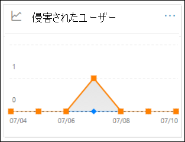
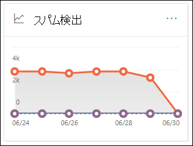
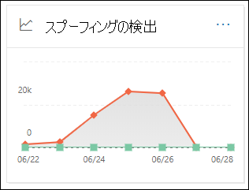
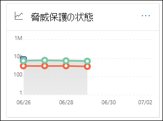
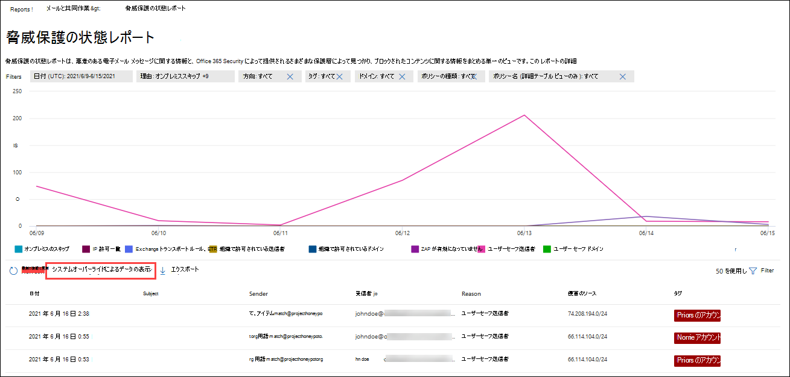

# セキュリティ/コンプライアンス センターで電子メールのセキュリティ レポートを表示する

[!INCLUDE [Microsoft 365 Defender rebranding](../includes/microsoft-defender-for-office.md)]

**適用対象**
- [Exchange Online Protection](exchange-online-protection-overview.md)
- [Microsoft Defender for Office 365 プラン 1 およびプラン 2](defender-for-office-365.md)
- [Microsoft 365 Defender](../defender/microsoft-365-defender.md)

セキュリティ[&](https://protection.office.com)コンプライアンス センターでは、Microsoft 365 のスパム対策、マルウェア対策、暗号化機能などの電子メール セキュリティ機能がどのように組織を保護しているかを確認するために、さまざまなレポートを利用できます。 必要なアクセス許可 [がある](#what-permissions-are-needed-to-view-these-reports)場合は、[レポート ダッシュボード] に移動して、セキュリティ & コンプライアンス センターでこれらのレポート **を表示** \> **できます**。 レポート ダッシュボードに直接移動するには、を開きます <https://protection.office.com/insightdashboard> 。

## 侵害されたユーザー レポート

> [!NOTE]
> このレポートは、メールボックスを使用Microsoft 365組織Exchange Online使用できます。 スタンドアロン 組織 (EOP) 組織ではExchange Online Protection使用できません。

[**侵害されたユーザー] レポート** には、過去 7 日以内に[疑わしい] または [制限付き] とマークされたユーザー アカウントの数が表示されます。 これらの状態のどちらかのアカウントは、問題が発生したり、侵害された場合もあります。 頻繁に使用すると、レポートを使用して、疑わしいアカウントや制限付きアカウントのスパイクや傾向を見つけるのに使用できます。 侵害されたユーザーの詳細については、「侵害されたメール アカウントへの [応答」を参照してください](responding-to-a-compromised-email-account.md)。

集計ビューには過去 90 日間のデータが表示され、詳細ビューには過去 30 日間のデータが表示されます。

レポートを表示するには、コンプライアンス センターで [セキュリティ](https://protection.office.com)&を開き、[レポート **ダッシュボード]** に移動し、[侵害されたユーザー] \> **を選択します**。 レポートに直接移動するには、を開きます <https://protection.office.com/reportv2?id=CompromisedUsers> 。

[フィルター] をクリックし、次の値の1 つ以上を選択すると、グラフと詳細テーブルの両方をフィルター処理できます。

- **開始日と****終了日**

- **疑** わしい : ユーザー アカウントが不審なメールを送信し、電子メールの送信を制限される危険性があります。

- **制限**: 不審なパターンが多く、ユーザー アカウントが電子メールの送信を制限されています。

![[侵害されたユーザー] レポートのレポート ビュー](../../media/compromised-users-report-activity-view.png)

[詳細テーブルの **表示] をクリック** すると、次の詳細が表示されます。

- **作成時間**
- **[ユーザー ID]**
- **Action**

レポート ビューに戻る場合は、[レポートの表示] **をクリックします**。

## 暗号化レポート

暗号化 **レポートは**、EOP で使用できます (サブスクリプションは、Exchange Onlineまたはスタンドアロンの EOP に含Exchange Online使用できます。 組織のセキュリティ チームは、このレポートの情報を使用してパターンを特定し、機密性の高い電子メール メッセージのポリシーを積極的に適用または調整できます。 以下に例を示します。

- ユーザーによって暗号化された電子メール メッセージの数が多い場合は、暗号化ポリシーを追加して、特定の使用例の暗号化を自動化することができます。 詳細については、「メール フロー ルールを[定義して](../../compliance/define-mail-flow-rules-to-encrypt-email.md)メール メッセージを暗号化する」を参照Microsoft 365。

- 使用可能な暗号化テンプレートが多数あるが、使用しているユーザーがいない場合は、ユーザーが機能トレーニングを必要とするかどうかを確認できます。

集計ビューでは過去 90 日間のフィルター処理が可能で、詳細ビューでは 10 日間のフィルター処理が可能です。

レポートを表示するには、コンプライアンス センターのセキュリティ &[開き、レポート **ダッシュボード]** に移動し、[暗号化レポート] \> **を選択します**。 レポートに直接移動するには、を開きます <https://protection.office.com/reportv2?id=EncryptionReport> 。

暗号化の詳細については、「メール暗号化」[を参照Microsoft 365。](../../compliance/email-encryption.md)

### 暗号化レポートのレポート ビュー

グラフで次のフィルターを使用できます。

- **データの表示方法: [メッセージの暗号化レポート** ] と [詳細: 暗号化 **方法]**: 次の暗号化方法を使用できます。

  - **ユーザーによる暗号化**
  - **ポリシーによる暗号化**

  [フィルター] **をクリック** すると、次のフィルターを使用してグラフを変更できます。

  - **開始日と****終了日**
  - 暗号化方法。
  - 暗号化テンプレート。

- **データの表示方法: [メッセージの暗号化レポート** ] と [詳細: 暗号化テンプレート **]**: 次の暗号化方法を使用できます。

  - **転送しない**
  - **暗号化のみ**
  - **OME 前**
  - **Custom**

  [フィルター] **をクリック** すると、次のフィルターを使用してグラフを変更できます。

  - **開始日と****終了日**
  - 暗号化方法
  - 暗号化テンプレート

- **データの表示方法: 上位 5** つの受信者ドメイン : このビューには、上位 5 つの受信者ドメインの送信メッセージ数を含む円グラフが表示されます。

  [フィルター] **をクリックすると**、[開始日] と **[終了日]** **を選択できます**。

### 暗号化レポートの詳細テーブル ビュー

[詳細テーブル **の表示]** をクリックすると、表示される情報は、表示されているグラフによって異なります。

- **[詳細]: [暗号化方法] または** [ **詳細: 暗号化テンプレート]**: 次の情報が表示されます。

  - **Date**
  - **[送信者のアドレス]**
  - **暗号化テンプレート**
  - **暗号化方法**
  - **受信者のアドレス**
  - **[件名]**

- **データの表示方法: 上位 5 つの受信者ドメイン**:

  - **Date**
  - **受信者ドメイン**
  - **メッセージ数**

詳細テーブル ビューで **[フィルター]** をクリックすると、次のフィルターを使用して結果を変更できます。

- **開始日と****終了日**
- 暗号化方法
- 暗号化テンプレート

レポート ビューに戻る場合は、[レポートの表示] **をクリックします**。

## メールフローの状態レポート

Mailflow **状態レポートには、** マルウェア、スパム、フィッシング、およびエッジブロックされたメッセージに関する情報が含まれます。 詳細については [、「Mailflow status report」を参照してください](view-mail-flow-reports.md#mailflow-status-report)。

## 電子メール レポートのマルウェア検出

電子 **メール レポートのマルウェア検出** には、受信および送信電子メール メッセージ (マルウェアが電子メール または EOP によって検出されたマルウェア) のマルウェア検出に関するExchange Online Protection表示されます。 EOP のマルウェア保護の詳細については、「EOP の [マルウェア対策保護」を参照してください](anti-malware-protection.md)。

 集計ビュー フィルターでは 90 日間、詳細テーブル フィルターでは 10 日間のみ許可されます。

レポートを表示するには、セキュリティ & コンプライアンス センターを開き [、レポートダッシュボード] に移動し、[電子メールのマルウェア検出] \> **を選択します**。 レポートに直接移動するには、を開きます <https://protection.office.com/reportv2?id=MalwareDetections> 。

[フィルター] をクリックして次の項目を選択すると、グラフと詳細テーブル **の両方** をフィルター処理できます。

- **開始日と****終了日**
- **受信**
- **送信**

[詳細テーブルの **表示] をクリック** すると、次の詳細が表示されます。

- **Date**
- **[送信者のアドレス]**
- **受信者のアドレス**
- **メッセージ ID**: メッセージ ヘッダーの **[Message-ID** ヘッダー] フィールドで使用できます。一意である必要があります。 値の例は `<08f1e0f6806a47b4ac103961109ae6ef@server.domain>` 次のようになります (角かっこに注意してください)。
- **[件名]**
- **Filename**
- **マルウェア名**

レポート ビューに戻る場合は、[レポートの表示] **をクリックします**。

## メール遅延レポート

[ **メール待機時間] レポートには** 、組織内で発生したメール配信とデトレーションの待機時間に関する情報が含まれる。 詳細については、「メール遅延 [レポート」を参照してください](view-reports-for-mdo.md#mail-latency-report)。

## 送信および受信した電子メール レポート

送信 **および受信電子** メール レポートには、マルウェア、スパム、メール フロー ルール (トランスポート ルールとも呼ばれる)、およびメールがサービスに入った後の高度なマルウェア検出に関する情報が含まれています。 詳細については、「送信および受信 [メール レポート」を参照してください](view-mail-flow-reports.md#sent-and-received-email-report)。

## スパム検出レポート

[ **スパム検出] レポートには** 、EOP によってブロックされたスパム メール メッセージが表示されます。 メッセージは受信者ごとにではなく、個別にカウントされます。 たとえば、同じスパム メッセージが組織内の 100 人の受信者に送信された場合、そのメッセージは 1 つのメッセージとしてカウントされます。

集計ビューでは 90 日間のフィルター処理が可能で、詳細テーブルでは 10 日間のフィルター処理が可能です。

レポートを表示するには、コンプライアンス センターでセキュリティ &[を](https://protection.office.com)開き、[レポート **ダッシュボード]** に移動し、[スパム検出] \> **を選択します**。 レポートに直接移動するには、を開きます <https://protection.office.com/reportv2?id=SpamDetections> 。

スパム対策保護の詳細については [、「EOP のスパム対策保護」を参照してください](anti-spam-protection.md)。

### スパム検出レポートのレポート ビュー

レポート ビューでは、次のグラフを使用できます。

- **ブレークダウン: アクション**: 次のイベントの種類が表示されます。

  - **フィルター処理されたスパム コンテンツ**
  - **スパム IP ブロック**
  - **スパム エンベロープ ブロック**
  - **スパム DBEB フィルター**: ディレクトリ ベースのエッジ ブロック (DBEB)

  グラフで 1 日 (データ ポイント) をポイントすると、その日にブロックされたアイテムの数と、それらのアイテムの分類方法を確認できます。

  ![[スパム検出] レポートのアクション ビュー](../../media/spam-detections-report-action-view.png)

- **[ブレークダウン]: [方向**] : 次の方向が表示されます。

  - **受信**
  - **送信**

  ![[スパム検出] レポートの方向表示](../../media/spam-detections-report-direction-view.png)

レポート ビューで **[フィルター]** をクリックすると、次のフィルターを使用して結果を変更できます。

- **開始日と****終了日**
- 方向の値
- イベントの種類の値

### [スパム検出] レポートの詳細テーブル ビュー

レポート ビューで **[詳細テーブルの表示** ] をクリックすると、次の情報が表示されます。

- **Date**
- **[送信者のアドレス]**
- **受信者のアドレス**
- **イベントの種類**
- **Action**
- **[件名]**

詳細テーブルで **[フィルター]** をクリックすると、次のフィルターを使用して結果を変更できます。

- **開始日と****終了日**
- 方向の値
- イベントの種類の値

レポート ビューに戻る場合は、[レポートの表示] **をクリックします**。

## スプーフィング検出レポート

ス **プーフィング検出** レポートには、スプーフィング メール メッセージが検出された数と、それらのスプーフィング メッセージの数が示されます。そのうちの 1 つは "良い" と見なされました (正当なビジネス上の理由で行われたスプーフィング メール)。 スプーフィングの詳細については、「EOP でのスプーフィング防止 [保護」を参照してください](anti-spoofing-protection.md)。

レポートの集計ビューでは 90 日間のフィルター処理が可能ですが、詳細ビューでは 10 日間のフィルター処理のみ可能です。

レポートを表示するには、セキュリティ コンプライアンス センターを開 [&レポート **ダッシュボード]** に移動し、[スプーフィングの検出 \> **] を選択します**。 レポートに直接移動するには、を開きます <https://protection.office.com/reportv2?id=SpoofMailReport> 。

グラフで 1 日 (データ ポイント) をポイントすると、スプーフィング メール メッセージの数を確認できます。

[フィルター] をクリックし、次の値の1 つ以上を選択すると、グラフと詳細テーブルの両方をフィルター処理できます。

- **開始日と****終了日**

- **良いメール**

- **スパムとしてキャッチされる**

[詳細テーブルの **表示] をクリック** すると、次の詳細が表示されます。

- **Date**
- **スプーフィングされた送信者**
- **True の送信者**
- [**Sender IP (送信者の IP)**]
- **Action**
- **メッセージ数**

レポート ビューに戻る場合は、[レポートの表示] **をクリックします**。

## 脅威保護の状態レポート

脅威 **保護の状態レポート** は、EOP と Microsoft Defender の両方Office 365。ただし、レポートには異なるデータが含まれる。 たとえば、EOP のお客様は、電子メールで検出されたマルウェアに関する情報を表示できますが[、SharePoint、OneDrive、](mdo-for-spo-odb-and-teams.md)および Microsoft Teams の セーフ 添付ファイルによって検出された悪意のあるファイルに関する情報は表示できません。

このレポートには、マルウェア対策エンジンによってブロックされたファイルや Web サイト のアドレス (URL)、ゼロ時間自動削除[(ZAP)、セーフ](zero-hour-auto-purge.md)[リンク、セーフ](safe-links.md)[添付](safe-attachments.md)ファイル、フィッシング対策などの Office 365 機能の Defender などの悪意のあるコンテンツを含む電子メールメッセージの数が提供されます。 この情報を使用して、傾向を特定したり、組織のポリシーで調整が必要かどうかを判断できます。

**注**: メッセージが 5 人の受信者に送信された場合、メッセージは 1 つのメッセージではなく 5 つの異なるメッセージとしてカウントされます。

レポートを表示するには、コンプライアンス センターでセキュリティ &[を](https://protection.office.com)開き、[レポート **ダッシュボード]** に移動し、[脅威保護の状態 \> ]**を選択します**。 レポートに直接移動するには、次のいずれかの URL を開きます。

- Microsoft Defender for Office 365:<https://protection.office.com/reportv2?id=TPSAggregateReportATP>
- EOP: <https://protection.office.com/reportv2?id=TPSAggregateReport>

既定では、グラフには過去 7 日間のデータが表示されます。 [フィルター] **をクリック** すると、90 日間の日付範囲を選択できます (試用版サブスクリプションは 30 日間に制限される場合があります)。 詳細テーブル ビューでは、30 日間のフィルター処理が可能です。

### 脅威保護状態レポートのレポート ビュー

次のビューを利用できます。

- **データの表示方法: 概要**: 次の検出情報が表示されます。

  - **電子メール マルウェア**
  - **メールフィッシング**
  - **コンテンツ マルウェア**

  

- **データの表示方法: コンテンツ \>マルウェア**1:組織の Microsoft Defender に関する次のOffice 365示されています。

  - **マルウェア対策エンジン**: Sharepoint、OneDrive、および Microsoft Teams で組み込みのウイルス検出によって検出された悪意のある [Microsoft 365。](virus-detection-in-spo.md)
  - **ファイルの削除**: 添付ファイルによって検出された悪意のある [セーフ、SharePoint、OneDrive、](mdo-for-spo-odb-and-teams.md)およびMicrosoft Teams。

  

- **データの表示: メッセージの上書き**: 次のオーバーライド理由情報が表示されます。

  - **オンプレミスのスキップ**
  - **IP 許可**
  - **メール フロー ルール**
  - **送信者の許可**
  - **ドメイン許可**
  - **ZAP が有効になっていません**
  - **迷惑メール フォルダーが有効になっていない**
  - **ユーザーセーフ送信者**
  - **ユーザー セーフ ドメイン**

  

- **[検出テクノロジ] と [****データの表示方法: メール \> フィッシング:** 次の情報が表示されます。

  - **ATP で生成された URL 評価**1: Defender から生成された悪意のある URL レピュテーションOffice 365他のユーザー Microsoft 365です。
  - **高度なフィッシング フィルター**: 機械学習に基づくフィッシングシグナル。
  - **スプーフィング対策 - DMARC エラー**: メッセージに対する DMARC 認証エラー。
  - **スプーフィング対策 - 組織内**: 送信者が受信者ドメインをスプーフィングしようとしている。
  - **スプーフィング対策 - 外部ドメイン**: 送信者が他のドメインをスプーフィングしようとしている。
  - **ブランド偽装**: 送信者に基づく既知のブランドの偽装。
  - **ドメイン偽装**1:顧客が所有または定義するドメインの偽装。
  - **EOP URL レピュテーション**: 悪意のある URL レピュテーション。
  - **一般的なフィッシング フィルター**: アナリスト ルールに基づくフィッシングシグナル。
  - **Others**
  - **フィッシング ZAP**2: フィッシング メッセージのゼロ時間自動削除。
  - **URL のデトナレーション**1
  - **ユーザー偽装**1: 管理者によって定義されたユーザー、またはメールボックス インテリジェンスを通じて学習されたユーザーの偽装。

  

- **[検出テクノロジ] と [****データの表示方法: メール \> マルウェア]**: 次の情報が表示されます。

  - **ATP で生成されたファイル評価**1:Defender によって生成された悪意のあるファイル評価Office 365します。
  - **マルウェア対策エンジン**1: マルウェア対策エンジンからの検出。
  - **マルウェア対策ポリシー ファイルの種類ブロック**: これらは、メッセージで識別された悪意のあるファイルの種類によってフィルター処理された電子メール メッセージです。
  - **ファイルの削除**1: 添付ファイルセーフ検出。
  - **悪意のあるファイル評価**
  - **マルウェア ZAP**2
  - **Others**

  

- **[ポリシーの種類] と** [データの表示方法 **]: \>** [メールフィッシング] または [データの表示 **方法: メール \> マルウェア**] : 次の情報が表示されます。

  - **マルウェア対策**
  - **セーフ添付ファイル**1
  - **フィッシング対策**
  - **スパム対策**
  - **メール フロー ルール** (トランスポート ルールとも呼ばれる)
  - **Others**

  

- **[配信の状態]** と [データの表示方法]: [メール フィッシング] または [データの表示 **方法: メール \>** マルウェア] : 次の情報が表示されます。 **\>**

  - **配信に失敗しました**
  - **ドロップ**
  - **Forwarded**
  - **ホストされたメールボックス: カスタム フォルダー**
  - **ホストされたメールボックス: 削除済みアイテム**
  - **ホストされたメールボックス: 受信トレイ**
  - **ホストされたメールボックス: 迷惑メール**
  - **オンプレミス サーバー: 配信**
  - **検疫**

  

1 Defender for Office 365のみ

2ゼロ時間自動削除 (ZAP) はスタンドアロン EOP では使用できません (これは、既定のメールボックスでのみExchange Onlineします)。

[フィルター] **をクリック** すると、使用可能なフィルターは、表示していたグラフによって異なります。

- [**データの表示方法: コンテンツ \> マルウェア**] では、開始日と終了日、および検出値によってレポート **を変更** できます。

- [ **データの表示方法: メッセージの上書き**] では、次のフィルターを使用してレポートを変更できます。

  - **開始日と****終了日**
  - **オーバーライド理由**
  - **タグ**: 指定したユーザー タグが適用されているユーザーまたはグループ (優先度アカウントを含む) によって結果をフィルター処理します。 ユーザー タグの詳細については、「ユーザー タグ」 [を参照してください](user-tags.md)。
  - **ドメイン**

- 他のすべてのビューでは、次のフィルターを使用してレポートを変更できます。

  - **開始日と****終了日**
  - **検出**
  - **で保護:** **ATP** または **EOP**
  - **タグ**: 指定したユーザー タグが適用されているユーザーまたはグループ (優先度アカウントを含む) によって結果をフィルター処理します。 ユーザー タグの詳細については、「ユーザー タグ」 [を参照してください](user-tags.md)。
  - **ドメイン**

### 脅威保護状態レポートの詳細テーブル ビュー

[詳細テーブル **の表示]** をクリックすると、表示される情報は、表示されているグラフによって異なります。

- **[データの表示方法]: [概要]**: [ **詳細の表示] テーブル ボタン** は使用できません。

- **データの表示方法: コンテンツ \> マルウェア**:

  - **Date**
  - **Location**
  - **監督者**
  - **マルウェア名**

  このビューで **[フィルター]** をクリックすると、開始日と終了日、および検出値によってレポートを **変更** できます。

- **データの表示方法: メッセージの上書き**:

  - **Date**
  - **[件名]**
  - **送信者**
  - **受信者**
  - **によって検出される**
  - **オーバーライド理由**
  - **侵害のソース**
  - **Tags**

  このビューで [ **フィルター]** をクリックすると、次のフィルターを使用してレポートを変更できます。

  - **開始日と****終了日**
  - **オーバーライド理由**
  - **タグ**: 指定したユーザー タグが適用されているユーザーまたはグループ (優先度アカウントを含む) によって結果をフィルター処理します。 ユーザー タグの詳細については、「ユーザー タグ」 [を参照してください](user-tags.md)。
  - **ドメイン**
  - **受信者** (このフィルター可能なプロパティは、詳細テーブル ビューでのみ使用できます)

- その他のすべてのグラフ:

  - **Date**
  - **[件名]**
  - **送信者**
  - **受信者**
  - **によって検出される**
  - **配信状態**
  - **侵害のソース**
  - **Tags**

  [フィルター] **をクリック** すると、次のフィルターを使用してレポートを変更できます。

  - **開始日と****終了日**
  - **検出**
  - **Protected by**: **Defender for Office 365** **EOP**
  - **タグ**: 指定したユーザー タグが適用されているユーザーまたはグループ (優先度アカウントを含む) によって結果をフィルター処理します。 ユーザー タグの詳細については、「ユーザー タグ」 [を参照してください](user-tags.md)。
  - **ドメイン**
  - **受信者** (このフィルター可能なプロパティは、詳細テーブル ビューでのみ使用できます)

## トップ マルウェア レポート

[ **トップ マルウェア]** レポートには、EOP のマルウェア対策保護によって検出されたさまざまな種類 [のマルウェアが表示されます](anti-malware-protection.md)。

レポートを表示するには、コンプライアンス センターでセキュリティ &[を](https://protection.office.com)開き、[レポート **ダッシュボード]** に移動し、[ \> 上位マルウェア]**を選択します**。 レポートに直接移動するには、を開きます <https://protection.office.com/reportv2?id=TopMalware> 。

円グラフのくさびの上にマウス ポインターを置くと、マルウェアの種類の名前と、そのマルウェアが検出されたメッセージの数を確認できます。

[詳細テーブルの **表示] をクリック** すると、次の詳細が表示されます。

- **トップ マルウェア**
- **Count**

レポート ビューまたは **詳細テーブル ビュー** で [フィルター] をクリックすると、[開始日] と [終了日] で日付 **範囲を****指定できます**。

## URL 脅威保護レポート

URL **の脅威保護レポートは**、Microsoft Defender で使用できるOffice 365。 詳細については、「URL 脅威保護 [レポート」を参照してください](view-reports-for-mdo.md#url-threat-protection-report)。

## ユーザーが報告したメッセージ レポート

ユーザー **が報告した** メッセージ レポートには、ユーザーが迷惑メール、フィッシング詐欺の試み、または良いメールとして報告した電子メール メッセージに関する情報が、レポート メッセージ アドインまたはレポート フィッシング アドインを使用して [表示](enable-the-report-phish-add-in.md)されます。

詳細は、配信理由など、組織に対して構成されたスパム ポリシーの例外やメール フロー ルールなど、各メッセージで使用できます。 詳細を表示するには、ユーザー レポート の一覧でアイテムを選択し、[概要] タブと [詳細] タブ **で情報を****表示** します。

![[User-Reportedメッセージ] レポートには、迷惑メールではなく迷惑メールとしてラベル付けされたメッセージ、またはフィッシング詐欺の試行が表示されます。](../../media/ad5e9a3d-b833-419c-bcc9-3425d9604ead.png)

このレポートを表示するには、セキュリティ & [コンプライアンス センターで](https://protection.office.com)、次のいずれかの操作を行います。

- [脅威管理 **ダッシュボード]** \> **[** \> **ユーザーが報告したメッセージ] に移動します**。

- [脅威の管理 **] [** \> **ユーザーが報告** \> **したメッセージの確認] に移動します**。

![コンプライアンス センターのセキュリティ &で、[脅威の管理] \> [ユーザーが報告 \> したメッセージの確認] を選択します。](../../media/e372c57c-1414-4616-957b-bc933b8c8711.png)

> [!IMPORTANT]
> ユーザーが報告したメッセージ レポートが正しく機能するには、ユーザーが報告した環境で監査ログを有効Office 365があります。 これは通常、監査ログの役割が管理者に割り当てられているユーザー Exchange Online。 詳細については、「監査ログの[検索を有効またはMicrosoft 365を有効またはオフにする」を参照してください](../../compliance/turn-audit-log-search-on-or-off.md)。

## これらのレポートを表示するために必要なアクセス許可

この記事で説明するレポートを表示および使用するには、セキュリティ コンプライアンス センターで次のいずれかの役割グループの&必要があります。

- **組織の管理**
- **セキュリティ管理者**
- **セキュリティ リーダー**
- **グローバル リーダー**

詳細については、「[セキュリティ/コンプライアンス センターのアクセス許可](permissions-in-the-security-and-compliance-center.md)」を参照してください。

**注**: Microsoft 365 管理センターの対応する Azure Active Directory ロールにユーザーを追加すると、セキュリティ & コンプライアンス センターで必要なアクセス許可と、Microsoft 365 の他の機能に対するアクセス許可がユーザーに付与されます。 詳細については、「[管理者の役割について](../../admin/add-users/about-admin-roles.md)」を参照してください。

## レポートにデータが表示されない場合は、

レポートにデータが表示されない場合は、ポリシーが正しく設定されていることを確認してください。 詳細については、「脅威から保護 [する」を参照してください](protect-against-threats.md)。

## 関連項目

[EOP でのスパム対策およびマルウェア対策保護](anti-spam-and-anti-malware-protection.md)

[セキュリティ/コンプライアンス センターのスマート レポートと分析情報](reports-and-insights-in-security-and-compliance.md)

[セキュリティ コンプライアンス センターでメール フロー レポート&表示する](view-mail-flow-reports.md)

[Defender for Office 365](view-reports-for-mdo.md)
