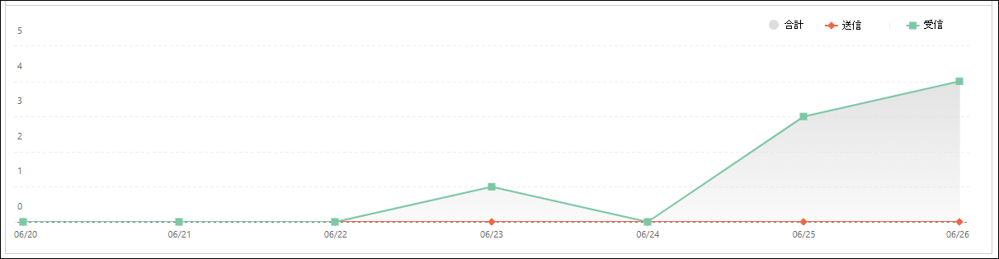
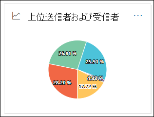

# セキュリティ コンプライアンス センターの [レポート] ダッシュボードでメール フロー レポート&表示する

[!INCLUDE [Microsoft 365 Defender rebranding](../includes/microsoft-defender-for-office.md)]

**適用対象**
- [Exchange Online Protection](exchange-online-protection-overview.md)
- [Microsoft Defender for Office 365 プラン 1 およびプラン 2](defender-for-office-365.md)
- [Microsoft 365 Defender](../defender/microsoft-365-defender.md)

> [!NOTE]
> この記事のレポートの大部分は、Microsoft 365 Defender管理センター (EAC) Exchange使用できます。 詳細については、次のトピックをご覧ください。
>
> - [新しい管理センターのメール フロー Exchangeレポート](/exchange/monitoring/mail-flow-reports/mail-flow-reports)
> - [電子メール セキュリティ レポートを Microsoft 365 Defenderする](view-email-security-reports.md)

セキュリティ & コンプライアンス センターのメール フローダッシュボードで使用できるメール フロー レポートに加えて、レポート ダッシュボードには、Microsoft 365 組織の監視に役立つさまざまなメール フロー レポートがあります。

必要なアクセス許可 [がある](#what-permissions-are-needed-to-view-these-reports)場合は、[レポート ダッシュボード] に移動して、セキュリティ & [コンプライアンス](https://protection.office.com) センターでこれらのレポート **を表示** \> **できます**。 レポート ダッシュボードに直接移動するには、を開きます <https://protection.office.com/insightdashboard> 。

## コネクタ レポート

> [!NOTE]
> このレポートは、EAC の **受信** メッセージ レポートと送信メッセージ **レポート** に置き換えられた。 詳細については、「新しい EAC の受信メッセージと送信メッセージ レポート [」を参照してください](/exchange/monitoring/mail-flow-reports/mfr-inbound-messages-and-outbound-messages-reports)。

## Exchangeトランスポート ルール レポート

トランスポート **Exchangeレポートには**、組織内の受信メッセージと送信メッセージに対するメール フロー ルール (トランスポート ルールとも呼ばれる) の影響が表示されます。

レポートを表示するには、セキュリティ コンプライアンス センター&[開](https://protection.office.com)き、[レポートダッシュボード] に移動し、[トランスポート ルールExchange \> **選択します**。 レポートに直接移動するには、を開きます <https://protection.office.com/reportv2?id=ETRRuleReport> 。

### トランスポート ルール レポートのExchangeビュー

レポート ビューでは、次のグラフを使用できます。

- **データの表示方法: Exchangeトランスポート ルール** \>**[ブレークダウン]: [方向]**: このグラフには、トランスポート ルールの影響を受けた受信メッセージと送信メッセージの数が表示されます。

- **データの表示方法: Exchangeトランスポート ルール** \>**[分類]: [重大度]**: このグラフには、重大度の高いメッセージと中程度の重大度メッセージ、および **低重大度メッセージの数が表示** されます。 重大度レベルは、ルールのアクションとして設定します **(重大度** レベルまたは _SetAuditSeverity_ でこのルールを監査します)。 詳細については、「メール フロー ルール[のアクション」を参照Exchange Online。](//Exchange/security-and-compliance/mail-flow-rules/mail-flow-rule-actions)

- **データの表示方法: DLP Exchangeトランスポート ルール** \>**[ブレークダウン]: [方向]**: このグラフは、データ損失防止 (DLP) トランスポート ルールの影響を受けた受信メッセージと送信メッセージの数を示します。 次のオプションをオンにすることで、グラフをさらに絞り込みできます。

  - **データの表示: すべての DLP トランスポート ルール**
  - **データの表示: 侵害されたユーザー**
  - **データの表示: 検出されたコンテンツの量が少ない米国愛国者法**

- **データの表示方法: DLP Exchangeトランスポート ルール** \>**[分類: 方向]**: このビューには、DLP トランスポートルールの影響を受けた重大度の高いメッセージと中程度の重大度メッセージの数が表示されます。  次のオプションをオンにすることで、グラフをさらに絞り込みできます。

  - **データの表示: すべての DLP トランスポート ルール**
  - **データの表示: 侵害されたユーザー**
  - **データの表示: 検出されたコンテンツの量が少ない米国愛国者法**

レポート ビューで **[フィルター]** をクリックすると、次のフィルターを使用して結果を変更できます。

- **開始日と****終了日**
- 方向の値
- 重大度の値

### トランスポート ルール レポートのExchangeテーブル ビュー

[詳細テーブル **の表示]** をクリックすると、表示される情報は、表示されているグラフによって異なります。

- **データの表示方法: Exchange トランスポート ルール**:

  - **日付**
  - **トランスポート ルール**
  - **[件名]**
  - **[送信者のアドレス]**
  - **受信者の住所**
  - **重大度**
  - **Direction**

- **データの表示方法: DLP Exchangeルール**:

  - **日付**
  - **DLP ポリシー**
  - **トランスポート ルール**
  - **[件名]**
  - **[送信者のアドレス]**
  - **受信者の住所**
  - **重大度**
  - **Direction**

詳細テーブル ビューで **[フィルター]** をクリックすると、次のフィルターを使用して結果を変更できます。

- **開始日と****終了日**
- 方向の値
- 重大度の値

レポート ビューに戻る場合は、[レポートの表示] **をクリックします**。

## 転送レポート

> [!NOTE]
> 転送 **レポートは** EAC で利用できます。 詳細については、「新しい [EAC の自動転送メッセージ レポート」を参照してください](/exchange/monitoring/mail-flow-reports/mfr-auto-forwarded-messages-report)。

## メールフローの状態レポート

Mailflow **状態レポートは**、送信済 みおよび受信済みメール レポートに似ています。エッジで許可またはブロックされた電子メールに関する追加情報を含む。 これは、エッジ保護情報を含む唯一のレポートであり、EOP (EOP) による評価のためにサービスに許可される前にブロックされる電子メールの量を示Exchange Online Protectionです。 メッセージが 5 人の受信者に送信された場合、メッセージは 1 つのメッセージではなく 5 つの異なるメッセージとしてカウントされます。
レポートを表示するには、コンプライアンス センターでセキュリティ &[を](https://protection.office.com)開き、[レポート **ダッシュボード]** に移動し、[メールフローの状態レポート \> ]**を選択します**。 メール フローの状態レポートに **直接移動するには、** 開きます <https://protection.office.com/mailflowStatusReport> 。

### メールフロー状態レポートの種類ビュー

レポートを開いた場合、[種類] **タブ** が既定で選択されます。 既定では、このビューにはグラフと、次のフィルターで構成されたデータ テーブルが含まれます。

- **日付**: 過去 7 日間。
- **方向**:

  - **受信**
  - **送信**
  - **組織内**: この数は、テナント内のメッセージ 、つまり 送信者 abc@domain.com 受信者に送信 xyz@domain.com (受信および送信とは別 **に****カウント)**

- **種類**:

  - **良いメール**
  - **マルウェア**
  - **[スパム]**
  - **エッジ保護**
  - **ルール メッセージ**
  - **フィッシング詐欺メール**

グラフは、Type 値によって **整理** されます。

これらのフィルターは、[フィルター] を **クリックするか** 、グラフの凡例の値をクリックして変更できます。

データ テーブルには、次の情報が含まれます。

- **Direction**
- **型**
- **24 時間**
- **3 日間**
- **7 日間**
- **15 日**
- **30 日間**

詳細については、[ **カテゴリの選択] をクリックすると**、次の値から選択できます。

- **フィッシングメール**: この選択によって、脅威保護の [状態レポートが表示されます](view-email-security-reports.md#threat-protection-status-report)。
- **電子メール内のマルウェア**: この選択によって、脅威保護 [の状態レポートが表示されます](view-email-security-reports.md#threat-protection-status-report)。
- **スパム検出**: この選択により、スパム検出 [レポートに移動します](view-email-security-reports.md#spam-detections-report)。
- **エッジブロックスパム**: この選択により、スパム検出 [レポートに移動します](view-email-security-reports.md#spam-detections-report)。

**エクスポート**:

詳細ビューでは、1 日のデータのみをエクスポートできます。 したがって、7 日間データをエクスポートする場合は、7 つの異なるエクスポート アクションを実行する必要があります。

エクスポートされたファイル.csv、150,000 行に制限されます。 その日のデータに 150,000 行を超える行が含まれている場合は、複数.csvファイルが作成されます。

![[メールフローの状態] レポートにビューを入力します。](../../media/mail-flow-status-report-type-view.png)

### メールフロー状態レポートの方向ビュー

[方向] タブ **をクリックすると** 、[種類] ビューの同じ既定 **のフィルター** が使用されます。

グラフは、方向の値 **によって整理** されます。

これらのフィルターは、[フィルター] を **クリックするか** 、グラフの凡例の値をクリックして変更できます。 [種類] ビューの同 **じフィルターが** 使用されます。

データ テーブルには、Type ビューの同じ情報 **が含** まれている。

[ **使用可能な選択と動作** の詳細については、カテゴリを選択する] は、[種類] ビューと **同** じです。

**エクスポート**:

詳細ビューでは、1 日のデータのみをエクスポートできます。 したがって、7 日間データをエクスポートする場合は、7 つの異なるエクスポート アクションを実行する必要があります。

エクスポートされたファイル.csv、150,000 行に制限されます。 その日のデータに 150,000 行を超える行が含まれている場合は、複数.csvファイルが作成されます。

### メールフロー状態レポートのファネル ビュー

[ **ファネル** ] ビューには、Microsoft の電子メール脅威防止機能が組織内の受信メールと送信メールをフィルター処理する方法が表示されます。 電子メールの総数と、エッジ保護、マルウェア対策、フィッシング対策、スパム対策、スプーフィング対策などの構成済みの脅威保護機能が、この数に与える影響の詳細を示します。

[ファネル] タブ **を** クリックすると、既定では、次のフィルターで構成されたグラフとデータ テーブルが表示されます。

- **日付**: 過去 7 日間。

- **方向**:

  - **受信**
  - **送信**
  - **組織内**: この数は、テナント内で送信されるメッセージを示します。つまり、送信者は abc@domain.com に送信 xyz@domain.com (受信と送信とは別にカウントされます)。

集計ビューとデータ テーブル ビューでは、90 日間のフィルター処理が可能です。

[フィルター] **をクリック** すると、グラフとデータ テーブルの両方をフィルター処理できます。

このグラフは、次の方法で整理されたメール数を示しています。

- **メールの総数**
- **エッジ保護後のメール**
- **マルウェア対策、ファイル評価、ファイルの種類ブロック後のメール**
- **フィッシング対策、URL 評価、ブランド偽装、スプーフィング対策の後のメール**
- **スパム対策、バルク メール フィルター処理後のメール**
- **ユーザーとドメインの偽装後のメール**1
- **ファイルと URL の削除後の** メール 1
- **配信後の保護後に良性として検出された電子メール (URL クリック時間保護)**

1 Defender for Office 365のみ

EOP または Defender でフィルター処理されたメールを個別Office 365表示するには、グラフの凡例の値をクリックします。

データ テーブルには、降順に表示される次の情報が含まれます。

- **日付**
- **メールの総数**
- **エッジ保護**
- **マルウェア対策、ファイル評価、ファイルの種類ブロック**:
  - **ファイル評価**: 他の Microsoft のお客様が添付ファイルを識別するためにフィルター処理されたメッセージ。
  - **ファイルの種類のブロック**: メッセージで識別された悪意のあるファイルの種類によってフィルター処理されたメッセージ。
- **フィッシング対策、URL レピュテーション、ブランド偽装、スプーフィング対策**:
  - **URL レピュ** テーション : 他の Microsoft のお客様による URL の識別のためにフィルター処理されたメッセージ。
  - **ブランド偽装**: よく知られているブランド偽装送信者からのメッセージが原因でフィルター処理されたメッセージ。
  - **スプーフィング** 対策: 受信者が属するドメイン、またはメッセージ送信者が所有していないドメインをスプーフィングしようとするメッセージが原因でフィルター処理されたメッセージ。
- **スパム対策、バルク メール フィルター**:
  - **バルク メール フィルター :** 受信者にバルク メールを配信しようとしてフィルター処理されたメッセージ。
- **ユーザーとドメインの偽装 (Defender for Office 365)**:
  - **ユーザー偽装**: フィッシング対策ポリシーの偽装保護設定で定義されているユーザー (メッセージ送信者) を偽装しようとしてフィルター処理されたメッセージ。
  - **ドメイン偽装**: フィッシング対策ポリシーの偽装保護設定で定義されているドメインを偽装しようとしてフィルター処理されたメッセージ。
- **ファイルと URL のデトレーション (Defender for Office 365)**:
  - **ファイルの削除**: 添付ファイル ポリシーでフィルターセーフメッセージ。
  - **URL の削除**: リンク ポリシーでフィルターセーフメッセージ。
- **配信後の保護と ZAP (ATP)、または ZAP (EOP)**: ZAP は 0 時間の自動削除を示します。

データ テーブルで行を選択すると、メール数の詳細がフライアウトに表示されます。

**エクスポート**:

[オプション] で **[エクスポート]** **をクリック** すると、次のいずれかの値を選択できます。

- **概要 (最大で過去 90 日間のデータを含む)**
- **詳細 (最大で過去 30 日間のデータを含む)**

[ **日付] で** 範囲を選択し、[適用] を **クリックします**。 現在のフィルターのデータは、特定のファイルに.csvされます。

エクスポートされたファイル.csv、150,000 行に制限されます。 データに 150,000 行を超える行が含まれている場合は、複数.csvファイルが作成されます。

 ![[メールフローの状態] レポートの [ファネル] ビュー。](../../media/mail-flow-status-report-funnel-view.png)

### メールフローの状態レポートの技術ビュー

Tech **ビューは、** ファネル **ビューに** 似ています。構成済みの脅威保護機能の詳細を提供します。 グラフから、脅威保護の異なる段階でメッセージがどのように分類されるのか確認できます。

[Tech view] **タブを** クリックすると、既定では、このビューにはグラフと、次のフィルターで構成されたデータ テーブルが含まれます。

- **日付**: 過去 7 日間。

- **方向**:

  - **受信**
  - **送信**
  - **組織内**: この数は、テナント内のメッセージ 、つまり 送信者 abc@domain.com 受信者に送信 xyz@domain.com (受信および送信とは別にカウントされます)

集計ビューとデータ テーブル ビューでは、90 日間のフィルター処理が可能です。

[フィルター] **をクリック** すると、グラフとデータ テーブルの両方をフィルター処理できます。

このグラフには、次のカテゴリに分類されたメッセージが表示されます。

- **メールの総数**
- **エッジ許可** と **フィルター処理されたエッジ**
- **マルウェアではない****、セーフ添付ファイルの検出、** \* **マルウェア対策エンジンの検出**、**およびルール メッセージ**
- **フィッシング** **、DMARC 障害、****偽装検出、ス** プーフィング **検出**、**およびフィッシングの検出を行う**
- **URL のデトレーションと URL の** デトレーション **検出による検出なし**\*
- **スパムとスパム****ではない**
- **悪意のあるメール以外の電子****メール、セーフリンクの検出** \* 、**および ZAP**

\*Defender for Office 365

グラフ内のカテゴリにカーソルを合わせると、そのカテゴリ内のメッセージの数が表示されます。

データ テーブルには、降順に表示される次の情報が含まれます。

- **日付**
- **メールの総数**
- **フィルター処理されたエッジ**
- **マルウェア対策エンジン、セーフ添付ファイル、フィルター処理されたルール**:
  - **フィルター処理されたルール**: メール フロー ルール (トランスポート ルールとも呼ばれる) が原因でフィルター処理されたメッセージ。
- **DMARC、偽装、スプーフィング、フィッシング フィルター**:
  - **DMARC**: DMARC 認証チェックに失敗したメッセージが原因でフィルター処理されたメッセージ。
- **URL のデトレーション検出**
- **フィルター処理されたスパム対策**
- **ZAP が削除されました**
- **リンクによるセーフ検出**

データ テーブルで行を選択すると、メール数の詳細がフライアウトに表示されます。

**エクスポート**:

[エクスポート] **をクリックすると**、[ **オプション] で** 、次のいずれかの値を選択できます。

- **概要 (最大で過去 90 日間のデータを含む)**
- **詳細 (最大で過去 30 日間のデータを含む)**

[ **日付] で** 範囲を選択し、[適用] を **クリックします**。 現在のフィルターのデータは、特定のファイルに.csvされます。

エクスポートされたファイル.csv、150,000 行に制限されます。 データに 150,000 行を超える行が含まれている場合は、複数.csvファイルが作成されます。

 

## 送信および受信した電子メール レポート

> [!NOTE]
> このレポートは、Mailflow 状態 [レポートに置き換えされています](#mailflow-status-report)。

## 上位の送信者と受信者レポート

[ **上位の送信者と受信者]** レポートは、上位のメール送信者と受信者を示す円グラフです。

レポートを表示するには、セキュリティ & コンプライアンス センターを [開き、レポートダッシュボード] に移動し、[上位の送信者と受信者] \> **を選択します**。 レポートに直接移動するには、を開きます <https://protection.office.com/reportv2?id=TopSenderRecipientsATP> 。

### 上位の送信者と受信者レポートのレポート ビュー

レポート ビューでは、次のグラフを使用できます。

- **上位メール送信者 \> のデータを表示する**
- **上位メール受信者 \> のデータを表示する**
- **上位のスパム受信者 \> のデータを表示する**
- **データの表示 \> 上位マルウェア受信者** (EOP)
- **上位マルウェア受信者 \> のデータを表示する (Defender for Office 365)**

円グラフの構成は、これらの選択内容に基づいて変更されます。

円グラフのくさびの上にマウス ポインターを置くと、送信または受信されたメッセージの数を確認できます。

レポート ビューで **[フィルター]** をクリックすると、[開始日] と [終了日] で日付 **範囲****を指定できます**。

![[上位の送信者と受信者] レポートの [レポート] ビューの円グラフ。](../../media/top-senders-and-recipients-report-view.png)

### 上位の送信者と受信者レポートの詳細テーブル ビュー

[詳細テーブル **の表示]** をクリックすると、表示される情報は、表示されているグラフによって異なります。

- **上位メール送信者 \> のデータを表示する**

  - **上位のメール送信者**
  - **Count**

- **上位メール受信者 \> のデータを表示する**

  - **上位のメール受信者**
  - **Count**

- **上位のスパム受信者 \> のデータを表示する**

  - **上位のスパム受信者**
  - **Count**

- **データの表示 \> 上位マルウェア受信者** (EOP)

  - **上位のマルウェア受信者**
  - **Count**

- **上位マルウェア受信者 \> のデータを表示する (Defender for Office 365)**

  - **上位のマルウェア受信者 (Defender for Office 365)**
  - **Count**

詳細テーブル ビューで **[フィルター** ] をクリックすると、[開始日] と [終了日] で日付 **範囲****を指定できます**。

レポート ビューに戻る場合は、[レポートの表示] **をクリックします**。

## これらのレポートを表示するために必要なアクセス許可

この記事で説明するレポートを表示および使用するには、セキュリティ コンプライアンス センターで次のいずれかの役割グループの&必要があります。

- **組織の管理**
- **セキュリティ管理者**
- **セキュリティ閲覧者**
- **グローバル閲覧者**

詳細については、「[セキュリティ/コンプライアンス センターのアクセス許可](permissions-in-the-security-and-compliance-center.md)」を参照してください。

> [!NOTE]
> Microsoft 365 管理センターで、対応する Azure Active Directory の役割にユーザーを追加すると、ユーザーには、セキュリティ/コンプライアンス センター の必要なアクセス許可 _および_ Microsoft 365 のその他の機能に必要なアクセス許可が付与されます。 詳細については、「[管理者の役割について](../../admin/add-users/about-admin-roles.md)」を参照してください。

## 関連項目

[セキュリティ/コンプライアンス センターのスマート レポートと分析情報](reports-and-insights-in-security-and-compliance.md)

[セキュリティとコンプライアンス センターのメッセージ追跡の分析情報](mail-flow-insights-v2.md)

[セキュリティとコンプライアンス センターで電子メールのセキュリティ レポートを表示する](view-email-security-reports.md)

[Microsoft Defender for microsoft Defender for Office 365](view-reports-for-mdo.md)
