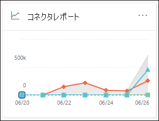
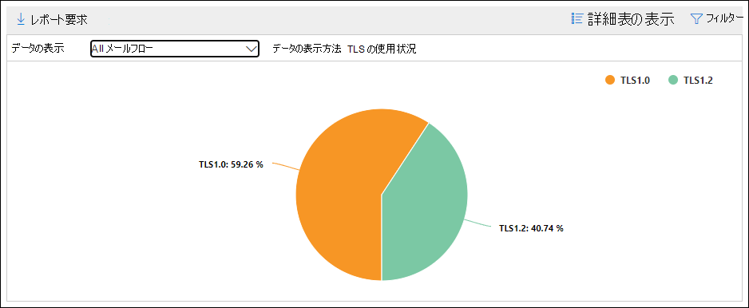
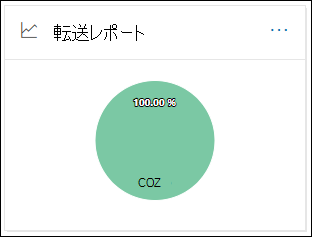
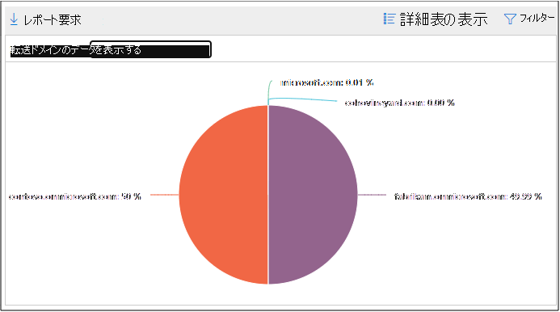
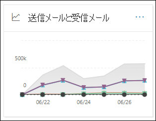
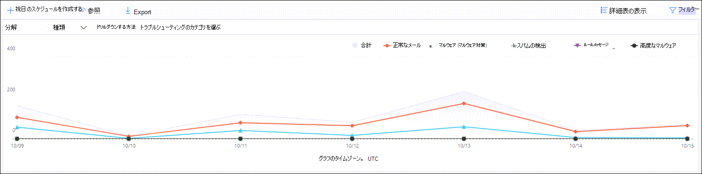
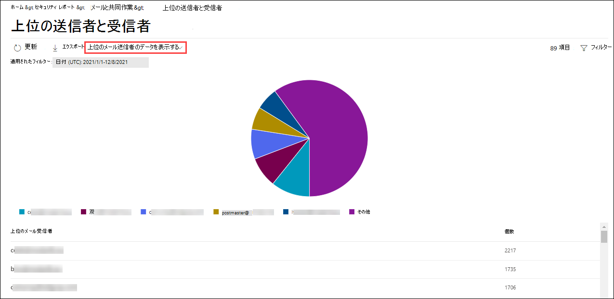

# セキュリティ & コンプライアンスセンターのレポートダッシュボードでメールフローレポートを表示するView mail flow reports in the Reports dashboard in Security & Compliance Center

セキュリティ & コンプライアンスセンターの[メールフローダッシュボード](mail-flow-insights-v2.md)で使用できるメールフローレポートに加えて、Microsoft 365 組織を監視するのに役立つさまざまな追加のメールフローレポートがレポートダッシュボードに用意されています。In addition to the mail flow reports that are available in the [Mail flow dashboard](mail-flow-insights-v2.md) in the Security & Compliance Center, a variety of additional mail flow reports are available in the Reports dashboard to help you monitor your Microsoft 365 organization.

[必要なアクセス許可](#what-permissions-are-needed-to-view-these-reports)がある場合は、**レポート**ダッシュボードにアクセスすることによって、[セキュリティ & コンプライアンスセンター](https://office.protection.com)でこれらのレポートを表示でき \> **Dashboard**ます。If you have the [necessary permissions](#what-permissions-are-needed-to-view-these-reports), you can view these reports in the [Security & Compliance Center](https://office.protection.com) by going to **Reports** \> **Dashboard**. レポートダッシュボードに直接移動するには、を開き <https://office.protection.office.com/insightdashboard> ます。To go directly to the Reports dashboard, open <https://office.protection.office.com/insightdashboard>.

## コネクタレポートConnector report

**コネクタレポート**には、組織に対して構成されている[受信コネクタと送信コネクタ](https://docs.microsoft.com/Exchange/mail-flow-best-practices/use-connectors-to-configure-mail-flow/use-connectors-to-configure-mail-flow)のメールフローアクティビティが表示されます。The **Connector report** shows mail flow activity on the [inbound and outbound connectors](https://docs.microsoft.com/Exchange/mail-flow-best-practices/use-connectors-to-configure-mail-flow/use-connectors-to-configure-mail-flow) that are configured for your organization.

レポートを表示するには、[[セキュリティ & コンプライアンスセンター](https://protection.office.com)] を開き、[**レポート** \> **ダッシュボード**] に移動して、[**コネクタレポート**] を選択します。To view the report, open the [Security & Compliance Center](https://protection.office.com), go to **Reports** \> **Dashboard** and select **Connector report**. レポートに直接移動するには、を開き <https://protection.office.com/reportv2?id=ConnectorReport> ます。To go directly to the report, open <https://protection.office.com/reportv2?id=ConnectorReport>.

### コネクタレポートのレポートビューReport view for the Connector report

次のグラフはレポートビューで利用できます。The following charts are available in report view:

- **データの表示: メールフロー**: このグラフは、次の方法で開催される受信メッセージと送信メッセージの数を示します。**View data by: Mail flow**: This chart shows the number of inbound and outbound messages organized by:

  - **合計****Total**
  - **コネクタのないインターネットから****From the internet without a connector**
  - **コネクタを使用せずにインターネットに接続する****To the internet without a connector**
  - 構成済みの特定のコネクタ。A specific connector that you've configured.
  
  グラフのデータを分離するには、[**データの表示**] コントロールを使用して、これらのオプションのいずれかまたは**すべてのメールフロー**を選択します。To isolate the data in the chart, use the **Show data for** control to select one of these options or **All mail flow**.

  

- **データの表示方法: tls 使用法**: このグラフは、メールフローのトランスポート層セキュリティ (TLS) バージョンの使用率を示しています。**View data by: TLS usage**: This chart shows the percentage of Transport Layer Security (TLS) version usage for mail flow.

  グラフのデータを分離するには、[**データの表示**] コントロールを使用して、次のいずれかのオプションを選択します。To isolate the data in the chart, use the **Show data for** control to select one of the following options:

  - **すべてのメールフロー****All mail flow**
  - **コネクタのないインターネットから****From the internet without a connector**
  - **コネクタを使用せずにインターネットに接続する****To the internet without a connector**
  - 構成済みの特定のコネクタ。A specific connector that you've configured.

  

レポートビューで [**フィルター** ] をクリックすると、**開始日**と**終了日**を含む日付範囲を指定できます。If you click **Filters** in a report view, you can specify a date range with **Start date** and **End date**.

### コネクタレポートの詳細表ビューDetails table view for the Connector report

レポートビューで [**詳細テーブルの表示**] をクリックすると、次の情報が表示されます。If you click **View details table** in a report view, the following information is shown:

- **Date****Date**
- **コネクタの方向と名前****Connector direction and name**
- **コネクタの種類****Connector type**
- **FORCED TLS?**: 値**True**または**False**。**Forced TLS?**: The value **True** or **False**.
- **TLS なし**(パーセント)**No TLS** (percentage)
- **TLS 1.0** (パーセント)**TLS 1.0** (percentage)
- **TLS 1.1** (パーセント)**TLS 1.1** (percentage)
- **TLS 1.2** (パーセント)**TLS 1.2** (percentage)
- **Volume**: メッセージ数。**Volume**: The number of messages.

詳細テーブルビューで [**フィルター** ] をクリックすると、**開始日**と**終了日**を含む日付範囲を指定できます。If you click **Filters** in a details table view, you can specify a date range with **Start date** and **End date**.

レポートビューに戻るには、[**レポートの表示**] をクリックします。To go back to the report view, click **View report**.

## Exchange トランスポートルールレポートExchange transport rule report

**Exchange トランスポートルールレポート**は、組織内の受信メッセージと送信メッセージに対するメールフロールール (トランスポートルールとも呼ばれます) の影響を示します。The **Exchange transport rule report** shows the effect of mail flow rules (also known as transport rules) on incoming and outgoing messages in your organization.

レポートを表示するには、[セキュリティ & コンプライアンスセンター](https://protection.office.com)を開き、[**レポート** \> **ダッシュボード**] に移動して、[ **Exchange トランスポートルール**] を選択します。To view the report, open the [Security & Compliance Center](https://protection.office.com), go to **Reports** \> **Dashboard** and select **Exchange Transport rule**. レポートに直接移動するには、を開き <https://protection.office.com/reportv2?id=ETRRuleReport> ます。To go directly to the report, open <https://protection.office.com/reportv2?id=ETRRuleReport>.

### Exchange トランスポートルールレポートのレポートビューReport view for the Exchange transport rule report

次のグラフはレポートビューで利用できます。The following charts are available in report view:

- **データの表示方法: Exchange トランスポートルール** \>**分割ダウン: 方向**: このグラフは、トランスポートルールによって影響を受けた**受信**メッセージと**送信**メッセージの数を示します。**View data by: Exchange transport rules** \> **Break down by: Direction**: This chart shows the number of **Inbound** and **Outbound** messages that were affected by transport rules.

- **データの表示方法: Exchange トランスポートルール** \>**下に移動: 重要**度: このグラフは、重要**High severity**度が高い**ものと重要度が**低いもの、**重大度が低い**メッセージの数を示しています。**View data by: Exchange transport rules** \> **Break down by: Severity**: This chart shows the number of **High severity** and **Medium severity**, and **Low severity** messages. 重要度レベルをルールのアクションとして設定します (**このルールを重要度レベル**または_Setauditseverity_で監査します)。You set the severity level as an action in the rule (**Audit this rule with severity level** or _SetAuditSeverity_). 詳細については、「 [Exchange Online のメールフロールールのアクション](https://docs.microsoft.com//Exchange/security-and-compliance/mail-flow-rules/mail-flow-rule-actions)」を参照してください。For more information, see [Mail flow rule actions in Exchange Online](https://docs.microsoft.com//Exchange/security-and-compliance/mail-flow-rules/mail-flow-rule-actions).

- **データの表示方法: DLP Exchange トランスポートルール** \>**分解ダウン: Direction**: このグラフは、データ損失防止 (DLP) トランスポートルールによって影響を受けた**受信**メッセージと**送信**メッセージの数を示します。**View data by: DLP Exchange transport rules** \> **Break down by: Direction**: This chart shows the number of **Inbound** and **Outbound** messages that were affected by data loss prevention (DLP) transport rules. 次のオプションのいずれかを選択して、グラフをさらに細かく調整できます。You can further refine the chart by selecting on of the following options:

  - **データの表示: すべての DLP トランスポートルール****Show data for: All DLP transport rules**
  - **データの表示: 侵害されたユーザー****Show data for: Compromised users**
  - **データを表示する対象: 低容量のコンテンツを検出したこと。米国 Patriot Act****Show data for: Low volume of content detected U.S. Patriot Act**

- **データの表示方法: DLP Exchange トランスポートルール** \>**下に移動: 方向**: このビューには、重要度が**高**で、**中程度**、および DLP トランスポートルールの影響を受けた**重要度の低い**メッセージが表示されます。**View data by: DLP Exchange transport rules** \> **Break down by: Direction**: This view shows the number of **High severity** and **Medium severity**, and **Low severity** messages that were affected by DLP transport rules. 次のオプションのいずれかを選択して、グラフをさらに細かく調整できます。You can further refine the chart by selecting on of the following options:

  - **データの表示: すべての DLP トランスポートルール****Show data for: All DLP transport rules**
  - **データの表示: 侵害されたユーザー****Show data for: Compromised users**
  - **データを表示する対象: 低容量のコンテンツを検出したこと。米国 Patriot Act****Show data for: Low volume of content detected U.S. Patriot Act**

レポートビューで [**フィルター** ] をクリックすると、次のフィルターを使用して結果を変更できます。If you click **Filters** in a report view, you can modify the results with the following filters::

- **開始日**と**終了日****Start date** and **End date**
- Direction 値Direction values
- 重要度の値Severity values

### Exchange トランスポートルールレポートの詳細表ビューDetails table view for the Exchange transport rule report

[**詳細テーブルの表示**] をクリックした場合、表示されている情報は、表示されていたグラフによって異なります。If you click **View details table**, the information that's shown depends on the chart you were looking at:

- **データの表示方法: Exchange トランスポートルール**:**View data by: Exchange Transport rules**:

  - **Date****Date**
  - **トランスポートルール****Transport rule**
  - **[件名]****Subject**
  - **[送信者のアドレス]****Sender address**
  - **受信者のアドレス****Recipient address**
  - **重大度****Severity**
  - **[方向]****Direction**

- **データの表示方法: DLP Exchange トランスポートルール**:**View data by: DLP Exchange transport rules**:

  - **Date****Date**
  - **DLP ポリシー****DLP policy**
  - **トランスポートルール****Transport rule**
  - **[件名]****Subject**
  - **[送信者のアドレス]****Sender address**
  - **受信者のアドレス****Recipient address**
  - **重大度****Severity**
  - **[方向]****Direction**

詳細テーブルビューで [**フィルター** ] をクリックすると、次のフィルターを使用して結果を変更できます。If you click **Filters** in a details table view, you can modify the results with the following filters:

- **開始日**と**終了日****Start date** and **End date**
- Direction 値Direction values
- 重要度の値Severity values

レポートビューに戻るには、[**レポートの表示**] をクリックします。To go back to the report view, click **View report**.

## 転送レポートForwarding report

**転送レポート**には、組織が Exchange Online メールボックスから外部ドメインにメッセージを自動的に転送したことが表示されます。The **Forwarding report** shows your organization's automatically forwarded messages to external domains from Exchange Online mailboxes. 転送されたメッセージは、セキュリティまたはコンプライアンスリスクを引き起こす可能性があり、侵害されたアカウントを示す場合があります。Forwarded messages can pose a security or compliance risk, and might indicate a compromised account.

レポートを表示するには、[セキュリティ & コンプライアンスセンター](https://protection.office.com)を開き、[**レポート**] ダッシュボードに移動して、 \> **Dashboard** [レポートの**転送**] を選択します。To view the report, open the [Security & Compliance Center](https://protection.office.com), go to **Reports** \> **Dashboard** and select **Forwarding report**. レポートに直接移動するには、を開き <https://protection.office.com/reportv2?id=MailFlowForwarding> ます。To go directly to the report, open <https://protection.office.com/reportv2?id=MailFlowForwarding>.

### 転送レポートのレポートビューReport view for the Forwarding report

次のグラフがレポートビューで利用できます。The following charts are available in the report view:

- **データの表示: 転送方法**: 次のメソッドを示します。**Show data for: Forwarding methods**: The following methods are shown:

  - **トランスポートルール**:[メールフロールール](https://docs.microsoft.com/Exchange/security-and-compliance/mail-flow-rules/mail-flow-rules)とも呼ばれます。**Transport rule**: Also known as [mail flow rules](https://docs.microsoft.com/Exchange/security-and-compliance/mail-flow-rules/mail-flow-rules).
  - **メールボックスルール**:[受信トレイルール](https://support.microsoft.com/office/c24f5dea-9465-4df4-ad17-a50704d66c59)とも呼ばれます。**Mailbox rule**: Also known as [Inbox rules](https://support.microsoft.com/office/c24f5dea-9465-4df4-ad17-a50704d66c59).

  

- **データの表示: 転送ドメイン**: このビューには、転送先の受信者ドメインが表示されます。**Show data for: Forwarding domains**: This view shows the recipient domains that are the destinations for forwarding.

  

- **データの表示: フォワーダー**: 次のフォワーダーが表示されます。**Show data for: Forwarders**: The following forwarders are shown:

  - **トランスポートルール****Transport rule**
  - 転送の受信トレイルールを含むメールボックス。The mailbox that contains the forwarding Inbox rule.

  

レポートビューで [**フィルター** ] をクリックすると、**開始日**と**終了日**を含む日付範囲を指定できます。If you click **Filters** in a report view, you can specify a date range with **Start date** and **End date**.

### 転送レポートの詳細表ビューDetails table view for the Forwarding report

レポートビューで [**詳細テーブルの表示**] をクリックすると、次の情報が表示されます。If you click **View details table** in a report view, the following information is shown:

- **フォワーダー**: 転送の受信トレイルールを含む値**トランスポートルール**またはメールボックス。**Forwarders**: The value **Transport rule** or the mailbox that contains the forwarding Inbox rule.
- **転送の種類**: 値**メールボックスルール**または**トランスポートルール**。**Forwarding type**: The value **Mailbox rule** or **Transport rule**.
- **受信者名****Recipient name**
- **受信者ドメイン****Recipient domain**
- **詳細**: これは、メールフロールールの GUID 値、または受信トレイルールの RuleIdentity 値です。**Details**: This is the GUID value of the mail flow rule, or the RuleIdentity value of the Inbox rule.
- **Count****Count**
- **最初の繰越日付****First forward date**

詳細テーブルビューで [**フィルター** ] をクリックすると、**開始日**と**終了日**を含む日付範囲を指定できます。If you click **Filters** in a details table view, you can specify a date range with **Start date** and **End date**.

レポートビューに戻るには、[**レポートの表示**] をクリックします。To go back to the reports view, click **View report**.

## メールフロー状態レポートMailflow status report

**メールフローの状態レポート**は、[送信および受信](#sent-and-received-email-report)した電子メールレポートに似ていますが、エッジで許可またはブロックされる電子メールに関する追加情報が含まれています。The **Mailflow status report** is similar to the [Sent and received email report](#sent-and-received-email-report), with additional information about email allowed or blocked on the edge. これは、エッジ保護情報が含まれている唯一のレポートで、Exchange Online Protection (EOP) による評価のためにサービスに許可されるまでにブロックされる電子メールの量のみを示しています。This is the only report that contains edge protection information, and shows just how much email is blocked before being allowed into the service for evaluation by Exchange Online Protection (EOP). メッセージが5人の受信者に送信される場合は、メッセージを5つの異なるメッセージとしてカウントし、1つのメッセージではないことを理解しておくことが重要です。It's important to understand that if a message is sent to five recipients we count it as five different messages and not one message.  
レポートを表示するには、[セキュリティ & コンプライアンスセンター](https://protection.office.com)を開き、[**レポート**] ダッシュボードに移動し \> **Dashboard**て、**メールフローの状態レポート**を選択します。To view the report, open the [Security & Compliance Center](https://protection.office.com), go to **Reports** \> **Dashboard** and select **Mailflow status report**. **メールフロー状態レポート**に直接移動するには、を開き <https://protection.office.com/mailflowStatusReport> ます。To go directly to the **Mail flow status report**, open <https://protection.office.com/mailflowStatusReport>.

### メールフロー状態レポートの種類ビューType view for the Mailflow status report

レポートを開くと、既定で [**種類**] タブが選択されます。When you open the report, the **Type** tab is selected by default. 既定では、このビューには、次のフィルターを使用して構成されたグラフとデータテーブルが含まれています。By default, this view contains a chart and a data table that's configured with the following filters:

- **日付**: 過去7日間。**Date**: The last 7 days.
- **方向**:**Direction**:

  - **受信****Inbound**
  - **向き****Outbound**
  - **組織内**: この数は、テナント内のメッセージに対して使用されます。**Intra-org**: this count is for messages within a tenant i.e sender abc@domain.com が受信者 xyz@domain.com に送信される (**受信**および**送信**とは別にカウントされます)sender abc@domain.com sends to recipient xyz@domain.com  (counted separately from **Inbound** and **Outbound**)

- **型**:**Type**:

  - **正常なメール****Good mail**
  - **マルウェア****Malware**
  - **[スパム]****Spam**
  - **エッジ保護****Edge protection**
  - **ルールメッセージ****Rule messages**
  - **フィッシング詐欺メール****Phishing email**

グラフは、 **Type**の値で構成されています。The chart is organized by the **Type** values.

これらのフィルターを変更するには、[**フィルター** ] をクリックするか、グラフの凡例で値をクリックします。You can changes these filters by clicking **Filter** or by clicking a value in the chart legend.

データテーブルには、次の情報が含まれています。The data table contains the following information:

- **[方向]****Direction**
- **型****Type**
- **24 時間****24 hours**
- **3 日間****3 days**
- **7日****7 days**
- **15 日****15 days**
- **30 日間****30 days**

[カテゴリの選択] をクリックし**て詳細**を確認する場合は、次の値から選択できます。If you click **Choose a category for more details**, you can select from the following values:

- **フィッシング電子メール**: この選択によって、[脅威保護の状態レポート](view-email-security-reports.md#threat-protection-status-report)が表示されます。**Phishing email**: This selection takes you to the [Threat protection status report](view-email-security-reports.md#threat-protection-status-report).
- **メール内のマルウェア**: この選択によって、[脅威保護の状態レポート](view-email-security-reports.md#threat-protection-status-report)が表示されます。**Malware in email**: This selection takes you to the [Threat protection status report](view-email-security-reports.md#threat-protection-status-report).
- **スパム検出**: この選択を行うと、[スパム検出レポート](view-email-security-reports.md#spam-detections-report)が表示されます。**Spam detections**: This selection takes you to the [Spam Detections report](view-email-security-reports.md#spam-detections-report).
- **エッジブロック**されたスパム: これを選択すると、[スパム検出レポート](view-email-security-reports.md#spam-detections-report)に移動します。**Edge blocked spam**: This selection takes you to the [Spam Detections report](view-email-security-reports.md#spam-detections-report).

**エクスポート**:**Export**:

詳細ビューでは、1日分のデータしかエクスポートできません。For the detail view, you can only export data for one day. そのため、7日間データをエクスポートする場合は、7つの異なるエクスポート操作を行う必要があります。So, if you want to export data for 7 days, you need to do 7 different export actions.

エクスポートされた各 .csv ファイルは、15万行に制限されます。Each exported .csv file is limited to 150,000 rows. その日のデータに15万行を超える行が含まれている場合は、複数の .csv ファイルが作成されます。If the data for that day contains more than 150,000 rows, then multiple .csv files will be created.

### メールフロー状態レポートの方向ビューDirection view for the Mailflow status report

[**方向**] タブをクリックすると、[**種類**] ビューの同じ既定のフィルターが使用されます。If you click the **Direction** tab, the same default filters from the **Type** view are used.

グラフは**方向**の値によって構成されます。The chart is organized by **Direction** values.

これらのフィルターを変更するには、[**フィルター** ] をクリックするか、グラフの凡例で値をクリックします。You can change these filters by clicking **Filter** or by clicking a value in the chart legend. [**種類**の表示と同じフィルターを使用します。The same filters from the **Type** view are used.

データテーブルには、**種類**ビューと同じ情報が含まれています。The data table contains same information from the **Type** view.

[詳細を表示する**カテゴリを選択**してください] の選択肢と動作は、[**種類**] ビューと同じです。The **Choose a category for more details** available selections and behavior are the same as the **Type** view.

**エクスポート**:**Export**:

詳細ビューでは、1日分のデータしかエクスポートできません。For the detail view, you can only export data for one day. そのため、7日間データをエクスポートする場合は、7つの異なるエクスポート操作を行う必要があります。So, if you want to export data for 7 days, you need to do 7 different export actions.

エクスポートされた各 .csv ファイルは、15万行に制限されます。Each exported .csv file is limited to 150,000 rows. その日のデータに15万行を超える行が含まれている場合は、複数の .csv ファイルが作成されます。If the data for that day contains more than 150,000 rows, then multiple .csv files will be created.

## 送信および受信した電子メールレポートSent and received email report

**送信および受信**した電子メールレポートは、スパム検出、マルウェア、および "good" と識別された電子メールを含む、受信および送信電子メールに関する情報を示すスマートレポートです。The **Sent and received email** report is a smart report that shows information about incoming and outgoing email, including spam detections, malware, and email identified as "good." このレポートと[メールフロー状態レポート](#mailflow-status-report)の違いは次のとおりです。このレポートには、エッジ保護によってブロックされたメッセージに関するデータは含まれません。The difference between this report and the [Mailflow status report](#mailflow-status-report) is: this report doesn't include data about messages blocked by edge protection.

レポートの集計ビューと詳細ビューでは、90日間のフィルター処理を実行できます。The aggregate view and the detail view of the report allow for 90 days of filtering.

レポートを表示するには、[セキュリティ & コンプライアンスセンター](https://protection.office.com)を開き、[**レポート**] ダッシュボードに移動して、 \> **Dashboard** [**送信済みおよび受信した電子メール**] を選択します。To view the report, open the [Security & Compliance Center](https://protection.office.com), go to **Reports** \> **Dashboard** and select **Sent and received email**. レポートに直接移動するには、を開き <https://protection.office.com/reportv2?id=SentAndReceivedMailATP> ます。To go directly to the report, open <https://protection.office.com/reportv2?id=SentAndReceivedMailATP>.

### 送信および受信した電子メールレポートのレポートビューReport view for the Sent and received email report

次のグラフがレポートビューで利用できます。The following charts are available in the report view:

- **分割ダウン: 種類**: 使用可能なすべてのカテゴリをグラフに表示します。**Break down by: Type**: The chart shows all available categories:

  - **合計****Total**
  - **正常なメール****Good mail**
  - **マルウェア (マルウェア対策)** (EOP)**Malware (anti-malware)** (EOP)
  - **スパム検出****Spam detections**
  - **ルールメッセージ****Rule messages**
  - **高度なマルウェア**(OFFICE 365 ATP)**Advanced malware** (Office 365 ATP)

  グラフの1日 (データポイント) にカーソルを置くと、その日の詳細が表示されます。When you hover over a day (data point) in the chart, you can see details for that day.

  

- **分割ダウン: 方向**: グラフには、**合計**、**受信**、および**送信**データが表示されます。**Break down by: Direction**: The chart shows **Total**, **Inbound**, and **Outbound** data. グラフの1日 (データポイント) にカーソルを置くと、その日の詳細が表示されます。When you hover over a day (data point) in the chart, you can see details for that day.

  

- **ドリルダウン** \> する方法**マルウェア (マルウェア対策)**: この選択を行うと、[電子メールレポートにあるマルウェアの検出](view-email-security-reports.md#malware-detections-in-email-report)が行われます。**Drill down by** \> **Malware (anti-malware)**: This selection takes you to the [Malware detections in email report](view-email-security-reports.md#malware-detections-in-email-report).

- **ドリルダウン** \> する方法**スパム検出)**: この選択によって、[スパム検出レポート](view-email-security-reports.md#spam-detections-report)が表示されます。**Drill down by** \> **Spam detections)**: This selection takes you to the [Spam Detections report](view-email-security-reports.md#spam-detections-report).

レポートビューで [**フィルター** ] をクリックすると、次のフィルターを使用して結果を変更できます。If you click **Filters** in a report view, you can modify the results with the following filters:

- **開始日**と**終了日****Start date** and **End date**
- Direction 値Direction values
- 型の値Type values

レポートビューに戻るには、[**レポートの表示**] をクリックします。To go back to the report view, click **View report**.

### 送信および受信した電子メールレポートの詳細表ビューDetails table view for the Sent and received email report

[次の方法で**詳細テーブルを表示**] をクリックすると、 **[方向] または**[**下に移動: 方向**] が表示され、次の情報が表示されます。If you click **View details table** in the **Break down by: Direction** or **Break down by: Direction** view, the following information is shown:

- **日付 (UTC)****Date (UTC)**
- **型****Type**
- **[方向]****Direction**
- **メッセージ数****Message count**

詳細テーブルビューで [**フィルター** ] をクリックすると、次のフィルターを使用して結果を変更できます。If you click **Filters** in a details table view, you can modify the results with the following filters:

- **開始日**と**終了日****Start date** and **End date**
- Direction 値Direction values
- 型の値Type values

レポートビューに戻るには、[**レポートの表示**] をクリックします。To go back to the report view, click **View report**.

## [上位送信者および受信者] レポートTop senders and recipients report

[**上位の送信者と受信者**] レポートは、上位の電子メール送信者と受信者を示す円グラフです。The **Top senders and recipients** report is a pie chart showing your top email senders and recipients.

レポートを表示するには、[セキュリティ & コンプライアンスセンター](https://protection.office.com)を開き、[**レポート** \> **ダッシュボード**] に移動して [**上位の送信者と受信者**] を選択します。To view the report, open the [Security & Compliance Center](https://protection.office.com), go to **Reports** \> **Dashboard** and select **Top senders and recipients**. レポートに直接移動するには、を開き <https://protection.office.com/reportv2?id=TopSenderRecipientsATP> ます。To go directly to the report, open <https://protection.office.com/reportv2?id=TopSenderRecipientsATP>.

![レポートダッシュボードの [上位送信者および受信者] ウィジェット](../../media/top-senders-and-recipients-widget.png)

### 上位送信者および受信者レポートのレポートビューReport view for the Top senders and recipient report

次のグラフがレポートビューで利用できます。The following charts are available in the report view:

- **上位メール送信者のデータを表示する \>****Show data for \> Top mail senders**
- **\>最上位のメール受信者のデータを表示する****Show data for \> Top mail recipients**
- **上位スパム受信者のデータを表示する \>****Show data for \> Top spam recipients**
- **データの \> 表示上位マルウェア受信者**(EOP)**Show data for \> Top malware recipients** (EOP)
- **データの \> 表示上位マルウェア受信者 (ATP)** (Office 365 atp)**Show data for \> Top malware recipients (ATP)** (Office 365 ATP)

これらの選択に基づいて、円グラフの構成が変更されます。The composition of the pie chart changes based on these selections.

円グラフのくさび形の上にポインターを移動すると、送信または受信したメッセージの数が表示されます。When you hover over a wedge in the pie chart, you can see a count of messages sent or received.

レポートビューで [**フィルター** ] をクリックすると、**開始日**と**終了日**を含む日付範囲を指定できます。If you click **Filters** in a report view, you can specify a date range with **Start date** and **End date**.

### 上位送信者および受信者レポートの詳細テーブルビューDetails table view for the Top senders and recipient report

[**詳細テーブルの表示**] をクリックした場合、表示されている情報は、表示されていたグラフによって異なります。If you click **View details table**, the information that's shown depends on the chart you were looking at:

- **上位メール送信者のデータを表示する \>****Show data for \> Top mail senders**

  - **上位メール送信者****Top mail senders**
  - **Count****Count**

- **\>最上位のメール受信者のデータを表示する****Show data for \> Top mail recipients**

  - **上位メール受信者****Top mail recipients**
  - **Count****Count**

- **上位スパム受信者のデータを表示する \>****Show data for \> Top spam recipients**

  - **上位スパム受信者****Top spam recipients**
  - **Count****Count**

- **データの \> 表示上位マルウェア受信者**(EOP)**Show data for \> Top malware recipients** (EOP)

  - **上位マルウェア受信者****Top malware recipients**
  - **Count****Count**

- **データの \> 表示上位マルウェア受信者 (ATP)** (Office 365 atp)**Show data for \> Top malware recipients (ATP)** (Office 365 ATP)

  - **上位マルウェア受信者 (ATP)****Top malware recipients (ATP)**
  - **Count****Count**

詳細テーブルビューで [**フィルター** ] をクリックすると、**開始日**と**終了日**を含む日付範囲を指定できます。If you click **Filters** in a details table view, you can specify a date range with **Start date** and **End date**.

レポートビューに戻るには、[**レポートの表示**] をクリックします。To go back to the report view, click **View report**.

## これらのレポートを表示するには、どのようなアクセス許可が必要ですか。What permissions are needed to view these reports?

レポートを表示して使用するには、セキュリティ & コンプライアンスセンター**および**Exchange Online で、指定された役割グループのメンバーである必要があります。To view and use the reports, you need to be a member of the specified role group in the Security & Compliance Center **and** in Exchange Online.

- セキュリティ & コンプライアンスセンターでは、次のいずれかの役割グループのメンバーである必要があります。In the Security & Compliance Center, you need to be a member of one of the following role groups:

  -組織の管理-セキュリティ管理者 ( [Azure Active Directory 管理センター](https://aad.portal.azure.com) -セキュリティリーダでこれを実行することもできます)-Organization Management -Security Administrator (you can also do this in the [Azure Active Directory admin center](https://aad.portal.azure.com) -Security Reader

  詳細については、「[セキュリティ/コンプライアンス センターのアクセス許可](https://docs.microsoft.com/microsoft-365/security/office-365-security/permissions-in-the-security-and-compliance-center)」を参照してください。For more information, see [Permissions in the Security & Compliance Center](https://docs.microsoft.com/microsoft-365/security/office-365-security/permissions-in-the-security-and-compliance-center).

- Exchange Online では、次のいずれかの役割グループのメンバーである必要があります。In Exchange Online, you need to be a member of one of the following role groups:

  -組織の管理-表示のみの組織の管理-表示のみの受信者-コンプライアンス管理-Organization Management -View-only Organization Management -View-Only Recipients -Compliance Management

詳細については、「exchange online の[アクセス許可](https://docs.microsoft.com/Exchange/permissions-exo/permissions-exo)」および「 [Manage Role Groups in exchange online](https://docs.microsoft.com/Exchange/permissions-exo/role-groups)」を参照してください。For more information, see [Permissions in Exchange Online](https://docs.microsoft.com/Exchange/permissions-exo/permissions-exo) and [Manage role groups in Exchange Online](https://docs.microsoft.com/Exchange/permissions-exo/role-groups).

## 関連項目Related topics

[セキュリティ/コンプライアンス センターのスマート レポートと分析情報Smart reports and insights in the Security & Compliance Center](reports-and-insights-in-security-and-compliance.md)

[セキュリティとコンプライアンス センターのメッセージ追跡の分析情報Mail flow insights in the Security & Compliance Center](mail-flow-insights-v2.md)

[セキュリティとコンプライアンス センターで電子メールのセキュリティ レポートを表示するView email security reports in the Security & Compliance Center](view-email-security-reports.md)

[Office 365 Advanced Threat Protection のレポートを表示するView reports for Office 365 Advanced Threat Protection](view-reports-for-atp.md)
