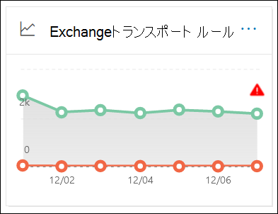
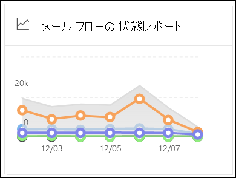

# セキュリティ コンプライアンス センターの [レポート] ダッシュボードでメール フロー レポート&表示する

[!INCLUDE [Microsoft 365 Defender rebranding](../includes/microsoft-defender-for-office.md)]

**適用対象**
- [Exchange Online Protection](exchange-online-protection-overview.md)
- [Microsoft Defender for Office 365 プラン 1 およびプラン 2](defender-for-office-365.md)
- [Microsoft 365 Defender](../defender/microsoft-365-defender.md)

> [!NOTE]
>
> この記事のレポートの大部分は、Microsoft 365 Defender Exchange管理センター (EAC) でも利用できます。 詳細については、次のトピックをご覧ください。
>
> - [新しい管理センターのメール フロー Exchangeレポート](/exchange/monitoring/mail-flow-reports/mail-flow-reports)
> - [電子メール セキュリティ レポートを Microsoft 365 Defenderする](view-email-security-reports.md)

セキュリティ & コンプライアンス センターのメール フローダッシュボードで使用できるメール フロー レポートに加えて、レポート ダッシュボードには、Microsoft 365 組織の監視に役立つさまざまなメール フロー レポートがあります。

必要なアクセス許可 [がある](#what-permissions-are-needed-to-view-these-reports)場合は、[レポート ダッシュボード] に移動して、セキュリティ & コンプライアンス センターでこれらのレポート <https://protection.office.com> **を表示** \> **できます**。 レポート ダッシュボードに直接移動するには、を開きます <https://protection.office.com/insightdashboard> 。

## コネクタ レポート

> [!NOTE]
> このレポートは、EAC の **受信** メッセージ レポートと送信メッセージ **レポート** に置き換えられた。 詳細については、「新しい EAC の受信メッセージと送信メッセージ レポート [」を参照してください](/exchange/monitoring/mail-flow-reports/mfr-inbound-messages-and-outbound-messages-reports)。

## Exchangeトランスポート ルール レポート

トランスポート **Exchangeレポートには**、組織内の受信メッセージと送信メッセージに対するメール フロー ルール (トランスポート ルールとも呼ばれる) の影響が表示されます。

レポートを表示するには、コンプライアンス センターでセキュリティ &を開き、[レポート ダッシュボード] に移動し、[トランスポート ルールExchange <https://protection.office.com>  \> **選択します**。 レポートに直接移動するには、を開きます <https://security.microsoft.com/reports/ETRRuleReport> 。

> [!NOTE]
> セキュリティ & コンプライアンス センター (protection.office.com) でこのレポートのウィジェットをクリックすると、Microsoft 365 Defender ポータル (security.microsoft.com) の完全なレポートが表示されます。 レポートの詳細については、「トランスポート[ルール レポートExchangeを参照してください](view-email-security-reports.md#exchange-transport-rule-report)。

## 転送レポート

> [!NOTE]
> 転送 **レポートは** EAC で利用できます。 詳細については、「新しい [EAC の自動転送メッセージ レポート」を参照してください](/exchange/monitoring/mail-flow-reports/mfr-auto-forwarded-messages-report)。

## メールフローの状態レポート

Mailflow **状態レポートは**、送信済 みおよび受信済みメール レポートに似ています。エッジで許可またはブロックされた電子メールに関する追加情報を含む。 これは、エッジ保護情報を含む唯一のレポートであり、EOP (EOP) による評価のためにサービスに許可される前にブロックされる電子メールの量を示Exchange Online Protectionです。 メッセージが 5 人の受信者に送信された場合、メッセージは 1 つのメッセージではなく 5 つの異なるメッセージとしてカウントされます。

レポートを表示するには、コンプライアンス センターでセキュリティ &[を](https://protection.office.com)開き、[レポート **ダッシュボード]** に移動し、[メールフローの状態レポート \> ]**を選択します**。 メール フローの状態レポートに **直接移動するには、** 開きます <https://security.microsoft.com/reports/mailflowStatusReport> 。

> [!NOTE]
> セキュリティ & コンプライアンス センター (protection.office.com) でこのレポートのウィジェットをクリックすると、Microsoft 365 Defender ポータル (security.microsoft.com) の完全なレポートが表示されます。 レポートの詳細については [、「Mailflow status report」を参照してください](view-email-security-reports.md#mailflow-status-report)。

## 送信および受信した電子メール レポート

> [!NOTE]
> このレポートは、Mailflow 状態 [レポートに置き換えされています](#mailflow-status-report)。

## 上位の送信者と受信者レポート

[ **上位の送信者と受信者]** レポートは、上位のメール送信者と受信者を示す円グラフです。

レポートを表示するには、セキュリティ & コンプライアンス センターを [開き、レポートダッシュボード] に移動し、[上位の送信者と受信者] \> **を選択します**。 レポートに直接移動するには、を開きます <https://protection.office.com/reportv2?id=TopSenderRecipientsATP> 。

### 上位の送信者と受信者レポートのレポート ビュー

レポート ビューでは、次のグラフを使用できます。

- **上位メール送信者 \> のデータを表示する**
- **上位メール受信者 \> のデータを表示する**
- **上位のスパム受信者 \> のデータを表示する**
- **データの表示 \> 上位マルウェア受信者** (EOP)
- **上位マルウェア受信者 \> のデータを表示する (Defender for Office 365)**

円グラフの構成は、これらの選択内容に基づいて変更されます。

円グラフのくさびの上にマウス ポインターを置くと、送信または受信されたメッセージの数を確認できます。

レポート ビューで **[フィルター]** をクリックすると、[開始日] と [終了日] で日付 **範囲****を指定できます**。

![[上位の送信者と受信者] レポートの [レポート] ビューの円グラフ。](../../media/top-senders-and-recipients-report-view.png)

### 上位の送信者と受信者レポートの詳細テーブル ビュー

[詳細テーブル **の表示]** をクリックすると、表示される情報は、表示されているグラフによって異なります。

- **上位メール送信者 \> のデータを表示する**

  - **上位のメール送信者**
  - **Count**

- **上位メール受信者 \> のデータを表示する**

  - **上位のメール受信者**
  - **Count**

- **上位のスパム受信者 \> のデータを表示する**

  - **上位のスパム受信者**
  - **Count**

- **データの表示 \> 上位マルウェア受信者** (EOP)

  - **上位のマルウェア受信者**
  - **Count**

- **上位マルウェア受信者 \> のデータを表示する (Defender for Office 365)**

  - **上位のマルウェア受信者 (Defender for Office 365)**
  - **Count**

詳細テーブル ビューで **[フィルター** ] をクリックすると、[開始日] と [終了日] で日付 **範囲****を指定できます**。

レポート ビューに戻る場合は、[レポートの表示] **をクリックします**。

## これらのレポートを表示するために必要なアクセス許可

この記事で説明するレポートを表示および使用するには、セキュリティ コンプライアンス センターで次のいずれかの役割グループの&必要があります。

- **組織の管理**
- **セキュリティ管理者**
- **セキュリティ閲覧者**
- **グローバル閲覧者**

詳細については、「[セキュリティ/コンプライアンス センターのアクセス許可](permissions-in-the-security-and-compliance-center.md)」を参照してください。

> [!NOTE]
> Microsoft 365 管理センターで、対応する Azure Active Directory の役割にユーザーを追加すると、ユーザーには、セキュリティ/コンプライアンス センター の必要なアクセス許可 _および_ Microsoft 365 のその他の機能に必要なアクセス許可が付与されます。 詳細については、「[管理者の役割について](../../admin/add-users/about-admin-roles.md)」を参照してください。

## 関連項目

[セキュリティ/コンプライアンス センターのスマート レポートと分析情報](reports-and-insights-in-security-and-compliance.md)

[セキュリティとコンプライアンス センターのメッセージ追跡の分析情報](mail-flow-insights-v2.md)

[セキュリティとコンプライアンス センターで電子メールのセキュリティ レポートを表示する](view-email-security-reports.md)

[Microsoft Defender for microsoft Defender for Office 365](view-reports-for-mdo.md)
