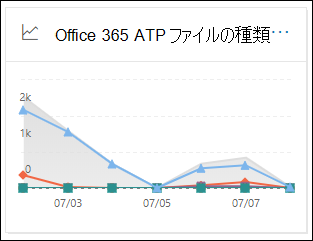
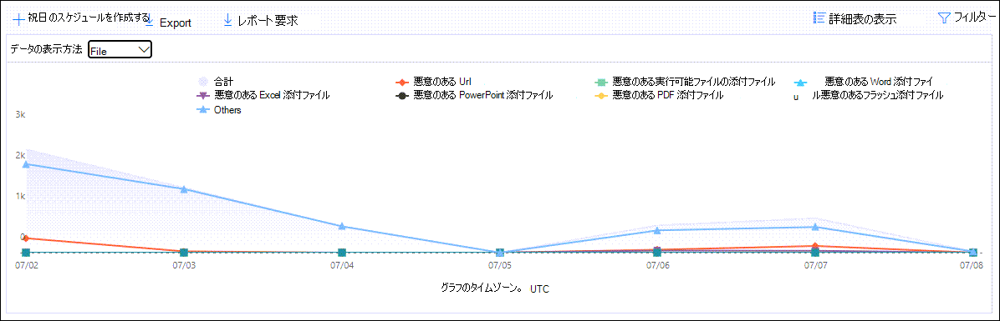
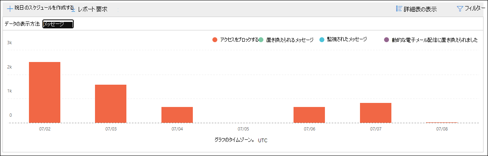
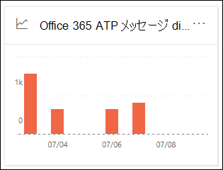
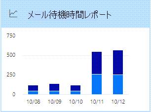
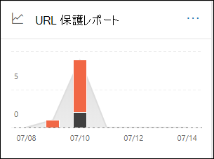

# セキュリティ & コンプライアンスセンターのレポートダッシュボードで Office 365 の Defender を表示するレポート

[!INCLUDE [Microsoft 365 Defender rebranding](../includes/microsoft-defender-for-office.md)]

Microsoft Defender for Office 365 組織 (たとえば、Microsoft 365 E5 サブスクリプションまたは microsoft Defender for office 365 Plan 1 または Microsoft Defender for Office 365 Plan 2 アドオン) には、さまざまなセキュリティ関連のレポートが含まれています。 [必要なアクセス許可](#what-permissions-are-needed-to-view-the-defender-for-office-365-reports)がある場合は、**レポート** ダッシュボードにアクセスすることによって、セキュリティ & コンプライアンスセンターでこれらのレポートを表示でき \> **Dashboard** ます。 レポートダッシュボードに直接移動するには、を開き <https://protection.office.com/insightdashboard> ます。

## Office 365 の Defender のファイルの種類レポート

「 **Defender For Office 365 ファイルの種類レポート** レポート」には、 [安全な添付ファイル](atp-safe-attachments.md)によって悪意のあるファイルとして検出されたファイルの種類が表示されます。

 レポートの集計ビューでは90日間のフィルター処理が可能になりますが、詳細ビューでは10日間のフィルター処理のみが可能です。

レポートを表示するには、[セキュリティ & コンプライアンスセンター](https://protection.office.com)を開き、[**レポート** ダッシュボード] に移動して、 \> **Dashboard** [ **Office 365 ファイルの種類] の [Defender**] を選択します。 レポートに直接移動するには、を開き <https://protection.office.com/reportv2?id=ATPFileReport> ます。

> [!NOTE]
> このレポートの情報は、 [Defender For Office 365 メッセージ廃棄レポート](#defender-for-office-365-message-disposition-report)でも利用できます。

### Office 365 のファイルタイプレポートのためのレポートビュー

次のビューを利用できます。

- **データの表示方法: ファイル**: グラフには、次の情報が含まれています。

  - **悪意のある Excel 添付ファイル**
  - **悪意のあるフラッシュ添付ファイル**
  - **悪意のある PDF 添付ファイル**
  - **悪意のある PowerPoint 添付ファイル**
  - **悪意のある Url**
  - **悪意のある Word 添付ファイル**
  - **悪意のある実行可能ファイルの添付ファイル**
  - **Others**

  特定の日 (データポイント) にカーソルを移動すると、EOP で [安全な添付](atp-safe-attachments.md) ファイルと [マルウェア対策保護](anti-malware-protection.md)によって検出された悪意のあるファイルの種類の内訳が表示されます。

  

  [ **フィルター**] をクリックすると、次のフィルターを使用してレポートを変更できます。

  - **開始日** と **終了日**
  - グラフに表示されているものと同じファイルの種類の値。

- **データの表示: メッセージ**: グラフには次の情報が含まれています。

  - **アクセスをブロックする**
  - **置き換えられるメッセージ**
  - **監視されたメッセージ**
  - **動的な電子メール配信に置き換え** ます。詳細については、「 [安全な添付ファイルのポリシーでの動的配信](atp-safe-attachments.md#dynamic-delivery-in-safe-attachments-policies)」を参照してください。

  

  [ **フィルター**] をクリックすると、次のフィルターを使用してレポートを変更できます。

  - **開始日** と **終了日**
  - グラフで使用できるものと同じメッセージの廃棄値、および値が **渡さ** れる追加メッセージ。

### Office 365 のファイルタイプレポートのための詳細テーブルビュー

[ **詳細テーブルの表示**] をクリックすると、過去10日間に組織内で発生したすべてのクリックが、ほぼリアルタイムで表示されます。 表示される情報は、表示されていたグラフによって異なります。

- **データの表示方法: ファイル**:

  - **Date**
  - **受信者のアドレス**
  - **[送信者のアドレス]**
  - メッセージ **id**: メッセージヘッダーの **メッセージ id** ヘッダーフィールドで利用可能で、一意である必要があります。 値の例を次に示し `<08f1e0f6806a47b4ac103961109ae6ef@server.domain>` ます (角かっこに注意してください)。
  - **File**

  [ **フィルター**] をクリックすると、次のフィルターを使用してレポートを変更できます。

  - **開始日** と **終了日**
  - グラフに表示されているものと同じファイルの種類の値。

- **データの表示: メッセージ**:

  - **Date**
  - **受信者のアドレス**
  - **[送信者のアドレス]**
  - **[メッセージ ID]**
  - **File**
  - **Subject**

  [ **フィルター**] をクリックすると、次のフィルターを使用して結果を変更できます。

  - **開始日** と **終了日**
  - グラフで使用できるものと同じメッセージの廃棄値、および値が **渡さ** れる追加メッセージ。

レポートビューに戻るには、[ **レポートの表示**] をクリックします。

## Defender for Office 365 メッセージ廃棄レポート

**ATP メッセージディスポジション** レポートには、悪意のあるコンテンツが含まれていることが検出された電子メールメッセージに対して実行されたアクションが表示されます。

レポートを表示するには、 [セキュリティ & コンプライアンスセンター](https://protection.office.com)を開き、[ **レポート** \> **ダッシュボード** ] に移動して、[ **Defender for Office 365 メッセージの廃棄**] を選択します。 レポートに直接移動するには、を開き <https://protection.office.com/reportv2?id=ATPMessageReport> ます。

> [!NOTE]
> このレポートの情報は、 [Defender For Office 365 ファイルの種類レポート](#defender-for-office-365-file-types-report)でも利用できます。

### Defender for Office 365 メッセージ廃棄レポートのレポートビュー

次のビューを利用できます。

- **データの表示: メッセージ**: グラフには次の情報が含まれています。

  - **アクセスをブロックする**
  - **置き換えられるメッセージ**
  - **監視されたメッセージ**
  - **動的な電子メール配信に置き換え** ます。詳細については、「 [安全な添付ファイルのポリシーでの動的配信](atp-safe-attachments.md#dynamic-delivery-in-safe-attachments-policies)」を参照してください。

  

  [ **フィルター**] をクリックすると、次のフィルターを使用してレポートを変更できます。

  - **開始日** と **終了日**
  - グラフで使用できるものと同じメッセージの廃棄値、および値が **渡さ** れる追加メッセージ。

- **データの表示方法: ファイル**: グラフには、次の情報が含まれています。

  - **悪意のある Excel 添付ファイル**
  - **悪意のあるフラッシュ添付ファイル**
  - **悪意のある PDF 添付ファイル**
  - **悪意のある PowerPoint 添付ファイル**
  - **悪意のある Url**
  - **悪意のある Word 添付ファイル**
  - **悪意のある実行可能ファイルの添付ファイル**
  - **Others**

  特定の日 (データポイント) にカーソルを移動すると、EOP で [安全な添付](atp-safe-attachments.md) ファイルと [マルウェア対策保護](anti-malware-protection.md)によって検出された悪意のあるファイルの種類の内訳が表示されます。

  

  [ **フィルター**] をクリックすると、次のフィルターを使用してレポートを変更できます。

  - **開始日** と **終了日**
  - グラフに表示されているものと同じファイルの種類の値。

### Defender for Office 365 メッセージ廃棄レポートの詳細表ビュー

[ **詳細テーブルの表示**] をクリックすると、過去10日間に組織内で発生したすべてのクリックが、ほぼリアルタイムで表示されます。 表示される情報は、表示されていたグラフによって異なります。

- **データの表示: メッセージ**:

  - **Date**
  - **受信者のアドレス**
  - **[送信者のアドレス]**
  - **[メッセージ ID]**
  - **File**
  - **Subject**

  [ **フィルター**] をクリックすると、次のフィルターを使用して結果を変更できます。

  - **開始日** と **終了日**
  - グラフで使用できるものと同じメッセージの廃棄値、および値が **渡さ** れる追加メッセージ。

- **データの表示方法: ファイル**:

  - **Date**
  - **受信者のアドレス**
  - **[送信者のアドレス]**
  - **[メッセージ ID]**
  - **File**

  [ **フィルター**] をクリックすると、次のフィルターを使用してレポートを変更できます。

  - **開始日** と **終了日**
  - グラフに表示されているものと同じファイルの種類の値。

レポートビューに戻るには、[ **レポートの表示**] をクリックします。

## メール待機時間レポート

**メール潜在期間レポート** には、組織内で発生したメール配信および分析待機時間の集約されたビューが表示されます。 サービスのメール配信時間はいくつかの要因によって影響を受け、絶対配信時間を秒単位で指定することは、成功または問題の適切な指標ではないことがよくあります。 1日の配信時間が遅い場合は、別の日の平均配信時間として、またはその逆の場合があります。 **メール待機時間レポート** は、他のメッセージの監視された配信時間に関する統計データに基づいて、メッセージの配信を限定しようとします。

- **50 パー百分位**: これは、メッセージ配信時間の中央です。 この値は、平均配信時間と考えることができます。
- **90th 百分位**: これは、メッセージ配信の遅延が大きいことを示します。 この値を超えて配信するようになるのは、メッセージの10% のみです。
- **99th 百分位**: これは、メッセージ配信の最大待機時間を示します。

クライアント側とネットワークの待機時間は含まれません。

レポートを表示するには、 [セキュリティ & コンプライアンスセンター](https://protection.office.com)を開き、[ **レポート** \> **ダッシュボード** ] に移動して、[ **メール待機時間レポート**] を選択します。 レポートに直接移動するには、を開き <https://protection.office.com/mailLatencyReport?viewid=P50> ます。

### メール待機時間レポートのレポートビュー

レポートを開くと、既定で [ **50 パー percentiles** ] タブが選択されます。

既定では、このビューには次のフィルターを使用して構成されたグラフが含まれています。

- **日付**: 過去7日間
- **メッセージビュー**:
  - 分析メッセージ

この図は、次のカテゴリに分類されるメッセージを示しています。

- **メール配信の遅延**
- **分析の待機時間**

グラフのカテゴリの上にマウスカーソルを移動すると、各カテゴリの待機時間の内訳が表示されます。

レポートビューで [ **フィルター** ] をクリックすると、次のフィルターを使用して結果を変更できます。

- すべてのメッセージ
- 添付ファイルまたは Url を含むメッセージ

[ **90th percentiles** ] タブまたは [ **99 番目の percentiles** ] タブをクリックすると、 **50 パー percentiles** ビューからの同じ既定のフィルターが使用されます。

### メール待機時間レポートの詳細表ビュー

詳細テーブルビューには、次の情報が表示されます。

- **Date**
- **Percentiles**
- **メッセージ数**
- **全体的な待機時間**

上記は、配信されたすべてのメッセージに対して発生した平均待機時間 (11 月14日)、分析が **108.033** 秒であることを示しています。

詳細表には、各タブに同じ情報が含まれています。

## 脅威保護の状態レポート

**脅威保護の状態** レポートは、悪意のあるコンテンツや悪意のある電子メールに関する情報をまとめた1つのビューであり、 [Exchange Online protection](exchange-online-protection-overview.md) (EOP) および Microsoft Defender for Office 365 によって検出されブロックされます。 詳細については、「 [脅威保護の状態レポート](view-email-security-reports.md#threat-protection-status-report)」を参照してください。

## URL の脅威保護レポート

**Url 脅威保護レポート** には、検出された脅威の概要と傾向ビュー、および [安全なリンク](atp-safe-links.md)の一部として、URL クリックに対して行われたアクションが表示されます。 このレポートには、安全なリンクポリシーが適用されているユーザーのクリックデータがありません。 [ユーザーのクリックを **追跡** しない] オプションが選択されています。

レポートを表示するには、 [セキュリティ & コンプライアンスセンター](https://protection.office.com)を開き、[ **レポート** \> **ダッシュボード** ] に移動して、[ **URL 保護レポート**] を選択します。 レポートに直接移動するには、を開き <https://protection.office.com/reportv2?id=URLProtectionActionReport> ます。

> [!NOTE]
> これは、 *保護傾向レポート* で、データが大きなデータセット内の傾向を表すことを意味します。 その結果、集計ビュー内のデータはリアルタイムでは使用できませんが、[詳細] テーブルビューのデータは、2つのビューの間に若干の違いがあることがわかります。

### URL 脅威保護レポートのレポートビュー

**URL 脅威保護** レポートには、過去90日間のデータを表示する4時間ごとに更新される2つの集計ビューがあります。

- **[URL] [保護アクション] をクリック** します。組織内のユーザーによる URL クリック数、およびクリックの結果が表示されます。

  - **ブロック** (ユーザーが URL への移動をブロックされた)
  - **ブロックとクリックスルー**
  - **スキャン中にクリックでクリック**

  クリックすると、ユーザーが悪意のある web サイトをクリックしたことを示します (管理者は、安全なリンクポリシーでクリックを無効にすることができます)。

  [ **フィルター**] をクリックすると、次のフィルターを使用してレポートを変更できます。

  - **開始日** と **終了日**
  - 利用可能なクリック保護アクションと **許容さ** れる値 (ユーザーが URL への移動を許可されたもの)。

  ![URL URL の脅威保護レポートにある [保護アクション表示] をクリックします。](../../media/url-threat-protection-report-url-click-protection-action-view.png)

- **Url [アプリケーション別] をクリック**: 安全なリンクをサポートするアプリケーションによる url クリックの数を表示します。

  - **電子メール クライアント**
  - **PowerPoint**
  - **Word**
  - **Excel**
  - **OneNote**
  - **Visio**
  - **Teams**
  - **その他**

  [ **フィルター**] をクリックすると、次のフィルターを使用してレポートを変更できます。

  - **開始日** と **終了日**
  - 利用可能なアプリケーション。

### URL 脅威保護レポートの詳細表ビュー

[ **詳細テーブルの表示**] をクリックすると、このレポートでは、過去7日間の組織内で発生したすべてのクリックが、次のようなほぼリアルタイムで表示されます。

- **[時刻] をクリック**
- **ユーザー**
- **URL**
- **操作**
- **App**

詳細テーブルビューで [ **フィルター** ] をクリックすると、レポートビューと同じ条件で、およびコンマで区切られた **ドメイン** または **受信者** によってフィルター処理を行うことができます。

レポートビューに戻るには、[ **レポートの表示**] をクリックします。

## 表示する追加レポート

このトピックで説明されているレポートに加えて、次の表に示すように、他にもいくつかのレポートを使用できます。

****

|レポート|トピック|
|---|---|
|**エクスプローラー** (microsoft Defender for Office 365 プラン 2) または **リアルタイム検出** (microsoft Defender for office 365 プラン 1)|[脅威エクスプローラー (およびリアルタイムの検出)](threat-explorer.md)|
|上位の送信者と受信者レポート、スプーフィングメールレポート、スパム検出レポートなどの **電子メールセキュリティレポート**。|[セキュリティとコンプライアンス センターで電子メールのセキュリティ レポートを表示する](view-email-security-reports.md)|
|転送レポート、メールフロー状態レポート、上位の送信者と受信者レポートなどの **メールフローレポート**。|[セキュリティ & コンプライアンスセンターでメールフローレポートを表示する](view-mail-flow-reports.md)|
|**安全なリンクの URL トレース** (PowerShell のみ)。 このコマンドレットの出力では、過去7日間の安全なリンクアクションの結果が表示されます。|[取得-UrlTrace](https://docs.microsoft.com/powershell/module/exchange/get-urltrace)|
|**EOP のメールトラフィックの結果と Microsoft Defender For Office 365** (PowerShell のみ)。 このコマンドレットの出力には、ドメイン、日付、イベントの種類、方向、アクション、およびメッセージ数に関する情報が含まれています。|[Get-mailtrafficatpreport](https://docs.microsoft.com/powershell/module/exchange/get-mailtrafficatpreport)|
|**EOP および Defender For Office 365 の検出に関するメール詳細レポート** (PowerShell のみ)。 このコマンドレットの出力には、悪意のあるファイルまたは Url、フィッシングの試行、偽装、その他の電子メールやファイルの潜在的な脅威に関する詳細が記載されています。|[Get-MailDetailATPReport](https://docs.microsoft.com/powershell/module/exchange/get-maildetailatpreport)|
|

## Office 365 レポートの Defender を表示するには、どのようなアクセス許可が必要ですか。

このトピックで説明されているレポートを表示して使用するには、セキュリティ & コンプライアンスセンターの次のいずれかの役割グループのメンバーである必要があります。

- **組織の管理**
- **セキュリティ管理者**
- **セキュリティリーダ**
- **グローバル閲覧者**

詳細については、「[セキュリティ/コンプライアンス センターのアクセス許可](permissions-in-the-security-and-compliance-center.md)」を参照してください。

**注**: microsoft 365 管理センターで対応する Azure Active Directory の役割にユーザーを追加すると、セキュリティ & コンプライアンスセンター _と_ 、microsoft 365 の他の機能に対するアクセス許可で必要なアクセス許可がユーザーに付与されます。 詳細については、[「管理者の役割について」](https://docs.microsoft.com/microsoft-365/admin/add-users/about-admin-roles) を参照してください。

## レポートでデータが表示されない場合はどうなりますか。

Office 365 のレポートに関するデータが Defender に表示されない場合は、ポリシーが正しく設定されていることを再度確認してください。 組織には、 [安全なリンクポリシー](set-up-atp-safe-links-policies.md) と [安全な添付ファイルのポリシー](set-up-atp-safe-attachments-policies.md) が定義されている必要があります。これには、Defender for Office 365 protection を適切に設定する必要があります。 また、 [スパム対策とマルウェア対策の保護](anti-spam-and-anti-malware-protection.md)についても参照してください。

## 関連項目

[セキュリティ/コンプライアンス センターのスマート レポートと分析情報](reports-and-insights-in-security-and-compliance.md)
  
[役割のアクセス許可 (Azure Active Directory](https://docs.microsoft.com/azure/active-directory/users-groups-roles/directory-assign-admin-roles#role-permissions)
