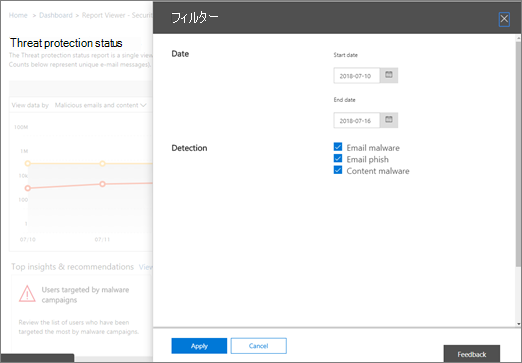

# Office 365 Advanced Threat Protection のレポートを表示する

組織に[Office 365 Advanced Threat Protection](office-365-atp.md) (ATP) があり、[必要なアクセス許可](#what-permissions-are-needed-to-view-the-atp-reports)がある場合は、セキュリティコンプライアンスセンターでいくつかの ATP レポートを使用でき &amp; ます。 ([**レポート** \> ] に移動します。**ダッシュボード**)

ATP レポートには次のものが含まれます。

- [脅威保護の状態レポート](#threat-protection-status-report)
- [ATP ファイルの種類レポート](#atp-file-types-report)
- [ATP メッセージの廃棄レポート](#atp-message-disposition-report)
- [リアルタイム検出またはエクスプローラー](threat-explorer.md) (OFFICE 365 ATP プラン1または2を使用しているかどうかによって異なります)
- ...その[他](#additional-reports-to-view)。

ATP レポートの概要とその使用方法については、この記事を参照してください。

## 脅威保護の状態レポート

**脅威保護の状態**レポートは、悪意のあるコンテンツや悪意のある電子メールに関する情報をまとめた1つのビューで、 [Exchange Online Protection](exchange-online-protection-overview.md) (EOP) および[Office 365 ATP](office-365-atp.md)によって検出されブロックされます。 このレポートは、時間の経過による検出 (最大90日間) を表示するのに役立ち、セキュリティ管理者が傾向を特定したり、ポリシーが調整を必要とするかどうかを判断したりできます。

このレポートでは、マルウェア対策エンジンによってブロックされたファイルや web サイトアドレス (Url)、[ゼロ時間自動削除 (ZAP)](zero-hour-auto-purge.md)、Atp の[安全](atp-safe-links.md)な添付ファイル、Atp の[安全な添付ファイル](atp-safe-attachments.md)、 [atp のフィッシング対策](set-up-anti-phishing-policies.md)などの atp 機能など、悪意のあるコンテンツを含む一意の電子メールメッセージの集計数を示します。

情報のフィルターと内訳により、このレポートの情報をより詳細に分類することができます。 具体的には、[**電子メール**の \> **フィッシング**] および [**電子メール**の \> **マルウェア] ビュー**に含まれている [ブレークダウン] メニューがあります。 データは次のように分割されます。

|||
|---|---|
|検出の種類別|これらの脅威をキャッチするために役立つポリシーは何ですか。|
|検出テクノロジによる|脅威をキャッチした Microsoft テクノロジの基礎|
|配信状況別|脅威として検出された電子メールメッセージにはどのような現象がありますか?|
|

> [!TIP]
> 電子メール > フィッシング |マルウェアの表示には、ATP によって*生成さ*れたファイルの評価、*ファイルの分析*、 *URL の分析*、*スプーフィング防止: DMARC failure*などのカテゴリがあるので、表示されている検出テクノロジの詳細な分類があります。たとえば、組織が脅威をキャッチすることを明確にするために役立ちます。

これらのビューでは、ボタンのクリック (**電子メール** \> **フィッシング**、**電子メール**の \> **マルウェア**、および**コンテンツ** \> **マルウェア**の表示) を使用して、エクスポートするオプションが提供されます。 コンピューターにエクスポートされた集計データを Excel で開くことができます。

![この図は、マルウェアビューのメニュー、[スケジュールの作成]、および [要求レポート] のオプションとしてのエクスポートを示しています。](../../media/tp-threatProtectStatRpt-BreakDownByExport.png)

**注**:**フィッシング**および**マルウェア**に対してエクスポートできるエントリの最大数は、1万の下のみです。 ビューをエクスポートする場合は、最新の1万エントリのみがエクスポートされます。

概要とメールのビューでは、24時間ではなく、処理時間内に情報が表示されます (demand re)。 ここでは、この速度が向上しています)。

> [!NOTE]
> 脅威保護の状態レポートは、 [Office 365 ATP](office-365-atp.md)または[Exchange Online Protection](exchange-online-protection-overview.md)(EOP) のいずれかを使用しているお客様が利用できます。ただし、ATP のお客様の脅威保護状態レポートに表示される情報には、EOP のお客様に表示されるものとは異なるデータが含まれている可能性があります。 たとえば、ATP のお客様向けの脅威保護状態レポートには、 [SharePoint Online、OneDrive、Microsoft Teams で検出された悪意のあるファイル](atp-for-spo-odb-and-teams.md)に関する情報が含まれています。 このような情報は ATP に固有のものなので、EOP を持たないお客様は脅威保護の状態レポートにこれらの詳細を表示しません。

脅威保護の状態レポートを表示するには、[セキュリティ/ &amp; コンプライアンスセンター](https://protection.office.com)で、[**レポート** \> **ダッシュボード**の \> **脅威保護の状態**] に移動します。

1日の詳細な状態を取得するには、グラフの上にポインターを移動します。

既定では、脅威保護の状態レポートには過去7日間のデータが表示されます。 ただし、**フィルター**を選択し、日付の範囲を変更して、最大90日間のデータを表示することができます。 (試用版サブスクリプションを使用している場合は、30日間のデータに制限されることがあります)。

[**データの表示**] メニューを使用して、レポートに表示される情報を変更することもできます。

## URL 保護状態レポート

このレポートは基礎となるデータを収集し、1回のクリックで検出された脅威です (一方、他のほとんどの電子メール脅威関連のレポートはメッセージデータごと)。 このレポートは、クリックごとに電子メールメッセージやドキュメント内のハイパーリンクによって発生する脅威を表示するように設計されています。 2つのビューがあります。

|||
|---|---|
|URL [保護アクション] をクリックします。|ブロックされる Url の数、ブロックされているが、ユーザーによるクリックスルーで上書きされ、ユーザーがクリックスルーで上書きしていることを確認します。|
|[URL] をクリックします (アプリケーション別)|URL がクリックされたアプリケーションを参照してください。|
|

詳細表には、クリック時間とユーザー情報に関する詳細情報が表示されます。 最後に、URL 保護の状態レポートでは、ATP の安全なリンク機能が保護されているため、ATP の安全なリンクが有効になっているお客様のみが、このレポートに反映されるデータを表示することに注意してください。

> [!NOTE]
> これは、*保護傾向レポート*で、データが大きなデータセット内の傾向を表すことを意味します。 その結果、集計ビュー内のデータはリアルタイムでは使用できませんが、[詳細] テーブルビューのデータは、2つのビューの間に若干の違いがあることがわかります。

## ATP ファイルの種類レポート

**Atp ファイルの種類**レポートには、 [atp の安全な添付](atp-safe-attachments.md)ファイルによって検出されたファイルの種類が表示されます。

このレポートを表示するには、[セキュリティ/ &amp; コンプライアンスセンター](https://protection.office.com)で、[**レポート**ダッシュボード ATP] [ファイルの種類] に移動 \> **Dashboard** \> **ATP File Types**します。

  
特定の日にポインターを置くと、 [ATP の安全な添付](atp-safe-attachments.md)ファイルとスパム対策の[ &amp; マルウェア対策保護](anti-spam-and-anti-malware-protection.md)によって検出された悪意のあるファイルの種類の内訳を確認できます。
  

## ATP メッセージの廃棄レポート

**ATP メッセージディスポジション**レポートには、悪意のあるコンテンツが含まれていることが検出された電子メールメッセージに対して実行されたアクションが表示されます。

このレポートを表示するには、[セキュリティ/ &amp; コンプライアンスセンター](https://protection.office.com)で、[**レポート** \> **ダッシュボード** \> **ATP メッセージ廃棄**] に移動します。

グラフのバーの上にマウスカーソルを移動すると、その日に検出されたメールに対して実行されたアクションを確認できます。

## 表示する追加レポート

この記事で説明されている ATP レポートに加えて、次の表に示すように、他にもいくつかのレポートを利用できます。

|||
|---|---|
|**レポート (s)**|**詳細**|
|**エクスプローラー**または**リアルタイム検出**: (Office 365 ATP Plan 2 のお客様はエクスプローラーを所有しています。Office 365 ATP Plan 1 お客様はリアルタイムの検出を行っています。|[脅威エクスプローラー (およびリアルタイムの検出)](threat-explorer.md)|
|上位の送信者と受信者のレポート、スプーフィングメールレポート、スパム検出レポートなどの**電子メールセキュリティレポート**。|[セキュリティ/コンプライアンスセンターで電子メールのセキュリティレポートを表示する &amp;](view-email-security-reports.md)|
|**ATP の安全なリンク URL トレース**: (PowerShell を使用して生成したレポートです。)このレポートには、過去7日間 (7 日間) の ATP の安全なリンクアクションの結果が表示されます。|[取得-UrlTrace コマンドレットリファレンス](https://docs.microsoft.com/powershell/module/exchange/get-urltrace)|
|**EOP および ATP の結果**: (PowerShell を使用して生成したカスタムレポートです)。 このレポートには、ドメイン、日付、イベントの種類、方向、アクション、メッセージ数などの情報が含まれます。|[Get-mailtrafficatpreport コマンドレットリファレンス](https://docs.microsoft.com/powershell/module/exchange/get-mailtrafficatpreport)|
|**EOP および ATP の検出**: (PowerShell を使用して生成したカスタムレポートです)。 このレポートには、悪意のあるファイルまたは Url、フィッシングの試行、偽装、その他の電子メールやファイルの潜在的な脅威に関する詳細が記載されています。|[Get-MailDetailATPReport コマンドレットリファレンス](https://docs.microsoft.com/powershell/module/exchange/get-maildetailatpreport)|
|

## ATP レポートを表示するには、どのようなアクセス許可が必要ですか。

この記事に記載されているレポートを表示して使用するには、**セキュリティ &amp; コンプライアンスセンターと Exchange 管理センターの両方に対して適切な役割が割り当てられている必要があり**ます。

- セキュリティ &amp; /コンプライアンスセンターでは、次の役割のいずれかが割り当てられている必要があります。

  - 組織の管理
  - セキュリティ管理者 (Azure Active Directory 管理センターで割り当て [https://aad.portal.azure.com](https://aad.portal.azure.com) 可能)
  - Security Operator (Azure Active Directory 管理センター () で割り当てることができます [https://aad.portal.azure.com](https://aad.portal.azure.com) )
  - セキュリティ閲覧者

- Exchange Online の場合は、Exchange 管理センター ( [https://outlook.office365.com/ecp](https://outlook.office365.com/ecp) ) または PowerShell コマンドレット (「 [Exchange Online powershell](https://docs.microsoft.com/powershell/exchange/exchange-online/exchange-online-powershell)」を参照) のいずれかで、次のいずれかの役割が割り当てられている必要があります。

  - 組織の管理
  - 表示限定の組織管理
  - "View-Only Recipients/表示専用受信者" 役割
  - コンプライアンス管理

詳細については、次のリソースを参照してください。

- [セキュリティ/コンプライアンスセンターのアクセス許可 &amp;](permissions-in-the-security-and-compliance-center.md)

- [Exchange Online の機能アクセス許可](https://docs.microsoft.com/exchange/permissions-exo/feature-permissions)

## レポートでデータが表示されない場合はどうなりますか。

ATP レポートにデータが表示されない場合は、ポリシーが正しく設定されていることを再確認してください。 組織で atp の[安全なリンクポリシー](set-up-atp-safe-links-policies.md)と[atp の安全な添付ファイルのポリシー](set-up-atp-safe-attachments-policies.md)が定義されている必要があります。これは、atp 保護を適切に実行するためです。 また、「[スパム対策およびマルウェア対策保護 (Office 365](anti-spam-and-anti-malware-protection.md))」を参照してください。

## 関連項目

[セキュリティ/コンプライアンスセンターのレポートと分析 &amp;](reports-and-insights-in-security-and-compliance.md)
  
[役割のアクセス許可 (Azure Active Directory](https://docs.microsoft.com/azure/active-directory/users-groups-roles/directory-assign-admin-roles#role-permissions)
