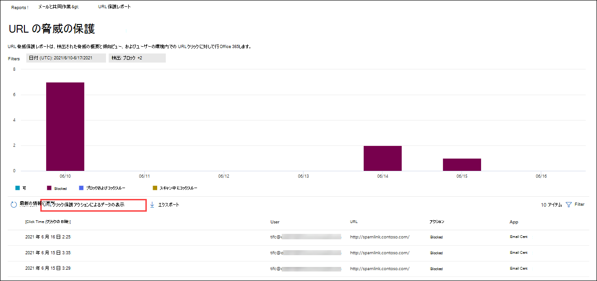

# ポータルでレポートOffice 365 Defender をMicrosoft 365 DefenderするView Defender for Office 365 reports in the Microsoft 365 Defender portal

[!INCLUDE [Microsoft 365 Defender rebranding](../includes/microsoft-defender-for-office.md)]

**適用対象****Applies to**
- [Microsoft Defender for Office 365 プラン 1 およびプラン 2Microsoft Defender for Office 365 plan 1 and plan 2](defender-for-office-365.md)
- [Microsoft 365 DefenderMicrosoft 365 Defender](../defender/microsoft-365-defender.md)

Office 365 組織向け Microsoft Defender (Microsoft 365 E5 サブスクリプション、Office 365 プラン 1 の Microsoft Defender、Office 365 プラン 2 アドオンの Microsoft Defender など) には、さまざまなセキュリティ関連レポートが含まれる。Microsoft Defender for Office 365 organizations (for example, Microsoft 365 E5 subscriptions or Microsoft Defender for Office 365 Plan 1 or Microsoft Defender for Office 365 Plan 2 add-ons) contain a variety of security-related reports. 必要な [アクセス許可を](#what-permissions-are-needed-to-view-the-defender-for-office-365-reports)持っている場合は、[レポートの電子メール] Microsoft 365 Defender コラボレーション レポートにアクセスして、Microsoft 365 Defender ポータルでこれらのレポート& \> **を** \> **表示&できます**。If you have the [necessary permissions](#what-permissions-are-needed-to-view-the-defender-for-office-365-reports), you can view these reports in the Microsoft 365 Defender portal by going to **Reports** \> **Email & collaboration** \> **Email & collaboration reports**. [コラボレーション レポートの電子メール] **ページ&移動するには、** を開きます <https://security.microsoft.com/emailandcollabreport> 。To go directly to the **Email & collaboration reports** page, open <https://security.microsoft.com/emailandcollabreport>.

![[&] ポータルの [コラボレーション レポート] ページMicrosoft 365 Defenderメール](../../media/email-collaboration-reports.png)

> [!NOTE]
>
> Defender を必要としない電子メール セキュリティ レポートについては、「Office 365 ポータルの電子メール セキュリティ レポートの表示」[でMicrosoft 365 Defenderされています](view-email-security-reports.md)。Email security reports that don't require Defender for Office 365 are described in [View email security reports in the Microsoft 365 Defender portal](view-email-security-reports.md).
>
> メール フローに関連するレポートは、現在、Exchangeセンター (EAC) に表示されます。Reports that are related to mail flow are now in the Exchange admin center (EAC). これらのレポートの詳細については、「新しい管理センターのメール フロー レポート[Exchange参照してください](/exchange/monitoring/mail-flow-reports/mail-flow-reports)。For more information about these reports, see [Mail flow reports in the new Exchange admin center](/exchange/monitoring/mail-flow-reports/mail-flow-reports).

## セーフ添付ファイルの種類レポートSafe Attachments file types report

> [!NOTE]
> [**添付セーフファイルの種類] レポートは**、最終的に削除されます。The **Safe Attachments file types report** will eventually go away. 脅威保護の状態レポートでも同 [じ情報を使用できます](#threat-protection-status-report)。The same information is available in the [Threat protection status report](#threat-protection-status-report).

## セーフ添付ファイル メッセージの廃棄レポートSafe Attachments message disposition report

> [!NOTE]
> 添付 **セーフメッセージ廃棄レポートは**、最終的に消え去ります。The **Safe Attachments message disposition report** will eventually go away. 脅威保護の状態レポートでも同 [じ情報を使用できます](#threat-protection-status-report)。The same information is available in the [Threat protection status report](#threat-protection-status-report).

## メール遅延レポートMail latency report

[ **メール待機時間] レポートには** 、組織内で発生したメール配信とデトレーションの待機時間の集計ビューが表示されます。The **Mail latency report** shows you an aggregate view of the mail delivery and detonation latency experienced within your organization. サービス内のメール配信時間は、多くの要因によって影響を受け、絶対配信時間 (秒) は成功または問題を示す良い指標ではない場合が多いです。Mail delivery times in the service are affected by a number of factors, and the absolute delivery time in seconds is often not a good indicator of success or a problem. ある日の配信時間が遅い場合は、別の日の平均配信時間、またはその逆と見なされる場合があります。A slow delivery time on one day might be considered an average delivery time on another day, or vice-versa. これにより、他のメッセージの観測配信時間に関する統計データに基づいて、メッセージ配信を修飾します。This tries to qualify message delivery based on statistical data about the observed delivery times of other messages.

クライアント側とネットワークの待機時間は含まれません。Client side and network latency are not included.

レポートを表示するには、Microsoft 365 Defender ポータル [を開き、レポートの電子メール] & \> **グループ**& \> **に移動します**。To view the report, open the [Microsoft 365 Defender portal](https://security.microsoft.com), go to **Reports** \> **Email & collaboration** \> **Email & collaboration reports**. [電子メール **&コラボレーション レポート] ページ** で、[ **メール遅延レポート** ] を探し、[詳細の表示] **をクリックします**。On the **Email & collaboration reports** page, find **Mail latency report** and then click **View details**. レポートに直接移動するには、を開きます <https://security.microsoft.com/mailLatencyReport> 。To go directly to the report, open <https://security.microsoft.com/mailLatencyReport>.

![[メールの遅延レポート] ページの [メールの&レポート] ウィジェット](../../media/mail-latency-report-widget.png)

[メール **の待機時間レポート] ページで** 、[メールの待機時間] レポート ページで次 **のタブを使用** できます。On the **Mail latency report** page, the following tabs are available on the **Mail latency report** page:

- **50 パーセント :** これは、メッセージの配信時間の中央です。**50th percentile**: This is the middle for message delivery times. この値は、平均配信時間と見なされます。You can consider this value as an average delivery time. このタブは既定で選択されています。This tab is selected by default.
- **90 パーセント :** これは、メッセージ配信の待機時間が長いを示します。**90th percentile**: This indicates a high latency for message delivery. 配信にこの値を超える時間がかかったメッセージはわずか 10% です。Only 10% of messages took longer than this value to deliver.
- **99 パーセント :** メッセージ配信の最大待機時間を示します。**99th percentile**: This indicates the highest latency for message delivery.

選択したタブに関係なく、グラフには次のカテゴリに分類されたメッセージが表示されます。Regardless of the tab you select, the chart shows messages organized into the following categories:

- **メール配信の待機時間****Mail delivery latency**
- **Detonations****Detonations**

グラフのカテゴリにカーソルを合わせると、各カテゴリの待機時間の内訳を確認できます。When you hover over a category in the chart, you can see a breakdown of the latency in each category.

[フィルター] **をクリック** すると、グラフと詳細テーブルの両方を次の値でフィルター処理できます。If you click **Filter**, you can filter both the chart and the details table by the following values:

- **日付 (UTC)**:**開始日と\*\*\*\*終了日****Date (UTC)**: **Start date** and **End date**
- **メッセージ ビュー**: 次のいずれかの値。**Message view**: One of the following values:
  - **すべてのメッセージ****All messages**
  - **添付ファイルまたは URL を含むメッセージ****Messages that contain attachments or URLs**
  - **削除されたメッセージ****Detonated messages**

フィルターの構成が完了したら、[適用]、[**キャンセル**]、または [フィルターのクリア]**をクリックします**。When you're finished configuring the filters, click **Apply**, **Cancel**, or **Clear filters**.

グラフの下の詳細テーブルでは、次の情報を使用できます。In the details table below the chart, the following information is available:

- **日付 (UTC)****Date (UTC)**
- **パーセント :** **50** **、90、\*\*\*\*または 99****Percentiles**: **50**, **90**, or **99**
- **メッセージ数****Message count**
- **全体的な待機時間****Overall latency**

## 脅威保護の状態レポートThreat protection status report

脅威 **保護の状態** レポートは [、Exchange Online Protection](exchange-online-protection-overview.md) (EOP) と Microsoft Defender for Office 365 によって検出およびブロックされた悪意のあるコンテンツと悪意のある電子メールに関する情報をまとめる単一のビューです。The **Threat protection status** report is a single view that brings together information about malicious content and malicious email detected and blocked by [Exchange Online Protection](exchange-online-protection-overview.md) (EOP) and Microsoft Defender for Office 365. 詳細については、「脅威保護の [状態レポート」を参照してください](view-email-security-reports.md#threat-protection-status-report)。For more information, see [Threat protection status report](view-email-security-reports.md#threat-protection-status-report).

## URL 脅威保護レポートURL threat protection report

**URL 脅威保護レポートには、** 検出された脅威の概要と傾向ビュー、および URL クリックに対するアクションが[リンク] リンクの一部としてセーフ [されます](safe-links.md)。The **URL threat protection report** provides summary and trend views for threats detected and actions taken on URL clicks as part of [Safe Links](safe-links.md). このレポートには、[リンク] ポリシーが適用されているユーザーセーフクリックデータが含まれる場合は、[ユーザーのクリックを追跡しない]**オプションが** 選択されています。This report will not have click data from users where the Safe Links policy applied has the **Do not track user clicks** option selected.

レポートを表示するには、Microsoft 365 Defender ポータル [を開き、レポートの電子メール] & \> **グループ**& \> **に移動します**。To view the report, open the [Microsoft 365 Defender portal](https://security.microsoft.com), go to **Reports** \> **Email & collaboration** \> **Email & collaboration reports**. [コラボレーション **レポートのメール&] ページ** で **、[URL 保護] ページ** を探し、[詳細の表示] **をクリックします**。On the **Email & collaboration reports** page, find **URL protection page** and then click **View details**. レポートに直接移動するには、を開きます <https://security.microsoft.com/reports/URLProtectionActionReport> 。To go directly to the report, open <https://security.microsoft.com/reports/URLProtectionActionReport>.

![[コラボレーション レポートの電子メール] ページ& URL 保護レポート ウィジェット](../../media/url-protection-report-widget.png)

[URL 脅威保護レポート] **ページで** 使用可能なビューについては、次のセクションで説明します。The available views on the **URL threat protection** report page are described in the following sections.

> [!NOTE]
> これは保護傾向 *レポートで、* データは大きなデータセットの傾向を表します。This is a *protection trend report*, meaning data represents trends in a larger dataset. その結果、グラフ内のデータはリアルタイムでは使用できませんが、詳細テーブルのデータは次の値なので、2 つのデータの間に若干の不一致が見られます。As a result, the data in the charts is not available in real time here, but the data in the details table is, so you may see a slight discrepancy between the two. グラフは 4 時間に 1 回更新され、過去 90 日間のデータが含まれています。The charts are refreshed once every four hours and contain data for the last 90 days.

### URL クリック保護アクションによるデータの表示View data by URL click protection action

[URL **によるデータの表示] クリック保護アクション** ビューには、組織内のユーザーによる URL クリックの数と、クリックの結果が表示されます。The **View data by URL click protection action** view shows the number of URL clicks by users in the organization and the results of the click:

- **許可 :** ユーザーは URL に移動できます。**Allowed**: The user was allowed to navigate to the URL.
- **ブロック :** ユーザーが URL への移動をブロックされました。**Blocked**: The user was blocked from navigating to the URL.
- **ブロックおよびクリックスルー**: ユーザーが URL への移動を続行する選択をしました。**Blocked and clicked through**: The user has chosen to continue navigating to the URL.
- **スキャン中にクリックスルー**: スキャンが完了する前に、ユーザーがリンクをクリックしました。**Clicked through during scan**: The user has clicked on the link before the scan was complete.

クリックすると、ユーザーがブロック ページをクリックして悪意のある Web サイトに移動した (管理者は、[リンク] ポリシーでクリックセーフ無効にできます)。A click indicates that the user has clicked through the block page to the malicious website (admins can disable click through in Safe Links policies).

[フィルター] **をクリック** すると、表示されるフライアウトで次の値の 1 つ以上を選択して、レポートと詳細テーブルを変更できます。If you click **Filters**, you can modify the report and the details table by selecting one or more of the following values in the flyout that appears:

- **日付 (UTC)**:**開始日と\*\*\*\*終了日****Date (UTC)**: **Start date** and **End date**
- **検出**:**Detection**:
  - **可****Allowed**
  - **ブロック済み****Blocked**
  - **ブロックおよびクリックスルー****Blocked and clicked through**
  - **スキャン中にクリックスルー****Clicked through during scan**
- **Domains**: レポートの結果に表示される URL ドメイン。**Domains**: The URL domains listed in the report results.
- **受信者****Recipients**

フィルターの構成が完了したら、[適用]、[**キャンセル**]、または [フィルターのクリア]**をクリックします**。When you're finished configuring the filters, click **Apply**, **Cancel**, or **Clear filters**.

グラフの下の詳細テーブルには、過去 7 日間に組織内で発生したすべてのクリックのほぼリアルタイム ビューが示されています。The details table below the chart provides the following near-real-time view of all clicks that happened within the organization for the last 7 days:

- **クリック時間****Click time**
- **ユーザー****User**
- **URL****URL**
- **Action****Action**
- **アプリ****App**

### アプリケーション別の URL クリックによるデータの表示View data by URL click by application

[URL **によるデータの表示] アプリケーション** によるクリックビューには、リンクをサポートするアプリによる URL クリック数セーフ表示されます。The **View data by URL click by application** view shows the number of URL clicks by apps that support Safe Links:

- **電子メール クライアント****Email client**
- **PowerPoint****PowerPoint**
- **Word****Word**
- **Excel****Excel**
- **OneNote****OneNote**
- **Visio****Visio**
- **Teams****Teams**
- **Others****Others**

[フィルター] **をクリック** すると、表示されるフライアウトで次の値の 1 つ以上を選択して、レポートと詳細テーブルを変更できます。If you click **Filters**, you can modify the report and the details table by selecting one or more of the following values in the flyout that appears:

- **日付 (UTC)**:**開始日と\*\*\*\*終了日****Date (UTC)**: **Start date** and **End date**
- **検出**: グラフから使用可能なアプリ。**Detection**: Available apps from the chart.
- **Domains**: レポートの結果に表示される URL ドメイン。**Domains**: The URL domains listed in the report results.
- **受信者****Recipients**

フィルターの構成が完了したら、[適用]、[**キャンセル**]、または [フィルターのクリア]**をクリックします**。When you're finished configuring the filters, click **Apply**, **Cancel**, or **Clear filters**.

グラフの下の詳細テーブルには、過去 7 日間に組織内で発生したすべてのクリックのほぼリアルタイム ビューが示されています。The details table below the chart provides the following near-real-time view of all clicks that happened within the organization for the last 7 days:

- **クリック時間****Click time**
- **ユーザー****User**
- **URL****URL**
- **Action****Action**
- **アプリ****App**

## 表示するその他のレポートAdditional reports to view

この記事で説明するレポートに加えて、次の表で説明するように、いくつかの他のレポートを使用できます。In addition to the reports described in this article, several other reports are available, as described in the following table:

 

****

|レポートReport|トピックTopic|
|---|---|
|**エクスプローラー** (Microsoft Defender for Office 365 プラン 2) またはリアルタイム検出 **(Microsoft** Defender for Office 365 プラン 1)**Explorer** (Microsoft Defender for Office 365 Plan 2) or **real-time detections** (Microsoft Defender for Office 365 Plan 1)|[脅威エクスプローラー (およびリアルタイムの検出)Threat Explorer (and real-time detections)](threat-explorer.md)|
|Defender を必要としない電子メール セキュリティ Office 365Email security reports that don't require Defender for Office 365|[電子メール セキュリティ レポートを Microsoft 365 DefenderするView email security reports in the Microsoft 365 Defender portal](view-email-security-reports.md)|
|管理センター (EAC) Exchangeフロー レポートMail flow reports in the Exchange admin center (EAC)|[新しい管理センターのメール フロー ExchangeレポートMail flow reports in the new Exchange admin center](/exchange/monitoring/mail-flow-reports/mail-flow-reports)|
|

PowerShell レポートコマンドレット:PowerShell reporting cmdlets:

 

****

|レポートReport|トピックTopic|
|---|---|
|上位送信者および受信者Top senders and recipients|[Get-MailTrafficTopReportGet-MailTrafficTopReport](/powershell/module/exchange/get-mailtraffictopreport) 
 [Get-MailTrafficSummaryReportGet-MailTrafficSummaryReport](/powershell/module/exchange/get-mailtrafficsummaryreport)|
|トップ マルウェアTop malware|[Get-MailTrafficSummaryReportGet-MailTrafficSummaryReport](/powershell/module/exchange/get-mailtrafficsummaryreport)|
|メール トラフィックMail traffic|[Get-MailTrafficATPReportGet-MailTrafficATPReport](/powershell/module/exchange/get-mailtrafficatpreport) 
 [Get-MailDetailATPReportGet-MailDetailATPReport](/powershell/module/exchange/get-maildetailatpreport)|
|安全なリンクSafe Links|[Get-SafeLinksAggregateReportGet-SafeLinksAggregateReport](/powershell/module/exchange/get-safelinksaggregatereport) 
 [Get-SafeLinksDetailReportGet-SafeLinksDetailReport](/powershell/module/exchange/get-safelinksdetailreport)|
|侵害されたユーザーCompromised users|[Get-CompromisedUserAggregateReportGet-CompromisedUserAggregateReport](/powershell/module/exchange/get-compromiseduseraggregatereport) 
 [Get-CompromisedUserDetailReportGet-CompromisedUserDetailReport](/powershell/module/exchange/get-compromiseduserdetailreport)|
|メール フローの状態Mail flow status|[Get-MailflowStatusReportGet-MailflowStatusReport](/powershell/module/exchange/get-mailflowstatusreport)|
|

## レポートの Defender を表示するために必要なアクセス許可Office 365ですか?What permissions are needed to view the Defender for Office 365 reports?

この記事で説明するレポートを表示して使用するには、ポータルで次のいずれかの役割グループのメンバー Microsoft 365 Defenderがあります。In order to view and use the reports described in this article, you need to be a member of one of the following role groups in the Microsoft 365 Defender portal:

- **組織の管理****Organization Management**
- **セキュリティ管理者****Security Administrator**
- **セキュリティ閲覧者****Security Reader**
- **グローバル閲覧者****Global Reader**

詳細については、「[Microsoft 365 Defender ポータルのアクセス許可](permissions-microsoft-365-security-center.md)」を参照してください。For more information, see [Permissions in the Microsoft 365 Defender portal](permissions-microsoft-365-security-center.md).

**注**: Microsoft 365 管理センター の対応する Azure Active Directory ロールにユーザーを追加すると、Microsoft 365 Defender ポータルで必要なアクセス許可と、Microsoft 365 の他の機能に対するアクセス許可がユーザーに付与されます。**Note**: Adding users to the corresponding Azure Active Directory role in the Microsoft 365 admin center gives users the required permissions in the Microsoft 365 Defender portal _and_ permissions for other features in Microsoft 365. 詳細については、「[管理者の役割について](../../admin/add-users/about-admin-roles.md)」を参照してください。For more information, see [About admin roles](../../admin/add-users/about-admin-roles.md).

## レポートにデータが表示されない場合は、What if the reports aren't showing data?

レポートのデータが Defender に表示されない場合Office 365ポリシーが正しく設定されていることを確認してください。If you are not seeing data in your Defender for Office 365 reports, double-check that your policies are set up correctly. Defender for セーフ[保護](set-up-safe-links-policies.md)を有効セーフするために、組織にリンク ポリシーと添付ファイル Office 365が定義されている必要があります。Your organization must have [Safe Links policies](set-up-safe-links-policies.md) and [Safe Attachments policies](set-up-safe-attachments-policies.md) defined in order for Defender for Office 365 protection to be in place. 「スパム [対策とマルウェア対策の保護」も参照してください](anti-spam-and-anti-malware-protection.md)。Also see [Anti-spam and anti-malware protection](anti-spam-and-anti-malware-protection.md).

## 関連項目Related topics

[スマート レポートと分析情報 (Microsoft 365 Defenderポータル)Smart reports and insights in the Microsoft 365 Defender portal](reports-and-insights-in-security-and-compliance.md)

[役割のアクセス許可 (Azure Active DirectoryRole permissions (Azure Active Directory](/azure/active-directory/users-groups-roles/directory-assign-admin-roles#role-permissions)
