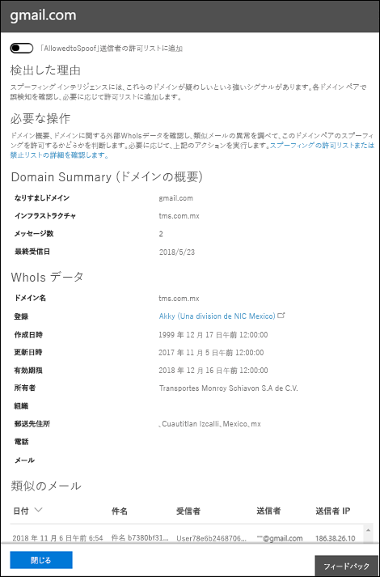

# <a name="manage-spoofed-senders-using-the-spoof-intelligence-policy-and-spoof-intelligence-insight-in-eop"></a><span data-ttu-id="14199-103">EOP でスプーフィング インテリジェンス ポリシーとスプーフィング インテリジェンスインサイトを使用してスプーフィングされた送信者を管理する</span><span class="sxs-lookup"><span data-stu-id="14199-103">Manage spoofed senders using the spoof intelligence policy and spoof intelligence insight in EOP</span></span>

[!INCLUDE [Microsoft 365 Defender rebranding](../includes/microsoft-defender-for-office.md)]

<span data-ttu-id="14199-104">**適用対象**</span><span class="sxs-lookup"><span data-stu-id="14199-104">**Applies to**</span></span>
- [<span data-ttu-id="14199-105">Microsoft Defender for Office 365 プラン 1 およびプラン 2</span><span class="sxs-lookup"><span data-stu-id="14199-105">Microsoft Defender for Office 365 plan 1 and plan 2</span></span>](defender-for-office-365.md)
- [<span data-ttu-id="14199-106">Microsoft 365 Defender</span><span class="sxs-lookup"><span data-stu-id="14199-106">Microsoft 365 Defender</span></span>](../defender/microsoft-365-defender.md)

> [!NOTE]
> <span data-ttu-id="14199-107">この記事では、置き換えられる、以前のスプーフィングされた送信者管理エクスペリエンスについて説明します。</span><span class="sxs-lookup"><span data-stu-id="14199-107">This article describes the older spoofed sender management experience that's being replaced.</span></span> <span data-ttu-id="14199-108">新しいエクスペリエンスの詳細については、「EOP のスプーフィング [インテリジェンスインサイト」を参照してください。](learn-about-spoof-intelligence.md)</span><span class="sxs-lookup"><span data-stu-id="14199-108">For more information about the new experience, see [Spoof intelligence insight in EOP](learn-about-spoof-intelligence.md)</span></span>

<span data-ttu-id="14199-109">Microsoft 365 Exchange Online またはスタンドアロン Exchange Online Protection (EOP) 組織に Exchange Online メールボックスがない組織では、受信電子メール メッセージは 2018 年 10 月現在、EOP によるスプーフィングから自動的に保護されます。</span><span class="sxs-lookup"><span data-stu-id="14199-109">In Microsoft 365 organizations with mailboxes in Exchange Online or standalone Exchange Online Protection (EOP) organizations without Exchange Online mailboxes, inbound email messages are automatically protected against spoofing by EOP as of October 2018.</span></span> <span data-ttu-id="14199-110">EOP は、 **フィッシングに** 対する組織の全体的な防御の一環としてスプーフィング インテリジェンスを使用します。</span><span class="sxs-lookup"><span data-stu-id="14199-110">EOP uses **spoof intelligence** as part of your organization's overall defense against phishing.</span></span> <span data-ttu-id="14199-111">詳細については、「EOP でのスプーフィング防止 [保護」を参照してください](anti-spoofing-protection.md)。</span><span class="sxs-lookup"><span data-stu-id="14199-111">For more information, see [Anti-spoofing protection in EOP](anti-spoofing-protection.md).</span></span>

<span data-ttu-id="14199-112">既定のスプーフィングインテリジェンス ポリシーを使用すると、正当な送信者から送信されたスプーフィングされたメールが EOP スパム フィルターに巻き込まれたり、スパムやフィッシング攻撃からユーザーを保護したりするのに役立ちます。</span><span class="sxs-lookup"><span data-stu-id="14199-112">The default (and only) **spoof intelligence policy** helps ensure that the spoofed email sent by legitimate senders doesn't get caught up in EOP spam filters while protecting your users from spam or phishing attacks.</span></span> <span data-ttu-id="14199-113">スプーフィングインテリジェンスインサイトを使用して、認証されていない電子メール (SPF、DKIM、または DMARC チェックに合格しないドメインからのメッセージ) を正当に送信している外部送信者をすばやく特定することもできます。</span><span class="sxs-lookup"><span data-stu-id="14199-113">You can also use the **Spoof intelligence insight** to quickly determine which external senders are legitimately sending you unauthenticated email (messages from domains that don't pass SPF, DKIM, or DMARC checks).</span></span>

<span data-ttu-id="14199-114">スプーフィング インテリジェンスは、セキュリティ & コンプライアンス センターまたは PowerShell (Exchange Online のメールボックスを持つ Microsoft 365 組織の Exchange Online PowerShell、Exchange Online メールボックスのない組織のスタンドアロン EOP PowerShell) で管理できます。</span><span class="sxs-lookup"><span data-stu-id="14199-114">You can manage spoof intelligence in the Security & Compliance Center, or in PowerShell (Exchange Online PowerShell for Microsoft 365 organizations with mailboxes in Exchange Online; standalone EOP PowerShell for organizations without Exchange Online mailboxes).</span></span>

## <a name="what-do-you-need-to-know-before-you-begin"></a><span data-ttu-id="14199-115">はじめに把握しておくべき情報</span><span class="sxs-lookup"><span data-stu-id="14199-115">What do you need to know before you begin?</span></span>

- <span data-ttu-id="14199-116"><https://protection.office.com/> でセキュリティ/コンプライアンス センターを開きます。</span><span class="sxs-lookup"><span data-stu-id="14199-116">You open the Security & Compliance Center at <https://protection.office.com/>.</span></span>
  - <span data-ttu-id="14199-117">スプーフィング インテリジェンス ポリシーの [スパム対策 **設定** ] ページに直接移動するには、 を使用します <https://protection.office.com/antispam> 。</span><span class="sxs-lookup"><span data-stu-id="14199-117">To go directly to the **Anti-spam settings** page for the spoof intelligence policy, use <https://protection.office.com/antispam>.</span></span>
  - <span data-ttu-id="14199-118">スプーフィング インテリジェンスの **分析情報を得** るセキュリティ ダッシュボード ページに直接移動するには、 を使用します <https://protection.office.com/searchandinvestigation/dashboard> 。</span><span class="sxs-lookup"><span data-stu-id="14199-118">To go directly to the **Security dashboard** page for the spoof intelligence insight, use <https://protection.office.com/searchandinvestigation/dashboard>.</span></span>

- <span data-ttu-id="14199-119">Exchange Online PowerShell へ接続するには、「[Exchange Online PowerShell に接続する](/powershell/exchange/connect-to-exchange-online-powershell)」を参照してください。</span><span class="sxs-lookup"><span data-stu-id="14199-119">To connect to Exchange Online PowerShell, see [Connect to Exchange Online PowerShell](/powershell/exchange/connect-to-exchange-online-powershell).</span></span> <span data-ttu-id="14199-120">スタンドアロンの EOP PowerShell に接続するには、「[Exchange Online Protection PowerShell への接続](/powershell/exchange/connect-to-exchange-online-protection-powershell)」を参照してください。</span><span class="sxs-lookup"><span data-stu-id="14199-120">To connect to standalone EOP PowerShell, see [Connect to Exchange Online Protection PowerShell](/powershell/exchange/connect-to-exchange-online-protection-powershell).</span></span>

- <span data-ttu-id="14199-121">この記事の手順を実行する際には、あらかじめ **Exchange Online** でアクセス許可を割り当てる必要があります。</span><span class="sxs-lookup"><span data-stu-id="14199-121">You need to be assigned permissions in **Exchange Online** before you can do the procedures in this article:</span></span>
  - <span data-ttu-id="14199-122">スプーフィング インテリジェンス ポリシーを変更したり、スプーフィング インテリジェンスを有効または無効にするには、組織の管理またはセキュリティ管理者の役割グループのメンバー **である** 必要があります。</span><span class="sxs-lookup"><span data-stu-id="14199-122">To modify the spoof intelligence policy or enable or disable spoof intelligence, you need to be a member of the **Organization Management** or **Security Administrator** role groups.</span></span>
  - <span data-ttu-id="14199-123">スプーフィング インテリジェンス ポリシーへの読み取り専用アクセスでは、グローバルリーダーまたはセキュリティ リーダーの役割グループのメンバー **である** 必要があります。</span><span class="sxs-lookup"><span data-stu-id="14199-123">For read-only access to the spoof intelligence policy, you need to be a member of the **Global Reader** or **Security Reader** role groups.</span></span>

  <span data-ttu-id="14199-124">詳細については、「[Exchange Online のアクセス許可](/exchange/permissions-exo/permissions-exo)」を参照してください。</span><span class="sxs-lookup"><span data-stu-id="14199-124">For more information, see [Permissions in Exchange Online](/exchange/permissions-exo/permissions-exo).</span></span>

  <span data-ttu-id="14199-125">**注**:</span><span class="sxs-lookup"><span data-stu-id="14199-125">**Notes**:</span></span>

  - <span data-ttu-id="14199-126">Microsoft 365 管理センターで、対応する Azure Active Directory の役割にユーザーを追加すると、ユーザーには、必要なアクセス許可 _および_ Microsoft 365 のその他の機能に必要なアクセス許可が付与されます。</span><span class="sxs-lookup"><span data-stu-id="14199-126">Adding users to the corresponding Azure Active Directory role in the Microsoft 365 admin center gives users the required permissions _and_ permissions for other features in Microsoft 365.</span></span> <span data-ttu-id="14199-127">詳細については、「[管理者の役割について](../../admin/add-users/about-admin-roles.md)」を参照してください。</span><span class="sxs-lookup"><span data-stu-id="14199-127">For more information, see [About admin roles](../../admin/add-users/about-admin-roles.md).</span></span>
  - <span data-ttu-id="14199-128">[Exchange Online](/Exchange/permissions-exo/permissions-exo#role-groups) の **閲覧専用の組織管理** の役割グループが この機能への読み取り専用アクセス権も付与します。</span><span class="sxs-lookup"><span data-stu-id="14199-128">The **View-Only Organization Management** role group in [Exchange Online](/Exchange/permissions-exo/permissions-exo#role-groups) also gives read-only access to the feature.</span></span>

- <span data-ttu-id="14199-129">スプーフィング インテリジェンスのオプションについては、「フィッシング対策ポリシー [のスプーフィング設定」を参照してください](set-up-anti-phishing-policies.md#spoof-settings)。</span><span class="sxs-lookup"><span data-stu-id="14199-129">The options for spoof intelligence are described in [Spoof settings in anti-phishing policies](set-up-anti-phishing-policies.md#spoof-settings).</span></span>

- <span data-ttu-id="14199-130">フィッシング対策ポリシーでスプーフィング インテリジェンス設定を有効、無効、および構成できます。</span><span class="sxs-lookup"><span data-stu-id="14199-130">You can enable, disable, and configure the spoof intelligence settings in anti-phishing policies.</span></span> <span data-ttu-id="14199-131">サブスクリプションに基づく手順については、次のいずれかのトピックを参照してください。</span><span class="sxs-lookup"><span data-stu-id="14199-131">For instructions based on your subscription, see one of the following topics:</span></span>

  - <span data-ttu-id="14199-132">[EOP でフィッシング対策ポリシーを構成します](configure-anti-phishing-policies-eop.md)。</span><span class="sxs-lookup"><span data-stu-id="14199-132">[Configure anti-phishing policies in EOP](configure-anti-phishing-policies-eop.md).</span></span>
  - <span data-ttu-id="14199-133">[Microsoft Defender でフィッシング対策ポリシーを構成して](configure-atp-anti-phishing-policies.md)、Office 365。</span><span class="sxs-lookup"><span data-stu-id="14199-133">[Configure anti-phishing policies in Microsoft Defender for Office 365](configure-atp-anti-phishing-policies.md).</span></span>

- <span data-ttu-id="14199-134">スプーフィング インテリジェンスの推奨設定については [、「EOP の既定のフィッシング対策ポリシー設定」を参照してください](recommended-settings-for-eop-and-office365.md#eop-default-anti-phishing-policy-settings)。</span><span class="sxs-lookup"><span data-stu-id="14199-134">For our recommended settings for spoof intelligence, see [EOP default anti-phishing policy settings](recommended-settings-for-eop-and-office365.md#eop-default-anti-phishing-policy-settings).</span></span>

## <a name="manage-spoofed-senders"></a><span data-ttu-id="14199-135">スプーフィングされた送信者を管理する</span><span class="sxs-lookup"><span data-stu-id="14199-135">Manage spoofed senders</span></span>

<span data-ttu-id="14199-136">スプーフィングされた送信者を許可およびブロックするには、次の 2 つの方法があります。</span><span class="sxs-lookup"><span data-stu-id="14199-136">There are two ways to allow and block spoofed senders:</span></span>

- [<span data-ttu-id="14199-137">スプーフィング インテリジェンス ポリシーの使用</span><span class="sxs-lookup"><span data-stu-id="14199-137">Use the spoof intelligence policy</span></span>](#manage-spoofed-senders-in-the-spoof-intelligence-policy)
- [<span data-ttu-id="14199-138">スプーフィング インテリジェンスの分析情報を使用する</span><span class="sxs-lookup"><span data-stu-id="14199-138">Use the spoof intelligence insight</span></span>](#manage-spoofed-senders-in-the-spoof-intelligence-insight)

### <a name="manage-spoofed-senders-in-the-spoof-intelligence-policy"></a><span data-ttu-id="14199-139">スプーフィング インテリジェンス ポリシーでスプーフィングされた送信者を管理する</span><span class="sxs-lookup"><span data-stu-id="14199-139">Manage spoofed senders in the spoof intelligence policy</span></span>

1. <span data-ttu-id="14199-140">セキュリティ/コンプライアンス センターで、**[脅威の管理]** \> **[ポリシー]** \> **[迷惑メール対策]** に移動します。</span><span class="sxs-lookup"><span data-stu-id="14199-140">In the Security & Compliance Center, go to **Threat management** \> **Policy** \> **Anti-spam**.</span></span>

2. <span data-ttu-id="14199-141">[スパム対策 **の設定] ページで、[** 展開] アイコン  プーフィング インテリジェンス ポリシー **] を展開します**。</span><span class="sxs-lookup"><span data-stu-id="14199-141">On the **Anti-spam settings** page, click  to expand **Spoof intelligence policy**.</span></span>

   

3. <span data-ttu-id="14199-143">次のいずれかの選択を行います。</span><span class="sxs-lookup"><span data-stu-id="14199-143">Make one of the following selections:</span></span>

   - <span data-ttu-id="14199-144">**新しい送信者を確認する**</span><span class="sxs-lookup"><span data-stu-id="14199-144">**Review new senders**</span></span>
   - <span data-ttu-id="14199-145">**既に確認した送信者を表示する**</span><span class="sxs-lookup"><span data-stu-id="14199-145">**Show me senders I already reviewed**</span></span>

4. <span data-ttu-id="14199-146">[表示 **されるユーザーのスプー** フィングを許可する送信者を決定する] フライアウトで、次のいずれかのタブを選択します。</span><span class="sxs-lookup"><span data-stu-id="14199-146">In the **Decide if these senders are allowed to spoof your users** flyout that appears, select one of the following tabs:</span></span>

   - <span data-ttu-id="14199-147">**[ドメイン]:** 内部ドメイン内のユーザーをスプーフィングする送信者。</span><span class="sxs-lookup"><span data-stu-id="14199-147">**Your Domains**: Senders spoofing users in your internal domains.</span></span>
   - <span data-ttu-id="14199-148">**外部ドメイン**: 外部ドメイン内のユーザーをスプーフィングする送信者。</span><span class="sxs-lookup"><span data-stu-id="14199-148">**External Domains**: Senders spoofing users in external domains.</span></span>

5. <span data-ttu-id="14199-149">[ス  許可する] **列の [展開] アイコンをクリック** します。</span><span class="sxs-lookup"><span data-stu-id="14199-149">Click  in the **Allowed to spoof?** column.</span></span> <span data-ttu-id="14199-150">ス **プーフィング** された送信者を許可するには [はい] を選択し、メッセージをスプーフィングとしてマークするには **[いいえ** ] を選択します。</span><span class="sxs-lookup"><span data-stu-id="14199-150">Choose **Yes** to allow the spoofed sender, or choose **No** to mark the message as spoofed.</span></span> <span data-ttu-id="14199-151">アクションは、既定のフィッシング対策ポリシーまたはカスタムのフィッシング対策ポリシーによって制御されます (既定値は [メッセージを迷惑メール フォルダーに移動する] **です**)。</span><span class="sxs-lookup"><span data-stu-id="14199-151">The action is controlled by the default anti-phishing policy or custom anti-phishing policies (the default value is **Move message to Junk Email folder**).</span></span> <span data-ttu-id="14199-152">詳細については、「フィッシング対策ポリシー [のスプーフィング設定」を参照してください](set-up-anti-phishing-policies.md#spoof-settings)。</span><span class="sxs-lookup"><span data-stu-id="14199-152">For more information, see [Spoof settings in anti-phishing policies](set-up-anti-phishing-policies.md#spoof-settings).</span></span>

   

   <span data-ttu-id="14199-154">表示される列と値については、次の一覧で説明します。</span><span class="sxs-lookup"><span data-stu-id="14199-154">The columns and values that you see are explained in the following list:</span></span>

   - <span data-ttu-id="14199-155">**スプーフィング** されたユーザー: スプーフィングされているユーザー アカウント。</span><span class="sxs-lookup"><span data-stu-id="14199-155">**Spoofed user**: The user account that's being spoofed.</span></span> <span data-ttu-id="14199-156">これは、メール クライアントに表示される差出人アドレス (アドレスとも呼ばれる) のメッセージ `5322.From` 送信者です。</span><span class="sxs-lookup"><span data-stu-id="14199-156">This is the message sender in the From address (also known as the `5322.From` address) that's shown in email clients.</span></span> <span data-ttu-id="14199-157">このアドレスの有効性は SPF によってチェックされません。</span><span class="sxs-lookup"><span data-stu-id="14199-157">The validity of this address is not checked by SPF.</span></span>
     - <span data-ttu-id="14199-158">[ドメイン **] タブ** で、値に 1 つの電子メール アドレスが含まれているか、送信元メール サーバーが複数のユーザー アカウントをスプーフィングしている場合は、複数のユーザー アカウントが **含まれる。**</span><span class="sxs-lookup"><span data-stu-id="14199-158">On the **Your Domains** tab, the value contains a single email address, or if the source email server is spoofing multiple user accounts, it contains **More than one**.</span></span>
     - <span data-ttu-id="14199-159">[外部 **ドメイン] タブ** の値には、完全なメール アドレスではなく、スプーフィングされたユーザーのドメインが含まれる。</span><span class="sxs-lookup"><span data-stu-id="14199-159">On the **External Domains** tab, the value contains the domain of the spoofed user, not the full email address.</span></span>

   - <span data-ttu-id="14199-160">**送信インフラストラクチャ**: 送信元電子メール サーバーの IP アドレスの逆引き DNS 参照 (PTR レコード) で見つかったドメイン。</span><span class="sxs-lookup"><span data-stu-id="14199-160">**Sending Infrastructure**: The domain found in a reverse DNS lookup (PTR record) of the source email server's IP address.</span></span> <span data-ttu-id="14199-161">送信元 IP アドレスに PTR レコードがない場合、送信インフラストラクチャは \<source IP\> /24 として識別されます (たとえば、192.168.100.100/24 など)。</span><span class="sxs-lookup"><span data-stu-id="14199-161">If the source IP address has no PTR record, then the sending infrastructure is identified as \<source IP\>/24 (for example, 192.168.100.100/24).</span></span>

     <span data-ttu-id="14199-162">メッセージ ソースとメッセージ送信者の詳細については、「電子メール メッセージ標準の概要 [」を参照してください](how-office-365-validates-the-from-address.md#an-overview-of-email-message-standards)。</span><span class="sxs-lookup"><span data-stu-id="14199-162">For more information about message sources and message senders, see [An overview of email message standards](how-office-365-validates-the-from-address.md#an-overview-of-email-message-standards).</span></span>

   - <span data-ttu-id="14199-163">**メッセージ数**: 過去 30 日以内に、指定されたスプーフィングされた送信者または送信者を含む、送信側インフラストラクチャから組織へのメッセージの数。</span><span class="sxs-lookup"><span data-stu-id="14199-163">**# of messages**: The number of messages from the sending infrastructure to your organization that contain the specified spoofed sender or senders within the last 30 days.</span></span>

   - <span data-ttu-id="14199-164">**ユーザーからの苦情の** 数 : 過去 30 日以内にこの送信者に対してユーザーが申し立てした苦情。</span><span class="sxs-lookup"><span data-stu-id="14199-164">**# of user complaints**: Complaints filed by your users against this sender within the last 30 days.</span></span> <span data-ttu-id="14199-165">苦情は通常、Microsoft への迷惑メール申請の形式です。</span><span class="sxs-lookup"><span data-stu-id="14199-165">Complaints are usually in the form of junk submissions to Microsoft.</span></span>

   - <span data-ttu-id="14199-166">**認証結果**: 次のいずれかの値を指定します。</span><span class="sxs-lookup"><span data-stu-id="14199-166">**Authentication result**: One of the following values:</span></span>
      - <span data-ttu-id="14199-167">**合格**: 送信者が送信者の電子メール認証チェック (SPF または DKIM) を渡しました。</span><span class="sxs-lookup"><span data-stu-id="14199-167">**Passed**: The sender passed sender email authentication checks (SPF or DKIM).</span></span>
      - <span data-ttu-id="14199-168">**Failed**: 送信者が EOP 送信者認証のチェックに失敗しました。</span><span class="sxs-lookup"><span data-stu-id="14199-168">**Failed**: The sender failed EOP sender authentication checks.</span></span>
      - <span data-ttu-id="14199-169">**不明**: これらのチェックの結果は不明です。</span><span class="sxs-lookup"><span data-stu-id="14199-169">**Unknown**: The result of these checks isn't known.</span></span>

   - <span data-ttu-id="14199-170">**決定セット :** 送信インフラストラクチャがユーザーのスプーフィングを許可されるユーザーを示します。</span><span class="sxs-lookup"><span data-stu-id="14199-170">**Decision set by**: Shows who determined if the sending infrastructure is allowed to spoof the user:</span></span>
       - <span data-ttu-id="14199-171">**スプーフィング インテリジェンス ポリシー** (自動)</span><span class="sxs-lookup"><span data-stu-id="14199-171">**Spoof intelligence policy** (automatic)</span></span>
       - <span data-ttu-id="14199-172">**管理者** (手動)</span><span class="sxs-lookup"><span data-stu-id="14199-172">**Admin** (manual)</span></span>

   - <span data-ttu-id="14199-173">**最後に** 表示される : スプーフィングされたユーザーを含む送信インフラストラクチャからメッセージを受信した最後の日付。</span><span class="sxs-lookup"><span data-stu-id="14199-173">**Last seen**: The last date when a message was received from the sending infrastructure that contains the spoofed user.</span></span>

   - <span data-ttu-id="14199-174">**スプーフィングを許可しますか。**: ここに表示される値は次のとおりです。</span><span class="sxs-lookup"><span data-stu-id="14199-174">**Allowed to spoof?**: The values that you see here are:</span></span>
     - <span data-ttu-id="14199-175">**は** い : スプーフィングされたユーザーと送信インフラストラクチャの組み合わせからのメッセージは許可され、スプーフィングされた電子メールとして扱われるのではありません。</span><span class="sxs-lookup"><span data-stu-id="14199-175">**Yes**: Messages from the combination of spoofed user and sending infrastructure are allowed and not treated as spoofed email.</span></span>
     - <span data-ttu-id="14199-176">**いいえ**: スプーフィングされたユーザーと送信インフラストラクチャの組み合わせからのメッセージは、スプーフィングとしてマークされます。</span><span class="sxs-lookup"><span data-stu-id="14199-176">**No**: Messages from the combination of spoofed user and sending infrastructure are marked as spoofed.</span></span> <span data-ttu-id="14199-177">アクションは、既定のフィッシング対策ポリシーまたはカスタムのフィッシング対策ポリシーによって制御されます (既定値は [メッセージを迷惑メール フォルダーに移動する] **です**)。</span><span class="sxs-lookup"><span data-stu-id="14199-177">The action is controlled by the default anti-phishing policy or custom anti-phishing policies (the default value is **Move message to Junk Email folder**).</span></span> <span data-ttu-id="14199-178">詳細については、次のセクションを参照してください。</span><span class="sxs-lookup"><span data-stu-id="14199-178">See the next section for more information.</span></span>

     - <span data-ttu-id="14199-179">**一部** のユーザー (**[ドメイン** ] タブのみ): 送信インフラストラクチャは複数のユーザーをスプーフィングしています。スプーフィングされたユーザーの中には許可されているユーザーと許可されていないユーザーがあります。</span><span class="sxs-lookup"><span data-stu-id="14199-179">**Some users** (**Your Domains** tab only): A sending infrastructure is spoofing multiple users, where some spoofed users are allowed and others are not.</span></span> <span data-ttu-id="14199-180">[詳細] **タブを使用** して、特定のアドレスを表示します。</span><span class="sxs-lookup"><span data-stu-id="14199-180">Use the **Detailed** tab to see the specific addresses.</span></span>

6. <span data-ttu-id="14199-181">ページの下部にある [**保存**] をクリックします。</span><span class="sxs-lookup"><span data-stu-id="14199-181">At the bottom of the page, click **Save**.</span></span>

#### <a name="use-powershell-to-manage-spoofed-senders"></a><span data-ttu-id="14199-182">PowerShell を使用してスプーフィングされた送信者を管理する</span><span class="sxs-lookup"><span data-stu-id="14199-182">Use PowerShell to manage spoofed senders</span></span>

<span data-ttu-id="14199-183">スプーフィング インテリジェンスで許可送信者とブロック送信者を表示するには、次の構文を使用します。</span><span class="sxs-lookup"><span data-stu-id="14199-183">To view allowed and blocked senders in spoof intelligence, use the following syntax:</span></span>

```powershell
Get-PhishFilterPolicy [-AllowedToSpoof <Yes | No | Partial>] [-ConfidenceLevel <Low | High>] [-DecisionBy <Admin | SpoofProtection>] [-Detailed] [-SpoofType <Internal | External>]
```

<span data-ttu-id="14199-184">この例では、ドメイン内のユーザーをスプーフィングできるすべての送信者に関する詳細情報を返します。</span><span class="sxs-lookup"><span data-stu-id="14199-184">This example returns detailed information about all senders that are allowed to spoof users in your domains.</span></span>

```powershell
Get-PhishFilterPolicy -AllowedToSpoof Yes -Detailed -SpoofType Internal
```

<span data-ttu-id="14199-185">構文とパラメーターの詳細については [、「Get-PhishFilterPolicy」を参照してください](/powershell/module/exchange/get-phishfilterpolicy)。</span><span class="sxs-lookup"><span data-stu-id="14199-185">For detailed syntax and parameter information, see [Get-PhishFilterPolicy](/powershell/module/exchange/get-phishfilterpolicy).</span></span>

<span data-ttu-id="14199-186">スプーフィング インテリジェンスで許可送信者とブロック送信者を構成するには、次の手順を実行します。</span><span class="sxs-lookup"><span data-stu-id="14199-186">To configure allowed and blocked senders in spoof intelligence, follow these steps:</span></span>

1. <span data-ttu-id="14199-187">次のコマンドを実行して **、Get-PhishFilterPolicy** コマンドレットの出力を CSV ファイルに書き込み、検出されたスプーフィングされた送信者の現在のリストをキャプチャします。</span><span class="sxs-lookup"><span data-stu-id="14199-187">Capture the current list of detected spoofed senders by writing the output of the **Get-PhishFilterPolicy** cmdlet to a CSV file by running the following command:</span></span>

   ```powershell
   Get-PhishFilterPolicy -Detailed | Export-CSV "C:\My Documents\Spoofed Senders.csv"
   ```

2. <span data-ttu-id="14199-188">CSV ファイルを編集して、次の値を追加または変更します。</span><span class="sxs-lookup"><span data-stu-id="14199-188">Edit the CSV file to add or modify the following values:</span></span>
   - <span data-ttu-id="14199-189">**送信者** (ソース サーバーの PTR レコードまたは IP/24 アドレスのドメイン)</span><span class="sxs-lookup"><span data-stu-id="14199-189">**Sender** (domain in source server's PTR record or IP/24 address)</span></span>
   - <span data-ttu-id="14199-190">**スプーフィングユーザー**: 次のいずれかの値を指定します。</span><span class="sxs-lookup"><span data-stu-id="14199-190">**SpoofedUser**: One of the following values:</span></span>
     - <span data-ttu-id="14199-191">内部ユーザーの電子メール アドレス。</span><span class="sxs-lookup"><span data-stu-id="14199-191">The internal user's email address.</span></span>
     - <span data-ttu-id="14199-192">外部ユーザーのメール ドメイン。</span><span class="sxs-lookup"><span data-stu-id="14199-192">The external user's email domain.</span></span>
     - <span data-ttu-id="14199-193">スプーフィングされた電子メール アドレスに関係なく、指定された **送信者** からのスプーフィングされたメッセージをブロックまたは許可する場合を示す空白の値。</span><span class="sxs-lookup"><span data-stu-id="14199-193">A blank value that indicates you want to block or allow any and all spoofed messages from the specified **Sender**, regardless of the spoofed email address.</span></span>
   - <span data-ttu-id="14199-194">**AllowedToSpoof** (Yes または No)</span><span class="sxs-lookup"><span data-stu-id="14199-194">**AllowedToSpoof** (Yes or No)</span></span>
   - <span data-ttu-id="14199-195">**スプーフィングの** 種類 (内部または外部)</span><span class="sxs-lookup"><span data-stu-id="14199-195">**SpoofType** (Internal or External)</span></span>

   <span data-ttu-id="14199-196">ファイルを保存し、ファイルを読み取り、次のコマンドを実行して名前を付けられた変数 `$UpdateSpoofedSenders` として格納します。</span><span class="sxs-lookup"><span data-stu-id="14199-196">Save the file, read the file, and store the contents as a variable named `$UpdateSpoofedSenders` by running the following command:</span></span>

   ```powershell
   $UpdateSpoofedSenders = Get-Content -Raw "C:\My Documents\Spoofed Senders.csv"
   ```

3. <span data-ttu-id="14199-197">変数を `$UpdateSpoofedSenders` 使用して、次のコマンドを実行してスプーフィング インテリジェンス ポリシーを構成します。</span><span class="sxs-lookup"><span data-stu-id="14199-197">Use the `$UpdateSpoofedSenders` variable to configure the spoof intelligence policy by running the following command:</span></span>

   ```powershell
   Set-PhishFilterPolicy -Identity Default -SpoofAllowBlockList $UpdateSpoofedSenders
   ```

<span data-ttu-id="14199-198">構文とパラメーターの詳細については [、「Set-PhishFilterPolicy」を参照してください](/powershell/module/exchange/set-phishfilterpolicy)。</span><span class="sxs-lookup"><span data-stu-id="14199-198">For detailed syntax and parameter information, see [Set-PhishFilterPolicy](/powershell/module/exchange/set-phishfilterpolicy).</span></span>

### <a name="manage-spoofed-senders-in-the-spoof-intelligence-insight"></a><span data-ttu-id="14199-199">スプーフィング インテリジェンスインサイトでスプーフィングされた送信者を管理する</span><span class="sxs-lookup"><span data-stu-id="14199-199">Manage spoofed senders in the spoof intelligence insight</span></span>

1. <span data-ttu-id="14199-200">セキュリティ コンプライアンス センターで&管理ダッシュボード **に移動** \> **します**。</span><span class="sxs-lookup"><span data-stu-id="14199-200">In the Security & Compliance Center, go to **Threat Management** \> **Dashboard**.</span></span>

2. <span data-ttu-id="14199-201">**[Insights] 行** で、次のいずれかの項目を探します。</span><span class="sxs-lookup"><span data-stu-id="14199-201">In the **Insights** row, look for one of the following items:</span></span>

   - <span data-ttu-id="14199-202">**過去 7 日間に** スプーフィングされたドメインの可能性が高い : この分析情報は、スプーフィング インテリジェンスが有効になっている (既定で有効になっている) かどうかを示します。</span><span class="sxs-lookup"><span data-stu-id="14199-202">**Likely spoofed domains over the past seven days**: This insight indicates that spoof intelligence is enabled (it's enabled by default).</span></span>
   - <span data-ttu-id="14199-203">**スプーフィング保護** を有効にする: この分析情報は、スプーフィング インテリジェンスが無効になっていると示し、その分析情報をクリックするとスプーフィング インテリジェンスを有効にすることができます。</span><span class="sxs-lookup"><span data-stu-id="14199-203">**Enable Spoof Protection**: This insight indicates that spoof intelligence is disabled, and clicking on the insight allows you to enable spoof intelligence.</span></span>

3. <span data-ttu-id="14199-204">ダッシュボードの分析情報には、次のような情報が表示されます。</span><span class="sxs-lookup"><span data-stu-id="14199-204">The insight on the dashboard shows you information like this:</span></span>

   

   <span data-ttu-id="14199-206">この分析情報には、次の 2 つのモードがあります。</span><span class="sxs-lookup"><span data-stu-id="14199-206">This insight has two modes:</span></span>

   - <span data-ttu-id="14199-207">**インサイト モード**: スプーフィング インテリジェンスが有効になっている場合、過去 7 日間にスプーフィング インテリジェンス機能によって影響を受けるメッセージの数がインサイトに表示されます。</span><span class="sxs-lookup"><span data-stu-id="14199-207">**Insight mode**: If spoof intelligence is enabled, the insight shows you how many messages were impacted by our spoof intelligence capabilities over the past seven days.</span></span>
   - <span data-ttu-id="14199-208">**If モード**: スプーフィング インテリジェンスが無効になっている場合、この分析情報は、過去 7 日間にスプーフィング インテリジェンス機能によって影響を受けるメッセージの数を示します。</span><span class="sxs-lookup"><span data-stu-id="14199-208">**What if mode**: If spoof intelligence is disabled, then the insight shows you how many messages *would* have been impacted by our spoof intelligence capabilities over the past seven days.</span></span>

   <span data-ttu-id="14199-209">いずれの場合も、インサイトに表示されるスプーフィングされたドメインは、疑わしいドメインと疑わしいドメイン以外の 2 つのカテゴリ **に分けられます**。</span><span class="sxs-lookup"><span data-stu-id="14199-209">Either way, the spoofed domains displayed in the insight are separated into two categories: **Suspicious domains** and **Non-suspicious domains**.</span></span>

   - <span data-ttu-id="14199-210">**疑わしいドメイン**:</span><span class="sxs-lookup"><span data-stu-id="14199-210">**Suspicious domains**:</span></span>
     - <span data-ttu-id="14199-211">**高** 信頼スプーフィング : ドメインの過去の送信パターンと評判スコアに基づいて、ドメインがスプーフィングを行い、これらのドメインからのメッセージが悪意のある可能性が高いという確信が強いです。</span><span class="sxs-lookup"><span data-stu-id="14199-211">**High-confidence spoof**: Based on the historical sending patterns and the reputation score of the domains, we're highly confident that the domains are spoofing, and messages from these domains are more likely to be malicious.</span></span>
     - <span data-ttu-id="14199-212">**中程度** の信頼度のスプーフィング: 過去の送信パターンとドメインの評判スコアに基づいて、ドメインがスプーフィングを行い、これらのドメインから送信されるメッセージが正当であると適度に確信しています。</span><span class="sxs-lookup"><span data-stu-id="14199-212">**Moderate confidence spoof**: Based on historical sending patterns and the reputation score of the domains, we're moderately confident that the domains are spoofing, and that messages sent from these domains are legitimate.</span></span> <span data-ttu-id="14199-213">誤検知は、高信頼スプーフィングよりもこのカテゴリに含まれる可能性が高いです。</span><span class="sxs-lookup"><span data-stu-id="14199-213">False positives are more likely in this category than high-confidence spoof.</span></span>
   - <span data-ttu-id="14199-214">**疑わしいドメイン以外**: ドメインで明示的な電子メール認証が [失敗し、SPF、DKIM、](how-office-365-uses-spf-to-prevent-spoofing.md)および DMARC が [チェックされます](use-dmarc-to-validate-email.md)。 [](use-dkim-to-validate-outbound-email.md)</span><span class="sxs-lookup"><span data-stu-id="14199-214">**Non-suspicious domains**: The domain failed explicit email authentication checks [SPF](how-office-365-uses-spf-to-prevent-spoofing.md), [DKIM](use-dkim-to-validate-outbound-email.md), and [DMARC](use-dmarc-to-validate-email.md)).</span></span> <span data-ttu-id="14199-215">ただし、ドメインは暗黙的な電子メール認証チェック (複合認証)[に合格しました](email-validation-and-authentication.md#composite-authentication)。</span><span class="sxs-lookup"><span data-stu-id="14199-215">However, the domain passed our implicit email authentication checks ([composite authentication](email-validation-and-authentication.md#composite-authentication)).</span></span> <span data-ttu-id="14199-216">その結果、メッセージに対してスプーフィング対策アクションは実行されません。</span><span class="sxs-lookup"><span data-stu-id="14199-216">As a result, no anti-spoofing action was taken on the message.</span></span>

#### <a name="view-detailed-information-about-suspicious-and-nonsuspicious-domains"></a><span data-ttu-id="14199-217">疑わしいドメインと非疑わしいドメインに関する詳細情報を表示する</span><span class="sxs-lookup"><span data-stu-id="14199-217">View detailed information about suspicious and nonsuspicious domains</span></span>

1. <span data-ttu-id="14199-218">スプーフィング インテリジェンスの分析情報で、[疑 **わしい** ドメイン] または [不審でないドメイン] をクリックして、[スプーフィング インテリジェンスの分析情報]**ページに移動** します。</span><span class="sxs-lookup"><span data-stu-id="14199-218">On the Spoof intelligence insight, click **Suspicious domains** or **Non-suspicious domains** to go to the **Spoof intelligence insight** page.</span></span> <span data-ttu-id="14199-219">ス **プーフィング インテリジェンスの分析** 情報ページには、次の情報が含まれます。</span><span class="sxs-lookup"><span data-stu-id="14199-219">The **Spoof Intelligence insight** page contains the following information:</span></span>

   - <span data-ttu-id="14199-220">**スプーフィング** されたドメイン: メール クライアントの [From] ボックスに表示されるスプーフィング **された** ユーザーのドメイン。</span><span class="sxs-lookup"><span data-stu-id="14199-220">**Spoofed domain**: The domain of the spoofed user that's displayed in the **From** box in email clients.</span></span> <span data-ttu-id="14199-221">このアドレスは、アドレスとも呼 `5322.From` ばれる。</span><span class="sxs-lookup"><span data-stu-id="14199-221">This address is also known as the `5322.From` address.</span></span>
   - <span data-ttu-id="14199-222">**インフラストラクチャ**: 送信インフラストラクチャ _とも呼ばれる_。</span><span class="sxs-lookup"><span data-stu-id="14199-222">**Infrastructure**: Also known as the _sending infrastructure_.</span></span> <span data-ttu-id="14199-223">送信元電子メール サーバーの IP アドレスの逆引き DNS 参照 (PTR レコード) で見つかったドメイン。</span><span class="sxs-lookup"><span data-stu-id="14199-223">The domain found in a reverse DNS lookup (PTR record) of the source email server's IP address.</span></span> <span data-ttu-id="14199-224">送信元 IP アドレスに PTR レコードがない場合、送信インフラストラクチャは \<source IP\> /24 として識別されます (たとえば、192.168.100.100/24 など)。</span><span class="sxs-lookup"><span data-stu-id="14199-224">If the source IP address has no PTR record, then the sending infrastructure is identified as \<source IP\>/24 (for example, 192.168.100.100/24).</span></span>
   - <span data-ttu-id="14199-225">**メッセージ数**: 過去 7 日以内に、指定されたスプーフィングされたドメインを含む送信インフラストラクチャから組織へのメッセージの数。</span><span class="sxs-lookup"><span data-stu-id="14199-225">**Message count**: The number of messages from the sending infrastructure to your organization that contain the specified spoofed domain within the last 7 days.</span></span>
   - <span data-ttu-id="14199-226">**最後に** 表示される : スプーフィングされたドメインを含む送信インフラストラクチャからメッセージを受信した最後の日付。</span><span class="sxs-lookup"><span data-stu-id="14199-226">**Last seen**: The last date when a message was received from the sending infrastructure that contains the spoofed domain.</span></span>
   - <span data-ttu-id="14199-227">**スプーフィングの** 種類 : この値は **外部です**。</span><span class="sxs-lookup"><span data-stu-id="14199-227">**Spoof type**: This value is **External**.</span></span>
   - <span data-ttu-id="14199-228">**スプーフィングを許可しますか。**: ここに表示される値は次のとおりです。</span><span class="sxs-lookup"><span data-stu-id="14199-228">**Allowed to spoof?**: The values that you see here are:</span></span>
     - <span data-ttu-id="14199-229">**は** い : スプーフィングされたユーザーのドメインと送信インフラストラクチャの組み合わせからのメッセージは許可され、スプーフィングされた電子メールとして扱われるのではありません。</span><span class="sxs-lookup"><span data-stu-id="14199-229">**Yes**: Messages from the combination of spoofed user's domain and sending infrastructure are allowed and not treated as spoofed email.</span></span>
     - <span data-ttu-id="14199-230">**いいえ**: スプーフィングされたユーザーのドメインと送信インフラストラクチャの組み合わせからのメッセージは、スプーフィングとしてマークされます。</span><span class="sxs-lookup"><span data-stu-id="14199-230">**No**: Messages from the combination of spoofed user's domain and sending infrastructure are marked as spoofed.</span></span> <span data-ttu-id="14199-231">アクションは、既定のフィッシング対策ポリシーまたはカスタムのフィッシング対策ポリシーによって制御されます (既定値は [メッセージを迷惑メール フォルダーに移動する] **です**)。</span><span class="sxs-lookup"><span data-stu-id="14199-231">The action is controlled by the default anti-phishing policy or custom anti-phishing policies (the default value is **Move message to Junk Email folder**).</span></span>

2. <span data-ttu-id="14199-232">リスト内のアイテムを選択して、フライアウトのドメイン/送信インフラストラクチャ ペアに関する詳細を表示します。</span><span class="sxs-lookup"><span data-stu-id="14199-232">Select an item in the list to view details about the domain/sending infrastructure pair in a flyout.</span></span> <span data-ttu-id="14199-233">この情報には、次の情報が含まれます。</span><span class="sxs-lookup"><span data-stu-id="14199-233">The information includes:</span></span>
   - <span data-ttu-id="14199-234">なぜこれをキャッチしたのか。</span><span class="sxs-lookup"><span data-stu-id="14199-234">Why we caught this.</span></span>
   - <span data-ttu-id="14199-235">何をする必要があります。</span><span class="sxs-lookup"><span data-stu-id="14199-235">What you need to do.</span></span>
   - <span data-ttu-id="14199-236">ドメインの概要。</span><span class="sxs-lookup"><span data-stu-id="14199-236">A domain summary.</span></span>
   - <span data-ttu-id="14199-237">送信者に関する WhoIs データ。</span><span class="sxs-lookup"><span data-stu-id="14199-237">WhoIs data about the sender.</span></span>
   - <span data-ttu-id="14199-238">テナントで同じ送信者から見た同様のメッセージ。</span><span class="sxs-lookup"><span data-stu-id="14199-238">Similar messages we have seen in your tenant from the same sender.</span></span>

   <span data-ttu-id="14199-239">ここから、[送信者のスプーフィングを許可する] 一覧からドメイン/送信インフラストラクチャのペアを追加または削除できます。</span><span class="sxs-lookup"><span data-stu-id="14199-239">From here, you can also choose to add or remove the domain/sending infrastructure pair from the **Allowed to spoof** sender allow list.</span></span> <span data-ttu-id="14199-240">単にトグルを設定します。</span><span class="sxs-lookup"><span data-stu-id="14199-240">Simply set the toggle accordingly.</span></span>

   

## <a name="how-do-you-know-these-procedures-worked"></a><span data-ttu-id="14199-242">正常な動作を確認する方法</span><span class="sxs-lookup"><span data-stu-id="14199-242">How do you know these procedures worked?</span></span>

<span data-ttu-id="14199-243">スプーフィングが許可され、スプーフィングが許可されていない送信者とスプーフィング インテリジェンスが構成されていることを確認するには、次の手順を使用します。</span><span class="sxs-lookup"><span data-stu-id="14199-243">To verify that you've configured spoof intelligence with senders who are allowed and not allowed to spoof, use any of the following steps:</span></span>

- <span data-ttu-id="14199-244">セキュリティ & コンプライアンス センターで、[脅威管理ポリシースパム対策] [スプーフィング インテリジェンス ポリシー] の [送信者を表示する] を選択し、[ドメインまたは外部ドメイン] タブを選択し、送信者の [スプーフィングを許可する \>  \>  \>  \>  \> **]** 値を確認します。</span><span class="sxs-lookup"><span data-stu-id="14199-244">In the Security & Compliance Center, go to **Threat management** \> **Policy** \> **Anti-spam** \> expand **Spoof intelligence policy** \> select **Show me senders I already reviewed** \> select the **Your Domains** or **External Domains** tab, and verify the **Allowed to spoof?** value for the sender.</span></span>

- <span data-ttu-id="14199-245">PowerShell で、次のコマンドを実行して、スプーフィングが許可されている送信者とスプーフィングが許可されていない送信者を表示します。</span><span class="sxs-lookup"><span data-stu-id="14199-245">In PowerShell, run the following commands to view the senders who are allowed and not allowed to spoof:</span></span>

  ```powershell
  Get-PhishFilterPolicy -AllowedToSpoof Yes -SpoofType Internal
  Get-PhishFilterPolicy -AllowedToSpoof No -SpoofType Internal
  Get-PhishFilterPolicy -AllowedToSpoof Yes -SpoofType External
  Get-PhishFilterPolicy -AllowedToSpoof No -SpoofType External
  ```

- <span data-ttu-id="14199-246">PowerShell で、次のコマンドを実行して、すべてのスプーフィングされた送信者の一覧を CSV ファイルにエクスポートします。</span><span class="sxs-lookup"><span data-stu-id="14199-246">In PowerShell, run the following command to export the list of all spoofed senders to a CSV file:</span></span>

   ```powershell
   Get-PhishFilterPolicy -Detailed | Export-CSV "C:\My Documents\Spoofed Senders.csv"
   ```
