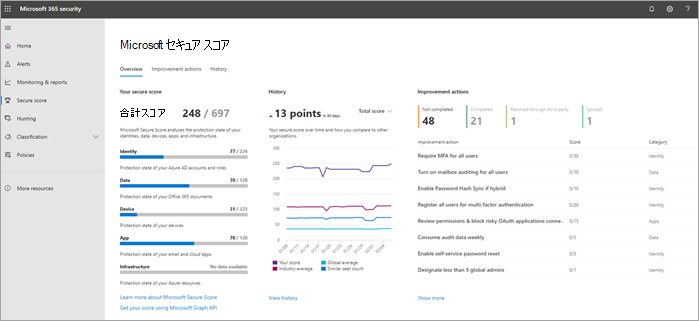

# 自宅での作業をサポートするセキュリティ チームの上位 12 のタスク

Microsoft と同じ [で](https://www.microsoft.com/microsoft-365/blog/2020/03/10/staying-productive-while-working-remotely-with-microsoft-teams/) 、主にホーム ベースの従業員をサポートしている場合は、組織が可能な限り安全に作業を行うお手伝いをしたいと考えています。 この記事では、セキュリティ チームが最も重要なセキュリティ機能を可能な限り迅速に実装するためにタスクの優先順位を設定します。

Microsoft のビジネス プランのいずれかを使用している小規模または中規模の組織の場合は、代わりに次のリソースを参照してください。

- [ビジネス プランのセキュリティとセキュリティをOffice 365するMicrosoft 365トップ 10](../admin/security-and-compliance/secure-your-business-data.md)
- [Microsoft 365キャンペーン (ビジネス](../business-premium/index.md)向け推奨セキュリティ構成Microsoft 365含む)

Microsoft のエンタープライズ プランを使用しているお客様は、サービス プランに適用される次の表に示すタスクを完了してください。 エンタープライズ プランを購入する代Microsoft 365サブスクリプションを組み合わせる場合は、次の点に注意してください。

- Microsoft 365 E3には、Enterprise Mobility + Security (EMS) E3 および Azure AD P1 が含まれます
- Microsoft 365 E5 EMS E5 と P2 Azure AD含まれています

****

|手順|タスク|すべてのOffice 365 Enterpriseプラン|Microsoft 365 E3|Microsoft 365 E5|
|---|---|---|---|---|
|1|[多要素Azure AD認証 (MFA) を有効にする](#1-enable-azure-ad-multi-factor-authentication-mfa)||||
|2|[脅威からの保護](#2-protect-against-threats)||||
|3|[Microsoft Defender for Office 365](#3-configure-microsoft-defender-for-office-365)||||
|4|[Id の Microsoft Defender を構成する](#4-configure-microsoft-defender-for-identity)||||
|5|[Microsoft 365 Defender を有効にする](#5-turn-on-microsoft-365-defender)||||
|6 |[電話とタブレットの Intune モバイル アプリ保護を構成する](#6-configure-intune-mobile-app-protection-for-phones-and-tablets)||||
|7 |[Intune アプリ保護を含む、ゲストの MFA と条件付きアクセスを構成する](#7-configure-mfa-and-conditional-access-for-guests-including-intune-mobile-app-protection)||||
|8 |[デバイス管理に PC を登録し、準拠している PC を必要とする](#8-enroll-pcs-into-device-management-and-require-compliant-pcs)||||
|9 |[クラウド接続のためにネットワークを最適化する](#9-optimize-your-network-for-cloud-connectivity)||||
|10|[ユーザーのトレーニング](#10-train-users)||||
|11|[Microsoft Defender for Cloud Apps の使用を開始する](#11-get-started-with-microsoft-defender-for-cloud-apps)||||
|12 |[脅威を監視し、アクションを実行する](#12-monitor-for-threats-and-take-action)||||
|

開始する前に、ポータル[Microsoft 365で](./defender/microsoft-secure-score.md)セキュリティで保護されたスコアを<a href="https://go.microsoft.com/fwlink/p/?linkid=2077139" target="_blank">Microsoft 365 Defenderしてください</a>。 一元化されたダッシュボードから、ID、データ、アプリ、デバイス、インフラストラクチャMicrosoft 365のセキュリティを監視および改善できます。 推奨されるセキュリティ機能を構成したり、セキュリティ関連のタスク (レポートの表示など) を実行したり、サードパーティのアプリケーションやソフトウェアを使用して推奨事項に対処したりするためのポイントが与えられる。 この記事で推奨されるタスクは、スコアを上げるとします。

## 1: 多要素Azure AD認証 (MFA) を有効にする

自宅で働く従業員のセキュリティを向上させるためにできる唯一の最善の方法は、MFA を有効にすることです。 プロセスをまだ実施していない場合は、これを緊急パイロットとして扱い、立ち往生する従業員をサポートする準備ができていることを確認してください。 ハードウェア セキュリティ デバイスを配布できない可能性が高い場合は、Windows Hello生体認証やスマートフォン認証アプリを使用Microsoft Authenticator。

通常、多要素認証にデバイスを登録してから MFA を要求する前に、ユーザーに 14 日間の登録を与える必要があります。 ただし、従業員が突然自宅で作業している場合は、セキュリティの優先事項として MFA を要求し、必要なユーザーを支援する準備をしてください。

これらのポリシーの適用には数分しかかからなく、今後数日間ユーザーをサポートする準備が必要です。

****

|計画|推奨事項|
|---|---|
|Microsoft 365プラン (P1 または P2 Azure ADなし)|[Azure AD でセキュリティの既定値を有効にします](/azure/active-directory/fundamentals/concept-fundamentals-security-defaults)。 Azure AD のセキュリティの既定値には、ユーザーと管理者用の MFA が含まれています。|
|Microsoft 365 E3 (P1 Azure AD付き)|[一般的な条件付きアクセス ポリシー](/azure/active-directory/conditional-access/concept-conditional-access-policy-common)を使用して、次のポリシーを構成します。  - [管理者に MFA を要求する](/azure/active-directory/conditional-access/howto-conditional-access-policy-admin-mfa)  - [すべてのユーザーに MFA を要求する](/azure/active-directory/conditional-access/howto-conditional-access-policy-all-users-mfa)   - [従来の認証をブロックする](/azure/active-directory/conditional-access/howto-conditional-access-policy-block-legacy)|
|Microsoft 365 E5 (P2 Azure AD付き)|Id Protection のAzure AD、次のポリシーを作成して、Microsoft の推奨される条件付きアクセスポリシーと関連ポリシーの実装を開始します。  - [サインインのリスクが中、または高のときに MFA を要求する](./office-365-security/identity-access-policies.md#require-mfa-based-on-sign-in-risk)  - [先進認証をサポートしないクライアントはブロックする](./office-365-security/identity-access-policies.md#block-clients-that-dont-support-multi-factor) - [高リスク ユーザーはパスワードを変更する必要がある](./office-365-security/identity-access-policies.md#high-risk-users-must-change-password)|
|

## 2: 脅威から保護する

すべてのMicrosoft 365には、さまざまな脅威保護機能が含まれます。 これらの機能の保護を強化するには、わずか数分かかります。

- マルウェア対策保護
- 悪意のある URL とファイルからの保護
- フィッシング対策保護
- スパム対策保護

開始[点として使用できるガイダンスについては](office-365-security/protect-against-threats.md)、「Office 365の脅威から保護する」を参照してください。

## 3: Microsoft Defender for Office 365

Microsoft 365 E5 および Office 365 E5 に含まれる Microsoft Defender for Office 365 は、電子メール メッセージ、リンク (URL)、およびコラボレーション ツールによる悪意のある脅威から組織を保護します。 構成には数時間かかる場合があります。

Microsoft Defender for Office 365:

- 悪意のあるコンテンツの添付ファイルとリンクを検査するインテリジェント システムを使用して、組織を未知の電子メールの脅威からリアルタイムで保護します。 これらの自動化システムには、堅牢なデトレーション プラットフォーム、ヒューリスティック、機械学習モデルが含まれます。
- チーム サイトとドキュメント ライブラリ内の悪意のあるファイルを識別してブロックすることで、ユーザーがファイルを共同作業および共有するときに組織を保護します。
- 機械学習モデルと高度な偽装検出アルゴリズムをフィッシング攻撃の回避に適用します。

プランの概要を含む概要については、「[Defender for Office 365」 を参照してください](./office-365-security/defender-for-office-365.md)。

グローバル管理者は、次の保護を構成できます。

- [安全なリンク ポリシーを設定する](office-365-security/set-up-safe-links-policies.md)
- [リンクのグローバル設定をセーフする](office-365-security/configure-global-settings-for-safe-links.md)
- [安全な添付ファイル機能のポリシーを設定する](office-365-security/set-up-safe-attachments-policies.md)

次のワークロード用に Defender を構成するには、Exchange Online管理者とオンライン管理者SharePoint作業を行Office 365必要があります。

- [Microsoft Defender for Endpoint for SharePoint、OneDrive、Microsoft Teams](office-365-security/mdo-for-spo-odb-and-teams.md)

## 4: Id の Microsoft Defender を構成する

[Microsoft Defender for Identity](/azure-advanced-threat-protection/what-is-atp) はクラウドベースのセキュリティ ソリューションであり、オンプレミスの Active Directory のシグナルを活用して、組織に対する高度な脅威、ID の漏えい、内部関係者の不正な行動を特定、検出、調査します。 オンプレムとクラウド インフラストラクチャを保護し、依存関係や前提条件を持たないので、この次に重点を置き、すぐに利益を得る可能性があります。

- セットアップ [を迅速に行う方法については、「Microsoft Defender for Identity Quickstarts](/azure-advanced-threat-protection/install-atp-step1) 」を参照してください。
- ビデオ [を見る: Id 用 Microsoft Defender の概要](https://www.youtube.com/watch?reload=9&v=EGY2m8yU_KE)
- [Microsoft Defender for Identity 展開の 3 つのフェーズを確認する](/azure-advanced-threat-protection/what-is-atp#whats-next)

## 5: 電源を入Microsoft 365 Defender

Microsoft Defender for Office 365および Microsoft Defender for Identity が構成されたので、これらの機能からの結合された信号を 1 つのダッシュボードで表示できます。 [Microsoft 365 Defender では](./defender/microsoft-365-defender.md)、アラート、インシデント、自動調査と応答、およびワークロード全体の高度な検索 (Microsoft Defender for Identity、Defender for Office 365、Microsoft Defender for Endpoint、Microsoft Defender for Cloud Apps) を、Microsoft 365 Defender の 1 つのウィンドウにまとめます。<a href="https://go.microsoft.com/fwlink/p/?linkid=2077139" target="_blank">ポータル</a>。

すべてのサービス用に 1 つ以上の Defender を構成したOffice 365 MTP を有効にしてください。 新しい機能は、MTP に継続的に追加されます。プレビュー機能の受信をオプトインすることを検討してください。

- [MTP の詳細](./defender/microsoft-365-defender.md)
- [MTP を有効にする](./defender/m365d-enable.md)
- [プレビュー機能をオプトインする](./defender/preview.md)

## 6: 電話とタブレットの Intune モバイル アプリ保護を構成する

Microsoft Intune アプリケーション管理 (MAM) を使用すると、これらのデバイスを管理することなく、電話やタブレット上の組織のデータを管理および保護できます。 次に、動作のしくみを示します。

- アプリ保護ポリシー (APP) を作成し、デバイス上でどのアプリを管理し、どのような動作を許可できるのかを決定します (管理アプリのデータが管理されていないアプリにコピーされるのを防ぐなど)。 プラットフォームごとに 1 つのポリシー (iOS、Android) を作成します。
- アプリ保護ポリシーを作成した後、承認済みアプリと APP データ保護を要求する条件付きアクセス Azure ADを作成して、これらを適用します。

APP 保護ポリシーには、多くの設定が含まれます。 幸いなことに、すべての設定について学び、オプションの重さを量る必要はもうない。 Microsoft では、開始点を推奨することで、設定の構成を簡単に適用できます。 アプリ [保護ポリシーを使用するデータ保護フレームワークには、](/mem/intune/apps/app-protection-framework) 3 つのレベルから選択できます。

さらに、Microsoft は、このアプリ保護フレームワークを条件付きアクセスと関連ポリシーのセットと調整し、すべての組織が開始点として使用することをお勧めします。 この記事のガイダンスを使用して MFA を実装した場合は、半端です。

モバイル アプリ保護を構成するには、「共通 ID とデバイス アクセス ポリシー」 [のガイダンスを使用します](./office-365-security/identity-access-policies.md)。

 1. iOS [および Android 用のポリシーを作成するには、 アプリデータ保護ポリシーの適用] ガイダンスを使用します。 ベースライン保護には、レベル 2 (拡張データ保護) をお勧めします。
 2. [承認済みアプリと APP 保護を要求 [する] に条件付きアクセス ルールを作成します](./office-365-security/identity-access-policies.md#require-approved-apps-and-app-protection)。

## 7: Intune モバイル アプリ保護を含む、ゲストの MFA と条件付きアクセスを構成する

次に、引き続きゲストと共同作業を行って作業できます。 ユーザープランを使用Microsoft 365 E3、すべてのユーザーに MFA を実装している場合は、設定します。

Microsoft 365 E5 プランを使用し、リスクベースの MFA に Azure Identity Protection を利用する場合は、いくつかの調整を行う必要があります (Azure AD Identity protection はゲストにまで及ばないので)。

- ゲストと外部ユーザーに常に MFA を要求する新しい条件付きアクセス ルールを作成します。
- リスクベースの MFA 条件付きアクセス ルールを更新して、ゲストと外部ユーザーを除外します。

ゲスト アクセスと外部アクセスを許可および保護するには、「共通ポリシーの更新」のガイダンスを使用して、Azure AD でのゲスト アクセスの動作を理解し、影響を受けるポリシーを更新します。

作成した Intune モバイル アプリ保護ポリシーと、承認されたアプリと APP 保護を要求する条件付きアクセス ルールがゲスト アカウントに適用され、組織データの保護に役立ちます。

> [!NOTE]
> 準拠している PC を要求するためにデバイス管理に PC を既に登録している場合は、デバイスコンプライアンスを適用する条件付きアクセス ルールからゲスト アカウントを除外する必要があります。

## 8: デバイス管理に PC を登録し、準拠している PC を必要とする

従業員のデバイスを登録するには、いくつかの方法があります。 各方法は、デバイスの所有権 (個人または企業)、デバイスの種類 (iOS、Windows、Android)、および管理要件 (リセット、アフィニティ、ロック) に依存します。 これは、並べ替えに少し時間がかかる場合があります。「デバイス[をデバイスに登録する」を参照Microsoft Intune](/mem/intune/enrollment/)。

最も簡単な方法は、デバイスの自動登録を設定[Windows 10です](/mem/intune/enrollment/quickstart-setup-auto-enrollment)。

また、次のチュートリアルを利用できます。

- [自動パイロットを使用して Intune Windowsデバイスを登録する](/mem/intune/enrollment/tutorial-use-autopilot-enroll-devices)
- [Apple Business Manager (ABM) で Apple の企業デバイス登録機能を使用して、iOS/iPadOS デバイスを Intune に登録する](/mem/intune/enrollment/tutorial-use-device-enrollment-program-enroll-ios)

デバイスを登録した後、共通 ID ポリシーとデバイス アクセス ポリシーのガイダンスを使用して [、次の](./office-365-security/identity-access-policies.md) ポリシーを作成します。

- [デバイス コンプライアンス ポリシーの定義](./office-365-security/identity-access-policies.md#define-device-compliance-policies) - ウイルス対策保護を必要とするWindows 10の推奨設定。 必要な情報があるMicrosoft 365 E5 Microsoft Defender for Endpoint を使用して、従業員のデバイスの正常性を監視します。 他のオペレーティング システムのコンプライアンス ポリシーには、ウイルス対策保護とエンド ポイント保護ソフトウェアが含まれる必要があります。
- [準拠している PC を要求](./office-365-security/identity-access-policies.md#require-compliant-pcs-and-mobile-devices)する - デバイス コンプライアンス ポリシーを適用するAzure ADアクセスルールです。

1 つのデバイスを管理できるのは 1 つの組織のみです。そのため、ゲスト アカウントは、デバイス内の条件付きアクセス ルールからAzure AD。 デバイスコンプライアンスを必要とするポリシーからゲストユーザーと外部ユーザーを除外しない場合、これらのポリシーはこれらのユーザーをブロックします。 詳細については、「ゲストアクセスと外部アクセスを許可および保護するための一般的なポリシー [の更新」を参照してください](./office-365-security/identity-access-policies-guest-access.md)。

## 9: クラウド接続のためにネットワークを最適化する

多くの従業員が自宅で作業を迅速に有効にしている場合、この突然の接続パターンの切り替えは、企業のネットワーク インフラストラクチャに大きな影響を与える可能性があります。 多くのネットワークは、クラウド サービスが導入される前に拡張および設計されました。 多くの場合、ネットワークはリモート ワーカーに対して寛容ですが、すべてのユーザーが同時にリモートで使用するように設計されたのではありません。

VPN コンセントレータ、中央ネットワーク出力機器 (プロキシやデータ損失防止デバイスなど)、中央インターネット帯域幅、バックホール MPLS 回線、NAT 機能などのネットワーク要素は、それらを使用するビジネス全体の負荷により、突然大きな負担を負います。 その結果、パフォーマンスと生産性が低下し、自宅での作業に適応しているユーザーのユーザー エクスペリエンスが低下します。

従来、企業ネットワーク経由でトラフィックをルーティングして提供された保護の一部は、ユーザーがアクセスしているクラウド アプリによって提供されます。 この記事でこの手順に達した場合は、一連の高度なクラウド セキュリティ制御を、サービスとデータMicrosoft 365実装しました。 これらのコントロールを使用すると、リモート ユーザーのトラフィックを直接ユーザーにルーティングする準備Office 365。 他のアプリケーションへのアクセスに VPN リンクが必要な場合は、スプリット トンネリングを実装することで、パフォーマンスとユーザー エクスペリエンスを大幅に向上させることができます。 組織で合意を得た後は、1 日以内に、ネットワーク チームが十分に調整できます。

詳細については、Docs の次のリソースを参照してください。

- [概要: VPN スプリット トンネリングを使用してリモート ユーザーの接続を最適化する](/Office365/Enterprise/office-365-vpn-split-tunnel)
- [Office 365 向け VPN スプリット トンネリングの実装](/Office365/Enterprise/office-365-vpn-implement-split-tunnel)

このトピックに関する最近のブログ記事:

- [リモート スタッフのトラフィックをすばやく最適化し、インフラストラクチャ&軽減する方法](https://techcommunity.microsoft.com/t5/office-365-blog/how-to-quickly-optimize-office-365-traffic-for-remote-staff-amp/ba-p/1214571#)
- [今日の独自のリモート作業シナリオで、セキュリティ専門家と IT が最新のセキュリティ制御を実現するための別の方法](https://www.microsoft.com/security/blog/2020/03/26/alternative-security-professionals-it-achieve-modern-security-controls-todays-unique-remote-work-scenarios/)

## 10: ユーザーのトレーニング

トレーニング ユーザーは、ユーザーとセキュリティ運用チームに多くの時間と不満を保存できます。 精通したユーザーは、疑わしい電子メール メッセージで添付ファイルを開く、またはリンクをクリックする可能性が低く、疑わしい Web サイトを避ける可能性が高い。

Harvard Kennedy School [Cybersecurity キャンペーン](https://go.microsoft.com/fwlink/?linkid=2015598&amp;clcid=0x409) ハンドブックは、フィッシング攻撃を識別するためのユーザーのトレーニングなど、組織内のセキュリティ意識の強い文化を確立するための優れたガイダンスを提供します。

Microsoft 365、組織内のユーザーに通知するための次のリソースを提供します。

****

|概念|リソース|
|---|---|
|Microsoft 365|[カスタマイズ可能な学習経路](/office365/customlearning/) 
これらのリソースは、組織内のエンド ユーザー向けトレーニングをまとめるのに役立ちます。|
|Microsoft 365 セキュリティ|[ラーニングモジュール: 組み込みのインテリジェント なセキュリティで組織をセキュリティで保護Microsoft 365](/learn/modules/security-with-microsoft-365) 
このモジュールを使用すると、セキュリティ機能Microsoft 365機能を説明し、これらのセキュリティ機能の利点を明確にできます。|
|多要素認証|[2 段階認証: 追加の検証ページとは](/azure/active-directory/user-help/multi-factor-authentication-end-user-first-time) 
この記事は、エンド ユーザーが多要素認証とは何か、および組織で使用される理由を理解するのに役立ちます。|
|

このガイダンスに加えて、Microsoft では、ユーザーが「アカウントとデバイスをハッカーやマルウェアから保護する」で説明されているアクション [を実行するようにお勧めします](https://support.office.com/article/066d6216-a56b-4f90-9af3-b3a1e9a327d6.aspx)。 それらの操作を次に示します。

- 強力なパスワードの使用
- デバイスの保護
- デバイス PC および Mac pc Windows 10セキュリティ機能の有効化 (非管理対象デバイスの場合)

Microsoft では、次の記事で推奨されるアクションを実行して、ユーザーが個人の電子メール アカウントを保護することもできます。

- [Outlook.com メール アカウントの保護に役立つ](https://support.microsoft.com/office/a4f20fc5-4307-4ece-8231-6d4d4bd8a9ba)

- [2 段階認証で Gmail アカウントを保護する](https://go.microsoft.com/fwlink/p/?linkid=2015688)

## 11: Microsoft Defender for Cloud Apps の使用を開始する

[Microsoft Defender for Cloud Apps は](/cloud-app-security) 、豊富な可視性、データ移動の制御、高度な分析を提供し、すべてのクラウド サービスでサイバー脅威を特定し、対処します。 Defender for Cloud Apps の使用を開始すると、異常検出ポリシーは自動的に有効になりますが、Defender for Cloud Apps の初期学習期間は 7 日間で、すべての異常検出アラートが発生する場合はそうではありません。

今すぐ Defender for Cloud Apps を使い始めましょう。 後で、より高度な監視と制御を設定できます。

- [クイック スタート: Defender for Cloud Apps の使用を開始する](/cloud-app-security/getting-started-with-cloud-app-security)
- [瞬時の行動分析と異常検出を取得する](/cloud-app-security/anomaly-detection-policy)
- [Microsoft Defender for Cloud Apps の詳細](/cloud-app-security/what-is-cloud-app-security)
- [新機能と機能を確認する](/cloud-app-security/release-notes)
- [基本的なセットアップ手順を参照してください。](/cloud-app-security/general-setup)

## 12: 脅威を監視し、アクションを実行する

Microsoft 365を監視し、適切なアクションを実行する方法がいくつか含まれています。 最適な開始点は、Microsoft 365 Defenderポータルであり、組織の [Microsoft Secure Score](./defender/microsoft-secure-score.md)、および注意を必要とするアラートまたはエンティティを表示できます。

- [新しいポータルのMicrosoft 365 Defenderする](./defender/microsoft-365-defender.md#the-microsoft-365-defender-portal)
- [「セキュリティ ポータル」を参照Microsoft 365](./defender/portals.md)

## 次の手順

おめでとうございます! 最も重要なセキュリティ保護の一部をすばやく実装し、組織の安全性が高い。 これで、脅威保護機能 (Microsoft Defender for Endpoint を含む)、データ分類と保護機能、および管理アカウントのセキュリティ保護を行う準備ができました。 セキュリティに関する推奨事項の詳細な方法については、「Microsoft 365セキュリティMicrosoft 365意思決定[者 (BDM)」を参照してください](Microsoft-365-security-for-bdm.md)。

また、Microsoft の新しい Defender for [Cloud on docs.microsoft.com/security](/security)。
