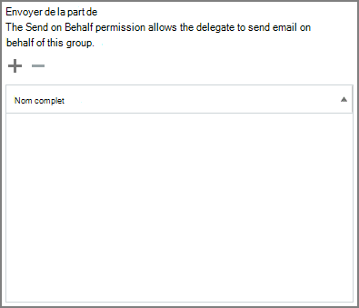

# グループの代理として送信または送信するメンバーを許可する

Send **as** または send onhalf permissions が付与されているMicrosoft 365 グループのメンバーは、グループとして、またはグループの代わりに電子メールを送信できます。 (グループ内のゲストにこれらのアクセス許可を付与することはできません)。

この記事では、グローバル管理者または管理者がExchangeアクセス許可を設定する方法について説明します。
  
たとえば、Megan Bowen が Training **Microsoft 365** グループの一部であり、グループに対するアクセス許可として送信を持つ場合、そのユーザーがグループとして電子メールを送信すると、トレーニング グループが電子メールを送信したのようになります。 
  
[**代理で送信] アクセス** 許可を使用すると、ユーザーはユーザーグループに代わって電子Microsoft 365できます。 たとえば、Alex Wilber がマーケティング Microsoft 365グループの一部であり、Send **on Behalf** アクセス許可を持ち、グループとして電子メールを送信する場合、電子メールは、マーケティングに代わって **Alex Wilber** によって送信されたように見えます。

> [!IMPORTANT]
> 指定したユーザー **に代わって** [送信] **または** [代理送信] を構成できますが、両方は構成できません。 両方を構成すると、既定で [として送信] **になります**。

> [!TIP]
> [グループから電子](https://support.microsoft.com/office/0f4964af-aec6-484b-a65c-0434df8cdb6b)メールを送信する方法については、「Microsoft 365 グループから電子メールを送信する」を参照してください。web 上で Outlook と Outlook を使用してグループから電子メールを送信する方法について説明します。
    
## メンバーがグループとして電子メールを送信するを許可する

このセクションでは、ユーザーがグループとして電子メールを送信する方法について、Exchange管理センター  (EAC) でExchange Online。
  
1. <a href="https://go.microsoft.com/fwlink/p/?linkid=2059104" target="_blank">Exchange 管理センター</a> で、[**受信者**]、[**グループ**] の順に移動します。
    
2. [グループ **の編集]**  ユーザーに送信を許可するグループに対して指定します。 
    
3. [ **グループ委任**] を選びます。
    
4. [Send **As] セクション** で、サインを選択して、送信 **+** するユーザーをグループとして追加します。 
    
    
  
5. ユーザーを入力して検索するか、一覧からユーザーを選択します。 **[OK] と [** 保存]**を選択します**。
    
    
  
## メンバーがグループに代わって電子メールを送信するを許可する

このセクションでは、ユーザーが組織の管理センター (EAC) のグループに代わって電子メールを送信Exchangeする方法についてExchange Online。
  
1. <a href="https://go.microsoft.com/fwlink/p/?linkid=2059104" target="_blank">Exchange 管理センター</a> で、[**受信者**]、[**グループ**] の順に移動します。
    
2. [グループ **の編集]**  ユーザーに送信を許可するグループに対して指定します。 
    
3. [ **グループ委任**] を選びます。
    
4. [代理で送信] セクションで、署名を選択して、グループとして送信する **+** ユーザーを追加します。 
    
    
  
5. ユーザーを入力して検索するか、一覧からユーザーを選択します。 **[OK] と [** 保存]**を選択します**。
    
    

## 関連記事

[コラボレーション ガバナンス計画のステップ バイ ステップ](collaboration-governance-overview.md#collaboration-governance-planning-step-by-step)

[コラボレーション ガバナンス 計画の作成](collaboration-governance-first.md)

[グループの詳細Microsoft 365する](https://support.microsoft.com/office/b565caa1-5c40-40ef-9915-60fdb2d97fa2)

[Add-RecipientPermission](/powershell/module/exchange/add-recipientpermission)

[Set-UnifiedGroup](/powershell/module/exchange/set-unifiedgroup)