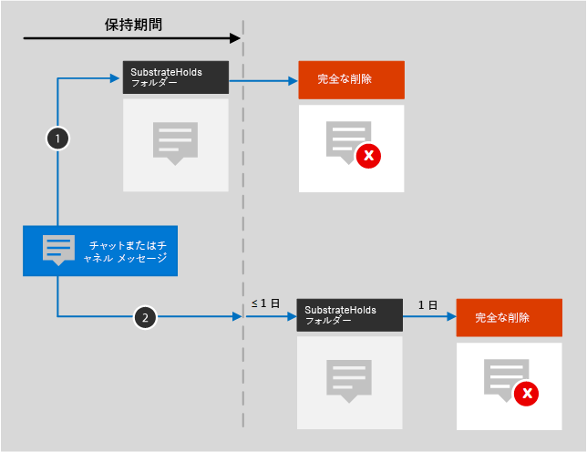

# Microsoft 365アイコンとテンプレート

パートナーと顧客が新しいソリューションを設計および設計するのを支援することが重要です。 このガイダンスに含まれるアーキテクチャ図は、設計上の決定と環境内のコンポーネント間の関係を伝えるのに役立ちます。 Visio テンプレートと共に一連の記号とアイコンを使用して、製品のアーキテクチャ 図を作成し、次のソリューションのカスタム アーキテクチャ 図を構築するのに役立つこれらのツールをここに提供しています。

これらのアイコン、シンボル、およびテンプレートは、次のページでダウンロード可能なファイルに表示されます。

- [生産性の図](productivity-illustrations.md)
- [Microsoft クラウド アーキテクチャ モデル](cloud-architecture-models.md)

## 用語とダウンロード

Microsoft では、アーキテクチャ図、トレーニング 資料、またはドキュメントでこれらのアイコンを使用できます。 Microsoft から明示的なアクセス許可が付与されていない限り、許可された使用に対してのみアイコンをコピー、配布、表示できます。 Microsoft reserves all other rights.

 > [!div class="button"]
 > [SVG アイコンと PNG アイコンをダウンロードする](https://go.microsoft.com/fwlink/?linkid=869455)

 > [!div class="button"]
 > [テンプレートVisioステンシルのダウンロード](https://go.microsoft.com/fwlink/?linkid=2056186)

## アーキテクチャ図の例

これらのアイコンとテンプレートを使用して、次の例のような図を作成できます。

1. 次に示す検索アーキテクチャ図のSharePoint。

    

2. Teamsライフサイクル アーキテクチャ図:

    
