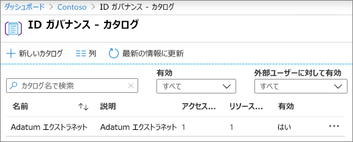
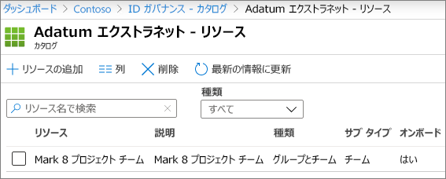
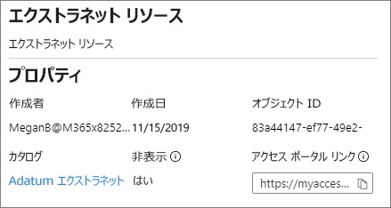

# 管理されたゲストで B2B エクストラネットを作成する

エンタイトルメント[管理Azure Active Directory使用](/azure/active-directory/governance/entitlement-management-overview)して、B2B エクストラネットを作成して、このサービスを使用するパートナー組織とAzure Active Directory。 これにより、ユーザーはエクストラネット サイトまたはチームに自己登録し、承認ワークフローを介してアクセスを受け取るできます。

このグループ作業のリソースを共有する方法により、パートナー組織はゲストの維持と承認を支援し、IT 部門の負担を軽減し、コラボレーション契約に精通しているユーザーがユーザー アクセスを管理できるようにすることができます。

この記事では、セルフサービス アクセス登録モデルを使用してパートナー組織と共有できるリソースのパッケージ (この場合はサイトまたはチーム) を作成する手順について説明します。 

開始する前に、パートナー組織と共有するサイトまたはチームを作成し、ゲスト共有のために有効にします。 詳細 [については、「サイトのゲストと共同作業する」](collaborate-in-site.md) または「チーム内のゲストと共同作業 [する](collaborate-as-team.md) 」を参照してください。 また、ゲストと共同作業する際にガバナンス ポリシーの維持に役立つセキュリティ機能とコンプライアンス機能に関する情報については、「セキュリティで保護されたゲスト共有環境を作成する」を参照することをお勧めします。

## ライセンス要件

この機能を使用するには、ライセンスAzure AD Premium P2必要です。 

Azure Germany や Azure China 21Vianet などの特殊なクラウドは、現在使用できません。

## ビデオ デモンストレーション

このビデオでは、この記事で説明する手順を示します。

> [!VIDEO https://www.microsoft.com/videoplayer/embed/RE4wKUj?autoplay=false]

## Connect組織を管理する

パートナー組織からゲストを招待するには、パートナーのドメインを接続組織として追加する必要Azure Active Directory。

接続された組織を追加するには
1. [Azure Active Directory] で [、[ID](https://aad.portal.azure.com)ガバナンス]**をクリックします**。
2. [接続 **された組織] をクリックします**。
4. [接続 **された組織の追加] をクリックします**。
5. 組織の名前と説明を入力し、[次へ **: ディレクトリとドメイン] をクリックします**。
6. [ディレクトリ **とドメインの追加] をクリックします**。
7. 接続する組織のドメインを入力し、[追加] を **クリックします**。
8. **[Connect]** をクリックし、[次へ:**スポンサー] をクリックします**。
9. ゲストのアクセスを承認するユーザーに接続する組織または組織のユーザーを追加します。
10. **[次へ: 確認 + 作成]** をクリックします。
11. 選択した設定を確認し、[作成] を **クリックします**。

    ![[組織の接続] ページのスクリーンショットをAzure Active Directory。](../media/identity-governance-connected-organizations.png)

## 共有するリソースを選択する

パートナー組織と共有するリソースを選択する最初の手順は、それらを含むカタログを作成します。

カタログを作成するには
1. [Azure Active Directory] で [、[ID](https://aad.portal.azure.com)ガバナンス]**をクリックします**。
2. [カタログ **] をクリックします**。
3. [新 **しいカタログ] をクリックします**。
4. カタログの名前と説明を入力し、外部ユーザーに対して **有効** と有効の両方が [はい]**に設定されています**。
5. **[作成]** をクリックします。

   

カタログを作成したら、パートナー組織とSharePointするサイトまたはチームを追加します。

カタログにリソースを追加するには
1. Azure AD ID ガバナンスで、[カタログ] をクリックし、リソースを追加するカタログをクリックします。
2. [リソース **] をクリック** し、[リソースの **追加] をクリックします**。
3. エクストラネットに含SharePointチームまたはサイトを選択し、[追加] を **クリックします**。

   

共有するリソースを定義したら、次に、パートナー ユーザーに付与されるアクセスの種類と、アクセスを要求する新しいパートナー ユーザーの承認プロセスを定義するアクセス パッケージを作成します。

アクセス パッケージを作成するには
1. Azure AD ID ガバナンスで、[カタログ] をクリックし、アクセス パッケージを作成するカタログをクリックします。
2. [Access **パッケージ] を** クリックし、[新しいアクセス **パッケージ] をクリックします**。
3. アクセス パッケージの名前と説明を入力し、[次へ: リソースの役割 **] をクリックします**。
4. エクストラネットに使用するカタログからリソースを選択します。
5. リソースごとに、[役割] **列で** 、エクストラネットを使用するゲストに付与するユーザー ロールを選択します。
6. [次 **へ: 要求] をクリックします**。
7. [ **アクセスを要求できるユーザー] で**、[ディレクトリ **に含めないユーザー] を選択します**。
8. [特定の接続 **組織] オプション** が選択されていることを確認し、[ディレクトリの追加] **をクリックします**。
9. 前に追加した接続組織を選択し、[選択] をクリック **します。**
10. [承認 **] で**、[承認の **要求] で [は****い] を選択します**。
11. [ **最初の承認者]** で、前に追加したスポンサーのいずれかを選択するか、特定のユーザーを選択します。
12. [フォールバック **の追加] を** クリックし、フォールバック承認者を選択します。
13. [有効 **] で**、[はい] **を選択します**。
14. [次 **へ: ライフサイクル] をクリックします**。
15. 使用する有効期限とアクセスレビュー設定を選択し、[次へ: レビュー+ 作成] **をクリックします**。
16. 設定を確認し、[作成] を **クリックします**。

    ![[ID ガバナンス] の [アクセス パッケージ] 画面Azure Active Directoryスクリーンショット。](../media/identity-governance-access-packages.png)

大規模な組織と提携している場合は、アクセス パッケージを非表示にできます。 パッケージが非表示の場合、パートナー組織のユーザーは自分のマイ アクセス ポータルにパッケージ *を表示* されません。 代わりに、パッケージにサインアップするために直接リンクを送信する必要があります。 アクセス パッケージを非表示にすると、不適切なアクセス要求の数が減り、パートナー組織のポータルで利用可能なアクセス パッケージを整理し続けるのに役立ちます。

アクセス パッケージを非表示に設定するには
1. Azure AD ID ガバナンスで、[Access パッケージ] を **クリック** し、アクセス パッケージをクリックします。
2. [概要] **ページで** 、[編集] を **クリックします**。
3. [プロパティ **] で**、[非表示] で **[は** い] **を** 選択し、[保存] を **クリックします**。

   ![[アクセス パッケージのプロパティの編集] 画面のスクリーンショット。](../media/identity-governance-access-package-hidden.png)

## パートナー ユーザーの招待

アクセス パッケージを非表示に設定した場合は、パートナー組織に直接リンクを送信して、サイトまたはチームへのアクセスを要求する必要があります。

アクセス ポータルリンクを見つけるには
1. Azure AD ID ガバナンスで、[Access パッケージ] を **クリック** し、アクセス パッケージをクリックします。
2. [概要] **ページで** 、[ **マイ** アクセス ポータル] リンクの [クリップボードにコピー] **リンクをクリックします**。

   

リンクをコピーしたら、パートナー組織の連絡先と共有し、そのリンクをコラボレーション チームのユーザーに送信できます。

## 関連項目

[セキュリティで保護されたゲスト共有の環境を作成する](create-secure-guest-sharing-environment.md)