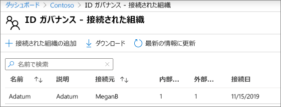
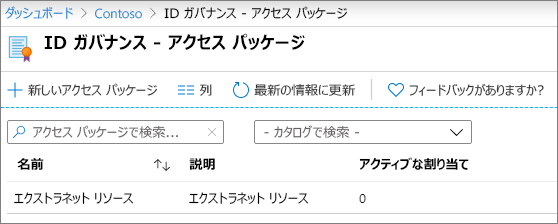
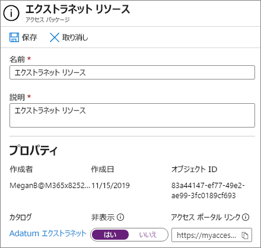

# 管理されたゲストで B2B エクストラネットを作成する

[Azure Active Directory エンタイトルメント管理](/azure/active-directory/governance/entitlement-management-overview)を使用して B2B エクストラネットを作成し、Azure Active Directory を使用しているパートナー組織と連携することができます。 これにより、ユーザーはエクストラネット サイトやチームに自己登録し、承認ワークフローを介してアクセス権限を受け取ることができます。

コラボレーションのためにリソースを共有するこの方法を使用して、パートナー組織側でゲストのメンテナンスや承認を行うことができるため、IT 部門の負担が軽減され、コラボレーション契約に最も精通した担当者がユーザー アクセスを管理することができます。

この記事では、セルフサービスのアクセス登録モデルを通してパートナー組織と共有できるリソースのパッケージ (ここではサイトやチーム) を作成するための手順を説明します。 

開始する前に、パートナー組織と共有するサイトやチームを作成し、ゲスト共有できるようにします。 詳細については、「[サイト内のゲストとのコラボレーション](collaborate-in-site.md)」または「[チーム内のゲストとのコラボレーション](collaborate-as-team.md)」を参照してください。 また、ゲストとのコラボレーション時にガバナンス ポリシーを維持するために使用できるセキュリティおよびコンプライアンス機能に関する詳細については、「[セキュリティで保護されたゲスト共有の環境を作成する](create-secure-guest-sharing-environment.md)」を参照することをお勧めします。

## ライセンス要件

この機能を使用するには、Azure AD Premium P2 ライセンスが必要です。 

Azure Germany や Azure China 21Vianet などの特殊なクラウドは、現在使用できません。

## ビデオ デモンストレーション

このビデオでは、この記事で取り上げた手順を紹介しています。

> [!VIDEO https://www.microsoft.com/videoplayer/embed/RE4wKUj?autoplay=false]

## パートナー組織と接続する

パートナー組織からゲストを招待するには、パートナーのドメインを Azure Active Directory に接続している組織として追加する必要があります。

接続している組織を追加するには
1. [Azure Active Directory](https://aad.portal.azure.com) で、**[ID ガバナンス]** をクリックします。
2. **[接続している組織]** をクリックします。
4. **[接続している組織の追加]** をクリックします。
5. 組織の名前と説明を入力して、**[次へ: ディレクトリ + ドメイン]** をクリックします。
6. **[Active Directory + ドメイン]** をクリックします。
7. 接続する組織のドメインを入力して、**[追加]** をクリックします。
8. **[接続]** をクリックし、**[次へ: スポンサー]** をクリックします。
9. 所属している組織または接続している組織から、ゲストのアクセスを承認するユーザーを追加します。
10. **[次へ: 確認 + 作成]** をクリックします。
11. 選択した設定を確認して、**[作成]** をクリックします。

    

## リソースを選択して共有する

パートナー組織と共有するリソースを選択する最初の手順は、そのリソースを含むカタログを作成することです。

カタログを作成するには
1. [Azure Active Directory](https://aad.portal.azure.com) で、**[ID ガバナンス]** をクリックします。
2. **[カタログ]** をクリックします。
3. **[新規カタログ]** をクリックします。
4. カタログ用の名前と説明を入力し、**[有効にする]** と **[外部ユーザーに有効にする]** の両方で **[はい]** に設定されていることを確認します。
5. **[作成]** をクリックします。

   

カタログが作成されたら、パートナー組織と共有する SharePoint サイトやチームを追加します。

カタログにリソースを追加
1. Azure AD Identity Governance で **[カタログ]** をクリックし、リソースを追加するカタログをクリックします。
2. **[リソース]** をクリックし、**[リソースの追加]** をクリックします。
3. エクストラネットに含めるチームや SharePoint サイトを選択して、**[追加]** をクリックします。

   

共有するリソースを定義したら、次の手順ではアクセス パッケージを作成します。アクセス パッケージでは、パートナー ユーザーに付与されるアクセスの種類と、アクセスを要求する新しいパートナー ユーザーの承認プロセスを定義します。

アクセス パッケージを作成するには
1. Azure AD Identity Governance で **[カタログ]** をクリックし、アクセス パッケージを作成するカタログをクリックします。
2. **[アクセス パッケージ]** をクリックして、**[新規アクセス パッケージ]** をクリックします。
3. アクセス パッケージの名前と説明を入力して、**[次へ: リソース ロール]** をクリックします。
4. エクストラネットに使用するカタログからリソースを選択します。
5. 各リソースの **[役割]** 列では、エクストラネットを使用するゲストに付与するユーザー ロールを選択します。
6. **[次へ: リクエスト]** をクリックします。
7. **[アクセス許可を要求できるユーザー]** で、**[ディレクトリにいないユーザー]** を選択します。
8. **[特定の接続された組織]** が選択されていることを確認して、**[ディレクトリの追加]** をクリックします。
9. 以前に追加した接続している組織を選択して、**[選択]** をクリックします
10. **[承認]** で **[商品を要求する]** に **[はい]** を選択します。
11. **[最初の承認者]** で、以前に追加したスポンサーの 1 人を選択するか、特定のユーザーを選択します。
12. **[フォールバックの追加]** をクリックして、フォールバック承認者を選択します。
13. **[有効にする]** で、**[はい]** を選択します。
14. **[次へ: ライフサイクル]** をクリックします。
15. 使用する有効期限とアクセス レビュー設定を選択して、**[次へ: レビュー + 作成]** をクリックします。
16. 設定を確認し、**[作成]** をクリックします。

    

大規模な組織と提携している場合は、アクセス パッケージを非表示にすることができます。 パッケージを非表示にする場合は、パートナー組織のユーザーの *[マイ アクセス]* ポータルにパッケージが表示されなくなります。 代わりに、パッケージにサインアップするための直接リンクを送信してもらう必要があります。 アクセス パッケージを非表示にすることで、不適切なアクセス要求の数を減らすことができ、また、パートナー組織のポータルで利用可能なアクセス パッケージを保持することにも役立ちます。

アクセス パッケージを非表示の設定にするには
1. Azure AD Identity Governance で **[アクセス パッケージ]** をクリックしてから、お使いのアクセス パッケージをクリックします。
2. **[概要]** ページで **[編集]** をクリックします。
3. **[プロパティ]** で、**[非表示]** に **[はい]** を選択し、**[保存]** をクリックします。

   

## パートナー ユーザーを招待する

アクセス パッケージを非表示に設定した場合は、パートナー組織が自分のサイトやチームへのアクセスを要求できるように、直接リンクを送信する必要があります。

アクセス ポータル リンクを検索するには
1. Azure AD Identity Governance で **[アクセス パッケージ]** をクリックしてから、お使いのアクセス パッケージをクリックします。
2. **[概要]** ページで、**[マイ アクセス ポータル リンク]** の **[クリップボードにコピー]** リンクをクリックします。

   

リンクをコピーしたら、そのリンクをパートナー組織の連絡先と共有することで、コラボレーション チームのユーザーに送信することができます。

## 関連項目

[セキュリティで保護されたゲスト共有の環境を作成する](create-secure-guest-sharing-environment.md)