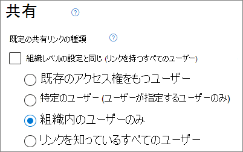

# <a name="best-practices-for-sharing-files-and-folders-with-unauthenticated-users"></a>認証されていないユーザーとファイルおよびフォルダーを共有するためのベスト プラクティス

認証されていない共有 ([*すべてのユーザー*] リンク) は便利で、さまざまなシナリオで役立ちます。 [*すべてのユーザー*] リンクは、最も簡単な共有方法です。ユーザーは認証なしでリンクを開くことができ、そのリンクを他のユーザーに自由に渡すことができます。

通常、組織内のすべてのコンテンツが認証されていない共有に適しているわけではありません。この記事では、ユーザーがファイルやフォルダーの認証されていない共有を使用できるものの、組織のコンテンツを保護するのに役立つセーフガードが設定されている環境を作成するのに利用できるオプションを説明します。

> [!NOTE]
> 認証されていない共有を機能させるには、お客様の組織、および使用する予定の個々のサイトやチームに対して認証されていない共有を有効にする必要があります。 有効にするシナリオについては、「[組織外のユーザーとの共同作業](collaborate-with-people-outside-your-organization.md)」を参照してください。

## <a name="set-an-expiration-date-for-anyone-links"></a>[すべてのユーザー] リンクの有効期限を設定する

ファイルは、サイト、グループ、チーム内に長期間保存されることがよくあります。 データ保持ポリシーによってファイルを数年間保持するように要求されている場合もあります。 そのようなファイルが認証されていない人と共有されている場合、ファイルへの予期しないアクセスや変更の原因となる可能性があります。 このような可能性を軽減するため、*[すべてのユーザー]* リンクの有効期限を設定することができます。

*[すべてのユーザー]* リンクの期限が切れると、そのリンクを使用してコンテンツにアクセスすることはできなくなります。

組織全体で [すべてのユーザー] リンクの有効期限を設定するには

1. SharePoint 管理センターを開き、[**ポリシー**] を展開してから、[<a href="https://go.microsoft.com/fwlink/?linkid=2185222" target="_blank">**共有**</a>] を選択します。
1. **[[すべてのユーザー] リンクの有効期限とアクセス許可のオプションを選択する]** で、**[これらのリンクは、次の日数以内に期限切れにする必要があります]** チェック ボックスをオンにします。</br>
   ![SharePoint における組織レベルの [すべてのユーザー] リンクの有効期限設定のスクリーンショット。](../media/sharepoint-organization-anyone-link-expiration.png)
1. このボックスに日数を入力し、**[保存]** をクリックします。

有効期限を変更すると、既存のリンクは、新しい設定が長い場合は現在の有効期限を保持し、新しい設定が短い場合は新しい設定に更新されます。

特定のサイトで [すべてのユーザー] リンクの有効期限を設定するには

1. SharePoint 管理センターを開き、**[サイト]** を展開してから、<a href="https://go.microsoft.com/fwlink/?linkid=2185220" target="_blank">**[アクティブなサイト]**</a> を選択します。
1. 変更するサイトを選択してから、**[共有]** を選択します。
1. **[[すべてのユーザー] リンクの詳細設定]** で、**[Expiration of Anyone links]** ([すべてのユーザー] リンクの有効期限) にある **[組織レベルの設定と同じ]** チェック ボックスをオフにします。</br>
   ![SharePoint におけるサイトレベルの [すべてのユーザー] リンクの有効期限設定のスクリーンショット。](../media/sharepoint-organization-anyone-link-expiration-site.png)
1. **[これらのリンクは、次の日数以内に期限切れにする必要があります]** オプションを選択し、ボックスに日数を入力します。
1. **[保存]** を選択します。

*[すべてのユーザー]* リンクの有効期限が切れても、新しい *[すべてのユーザー]* リンクを使用してファイルやフォルダーを再共有できることにご注意ください。

[Set-SPOSite](/powershell/module/sharepoint-online/set-sposite) を使用して、特定のサイトでの *[すべてのユーザー]* リンクの有効期限を設定できます。 

```powershell
Set-SPOSite -Identity https://contoso.sharepoint.com/sites/marketing -OverrideTenantAnonymousLinkExpirationPolicy $true -AnonymousLinkExpirationInDays 15
```

## <a name="set-link-permissions"></a>リンクのアクセス許可を設定する

既定では、ファイルに対して *[すべてのユーザー]* リンクを使用すると、ユーザーはそのファイルを編集することができます。また、フォルダーに対して *[すべてのユーザー]* リンクを使用すると、ユーザーはファイルの編集と表示に加えて、そのフォルダーに新しいファイルをアップロードすることもできます。ファイルやフォルダーに対するこれらのアクセス許可は、個別に表示のみに変更できます。

認証されていない共有を許可したい一方で、認証されていない人によって組織のコンテンツが変更されることへの懸念がある場合は、ファイルとフォルダーのアクセス許可を [**表示**] に設定することをご検討ください。

組織全体で [すべてのユーザー] リンクのアクセス許可を設定するには

1. SharePoint 管理センターを開き、[<a href="https://go.microsoft.com/fwlink/?linkid=2185222" target="_blank">**共有**</a>] を選択します。
1. **[[すべてのユーザー] リンクの詳細設定]** で、使用するファイルとフォルダーのアクセス許可を選択します。</br>
   ![SharePoint における組織レベルの [すべてのユーザー] リンクのアクセス許可設定のスクリーンショット。](../media/sharepoint-organization-anyone-link-permissions.png)

*[すべてのユーザー]* リンクが **[表示]** に設定されていても、*[特定のユーザー]* リンクを使用することにより、ユーザーはファイルやフォルダーをゲストと共有して、ゲストに編集するアクセス許可を付与できます。 [特定のユーザー] リンクでは組織外のユーザーにゲストとしての認証が要求されるため、これらのリンクを使用して共有されているファイルやフォルダーに対するゲストのアクティビティを追跡および監査できます。

## <a name="set-default-link-type-to-only-work-for-people-in-your-organization"></a>既定のリンクの種類が組織内のユーザーに対してのみ有効になるように設定する

組織で *[すべてのユーザー]* 共有が有効になっている場合、既定の共有リンクは通常 **[すべてのユーザー]** に設定されています。 これはユーザーにとって便利である反面、意図せずに認証されていない共有のリスクを高める可能性があります。 機密性の高いドキュメントを共有する際にユーザーがリンクの種類を変更し忘れると、認証を必要としない共有リンクが誤って作成される恐れがあります。

既定のリンク設定を組織内のユーザーに対してのみ有効なリンクに変更することにより、このようなリスクを軽減できます。 認証されていない人と共有したいユーザーは、そのオプションを意図的に選択することが必要になります。

組織の既定のファイルやフォルダーの共有リンクを設定するには
1. SharePoint 管理センターを開き、[<a href="https://go.microsoft.com/fwlink/?linkid=2185222" target="_blank">**共有**</a>] を選択します。
1. **[ファイルとフォルダーのリンク]** で、**[自分の組織内のユーザーのみ]** を選択します。

   

1. **[保存]** を選びます。

特定のサイトの既定のファイルやフォルダーの共有リンクを設定するには

1. SharePoint 管理センターを開き、**[サイト]** を展開してから、<a href="https://go.microsoft.com/fwlink/?linkid=2185220" target="_blank">**[アクティブなサイト]**</a> を選択します。
1. 変更するサイトを選択してから、**[共有]** を選択します。
1. **[既定の共有リンクの種類]** で、**[組織レベルの設定と同じ]** チェック ボックスをオフにします。

   

1. **[組織内のユーザーのみ]** オプションを選択してから、**[保存]** を選択します。

## <a name="prevent-unauthenticated-sharing-of-sensitive-content"></a>機密コンテンツの認証されていない共有を防止する

[Microsoft Purview データ損失防止 (DLP)](../compliance/dlp-learn-about-dlp.md) を使用して、機密コンテンツの認証されていない共有を防ぐことができます。 データ損失防止は、ファイルの秘密度ラベル、保持ラベル、ファイル自体に含まれている機密情報に基づいてアクションを実行することができます。

DLP ルールを作成するには
1. Microsoft Purview コンプライアンス管理センターで、[[データ損失防止]](https://compliance.microsoft.com/datalossprevention) ページに移動します。
2. **[ポリシーの作成]** をクリックします。
3. **[カスタム]** を選択し、**[次へ]** をクリックします。
4. ポリシーの名前を入力し、**[次へ]** をクリックします。
5. **[ポリシーを適用する場所]** ページで、**SharePoint サイト** と **OneDrive アカウント** 以外のすべての設定をオフにし、**[次へ]** をクリックします。
6. **[ポリシーの設定を定義]** ページで、**[次へ]** をクリックします。
7. **[高度な DLP ルールのカスタマイズ]** ページで **[ルールの作成]** をクリックし、ルールの名前を入力します。
8. [ **条件** で、[ **条件の追加**] をクリックし、[ **コンテンツを含む** を選択します。
9. **[追加]** をクリックして、認証されていない共有を防止する情報の種類を選択します。

   

10. [ **アクション** ] で、[ **アクションの追加**] をクリックし [ **アクセスを制限する、またはMicrosoft 365のロケーションでコンテンツを暗号化する**] を選択します。
11. **[アクセスを制限する、または Microsoft 365 のロケーションでコンテンツを暗号化する]** チェック ボックスをオンにし、**[Only people who were given access to the content through the "Anyone withe the link" options]** ([リンクを知っているすべてのユーザー] オプションを通してコンテンツへのアクセス権を付与されたユーザーのみ) オプションを選択します。

      

12. **[保存]** をクリックし、**[次へ]** をクリックします。
13. テスト オプションを選択し、**[次へ]** をクリックします。
14. **[送信]** をクリックしてから、**[完了]** をクリックします。

## <a name="protect-against-malicious-files"></a>悪意のあるファイルから保護する

匿名ユーザーにファイルのアップロードを許可する場合、悪意のあるファイルをアップロードされるリスクが高くなります。 Microsoft 365 では、Defender for Office 365 の *安全な添付ファイル* 機能を使用することにより、アップロードされたファイルを自動的にスキャンし、安全でないことが判明したファイルを検疫できます。

安全な添付ファイル機能をオンにするには
1. セキュリティ/コンプライアンス管理センターで、[ATP 安全な添付ファイル ページ](https://protection.office.com/safeattachmentv2)を開きます。
2. **[グローバル設定]** をクリックします。
3. SharePoint、OneDrive、Microsoft Teams 用の ATP を有効にします。

   

4. 必要に応じて安全なドキュメントもオンにし、**[保存]** をクリックします。

その他のガイドについては、「[SharePoint、OneDrive、Microsoft Teams 用の ATP](../security/office-365-security/mdo-for-spo-odb-and-teams.md)」と「[SharePoint、OneDrive、Microsoft Teams 用の ATP を有効にする](../security/office-365-security/turn-on-mdo-for-spo-odb-and-teams.md)」を参照してください。

## <a name="add-copyright-information-to-your-files"></a>ファイルに著作権情報を追加する

Microsoft Purview 管理センターで秘密度ラベルを使用する場合は、組織の Office ドキュメントに透かしまたはヘッダーまたはフッターを自動的に追加するようにラベルを構成できます。 このようにすることで、共有ファイルに著作権などの所有者情報が確実に含められるようにすることができます。

ラベルが付けられたファイルにフッターを追加するには

1. [Microsoft Purview 管理センター](https://compliance.microsoft.com)を開きます。
2. 左側のナビゲーションにある **[ソリューション]** で、**[情報の保護]** をクリックします。
3. フッターを追加するラベルをクリックし、**[ラベルの編集]** をクリックします。
4. **[次へ]** をクリックして **[コンテンツのマーキング]** タブに移動し、コンテンツのマーキングを **オン** にします。
5. 追加するテキストの種類のチェック ボックスをオンにして、**[テキストをカスタマイズする]** をクリックします。
6. ドキュメントに追加するテキストを入力し、目的のテキスト オプションを選択して、**[保存]** をクリックします。</br>
   
7. **[次へ]** をクリックしてウィザードの最後に移動し、**[Save label]** (ラベルの保存) をクリックします。

コンテンツのマーキングがラベルに対して有効になっている状態で、そのラベルをユーザーが適用すると、Office ドキュメントに指定したテキストが追加されます。

## <a name="see-also"></a>関連項目

[秘密度ラベルの概要](/Office365/SecurityCompliance/sensitivity-labels)

[ゲストと共有するときにファイルの偶発的な公開を制限する](share-limit-accidental-exposure.md)

[セキュリティで保護されたゲスト共有の環境を作成する](create-secure-guest-sharing-environment.md)
