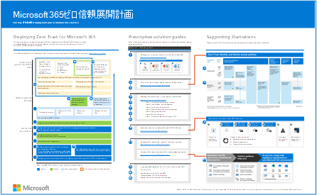
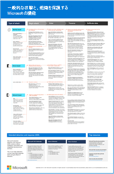
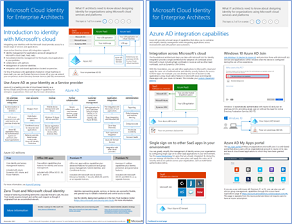
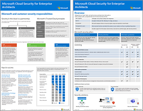

# IT アーキテクト向け Microsoft クラウドの図

これらのクラウド アーキテクチャポスターでは、Microsoft 365、Azure Active Directory (Azure AD)、Microsoft Intune、Microsoft Dynamics 365、ハイブリッドオンプレミスおよびクラウド ソリューションなど、Microsoft クラウド サービスに関する情報を提供します。 

IT の意思決定者とアーキテクトは、これらのリソースを使用して、ワークロードに最適なソリューションを決定し、ネットワーク、ID、セキュリティなどのコア インフラストラクチャ コンポーネントに関する決定を行うことができます。

### Microsoft 365 ゼロ トラスト展開プラン

この図では、Microsoft 365 でゼロ トラスト セキュリティを構築するための展開計画を示します。 ゼロ トラストは、侵害を想定し、制御されていないネットワークから送信されたかのように各要求を検証する新しいセキュリティ モデルです。 要求の発信元やアクセスするリソースに関係なく、ゼロトラスト モデルは「信頼せず、常に検証する」ことを教えています。

| アイテム | 説明 |
|:-----|:-----|
|   [PDF](https://download.microsoft.com/download/f/d/b/fdb6ab0c-34bb-4cb8-84e6-5de8f13298da/m365-zero-trust-deployment-plan.pdf) \| [Visio](https://download.microsoft.com/download/f/d/b/fdb6ab0c-34bb-4cb8-84e6-5de8f13298da/m365-zero-trust-deployment-plan.vsdx)   更新日:2022 年 3 月 | この記事と共に使用する図: [Microsoft 365 Zero Trust 展開計画](../security/Microsoft-365-zero-trust.md)   **関連するソリューション ガイド**   <ul><li>[Microsoft 365 の ID インフラストラクチャをデプロイする](/microsoft-365/enterprise/deploy-identity-solution-overview)</li><li>[推奨される ID とデバイス アクセスの構成](../security/office-365-security/microsoft-365-policies-configurations.md)</li><li>[Intune でデバイスを管理する](manage-devices-with-intune-overview.md)</li><li>[Microsoft 365 Defender の評価とパイロット](../security/defender/eval-overview.md)</li><li>[Microsoft Purview を使用して情報保護ソリューションを展開する](../compliance/information-protection-solution.md)</li><li>[Microsoft 365 でデータプライバシー規制の情報保護を展開する](information-protection-deploy.md)</li></ul>|

### Intune 登録オプション

このガイダンスは、次のオプションを含め、エンドポイントに最適な登録オプションを決定するのに役立ちます。
- Windows デバイス
- macOS
- iOS/iPad
- Android

| アイテム | 説明 |
|:-----|:-----|
|[別の Intune 登録オプションの視覚的表現 ](https://download.microsoft.com/download/e/6/2/e6233fdd-a956-4f77-93a5-1aa254ee2917/msft-intune-enrollment-options.pdf)   [PDF](https://download.microsoft.com/download/e/6/2/e6233fdd-a956-4f77-93a5-1aa254ee2917/msft-intune-enrollment-options.pdf) \| [Visio](https://download.microsoft.com/download/e/6/2/e6233fdd-a956-4f77-93a5-1aa254ee2917/msft-intune-enrollment-options.vsdx)   更新日: 2022 年 6 月 | **関連するソリューション ガイド**   <ul><li>[Intune でデバイスを管理する](manage-devices-with-intune-overview.md)</li><li>[Microsoft Intune 計画ガイド](/mem/intune/fundamentals/intune-planning-guide)</ul>|

### 一般的な攻撃と、組織を保護する Microsoft の機能

最も一般的なサイバー攻撃と、攻撃の各段階で Microsoft が組織を支援する方法について説明します。 

| 項目 | 説明 |
|:-----|:-----|
|   [PDF](https://download.microsoft.com/download/F/A/C/FACFC1E9-FA35-4DF1-943C-8D4237B4275B/MSFT_Cloud_architecture_security_commonattacks.pdf) \| [Visio](https://download.microsoft.com/download/F/A/C/FACFC1E9-FA35-4DF1-943C-8D4237B4275B/MSFT_Cloud_architecture_security_commonattacks.vsdx)   更新日:2021 年 9 月 | このポスターは、一般的な攻撃の経路を示し、攻撃の各段階で攻撃者を阻止する機能について説明します。   **関連するソリューション ガイド**   <ul><li>[Microsoft 365 Defender の評価とパイロット](../security/defender/eval-overview.md)</li><li>[推奨される ID とデバイス アクセスの構成](../security/office-365-security/microsoft-365-policies-configurations.md)</li><li>[Microsoft 365 でデータプライバシー規制の情報保護を展開する](information-protection-deploy.md)</li><li>[Microsoft 365 テナントにランサムウェア保護を展開する](ransomware-protection-microsoft-365.md)</li><li>[Microsoft 365 のインサイダー リスク ソリューション](../compliance/insider-risk-solution-overview.md)</li></ul>|

### IT アーキテクト向けの Microsoft クラウド ID

Microsoft クラウド サービスおよびプラットフォームを使用して、組織のためのアイデンティティを設計する上で IT アーキテクトが知る必要のある事柄。
  
| 項目 | 説明 |
|:-----|:-----|
|   [PDF](https://download.microsoft.com/download/3/6/a/36a7c1ba-fe48-414f-92c9-9c9ddba323cd/5594928a.pdf )    更新日: 2021 年 11 月 | このモデルには次のものが含まれています。  <ul> <li> Microsoft のクラウド ID の概要 </li><li> Azure AD IDaaS 機能 </li><li>ゼロトラスト ID とデバイス アクセス ポリシー</li><li> オンプレミスの Active Directory Domain Services (AD DS) アカウントと Azure AD の統合 </li><li> Azure IaaS へのディレクトリ コンポーネントの配置 </li><li> Azure IaaS のワークロードの AD DS オプション </li></ul>    |

### IT アーキテクト向けの Microsoft クラウド セキュリティ

Microsoft クラウド サービスおよびプラットフォームにおけるセキュリティについて IT アーキテクトが知る必要のある事柄。
  
| 項目 | 説明 |
|:-----|:-----|
|   [PDF](https://download.microsoft.com/download/6/D/F/6DFD7614-BBCF-4572-A871-E446B8CF5D79/MSFT_cloud_architecture_security.pdf)   更新日: 2022 年 2 月 | このモデルには次のものが含まれています。 <ul><li>Microsoft と顧客のセキュリティの責任</li><li>ID と デバイス アクセス</li><li>脅威保護</li><li>情報保護 </li><li>クラウド アプリ保護 </li></ul> |
   

### IT アーキテクト向けの Microsoft クラウド ネットワーク

Microsoft クラウド サービスおよびプラットフォームのネットワーキングに関して IT アーキテクトが知る必要のある事柄。
  
| 項目 | 説明 |
|:-----|:-----|
|    PDF \| [として表示する](../downloads/MSFT_cloud_architecture_networking.pdf)PDF \| [としてダウンロードする](https://github.com/MicrosoftDocs/microsoft-365-docs/raw/public/microsoft-365/downloads/MSFT_cloud_architecture_networking.pdf)[Visio としてダウンロードする](https://github.com/MicrosoftDocs/microsoft-365-docs/raw/public/microsoft-365/downloads/MSFT_cloud_architecture_networking.vsdx)    2020 年 8 月に更新されました | このモデルには次のものが含まれています。 <ul><li> クラウド接続のためのネットワークの進化 </li><li> Microsoft のクラウド接続の一般的な要素 </li><li> Microsoft クラウド接続のためのExpressRoute </li><li> Microsoft SaaS、Azure PaaS、Azure IaaS 用のネットワークの設計 </li></ul>    |

### IT アーキテクト向けの Microsoft ハイブリッド クラウド

Microsoft のサービスとプラットフォーム用のハイブリッド クラウドに関して IT アーキテクトが知る必要のある事柄。
  
| 項目 | 説明 |
|:-----|:-----|
|   PDF \| [として表示する](../downloads/MSFT_cloud_architecture_hybrid.pdf)PDF \| [としてダウンロードする](https://github.com/MicrosoftDocs/microsoft-365-docs/raw/public/microsoft-365/downloads/MSFT_cloud_architecture_hybrid.pdf)[Visio としてダウンロードする](https://github.com/MicrosoftDocs/microsoft-365-docs/raw/public/microsoft-365/downloads/MSFT_cloud_architecture_hybrid.vsdx)      2020 年 8 月に更新されました | このモデルには次のものが含まれています。 <ul><li> Microsoft のクラウド製品 (SaaS、Azure PaaS、Azure IaaS) とそれらの共通の要素。 </li><li> Microsoft のクラウド製品向けのハイブリッド クラウド アーキテクチャ </li><li> Microsoft SaaS (Office 365)、Azure PaaS、および Azure IaaS のハイブリッド クラウド シナリオ </li></ul> |

### Microsoft のクラウド テナント間の移行のためのアーキテクチャ手法 
この一連のトピックでは、合併、買収、分割、および新しいクラウド テナントへの移行に導くその他のシナリオに対応する複数のアーキテクチャ手法を示します。 これらのトピックでは、エンタープライズ リソース計画の開始点のガイダンスを提供します。 

| アイテム | 説明 |
|:-----|:-----|
|   [PDF](https://download.microsoft.com/download/b/a/1/ba19dfe7-96e2-4983-8783-4dcff9cebe7b/microsoft-365-tenant-to-tenant-migration.pdf)   更新日:2021 年 2 月    |このモデルには次のものが含まれています。 <ul><li>アーキテクチャ手法のためのビジネス シナリオのマッピング。</li><li>設計上の考慮事項</li><li>単一イベント移行フローの例</li><li>段階的移行フローの例</li><li>テナントの移動または分割フローの例</li></ul>|

## 関連リソース

独自のアーキテクチャ設計図を作成するためのリソースを取得します。 [Microsoft 365 アーキテクチャ のアイコンとテンプレート](architecture-icons-templates.md)。

[Azure アーキテクチャ センター](/azure/architecture/)に移動します。
