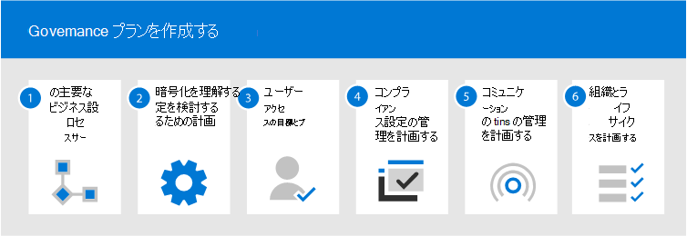
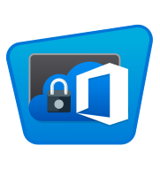

# 共同作業のガバナンスとは?

コラボレーション ガバナンスは、ユーザーによるリソースへのアクセス、ビジネス標準への準拠、データのセキュリティの確保を管理する方法です。

今日の組織では、さまざまなツール セットが使用されています。 チーム チャットを使用する開発者チーム、電子メールを送信する役員、企業のソーシャルを通して接続する組織全体があります。 複数のコラボレーション ツールが使用されているのは、すべてのグループが一意であり、独自の機能ニーズと作業スタイルを持つためです。 一部のユーザーはメールのみを使用し、他のユーザーは主にチャットに住む場合があります。 

ユーザーは、IT が提供するツールがニーズに合わないと思った場合、自分のシナリオに対応するお気に入りのコンシューマー アプリをダウンロードすることになるでしょう。 このプロセスにより、ユーザーはすぐに使い始めることができますが、複数のログイン、共有の困難さ、コンテンツの閲覧場所の不足など、組織全体でユーザー エクスペリエンスが低下します。 この概念は「シャドウ IT」と呼ばれ、組織に重大なリスクをもたらします。 これにより、ユーザー アクセスを均一に管理し、セキュリティとサービス コンプライアンスのニーズを保証できる機能が減ります。

グループ、Microsoft 365、Teams、Yammerなどのサービスは、共同作業に必要なツールを提供することで、ユーザーを支援し、シャドウ IT のリスクを軽減します。 Microsoft 365に必要なガバナンス機能を実装するための豊富なツールセットがあります。 

この一連の記事は、グループ、チーム、および SharePoint 設定の相互作用、使用可能なガバナンス機能、および Microsoft 365 でのコラボレーション機能のガバナンス 計画を作成および実装する方法を理解するのに役立ちます。

### ユーザーとの安全なコラボレーションのMicrosoft 365

組織で安全なコラボレーションを行うMicrosoft 365グループとTeamsを展開するための多くのオプションがあります。 組織に最適なコラボレーション ソリューションを作成するには、Microsoft 365 および関連記事とのセキュリティで保護されたコラボレーションをセットアップするとともに、[この](setup-secure-collaboration-with-teams.md)ガバナンス コンテンツを使用することをお勧めします。

### データ所在地

組織が複数国間で、さまざまな地域のデータ常駐要件がある場合は、Microsoft 365[複数](/microsoft-365/enterprise/microsoft-365-multi-geo)地域をコラボレーション ガバナンス 計画の一部として含める必要があります。

## グループMicrosoft 365重要な理由

Microsoft 365グループを使用すると、共同作業を行うユーザーのセットを選択し、それらのユーザーが共有するリソースのコレクションを簡単に設定できます。 グループにメンバーを追加すると、グループによって提供されるすべてのアセットに必要なアクセス許可が自動的に付与されます。 ユーザー TeamsとYammer、Microsoft 365グループを使用してメンバーシップを管理します。

Microsoft 365グループには、ユーザーが通信と共同作業に使用できる一組のリンクされたリソースが含まれます。 グループには常に、SharePoint、Planner、Power BIワークスペース、メールボックスと予定表、およびストリームが含まれます。 グループの作成方法に応じて、オプションで他のサービス (Teams、Yammer、Project。

|関連情報|説明|
|:------|:----------|
|[Calendar](https://support.office.com/article/schedule-a-meeting-on-a-group-calendar-in-outlook-0cf1ad68-1034-4306-b367-d75e9818376a)|グループに関連するイベントをスケジュールする場合|
|[[Inbox (受信トレイ)](https://support.office.com/article/have-a-group-conversation-in-outlook-a0482e24-a769-4e39-a5ba-a7c56e828b22)]|グループ メンバー間の電子メールの会話の場合。 この受信トレイには電子メール アドレスが含まれるので、従来の配布リストと同様に、グループ外のユーザーや組織外のユーザーからのメッセージを受け入れる設定が可能です。|
|[OneNote ノートブック](https://support.office.com/article/get-started-with-onenote-e768fafa-8f9b-4eac-8600-65aa10b2fe97)|アイデア、研究、情報を収集する|
|[Planner](https://support.office.com/article/microsoft-planner-help-4a9a13c6-3adf-4a60-a6fc-15c0b15e16fc)|グループ メンバー間でプロジェクト タスクを割り当て、管理する場合|
|[Power BIワークスペース](/power-bi/collaborate-share/service-new-workspaces)|ダッシュボードとレポートを使用したデータコラボレーションスペース|
|[Projectロードマップ](https://support.microsoft.com/project)|Web ベースのプロジェクト管理ツール|
|[SharePoint チーム サイト](https://support.office.com/article/what-is-a-sharepoint-team-site-75545757-36c3-46a7-beed-0aaa74f0401e)|グループに関連する情報、リンク、およびコンテンツの中央リポジトリ|
|[Stream](https://support.microsoft.com/microsoft-stream)|ビデオ ストリーミング サービス|
|[Teams](https://support.microsoft.com/teams)|チャット ベースのワークスペース (Microsoft 365|
|[Yammerグループ](https://support.office.com/article/Learn-about-Office-365-groups-b565caa1-5c40-40ef-9915-60fdb2d97fa2)|会話を行い、情報を共有する一般的な場所|

Microsoft 365グループには、組織内のグループの管理に役立つ、有効期限ポリシー、名前付け規則、ブロックされた単語ポリシーなど、さまざまなガバナンス制御が含まれます。 グループは、このリソース スイートへのメンバーシップとアクセスを制御しますので、グループの管理は、グループの管理の重要な部分Microsoft 365。

## 組織のコラボレーション戦略を定義する

複数の場所で共同作業を行い、会話を行Microsoft 365。 ユーザーが会話を開始できる場所を理解すると、コミュニケーションの戦略を定義するのに役立ちます。

次の 3 つの主要な通信方法がサポートMicrosoft 365。

- Outlook: グループの受信トレイと予定表が共有される電子メールを通じた共同作業
- Microsoft Teams: 特定のサブグループ別に編成された、さまざまなトピックに関する非公式でリアルタイムの会話を行える常設チャット ベースのワークスペース
- Yammer: 共同作業のためのエンタープライズ ソーシャル エクスペリエンス

- Teams: チャット ベースのワークスペース (高速なコミュケーション) – 内部ループ
  - ユーザーが毎日作業するユーザーとの共同作業のために構築されています
  - 単一のエクスペリエンスでユーザーが簡単に情報を得られるようにします
  - タブ、コネクタおよびボットを追加します
  - ライブ チャット、音声/ビデオ会議、録画された会議

- Yammer: 組織全体をつなぐ (エンタープライズ ソーシャル) – 外部ループ
  - 実践コミュニティ - 共通の関心や専門知識を共有しているが、必ずしも日単位で一緒に作業しているわけではない人々のクロス機能的なグループ
  - リーダーのつながり、学習コミュニティ、役割ベースのコミュニティ

- メールボックスと予定表 (電子メール ベースのコラボレーション)
  - グループのユーザーとのターゲット通信に使用されます。
  - 他のグループ メンバーとの会議の共有予定表
 
Microsoft 365 でコラボレーション機能を使用する方法を決定する際には、これらの通信方法と、ユーザーがさまざまなシナリオで使用する可能性がある方法を検討してください。

> [!NOTE]
> Yammer または Teams によって作成された新しい Office 365 グループは、そのグループのユーザー間の主なコミュニケーションが各自の個別のクライアントで行われるため、Outlook やアドレス帳には表示されません。 Yammerグループは、グループにTeams。

## ベスト プラクティス

ガバナンス計画プロセスを開始する場合は、以下のベスト プラクティスに注意してください。

- **ユーザーと話す** - コラボレーション機能の最大のユーザーを特定し、それらのユーザーと会って、コアビジネス要件と使用例のシナリオを理解します。

- **リスクとメリットのバランス** を取る - ビジネス、規制、法務、コンプライアンスのニーズを確認し、すべての結果を最適化するソリューションを計画します。

- **さまざまな組織やさまざまな種類** のコンテンツやシナリオに適応する - さまざまなグループや部門、イントラネット コンテンツなどのさまざまな種類のコンテンツに対するさまざまなニーズと、ユーザーの OneDrive コンテンツを考慮します。

- **ビジネスの優先順位に合** わせて調整する - ビジネス目標は、ガバナンスに投資する必要がある時間とエネルギーを定義するのに役立ちます。

- **作成するソリューションにガバナンス** の決定を直接埋め込む - 多くのガバナンス決定は、Microsoft 365 で機能をオンまたはオフにすることで実装できます。

- **段階的なアプローチを使用する** - 最初に小さなグループのユーザーにコラボレーション機能をロールアウトします。 より大きなグループに進む前に、フィードバックを受け取り、ヘルプ デスク のチケットを監視し、必要な設定やプロセスを更新します。

- **トレーニングを強化** する - Microsoft 365 学習経路などのソリューションを調整して、Microsoft が提供するトレーニングで組織固有の期待を強化します。

- **組織のガバナンス ポリシー** とガイドラインを通信するための戦略を持つ - SharePoint コミュニケーション サイトに Microsoft 365 導入センターを作成して、ポリシーと手順を通信します。

- **役割と責任を定義** する - ガバナンスの中核チームを特定し、プロビジョニングと名前付けと外部アクセスに関する主要なガバナンス決定を最初に実行し、残りの決定を実行します。

- **ビジネスとテクノロジの変更に** 合わせて意思決定を再検討する - 定期的に満たして、新しい機能と新しいビジネスの期待を確認します。

これらのプラクティスの詳細については、「コラボレーション ガバナンス 計画の作成 [」を参照してください](collaboration-governance-first.md)。

## エンド ユーザーの影響と変更管理

グループとチームはいくつかの方法で作成できますので、組織に最適な方法を使用するユーザーをトレーニングすることをお勧めします。

- 組織が電子メールを使用してほとんどの通信を行う場合は、ユーザーにグループを作成するように指示Outlook。
- 組織が多くのSharePointを使用している場合、または SharePoint オンプレミスから移行する場合は、ユーザーに共同作業用にSharePointチーム サイトを作成するように指示します。
- 組織がグループを展開しているTeams、共同作業スペースが必要なときにチームを作成するようにユーザーに指示します。

これにより、ユーザーがグループと関連するサービスとの関係に慣れていない場合に混乱を避けるのに役立ちます。 グループについてユーザーと話す方法の詳細については、「グループをユーザーにMicrosoft 365[する」を参照してください](../admin/create-groups/explain-groups-knowledge-worker.md)。

## 主なガバナンス機能とライセンス要件

グループでの共同作業のためのガバナンス機能には、Microsoft 365、Microsoft 365、Teams、SharePoint、およびAzure Active Directory。

| 機能 | 説明 | ライセンス |
|:----------------------|:------------|:----------|
|チームとサイトの共有|チーム、グループ、サイトを組織外のユーザーと共有できる場合に制御します。|Microsoft 365 E5または E3|
|ドメインの許可/ブロック|組織外のユーザーとの共有を、特定のドメインのユーザーに制限します。|Microsoft 365 E5または E3|
|セルフサービス サイト作成|ユーザーが自分のサイトを作成SharePointします。|Microsoft 365 E5または E3|
|制限付きサイトとファイル共有|サイト、ファイル、およびフォルダー共有を特定のセキュリティ グループのメンバーに制限します。|Microsoft 365 E5または E3|
|制限付きグループの作成|チームとグループの作成を特定のセキュリティ グループのメンバーに制限します。|Microsoft 365 E5 EDU ライセンスAzure AD Premium Azure ライセンスAD E3|
|グループの名前付けポリシー|グループ名とチーム名にプレフィックスまたはサフィックスを適用します。|Microsoft 365 E5 EDU ライセンスAzure AD Premium Azure ライセンスAD E3|
|グループの有効期限ポリシー|非アクティブなグループとチームの有効期限を設定し、指定した期間が経過すると削除されます。|Microsoft 365 E5ライセンスを持つ e3 Azure AD Premiumまたは E3|
|グループごとのゲスト アクセス|グループ単位で組織外のユーザーとのチームとグループの共有を許可または防止します。|Microsoft 365 E5または E3|

## コラボレーション ガバナンス計画のステップ バイ ステップ

ガバナンス 計画を作成するには、次の基本的な手順に従います。

1. 重要なビジネス目標とプロセスを検討する - ビジネスのニーズを [満](collaboration-governance-first.md) たすガバナンス計画を作成します。
2. グループ、グループ、SharePoint、その他のサービスの設定と同様に、サービスの設定SharePointと[Teamsを](groups-sharepoint-teams-governance.md)[理解します](groups-services-interactions.md)。  ガバナンス戦略を計画する場合は、必ずこれらのやり取りを理解してください。
3. ユーザー アクセスの管理を計画する - グループ、グループ、ユーザー、およびグループ内のユーザーに付与するアクセスSharePoint[計画Teams。](groups-teams-access-governance.md)
4. コンプライアンス設定の管理を計画する - グループ、グループ、Microsoft 365、およびグループTeamsの利用可能なSharePoint[確認します](groups-teams-compliance-governance.md)。
5. 通信の管理を計画する - コラボレーション シナリオで使用可能 [な通信ガバナンス オプションを確認します](groups-teams-communication-governance.md)。
6. 組織とライフサイクルのガバナンスを計画する - グループとチームの作成、名前付け、有効期限、アーカイブに使用するポリシー [を選択します](plan-organization-lifecycle-governance.md)。 また、グループ、[チーム、](end-life-cycle-groups-teams-sites-yammer.md)およびグループのライフサイクルの終了オプションYammer

## 管理者向けトレーニング

Microsoft Learn のトレーニング モジュールを使用すると、Microsoft Learn のガバナンス機能をMicrosoft 365。

#### 情報保護

|トレーニング:|情報保護とガバナンスを管理する|
|:---|:---|
||今日、生成されるデータ量はかつてないほど急速に増加し、従業員はあらゆる場所で仕事をしたいと考えており、規制の状況は常に変化しています。 情報保護とガバナンスに関するMicrosoft のソリューションで、企業はデータの保護と従業員の生産性との適切なバランスの実現を保つことができます。 このラーニングパスはMicrosoft 365 認定: セキュリティ管理者  と Microsoft 365 認定: エンタープライズ管理エキスパート  の認定のための準備を行うことが出来ます。  5 時間 13 分 - ラーニング パス - 7 モジュール|

> [!div class="nextstepaction"]
> [スタート>](/learn/modules/m365-compliance-information-governance/introduction/)

  

|トレーニング:|Microsoft 365 で企業情報を保護する|
|:---|:---|
||組織の情報を保護することは、かつてないほど困難になっています。 「Microsoft 365 で社内の情報を保護する」のラーニング パスでは、機密情報を不用意な共有や誤用から保護する方法、データを検出して分類する方法、秘密度ラベルを使用して保護する方法、損失から保護するために機密情報を監視および分析する方法について説明します。 この学習パスは、セキュリティ管理者の認定:セキュリティ管理者アソシエMicrosoft 365 Microsoft 365認定: Enterpriseエキスパート認定の準備に役立ちます。  1 時間 - ラーニング パス - 5 モジュール|

> [!div class="nextstepaction"]
> [スタート>](/learn/modules/m365-security-info-overview/introduction/)

#### セキュリティとコンプライアンス

|トレーニング:|Microsoft 365 のセキュリティおよびコンプライアンス機能の基本的な知識を示します|
|:---|:---|
||エンタープライズをセキュリティで保護し、規制要件に対応できるようにするために、365 Microsoft のセキュリティおよびコンプライアンス ソリューション エリアに関する情報を参照します。 基本的なクラウド コンピューティングの概念に慣れていない場合は、クラウド 概念 - クラウド コンピューティングの原則を [使用することをお勧めします](/learn/modules/principles-cloud-computing/index)。  3 時間 11 分 - ラーニング パス - 8 モジュール|

> [!div class="nextstepaction"]
> [スタート>](/learn/modules/what-is-m365/1-introduction/)

## 図

これらの図は、グループとチームが Microsoft 365 の他のサービスとやり取りする方法と、組織内でこれらのサービスを管理するのに役立つガバナンスおよびコンプライアンス機能を理解するのに役立ちます。

### IT アーキテクト向け Microsoft 365 のグループ
IT アーキテクトが Microsoft 365 のグループについて知っておくべきこと

|**アイテム**|**説明**|
|:-----|:-----|
|   [PDF](https://github.com/MicrosoftDocs/microsoft-365-docs/raw/public/microsoft-365/downloads/msft-m365-groups.pdf) \| [Visio](https://github.com/MicrosoftDocs/OfficeDocs-Enterprise/raw/live/Enterprise/downloads/msft-m365-groups.vsdx)   更新日: 2019 年 6 月|これらの図は、さまざまな種類のグループがどのように作成および管理されているか、そしていくつかのガバナンスの推奨事項を詳述しています。|

### IT アーキテクト向け Microsoft 365 の Microsoft Teams と関連生産性サービス
Microsoft Teamsをリードする Microsoft 365 での生産性サービスの論理的なアーキテクチャ。

|**アイテム**|**説明**|
|:-----|:-----|
|   [PDF](https://github.com/MicrosoftDocs/microsoft-365-docs/raw/public/microsoft-365/downloads/msft-m365-teams-logical-architecture.pdf) \| [Visio](https://github.com/MicrosoftDocs/OfficeDocs-Enterprise/raw/live/Enterprise/downloads/msft-m365-teams-logical-architecture.vsdx)   更新日: 2019 年 4 月   |マイクロソフトは、連携してデータ ガバナンス、セキュリティ、およびコンプライアンス機能を備えたコラボレーション エクスペリエンスを提供する、一連の生産性サービスを提供しています。    この一連の図は、Microsoft Teams をはじめとする、エンタープライ ズアーキテクト向けの生産性サービスの論理アーキテクチャを概説したものです。|

### Microsoft 365保護とコンプライアンス機能

Microsoft 365情報保護とコンプライアンス機能の幅広いセットが含まれています。 Microsoft の生産性向上ツールと共に、これらの機能は、厳しい規制コンプライアンス フレームワークを遵守しながら、組織がリアルタイムで共同作業を行うのを支援するように設計されています。 

この一連の図では、最も規制の厳しい業界の 1 つである金融サービスを使用して、一般的な規制要件に対応するためにこれらの機能を適用する方法を示します。 これらのイラストを自分の用途に合わせて自由にアレンジしてください。 

| アイテム | 説明 |
|:-----|:-----|
|   英語: [PDF としてダウンロードする](https://download.microsoft.com/download/3/a/6/3a6ab1a3-feb0-4ee2-8e77-62415a772e53/m365-compliance-illustrations.pdf)  \| [Visio としてダウンロードする](https://download.microsoft.com/download/3/a/6/3a6ab1a3-feb0-4ee2-8e77-62415a772e53/m365-compliance-illustrations.vsdx)   日本語: [PDF としてダウンロードする](https://download.microsoft.com/download/6/f/1/6f1a7d0e-dd8e-442e-b073-8e94327ae4f8/m365-compliance-illustrations.pdf)  \| [Visio としてダウンロードする](https://download.microsoft.com/download/6/f/1/6f1a7d0e-dd8e-442e-b073-8e94327ae4f8/m365-compliance-illustrations.vsdx)   更新日: 2020 年 11 月|含まれる内容: <ul><li>  Microsoft の情報保護およびデータ損失防止</li><li>アイテム保持ポリシーと保持ラベル </li><li>情報バリア</li><li>コミュニケーション コンプライアンス</li><li>インサイダー リスク</li><li>サードパーティのデータの取り込み</li>|

## 会議セッション

これらの会議セッションを参照して、グループとグループのガバナンスMicrosoft 365をTeams。

**基礎**

Microsoft 365 グループの基本と新しいイノベーション (大規模な管理とガバナンス、利用状況と導入を促進するためのベスト プラクティス、セルフサービスなど) について説明します。

- [グループをMicrosoft 365する](https://www.youtube.com/watch?v=dAamBF1gb7M)

**ガバナンス**

グループの有効期限ライフサイクル、名前付けポリシー、分類ラベル、外部ゲストとのコラボレーションを設定し、グループ作成のアクセス許可を管理する方法について説明します。

- [グループ間でコラボレーションを変革し、シャドウ IT とOffice 365する](https://www.youtube.com/watch?v=Bhf_bKx3lAg)

**顧客の例**

Microsoft 365 グループ、SharePoint、Teams、および Yammer が連携してグローバル なコラボレーション プラットフォームを提供する方法の舞台裏の例を参照してください。

- [グループ、グループ、グループ、Office 365、SharePoint、TeamsとのYammer](https://www.youtube.com/watch?v=Rx9eVwqXeQk)

## 関連項目

[Microsoft 365 のセキュリティに関するドキュメント](../security/index.yml)

[Microsoft 365 コンプライアンスのドキュメント](../compliance/index.yml)