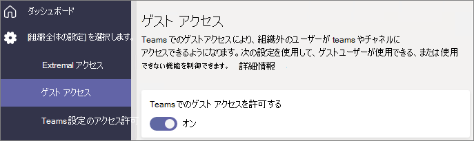

# ベースライン保護を使用してチームを構成する

この記事では、ベースライン レベルの保護を使用してチームを展開する方法について説明します。 このレベルでは、アクセス許可管理を強化し、過度な共有に対する基本的な保護を提供しながら、コラボレーションのための幅広いオプションをユーザーに提供します。 このレベルに推奨される保護には、ID とデバイス アクセス ポリシーとマルウェアに対する保護が含まれます。 さらに、必要に応じて条件付きアクセス ポリシーやデータ損失保護を適用することができます。

## 初期保護

最初のステップとして、基本的な ID とデバイス アクセス ポリシーの構成をお勧めします。 詳細については、「[Policy recommendations for securing Teams chats, groups, and files (Teams チャット、グループ、ファイルをセキュリティで保護するためのポリシーの推奨事項)](../security/office-365-security/teams-access-policies.md)」を参照してください。

また、ドキュメント、添付ファイル、リンクなどに含まれているマルウェアから保護するために、基本的な Defender for Office 365 機能をオンにすることもお勧めします。 次の表の各オプションをオンにすることをお勧めします。

|オプション|情報|
|:------|:-----------|
|SPO、OneDrive、Teams 用の安全な添付ファイル機能|[添付ファイル保護](../security/office-365-security/safe-attachments.md) 
 [Defender for Office 365 - SharePoint、OneDrive、Microsoft Teams](../security/office-365-security/mdo-for-spo-odb-and-teams.md)|
|安全なドキュメント|[Microsoft Defender for Office 365 の安全なドキュメント](../security/office-365-security/safe-docs.md)|
|Teams 用の安全なリンク|[Teams での Office 365 の安全なリンク](../security/office-365-security/safe-links.md) 
 [リンク保護](../security/office-365-security/safe-links.md)|

## Teams ゲスト共有

それぞれの階層には、組織外のユーザーと共有するオプションがあります。 機密性の高い階層については、秘密度ラベルを使用してチーム レベルでゲスト共有をオフにするオプションがあります。 ただし、Teams でゲスト共有を完全に行うには、組織レベルのゲスト共有設定をオンにしておく必要があります。

Teams ゲスト アクセスの設定を行うには

1. [https://admin.microsoft.com](https://admin.microsoft.com) で、Microsoft 365 管理センターにログインします。
2. 左側のナビゲーションで [**すべて表示**] をクリックします。
3. [**管理センター**] で、[**Teams**] をクリックします。
4. Teams 管理センターの左側のナビゲーションで、**[組織全体の設定]** > <a href="https://go.microsoft.com/fwlink/p/?linkid=2173122" target="_blank">**[ゲスト アクセス]**</a> を展開します。
5. [**Teams でのゲスト アクセスを許可する**] が [**オン**] に設定されていることを確認します。
6. 追加のゲスト設定に必要な変更を加えて、[**保存**] をクリックします。

> [!NOTE]
> Teams のゲスト設定をオンにした後、有効になるまでには、最大で 24 時間かかる場合があります。

Office 365 グループや SharePoint では既定でゲスト共有がオンになっていますが、組織のゲスト共有設定を以前変更したことがある場合には、Teams でゲスト共有が利用できるように「[チームでゲストと共同で作業する](./collaborate-as-team.md)」を確認することをお勧めします。

## サイトとファイル共有

誤って組織外のユーザーとファイルやフォルダを共有してしまうリスクを減らすために、SharePoint の既定の共有リンクを [*自分の組織内のユーザーのみ*] に変更することをお勧めします。 (ユーザーが外部との共有を行う必要があり、ゲスト共有を有効にしている場合、ユーザーは共有時にリンクの種類を変更することができます。)

既定の共有リンクを変更するには
1. [SharePoint 管理センター](https://admin.microsoft.com/sharepoint)を開きます。
2. [**ポリシー**] で、[**共有**] をクリックします。
3. [**ファイルとフォルダーのリンク**] で、[**自分の組織内のユーザーのみ**] を選択します。
4. [**保存**] をクリックします。

最高のゲスト共有エクスペリエンスのために、[SharePoint および OneDrive の Azure AD B2B との統合](/sharepoint/sharepoint-azureb2b-integration-preview)を有効にすることもお勧めします。

## チームを作成する

ベースライン レベルの保護の追加構成は、チームに関連付けられている SharePoint サイトで行います。 次のセクションへと進む前に、[パブリックまたはプライベート チームを作成](https://support.office.com/article/174adf5f-846b-4780-b765-de1a0a737e2b)します。

## サイト共有設定

既定では、SharePoint サイトのメンバーは、他のユーザーをサイトに招待することができます。 サイトがチームの一部である場合、チーム メンバーはサイト メンバーとして含まれます。 ただし、直接サイトに追加されたユーザーは、残りのチームにはアクセスできません。 そのため、アクセス許可の管理はチームを通してのみ行うことをお勧めします。

アクセス許可の管理をサポートするために、関連付けられたサイトを構成して、所有者のみがサイトを単独で共有できるようにすることをお勧めします。 これにより、アクセス許可の管理が簡素化され、チームの所有者が知らないユーザーによるアクセスを防ぐことができます。 ベースライン保護を必要とするチームごとに、この操作を行います。

サイト共有設定を更新するには
1. チームのツール バーで、[**ファイル**] をクリックします。
2. [**SharePoint で開く**] をクリックします。
3. SharePoint サイトのツール バーで、設定アイコンをクリックしてから、[**サイトの権限**] をクリックします。
4. **[サイトの権限]** ウィンドウで、**[サイトの共有]** の **[メンバーが共有する方法を変更]** をクリックします。
5. [**共有アクセス許可**] で、[**サイトの所有者とメンバー、および編集権限を持つユーザーはファイルとフォルダを共有できますが、サイトを共有できるのはサイト所有者だけです**] を選択し、[**保存**] をクリックします。

## 追加の保護

Microsoft 365 は、コンテンツを保護するための追加の方法を提供しています。 次のオプションを使用して、組織のセキュリティを強化することを検討してください。

- ゲストを[使用条件](/azure/active-directory/conditional-access/terms-of-use)に同意させる。
- ゲストに[セッション タイムアウト ポリシー](/azure/active-directory/conditional-access/howto-conditional-access-session-lifetime)を構成する。
- [機密情報の種類](../compliance/sensitive-information-type-learn-about.md)を作成し、[データ損失防止](../compliance/dlp-learn-about-dlp.md)を使用して、機密情報にアクセスするポリシーを設定する。

## 関連項目

[Teams での会議ポリシーを管理する](/microsoftteams/meeting-policies-in-teams)

[インサイダー リスクの管理の概要](../compliance/insider-risk-management-configure.md)