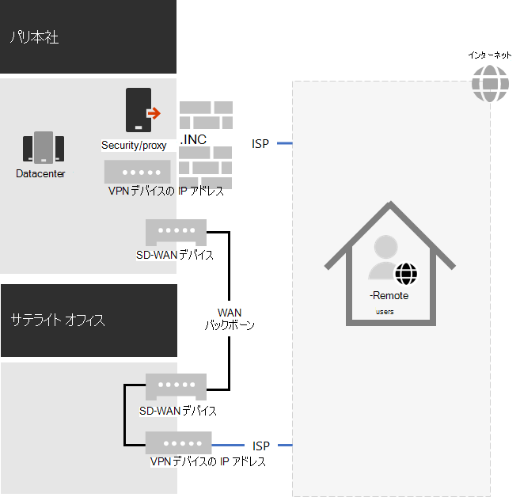
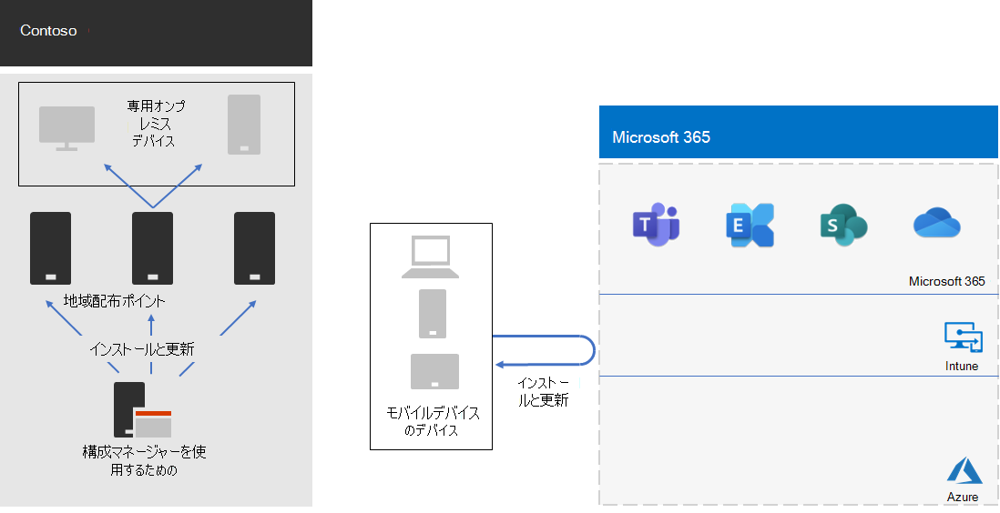

# Contoso 社の COVID-19 の応答とハイブリッド作業のサポート

Contoso 社は、常にリモート ワーカーをサポートし、パリ本社の中央 VPN サーバーを介してオンプレミスのリソースにアクセスしました。 Contoso 社は、すべてのリモート ワーカーに管理対象ラップトップを発行しました。 オンプレミスのワーカーには、デスクトップ コンピューターとラップトップが混じり合っていた。

## COVID-19 に対する Contoso の応答

COVID-19 パンデミックが始め、突然、不可欠な労働者を含むすべてがリモート ワーカーでした。 Contoso 社は、従業員を自宅から仕事に移行し、オンプレミスのリソースへのリモート アクセスとクラウド サービスを使用したオンラインによる主要なアクティビティMicrosoft 365しました。

Contoso 社は、既にリモートワークフォースの 25% をサポートするためにパリ本社オフィスにリモート アクセス VPN サーバーを持っていたが、従業員の 90% をサポートするリモート アクセス容量を拡大するために迅速に移行しました。 Contoso 社は、リモート ワーカーが Contoso イントラネットへのアクセスに地域的に近いエントリ ポイントを使用するために、各サテライト オフィスにリモート アクセス VPN サーバーを展開しました。

Contoso 社は、スプリット トンネリング用のノート PC、タブレット、スマートフォンにインストールされている VPN クライアントの構成を更新し、Office 365 エンドポイントのオプティマイズ セットのトラフィックが VPN 接続をバイパスし、インターネット上で直接送信されました。 詳細については、「VPN スプリット トン[ネリングを使用Office 365ユーザーの接続を最適化する」を参照してください](../enterprise/microsoft-365-vpn-split-tunnel.md)。

パリ本社と各サテライト オフィスに VPN デバイスをインストールした結果の構成を次に示します。 

インストールされた VPN クライアントを持つリモート ワーカーは、DNS を使用して地域に最も近いオフィスを検索し、そこにインストールされている VPN デバイスに接続します。 スプリット トンネリングを使用すると、オプティマイズ エンドポイントMicrosoft 365へのトラフィックは、ネットワークの場所に最も近い地域にMicrosoft 365されます。 その他のすべてのトラフィックは、VPN 接続を通して VPN デバイスに送信されます。

## Contoso 社によるハイブリッド作業のサポート

地域ロックダウン時に主にリモート ワーカーをサポートするために最初の変更が行われた後、Contoso 社は、次のようなハイブリッド作業をサポートするためにインフラストラクチャを変更しました。

- 常にリモート。
- 常にオンサイト。
- オンサイトとリモートの組み合わせ。

Microsoft 365、セキュリティ、コンプライアンス機能は、ゼロトラスト用に設計され、ユーザーとそのデバイスの場所に関係なく動作するように設計されています。 詳細については、「Zero [Trust」を参照してください](https://www.microsoft.com/security/business/zero-trust)。

ただし、ソフトウェアの新しいインストールと更新プログラムの管理は、インストールするソフトウェアがオンプレミスまたはインターネット ソースから提供される可能性があるため、デバイスの場所に依存します。 Contoso IT アーキテクトは、ワーカーではなく、デバイスの場所に基づいて新しいインストールと更新インフラストラクチャを設計しました。

専用のオンプレミスとローミングの 2 種類のデバイスを指定しました。

### 専用のオンプレミス

専用のオンプレミス デバイスは、Contoso イントラネットから離れたことがないデスクトップまたはサーバー コンピューターであり、VPN クライアントがインストールされていません。 これらのオンプレミス デバイスは、Microsoft Endpoint Configuration Manager、Microsoft 365 Apps for enterprise、エッジ ブラウザーのインストールと更新に引き続き Windows 10 とその配布ポイントを使用します。

### ローミング

ローミング デバイスは Contoso イントラネットから離れ、Contoso VPN クライアントがインストールされたスマートフォンやタブレットなど、多くのオフィス ワーカーとすべてのリモート ワーカー、その他の組織が所有するデバイスに発行されたラップトップを含む場合があります。 

これらのデバイスは、いつでもインターネットに接続できるので、intune または他のクラウドベースのサービスを使用して、Windows 10、Microsoft 365 Apps for enterprise、および Edge のインストールと更新を行います。 既存のオンプレミスの Configuration Manager 配布ポイントは使用しない。

つまり、ローミング デバイスのインストールと更新の一部は、オンプレミスでイントラネットに接続されている間、インターネット上で行われます。 しかし、Contoso IT アーキテクトは、特にほとんどのリモート ワーカーがイントラネットにほとんど接続されていない場合、インターネットへのイントラネット帯域幅の最適化よりも、構成の簡素化が重要だと決定しました。

結果のインフラストラクチャを次に示します。

インストールと更新の動作は、デバイスのコンピューター アカウントを次のいずれかのグループのメンバーにすることで決まります。

- OnPremDevices

  デバイス上の Configuration Manager クライアントは、インストールと更新に配布ポイントを使用します。

- RoamingDevices

  Intune およびデバイス上の他の設定では、インストールと更新にMicrosoft 365ネットワークの使用を指定します。

## 新しいオンボーディング プロセス

新しいワーカーまたはデータセンター内の新しいサーバーに発行された新しい専用のオンプレミス デバイスの場合、ワーカーがサインインすると、OnPremDevices グループのデバイスのメンバーシップに基づいて Configuration Manager クライアントが、Windows 10、Microsoft 365 Apps for enterprise、および Edge の最新の更新プログラムをオンプレミス構成マネージャー配布ポイントからダウンロードしてインストールします。 完了すると、専用のオンプレミス デバイスを使用する準備が整い、これらの配布ポイントを継続的な更新に使用します。

新しいワーカーに発行された新しいリモート デバイスの場合、ワーカーがサインインすると、RoamingDevices グループのメンバーシップに基づいてデバイスが Intune クラウド サービスや他のサービスに連絡し、Windows 10、Microsoft 365 Apps for enterprise、および Edge の最新の更新プログラムをダウンロードしてインストールします。 完了すると、リモート デバイスを使用する準備が整い、インストールされた VPN クライアントを使用してオンプレミス のリソースにアクセスし、継続的な更新のためにMicrosoft 365ネットワークを使用します。

## 次の手順

[組織内のハイブリッド作業のためのインフラストラクチャを](empower-people-to-work-remotely.md) セットアップします。
