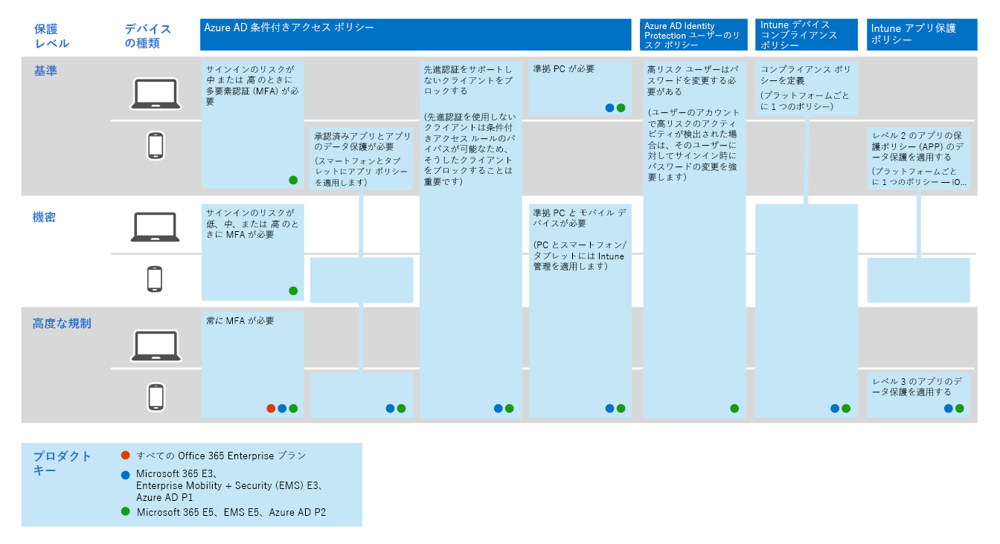

# Microsoft 365 で脅威保護機能を構成する

次の手順に従って、Microsoft 365 全体の脅威保護を構成します。

## 手順 1: 多要素認証および条件付きアクセスポリシーを設定する

[多要素認証](https://docs.microsoft.com/azure/active-directory/authentication/concept-mfa-howitworks)(MFA) では、ユーザーが電話またはオーセンティケータアプリで自分の身元を確認する必要があります。 [条件付きアクセスポリシー](https://docs.microsoft.com/azure/active-directory/conditional-access/overview)は、ユーザーが Microsoft 365 でアプリとデータにアクセスするために満たす必要のある特定の要件を定義します。 MFA および条件付きアクセスポリシーは、組織を保護するために連携して機能します。 たとえば、ユーザーが MFA を有効にしていないアカウントを使用してモバイルデバイスからサインインしようとした場合、条件付きアクセスポリシーを有効にする必要がある場合、そのユーザーはサインインできません。  

Microsoft は、すべての SaaS アプリケーション (特に Microsoft 365) へのアクセスを保護するために、特定の条件付きアクセスと関連ポリシーのセットをテストし、推奨しています。 ポリシーは、ベースライン、機密、および高度な規制保護に対して推奨されます。 最初に、ベースライン保護のポリシーを実装します。 

 
 [この画像の大規模なバージョンの表示](https://github.com/MicrosoftDocs/microsoft-365-docs/raw/public/microsoft-365/media/Identity_device_access_policies_byplan.png)

### Microsoft 365 のベースライン保護を実装するには

 

1. [Azure Id 保護を含む、前提条件を構成](../enterprise/identity-access-prerequisites.md)します。
2. ベースライン保護用の[一般的な id およびデバイスアクセスポリシーを構成](../enterprise/identity-access-policies.md)します。
3. [ゲストユーザー](../enterprise/identity-access-policies-guest-access.md)、 [Microsoft Teams](../enterprise/teams-access-policies.md)、 [Exchange Online](../enterprise/secure-email-recommended-policies.md)、および[SharePoint online と OneDrive](../enterprise/sharepoint-file-access-policies.md)のポリシーを構成します。

### Id の保護に関する詳細情報

- [ID とデバイスのアクセス構成](../enterprise/microsoft-365-policies-configurations.md)
- [Azure MFA のセキュリティガイダンス](https://docs.microsoft.com/azure/active-directory/authentication/multi-factor-authentication-security-best-practices)

## 手順 2: Azure Advanced Threat Protection を構成する

[Azure Advanced Threat Protection](https://docs.microsoft.com/azure-advanced-threat-protection/what-is-atp) (azure ATP) は、クラウドベースのセキュリティソリューションであり、オンプレミスの[azure Active Directory](https://docs.microsoft.com/azure/active-directory/fundamentals/active-directory-whatis)信号と連携して、高度な脅威、侵害された id、および悪意のある内部者の操作を組織に対して識別、検出、調査します。

Azure ATP を使用すると、セキュリティ操作 (SecOps) アナリストおよびセキュリティ担当者は、ハイブリッド環境での高度な攻撃の検出に追われ、次のことを行うことができます。
- 学習ベースの分析を使用して、ユーザー、エンティティの動作、アクティビティを監視します。
- Active Directory に保存されているユーザーの ID と認証情報の保護。
- キル チェーン全体で疑わしいユーザー アクティビティや高度な攻撃を特定し、調査する。
- 迅速なトリアージのために、簡潔なタイムラインで示された明確なインシデント情報を提供する。

### Azure ATP を設定するには

 

1. プライマリ環境を保護するように[AZURE ATP を設定](https://docs.microsoft.com/azure-advanced-threat-protection/install-atp-step1)します。
2. すべての[ドメインコントローラー](https://docs.microsoft.com/azure-advanced-threat-protection/atp-sensor-monitoring)と[フォレスト](https://docs.microsoft.com/azure-advanced-threat-protection/atp-multi-forest)を保護します。
3. [AZURE ATP アラート](https://docs.microsoft.com/azure-advanced-threat-protection/suspicious-activity-guide?tabs=external)をセキュリティ操作 (secops) ワークフローに統合する。

### Azure ATP の詳細情報

- [Azure ATP とは](https://docs.microsoft.com/azure-advanced-threat-protection/what-is-atp)
- [ビデオ: Azure ATP の概要](https://www.youtube.com/watch?reload=9&v=EGY2m8yU_KE)
- [Azure ATP の展開](https://docs.microsoft.com/azure-advanced-threat-protection/what-is-atp#whats-next)

## 手順 3: Microsoft の脅威保護を有効にする

[Microsoft の脅威保護](https://docs.microsoft.com/microsoft-365/security/mtp/microsoft-threat-protection)は、1つのソリューションに信号と調整機能を統合します。 統合された Microsoft の脅威保護ソリューションを使用することで、セキュリティ担当者は、これらの各製品が脅威のすべての範囲と影響を受信して判断することを伝える脅威に対して協力することができます。環境にどのように対応したか、どのような影響を受けるか、どのように組織にどのように影響しているか。 Microsoft の脅威保護は、攻撃を阻止または停止したり、影響を受けるメールボックス、エンドポイント、ユーザー id を自己回復させるための自動操作を行います。

Microsoft の脅威保護は、アラート、インシデント、自動化された調査と応答を統合し、ワークロード全体にわたる高度な検索 (Azure ATP、Office 365 ATP、Microsoft Defender ATP、および Microsoft Cloud App Security) を単一ウィンドウのガラス環境に統一します。 1つ以上の advanced threat protection サービスを構成した後、Microsoft の脅威保護を有効にします。 新機能は、絶えず Microsoft の脅威保護に追加されます。プレビュー機能を受信するには、をオプトインすることを検討してください。

### Microsoft の脅威保護をセットアップするには

 

1. [前提条件を確認](https://docs.microsoft.com/microsoft-365/security/mtp/prerequisites)します。
2. [Microsoft の脅威保護を有効](https://docs.microsoft.com/microsoft-365/security/mtp/mtp-enable)にします。
3. [プレビュー機能のオプトイン](https://docs.microsoft.com/microsoft-365/security/mtp/preview)。

### Microsoft 脅威保護の詳細情報

- [Microsoft Threat Protection とは](https://docs.microsoft.com/microsoft-365/security/mtp/microsoft-threat-protection)
- [Microsoft Threat Protection の新機能](https://docs.microsoft.com/microsoft-365/security/mtp/whats-new)

## 手順 4: Office 365 Advanced Threat Protection を構成する

[Office 365 Advanced Threat Protection](https://docs.microsoft.com/microsoft-365/security/office-365-security/office-365-atp) (OFFICE 365 ATP) は、電子メールメッセージ (添付ファイルと url)、Office ドキュメント、コラボレーションツールにおける悪意のある脅威から組織を保護します。 次の表に、Microsoft 365 E5 に含まれる Office 365 ATP の機能と機能を示します。

|構成、保護、および検出の各機能|自動化、調査、修復、教育機能|
|---|---|
|[添付ファイル保護](https://docs.microsoft.com/microsoft-365/security/office-365-security/atp-safe-attachments) [リンク保護](https://docs.microsoft.com/microsoft-365/security/office-365-security/atp-safe-links) [安全なドキュメント](https://docs.microsoft.com/microsoft-365/security/office-365-security/safe-docs) [SharePoint、OneDrive、Microsoft Teams 用の ATP](https://docs.microsoft.com/microsoft-365/security/office-365-security/atp-for-spo-odb-and-teams) [ATP のフィッシング対策保護](https://docs.microsoft.com/microsoft-365/security/office-365-security/set-up-anti-phishing-policies#exclusive-settings-in-atp-anti-phishing-policies)|[脅威トラッカー](https://docs.microsoft.com/microsoft-365/security/office-365-security/threat-trackers) [脅威エクスプローラー](https://docs.microsoft.com/microsoft-365/security/office-365-security/threat-explorer) [自動調査および対応](https://docs.microsoft.com/microsoft-365/security/office-365-security/office-365-air) [攻撃シミュレータ](https://docs.microsoft.com/microsoft-365/security/office-365-security/attack-simulator)|
|

Office 365 ATP を使用すると、組織内のユーザーは、電子メールコンテンツと Office ドキュメントの脅威を保護することで、より安全に通信および共同作業を行うことができます。

### Office 365 ATP をセットアップするには

 

1. [Office 365 ATP ポリシーをセットアップおよび構成](https://docs.microsoft.com/microsoft-365/security/office-365-security/protect-against-threats)します。
2. [Office 365 ATP レポートを表示して使用](https://docs.microsoft.com/microsoft-365/security/office-365-security/view-reports-for-atp)します。
3. [脅威の調査と応答の機能を使用](https://docs.microsoft.com/microsoft-365/security/office-365-security/office-365-ti)します。

### Office 365 ATP の詳細情報

- [Office 365 ATP の概要](https://docs.microsoft.com/microsoft-365/security/office-365-security/office-365-atp)
- [Office 365 ATP の新機能](https://docs.microsoft.com/microsoft-365/security/office-365-security/whats-new-in-office-365-atp)

## 手順 5: Microsoft Defender Advanced Threat Protection を構成する

[Microsoft Defender Advanced Threat Protection](https://docs.microsoft.com/windows/security/threat-protection) (MICROSOFT defender ATP) は、脅威、高度な攻撃、データ侵害から組織のデバイス (エンドポイントとも呼ばれます) を保護します。 セキュリティチームは、エンドポイントのセキュリティをより効率的に管理することができます。 堅牢なツールにより、組織は脆弱性検出を使用して unpatched システムを[脅威と脆弱性を管理](https://docs.microsoft.com/windows/security/threat-protection/microsoft-defender-atp/next-gen-threat-and-vuln-mgt)していくことができます。 [攻撃対象領域の削減](https://docs.microsoft.com/windows/security/threat-protection/microsoft-defender-atp/overview-attack-surface-reduction)、[次世代の保護](https://docs.microsoft.com/windows/security/threat-protection/windows-defender-antivirus/windows-defender-antivirus-in-windows-10)、[エンドポイントの検出と応答](https://docs.microsoft.com/windows/security/threat-protection/microsoft-defender-atp/overview-endpoint-detection-response)、自動化された[調査と修復](https://docs.microsoft.com/windows/security/threat-protection/microsoft-defender-atp/automated-investigations)などの自動化された検出および修復の機能により、デバイスはマルウェアから安全に保持されます。 これらの機能の上に、お客様は事前の通知を受け取り、オプトイン管理対象のサービスの一部として、必要に応じて Microsoft の脅威の専門家に問い合わせることができます。 

### Microsoft Defender ATP をセットアップする

 

1. [Microsoft DEFENDER ATP の展開を準備](https://docs.microsoft.com/windows/security/threat-protection/microsoft-defender-atp/deployment-phases)します。
2. [Microsoft Defender ATP の展開をセットアップする](https://docs.microsoft.com/windows/security/threat-protection/micros.oft-defender-atp/production-deployment)
3. [Microsoft DEFENDER ATP サービスに内蔵](https://docs.microsoft.com/windows/security/threat-protection/microsoft-defender-atp/onboarding)されています。
4. [最上位のセキュリティ管理タスクを完了](https://docs.microsoft.com/windows/security/threat-protection/microsoft-defender-atp/tvm-security-recommendation)します。

### Microsoft Defender ATP の詳細情報

- [Microsoft DEFENDER ATP の詳細について](https://docs.microsoft.com/windows/security/threat-protection)は、こちらを参照してください。
- [Microsoft DEFENDER ATP 評価研究所をお試しください](https://docs.microsoft.com/windows/security/threat-protection/microsoft-defender-atp/evaluation-lab)。

## 手順 6: Microsoft Cloud App Security を構成する

[Microsoft Cloud App security](https://docs.microsoft.com/cloud-app-security)は、ログ収集、API コネクタ、リバースプロキシをサポートするクラウドアクセスセキュリティブローカーです。 Microsoft Cloud App Security は、豊富な可視性、データ移動の制御、および高度な分析を提供して、すべてのクラウドサービス全体にわたる脅威を識別して対処します。 Microsoft Cloud App Security を使用すると、セキュリティ操作によって組織の機密情報の保護、脅威および異常に対する保護、組織のデータにアクセスするアプリの検出と監視、組織のクラウドアプリがコンプライアンス要件を満たしていることの確認に役立ちます。

### Microsoft Cloud App Security をセットアップする

 

1. [ポータルおよびその他の基本的な要件を設定](https://docs.microsoft.com/cloud-app-security/general-setup)します。
2. [クラウド検出を設定](https://docs.microsoft.com/cloud-app-security/set-up-cloud-discovery)し、[アプリを接続](https://docs.microsoft.com/cloud-app-security/enable-instant-visibility-protection-and-governance-actions-for-your-apps)します。
3. [おすすめのアプリに対して条件付きアクセスアプリコントロールを展開](https://docs.microsoft.com/cloud-app-security/proxy-deployment-aad)します。
4. [調査ツールおよびダッシュボードを使用](https://docs.microsoft.com/cloud-app-security/investigate)します。

### Microsoft Cloud App Security の詳細情報

- [新しい機能を確認](https://docs.microsoft.com/cloud-app-security/release-notes)します。
- [詳細については、「Microsoft Cloud App Security](https://docs.microsoft.com/cloud-app-security/what-is-cloud-app-security)」を参照してください。

## 手順 7: 状態を監視し、アクションを実行する

脅威保護のサービスと機能を設定して展開した後、次の手順として、脅威の検出を監視し、適切な操作を行います。 最適な出発点は、microsoft 365 セキュリティセンター () を使用して、 [https://security.microsoft.com](https://security.microsoft.com) microsoft id、データ、デバイス、アプリ、およびインフラストラクチャ全体のセキュリティを監視および管理できます。 

Microsoft 365 セキュリティセンターは、特にセキュリティ管理者およびセキュリティ運用チームを対象としています。 Microsoft 365 セキュリティセンターでは、次のことを行うことができます。
- セキュリティ[で保護さ](https://docs.microsoft.com/microsoft-365/security/mtp/microsoft-secure-score)れたスコアを使用して、組織の全体的なセキュリティの状態を表示します。
- Id、データ、デバイス、アプリ、およびインフラストラクチャの状態に関する[レポートを監視および表示し](https://docs.microsoft.com/microsoft-365/security/mtp/monitoring-and-reporting)ます。
- 警告のドットを[インシデント](https://docs.microsoft.com/microsoft-365/security/mtp/incident-queue)で接続します。
- 自動化された[調査と修復](https://docs.microsoft.com/microsoft-365/security/mtp/mtp-autoir)を使用して脅威に対処します。
- 侵入の試行、電子メール、データ、デバイス、および id に影響する侵入行為など[の脅威を事前に探し](https://docs.microsoft.com/microsoft-365/security/mtp/advanced-hunting-overview)ます。
- 脅威分析に関する[最新の攻撃キャンペーン](https://docs.microsoft.com/microsoft-365/security/mtp/latest-attack-campaigns)および手法を理解します。
- ...その他

### Microsoft 365 セキュリティセンターの詳細情報

- [Microsoft 365 セキュリティセンターを使用して作業を開始](https://docs.microsoft.com/microsoft-365/security/mtp/overview-security-center)します。
- [レポートを監視および表示](https://docs.microsoft.com/microsoft-365/security/mtp/monitoring-and-reporting)します。
- [「Microsoft 365 のセキュリティポータル」を参照してください](https://docs.microsoft.com/microsoft-365/security/mtp/portals)。

## 手順 8: ユーザーをトレーニングする

トレーニングユーザーは、ユーザーおよびセキュリティ運用チームの時間とイライラを大幅に節約できます。 経験豊富なユーザーは、添付ファイルを開いたり、疑わしい電子メールメッセージ内のリンクをクリックしたりする可能性が低くなり、疑わしい web サイトを避けられる可能性が高くなります。 

Harvard ケネディ School [Cybersecurity キャンペーンハンドブック](https://go.microsoft.com/fwlink/?linkid=2015598&amp;clcid=0x409)は、フィッシング攻撃を識別するユーザーのトレーニングを含む、組織内でのセキュリティの認知度の強力な文化を確立するための優れたガイダンスを提供します。 

Microsoft 365 には、組織内のユーザーに通知するための以下のリソースが用意されています。

|概念  |リソース  |
|---------|---------|
|Microsoft 365     |[カスタマイズ可能な学習経路](https://docs.microsoft.com/office365/customlearning/) 
これらのリソースは、組織内のエンドユーザーのトレーニングをまとめる際に役立ちます。        |
|Microsoft 365 セキュリティ |[学習モジュール: Microsoft 365 からの組み込みのインテリジェントセキュリティを使用して組織を保護します。](https://docs.microsoft.com/learn/modules/security-with-microsoft-365) 
このモジュールでは、Microsoft 365 のセキュリティ機能がどのように連携するかを説明し、これらのセキュリティ機能の利点を明確に示すことができます。 |
|多要素認証     | [2段階認証: 追加の検証ページとは](https://docs.microsoft.com/azure/active-directory/user-help/multi-factor-authentication-end-user-first-time) 
この記事では、エンドユーザーが多要素認証の内容と、組織で使用されている理由を理解するのに役立てることができます。    |

このガイダンスに加えて、次の操作を実行することをお勧めします。この記事では、[ハッカーやマルウェアからのアカウントとデバイスの保護](https://support.office.com/article/066d6216-a56b-4f90-9af3-b3a1e9a327d6.aspx)について説明します。 それらの操作を次に示します。
- 強力なパスワードの使用
- デバイスを保護する 
- Windows 10 および Mac Pc でセキュリティ機能を有効にする (管理されていないデバイスの場合)
    
また、次の記事で推奨されている操作を実行して、ユーザーが個人のメールアカウントを保護することをお勧めします。
- [Outlook.com メールアカウントを保護する](https://support.microsoft.com/en-us/office/help-protect-your-outlook-com-email-account-a4f20fc5-4307-4ece-8231-6d4d4bd8a9ba)
- [2段階認証を使用して Gmail アカウントを保護する](https://go.microsoft.com/fwlink/?linkid=2015688&amp;clcid=0x409)
