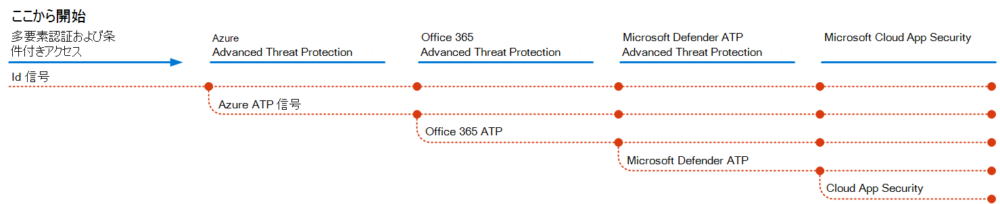

# Microsoft 365 で脅威保護機能を展開する

[マルウェア](https://docs.microsoft.com/windows/security/threat-protection/intelligence/understanding-malware)、および [fileless の脅威](https://docs.microsoft.com/windows/security/threat-protection/intelligence/fileless-threats)などの高度な cyberattacks は、頻繁に発生します。 企業は、効果的な IT ネットワークセキュリティ機能を使用して、自分と顧客を保護する必要があります。 このような攻撃によって、組織にとって重要な問題が発生する可能性があります。これには、信頼の喪失から財務 woes、業務上の脅威などがあります。 脅威からの保護は重要ですが、組織の時間、労力、リソースを重視する場所を決定するのは困難な場合があります。 

マイクロソフトのセキュリティソリューションは、microsoft の製品とサービスに組み込まれています。 自動化およびコンピューターの学習機能により、セキュリティチームの負荷が軽減され、適切なアイテムが確実に宛先になるようになります。 また、Microsoft ネットワークセキュリティソリューションの強度は、 [インテリジェントなセキュリティグラフ](https://cloud-platform-assets.azurewebsites.net/intelligent-security-graph)で毎日処理する trillions の信号に基づいて構築されています。 Microsoft 365 セキュリティソリューションには、 [microsoft 365 Defender](https://docs.microsoft.com/microsoft-365/security/mtp/microsoft-threat-protection)が含まれています。このソリューションは、電子メール、データ、デバイス、および id の間で、組織に対して高度な脅威の画像をペイントするための情報をまとめたものです。

このビデオでは、展開プロセスの手順の概要について説明します。

> [!VIDEO https://www.microsoft.com/videoplayer/embed/RE4vsI7]

この記事は、脅威保護ソリューションを実装するためのガイドとして使用してください。

## Microsoft 365 E5 の脅威保護

[Microsoft 365 E5](https://www.microsoft.com/microsoft-365/enterprise-e5-business-software?activetab=pivot%3aoverviewtab) を使用すると、組織をアダプティブに組み込まれたインテリジェンスで保護することができます。 Microsoft 365 E5 の脅威保護機能を使用すると、オンプレミスの環境とクラウド環境で、高度な脅威、侵害された id、および悪意のあるアクションを検出して調査できます。

Microsoft 365 E5 では、脅威保護機能は既定で統合されています。 各機能を追加することにより、脅威を検出して応答する全体的な能力に対する通知を行います。 機能の組み合わせによって、Microsoft 以外の製品を実行するのと比較して、組織にとって最適な保護を提供します。 次の図は、この記事で説明する Microsoft 365 E5 の脅威保護サービスと機能を示しています。

いずれかの Defender for Office 365 機能を展開すると、Microsoft 365 Defender をオンにすることができます。これにより、シグナルとデータが1つの場所にまとめられます。 

次の図は、これらの個々の機能を展開するための推奨パスを示しています。 

|ソリューション/機能  |説明  |
|---------|---------|
|多要素認証および条件付きアクセス     |侵害された id とデバイスから保護します。 基礎となるため、この保護を使用して開始します。 このガイダンスで推奨される構成には、前提条件としての Azure AD Identity Protection が含まれています。     |
|Id の Microsoft Defender     |  オンプレミスの Active Directory シグナルを活用して、組織に向けた高度な脅威、侵害された id、悪意のある insider 操作を特定、検出、調査する、クラウドベースのセキュリティソリューション。 オンプレミスとクラウドインフラストラクチャを保護し、依存関係または前提条件を持たず、すぐにメリットを得られるため、Microsoft Defender で Id を使用することに重点を置いてください。       | 
|Microsoft Defender for Office 365     | 電子メールメッセージ、リンク (Url)、およびコラボレーションツールがもたらす悪意のある脅威から組織を保護します。 マルウェア、フィッシング、スプーフィング、その他の攻撃の種類に対する保護。 Microsoft Defender for Office 365 を構成することをお勧めします。これは、変更制御、変更によって課せられた設定の移行、およびその他の考慮事項の展開に時間がかかることがあるからです。   注: すべての Office 365 サブスクリプション (Exchange Online Protection) に含まれる脅威保護機能を構成してください。       |
|Microsoft Defender for Endpoint    | 高度な脅威の防止、検出、調査、および応答に役立つエンドポイント保護プラットフォーム。  エンドポイントの Defender は展開に時間がかかる場合がありますが、構成は他の機能と並行して実行できます。   |
|Microsoft Cloud App Security     |   検出、調査、ガバナンスのためのクラウドアクセスセキュリティブローカー。 Microsoft Cloud App Security を事前に有効にして、データの収集と洞察を開始することができます。 SaaS アプリ間での情報およびその他の対象保護を実装するには、計画を行い、多くの時間を要することがあります。       | 

> [!TIP]
> 複数のセキュリティチームを持つ組織は、これらの機能を並行して実装することができます。

## 脅威保護ソリューションを展開する

組織で最大限の保護が実現されていることを確認するには、セキュリティソリューションをセットアップして展開し、次の手順を行います。

1. [多要素認証および条件付きアクセスポリシーを設定する](deploy-threat-protection-configure.md#step-1-set-up-multi-factor-authentication-and-conditional-access-policies)
2. [Id 用に Microsoft Defender を構成する](deploy-threat-protection-configure.md#step-2-configure-microsoft-defender-for-identity)
3. [Microsoft 365 Defender をオンにする](deploy-threat-protection-configure.md#step-3-turn-on-microsoft-365-defender)
4. [Office の Defender を構成する365](deploy-threat-protection-configure.md#step-4-configure-microsoft-defender-for-office-365)
5. [エンドポイントの Microsoft Defender を構成する](deploy-threat-protection-configure.md#step-5-configure-microsoft-defender-for-endpoint)
6. [Microsoft Cloud App Security を構成する](deploy-threat-protection-configure.md#step-6-configure-microsoft-cloud-app-security)
7. [状態を監視し、アクションを実行する](deploy-threat-protection-configure.md#step-7-monitor-status-and-take-actions)
8. [ユーザーのトレーニング](deploy-threat-protection-configure.md#step-8-train-users)

脅威保護機能は並行して構成できるため、複数のネットワークセキュリティチームが異なるサービスを担当している場合は、組織の保護機能を同時に構成することができます。 次の図は、脅威保護機能を展開するための大まかなプロセスを示しています。 

 
