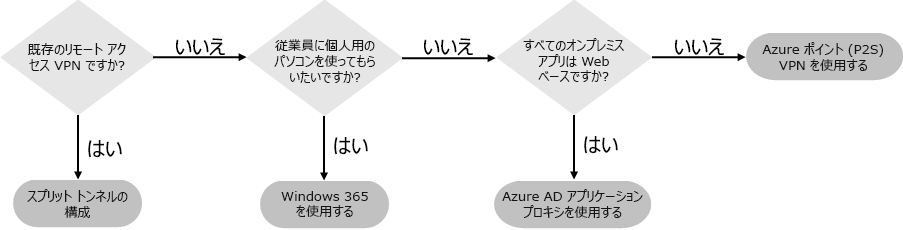
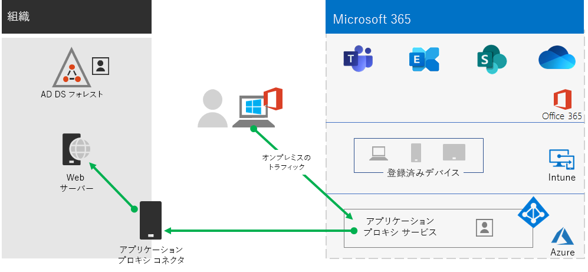
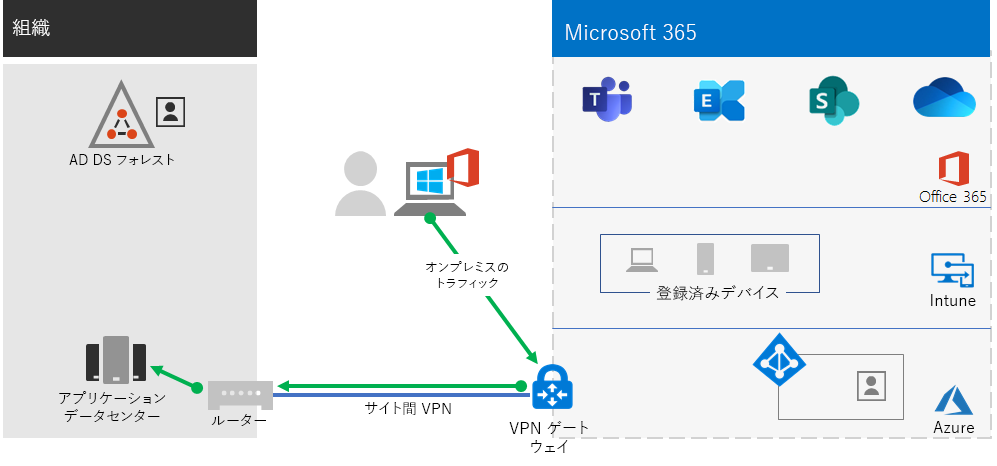

# 手順 2. Step 2. オンプレミスのアプリとサービスへのリモート アクセスを提供します。Provide remote access to on-premises apps and services

組織でリモートアクセス VPN ソリューションを使用している場合 (通常、ネットワークのエッジに VPN サーバー、ユーザーのデバイスにインストールされた VPN クライアントがある場合)、ユーザーはリモートアクセス VPN 接続を使用してオンプレミスのアプリやサーバーにアクセスできます。If your organization uses a remote access VPN solution, typically with VPN servers on the edge of your network and VPN clients installed on your users' devices, your users can use remote access VPN connections to access on-premises apps and servers. ただし、Microsoft 365 クラウドベース サービスへのトラフィックを最適化することが必要になる場合があります。But you may need to optimize traffic to Microsoft 365 cloud-based services.

ユーザーが VPN ソリューションを使用していない場合は、すべてのアプリが Web ベースであるかどうかに応じて、Azure Active Directory (Azure AD) アプリケーション プロキシと Azure Point-to-Site (P2S) VPN を使用してアクセスを提供できます。If your users do not use a VPN solution, you can use Azure Active Directory (Azure AD) Application Proxy and Azure Point-to-Site (P2S) VPN to provide access, depending on whether all your apps are web-based.

次の 3 つの主要な構成があります。There are three primary configurations:

1. 既にリモート アクセス VPN ソリューションを使用しています。You are already using a remote access VPN solution.
2. リモート アクセス VPN ソリューションを使用しておらず、ハイブリッド ID があり、オンプレミスの Web ベースのアプリへのリモート アクセスのみが必要です。You are not using a remote access VPN solution, you have hybrid identity, and you need remote access only to on-premises web-based apps.
3. リモート アクセス VPN ソリューションを使用しておらず、オンプレミス アプリへのアクセスが必要であり、その一部は Web ベースではありません。You are not using a remote access VPN solution and you need access to on-premises apps, some of which are not web-based.

この記事で説明するリモート アクセス構成オプションについては、このフローチャートを参照してください。See this flowchart for the remote access configuration options discussed in this article.

リモート アクセス接続では、[リモート デスクトップ](https://support.microsoft.com/help/4028379/windows-10-how-to-use-remote-desktop)を使用して、ユーザーをオンプレミス PC に接続することもできます。With remote access connections, you can also use [Remote Desktop](https://support.microsoft.com/help/4028379/windows-10-how-to-use-remote-desktop) to connect your users to an on-premises PC. たとえば、リモート ワーカーはリモート デスクトップを使用して、Windows、iOS、または Android デバイスからオフィスの PC に接続できます。For example, a remote worker can use Remote Desktop to connect to the PC in their office from their Windows, iOS or Android device. リモートで接続すると、目の前に座っているかのように使用できます。Once they are remotely connected, they can use it as if they were sitting in front of it.

## Microsoft 365 クラウド サービスへのリモート アクセス VPN クライアントのパフォーマンスを最適化するOptimize performance for remote access VPN clients to Microsoft 365 cloud services

リモート ワーカーが従来の VPN クライアントを使用して組織ネットワークへのリモート アクセスを取得している場合は、VPN クライアントがスプリット トンネリング サポートを備えていることを確認してください。If your remote workers are using a traditional VPN client to obtain remote access to your organization network, verify that the VPN client has split tunneling support.

スプリット トンネリングを使用しない場合、すべてのリモート作業トラフィックは VPN 接続を介して送信され、そこで組織のエッジ デバイスに転送されて処理され、インターネット上で送信される必要があります。Without split tunneling, all of your remote work traffic gets sent across the VPN connection, where it must be forwarded to your organization’s edge devices, get processed, and then sent on the Internet.

Microsoft 365 トラフィックは、組織を経由して間接的にルーティングする必要があります。これは、VPN クライアントの物理的な場所から遠く離れた Microsoft ネットワーク エントリ ポイントに転送される可能性があります。Microsoft 365 traffic must take an indirect route through your organization, which could be the forwarded to a Microsoft network entry point far away from the VPN client’s physical location. この間接パスにより、ネットワーク トラフィックが遅延し、全体的なパフォーマンスを低下させます。This indirect path adds latency to the network traffic and decreases overall performance. 

スプリッ トトンネリングを使用すると、VPN クライアントを構成して、特定の種類のトラフィックが VPN 接続を介して、組織ネットワークに送信されることを除外できます。With split tunneling, you can configure your VPN client to exclude specific types of traffic from being sent over the VPN connection to the organization network.

Microsoft 365 クラウドリソースへのアクセスを最適化するには、VPN 接続を介して、**最適化**カテゴリの Microsoft 365 エンドポイントへのトラフィックを除外するようにスプリット トンネリング VPN クライアントを構成します。To optimize access to Microsoft 365 cloud resources, configure your split tunneling VPN clients to exclude traffic to the **Optimize** category Microsoft 365 endpoints over the VPN connection. 詳細については、「[Office 365 エンドポイントのカテゴリ](https://docs.microsoft.com/office365/enterprise/office-365-network-connectivity-principles#new-office-365-endpoint-categories)」をご覧ください。For more information, see [Office 365 endpoint categories](https://docs.microsoft.com/office365/enterprise/office-365-network-connectivity-principles#new-office-365-endpoint-categories). 最適化カテゴリのエンドポイントのリストについては、[こちら](https://docs.microsoft.com/office365/enterprise/urls-and-ip-address-ranges)をご覧ください。See the list of Optimize category endpoints [here](https://docs.microsoft.com/office365/enterprise/urls-and-ip-address-ranges).

これにより、VPN クライアントは、インターネット経由で、または Microsoft ネットワークへの最も近いエントリポイントに、重要な Microsoft 365 クラウド サービスのトラッフィックを送受信できます。This allows the VPN client to send and receive crucial Microsoft 365 cloud service traffic directly over the Internet and to the nearest entry point into the Microsoft network.

詳細とガイダンスについては、「[VPN スプリット トンネリングを使用してリモート ユーザーの Office 365 の接続を最適化する](https://docs.microsoft.com/office365/enterprise/office-365-vpn-split-tunnel)」をご覧ください。For more information and guidance, see [Optimize Office 365 connectivity for remote users using VPN split tunneling](https://docs.microsoft.com/office365/enterprise/office-365-vpn-split-tunnel).

## すべてのアプリが Web アプリであり、ハイブリッド ID がある場合にリモート アクセスを展開するDeploy remote access when all your apps are web apps and you have hybrid identity

リモート ワーカーが従来の VPN クライアントを使用しておらず、オンプレミスのユーザー アカウントとグループが Azure AD と同期している場合は、Azure AD アプリケーション プロキシを使用して、イントラネット サーバーでホストされている Web ベースのアプリケーションに対して安全なリモート アクセスを提供できます。If your remote workers are not using a traditional VPN client and your on-premises user accounts and groups are synchronized with Azure AD, you can use Azure AD Application Proxy to provide secure remote access for web-based applications hosted on intranet servers. Web ベースのアプリケーションには、SharePoint サイト、Outlook Web Access サーバー、またはその他の Web ベースの基幹業務アプリケーションが含まれます。Web-based applications include SharePoint sites, Outlook Web Access servers, or any other web-based line of business applications. 

ここでは、Azure AD アプリケーション プロキシのコンポーネントを示します。Here are the components of Azure AD Application Proxy.

詳細については、この「[Azure AD アプリケーション プロキシの概要](https://docs.microsoft.com/azure/active-directory/manage-apps/application-proxy)」をご覧ください。For more information, see this [overview of Azure AD Application Proxy](https://docs.microsoft.com/azure/active-directory/manage-apps/application-proxy).

## すべてのアプリが Web アプリではない場合にリモート アクセスを展開するDeploy remote access when not all your apps are web apps

リモート ワーカーが従来の VPN クライアントを使用しておらず、いずれかのアプリが Web ベースではない場合は、Azure Point-to-Site (P2S) VPN を使用できます。If your remote workers are not using a traditional VPN client and any of your apps are not web-based, you can use an Azure Point-to-Site (P2S) VPN.

P2S VPN 接続は、Azure 仮想ネットワークを介してリモート ワーカーのデバイスから組織ネットワークへの安全な接続を作成します。A P2S VPN connection creates a secure connection from a remote worker’s device to your organization network through an Azure virtual network. 

詳細については、この「[P2S VPN の概要](https://docs.microsoft.com/azure/vpn-gateway/point-to-site-about)」をご覧ください。For more information, see this [overview of P2S VPN](https://docs.microsoft.com/azure/vpn-gateway/point-to-site-about).

## リモート ワーカーが個人用デバイスを使用してリモート アクセスできるように、Windows Virtual Desktop を展開するDeploy Windows Virtual Desktop to provide remote access for remote workers using personal devices 

個人用デバイスや管理されていないデバイスのみを使用できるリモート ワーカーをサポートするには、Azure の Windows Virtual Desktop を使用して、ユーザーが自宅から使用する仮想デスクトップを作成して割り当てます。To support remote workers who can only use their personal and unmanaged devices, use Windows Virtual Desktop in Azure to create and allocate virtual desktops for your users to use from home.

仮想化された PC は、組織のネットワークに接続されている PC と同じように動作します。Virtualized PCs can act just like PCs connected to your organization network.

詳細については、「[Windows Virtual Desktop の概要](https://docs.microsoft.com/azure/virtual-desktop/overview)」をご覧ください。For more information, see [this overview of Windows Virtual Desktop](https://docs.microsoft.com/azure/virtual-desktop/overview).

## リモート アクセスのための管理技術リソースAdmin technical resources for remote access

- [リモート社員の Office 365 トラフィックをすぐに最適化し、インフラストラクチャの負担を軽減する方法How to quickly optimize Office 365 traffic for remote staff & reduce the load on your infrastructure](https://techcommunity.microsoft.com/t5/office-365-blog/how-to-quickly-optimize-office-365-traffic-for-remote-staff-amp/ba-p/1214571)
- [VPN スプリット トンネリングを使用してリモート ユーザーの Office 365 の接続を最適化するOptimize Office 365 connectivity for remote users using VPN split tunneling](https://docs.microsoft.com/office365/enterprise/office-365-vpn-split-tunnel)

## 手順 2 の結果Results of Step 2

リモート アクセス ソリューションをリモート ワーカーに展開した後、次の操作を行います。After deployment of a remote access solution for your remote workers:

| リモート アクセス構成Remote access configuration | 結果Results |
|:-------|:-----|
| リモート アクセス VPN ソリューションが導入されているA remote access VPN solution is in place | リモート アクセス VPN クライアントをスプリット トンネリング用と Microsoft 365 エンドポイントの最適化カテゴリ用に構成しました。You have configured your remote access VPN client for split tunneling and for the Optimize category of Microsoft 365 endpoints. |
| リモート アクセス VPN ソリューションはなく、オンプレミスの Web ベースのアプリへのリモート アクセスのみが必要ですNo remote access VPN solution and you need remote access only to on-premises web-based apps | Azure アプリケーション プロキシを構成しました。You have configured Azure Application Proxy. |
| リモート アクセス VPN ソリューションはなく、オンプレミス アプリへのアクセスが必要であり、その一部は Web ベースではありませんNo remote access VPN solution and you need access to on-premises apps, some of which are not web-based | Azure P2S VPN を構成しました。You have configured Azure P2S VPN. |
| リモート ワーカーは自宅から個人用デバイスを使用していますRemote workers are using their personal devices from home | Windows Virtual Desktop を構成しました。You have configured Windows Virtual Desktop. |
|||

## 次の手順Next step

[手順 3](empower-people-to-work-remotely-manage-endpoints.md) に進み、デバイス、PC、およびその他のエンドポイントを管理します。Continue with [Step 3](empower-people-to-work-remotely-manage-endpoints.md) to manage your devices, PCs, and other endpoints.
