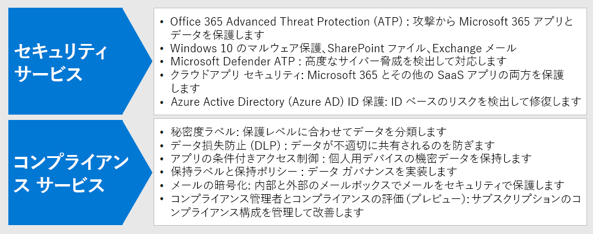

# 手順 3: リモート ワーカーのためのセキュリティとコンプライアンスの展開

リモート ワーカーの中にはオフィスを利用することが一切ない人や、利用頻度が低い人がいますが、セキュリティとコンプライアンスは、全体的なソリューションにおける重要な部分を占めています。 それらのリモート ワーカーのコミュニケーションが組織のイントラネットに限定されることはなく、すべてインターネットを介して行われます。 

サイバーセキュリティのリスクを低減し、内部ポリシーやデータ規制へのコンプライアンスを管理しながら生産性を維持するために、お客様や作業者ができることがあります。

リモート ワークには、次のセキュリティやコンプライアンスの要素が必要です。

- Microsoft Teams などの、リモート ワーカーが使用する生産性アプリに対するアクセスの制御 
- チャットの会話や共有ファイルなど、リモート ワーカーが作成して使用するデータに対するアクセスや保護の制御
- マルウェアやその他の種類のサイバー攻撃からの Windows 10 デバイスの保護
- 秘密度や保護のレベルに応じた一貫性のあるラベル付けを使用したメール、ファイル、サイトの保護
- 情報の漏洩の防止
- 地域のデータ規制への準拠

## セキュリティ

Microsoft 365 のこれらのセキュリティ機能を使用して、アプリケーションやデータを保護します。

| 機能 | 説明 | ライセンス |
|:-------|:-----|:-------|
| Office 365 Advanced Threat Protection (ATP) | メール メッセージ、Office ドキュメント、共同作業のツールなど、Microsoft 365 のアプリやデータを攻撃から保護します。    Office ATP はアプリからのシグナルを収集して分析し、セキュリティ リスクの検出、調査、修復を行い、メール メッセージ、リンク (URL)、共同作業のツールによってもたらされる悪意のある脅威から組織を保護します。 | Microsoft 365 E3 または E5 | 
| マルウェア対策 | Microsoft Defender ウイルス対策と Device Guard は、デバイスベースのマルウェア対策を提供します。    SharePoint Online では、既知のマルウェアのファイル アップロードを自動的にスキャンします。 ‎   Exchange Online Protection (EOP) は、クラウド メールボックスを保護します。 | Microsoft 365 E3 または E5 |
| Microsoft Defender ATP | サイバー攻撃の脅威やデータ侵害から組織のデバイスを保護し、高度な脅威を検出し、調査し、それらに対応します。 | Microsoft 365 E5 |
| Cloud App Security | Microsoft 365 やその他の SaaS アプリなどのクラウドベースのサービスを攻撃から保護します。 | Microsoft 365 E5 または個別のクラウド アプリのセキュリティ ライセンス |
| Azure AD Identity Protection  | ID ベースのリスクを自動的に検出して修正します。   リスクベースの条件付きアクセス ポリシーを作成し、危険なサインインに対して多要素認証 (MFA) を要求します。 | Azure AD Premium P2 ライセンスを含む Microsoft 365 E5 または E3 |
||||

詳細については、「[Microsoft 365 コンプライアンスを開始するためのクイック タスク](../compliance/compliance-quick-tasks.md)」を参照してください。

## コンプライアンス

Microsoft 365 のこれらのコンプライアンス機能を使用して、内部ポリシーや規制要件に準拠します。

| 機能 | 説明 | ライセンス |
|:-------|:-----|:-------|
| 秘密度ラベル | メール、ファイル、サイトに様々な保護レベルを持ったラベルを適用することで、ユーザーの生産性や共同作業機能を妨げることなく、組織のデータを分類して保護します。 | Microsoft 365 E3 または E5 |
| データ損失防止 (DLP) | 内部や外部での個人情報を含むデータの共有などの危険な共有、偶発的な共有、不適切な共有を検出し、警告し、ブロックします。 | Microsoft 365 E3 または E5 | 
| アプリの条件付きアクセスを制御する | 機密データがユーザーの個人用デバイスでダウンロードされるのを防止します。 | Microsoft 365 E3 または E5 |
| データの保持ラベルとポリシー | データの保持期間や、顧客の個人データの保管についての要件などの情報ガバナンスの制御を展開し、組織のポリシーやデータ規制に準拠します。 | Microsoft 365 E3 または E5 |
| Office のメッセージの暗号化 (OME) | 組織内外のユーザーとの間で、顧客の個人情報などの規制されたデータを含む暗号化されたメール メッセージを送受信します。 | Microsoft 365 E3 または E5 |
| コンプライアンス マネージャー | Microsoft Service Trust Portal のワークフローベースのリスク評価ツールを使用して、Microsoft のクラウド サービスに関連する組織の規制準拠の取り組みを管理します。 | Microsoft 365 E3 または E5 |
| コンプライアンス スコア (プレビュー) | Microsoft 365 コンプライアンス センターで、現在のコンプライアンス構成の全体のスコアと改善のための推奨事項を確認しましょう。 | Microsoft 365 E3 または E5 |
| 通信コンプライアンス  | 組織内で不適切なメッセージを検出し、取り込んで、修復処理を実行します。 | コンプライアンスまたは Insider のリスク管理アドオンを備えた Microsoft 365 E5 または Microsoft 365 E3  |
| インサイダー リスク管理 |  組織内の悪意のある不測の活動を検出および調査し、対処します。 Microsoft 365 は、ワーカーが管理されていないデバイスを使用している場合でも、これらの種類のアクティビティを検出できます。 | コンプライアンスまたは Insider のリスク管理アドオンを備えた Microsoft 365 E5 または Microsoft 365 E3  |
||||

詳細については、「[在宅勤務をサポートするセキュリティ チームのための最も重要な 12 のタスク](../security/top-security-tasks-for-remote-work.md)」を参照してください。

## 手順 3 の結果

リモートワーカーのために、次のものを実装しました。

- セキュリティ:
  - リモート ワーカーがコミュニケーションや共同作業を行うために使用するアプリやデータへのアクセス制御
  - クラウド サービスのデータ、メール、Windows 10 デバイスのマルウェア対策 
- コンプライアンス:
  - 秘密度や保護のレベルに応じた一貫性のあるラベル付け
  - 情報漏洩を防止するためのポリシー
  - 地域のデータ規制への準拠

## 次の手順

[手順 4](empower-people-to-work-remotely-manage-endpoints.md) に進み、デバイス、PC、その他のエンドポイントを管理します。
